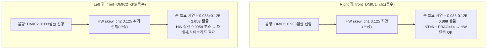

# 단계1 분석 종합 (12 페르소나)

**TL;DR**: E8300 입력 패스에는 **decimation 시분할로 인한 채널쌍 고유 스큐(짝수 ch0·2가 홀수 ch1·3보다 1/8 샘플 = 7.81µs 선행)**가 실재하며(은수님 가설 정확), 빔포밍에 필요한 **0.933 샘플 상대 지연은 `AUDIO_ADC_DEC_CTRL`의 `DELAY_INTEGER`(1/8 샘플 단위)+`DELAY_FRACTIONAL`(1/240 샘플 해상도)로 SW 버퍼 없이 HW에서 직접 부여** 가능하다. RE/FE 반주기 스큐(0.13µs)는 무시 가능. WDF 절대 group delay는 동일 대역에서 상쇄되어 상대 스큐만 유효하다.

> [!NOTE]
> 페르소나별 원본: [`에이전트-로그/인덱스.md`](에이전트-로그/인덱스.md) 01~12. 사실 근거: [`조사_데이터시트-그라운딩.md`](조사_데이터시트-그라운딩.md).

---

## 1. 요구사항_1 — 채널 간 고유 지연 (은수님 가설 검증) ✅ 확인

| 지연 성분 | 크기 | 출처 | 빔포밍 영향 |
|---|---|---|---|
| **decimation 시분할 스큐** | **1/8 샘플 = 7.81µs** (짝수 ch 선행) | HW p.222(사실A), p.445(사실B) | **유의미** — 지연 예산의 13.4% |
| RE/FE 반주기 스큐 | 0.13µs (0.0021 샘플) | HW §18.2 p.563(사실E) | **무시 가능** (필요지연의 0.22%) |
| WDF 절대 group delay | 채널 간 상쇄 (동일 대역) | HW p.445 + LTI 표준성질 | 상대지연에서 제거 |

- **은수님 가설("채널 0,2 동시 / 1,3 동시 IOC 전달")이 데이터시트로 정확히 확인됨.** decimation이 채널을 (0,1)·(2,3) 쌍으로 시분할 처리하여 짝수 채널이 1/8 샘플 먼저 출력.
- 현재 매핑(ch1=DMIC1/Right, ch2=DMIC2/Left)에서 **DMIC2(Left)가 DMIC1(Right)보다 1/8 샘플 먼저 도달.**

## 2. 요구사항_2 — HW 내부 샘플링 지연 ✅ 가능

`AUDIO_ADC_DEC_CTRL` (채널별 독립 레지스터, HW p.450-451):

| 필드 | 효과 | 범위 | 해상도 |
|---|---|---|---|
| `DELAY_INTEGER` (26:24) | "N/8 샘플 지연" (이름과 달리 1/8 단위) | 0 ~ 7/8 샘플 (0~54.7µs) | 1/8 샘플 = 7.81µs |
| `DELAY_FRACTIONAL` (21:16) | 1/8 미만 미세조정 | 0 ~ SFCR(=29) | **1/240 샘플 ≈ 0.26µs** |
| **조합 최대** | | **239/240 ≈ 0.9958 샘플** | 0.26µs |

- **결론**: 채널별로 다른 값을 주면 **SW FIFO 버퍼 시프트 없이 임의의 서브샘플 상대 지연을 HW에서 직접 생성.** DMIC도 ADC와 동일 fractional delay 지원(HW p.563, 사실E) → DMIC1·DMIC2 각 채널에 독립 적용 가능.
- **단 HW 단독 상한은 0.9958 샘플(< 1.0)** — 정수 1샘플 이상은 SW 1샘플 시프트 병행 필요(요구사항_3·계획.md에서 처리).

## 3. 요구사항_3 — 필요 상대 지연 정량 ✅ 확정

- 음속 343m/s, 간격 2cm → end-fire 필요 지연 = d/c = **58.31µs = 0.9329 샘플** (정확값 0.20×16000/343 = 0.932945).
- 은수님 "1샘플"은 근사. 정밀값 0.933 샘플은 `DELAY_INTEGER=7`(0.875) + `DELAY_FRACTIONAL=14`(0.058) = **0.9333 샘플** → 오차 0.024µs(fractional LSB의 0.09배)로 HW 직접 구현.
- **고유 스큐를 활용하면 필요 레지스터 지연이 0.808 샘플로 감소** (§4) → HW 범위 여유 확보.

## 4. 핵심 통찰 — 고유 스큐는 "문제"가 아니라 "보정 자산"

decimation 시분할 스큐(짝수 채널 1/8 선행)는 **front mic을 홀수 채널(ch1/ch3)에 배치하면 음향 선행분을 자동 상쇄**한다:

- **Right 귀**: front mic이 홀수 채널 → 스큐가 음향 선행을 빼주어 0.808 샘플 → HW 단독 구현.
- **Left 귀**: front mic이 짝수 채널 → 스큐가 가중되어 1.058 샘플 > HW 상한 → ① AUDIO_MUX로 front mic을 홀수 채널에 재배치(권장, mux 유연성 확인 필요), 또는 ② SW 1샘플 시프트 + HW fractional 하이브리드.
- **즉 "front mic을 홀수 채널에 둔다"는 배치 규칙이 양 귀 공통 최적 전략.**

## 5. 요구사항_4 — 2-DMIC 전환 방향 (항목 식별)

| 항목 | 현재(1-DMIC) | 2-DMIC 전환 |
|---|---|---|
| `LIB_AUDIO_IN_DMIC_ENABLE_COUNT` | 1 | 2 |
| ch2(DMIC2) ADC_CFG/DEC_CTRL | 미설정 | 설정 추가(c:124-129 분기) |
| DIO10/DIO17 (CLK2/OUT2) | DISABLE | INPUT/ADCCLK 활성 |
| AUDIO_MUX | 이미 ch1=DMIC1,ch2=DMIC2 선언 | (재배치 시 소스 변경) |
| 채널별 DELAY 설정 | INT=0/FRAC=0 (양 채널 동일) | front 채널에 빔포밍 지연 |
| QCC DMIC2 공유 | QCC 전용 | **충돌 — SPI 협의 필요** |

- AUDIO_MUX 소스 선언은 `#if` 분기 밖 공통 경로(c:101)라 이미 2채널 선언 — 데이터 경로는 분기 활성만으로 성립(검증 confirmed).
- **최대 제약은 코드가 아니라 QCC와의 DMIC2(U9) 공유** — 전화통화 시 QCC가 DMIC2 사용, E8300은 I2S_FLAG만으로 상황 구분 불가 → SPI 프로토콜·10ms 대기 협의 필수(§토론·계획).

## 6. 대안 경로·자원

- **Filter Engine low-delay/undecimated 경로는 빔포밍에 부적합** — 양 채널에 동일 전달함수만 적용, 채널별 비대칭 지연 생성 불가. 채널 독립 지연은 `AUDIO_ADC_DEC_CTRL`가 유일 수단.
- 2번째 DMIC/ADC/decimation 활성화의 전력·자원 비용은 존재하나 상시 2-mic HEAR 처리 대비 한계적(상세 정량은 후속).

## 7. 분석 단계 잔여 미해결 → 토론 입력

1. 착용 귀(Left/Right) 식별 소스 — front mic 채널 결정 전제 (EEPROM/calibration 추정, 확인 필요).
2. AUDIO_MUX가 임의 DMIC→임의 채널 재배치를 허용하는지 (Left 귀 0.808 전략의 전제).
3. RE/FE 통일 필요성 — 무시 가능하나 설계 의도(QCC 호환) 확인.
4. QCC 공유 하에 빔포밍 가용 구간(미디어/크래들/통화) 정책.
