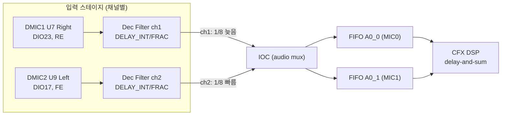

# 데이터시트 그라운딩 (사실 기반)

**TL;DR**: E8300 입력 패스는 (1) decimation 시분할로 **채널쌍 (0,1)·(2,3) 간 1/8 샘플 고유 스큐**가 존재하고, (2) `AUDIO_ADC_DEC_CTRL`의 **`DELAY_INTEGER`(1/8 샘플 단위 0~7/8)** + **`DELAY_FRACTIONAL`(0~SFCR, 서브-1/8 미세조정)** 으로 **채널별 샘플링 지연을 HW에서 직접 부여** 가능(SW 버퍼 불요). DMIC도 ADC와 동일 fractional delay 지원. 16kHz에서 1샘플=62.5µs≈2.14cm로 2cm 기하와 정합.

> [!NOTE]
> 모든 항목은 `docs/참고/e8300/Ezairo 8300 Hardware Reference.pdf`(HW, 1098p)·`Firmware Reference.pdf`(FW, 578p) 및 cfx 소스에서 직접 인용. 페이지는 PDF 물리 페이지 ≈ 인쇄 페이지.

---

## 1. 현재 펌웨어 구성 (cfx `lib_audio_in.c/.h`)

| 항목 | 값 | 근거 |
|---|---|---|
| 활성 DMIC 수 | **1개** | `LIB_AUDIO_IN_DMIC_ENABLE_COUNT 1` (h:24) |
| 샘플링 주파수 | **16kHz** (ADCCLK 3.84MHz) | `SYS_SET_ADC_SAMPLE_FREQ_CFG(AUDIO, LIB_AUDIO_SFCR_16K)` (c:11), `LIB_AUDIO_SFCR_16K = ADC_MODDIV_BY30` (h:18) |
| DMIC1 (U7, Right front) | 입력채널 **1**, **rising edge** | `DMIC1_DATA_RE` (h:80), `SYS_SET_ADC_DEC_CTRL(AUDIO,1,...)` (c:111) |
| DMIC2 (U9, Left front) | 입력채널 **2**, **falling edge** | `DMIC2_DATA_FE` (h:80), `SYS_SET_ADC_DEC_CTRL(AUDIO,2,...)` (c:129, 2-DMIC 분기) |
| IOC→FIFO 매핑 | IN1→FA0_0(MIC0), IN2→FA0_1(MIC1) | `LIB_IOC_ADC_CFG_VAL` (h:50) |
| 공유 클럭 | DMIC_CLK1/CAL(DIO22) 1개만 | `DIO->SRC_DMIC_CLK = DMIC_CLK_SRC_DIO_22` (c:120,138); 주석 "CLK 설정은 하나만 가능" |
| 현재 DEC delay 설정 | integer=0, fractional=0 | `ADC_INTEGER_DELAY_0`, `LIB_SAMPLE_FRACTIONAL_DELAY 0` (h:96-98) |

- AUDIO_MUX 입력채널 소스 순서 (h:80): `(ADC3_OUT | DMIC2_DATA_FE | DMIC1_DATA_RE | ADC0_OUT)` = (ch3 | ch2 | ch1 | ch0).
  - **ch0=ADC0, ch1=DMIC1(Right/RE), ch2=DMIC2(Left/FE), ch3=ADC3**.

## 2. 채널 간 고유 스큐 (핵심 — 은수님 가설 검증)

### 사실 A — Filter Engine 입력 도착 시점 (HW p.222)
> "Input data received from the decimation filters for **ADC0 and ADC2 arrives 1/8th of a sample period ahead** of data from the decimation filters for **ADC1 and ADC3**."

### 사실 B — decimation 시분할 (HW p.445, §14.4)
> "All four ADC inputs are sampled at the same time relative to their fractional delay setting, but inputs from the input audio channels is **time multiplexed in the decimation filters into two pairs (channels 0, 1; channels 2, 3) resulting in longer processing delays for channels 1, 3.**"

**해석**:
- 4채널이 아날로그/입력단에서는 동시 샘플링되지만, **decimation WDF가 짝수/홀수(0·2 vs 1·3) 시분할 처리** → **짝수 채널(0,2)이 홀수 채널(1,3)보다 1/8 샘플 먼저** 출력.
- 현재 매핑상 **DMIC2(Left, ch2)는 DMIC1(Right, ch1)보다 1/8 샘플 먼저** IOC/FIFO에 도착하는 고유 스큐 존재.
- 은수님의 "채널 0,2 동시 / 채널 1,3 동시" 가설은 **방향성까지 정확히 일치** (0·2 한 묶음, 1·3 한 묶음, 1/8 샘플 차).

## 3. HW 내부 샘플링 지연 레지스터 (요구사항_2 핵심)

`AUDIO_ADC_DEC_CTRL` 레지스터 (채널별 1개, HW p.450-451 / 레지스터 맵):

| 필드 | 비트 | 의미 | 범위 |
|---|---|---|---|
| `DELAY_INTEGER` | 26:24 | **Integer sample delay** — 실제로는 **1/8 샘플 주기 단위** | `ADC_INTEGER_DELAY_0`(0) ~ `_7`(7) = 0/8 ~ **7/8 샘플 지연** |
| `DELAY_FRACTIONAL` | 21:16 | **Fractional sample delay** — 1/8 미만 미세조정 | 0 ~ `AUDIO_ADC_SAMPLE_FREQ_CFG:SFCR` |
| `BAND_SELECT_ADC` | 30:28 | decimation 대역 선택 | (현재 `BAND_SELECT_ADC_0K_8K`) |
| `ADC_GF` | 11:0 | 게인 팩터 | `round[2^(11+floor(log2(sfcr)))/(sfcr+1)]` |

- **DELAY_INTEGER 각 단계 = "Delay the sampling by N/8 of the sampling frequency"** (HW 레지스터 설명 p.29746-29767). 즉 정수 이름이지만 **물리적으로 1/8 샘플 스텝**.
- **DELAY_FRACTIONAL valid = 0 ~ SFCR** (HW p.29693). SFCR = `round(f_adcclk/8/f_sample)-1` (HW p.29813). 16kHz/3.84MHz → 약 29. → 1/8 샘플 내부를 다시 ~30분할 → **유효 해상도 ≈ 1/(8×30) 샘플 ≈ 0.26µs**.
- HW p.219 NOTE: "**fractional delay 변경은 ADC 입력 간 동기화(샘플링 시점)에 영향**" → 채널별로 다르게 주면 **상대 지연을 의도적으로 생성** 가능.
- HW p.438: 입력 스테이지 = "over-sampling ADC which uses a programmable sampling frequency and **provides a configurable sampling delay**".

**결론(잠정)**: 채널별 `DELAY_INTEGER`+`DELAY_FRACTIONAL`을 다르게 설정하면 **SW 버퍼 시프트 없이 HW에서 임의 서브샘플 상대 지연 부여 가능**.

## 4. DMIC 인터페이스 타이밍 (HW §18.2, p.563)

- DMIC 입력은 **6th order Sync(CIC) pre-decimation 필터** 사용. decimation factor는 ADC와 동일(`AUDIO_ADC_SAMPLE_FREQ_CFG`).
- **"DMIC pre-decimation 필터도 ADC와 동일하게 fractional delay 지원"** → §3의 지연 메커니즘이 DMIC에도 적용됨.
- DMIC 클럭: E8300 내부 또는 EXTCLK. EXTCLK 사용 시 ADCCLK와 동일 공칭 주파수여야 입력단과 동기.
- **엣지 의미**: `DMIC*_DATA_RE`=rising edge 캡처, `DMIC*_DATA_FE`=falling edge 캡처.
  - 스테레오(1 pad 공유) 시: low data=rising, high data=falling.
  - **본 보드는 데이터 pad가 분리(DIO23/DIO17)되어 있고 클럭만 공유** → RE/FE 분리는 "스테레오 패턴"을 별도 pad에 적용한 형태. DMIC2(FE)는 DMIC1(RE) 대비 **DMIC 클럭 반주기**만큼 캡처 시점이 다름(오버샘플링 클럭 레이트 기준, 출력 샘플 대비 매우 작음 — 토론/검증 대상).

## 5. 빔포밍 기하·타이밍 산술

- 음속 c ≈ 343 m/s (상온). 마이크 간격 d = 2cm = 0.02m.
- end-fire(축선) 방향 최대 지연 = d/c = 0.02/343 = **58.3µs**.
- 16kHz 샘플 주기 = 1/16000 = **62.5µs** → 1샘플 = 2.14cm.
- **필요 상대 지연 = 58.3/62.5 = 0.933 샘플** (정확값). 은수님의 "1샘플"은 근사. **7/8=0.875 샘플(54.7µs)에 근접**, fractional delay로 0.933까지 미세조정 가능.
- 즉 **DELAY_INTEGER_7 + DELAY_FRACTIONAL 일부**로 0.933 샘플을 HW에서 직접 구현 가능(이론).

## 6. 데이터 경로 요약

## 7. 미해결·토론 포인트 (다음 단계 입력)

- **포인트_1**: 채널쌍 1/8 스큐의 **부호 방향** — DMIC2(ch2, Left, 앞)가 1/8 먼저 도착. 빔포밍에 유리/불리?
- **포인트_2**: 어느 마이크를 지연시켜야 하나 — 착용 시 "앞 방향" 음원 기준, Left/Right 각각의 front mic 역할.
- **포인트_3**: RE/FE 분리가 의도적인지(반주기 스큐) — 둘 다 RE로 통일해야 하나? → **해소됨** ([`../20260623_dmic-sel-edge-match/`](../20260623_dmic-sel-edge-match/)): RE/FE는 자유 선택이 아니라 각 마이크 SEL 스트랩(SPH0641: SEL=GND↔`_RE`, SEL=VDD↔`_FE`)에 **강제된 설정**. 현 펌웨어는 U7 SEL=GND·U9 SEL=VDD 전제. 통일 이득 한계적, U9 SEL=VDD 정합 확인이 빔포밍 1차 관문.
- **포인트_4**: 필요 지연 0.933 샘플을 `DELAY_INTEGER_7`(0.875)만으로 근사 vs fractional 병행 정밀화.
- **포인트_5**: 고유 1/8 스큐를 보정(상쇄)에 활용 — 지연 예산에 포함 계산.
- **포인트_6**: 2-DMIC 활성화 시 QCC와의 DMIC2 공유 충돌(SPI 프로토콜, 10ms 대기) 운용 제약.
- **포인트_7**: decimation 절대 group delay는 두 채널 동일 대역이면 상쇄 — 상대 지연만 유효한지 확인.
- **포인트_8**: Filter Engine low-group-delay/undecimated 경로가 대안이 되는지.
