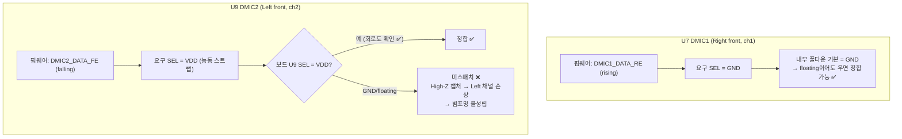

# 결론 · 후속 계획

**TL;DR**: 올바른 조합은 **SEL=GND↔`DMIC*_DATA_RE`(rising)**, **SEL=VDD↔`DMIC*_DATA_FE`(falling)** 두 가지뿐. 현재 펌웨어는 **U7(DMIC1) SEL=GND·U9(DMIC2) SEL=VDD**를 전제로 동작하며, **U9 SEL=VDD 능동 스트랩이 정합의 급소**다(내부 풀다운 기본은 GND라 미스트랩 시 손상). **최우선 후속 = 회로도에서 U7·U9 SEL 스트랩 실측 확인.** 코드 변경은 없음(검증 후 필요 시 별도 작업).

> [!IMPORTANT]
> 본 작업은 **이론·문서 분석** 범위. 회로/소스 변경은 회로도 확인 결과에 따라 별도 4단계·승인 대상.

---

> [!IMPORTANT]
> **2026-06-23 회로도 확인 완료** — 은수님 회로도(SPH8690LM4H-1)로 SEL 스트랩 실측: **U7(DMIC1) SEL=GND, U9(DMIC2) SEL=VDD**. 현재 펌웨어(DMIC1=`_RE`, DMIC2=`_FE`)가 **두 채널 모두 정합 ✅** — 펌웨어 설정이 올바름을 회로도로 확정. (잔여: 부품번호 SPH8690 vs 분석 데이터시트 SPH0641 불일치 — SEL 규약 동일 가정, SPH8690 SEL 표 확인 권고.)

## 1. 최종 결론 — 올바른 조합

| 마이크 SEL | E8300 캡처 설정 | 정합 |
|---|---|---|
| **GND (Low, LOW 구간 유효)** | **`DMIC*_DATA_RE` (rising)** | ✅ 올바름 |
| **VDD (High, HIGH 구간 유효)** | **`DMIC*_DATA_FE` (falling)** | ✅ 올바름 |
| GND | `_FE` (falling) | ❌ 손상 (High-Z 캡처) |
| VDD | `_RE` (rising) | ❌ 손상 (High-Z 캡처) |

### 회로도 실측 대조 (확정)

| 마이크 | 보드 SEL | 요구 캡처 | 펌웨어 | 정합 |
|---|---|---|---|---|
| **U7 DMIC1** (Right front) | **GND** | `_RE` | `DMIC1_DATA_RE` | ✅ |
| **U9 DMIC2** (Left front) | **VDD** | `_FE` | `DMIC2_DATA_FE` | ✅ |

→ **현재 펌웨어 설정 올바름. 빔포밍으로 2채널 활성화해도 엣지 정합 유지(손상 없음).**

## 2. 현재 펌웨어 정합 진단

- **U7**: SEL=GND 확인 → `_RE` 정합 ✅ (내부 풀다운 기본과도 일치).
- **U9**: SEL=VDD 확인 → `_FE` 정합 ✅ (능동 VDD 스트랩 존재 — 회로도 확정).
- → **두 채널 모두 정합. 현재 펌웨어 올바름.**

## 3. 후속 작업 (제안)

| 단계 | 작업 | 산출물·확인 |
|---|---|---|
| ~~후속_1~~ | ~~회로도에서 U7·U9 SELECT 스트랩 실측 확인~~ → **완료 (2026-06-23): U7=GND, U9=VDD → 펌웨어 정합 확정** | ✅ |
| 후속_2 (확인 권고) | **부품번호 불일치** — 회로도 SPH8690LM4H-1 vs 분석 데이터시트 SPH0641LM4H-1. SPH8690 데이터시트 SEL↔엣지 표가 동일한지 확인 | SEL 규약 표준 가정, 확정용 |
| 후속_3 (참고) | U9는 QCC 공용 — 통화 시 CLK가 QCC에서 구동(E8300 hi-Z). 빔포밍 상시성은 QCC 공유 정책에 종속(beam-forming 참조) | QCC 인터페이스 |
| 후속_4 (선택) | 빔포밍 both-RE 통일 검토 — 현재 정합이 맞으므로 통일 불필요. 반주기 스큐 이득 한계적 | 우선순위 하 |

## 4. 빔포밍 작업 연계 (포인트_3 해소)

- [`20260623_beam-forming`](../20260623_beam-forming/) 미해결 **포인트_3(RE/FE 통일)** 해소:
  - 현재 RE/FE 분리는 **자유 선택이 아니라 각 마이크 SEL 스트랩에 의해 강제된 설정**.
  - 빔포밍 관점 RE/FE 통일 이득은 한계적(스큐 0.22%) → 통일 불필요.
  - 빔포밍 전제: 두 채널 모두 SEL↔엣지 정합이 맞아야 유효 데이터 → **회로도로 U7=GND/U9=VDD 정합 확정 → 빔포밍 1차 관문 통과.**

## 5. 한 줄 권고

> **올바른 조합은 SEL=GND↔rising·SEL=VDD↔falling이다. 회로도 확인 결과 U7 SEL=GND·U9 SEL=VDD로, 현재 펌웨어(DMIC1=`_RE`·DMIC2=`_FE`)가 두 채널 모두 정합 ✅ — 펌웨어 설정이 올바르며 빔포밍 2채널 활성화 시에도 엣지 정합이 유지된다. 잔여 확인은 부품번호(SPH8690 vs SPH0641) SEL 표 일치 여부뿐.**
