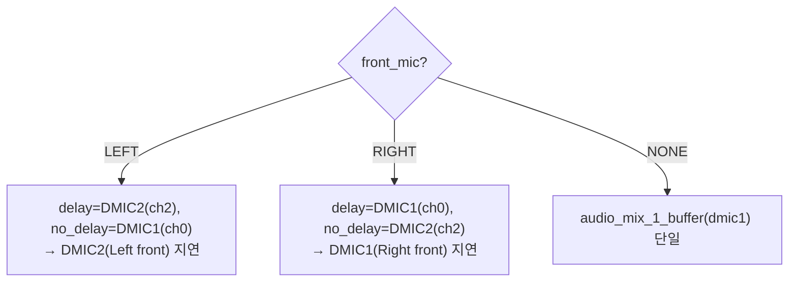

# 빔포밍 실구현 그라운딩 (사실 기반)

**TL;DR**: 은수님 구현은 **하이브리드 지연(SW 1샘플 + HW FRAC=6=0.025샘플 = 1.025샘플 ≈ 64.06µs)** 을 front mic에 부여하는 2채널 delay-and-sum. 채널은 ch0(DMIC0/U7/RE)·ch2(DMIC2/U9/FE) **동일 짝수 패리티(스큐 0)**, SEL/엣지 정합, L/R에 따라 front mic(지연 채널) 스왑, I2S 스트리밍·Mapping Live 시 1-DMIC로 폴백. 22mm 이상값(1.026샘플)과 거의 일치 — **우리가 논의한 하이브리드 권고를 충실히 구현**.

> [!NOTE]
> 근거 파일: `src/1__cfx/lib_cfx/lib_audio_in.{c,h}`, `systemControl/audioMixer.c`, `systemControl/main.c`, `systemControl/system_control.c`. 비교 대상: [`20260623_beam-forming`](../20260623_beam-forming/), [`20260623_dmic-sel-edge-match`](../20260623_dmic-sel-edge-match/).

---

## 1. HW 입력 구성 (lib_audio_in.{c,h})

| 항목 | 값 | 비고 |
|---|---|---|
| 활성 DMIC | 2 (`LIB_AUDIO_IN_DMIC_ENABLE_COUNT 2`) | |
| ch0 = DMIC0 | U7(DIO23, EZ/Right-side), `DMIC0_DATA_RE`(rising) | `DMIC0_DATA_SRC_DIO_23` |
| ch2 = DMIC2 | U9(DIO17, QCC/Left-side), `DMIC2_DATA_FE`(falling) | `DMIC2_DATA_SRC_DIO_17` |
| 패리티 | **ch0·ch2 둘 다 짝수 → decimation 1/8 스큐 0** | 우리 권고 일치 |
| SEL/엣지 | U7 SEL=GND↔RE ✓, U9 SEL=VDD↔FE ✓ | 정합 확인됨 |
| IOC | IN0→FA0_0(MIC0), IN2→FA0_1(MIC1) | |
| 공유 CLK | DIO22(DMIC_CLK1) 단일 | |
| 블록 크기 | 16샘플 = 1ms @16kHz (`df_inputADC_DataBuffLength`) | FIFO 인터럽트 단위 |

## 2. 지연 분해 (핵심)

front mic에 **두 단계 지연 합산**:

| 단계 | 구현 | 값 |
|---|---|---|
| HW fractional | front 채널 `LIB_ADC_DEC_CTRL_VAL_0_0250` (INT=0, FRAC=6) | 6/240 = **0.025 샘플** |
| SW 1샘플 | 믹서가 지연 채널을 인덱스 i+1(1샘플 older)로 읽음 | **1.000 샘플** |
| **합계** | | **1.025 샘플 = 64.06 µs** |

- 22mm 이상값 = 0.022/343 = 64.14µs = **1.0262 샘플**. 구현 1.025샘플 → 오차 **0.0012샘플 = 0.08µs** (무시 수준).
- rear mic 채널 = `LIB_ADC_DEC_CTRL_VAL`(지연 0). 상대 지연만 유효.
- 미사용: `LIB_ADC_DEC_CTRL_VAL_0_9958`(INT=7/FRAC=29) 매크로 정의만 있고 호출 없음(과거 "단일채널 최대" 논의 잔재).

## 3. 버퍼·믹서 데이터 흐름

### 버퍼 구조 (main.c `tdc_copy_DMIC_buffers`)
- `g_lib_dmic_in_buffers[2 mic][2 block][16]` (`LIB_AUDIO_IN_BUF_MAX_CNT=2`).
- 매 인터럽트: `[mic][1] = [mic][0]`(이전 블록 보존) → `[mic][0] = FIFO`(신규). 즉 **[0]=최신 블록, [1]=직전 블록**.
- 블록 내 인덱스 순서: 믹서 경계 처리상 **index 0=최신 … 15=오래됨**으로 추정(검증 포인트).

### 믹서 (audioMixer.c `audio_mix_2_buffers_for_beamforming`)
- 인자: `p_delay_buf0`(지연 채널 현재 블록), `p_delay_buf1`(지연 채널 직전 블록), `p_no_delay_buf0`(기준 채널 현재 블록).
- `p_mix[i] = (no_delay[i]>>5 + delay_buf0[i+1]>>5) >> 1`, i=0..14
- `p_mix[15] = (no_delay[15]>>5 + delay_buf1[0]>>5) >> 1` (블록 경계: 직전 블록 index 0)
- 지연 채널을 i+1(1샘플 older)로 읽어 **지연 채널 = 기준보다 1샘플 늦음**. 경계 i=15는 직전 블록[0]으로 이어붙임(인덱스 0=최신 가정 하 일관).
- `>>1`(÷2): 상관 신호(front) +6dB → 0dB로 정규화(단일 마이크와 정합 의도).

## 4. L/R 재조향 (main.c `PCM_LiveStimulation_Mode`)

- `lib_audio_set_front_mic(LEFT/RIGHT/NONE)`은 `system_control.c`에서 ISD 위치(`cfx_ISD_info[].isd_location_RL`)로 설정.
- 동시에 HW fractional도 front 채널에 부여: Left→ch2 `_0_0250`, Right→ch0 `_0_0250` (SW 지연 채널과 일치).
- **front mic = 음원에 먼저 닿는 마이크를 지연** → forward end-fire 정렬. 방향 일관성 확인됨.

## 5. QCC 공유·모드 전환

- `normal_loop`(main.c): I2S_FLAG 액티브(통화 등 QCC가 DMIC2 점유)면 `enable_1_DMIC()`, 비액티브면 `enable_2_DMICs()`.
- `PCM_LiveStimulation_Mode`: I2S 스트리밍 중이면 빔포밍 안 함(`audio_mix_2_buffers` I2S+mic), 아니면 1/2 DMIC 분기.
- `system_control.c` 맵 변경: I2S 스트리밍이면 1-DMIC, 아니면 2-DMIC + ISD L/R로 front mic·HW delay 설정. **Mapping Live(맵<0)는 1-DMIC 고정**.

## 6. 우리 이론과의 정합 (비교표)

| 논의 권고 (20260623) | 구현 | 정합 |
|---|---|---|
| 동일 패리티로 스큐 0 | ch0·ch2(짝수) | ✅ |
| SEL=GND↔RE, VDD↔FE | DMIC0_RE(U7=GND), DMIC2_FE(U9=VDD) | ✅ |
| 22mm는 1.026샘플 > 레지스터 최대(0.9958) → 하이브리드 | SW 1 + HW 0.025 = 1.025 | ✅ |
| front mic 지연(착용 귀별) | L/R 스왑 + front 채널에 delay | ✅ |
| QCC DMIC2 공유 제약 → 빔포밍 가용구간 | I2S/Mapping 시 1-DMIC 폴백 | ✅ |
| HW DELAY는 콘텐츠 지연(FIFO 동기 유지) | SW는 인덱스 오프셋, HW는 fractional | ✅ |

## 7. 분석/검증/개선 입력 포인트

- **포인트_1 (검증)**: 블록 내 인덱스 시간순서(0=최신 가정)와 i+1 오프셋의 **지연 방향**이 실제로 front mic를 지연시키는지.
- **포인트_2 (검증)**: 경계 `delay_buf1[0]`(i=15) 이어붙임이 시간 연속적인지(불연속/중복 샘플 위험).
- **포인트_3 (개선)**: HW fractional이 **맵 변경 경로에서만** 설정됨 — init(`configure_audio_path_all`)은 delay 0. 맵 변경 전 구간엔 fractional 미적용(−0.025샘플, 미미하나 일관성 이슈).
- **포인트_4 (개선)**: 런타임 `SYS_SET_ADC_DEC_CTRL`·DMIC 클럭 토글 시 **mute 부재 → 위상 점프/클럭 글리치** 가능.
- **포인트_5 (개선)**: 게인 — 빔포밍 `>>1` vs `audio_mix_2_buffers`(I2S 경로) 비-halving, 1↔2 DMIC 전환 시 **음량 연속성** 점검.
- **포인트_6 (개선)**: `_0_9958` 데드 매크로, 믹서 16줄 하드코딩+매직 오프셋, 버퍼 순서 가정의 암묵적 결합(주석/assert 부재).
- **포인트_7 (성능)**: 2-mic delay-sum 지향성 한계(전후 수 dB) — white-noise L/R 차이는 동작 방증이나 정량(전후비) 측정 권고.
- **포인트_8 (개선)**: 지연량이 22mm·343m/s 고정 — 온도/개체 산포 비적응(현재 제품 고정값으로 허용 가능).
