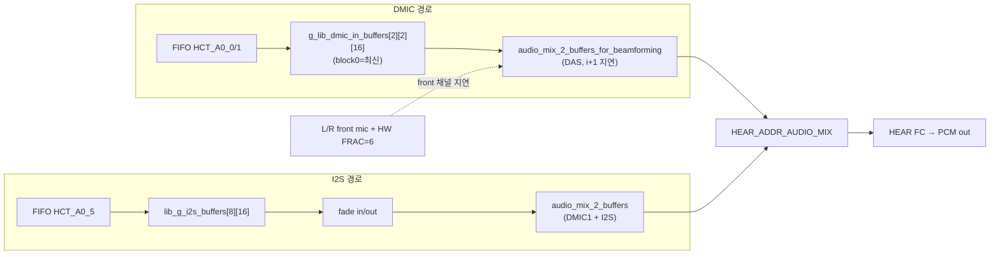
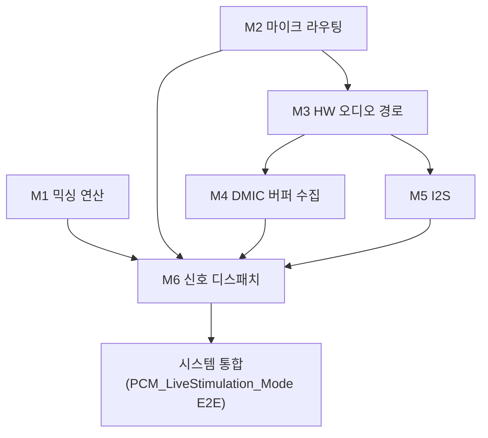

# 모듈화 분석 종합 (②분석, 12 페르소나 수렴)

**TL;DR**: 범위 코드를 [방법론](../../../지침/SW%20밸리데이션%20계층화%20방법론.md)으로 **12 유닛 → 6 모듈 → 시스템** 비순환 DAG로 분해. 핵심 정정: ① 믹서 함수는 **순수(off-target) 아님**(첫 줄에서 `HEAR_ADDR_AUDIO_MIX`에 기록) — 단 **온타깃 단위테스트는 가능**(입력 인수 결정론, 출력 고정 위치 관측). ② 페르소나 명명 난립(48 모듈명)은 **수렴**, 의존성은 "A는 B 통과 전제"로 정리. ③ 코드 자체가 이미 대부분 유닛에 대응 → 재구조화는 **경계 명시·경량**이 적절(과도 추상화 금지).

> [!NOTE]
> 페르소나 원본: [`에이전트-로그/인덱스.md`](에이전트-로그/인덱스.md) 01~12. 검증: 할루시네이션(실코드 인용은 실재, 신규 유닛명 오인) / 방법론 정합(믹서 비순수·라벨·의존성 표기 지적) → 본 종합에 반영.

---

## 1. 데이터 흐름 (검증된 사실)

## 2. 유닛 (12) — 실 함수 기준

| 유닛 | 실 심볼·위치 | 검증 | 비고 |
|---|---|---|---|
| **U1 DAS 빔포밍 믹서** | `audio_mix_2_buffers_for_beamforming` (audioMixer.c:109) | unit-test(온타깃) | 입력 3포인터 결정론. HEAR_ADDR 기록(비순수) |
| **U2 단일버퍼 믹서** | `audio_mix_1_buffer` (audioMixer.c:32) | unit-test(온타깃) | |
| **U3 독립2버퍼 믹서** | `audio_mix_2_buffers` (audioMixer.c:43) | unit-test(온타깃) | I2S+mic, ÷2 생략 |
| **U4 front mic 상태** | `lib_audio_set/get_front_mic` (lib_audio_in.c:159) | unit-test | 전역 상태 접근 |
| **U5 DMIC 수 상태** | `get_enabled_DMIC_count` (lib_audio_in.c:169) | unit-test | |
| **U6 I2S 스트리밍 상태** | `tdc_i2s_set_streaming_state`/`I2S_isStreaming` (lib_i2s.c:174) | unit-test | |
| **U7 I2S fade-in** | `I2S_get_buffer_with_fade_in_process` (lib_i2s.c:325) | unit-test | 계수 곱 결정론 |
| **U8 I2S fade-out** | `I2S_get_buffer_with_fade_out_process` (lib_i2s.c:372) | unit-test | |
| **U9 DMIC 링버퍼 시프트** | `tdc_copy_DMIC_buffers` (main.c:326) | integration | FIFO→링버퍼(HW) |
| **U10 DMIC 수 전환** | `enable_1_DMIC`/`enable_2_DMICs` (lib_audio_in.c:174) | integration | DIO 클럭 토글 |
| **U11 HW 오디오 경로 설정** | `configure_audio_path_all` (lib_audio_in.c:107) | integration | FIFO/IOC/MUX/DEC |
| **U12 front mic + HW 지연** | mapChange L/R 블록 (system_control.c:83) | integration | FRAC=6 인가 |

보조(logic-explanation): `clear_FIFO_all`/`disable_FIFO_all`(lib_audio_in.c:218). I2S HW: `lib_init_I2S`/`lib_enable_I2S`(lib_i2s.c:86, integration). I2S FIFO 복사: `lib_i2s_copy_data_from_fifo`(lib_i2s.c:263, integration). I2S 검출: `I2S_update_state`(lib_i2s.c:184, 현재 미사용).

> [!IMPORTANT]
> **정정(방법론 검증)**: U1~U3 믹서는 첫 줄에서 `HEAR_ADDR_AUDIO_MIX`(HW 메모리)에 기록 → **off-target 순수 유닛 아님**. 그러나 본 프로젝트 테스트 모델은 **온타깃**이므로 "입력 인수 → 고정 출력 위치(HEAR_ADDR) 관측"으로 **단위테스트 가능**. 향후 필요 시 함수 시작점에 입력 벡터 하드코딩.

## 3. 모듈 (6) + 테스트 순서 DAG

| 모듈 | 구성 유닛 | 전제(의존) | 검증 |
|---|---|---|---|
| **M1 믹싱 연산** | U1·U2·U3 | 없음 | 유닛테스트(온타깃) |
| **M2 마이크 라우팅** | U4·U5 | 없음 | 유닛테스트 |
| **M3 HW 오디오 경로** | U11·U12 | **M2 통과 전제** | 통합테스트 |
| **M4 DMIC 버퍼 수집** | U9 | **M3 통과 전제** | 통합테스트 |
| **M5 I2S** | U6·U7·U8·복사·검출·HW init | **M3 통과 전제** | 통합테스트 |
| **M6 신호 디스패치** | `PCM_LiveStimulation_Mode`·`normal_loop` 분기·U10 | **M1·M2·M4·M5 통과 전제** | 통합테스트 |

**테스트 순서**: ① M1 + M2 (병렬, 무관) → ② M3 (M2 전제) → ③ M4 + M5 (병렬, M3 전제) → ④ M6 (M1·M2·M4·M5 전제) → ⑤ 시스템(E2E).

## 4. 핵심 관찰 (계획 입력)

- **코드가 이미 유닛에 거의 대응** — 믹서·상태접근·복사·설정이 각자 함수. → 재구조화는 **새 추상화가 아니라 경계 명시**(파일/섹션 정리·유닛/모듈 배너 주석·테스트 지점 표기)가 적절. 과분해·과추상화는 방법론(단순·특화) 위반.
- **"2-버퍼 자명"**: `LIB_AUDIO_IN_BUF_MAX_CNT=2` 링버퍼 + U1의 i=15 경계(`delay_buf1[0]`)가 2-블록 운용을 드러내는 유일 지점 → 주석·상수로 더 자명하게.
- **테스트 벡터 후보**: U1 = (a) 내부 i=0..14 `no_delay[i]+delay[i+1]`, (b) 경계 i=15 `no_delay[15]+delay_buf1[0]`.
- **dead/미사용**: `audio_mix_internal/external_mic_only`(호출부 없음), `I2S_update_state`(미사용), `I2S_handle`(주석). → 정리 후보(별개 판단).

## 5. 잔여 결정 (③계획에서 확정)
- 재구조화 **강도**: 경계 명시·경량(권장) vs 파일 신설 분리.
- 모듈 **파일 매핑**: 기존 파일 유지 + 섹션 배너 vs 모듈별 파일.
- dead code 정리 포함 여부.
