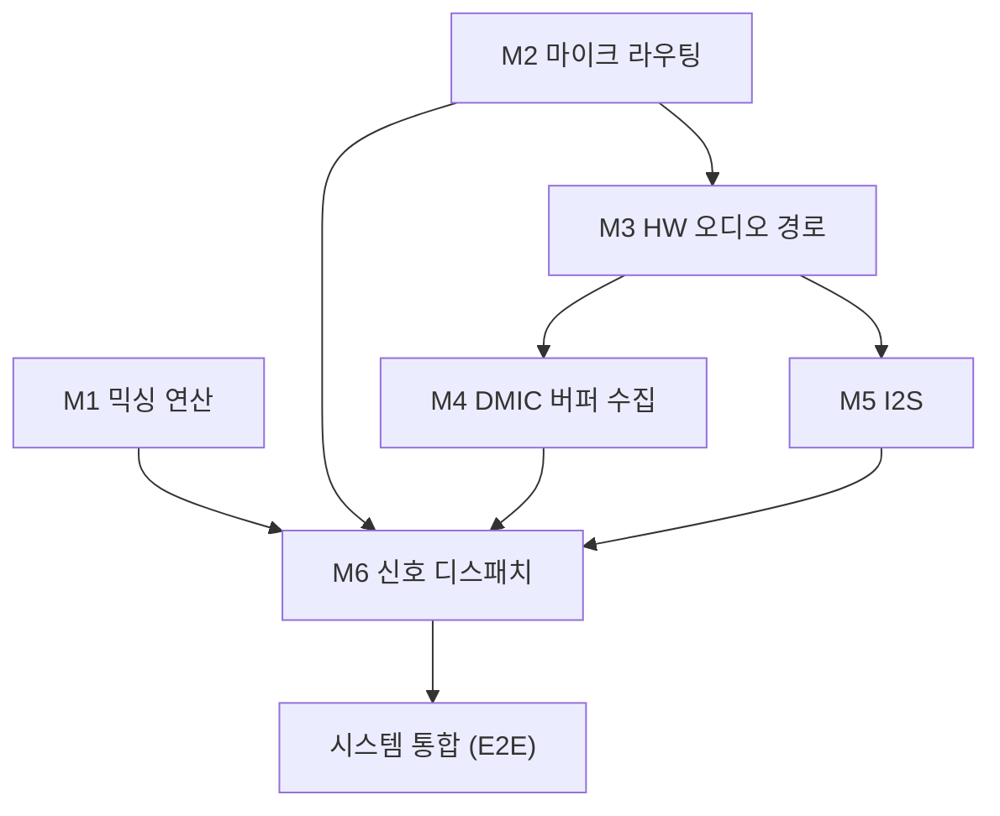

# I2S·빔포밍 유닛/모듈/테스트 맵

**TL;DR**: [`SW 밸리데이션 계층화 방법론`](../../../지침/SW%20밸리데이션%20계층화%20방법론.md) 적용. **12 유닛 → 6 모듈 → 시스템**. 각 유닛은 실 함수에 대응하며, 검증 라벨·의존성("A는 B 통과 전제")·온타깃 테스트벡터 지점을 명시. 코드의 `[UNIT]`/`[MODULE]` 배너 주석이 본 맵과 1:1 정합.

> [!NOTE]
> 본 맵은 **밸리데이션 산출물**(추적성). 코드 변경 시 본 맵과 코드 배너를 함께 갱신한다. 테스트 코드는 미삽입 — "테스트벡터 지점"은 향후 온타깃 테스트 시 입력 벡터를 하드코딩할 위치다.

---

## 1. 유닛 (14) — tdc_ 네이밍 적용 후 기준

| 유닛 | 함수(현행 → tdc_) | 위치 | 검증 | 의존(전제) |
|---|---|---|---|---|
| U1 DAS 빔포밍 믹서 | `audio_mix_2_buffers_for_beamforming` → `tdc_audio_mix_2_buffers_for_beamforming` | audioMixer.c | unit(온타깃) | — |
| U2 단일버퍼 믹서 | `audio_mix_1_buffer` → `tdc_audio_mix_1_buffer` | audioMixer.c | unit | — |
| U3 독립2버퍼 믹서 | `audio_mix_2_buffers` → `tdc_audio_mix_2_buffers` | audioMixer.c | unit | — |
| U4 front mic 상태 | `lib_audio_set/get_front_mic` → `tdc_audio_set/get_front_mic` | lib_audio_in.c | unit | — |
| U5 DMIC 수 상태 | `get_enabled_DMIC_count` → `tdc_get_enabled_DMIC_count` | lib_audio_in.c | unit | — |
| U6 I2S 스트리밍 상태 | `I2S_isStreaming`/`tdc_i2s_set_streaming_state` | lib_i2s.c | unit | — |
| U7 I2S fade-in | `I2S_get_buffer_with_fade_in_process` | lib_i2s.c | unit | U_I2S복사 |
| U8 I2S fade-out | `I2S_get_buffer_with_fade_out_process` | lib_i2s.c | unit | U_I2S복사 |
| U9 DMIC 링버퍼 시프트 | `tdc_copy_DMIC_buffers` | main.c | integration | M3 |
| U10 DMIC 수 전환 | `enable_1_DMIC`/`enable_2_DMICs` → `tdc_enable_1/2_DMIC(s)` | lib_audio_in.c | integration | U5 |
| U11 HW 오디오 경로 설정 | `configure_audio_path_all` → `tdc_configure_audio_path_all` | lib_audio_in.c | integration | — |
| U12 front mic + HW 지연 | mapChange L/R 블록 | system_control.c | integration | U4, U10 |
| U13 게인 변환 테이블 | `tdc_audio_gain_lookup_q8_16` | audioMixer.c | unit | — |
| U14 게인 적용 2버퍼 믹서 | `tdc_audio_mix_2_buffers_with_gain` | audioMixer.c | unit(온타깃) | U13 |

> U13·U14는 [`20260720_gain-conversion-table`](../20260720_gain-conversion-table/) 작업에서 추가(2026-07-20). 유닛 12 → 14.

> tdc_ 적용 범위·call-site 갱신은 [`계획.md`](계획.md)·구현 검증(단계_4) 참조. 광범위 호출 심볼은 안전 우선으로 단계 적용.

## 2. 모듈 (6) + 테스트 순서

| 모듈 | 구성 유닛 | 전제(통과 후 진행) | 검증 |
|---|---|---|---|
| M1 믹싱 연산 | U1·U2·U3·U13·U14 | — | 유닛테스트(온타깃) |
| M2 마이크 라우팅 | U4·U5 | — | 유닛테스트 |
| M3 HW 오디오 경로 | U11·U12 | **M2** | 통합테스트 |
| M4 DMIC 버퍼 수집 | U9 | **M3** | 통합테스트 |
| M5 I2S | U6·U7·U8·복사·검출·HW init | **M3** | 통합테스트 |
| M6 신호 디스패치 | `PCM_LiveStimulation_Mode`·`normal_loop` 분기·U10 | **M1·M2·M4·M5** | 통합테스트 |

**테스트 순서**: ① M1 + M2 (병렬) → ② M3 → ③ M4 + M5 (병렬) → ④ M6 → ⑤ 시스템(E2E).

## 3. 유닛별 온타깃 테스트벡터 지점 (향후)

| 유닛 | 테스트벡터 케이스 | 자극 위치 → 관측 |
|---|---|---|
| U1 DAS 믹서 | (a) 내부 i=0..14: `no_delay[i]+delay[i+1]` (b) 경계 i=15: `no_delay[15]+delay_buf1[0]` | 함수 시작점 입력 3버퍼 하드코딩 → `HEAR_ADDR_AUDIO_MIX[0..15]` 관측 |
| U2/U3 믹서 | 스케일·합산·정규화(÷2 유무) | 입력 버퍼 → HEAR_ADDR 관측 |
| U7/U8 fade | 계수 적용·경계(완료 시 zero/full) | 입력 버퍼+상태 → 반환 버퍼 관측 |
| U4/U5/U6 상태 | set→get 일치 | 직접 |
| U9~U12 | 통합(모듈 내 전 유닛 활성화 후 각 동작) | 통합테스트 |

## 4. 검증 라벨 정의 (방법론)
- **unit-test**: 독립 자극→응답. 온타깃에서 함수 시작점 테스트벡터 하드코딩 가능.
- **integration-test**: 모듈 내 전 유닛 동시 활성화 시 각 유닛 정상 확인(HW/FIFO/순서 결합).
- **logic-explanation**: 단순 유닛은 문서 설명으로 갈음(예: `clear_FIFO`).

> [!IMPORTANT]
> **믹서(U1~U3)는 off-target 순수 유닛 아님**(첫 줄 `HEAR_ADDR_AUDIO_MIX` 기록). 본 프로젝트 온타깃 모델에선 입력 인수 결정론 → 고정 출력 위치 관측으로 **단위테스트 성립**.
