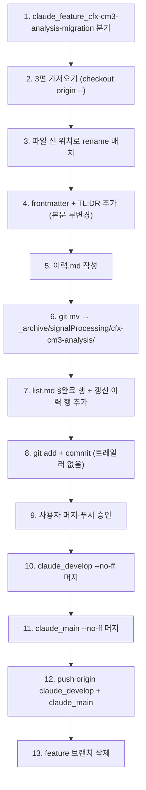

---
name: 계획 — 3편 마이그레이션 단계
purpose: 파일 checkout·rename·frontmatter 추가·즉시 archive·머지 절차 명시
type: tasks/계획
applies_to: [Sound1]
tags: [signalProcessing, cfx, cm3, migration, plan]
---

# 계획: 3편 마이그레이션 단계

**TL;DR**: `claude_feature_cfx-cm3-analysis-migration` 분기 → 3편 `git checkout origin/<브랜치> -- <원본경로>`로 가져오면서 신 위치·신 파일명으로 배치 → frontmatter+TL;DR 추가(본문 무변경) → 이력.md 작성 → `git mv`로 `_archive/` 즉시 이동 → list.md §완료 신규 행 + 갱신 이력 → 단일 commit (트레일러 없음) → `claude_develop` `--no-ff` → `claude_main` `--no-ff` → push origin 양쪽 → feature 브랜치 삭제. 위험 0.

## 1. 단계 흐름



## 2. 신 파일명 매핑

| 원본 경로 | 신 경로 |
|---|---|
| `docs/[분석] CFX 프로젝트 구조 및 시퀀스 Rev.0 by 김은수.md` | `docs/tasks/signalProcessing/cfx-cm3-analysis/CFX 프로젝트 구조 및 시퀀스 Rev.0.md` |
| `docs/[분석] CFX-CM3 공유메모리 시퀀스 및 타이밍 Rev.1 by 김은수.md` | `docs/tasks/signalProcessing/cfx-cm3-analysis/CFX-CM3 공유메모리 시퀀스 및 타이밍 Rev.1.md` |
| `docs/[분석] CFX 주파수밴드-전극-채널 매핑 Rev.2 by 김은수.md` | `docs/tasks/signalProcessing/cfx-cm3-analysis/CFX 주파수밴드-전극-채널 매핑 Rev.2.md` |

> [!NOTE]
> task 산출물 (`요구사항.md`/`분석.md`/`계획.md`/`진행상황.md`/`이력.md`)은 본 폴더에 함께 위치. 작업 완료 시 모두 함께 `_archive/`로 이동.

## 3. 단계별 명령

### 단계_1 — 브랜치 분기

```bash
cd E:/Claude/projects/Sound1
git checkout claude_main
git checkout -b claude_feature_cfx-cm3-analysis-migration
```

### 단계_2 — 3편 파일 가져오기 + 신 위치 배치

```bash
# git checkout으로 원본 trees에서 파일 추출 + cp로 신 이름·신 위치
git show origin/claude_docs_cfx-cm3-analysis:'docs/[분석] CFX 프로젝트 구조 및 시퀀스 Rev.0 by 김은수.md' \
  > 'docs/tasks/signalProcessing/cfx-cm3-analysis/CFX 프로젝트 구조 및 시퀀스 Rev.0.md'
git show origin/claude_docs_cfx-cm3-analysis:'docs/[분석] CFX-CM3 공유메모리 시퀀스 및 타이밍 Rev.1 by 김은수.md' \
  > 'docs/tasks/signalProcessing/cfx-cm3-analysis/CFX-CM3 공유메모리 시퀀스 및 타이밍 Rev.1.md'
git show origin/claude_docs_cfx-cm3-analysis:'docs/[분석] CFX 주파수밴드-전극-채널 매핑 Rev.2 by 김은수.md' \
  > 'docs/tasks/signalProcessing/cfx-cm3-analysis/CFX 주파수밴드-전극-채널 매핑 Rev.2.md'
```

> [!NOTE]
> `git checkout origin/<브랜치> -- <경로>` 대신 `git show ... > 신경로`를 쓰는 이유: 단순 redirect는 LF/CRLF·BOM 영향이 적고, 원본 경로 인덱스에 staging 부작용이 없음. rename은 단순 신 파일 생성으로 처리.

### 단계_3 — frontmatter + TL;DR 추가

각 3편 신 파일의 첫 헤더(`#`) 위에 frontmatter 삽입, 첫 헤더 바로 아래에 TL;DR 한 줄 (80~250자) 삽입.

```yaml
---
name: <원본 분석 제목>
purpose: <원본 분석 1줄 목적, 50자 이내>
type: tasks/분석
applies_to: [Sound1]
tags: [signalProcessing, cfx, cm3, legacy-2026-04-18, <주제별>]
---
```

TL;DR은 각 분석 본문 첫 단락·요약 섹션을 80~250자로 압축. 본문 자체는 무변경.

### 단계_4 — 이력.md 작성

`projects/Sound1/docs/tasks/signalProcessing/cfx-cm3-analysis/이력.md` — 형식은 [`문서 작성 규칙.md §3.4.2`](../../../지침/일반/문서%20작성%20규칙.md). 본 마이그레이션 작업 1페이지 요약 (3편 이전·머지·archive).

### 단계_5 — git mv로 archive 이동

```bash
mkdir -p docs/tasks/_archive/signalProcessing
git mv docs/tasks/signalProcessing/cfx-cm3-analysis docs/tasks/_archive/signalProcessing/cfx-cm3-analysis
```

### 단계_6 — list.md 갱신

§완료 신규 행 추가:

```markdown
| CFX·CM3 분석 3편 신 컨벤션 이전 | signalProcessing | cfx, cm3, migration, legacy, docs | [signalProcessing/cfx-cm3-analysis](signalProcessing/cfx-cm3-analysis/) | 완료 | 2026-05-14 ~ 2026-05-14 | ↔ [`signalProcessing/nofm-merge`](signalProcessing/nofm-merge/) (참조 인벤토리) | 2026-04-18 작성·미머지 분석 3편 (`origin/claude_docs_cfx-cm3-analysis`) → `tasks/signalProcessing/cfx-cm3-analysis/`로 이전, frontmatter+TL;DR 추가, 본문 무변경, 즉시 archive. 원본 브랜치 보존. |
```

§갱신 이력 신규 행 추가:

```markdown
| 2026-05-14 | `signalProcessing/cfx-cm3-analysis` 신설·완료. 사용자(다) 회상 — "전에 CM3·CFX 초기화 분석" 문의로 `origin/claude_docs_cfx-cm3-analysis` 미머지 브랜치 발견. ... (요약) |
```

### 단계_7 — commit (트레일러 없음)

```bash
git add -A
git commit -m "$(cat <<'EOF'
docs(tasks): signalProcessing/cfx-cm3-analysis — 2026-04-18 분석 3편 신 컨벤션 이전

origin/claude_docs_cfx-cm3-analysis 원격 브랜치의 미머지 분석 3편을
tasks/signalProcessing/cfx-cm3-analysis/ 신 컨벤션 구조로 이전:

- CFX 프로젝트 구조 및 시퀀스 Rev.0 (797 줄)
- CFX-CM3 공유메모리 시퀀스 및 타이밍 Rev.1 (743 줄)
- CFX 주파수밴드-전극-채널 매핑 Rev.2 (753 줄)

처리:
- 파일 가져오기: git show origin/<브랜치>:<원본> > <신경로> (cherry-pick 안 함)
- 신 파일명: [분석]·by 김은수 prefix·suffix 제거
- frontmatter + TL;DR 추가 (본문 무변경)
- task 산출물 5종 동반 (요구사항·분석·계획·진행상황·이력)
- 즉시 _archive/ 이동 + list.md §완료 등재

원본 브랜치 origin/claude_docs_cfx-cm3-analysis 는 보존 (force-push 회피
정책, Co-Auth 잔존 5 commit 처리와 일관).
EOF
)"
```

### 단계_8 — 사용자 승인 게이트 → 머지·푸시

```bash
git checkout claude_develop
git merge --no-ff claude_feature_cfx-cm3-analysis-migration -m "Merge branch 'claude_feature_cfx-cm3-analysis-migration' into claude_develop"
git checkout claude_main
git merge --no-ff claude_develop -m "Merge branch 'claude_develop' into claude_main"
git push origin claude_develop claude_main
git branch -d claude_feature_cfx-cm3-analysis-migration
```

## 4. 위험·롤백

| 위험 | 가능성 | 대응 |
|---|---|---|
| 위험_1: 파일 추출 시 한글 경로 escape 문제 | 중 | `git show 'origin/<브랜치>:<경로>'` quote로 보호. PowerShell·Bash 둘 다 single quote 권장 |
| 위험_2: frontmatter 추가 시 본문 첫 줄 오염 | 낮음 | Edit old_string = `^# <원본 제목>`, new_string = `<frontmatter>\n\n# <원본 제목>\n\n**TL;DR**: ...` |
| 위험_3: 마이그레이션 도중 다른 작업 충돌 | 없음 | 현재 활성 작업 0, 워킹트리 NofM 테스트 2건은 본 작업과 영향 없는 src/ 파일 |
| 위험_4: list.md cross-link 정합성 | 낮음 | §완료 행에 `[signalProcessing/cfx-cm3-analysis]` 링크, NofM 작업과 cross-link |

롤백:

```bash
# feature 브랜치에서 commit 전 발견 시
git restore --staged .
git restore .
git checkout claude_main
git branch -D claude_feature_cfx-cm3-analysis-migration

# commit 후·머지 전 발견 시
git reset --hard HEAD~1   # 또는 git checkout claude_main + 브랜치 폐기

# 머지 후 push 전 발견 시
git reset --hard <머지 전 commit>   # 위험, 사용자 승인 필수
```

## 5. 자체 검토

### 5.1 지침 준수 여부

| 지침 | 준수 |
|---|---|
| `작업 진행 규칙.md §2.2` (계획.md 정의) | ✅ 단계 순서·세부 명령·위험·롤백 명시 |
| `Git/브랜치, 병합 규칙.md` | ✅ feature 분기·--no-ff·AI 트레일러 금지·sequential 머지 |
| `문서 작성 규칙.md §3.4` (archive 절차) | ✅ 이력.md 작성 → git mv → list.md 갱신 → commit → 머지 |
| `문서 작성 규칙.md §9.1` (frontmatter) | ✅ 본 파일 5 필드 + tasks/계획 type |
| `문서 작성 규칙.md §6.5` | ✅ `단계_N`·`위험_N` 한글 라벨 |
| `Git/브랜치, 병합 규칙.md` (사용자 승인 게이트) | ✅ 단계_7 commit 후·단계_8 머지 전 사용자 승인 명시 |

### 5.2 논리적 정합성

| 점검 | 결과 |
|---|---|
| 요구사항·분석 → 계획 매핑 | ✅ 요구사항_5(브랜치 흐름)→단계_1·_8, _2(frontmatter)→단계_3, _3(본문 무변경)→§3 단계_3 NOTE, _6(트레일러 없음)→단계_7 EOF, _7(즉시 archive)→단계_5·_6, _8(원본 보존)→단계_2 NOTE + commit 메시지 |
| 단계 순서 논리 | ✅ 파일 가져오기 → frontmatter → 이력 → archive → list → commit → 머지 (각 단계 종속성 정합) |
| 위험 식별 완전성 | ✅ 한글 경로·본문 오염·충돌·cross-link 4 위험 + 롤백 3 시나리오 |

### 5.3 미해결 이슈

| 이슈 | 처리 |
|---|---|
| 각 3편 TL;DR 구체 문구 | 단계_3 진행 시 본문 첫 단락·요약 섹션 참조하여 작성 |
| commit 메시지 일부 줄 길이 | git commit 시 자동 wrap 또는 90 cols 권장 — Sound1 history 동일 패턴 |
