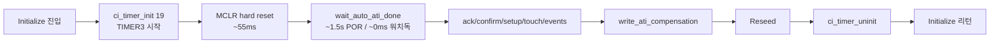
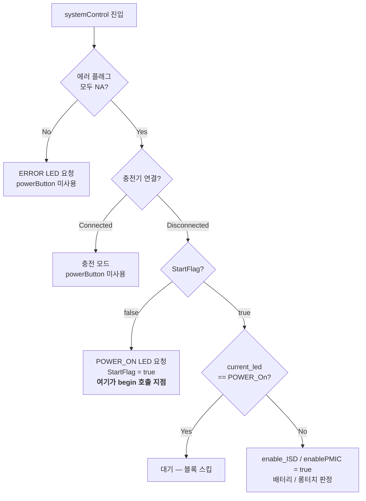
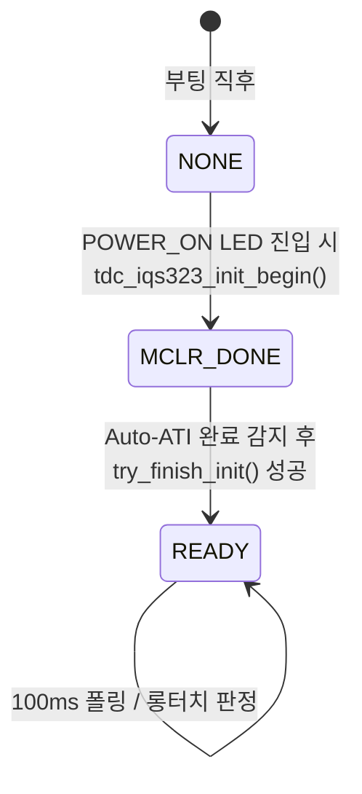
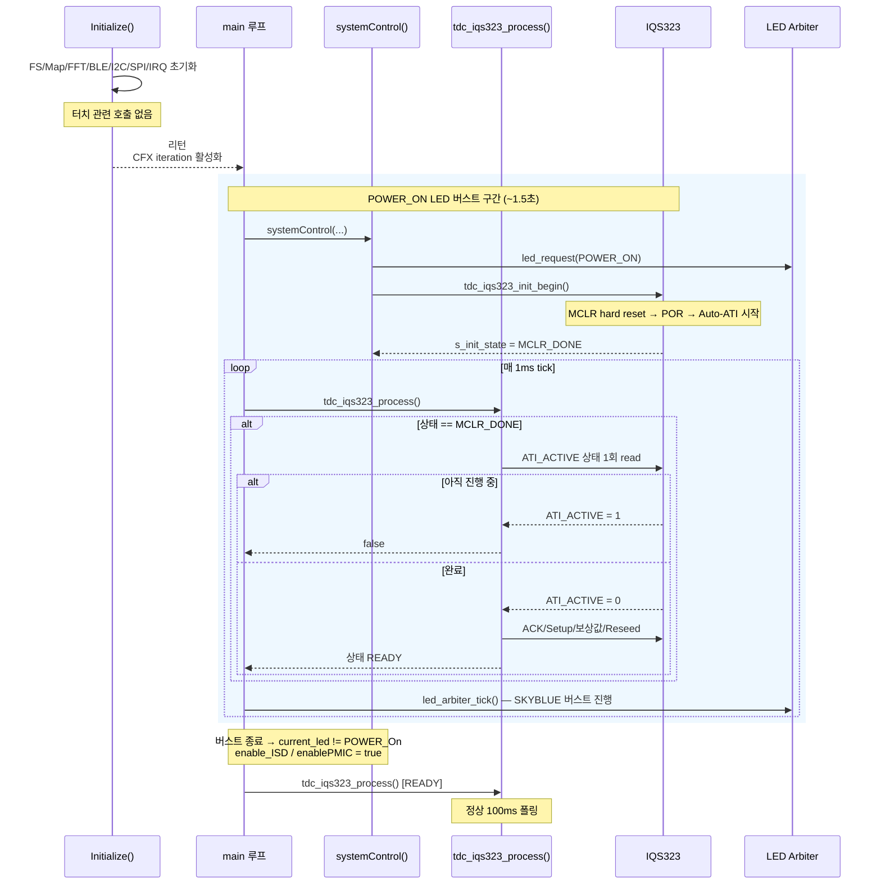
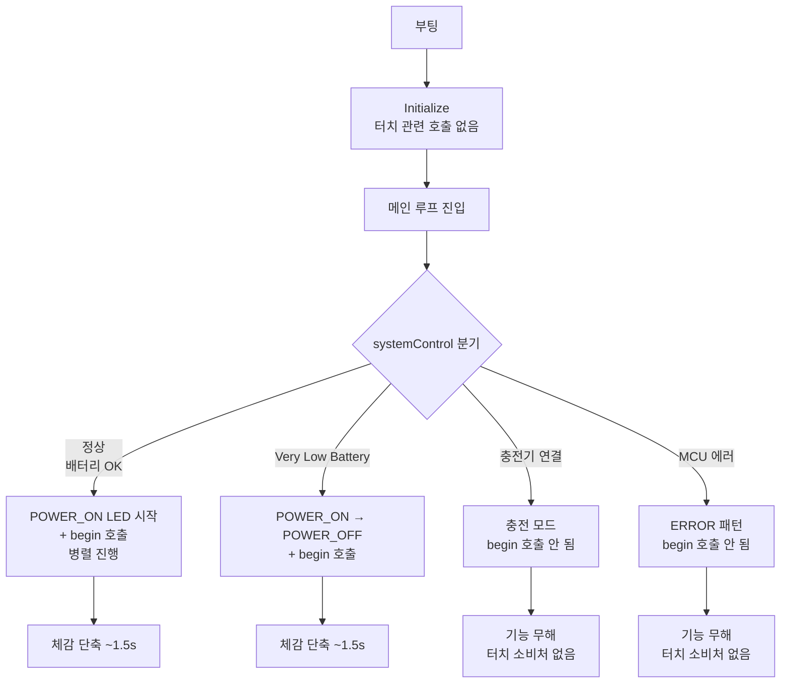
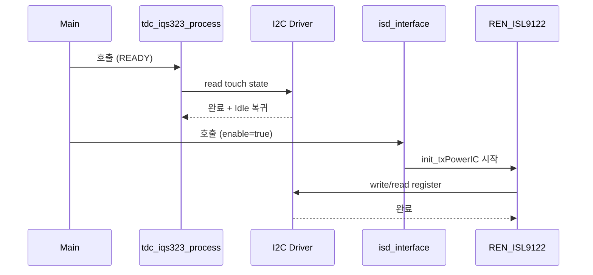
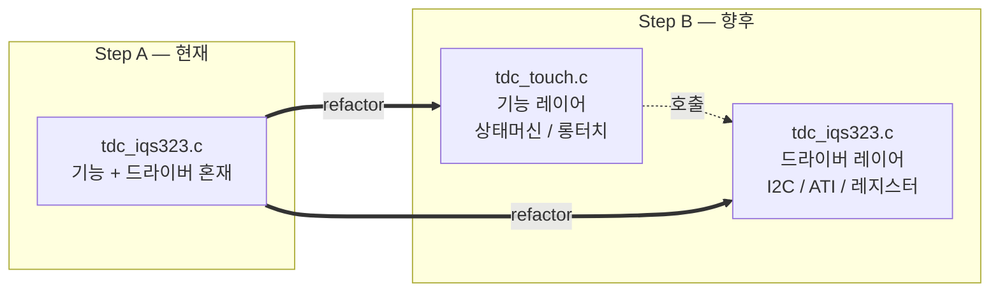

# 터치 센서 초기화 분할 구현 계획

**TL;DR**: Auto-ATI 대기(POR ~1.5 s, 워치독 ~165 ms) 블로킹을 POWER_ON LED 버스트와 병렬 진행시켜 체감 부팅 시간 최대 1.5 s 단축. Rev.2에서 `begin()`/`finish()` 둘 다 메인 루프 주체로 통일하여 LED 버스트 시작과 동시에 `begin()` 호출, 초기화 ↔ LED 버스트 생명주기 일치. 부수 효과로 TIMER3 자체가 불필요해짐.

작성자: 김은수
최종 갱신: 2026-04-20 (Rev.2 — `begin()`/`finish()` 둘 다 메인 루프 주체로 단순화)
상태: 리뷰 대기

> [!NOTE]
> **Rev.2 변경 요점**: Rev.1은 `begin()`을 `Initialize()` 내부에서, `finish()`를 메인 루프에서 호출하는 분산 구조였다. Rev.2에서는 **둘 다 메인 루프 주체**로 통일. Power On LED 패턴 시작과 동시에 `begin()`을 호출하여 초기화와 LED 버스트를 원천적으로 생명주기 일치시킨다. 부수 효과로 TIMER3 자체가 불필요해진다.

> [!TIP]
> **관련 문서**
> - [`참고/터치/터치센서 운용 방식.md`](../../../참고/터치/터치센서%20운용%20방식.md)
> - [`참고/칩/IQS323 터치센서 레지스터 레퍼런스.md`](../../../참고/칩/IQS323%20터치센서%20레지스터%20레퍼런스.md)
> - [`tasks/LED/20260421_operation-scheme/분석.md`](../../LED/20260421_operation-scheme/분석.md)

---

## 1. 요구사항

### 1.1 배경

현 구조(`tdc_iqs323_init()` 단일 호출)는 `Initialize()` 내부에서 Auto-ATI 완료까지 블로킹 대기한다. 실측값:

| 리셋 유형 | 소요 시간 | 주 원인 |
|---|---|---|
| 전원 인가 (POR) | 약 **1.5초** | IQS323 내부 Auto-ATI (POR 후 캘리브레이션) |
| Ezairo 워치독 리셋 | 약 **165ms** | IQS323은 유지, MCU만 재시작 |

사용자 체감 부팅 시간이 이 대기 시간만큼 늘어나 있다.

### 1.2 목표

부팅 시 터치 센서 Auto-ATI 대기 구간을 **파워온 LED 버스트(1.5초)** 와 병렬 진행하여 체감 부팅 시간을 최대 1.5초 단축한다.

### 1.3 제약

- IQS323 Auto-ATI 실행 중에 센서 설정을 변경하면 ATI 엔진이 손상된다. 설정은 반드시 Auto-ATI 완료 후에만 수행.
- I2C 드라이버는 단일 상태머신(`i2c_driver.i2c_diver_state`) 기반이므로 동시 호출 금지.
- 기존 타이머 체계(`ci_timer_get_tick()`)와의 연속성 유지.

### 1.4 UX 수용 전제

3초 롱터치가 전원 OFF 트리거이므로, 부팅 직후 터치 초기화가 0.5~1초 지연되어도 사용자 체감에 영향 없다. 실제로 Power On LED 버스트(1.5초) 동안에는 롱터치가 기능적으로 불필요한 구간이다.

---

## 2. 현상 분석

### 2.1 현재 초기화 구조

`tdc_iqs323_init()` 단일 함수가 MCLR 리셋부터 보상값 Reseed까지 블로킹 수행. `initialize.c:421`에서 1회 호출.



### 2.2 타이머 체계

| 구간 | 타이머 IRQ | 동작 |
|---|---|---|
| `Initialize()` 내부 | `TIMER_3_IRQHandler` | `g_ci_timer_main_tick++` + `enable_iteration()` |
| 메인 루프 진입 후 | `CFX_0_IRQHandler` / `FIFO_5_IRQHandler` | `enable_iteration()` + `ci_timer_increase_tick()` → `g_ci_timer_main_tick++` |

CFX 활성화는 `Initialize()` 리턴 직후 `cfx_cm3_sharedMemoryAll.is_enabled_CFX_iteration = 1` ([main.c:355](../src/2__cm3/Cortex-M3-src/main.c))에서 이루어진다.

> [!WARNING]
> 두 IRQ 모두 `g_ci_timer_main_tick`을 1씩 올린다. TIMER3를 uninit하지 않은 채 CFX가 활성화되면 틱이 2배 속도로 진행된다. Rev.2 설계는 **TIMER3를 아예 사용하지 않으므로** 이 위험이 원천 제거된다.

### 2.3 LED 파워온 패턴

[`LedOutput.c:44`](../src/2__cm3/Cortex-M3-src/systemControl/LedOutput.c):

| 요소 | 값 |
|---|---|
| 색상 | SKYBLUE |
| ON 시간 | 80ms |
| 주기 (ON+OFF) | 300ms |
| 반복 | 5회 |
| **총 소요** | **약 1500ms** |

Auto-ATI(POR) 소요 시간과 거의 일치한다.

### 2.4 `systemControl()` 분기 구조

[`systemControl.c:201-338`](../src/2__cm3/Cortex-M3-src/systemControl/systemControl.c):



`systemStatus`는 파일 전역 초기값 `{en__LED_NA, false, false, false, false, false}` ([systemControl.c:29](../src/2__cm3/Cortex-M3-src/systemControl/systemControl.c)). 부팅 직후 `enable_ISD = false`.

### 2.5 I2C 사용자 맵

| 드라이버 | 슬레이브 | 호출 시점 |
|---|---|---|
| `tdc_iqs323.c` | `0x44` | 터치 초기화, 100ms 폴링 |
| `driver_REN_ISL9122.c` | `0x18` | `isd_interface()` → `init_txPowerIC()` |

모두 같은 I2C0 하드웨어를 공유한다. `get_i2cDriverStatus()`가 `Idle`일 때만 안전하게 새 전송을 시작할 수 있다.

---

## 3. 설계

### 3.1 상태 정의

`tdc_iqs323.h`에 초기화 상태 enum 추가:



| 상태 | 의미 | `tdc_iqs323_process()` 반환 |
|---|---|---|
| `TDC_IQS323_INIT_STATE_NONE` | `begin()` 호출 전 | 항상 `false` |
| `TDC_IQS323_INIT_STATE_MCLR_DONE` | MCLR 완료, Auto-ATI 진행/완료 대기 | 항상 `false` (매 tick 마다 ATI 상태 체크) |
| `TDC_IQS323_INIT_STATE_READY` | 모든 설정 완료, 터치 감지 가능 | 기존 동작 |

### 3.2 공개 API

| 함수 | 호출자 | 수행 내용 | 소요 시간 |
|---|---|---|---|
| `tdc_iqs323_init_begin()` | `systemControl()` | MCLR 리셋 후 상태를 `MCLR_DONE`으로 전이 | ~55ms |
| `tdc_iqs323_process()` | `main()` 루프 | 상태별 분기: `NONE` no-op, `MCLR_DONE`은 `try_finish_init()` 호출, `READY`는 기존 폴링 | tick당 ~1-50ms |

> [!NOTE]
> 기존 `tdc_iqs323_init()` 심볼은 제거한다. 호출처가 1곳(`initialize.c:421`)뿐이라 호환 래퍼 유지 가치 없음.

### 3.3 호출 위치 — 옵션 A (systemControl.c)

```c
/* systemControl.c, line 209-215 부근 */

if (StartFlag == false)
{
    turnOffLED();
    systemStatus.Led_Pattern = en__LED_POWER_On;
    led_request(LED_SRC_POWER, LED_ST_POWER_ON);
    tdc_iqs323_init_begin();   /* ← 추가 — LED 버스트 시작과 같은 자리 */
    PowerOn_StartCounter = 0;
    StartFlag = true;
    ci_printi("[SYSTEM] LED PATTERN IS POWER ON \r\n");
}
```

정책(LED 패턴 결정)과 액션(하드웨어 bring-up)이 한 자리에 있어 "POWER_ON 진입 = 터치 센서 초기화 시작"이 코드 레벨로 명시된다.

### 3.4 타이머 단일화

Rev.1에서 문제였던 TIMER3 ↔ CFX 틱 전환이 **완전히 소멸**한다.

| 구간 | 틱 소스 | 비고 |
|---|---|---|
| `Initialize()` 내부 | — (터치 관련 호출 없음) | TIMER3 init 불필요 |
| `Initialize()` 리턴 직후 | CFX iteration 활성화 | 이후 모든 틱은 CFX 기반 |
| `begin()` / `finish()` | CFX 틱 | `ci_timer_init/uninit` 불필요 |

### 3.5 전체 시퀀스 (정상 부팅)



체감 부팅 단축: **~1.5초** (POR) / **~165ms** (워치독).

### 3.6 부팅 경로별 영향



| 경로 | `begin()` 호출 여부 | 체감 단축 | 터치 소비처 |
|---|---|---|---|
| 정상 부팅 | O | 최대 1.5s | 롱터치 전원 OFF |
| Very Low Battery | O | 최대 1.5s | 종료 예정 (무관) |
| 충전기 연결 부팅 | X | 0 | 없음 (`systemControl.c:153-200`에서 `powerButtonPushed` 미사용) |
| MCU 에러 부팅 | X | 0 | 없음 (`systemControl.c:358-383`에서 `powerButtonPushed` 미사용) |

> [!IMPORTANT]
> 본 설계는 **POWER_ON LED가 뜨지 않는 경로 = 터치 입력 소비처 없는 경로** 라는 관계에 의존한다. 향후 요구사항이 바뀌어 충전/에러 경로에서 롱터치 전원 OFF가 필요해지면, 해당 경로에서도 `begin()`을 명시적으로 호출하도록 설계 재검토가 필요하다.

---

## 4. I2C 비경쟁 근거

### 4.1 POWER_ON 버스트 구간 (~1.5초)

| 호출처 | 동작 | I2C 사용 |
|---|---|---|
| `tdc_iqs323_process()` (MCLR_DONE) | Auto-ATI 완료 체크 + 완료 시 설정 | **사용** (`0x44`) |
| `isd_interface(enable=false)` | `change_isd_state(en__isdStatus_PowerIC_Reset)` only | **미사용** |
| `OnOff_3V_PMIC_CM3_to_CFX(false)` | 공유 메모리 쓰기만 | **미사용** |

→ **I2C 단독 점유**. 경쟁 없음.

### 4.2 POWER_ON 버스트 종료 후

같은 `iterationFlag` tick 내 순차 실행:



양쪽 모두 호출 내부에서 블로킹 폴링으로 완료까지 대기 → 경쟁 불가능.

---

## 5. 구현 계획

### 5.1 파일 변경 목록

| 파일 | 변경 종류 | 내용 |
|---|---|---|
| `src/2__cm3/Cortex-M3-src/systemControl/tdc_iqs323.h` | 추가 / 제거 | `tdc_iqs323_init_state_t` enum, `tdc_iqs323_init_begin()` 선언. 기존 `tdc_iqs323_init()` 선언 제거 |
| `src/2__cm3/Cortex-M3-src/systemControl/tdc_iqs323.c` | 리팩터 | `tdc_iqs323_init()` 분해 → `tdc_iqs323_init_begin()` / `try_finish_init()` (static) / `tdc_iqs323_process()` 상태 분기. `s_init_state` static 변수 추가. `ci_timer_init/uninit` 호출 제거 |
| `src/2__cm3/Cortex-M3-src/systemControl/initialize.c` | 삭제 | `tdc_iqs323_init()` 호출 제거 (line 420-421 근처). `#include <tdc_iqs323.h>` 는 제거해도 되는지 확인 |
| `src/2__cm3/Cortex-M3-src/systemControl/systemControl.c` | 추가 | `StartFlag == false` 분기에 `tdc_iqs323_init_begin()` 호출. `#include "tdc_iqs323.h"` 추가 |

### 5.2 함수 시그니처 초안

```c
/* tdc_iqs323.h */

typedef enum {
    TDC_IQS323_INIT_STATE_NONE = 0,
    TDC_IQS323_INIT_STATE_MCLR_DONE,
    TDC_IQS323_INIT_STATE_READY
} tdc_iqs323_init_state_t;

void tdc_iqs323_init_begin(void);   /* systemControl()에서 POWER_ON 진입 시 1회 호출 */

/* try_finish_init()은 tdc_iqs323_process() 내부에서만 호출되는 static 함수.
 * 공개 API에 노출하지 않는다. */
```

### 5.3 핵심 로직 초안

```c
/* tdc_iqs323.c */

static tdc_iqs323_init_state_t s_init_state = TDC_IQS323_INIT_STATE_NONE;

void tdc_iqs323_init_begin(void)
{
    ci_printi("[TOUCH] INIT BEGIN \r\n");
    SYS_WATCHDOG_REFRESH();

    mclr_reset();   /* IQS323 POR → Auto-ATI 시작 */

    s_init_state = TDC_IQS323_INIT_STATE_MCLR_DONE;
}

static bool try_finish_init(void)
{
    /* 1회 read로 Auto-ATI 상태 확인 — 루프 없음 (메인 루프가 폴링) */
    if (!is_auto_ati_done_single_read())
    {
        return false;
    }

    SYS_WATCHDOG_REFRESH();

    /* 완료됨 — 설정 일괄 진행 */
    ack_reset_event();
    confirm_reset_event();
    sensor_setup();
    touch_settings();
    events_enable();
    write_ati_compensation();
    write_register(TDC_IQS323_REG_ADDR_SYSTEM_CONTROL, 0x08, 0x00);  /* Reseed */

    SYS_WATCHDOG_REFRESH();
    ci_printi("[TOUCH] INIT FINISH DONE \r\n");

    s_tdc_iqs323_tick_old        = ci_timer_get_tick();
    s_tdc_iqs323_touch_state_old = TDC_IQS323_TOUCH_STATE_RESET;
    return true;
}

bool tdc_iqs323_process(void)
{
    switch (s_init_state)
    {
        case TDC_IQS323_INIT_STATE_NONE:
            return false;

        case TDC_IQS323_INIT_STATE_MCLR_DONE:
            if (try_finish_init()) {
                s_init_state = TDC_IQS323_INIT_STATE_READY;
            }
            return false;

        case TDC_IQS323_INIT_STATE_READY:
        default:
            break;
    }

    /* === 기존 tdc_iqs323_process() 본문 (100ms 폴링 + 롱터치) === */
    /* ... */
}
```

`is_auto_ati_done_single_read()`는 기존 `wait_auto_ati_done()`에서 루프와 delay를 제거한 1회 read 버전. 루프는 메인 루프의 1ms tick이 대체.

### 5.4 덤프 모드 처리

`TDC_IQS323_ATI_DUMP_ENABLE=1` 인 개발용 경로는 1회성이며 시간 제약이 없다. Rev.2 구조에서는:

- `begin()`은 덤프 모드에서도 동일하게 MCLR만 수행
- `try_finish_init()` 내부에 `#if TDC_IQS323_ATI_DUMP_ENABLE` 분기 유지: Auto-ATI 완료 대기 → ACK → 설정 → RE-ATI → `dump_ati_registers()`

---

## 6. Rev.1 대비 변경점 요약

| 항목 | Rev.1 | Rev.2 |
|---|---|---|
| `begin()` 호출 위치 | `Initialize()` 끝 | `systemControl.c` POWER_ON 분기 |
| TIMER3 사용 | `begin()`에서 init → uninit 필요 | **사용 안 함** (CFX 틱만) |
| 상태머신 주체 | `Initialize()` + 메인 루프 분산 | 메인 루프 단일 |
| 충전기 / 에러 부팅 시 begin() | O (불필요 호출) | X (필요한 경로에서만) |
| 체감 부팅 단축 (POR) | ~1.5s | ~1.5s (동일) |
| 코드 복잡도 | 타이머 전환 주의 필요 | 전환 소멸 |

---

## 7. 검증 계획

### 7.1 RTT 로그 검증

| 시나리오 | 기대 로그 순서 |
|---|---|
| POR 부팅 | `Initialize 시작` → `Initialize 리턴` → `LED PATTERN IS POWER ON` → `[TOUCH] INIT BEGIN` → (~1.5s) → `[TOUCH] INIT FINISH DONE` |
| 워치독 리셋 | 동일. `BEGIN`→`FINISH DONE` 간격 ~150ms |
| 충전기 연결 부팅 | `Initialize` 이후 `INIT BEGIN` 로그 미출현 |
| 부팅 직후 터치 입력 | `FINISH DONE` 이전: 무시. 이후: 정상 감지 |

### 7.2 타이밍 측정

| 항목 | 기대값 | 기존 대비 |
|---|---|---|
| `Initialize()` 진입 ~ 리턴 | 기존 - (MCLR 55ms + ATI 대기 1.5s) | **약 1.6초 단축** |
| `begin()` 내부 MCLR | ~55ms | 동일 |
| `begin()` 리턴 ~ `FINISH DONE` | POR ~1.5s / 워치독 ~150ms | 동일 |
| `Initialize()` 리턴 ~ 최초 터치 감지 가능 시점 | ~1.5s | 거의 동일 (다만 이 구간은 LED 버스트로 숨겨짐) |

### 7.3 기능 검증

- [ ] 정상 부팅 후 싱글 터치 / 롱터치(3초) 감지
- [ ] POWER_ON 버스트 종료 후 배터리 LED 상태 전환 정상
- [ ] ISD 링크 PMIC I2C 정상 (버스트 종료 이후에만 호출)
- [ ] 롱터치 / Very Low Battery → POWER_OFF 버스트 → systemOff
- [ ] Ezairo 워치독 리셋 후 복귀 시 터치 재초기화 동작
- [ ] 충전기 연결 부팅에서 터치 미초기화 확인 (`INIT BEGIN` 로그 미출현)
- [ ] MCU 에러 부팅에서 터치 미초기화 확인 (동일)

### 7.4 레지스터 변경 체크리스트

본 변경은 **레지스터 값 변경이 아니라 호출 순서 조정**이므로 [`지침/레지스터 변경 검증 체크리스트.md`](../../../지침/레지스터%20변경%20검증%20체크리스트.md) 적용 대상이 아니다. 단, `try_finish_init()` 내부 레지스터 쓰기 순서는 기존 시퀀스를 그대로 유지하므로 회귀 위험 없음을 확인만 한다.

---

## 8. 리스크 및 완화

| 리스크 | 가능성 | 영향 | 완화 |
|---|---|---|---|
| MCLR 시점 지연 | 저 | 전원 인가 직후 수백 ms 동안 IQS323이 이전 세션 상태 유지 | 이 구간에는 어차피 터치 소비처 없음. POWER_ON LED 진입 시점에 MCLR로 강제 재동기화. |
| 에러 / 충전 경로에서 터치 영구 미초기화 | 저 | 해당 경로에서 터치 필요 없음 (현 UX) | 본 문서 3.6절 전제 명시. 향후 요구사항 변경 시 재검토. |
| Auto-ATI 타임아웃 (터치 중 부팅) | 저 | `FINISH DONE` 지연 | `try_finish_init()` 내부에 타임아웃 카운터 추가. 일정 시간 초과 시 강제 진행 + 경고 로그 |
| 덤프 모드 분할 누락 | 저 | 개발용 플래그 오작동 | `try_finish_init()` 내부에 덤프 모드 분기 그대로 이식 |
| I2C 상태 누수 | 저 | 이후 I2C 호출 실패 | 기존 `i2c_write/read` 패턴 유지 (완료 후 Idle 복귀) |

---

## 9. 전제 및 가정

> [!IMPORTANT]
> 본 설계는 다음 전제 위에 성립한다. 전제 중 하나라도 깨지는 순간 설계 재검토 필요.
>
> 1. 충전기 연결 부팅 경로는 `powerButtonPushed`를 소비하지 않는다. ([systemControl.c:153-200](../src/2__cm3/Cortex-M3-src/systemControl/systemControl.c))
> 2. MCU 에러 부팅 경로는 `powerButtonPushed`를 소비하지 않는다. ([systemControl.c:358-383](../src/2__cm3/Cortex-M3-src/systemControl/systemControl.c))
> 3. 3초 롱터치 전원 OFF UX는 파워온 LED 버스트(1.5초) 이후에만 유의미하게 발생한다.
> 4. Ezairo 워치독 리셋 후 MCU만 재시작되고 IQS323은 전원 유지된 상태다.

---

## 10. 결정 현황

| 항목 | 상태 | 비고 |
|---|---|---|
| 분할 구조 채택 | ✅ 확정 | `begin()` / `finish()` 2단계 |
| `begin()` / `finish()` 주체 | ✅ 확정 | 둘 다 메인 루프 |
| `begin()` 호출 위치 | ✅ 확정 | 옵션 A — `systemControl.c:210` 분기 |
| `finish()` 스텝 분할 | ✅ 확정 | 일괄 진행 (~50ms 블록, tick 내에서 처리 가능) |
| 파워온 직후 롱터치 UX | ✅ 불필요로 확정 | 9절 전제 3 |
| 구현 착수 | ✅ 승인 | 2026-04-20 |

---

## 11. 향후 작업 — Step B: 레이어 분리

본 Rev.2(Step A)는 **초기화 순서 조정만** 다룬다. 파일 분할은 별도 단계(Step B)로 분리한다.

### 11.1 목표

`tdc_iqs323.c`에 혼재된 두 책임을 2-레이어로 분리:



### 11.2 이동 대상

| 현재 위치 | 이동 후 | 분류 |
|---|---|---|
| `s_init_state`, `tdc_iqs323_init_begin`, `try_finish_init`, `tdc_iqs323_process` | `tdc_touch.c` | 기능 |
| `proc_touch` (롱터치 3초 판정) | `tdc_touch.c` | 기능 |
| `mclr_reset`, `wait_auto_ati_done`, `ack_reset_event`, `sensor_setup`, `touch_settings`, `events_enable`, `write_ati_compensation` | `tdc_iqs323.c` (드라이버 공개 API로 승격) | 드라이버 |
| I2C / RDY 윈도우 헬퍼 | `tdc_iqs323.c` (내부 static) | 드라이버 |

### 11.3 연결 방식

HAL 함수 포인터 테이블은 **도입하지 않음**. `tdc_touch.c`가 `#include <tdc_iqs323.h>`로 직접 호출. IC 교체가 필요한 시점에 함수 포인터 도입을 재검토.

### 11.4 착수 시점

Step A 구현 & 실기 검증 완료 후 별도 `[구현계획] 터치 레이어 분리 by 김은수.md` 작성.

---

## 12. 참고

- 브랜치: `claude_feature_touch-sensor`
- 관련 이전 커밋:
  - `a87af7c` — 터치 초기화 소요 시간 측정 로그 추가
  - `4a1275b` — 운용 모드 Auto-ATI 대기 + 고정값 + Reseed
  - `417f1f9` — ATI 보상값 고정 적용 방식 구현

## 자체 검토

### 지침 준수 여부
| 지침 | 준수 |
|---|---|
| [`작업 진행 규칙.md`](../../../../../../docs/지침/일반/작업%20진행%20규칙.md) | ✅ |
| [`문서 작성 규칙.md`](../../../../../../docs/지침/일반/문서%20작성%20규칙.md) | ✅ |

### 논리적 정합성
| 점검 | 결과 |
|---|---|
| 본문 기존 내용 보존 (양식 정합화 시 무손실) | ✅ |
| frontmatter·TL;DR 기준 충족 | ✅ |
| 관련 산출물(요구사항·분석·계획·이력) 상호 일관 | ✅ |

### 미해결 이슈
| 이슈 | 처리 |
|---|---|
| 해당 없음 | — |
