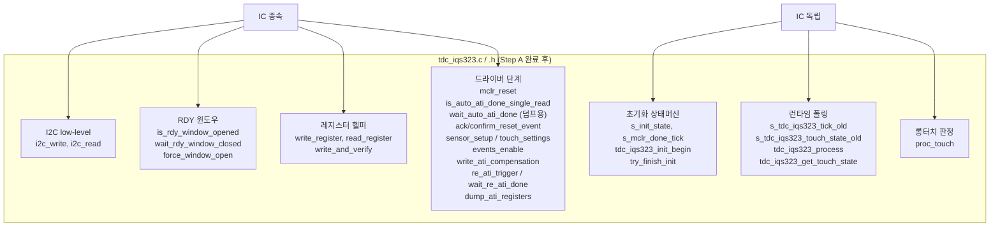
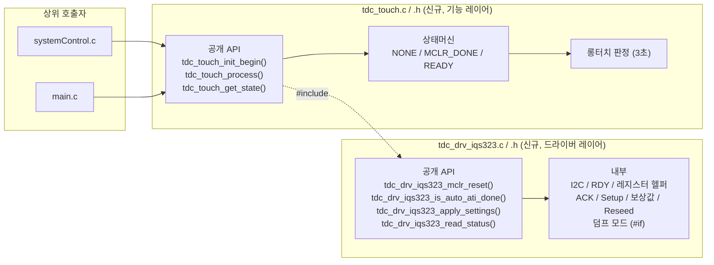
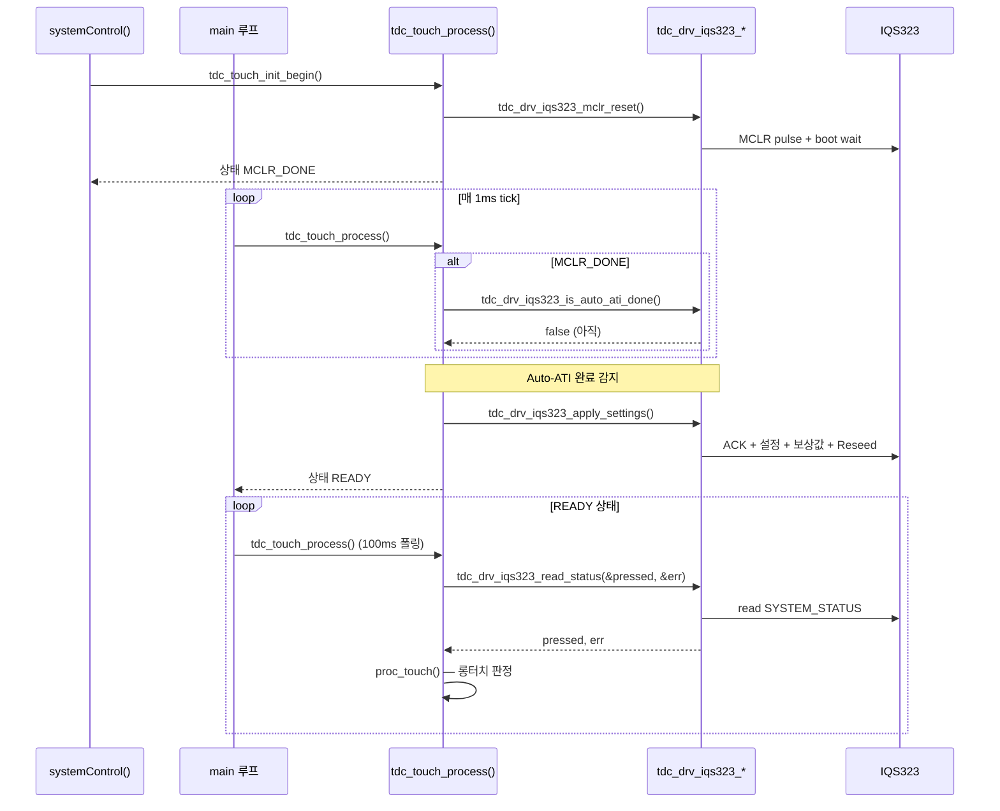
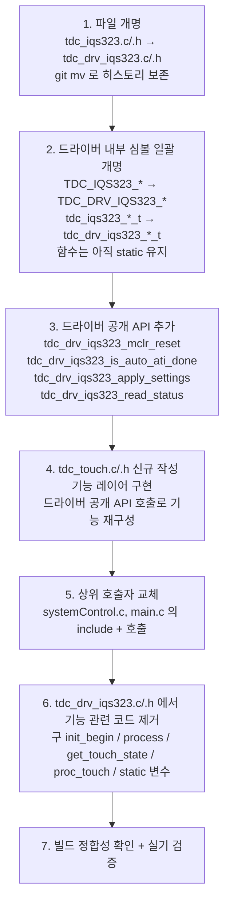

# 터치 레이어 분리 구현 계획

**TL;DR**: Step A(init-split) 후 `tdc_iqs323.c`에 섞여 있는 두 책임 — IC 독립 기능(상태머신·100 ms 폴링·3 s 롱터치 판정)과 IQS323 고유 드라이버(MCLR·Auto-ATI·레지스터·I2C·RDY) — 을 별도 파일로 분리. HAL 함수 포인터 테이블은 도입하지 않고 `#include` 직접 호출 채택, 루트 네이밍 컨벤션의 `tdc_drv_<chip>` 역할 표식 적용 (Rev.1 초안).

작성자: 김은수
최종 갱신: 2026-04-20 (Rev.1 — 초안, 네이밍 컨벤션 반영)
상태: 리뷰 대기

> [!NOTE]
> 본 문서는 [`tasks/touch/20260421_init-split/구현계획.md`](../init-split/구현계획.md)의 §11 "향후 작업"에서 승격된 Step B 계획이다. Step A(초기화 분할)는 2026-04-20에 구현·검증·병합 완료.

> [!TIP]
> **관련 문서**
> - [`tasks/touch/20260421_init-split/구현계획.md`](../init-split/구현계획.md) — Step A
> - [`참고/터치/터치센서 운용 방식.md`](../../../참고/터치/터치센서%20운용%20방식.md)
> - [`참고/칩/IQS323 터치센서 레지스터 레퍼런스.md`](../../../참고/칩/IQS323%20터치센서%20레지스터%20레퍼런스.md)

---

## 1. 요구사항

### 1.1 배경

Step A 이후 `tdc_iqs323.c`에는 두 가지 책임이 섞여 있다:

- **기능(Function) 책임** — 부팅 후 초기화 상태머신 진행, 100ms 폴링, 3초 롱터치 판정. 어떤 IC를 쓰든 동일한 UX 로직.
- **드라이버(Driver) 책임** — IQS323 고유의 MCLR, Auto-ATI, 레지스터 맵, I2C, RDY 윈도우. 칩 교체 시 전부 변경 대상.

### 1.2 목표

두 책임을 별도 파일로 분리하여:

1. 상위 UX 로직(롱터치 3초 등)이 IC에 독립적이 되도록 한다.
2. IC 교체 시 수정 범위를 드라이버 파일로 한정한다.
3. 파일별 관심사가 단일화되어 리뷰·유지보수 비용을 낮춘다.

### 1.3 제약

- **기능 동등성 유지**. Step A의 모든 외부 동작(부팅 시퀀스, 로그, 롱터치 판정, 덤프 모드)을 그대로 재현.
- HAL 함수 포인터 테이블은 **도입하지 않는다**. 기능 레이어가 드라이버 헤더를 `#include`로 직접 호출. 실제 IC 교체 수요가 생기면 그 시점에 HAL 재검토.
- 공개 API 변화는 상위 호출자(`systemControl.c`, `main.c`)에만 영향. 호출자 변경도 본 범위에 포함.

### 1.4 네이밍 컨벤션

본 리팩터는 루트 네이밍 지침 [`지침/코딩/네이밍 컨벤션.md`](../../../../../../docs/지침/코딩/네이밍%20컨벤션.md)의 **`tdc_drv_<chip>` 역할 표식** 규칙을 따른다 (2026-04-20 개정).

| 역할 | 파일 | 함수·변수 | 상수·매크로·타입 |
|---|---|---|---|
| 기능 레이어 | `tdc_<feature>.c/.h`<br/>예: `tdc_touch.c` | `tdc_<feature>_<action>()`<br/>예: `tdc_touch_process()` | `TDC_<FEATURE>_*`<br/>예: `TDC_TOUCH_POLL_INTERVAL` |
| 드라이버 레이어 | `tdc_drv_<chip>.c/.h`<br/>예: `tdc_drv_iqs323.c` | `tdc_drv_<chip>_<action>()`<br/>예: `tdc_drv_iqs323_mclr_reset()` | `TDC_DRV_<CHIP>_*` / `tdc_drv_<chip>_*_t`<br/>예: `TDC_DRV_IQS323_REG_ADDR_SYSTEM_STATUS` |

> [!NOTE]
> **역할 표식의 의미** — `tdc_drv_` 가 붙은 코드는 해당 장치 교체 시 **수정 범위를 드라이버 파일로 한정**하는 계약을 가진다. 이후 다른 칩(예: 배터리 게이지)의 드라이버 파일이 추가될 때도 동일 규칙 적용. 회사 기존 `driver_*.c` 파일들은 범위 밖이라 그대로 유지.

### 1.5 UX 수용 전제

Step A와 동일 — 3초 롱터치가 전원 OFF 트리거이므로 부팅 직후 터치 초기화가 지연되어도 사용자 체감에 영향 없음.

---

## 2. 현상 분석 (Step A 완료 후)

### 2.1 현재 파일 내용 분포



### 2.2 상위 호출자 현황

| 파일 | 호출 | 성격 |
|---|---|---|
| `systemControl.c:219` | `tdc_iqs323_init_begin()` | 기능 레이어 진입점 사용자 |
| `main.c:380` | `tdc_iqs323_process()` | 기능 레이어 |
| `main.c:702` | `tdc_iqs323_process()` (ULP 루프) | 기능 레이어 |
| `main.c:713` | `tdc_iqs323_get_touch_state()` (ULP 루프) | **현재는 드라이버 공개 API로 분류되어 있으나 기능 의미** |

### 2.3 헤더 상수/매크로 분포

| 이름 | 성격 | 이동 후 |
|---|---|---|
| `TDC_IQS323_SLAVE_ADDR`, `TDC_IQS323_RDY_PIN`, `TDC_IQS323_RDY_PIN_CFG_*`, `TDC_IQS323_MCLR_HOLD_MS`, `TDC_IQS323_BOOT_WAIT_MS`, `TDC_IQS323_MAX_WAIT_MS_*`, 모든 `TDC_IQS323_REG_ADDR_*`, bitfield 구조체 | IC 종속 → 드라이버 헤더 | `TDC_DRV_IQS323_*` / `tdc_drv_iqs323_*_t` |
| `TDC_IQS323_POLL_INTERVAL`, `TDC_IQS323_LONG_TOUCH_MS`, `TDC_IQS323_TOUCH_STATE_*`, `TDC_IQS323_INIT_TIMEOUT_MS`, `TDC_IQS323_INIT_STATE_*` | IC 독립 → 기능 헤더 | `TDC_TOUCH_*` |

---

## 3. 설계

### 3.1 새 파일 배치



> [!NOTE]
> 기존 `tdc_iqs323.c/.h` 파일은 **`tdc_drv_iqs323.c/.h` 로 개명**. git mv 로 히스토리 유지.

### 3.2 기능 레이어 공개 API — `tdc_touch.h`

```c
typedef enum {
    TDC_TOUCH_STATE_RESET,              /* 초기 상태 */
    TDC_TOUCH_STATE_TOUCH,              /* 터치 중 */
    TDC_TOUCH_STATE_NOT_TOUCH,          /* 비터치 */
    TDC_TOUCH_STATE_CALIBRATION_ERROR   /* 드라이버 캘리브레이션 실패 (예: IQS323 ATI_ERROR) */
} tdc_touch_state_t;

/* Power On 진입 시 1회 호출. MCLR 리셋 트리거 후 즉시 리턴. */
void tdc_touch_init_begin(void);

/* 매 tick 호출. 초기화 진행 + 100ms 폴링 + 3초 롱터치 판정.
 * 반환: true = 롱터치 이벤트 발생 (최초 1회) */
bool tdc_touch_process(void);

/* 즉시 현재 터치 상태 읽기 (ULP 웨이크 판정 등).
 * 반환: true = read 성공 */
bool tdc_touch_get_state(tdc_touch_state_t *p_state);
```

기능 상수는 `TDC_TOUCH_POLL_INTERVAL`, `TDC_TOUCH_LONG_TOUCH_MS`, `TDC_TOUCH_INIT_TIMEOUT_MS` 로 기능 헤더에 정의.

### 3.3 드라이버 레이어 공개 API — `tdc_drv_iqs323.h`

```c
/* IQS323 MCLR 하드 리셋. ~55ms 블로킹. */
void tdc_drv_iqs323_mclr_reset(void);

/* Auto-ATI 완료 여부 1회 read (논블로킹).
 * 반환: true = 완료 / false = 아직 진행 중 */
bool tdc_drv_iqs323_is_auto_ati_done(void);

/* ACK + Sensor/Touch/Events 설정 + 고정 ATI 보상값 + Reseed 일괄 적용.
 * Auto-ATI 완료 후 호출해야 한다. */
void tdc_drv_iqs323_apply_settings(void);

/* 현재 터치 여부 + 드라이버 에러 여부 1회 read.
 * 반환: true = read 성공. *p_pressed 에 터치 상태,
 *       *p_ati_error 에 ATI_ERROR 플래그. */
bool tdc_drv_iqs323_read_status(bool *p_pressed, bool *p_ati_error);
```

칩 전용 상수(`TDC_DRV_IQS323_SLAVE_ADDR`, `TDC_DRV_IQS323_REG_ADDR_*`) 및 bit 구조체 타입(`tdc_drv_iqs323_reg_*_t`)은 드라이버 헤더에 유지.

> [!NOTE]
> `apply_settings()` 내부에서 기존의 `ack_reset_event` → `confirm_reset_event` → `sensor_setup` → `touch_settings` → `events_enable` → `write_ati_compensation` → Reseed 순서를 그대로 호출. 덤프 모드 분기(`#if TDC_DRV_IQS323_ATI_DUMP_ENABLE`)도 함수 내부에 유지.

### 3.4 호출 시퀀스 (After)



---

## 4. 이동·개명 매핑

### 4.1 함수

| 현재 (`tdc_iqs323.c`) | 이동 후 | 변경 |
|---|---|---|
| `i2c_write`, `i2c_read` | `tdc_drv_iqs323.c` (static) | 유지, 파일만 개명 |
| `is_rdy_window_opened`, `wait_rdy_window_closed`, `force_window_open` | `tdc_drv_iqs323.c` (static) | 유지 |
| `write_register`, `read_register`, `write_and_verify` | `tdc_drv_iqs323.c` (static) | 유지 |
| `mclr_reset` (static) | `tdc_drv_iqs323.c` | **공개 승격** → `tdc_drv_iqs323_mclr_reset()` |
| `is_auto_ati_done_single_read` (static) | `tdc_drv_iqs323.c` | **공개 승격 + 개명** → `tdc_drv_iqs323_is_auto_ati_done()` |
| `wait_auto_ati_done` (static, 덤프용) | `tdc_drv_iqs323.c` (static) | 유지 |
| `ack_reset_event`, `confirm_reset_event`, `sensor_setup`, `touch_settings`, `events_enable`, `write_ati_compensation` (static) | `tdc_drv_iqs323.c` (static) | `tdc_drv_iqs323_apply_settings()` 내부에서만 호출 |
| `re_ati_trigger`, `wait_re_ati_done`, `dump_ati_registers` (static, 덤프용) | `tdc_drv_iqs323.c` (static) | 덤프 모드 분기에서만 사용 |
| `tdc_iqs323_init_begin` (공개) | `tdc_touch.c` | **기능 레이어로 이동 + 개명** → `tdc_touch_init_begin()`. 내부에서 `tdc_drv_iqs323_mclr_reset()` 호출 후 상태 MCLR_DONE 전이 |
| `try_finish_init` (static) | `tdc_touch.c` (static) | 드라이버 공개 API(`is_auto_ati_done`, `apply_settings`) 호출하는 orchestration |
| `tdc_iqs323_process` (공개) | `tdc_touch.c` | **개명** → `tdc_touch_process()`. 내부에서 `tdc_drv_iqs323_read_status()` 호출 |
| `tdc_iqs323_get_touch_state` (공개) | `tdc_touch.c` | **이동 + 개명 + 반환형 변경** → `tdc_touch_get_state(tdc_touch_state_t *)` |
| `proc_touch` (static) | `tdc_touch.c` (static) | 유지 |

### 4.2 전역/static 변수

| 현재 | 이동 후 |
|---|---|
| `s_init_state`, `s_mclr_done_tick` | `tdc_touch.c` |
| `s_tdc_iqs323_tick_old`, `s_tdc_iqs323_touch_state_old` | `tdc_touch.c`, 이름 `s_tdc_touch_tick_old`, `s_tdc_touch_state_old` |

### 4.3 상수·매크로·타입

| 현재 | 이동 후 |
|---|---|
| `TDC_IQS323_SLAVE_ADDR`, `TDC_IQS323_RDY_PIN`, `TDC_IQS323_RDY_WINDOW_*`, `TDC_IQS323_RDY_PIN_CFG_*`, `TDC_IQS323_MCLR_HOLD_MS`, `TDC_IQS323_BOOT_WAIT_MS`, `TDC_IQS323_DEFAULT_DELAY_MS`, `TDC_IQS323_MAX_WAIT_MS_*`, 모든 `TDC_IQS323_REG_ADDR_*`, 모든 비트 구조체 | `tdc_drv_iqs323.h` — **전부 `TDC_DRV_IQS323_*` / `tdc_drv_iqs323_*_t` 로 개명** |
| `TDC_IQS323_TOUCH_STATE_*` (4개) | 삭제 — `tdc_touch.h` 의 `tdc_touch_state_t` enum 으로 대체 |
| `TDC_IQS323_POLL_INTERVAL`, `TDC_IQS323_LONG_TOUCH_MS` | `tdc_touch.h`, **개명** → `TDC_TOUCH_POLL_INTERVAL`, `TDC_TOUCH_LONG_TOUCH_MS` |
| `TDC_IQS323_INIT_TIMEOUT_MS`, `TDC_IQS323_INIT_STATE_*` (enum, 상태머신용) | `tdc_touch.c` 내부 static, **개명** → `TDC_TOUCH_INIT_TIMEOUT_MS`, `tdc_touch_init_state_t` |
| `TDC_IQS323_ATI_DUMP_ENABLE`, `TDC_IQS323_ATI_*_LSB/MSB` (덤프·고정보상값) | `tdc_drv_iqs323.c` 내부, **개명** → `TDC_DRV_IQS323_*` |

---

## 5. 상위 호출자 변경

### 5.1 `systemControl.c`

| 변경 | 내용 |
|---|---|
| include | `#include "tdc_iqs323.h"` → `#include "tdc_touch.h"` |
| 호출 | `tdc_iqs323_init_begin()` → `tdc_touch_init_begin()` |

### 5.2 `main.c`

| 변경 | 내용 |
|---|---|
| include (있다면) | `tdc_iqs323.h` → `tdc_touch.h` |
| 호출 | `tdc_iqs323_process()` (line 380, 702) → `tdc_touch_process()` |
| 호출 | `tdc_iqs323_get_touch_state()` (line 713) → `tdc_touch_get_state()` (반환형 enum 기준 분기 확인) |

### 5.3 `tdc_ui_command.c` / 기타

`tdc_iqs323_*` 공개 API를 호출하는 다른 파일이 있는지 구현 착수 전 최종 grep으로 확인.

---

## 6. 구현 순서

본 리팩터는 다음 순서로 진행한다. 각 단계 후 빌드 가능 상태를 유지한다.



> [!IMPORTANT]
> 1~3단계는 순수한 개명/공개 승격이라 컴파일만 통과하면 기능 동등. 4~5단계는 기능 레이어 신규 도입으로 구현 공존 구간. 6단계에서 구 구현 제거 전에 한 번 실기 확인하는 것이 안전.

---

## 7. 검증 계획

### 7.1 기능 동등성 회귀 시험

Step A의 검증 체크리스트와 동일:

- [ ] 정상 부팅 RTT 로그: `INIT BEGIN` → (~1.5초) → `INIT FINISH DONE`
- [ ] Ezairo 워치독 리셋: `INIT BEGIN` → (~150ms) → `INIT FINISH DONE`
- [ ] 충전기 연결 부팅: `INIT BEGIN` 로그 미출현
- [ ] 싱글 터치 / 3초 롱터치 → 전원 OFF
- [ ] POWER_ON 버스트 종료 후 배터리 LED 상태 정상 전환
- [ ] ISD 링크 PMIC I2C 정상
- [ ] ULP 루프 (슬립 → 터치 웨이크) 정상

### 7.2 정적 검증

- [ ] `grep -r 'tdc_iqs323_init\|tdc_iqs323_process\|tdc_iqs323_get_touch_state' src/` → 잔존 없음
- [ ] `grep -r 'TDC_IQS323_' src/` → 잔존 없음 (모두 `TDC_DRV_IQS323_` 또는 `TDC_TOUCH_`)
- [ ] `tdc_touch.h` / `tdc_drv_iqs323.h` 양쪽 include 순환 없음
- [ ] `tdc_drv_iqs323.h` 에 기능 관련 선언(`*_init_begin`, `*_process`, `*_get_touch_state`, `TOUCH_STATE_*`, `POLL_INTERVAL` 등) 잔존 없음

### 7.3 빌드

- [ ] Eclipse 빌드 warning 증가 없음
- [ ] Release 크기 유의미한 차이 없음 (순수 리팩터라 동등 예상)

---

## 8. 리스크 및 완화

| 리스크 | 가능성 | 영향 | 완화 |
|---|---|---|---|
| 심볼 일괄 개명 중 일부 누락 | 중 | 빌드 실패 | 단계별 빌드 + grep 전수 조사. §7.2 체크 |
| Static 변수 이동 누락으로 링크 에러 | 중 | 빌드 실패 | 단계별 빌드, 에러 시 즉시 해결 |
| 상위 호출자(`main.c` 등)에서 구명칭 잔존 | 중 | 링크 에러 또는 미사용 선언 경고 | 구현 완료 후 grep 전수 조사 |
| 덤프 모드(`TDC_DRV_IQS323_ATI_DUMP_ENABLE`) 경로 파손 | 저 | 개발용 1회성이라 즉시 감지 어려움 | 리팩터 후 덤프 모드 플래그 1회 켜서 빌드 확인 |
| 기능 동등성 미세 차이 (예: 로그 순서, 타이밍 드리프트) | 저 | 디버깅 혼란 | Step A 로그와 1:1 비교 |
| `tdc_iqs323_get_touch_state` → `tdc_touch_get_state` 반환형 변경 (int → enum) 미반영 호출자 | 저 | 경고/버그 | `main.c:713` ULP 루프 주의 깊게 확인 |
| git mv 누락 → 히스토리 단절 | 저 | blame 추적 어려움 | 1단계에서 `git mv` 사용 확인 |

---

## 9. 결정 현황

| # | 항목 | 상태 | 비고 |
|---|---|---|---|
| 1 | 네이밍 컨벤션 `tdc_drv_<chip>` (§1.4) | 완료 확정 | 루트 지침 2026-04-20 개정에 반영. 이후 모든 드라이버에 적용 |
| 2 | 상태 enum `TDC_TOUCH_STATE_CALIBRATION_ERROR` | 완료 확정 | `ATI`는 IQS323 고유 용어라 제외. 터치 센서 전반에 범용적인 "캘리브레이션" 채택 |
| 3 | 드라이버 read API 시그니처 `tdc_drv_iqs323_read_status(bool *pressed, bool *ati_error)` | ⏳ 리뷰 대기 | 대안: 상태 비트 합친 struct 또는 enum 하나 |
| 4 | 구현 순서 — 7단계 분할 vs 1커밋 일괄 | ⏳ 리뷰 대기 | 분할(회귀 범위 좁음) 추천 |
| 5 | 덤프 모드 — `apply_settings()` 내부 `#if` 분기 vs 별도 공개 함수 분리 | ⏳ 리뷰 대기 | 내부 `#if` 추천 |

---

## 10. 참고

- 베이스 브랜치: `claude_develop` (Step A 병합 완료 상태, `97f2f25`)
- 작업 브랜치: `claude_feature_touch-layer-split`
- Step A 병합 커밋: `fe3c2ca Merge claude_feature_touch-sensor into claude_develop`


## 1. 전체 시퀀스

해당 없음

## 2. 단계별 상세

해당 없음

## 3. 검증 절차

해당 없음

## 4. 위험 관리

해당 없음

## 5. 작업 분담 (서브에이전트 활용)

해당 없음

## 6. 진행 추적

해당 없음

## 7. 관련 산출물

해당 없음

## 자체 검토

### 지침 준수 여부
| 지침 | 준수 |
|---|---|
| [`작업 진행 규칙.md`](../../../../../../docs/지침/일반/작업%20진행%20규칙.md) | 완료 |
| [`문서 작성 규칙.md`](../../../../../../docs/지침/일반/문서%20작성%20규칙.md) | 완료 |

### 논리적 정합성
| 점검 | 결과 |
|---|---|
| 본문 기존 내용 보존 (양식 정합화 시 무손실) | 완료 |
| frontmatter·TL;DR 기준 충족 | 완료 |
| 관련 산출물(요구사항·분석·계획·이력) 상호 일관 | 완료 |

### 미해결 이슈
| 이슈 | 처리 |
|---|---|
| 해당 없음 | — |
