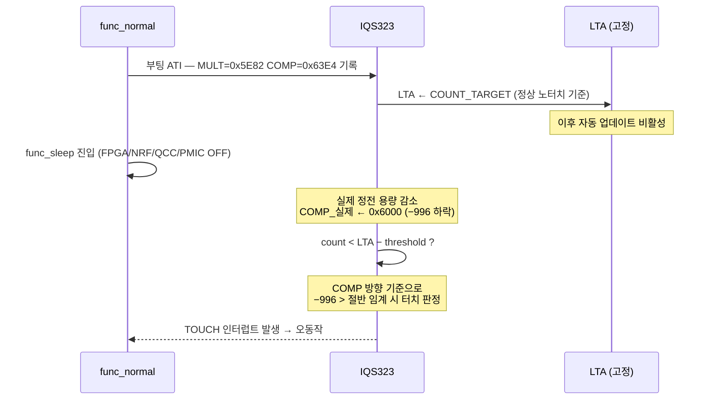

> **TL;DR**: 절전 진입 시 COMP가 -996 하락하고 이 방향이 터치 방향과 동일하여, LTA 고정 상태에서 false touch 오동작이 발생한다. 고정 ATI 보상값을 절전 노터치 기준(MULT=0x5C82, COMP=0x6000)으로 낮춰 마진을 확보할 것을 권장한다.

## 1. 측정 환경

| 항목 | 값 |
|---|---|
| 펌웨어 플래그 | `TDC_TOUCH_SLEEP_MEASURE_MODE=1`, `TDC_TOUCH_ATI_CALIB_MODE=1`, `TDC_DRV_IQS323_ATI_DUMP_ENABLE=1` |
| 보드 변형 | `TDC_BOARD_VARIANT_PACKAGE` — 완제품 조립 (자석·배터리 근접) |
| 측정 방법 | RTT `'s'` 커맨드 → `func_sleep` 진입 후 반복 re-ATI 덤프 |
| LTA 자동 업데이트 | **비활성** (의도적 설정 유지) |
| 현재 고정 ATI (PACKAGE) | `MULT_MSB=0x5E` `MULT_LSB=0x82` / `COMP_MSB=0x63` `COMP_LSB=0xE4` |

---

## 2. 측정 데이터

RTT 출력 형식: `MULT=(MSB<<8|LSB)`, `COMP=(MSB<<8|LSB)`

| 동작 모드 | 터치 상태 | MULT | COMP |
|---|---|---|---|
| 정상 (func_normal) | 노터치 | `0x5E82` | `0x63E4` |
| 정상 (func_normal) | 터치 중 | `0x6482` | `0x63F8` |
| 절전 (func_sleep) | 노터치 | `0x5C82` | `0x6000` |
| 절전 (func_sleep) | 터치 중 | `0x6482` | `0x5800` |

> [!NOTE]
> MULT_LSB는 모든 측정에서 `0x82` 고정 (ATI 모드 비트 필드, 상태와 무관).
> 실질적 변동은 **MULT_MSB**와 **COMP 16비트** 전체에서 발생한다.

---

## 3. 분석

### 3-1. MULT_MSB — 주 판별 축

```
           0x5C      0x5E      0x60      0x62      0x64
            │         │                             │
         절전_노터치  정상_노터치                 터치(공통)
```

| 구간 | 값 | 의미 |
|---|---|---|
| 터치 Δ (정상) | +6 (0x5E → 0x64) | 터치 시 MULT_MSB 증가 |
| 터치 Δ (절전) | +8 (0x5C → 0x64) | 절전 노터치가 낮으므로 Δ가 더 큼 |
| 절전 기준선 편이 | −2 (0x5E → 0x5C) | 주변장치 OFF로 정전 용량 감소 |

- 터치는 항상 `MULT_MSB=0x64`로 수렴 — 손가락 정전 용량이 지배적
- 절전 모드의 노터치 기준선은 정상 대비 −2 낮음 (터치 반대 방향 → MULT 축 단독으로는 false touch 위험 낮음)

### 3-2. COMP 16비트 — 절전 모드에서 방향 역전

| 구간 | 정상 모드 | 절전 모드 |
|---|---|---|
| 노터치 → 터치 Δ | +0x0014 (+20, 미세 증가) | **−0x0800 (−2048, 대폭 감소)** |
| 정상 → 절전 기준선 편이 | — | **−0x03E4 (−996)** |

> [!IMPORTANT]
> 절전 모드에서 터치가 COMP를 **감소**시킨다. 즉 절전 진입 자체(−996)와 실제 터치(−2048)가 같은 방향이다. 현재 고정 ATI 기준(정상 노터치 = `COMP=0x63E4`)에서 LTA가 고정된 채 절전에 진입하면, IQS323은 COMP −996 하락을 터치 방향 편차로 해석할 수 있다.

### 3-3. 오동작 발생 메커니즘



**LTA 비활성화의 영향**: LTA가 업데이트됐다면 절전 진입 후 새 기준선으로 수렴해 오동작 없음. 그러나 의도적으로 비활성화했으므로 LTA는 정상 모드 기준점에 고정된 채 절전 환경과 괴리가 유지된다.

---

## 4. 권장 ATI 보상값

### 4-1. 원칙

> 고정 ATI 보상값의 기준점을 **절전 노터치** 수준으로 낮춰, 두 모드에서 모두 노터치 상태가 LTA ± 마진 안에 들어오도록 한다.

### 4-2. MULT 중간값 계산

| 항목 | MULT_MSB |
|---|---|
| 최저 노터치 (절전) | `0x5C` |
| 터치 (공통) | `0x64` |
| 범위 | `0x08` (8 step) |
| **SNR 중간값** | **`0x60`** (0x5C + 8÷2 = 0x60) |

중간값(`0x60`)에서의 마진:

| 상태 | MULT_MSB | 중간값 대비 Δ |
|---|---|---|
| 절전 노터치 | 0x5C | −4 (터치 반대, 안전) |
| 정상 노터치 | 0x5E | −2 (터치 반대, 안전) |
| 터치 (공통) | 0x64 | +4 (터치 방향, 감지) |

### 4-3. 권장 세팅

```c
/* tdc_drv_iqs323.c — TDC_BOARD_VARIANT_PACKAGE 분기 */

/* Option A: 절전 노터치 기준 (보수적 — false touch 최우선 방지) */
#define TDC_DRV_IQS323_ATI_MULT_MSB   0x5C
#define TDC_DRV_IQS323_ATI_MULT_LSB   0x82
#define TDC_DRV_IQS323_ATI_COMP_MSB   0x60
#define TDC_DRV_IQS323_ATI_COMP_LSB   0x00

/* Option B: SNR 중간값 기준 (균형 — 정상/절전 양방향 마진 균등) */
#define TDC_DRV_IQS323_ATI_MULT_MSB   0x60
#define TDC_DRV_IQS323_ATI_MULT_LSB   0x82
#define TDC_DRV_IQS323_ATI_COMP_MSB   0x60   /* COMP는 Option A와 동일 권장 */
#define TDC_DRV_IQS323_ATI_COMP_LSB   0x00
```

| 옵션 | 장점 | 단점 |
|---|---|---|
| **Option A** (절전 노터치 기준) | false touch 위험 최소화, 절전에서 LTA 편차 없음 | 정상 노터치가 LTA보다 +2 높아 터치 감도 소폭 상승 |
| **Option B** (SNR 중간값) | 정상·절전 모두 균등 마진 ±4 step | 정상 노터치가 LTA보다 +2 높아 연속 접촉 오동작 주의 필요 |

> [!NOTE]
> **COMP 권장값 공통 적용 이유**: 절전 모드에서 COMP의 터치 방향이 반전(+→−)되므로, 정상 노터치(0x63E4)를 기준으로 삼으면 절전 진입 시 −996 편이가 임계값을 초과할 위험이 크다. 절전 노터치(0x6000)를 기준점으로 설정하면 두 모드에서 노터치 COMP 편이가 최소화된다.

### 4-4. 검증 절차

1. Option A 또는 B로 `write_ati_compensation()` 상수 수정 후 빌드
2. `TDC_DRV_IQS323_ATI_DUMP_ENABLE=1` 상태로 정상 동작 ATI 덤프 확인
3. 정상 모드 터치 감지 정상 여부 확인
4. `TDC_TOUCH_SLEEP_MEASURE_MODE=0`, 실제 절전 진입 후 오동작 발생 여부 장기 관측 (30분 이상)
5. 문제 없을 시 `TDC_TOUCH_ATI_CALIB_MODE=0`, `TDC_DRV_IQS323_ATI_DUMP_ENABLE=0` 복원 후 프로덕션 빌드

---

## 5. LTA 비활성화 관련 추가 고려

LTA 자동 업데이트를 비활성화한 이유: 서서히 증가하는 정전 용량 변화를 터치로 인식하지 않기 위함.

절전 모드 false touch를 근본적으로 해결하는 다른 접근:
- **절전 진입 직전 ATI 재캘리브레이션**: `func_sleep` 진입 전 `re_ati_trigger()` + `wait_re_ati_done()` 호출 → 절전 환경에서 LTA 재설정 (단, 절전 진입 지연 +수백 ms 발생)
- **복귀 시 ATI 재캘리브레이션**: 절전 해제 후 `tdc_drv_iqs323_apply_settings()` 재호출로 정상 모드 기준 복원

현재 권장: Option A/B 고정값 변경 + 검증 완료 후 필요 시 진입/복귀 시 re-ATI 검토.
