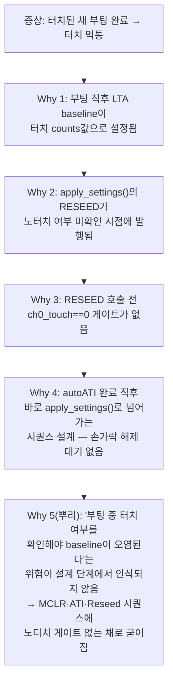
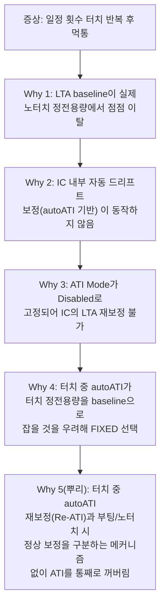
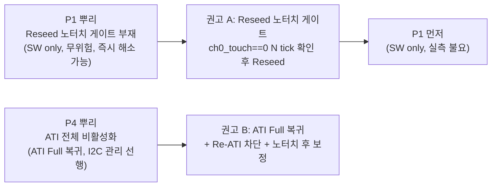
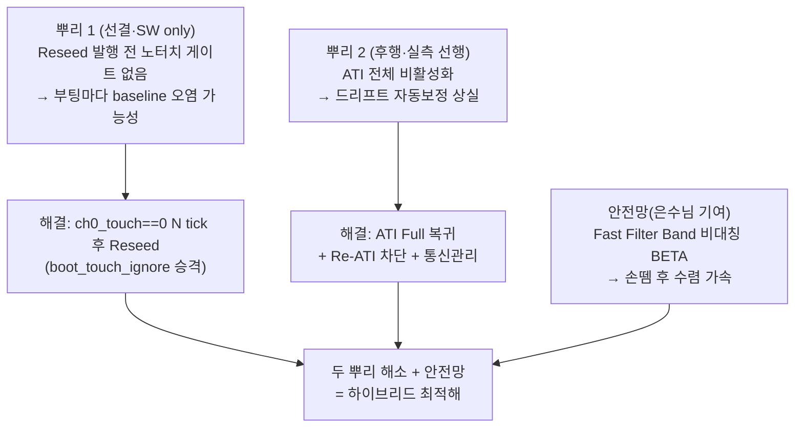

# A07 · 5Why 근본원인분석가 — IQS323 터치 먹통 근본원인 추적

> **TL;DR**: P1(autoATI + 터치 중 부팅 → 먹통)의 진짜 뿌리는 autoATI 자체가 아니라 `apply_settings` 내 Reseed가 노터치 여부를 확인하지 않고 현시점 counts로 LTA를 seed하는 것. P4(일정 횟수 후 먹통)의 뿌리는 autoATI 포기로 IC 드리프트 자동보정이 사라진 것. 두 뿌리는 독립 원인이며 P1 뿌리(Reseed 오염)가 더 근본적이고 선결. 은수님 정리는 P4에서는 근본원인에 도달했으나 P1에서는 원인을 한 단계 잘못 식별(autoATI → 실은 Reseed 타이밍).

---

## 1. 분석 대상 · 입력 정리

| 구분 | 내용 |
|---|---|
| 분석 대상 | P1(autoATI + 터치 중 부팅 → 먹통), P4(일정 횟수 후 먹통) |
| 핵심 코드 사실 | `apply_settings()` 8단계: RESEED(`0xC0` bit3) — 현시점 counts로 LTA seed (drv.c:1134) |
| 핵심 코드 사실 | `func_sleep()` → `reseed()` — 절전 복귀 시도 reseed (main.c:880 → drv.c:932) |
| 핵심 코드 사실 | MCLR 후 auto-ATI 완료 폴링 → `apply_settings()` 즉시 호출 (noterch 확인 없음) |
| 핵심 코드 사실 | `ATI_SETUP` 0x36 = Mode Disabled (전체 채널 autoATI 꺼진 상태로 고정) |
| 핵심 코드 사실 | `discharge_crx0()`: 200ms마다 0x30 0x02 → 0x01 토글 (VSS 여부 미확정) |

---

## 2. P1 5Why — "autoATI + 터치 중 부팅 → 먹통"

### 5Why 세부 전개

| 단계 | 질문 | 답 | 코드 근거 |
|---|---|---|---|
| **증상** | 무슨 일이? | 터치된 채 부팅하면 터치 IC가 이후 터치에 무반응 | 사용자 관찰, P1 |
| **Why 1** | 왜 먹통? | LTA baseline이 터치 중 counts값(~터치 압력 반영)으로 초기화되어 노터치와 터치의 delta가 역전되거나 미소화됨 | IQS323 판정: delta=(LTA−Counts), threshold=100 |
| **Why 2** | 왜 LTA가 터치 counts로? | `apply_settings()` 8단계에서 RESEED(`0xC0` LSB bit3=1)를 발행할 때 현재 채널 counts(= 터치 눌린 값)를 LTA에 그대로 seed | drv.c:1134 |
| **Why 3** | 왜 터치된 채 Reseed? | RESEED 발행 앞에 `ch0_touch==0` 연속 N tick 게이트가 없음. `try_finish_init()`은 auto-ATI 비트 소거만 폴링하고 손가락 여부는 묻지 않음 | tdc_touch.c:216 / drv.c:1023~1146 |
| **Why 4** | 왜 게이트가 없나? | MCLR → auto-ATI 완료 → `apply_settings()` 로 직결되는 시퀀스 설계. `boot_touch_ignore`(`tdc_touch.c:318~325`)는 READY 전이 *이후* 터치를 무시하는 UX 가드지, Reseed 타이밍 제어가 아님 | tdc_touch.c:289~325 |
| **Why 5(뿌리)** | 왜 그 설계로? | "터치된 채 부팅 시 Reseed가 LTA를 오염시킨다"는 위험이 설계 시점에 명시적으로 인식되지 않아 노터치 확인 단계가 시퀀스에 삽입되지 않은 채 굳어짐 | 설계 의도 공백 |

### P1 진짜 뿌리 판정

> **"autoATI" 자체가 문제가 아니다.** FIXED(autoATI 비사용) 환경에서도 RESEED는 동일하게 발행된다. 즉 FIXED로 전환한 현재도 P1과 동일한 뿌리가 존재한다. 다만 FIXED 상태에서는 autoATI 완료 대기가 없어 MCLR→apply_settings 속도가 달라질 뿐, Reseed 타이밍 문제는 그대로다.
>
> **진짜 뿌리: Reseed 발행 전 노터치 게이트 부재.**

---

## 3. P4 5Why — "일정 횟수 후 먹통"

### 5Why 세부 전개

| 단계 | 질문 | 답 | 근거 |
|---|---|---|---|
| **증상** | 무슨 일이? | 정상 동작하다가 수십~수백회 터치 후 먹통 | 사용자 관찰, P4 |
| **Why 1** | 왜 먹통? | LTA baseline이 드리프트(환경 변화·자체 방전 누적)로 실제 노터치 counts에서 멀어져 delta가 threshold 미달 | IQS323 §5.5 IIR filter |
| **Why 2** | 왜 LTA가 드리프트 교정 안 되나? | IC 내부 자동 드리프트 보정 메커니즘(autoATI / Re-ATI)이 동작하지 않음 | ATI_SETUP 0x36 = Mode 000(Disabled) |
| **Why 3** | 왜 ATI Disabled? | `write_ati_compensation()`이 사전 측정 MULT/COMP를 write하고 ATI Mode를 Disabled로 고정. IC 자율 보정 경로 차단 | drv.c:683~720 |
| **Why 4** | 왜 FIXED 선택? | 전원버튼 겸용 상황에서 터치 중 autoATI가 발동하면 그 정전용량을 기준으로 삼아 먹통 발생 → autoATI 전체 포기 | 요구사항 이슈 #1, 펌웨어 분석 §14-1 |
| **Why 5(뿌리)** | 왜 전체 포기? | "터치 중 Re-ATI"와 "노터치 복귀 후 정상 보정" 두 경우를 분리하는 구현(Re-ATI 차단 + 노터치 게이트 후 ATI 허용)을 설계하지 않고 ATI 기능 자체를 끔으로써 드리프트 자동보정 능력도 함께 상실 | 설계 단순화로 인한 기능 상실 |

### P4 진짜 뿌리 판정

> **뿌리: "터치 중 Re-ATI 차단"과 "노터치 상태 자동보정"을 분리하지 않고 ATI 전체를 끈 것.** 200ms CRX0 방전은 이 뿌리를 해결하지 않고 *증상을 완화*하는 우회책이다. 방전의 물리적 효력 자체도 미검증(0x30 0x02 = Linearise일 수 있음).

---

## 4. 두 뿌리의 관계와 우선순위

### 독립성 여부

| 항목 | P1 뿌리 | P4 뿌리 |
|---|---|---|
| **핵심 결함** | Reseed 발행 시 노터치 게이트 부재 | ATI 전체 비활성화로 드리프트 보정 상실 |
| **발생 타이밍** | 부팅 순간 (일회성, 결정적) | 사용 중 누적 (시간 의존) |
| **상호 의존** | 독립 — P4 해결해도 P1 뿌리 남음 | 독립 — P1 해결해도 P4 뿌리 남음 |
| **교차 영향** | P1 뿌리가 P4를 악화: 부팅마다 오염 baseline에서 출발하면 드리프트까지 더해져 더 빨리 먹통 | P4가 P1을 심화: 드리프트 상태에서 터치 중 부팅하면 이미 오프셋된 baseline에 터치 counts까지 얹혀 오염 극대화 |

**두 뿌리는 독립적으로 존재하나 악화 방향으로 상호작용한다.**

### 우선순위

**P1 뿌리(Reseed 게이트) 선결:** SW만으로 구현 가능, 실측 없이도 안전하며, P4 해결 시 발생 가능한 I²C 무응답 위험이 없다. P4 뿌리(ATI Full 복귀)는 통신관리 선행 및 실측 후 진행.

---

## 5. 은수님 정리 — 근본원인 도달 여부 판정

### 판정 표

| 은수님 항목 | 근본원인 도달? | 판정 | 해설 |
|---|---|---|---|
| **P1 원인: "autoATI가 터치 상태로 진행"** | 한 단계 위 증상 수준 | **미도달** | autoATI 수렴 자체는 정상. 뿌리는 수렴 *완료 후* `apply_settings` 내 Reseed가 노터치 확인 없이 발행되는 것. autoATI를 포기해도 Reseed 문제는 남는다. |
| **P2 해결: Fixed MULT/COMP 사용** | 증상 우회책 | **미도달(우회)** | autoATI 자체를 끈 것이지 Reseed 타이밍을 수정한 것이 아님. P4의 뿌리(드리프트 보정 상실)를 새로 생성함. |
| **P4 원인: "드리프트 보정 기능 상실"** | 근본원인 정확히 지목 | **도달** | ATI 포기로 IC 자동보정이 사라진 것 — P4의 실제 뿌리와 일치. |
| **M1 (LTA → 카운터 수렴 구조)** | 매커니즘 이해 | **정확** | IIR 추적으로 손 떼면 수렴하는 것은 데이터시트 §5.5 확인. |
| **M2 (터치 중 LTA 업데이트 안 됨 → 해제 대기 코드로 해결)** | 현상은 맞음 | **조건부 정확** | frozen은 "터치 *인식 후*"에 걸림. 부팅 직후 baseline=터치값이면 delta≈0 → 터치 미인식 → frozen 미적용. 즉 "LTA frozen 덕분"이 아니라 "frozen 부재 상태에서 손 떼면 IIR이 노터치 추적". 방향은 옳으나 메커니즘 설명이 반대. |
| **M3 (Beta 값으로 빠른 수렴)** | 방향 타당 | **조건부 정확** | Fast Filter Band 비대칭 설계(손뗌 방향만 가속) 시에만 안전. 단순 Beta 상향이면 약터치 흡수 위험. |
| **M8 (autoATI + Beta만으로 모든 문제 해결)** | 불완전 | **미도달** | P1 뿌리(Reseed 게이트)는 autoATI 복귀로 해소되지 않음. 노터치 게이트 없으면 autoATI 복귀 후에도 P1 재현 가능. |
| **M9 (카운터 최대값 4096 초과)** | 별개 안전망 | **부분 유효** | Max Counts stuck 방지 효과. 뿌리와 직접 연결은 없으나 추가 방어로 타당. |

### 요약

- **P4는 근본원인 도달**: "ATI 포기 → 드리프트 보정 상실"을 정확히 지목.
- **P1은 원인 한 단계 잘못 식별**: "autoATI가 문제"라고 봤으나 뿌리는 "Reseed 노터치 게이트 부재". autoATI를 복귀시켜도 Reseed 앞에 게이트를 두지 않으면 P1은 재현된다.
- **M8 "autoATI + Beta만으로 해결" 불완전**: 노터치 seed 게이트를 결합해야 완전한 해결.

---

## 6. 5Why 통합 결론

### 뿌리 2개의 위계

### 핵심 판정 3문장

1. **P1의 진짜 뿌리는 "autoATI"가 아니라 "Reseed 타이밍"이다.** autoATI를 포기하거나 복귀시키든 Reseed 앞에 노터치 게이트가 없으면 P1은 재현된다.

2. **P4의 진짜 뿌리는 "방전 부재"가 아니라 "ATI 전체 비활성"이다.** 방전은 드리프트를 해소하지 않고 증상을 완화할 뿐이며 방전의 물리효력 자체도 미검증(0x30 0x02 = Linearise 가능성).

3. **은수님의 "autoATI + Beta" 방향은 P4를 해소하는 올바른 방향이나, P1 해결에는 노터치 seed 게이트가 반드시 결합되어야 근본원인을 완전히 제거한다.**

---

## 7. 권고 우선순위 (5Why 기반)

| 순위 | 작업 | 뿌리 해소 | 방법 | 선행 조건 |
|---|---|---|---|---|
| **1순위** | Reseed 노터치 게이트 | P1 뿌리 | `ch0_touch==0` N tick 확인 후 Reseed. `boot_touch_ignore` 승격 | SW only, 무위험 |
| **2순위** | 통신관리 선행 | ATI Full 복귀 전제 | RDY 핸드셰이크·타임아웃 강화 | ATI Full I²C 무응답 실측 |
| **3순위** | ATI Full 복귀 + Re-ATI 차단 | P4 뿌리 | ATI Mode Full, 터치 중 Re-ATI 차단, 노터치 후만 재보정 허용 | 2순위 완료 + 실측 |
| **4순위** | Fast Filter Band 비대칭 BETA | 수렴 단축 | 손뗌 방향 회복만 가속, 일반 LTA beta 보수적 유지 | 3순위 후 튜닝 |
| **5순위** | 방전 존폐 결정 | P4 보조 | ESD 정체 실측 후 — LTA 드리프트면 ATI Full로 대체 가능, 물리누적이면 안전화 후 유지 | ESD 실측 필수 |
