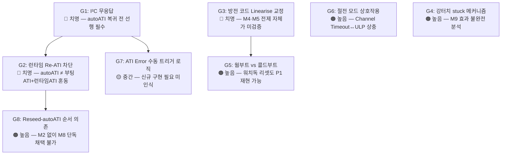

# B06 · 누락 항목 발굴자 — 은수님 정리 + Phase 1 미포함 중요 항목

> **TL;DR**: 은수님 M1~M9와 Phase 1 A01~A07이 다루지 않거나 표면적으로만 언급한 6대 누락 영역을 식별한다. 가장 위험한 공백은 (1) ATI Full 재활성 시 I²C 무응답 메커니즘이 은수님 정리 어디에도 없고, (2) 런타임 자율 Re-ATI 차단이 "autoATI + Beta"와 별개로 필요하다는 인식이 없으며, (3) 방전 코드(0x30 0x02)가 VSS가 아닌 Linearise일 가능성을 M4~M5 해석이 전제로 깔고 있다는 점이다. 이 세 공백이 채워지지 않으면 하이브리드 권고의 구현도 I²C hang·드리프트 진동·ESD 오판이라는 세 함정에 빠진다.

---

## 1. 발굴 대상 및 방법론

### 1.1 스캔 범위

| 계층 | 대상 |
|---|---|
| **은수님 1차 정리** | M1~M9, P1~P6 (공통 배경) |
| **Phase 1 분석** | A01(IC전문가)·A02(펌웨어개발자)·A03(회로전문가)·A04(신뢰성엔지니어)·A05(절전전문가)·A06(UX담당자)·A07(5Why 분석가) |
| **이전 분석 결과** | `docs/참고/touch/개선/` 전체 (제어 재설계 권고·방전 공존 검토·은수님 안 평결) |

### 1.2 발굴 기준

누락 항목으로 분류하는 조건:
- 은수님 정리에 **전혀 언급 없음**
- Phase 1 분석에서 **스쳐 지나가거나 다른 항목의 부속으로만** 다뤄진 것
- 이전 분석에서 **중요하게 다뤄졌으나** Phase 1에서 희석된 것
- 하이브리드 구현 시 **반드시 사전 처리해야 하는** 항목인데 은수님 정리에 부재한 것

---

## 2. 누락 항목 판정표

| # | 항목 | 은수님 정리 | Phase 1 A01~A07 | 이전 분석 | 위험도 | 판정 |
|---|---|---|---|---|---|---|
| **G1** | **ATI Full 재활성 시 I²C 무응답** | 완전 부재 | A01 §6에서 언급(1회) | 🔴 핵심 위험으로 반복 경고 | 🔴 치명 | **주요 누락** |
| **G2** | **런타임 자율 Re-ATI 차단 필요성** | 부재 | A07 §7(2순위)에만 간략 | 🔴 방전·ATI 공존 검토의 핵심 | 🔴 치명 | **주요 누락** |
| **G3** | **방전 코드 0x30 0x02 → Linearise (VSS 아님) 교정** | M4·M5에서 방전 효과 가정 | A03·A05에서 스쳐 지남 | 🔴 B2 라이브 발견으로 최우선 | 🔴 치명 | **주요 누락** |
| **G4** | **Max Counts 상향(M9)의 강터치 stuck 방지 역할** | M9로 제시했으나 메커니즘 불명확 | A01 §5에서 부분 분석 | 보조 안전망으로 언급 | 🟠 높음 | **불충분** |
| **G5** | **웜부트 vs 콜드부트 차이** | 부재 | 부재 | 이전 분석에서 "워치독도 POR"로 정정 | 🟠 높음 | **주요 누락** |
| **G6** | **절전 모드(ULP·LP·NP)와 autoATI 상호작용** | 부재 | A05에서 분석했으나 Phase 1 요약에서 희석 | Channel Timeout → Auto No ULP 경고 | 🟠 높음 | **불충분** |
| **G7** | **ATI Error 발생 시 수동 Re-ATI 트리거 로직 필요** | 부재 | A01 §6.1에서 언급 | 방전 공존 검토에서 일부 | 🟡 중간 | **누락** |
| **G8** | **Reseed 타이밍과 autoATI 복귀의 순서 의존성** | M8에서 autoATI 복귀를 M2 없이 단독 제안 | A02에서 상세 분석 | 5Why 결론에서 독립 뿌리 확인 | 🟠 높음 | **불충분** |

---

## 3. G1 — ATI Full 재활성 시 I²C 무응답 (가장 위험한 공백)

### 3.1 은수님 정리 내 부재 확인

은수님 M1~M9 전체에 I²C 통신 문제에 대한 언급이 없다. M8("autoATI + Beta 빠른 수렴만으로 모든 문제 해결 가능")은 I²C 위험을 완전히 비가시화한다.

### 3.2 실제 위험 메커니즘 (이전 분석 종합)

```
현 펌웨어가 ATI Mode=Disabled를 선택한 이유:
  ATI Mode=Full 사용 시 I²C 무응답 발생
  → Stuck-Touch 발생 → IC 내부 자동 re-ATI 발동
  → COMP 값 급변 → ATI Active bit(bit5=1) set
  → ATI_Error bit(bit6=1) set
  → 이 구간 동안 I²C 통신 무응답(RDY 윈도우 점유)
  → CM3 I²C 통신 타임아웃 → 펌웨어 행(hang)
```

이것은 현 펌웨어가 FIXED를 선택한 **실증 이유**다. 은수님 정리 M8("autoATI + Beta만으로 해결")이 ATI Full 복귀를 전제하는 한, 이 위험은 구현 단계에서 반드시 마주치게 된다.

### 3.3 Phase 1에서의 처리 수준

A01은 §6에서 1회 언급했으나 Phase 1 분석 7개의 판정 요약에서 I²C 문제는 독립 항목이 아니라 "I²C 통신관리 선행 필수"라는 경고 수준으로 희석되었다. 이것이 Phase 1 요약만 보면 보이지 않는 이유다.

### 3.4 누락의 함의

autoATI 복귀 시 반드시 선행해야 하는 항목:
1. RDY 핸드셰이크 강화 (event mode 또는 타임아웃 폴링)
2. ATI Active bit(bit5) 폴링으로 완료 대기
3. ATI Error bit(bit6) 확인 및 수동 Re-ATI 트리거 에러 핸들러
4. I²C 타임아웃 시 강제 복구 시퀀스

**이 4가지 중 어느 하나라도 없으면 ATI Full 복귀 시 CM3-IQS323 통신 단절 → 영구 먹통 재현 가능성이 있다.**

---

## 4. G2 — 런타임 자율 Re-ATI 차단 필요성

### 4.1 은수님 정리의 암묵적 전제

은수님 M1·M8은 "autoATI"를 하나의 단일 기능으로 취급한다. 그러나 IQS323에서 "autoATI"는 두 가지 다른 동작을 포함한다:

| 구분 | 동작 | 트리거 | 위험 |
|---|---|---|---|
| **부팅 1회 ATI** | POR/MCLR 후 초기 캘리브레이션 | 전원인가 시 1회 | 노터치 게이트 결합 시 안전 |
| **런타임 자율 Re-ATI** | Stuck-Touch/ATI Error 감지 시 자동 재보정 | 런타임 중 불특정 시점 | 🔴 터치 진동·I²C hang 유발 |

은수님 M8("autoATI + Beta")은 이 둘을 구분하지 않는다. 런타임 자율 Re-ATI를 허용하면:

- 진동 환경(보행·교통)에서 counts fluctuation → ATI Band 초과 → 자동 Re-ATI 트리거 → 수렴 중 터치 무반응 구간 반복
- Stuck-Touch → 자동 Re-ATI → COMP 급변 → ATI_Error → I²C hang (G1과 연결)

### 4.2 이전 분석의 권고

방전·autoATI 공존 검토 §3 결론:

> **"부팅 1회 ATI + auto Re-ATI 끔 + LTA 추적"이면 공존 가능.** 충돌 근원이 "런타임 자율 Re-ATI" 하나뿐이므로, 그것만 끄면 진동(Re-ATI 진동), I²C hang(ATI_Error) 두 충돌이 모두 원천 제거된다.

A07 §7에서 "ATI Full 복귀 + Re-ATI 차단"을 2순위 권고로 언급했으나, 왜 Re-ATI를 별도로 차단해야 하는지에 대한 독립 분석은 Phase 1 어디에도 없다.

### 4.3 구현 방향

- ATI Mode: Full(부팅 캘리브레이션) → 완료 후 Disabled 고정
- 수동 Re-ATI: 노터치 게이트(ch0_touch==0 N tick) 통과 후만 허용
- 자율 Re-ATI(ATI_Error 시 자동 트리거): 차단 또는 엄격한 게이트 적용

---

## 5. G3 — 방전 코드 0x30 0x02 교정 필요성 (M4·M5 해석의 전제 오류)

### 5.1 은수님 M4·M5의 암묵적 가정

- M4: "DC 블로킹 캡 때문에 IC 내부 드리프트가 주원인" — 방전이 실제로 VSS 방전임을 전제
- M5: "충전기 연결 → 터치 복귀" — 물리 전하 누적이 방전으로 해소됨을 가정

그러나 이 해석은 "현재 방전 코드가 진짜로 CRX0을 VSS에 단락시키는가"를 확인하지 않은 상태에서 이루어진 것이다.

### 5.2 이전 분석의 핵심 발견 (B2 라이브 발견)

방전·autoATI 공존 검토 §2.5:

> **🔴 `0x30 0x02`는 데이터시트상 Linearise(VSS 아님).** 현재 방전의 물리 효력 미검증. VSS 단락은 `0x34`, 핀 enable은 `0x33`.

IQS323 데이터시트 A.5(CRX Control, 0x30):
- bit1 = **Linearise** (count linearization)
- VSS 단락 경로: 0x34(별도 레지스터 경로) 또는 핀 제어 방식

**즉 현재 `discharge_crx0()` 함수의 `0x30 0x02 → 0x01` 토글은 VSS 방전이 아닐 수 있다.**

### 5.3 M4·M5 해석에 미치는 영향

| 시나리오 | M4 해석 | M5 해석 |
|---|---|---|
| 0x30 0x02 = Linearise (VSS 아님) | M4 전제 붕괴: "IC 내부 드리프트 주원인"이 아니라 드리프트가 방전 없이 누적된 것 | M5의 "충전기 연결 복귀"는 물리 방전이 아닌 다른 원인(VCC 재공급 IC 리셋, GND 경로 안정화 등) |
| 0x30 0x02 = 실제 VSS 단락 | M4·M5 해석 성립 | M4·M5 해석 성립 |

**M4·M5가 방전 효과를 근거로 "IC 내부 드리프트 주원인"을 주장하는 구조 자체가, 방전 코드의 실제 동작 확인 전까지는 순환 추론이다.**

### 5.4 Phase 1에서의 처리 수준

A03(회로전문가)은 "방전 코드 실측 필요"를 언급했으나 M4·M5 해석의 전제 문제로 연결짓지 않았다. A05(절전전문가)도 스쳐 지났다. 이 항목이 Phase 1 어디에서도 M4·M5 전제 붕괴 가능성으로 명시되지 않았다는 것이 핵심 공백이다.

### 5.5 교정 우선순위

방전 코드 교정은 실측 게이트에 해당하며:
1. **RTT로 `0x30` 레지스터 bit 실측**: 방전 전후 핀 전압 또는 counts 변화 확인
2. 방전 효과 없을 경우 → `0x34`(VSS 경로) 또는 `0x33`(enable+VSS) 경로로 교정
3. 방전 효과 있어도 `0x30 blind write`는 다른 비트(Linearise·Invert·Release UI·Enable) 동시 변경 위험 → RMW 방식으로 교정 필요

---

## 6. G4 — Max Counts 상향(M9)의 강터치 stuck 방지 역할 (불충분)

### 6.1 은수님 M9의 직관

"카운터 최대값 4096보다 크게 하면 더 안정적일까?" — 이 질문은 두 가지 다른 효과를 뒤섞고 있다:

| 효과 | 설명 |
|---|---|
| **Max Counts 충돌 완충** | autoATI 후 noTouch counts가 상승할 때 conversion 정지 방지 (A01에서 분석됨) |
| **강터치 stuck 방지** | 강한 터치 시 counts가 Max Counts에 saturate → ATI가 saturated 값을 기준으로 보정 → 손 뗀 후 counts가 Max Counts보다 낮아도 비교 역전 (이 메커니즘은 Phase 1에서 미분석) |

### 6.2 강터치 stuck 메커니즘 (Phase 1 누락)

```
강터치 → counts 급감 (self-cap: 터치=counts 낮아짐)
→ ATI 수행 중 counts가 Max Counts와 가깝거나 역전된 위치 →
→ MULT/COMP가 그 값을 Target으로 정규화
→ 손 뗀 후 noTouch counts가 Target보다 높아짐
→ delta = LTA - Counts가 음수(역전) or 아주 작음
→ threshold 미달 → 이후 정상 터치도 미인식
```

Max Counts 16383으로 상향하면 강터치 saturate 가능성 줄어드나, 이 메커니즘 자체가 Phase 1에서 독립 항목으로 분석되지 않았다.

### 6.3 Phase 1 A01의 처리 수준

A01 §5는 Max Counts를 "autoATI 후 noTouch counts 충돌 완충"으로만 분석했고, "강터치 stuck" 메커니즘은 별도 항목으로 다루지 않았다.

---

## 7. G5 — 웜부트 vs 콜드부트 차이 (중요 누락)

### 7.1 은수님 정리에서의 부재

은수님 P1~P6, M1~M9 어디에도 웜부트(워치독 리셋, SW 리셋)와 콜드부트(POR, 배터리 교체) 구분이 없다. P1("autoATI + 터치된 채 부팅")이 POR에서만 발생하는지, 워치독 리셋에서도 발생하는지가 명시되지 않았다.

### 7.2 이전 분석의 정정 (Phase 1 미반영)

이전 분석(제어 재설계 권고 §5):

> **"웜부트 LTA 보존 의존"은 조건부**: 현 코드는 웜부트도 POR(B4 정정). reset-cause 분기 인프라 신규 필요.

즉 현 펌웨어는 워치독 리셋 후에도 POR과 동일하게 `apply_settings()` + Reseed를 실행한다. 이 상태에서 워치독 리셋이 "터치된 채" 발생하면 동일한 LTA 오염이 발생한다.

### 7.3 실용적 의미

- 인공와우 외부기에서 워치독 리셋은 예외적 사건이 아닌 정상 복구 메커니즘
- 터치 중 워치독 리셋 → 웜부트 → 터치 중 Reseed → LTA 오염 → 재부팅 후에도 먹통 가능성
- 이 시나리오는 "배터리 교체 시 부팅" 시나리오(A04 §3-1)와 별개의 독립 위험

### 7.4 Phase 1에서의 처리 수준

Phase 1 어느 에이전트도 웜부트/콜드부트 구분을 언급하지 않았다. A04(신뢰성)에서도 "배터리 교체 = POR" 시나리오만 다뤘다.

---

## 8. G6 — 절전 모드와 autoATI 상호작용 (Phase 1 요약에서 희석)

### 8.1 A05 분석의 핵심 (Phase 1 요약에서 누락된 부분)

A05는 상세 분석을 수행했으나 Phase 1 요약에서 "전력 관점 조건부 지지"로 압축되었다. 실제 중요 내용:

- **Channel Timeout 사용 시 ULP 진입 강제 차단**: 데이터시트 §5.8 WARNING — Channel Timeout 활성화 시 ULP 금지, Automatic No ULP 강제
- **현 펌웨어 IC 전력 모드 미사용**: 0xC0 bits[6:4] 미write → NP 고정(125µA) 추정
- **autoATI Full 상시 + Channel Timeout 공존**: Automatic No ULP 강제 → LP 수준(37µA)에서 하한, ULP(4µA) 도달 불가

### 8.2 은수님 정리에서의 부재

은수님 M1~M9에 절전 모드 언급이 없다. autoATI 복귀가 절전 구조에 미치는 영향이 비가시화되어 있다.

### 8.3 하이브리드 구현 시 절전 설계 필요 항목

1. IC 전력 모드 레지스터(0xC0) 명시 설정 (현재 미write)
2. Channel Timeout 사용 여부와 ULP 달성 가능성 상충 결정
3. autoATI(Re-ATI) 실행 중 LP/ULP 전력 모드와의 충돌 처리
4. 배터리 예산 사양 확인 (현재 문서 어디에도 없음)

---

## 9. G7 — ATI Error 시 수동 Re-ATI 트리거 로직 (독립 누락)

### 9.1 데이터시트 §5.11 IMPORTANT

> "ATI Error 발생 시 re-ATI가 자동 트리거되지 않는다. master가 System Control의 Re-ATI bit set으로 수동 트리거해야 함."

G1(I²C 무응답)에서 ATI_Error가 발생하면:
- IC는 자동 복구하지 않음
- CM3가 ATI_Error bit를 폴링해 감지해야 함
- CM3가 Re-ATI bit를 수동으로 set해야 복구됨
- 이 복구 시도 중에도 I²C 통신 신뢰성 확인 필요

현 펌웨어는 ATI Error 핸들러가 없다. ATI Full 복귀 시 이 로직이 신규 구현되어야 하나, 은수님 정리와 Phase 1 어디에도 이 신규 구현 필요성이 언급되지 않았다.

---

## 10. G8 — Reseed 타이밍과 autoATI 복귀의 순서 의존성

### 10.1 은수님 M8의 구조적 문제

M8("autoATI + Beta만으로 모든 문제 해결 가능")은 autoATI 복귀 자체가 P1 문제(터치 중 부팅 먹통)를 해결한다고 가정한다. 그러나 A07(5Why)이 밝힌 바:

> **P1의 진짜 뿌리는 "autoATI"가 아니라 "Reseed 타이밍"이다.** autoATI를 복귀시켜도 Reseed 앞에 노터치 게이트가 없으면 P1은 재현된다.

### 10.2 두 뿌리의 독립성 (A07 분석에서 Phase 1 요약 희석)

A07은 "P1 뿌리(Reseed 게이트) 선결, P4 뿌리(ATI Full 복귀) 후행"이라는 순서 의존성을 명확히 했으나, Phase 1 요약에서 이 순서 의존성이 "두 뿌리 독립"이라는 한 줄로 압축되었다.

### 10.3 순서 의존성의 실용 의미

```
잘못된 순서: autoATI 복귀 먼저 → P1 재현 가능
올바른 순서: Reseed 노터치 게이트 → 완료 확인 → autoATI 복귀
```

은수님이 M2("터치 해제 대기 코드로 해결")를 M8("autoATI + Beta만으로 해결")과 동시에 제안하지만, M2가 Reseed 직전 게이트로 **승격**되지 않는 한 P1은 해결되지 않는다는 구조를 M1~M9 어디에서도 명시하지 않는다.

---

## 11. 종합 판정 — 누락 항목의 위험도 계층



### 위험도 계층 요약

| 계층 | 항목 | 즉시 조치 필요 여부 |
|---|---|---|
| **🔴 치명 (선행 게이트)** | G1 I²C 무응답, G2 Re-ATI 차단, G3 방전 코드 교정 | autoATI 복귀 착수 **전** |
| **🟠 높음 (구현 전 설계 결정)** | G5 웜부트 시나리오, G8 Reseed-autoATI 순서, G6 절전 상호작용, G4 강터치 stuck | Phase 2 착수 시 동시 해소 |
| **🟡 중간 (신규 구현 항목)** | G7 ATI Error 에러 핸들러 | ATI Full 코드 구현 시 포함 |

---

## 12. 이전 분석과의 정합성 확인

| 누락 항목 | 이전 분석 취급 | Phase 1 취급 | B06 보강 |
|---|---|---|---|
| G1 I²C 무응답 | 🔴 핵심 위험 (재설계 권고 §2·방전 공존 §2.4) | A01 §6에서 1회 언급 | 독립 발굴, 은수님 정리 완전 부재 확인 |
| G2 Re-ATI 차단 | 🔴 권고 B 핵심 구성 (방전 공존 §4) | A07 §7에서 2순위만 | 독립 발굴, "autoATI ≠ 부팅ATI" 구분 명시 |
| G3 방전 코드 교정 | 🔴 B2 라이브 발견 (방전 공존 §2.5) | A03·A05 스쳐 지남 | M4·M5 전제 오류로 연결, 독립 발굴 |
| G5 웜부트 정정 | 조건부(B4 정정 항목) (재설계 §5) | 완전 부재 | 독립 발굴 |
| G8 순서 의존성 | 권고 A 선결 (재설계 §3) | A07 §4에서 분석했으나 요약 희석 | 순서 의존성 구조 명시 |
| G6 절전 상호작용 | Channel Timeout B6 (재설계 §3) | A05에서 분석, 요약 희석 | Phase 1 요약 희석 확인, 재발굴 |
| G4 강터치 stuck | 언급 없음 | A01 부분(충돌 완충만) | 강터치 메커니즘 독립 발굴 |
| G7 ATI Error 핸들러 | 방전 공존 §4(0순위)에서 언급 | A01 §6.3에서 언급 | 신규 구현 필요성 독립 발굴 |

이전 분석과의 정합성: **G1·G2·G3은 이전 분석의 핵심 결론과 완전히 일치한다.** G4·G5는 이전 분석에서도 부분 누락이거나 조건부 언급에 그쳤다.

---

## 13. 은수님 정리에 대한 B06 최종 판정

> **판정: conditional (조건부)**

은수님 M1~M9의 방향성 자체는 이전 분석과 Phase 1이 모두 "옳다"고 인정한다. 그러나 구현으로 넘어가기 전에 반드시 채워야 하는 3개의 치명 공백이 존재한다:

1. **G1(I²C 무응답)**: ATI Full 복귀 전 통신 관리 코드를 선행 구현하지 않으면, 현 펌웨어가 ATI를 포기한 근본 이유가 재현된다.

2. **G2(Re-ATI 차단)**: "autoATI"를 단일 기능으로 취급하는 한, 런타임 자율 Re-ATI가 진동 환경에서 주기적 먹통을 유발한다. "부팅 1회 ATI + 런타임 Disabled"로 분리해야 한다.

3. **G3(방전 코드 교정)**: 현재 방전 코드(0x30 0x02)가 Linearise일 경우 M4·M5의 "IC 내부 드리프트 주원인" 해석 전체가 흔들린다. 방전 물리 효력 실측이 M4·M5 결론보다 선행해야 한다.

**이 세 공백을 채운 하이브리드가 최적이다. 은수님 정리는 대체가 아닌 보강이다.**
