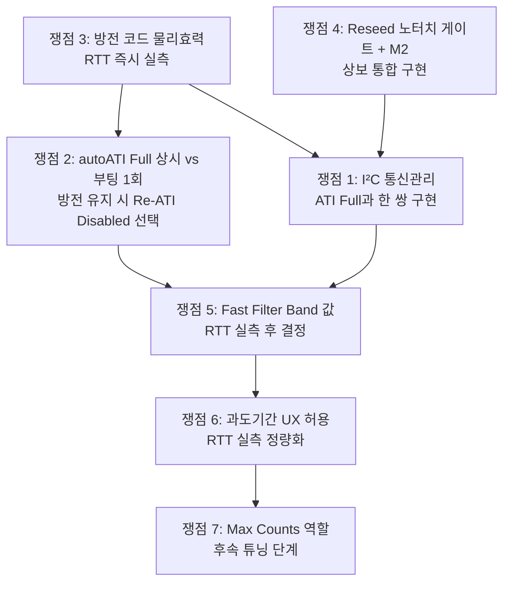

# C01 · 쟁점 도출 — Phase 1·2 합의 안 된 핵심 쟁점 목록

> **TL;DR**: Phase 1(7 에이전트 분석)·Phase 2(6 검증자 adversarial 검증)를 횡단 검토해 현재 합의 안 된 핵심 쟁점 7개를 도출했다. 중요도 높음 4개(I²C 무응답 통신관리, "autoATI Full 상시" vs "부팅 1회+Re-ATI 끔", 방전 코드 물리효력 미검증, Reseed 노터치 게이트 vs 터치해제대기)가 구현 착수 전 반드시 해소되어야 하며, 중요도 보통 3개(Beta 비대칭 설계·자기정상화 과도기간·Max Counts 역할)는 상세 구현 설계 단계에서 확정이 필요하다.

---

## 1. 쟁점 도출 방법론

### 1.1 합의 안 된 쟁점 분류 기준

다음 중 하나 이상 해당하는 항목을 쟁점으로 분류했다.

| 기준 | 설명 |
|---|---|
| **방향 충돌** | 은수님 안과 이전 결론·검증 측이 서로 다른 결론을 주장하는 항목 |
| **완전 누락** | 은수님 정리에 없는데 검증 측에서 "치명 위험"으로 제기한 항목 |
| **구현 방식 미결** | 방향은 합의됐으나 "어떻게 구현할 것인가"가 결정되지 않은 항목 |
| **실측 의존 결정** | 실측 없이 중요 결정을 내린 상태가 지속되고 있는 항목 |

### 1.2 합의 완료로 제외한 항목

Phase 1·2 전체가 이미 일치를 이룬 항목은 쟁점에서 제외했다.

- **autoATI 복귀 방향성**: 전원 에이전트 "방향 옳음" 합의
- **비대칭 Beta의 필요성 원칙**: B01·B03·A01·A02 전체 "단일 상향 금지, 비대칭 필수" 합의
- **노터치 게이트 안전망 원칙**: A01·A02·A07·B03·B04·B06 전체 "필요" 합의
- **IC 내부 드리프트가 물리 누적보다 우세**: A03·B02·B05 방향 정합

---

## 2. 쟁점 목록 (중요도 높음 → 보통 순)

---

### 쟁점 1. I²C 무응답 위험 처리 방식 — 필수 선행인가, 이행 중 처리인가

**중요도**: 높음 🔴

#### 은수님 안 측 근거

M1~M9 전체에 I²C 무응답 관련 언급이 없다. M8("autoATI + Beta만으로 모든 문제 해결 가능")은 암묵적으로 I²C 통신이 정상 동작함을 전제한다. 이 전제가 성립할 가능성은 있다 — autoATI가 올바르게 구현되고 Stuck-Touch가 발생하지 않으면 I²C 무응답은 재현되지 않을 수 있다.

#### 이전 결론·검증 측 근거

- B04(이전결론대조) C1: "현 펌웨어가 ATI Disabled를 선택한 근본 이유가 I²C 무응답 실제 경험이었다. 이것은 '간과한 항목'이 아니라 이전 분석이 새로 발굴한 항목이다."
- B06 G1: "은수님 M1~M9 전체에서 완전 부재. ATI Full 복귀 전 선행 필수 — ATI Active 폴링·ATI Error 핸들러·수동 Re-ATI 트리거·I²C 타임아웃 복구 시퀀스 4가지 중 하나라도 없으면 이전 경험 재현 가능."
- B03 §5: "ATI Active bit(bit5) 폴링·ATI Error(bit6) 에러 핸들러 미구현 상태. ATI Full 재활성화 시 Stuck-Touch → 자동 re-ATI → 통신 무응답 경로가 열린다."
- B05 게이트_6: "ATI Full I²C 무응답 실측이 M8 확정의 1순위 필수 게이트."

#### 미해소 핵심 질문

ATI Full 복귀 시 I²C 통신 관리 코드(ATI Active 폴링, 에러 핸들러)를 구현에 **착수하기 전에** 선행 구현해야 하는가, 아니면 **ATI Full 코드를 함께 구현**하면서 같은 커밋에서 처리해도 되는가?

#### 해결 방향

ATI Full 재활성화 코드와 I²C 통신 관리 코드는 **분리할 수 없는 한 쌍**이다. "선행 vs 동시"는 관리 방식 차이일 뿐이고, 실물은 반드시 I²C 통신 관리 없는 ATI Full 재활성화를 배포하지 않는 것이 해결책이다. 구현 순서로는 "I²C 통신 관리 먼저 코드 골격 작성 → ATI Full 활성화 → 연동 테스트"를 권고한다.

---

### 쟁점 2. "autoATI Full 상시" vs "부팅 1회 ATI + 런타임 Re-ATI 끔"

**중요도**: 높음 🔴

#### 은수님 안 측 근거

M1·M8은 autoATI를 단일 기능으로 취급하며 상시 활성 상태를 전제한다. M8의 "autoATI + Beta만으로 모든 문제 해결"은 autoATI가 지속적으로 드리프트를 보정하는 구조를 암시한다. 방전을 폐기(M8 함의)하면 Auto Re-ATI와 방전의 충돌 4축(비트 덮어쓰기·진동·채널 disable 교란·I²C hang) 중 3축이 사라지므로 Full 상시가 가능해질 수 있다.

#### 이전 결론·검증 측 근거

- B04 C3: "'autoATI Full 상시'는 방전·ATI 공존 검토에서 4축 충돌로 불가 판정 — 방전 유지 상태에서 Full 상시는 비트 덮어쓰기·Re-ATI 진동·채널 disable 교란·I²C hang이 모두 발생한다."
- B06 G2: "은수님 M1·M8은 '부팅 1회 ATI'와 '런타임 자율 Re-ATI'를 구분하지 않는다. 진동 환경(보행·교통)에서 counts fluctuation → ATI Band 초과 → 자동 Re-ATI → 수렴 중 터치 무반응 반복."
- 방전·autoATI 공존 권고: "충돌 근원은 런타임 자율 Re-ATI 하나. 그것만 끄면(Disabled 고정) 진동 + I²C hang 두 충돌이 원천 제거된다."
- B03 §4: "ATI 진행 중 `discharge_crx0()`가 0x30 레지스터를 write하면 ATI 수렴 오류 가능. ATI Active bit 감시 후 방전 일시 정지 필요."

#### 미해소 핵심 질문

방전을 폐기하는 것을 전제로 할 때, "autoATI Full 상시"와 "부팅 1회 ATI + Re-ATI Disabled"의 기술적 차이가 드리프트 보정 능력에 실질적 영향을 주는가?

#### 해결 방향

방전 유지 시: **"부팅 1회 ATI + Re-ATI Disabled 고정"** 이 유일한 안전 경로 (이전 결론).  
방전 폐기 시: Full 상시가 기술적으로 가능해지나, 방전 코드 물리효력 실측(쟁점 3)·ESD 드리프트 구분(게이트_7) 두 실측 게이트를 선행 통과한 후에만 판정 가능.  
따라서 현 시점 구현 선택지는 **방전 유지 + Re-ATI Disabled 고정**이 기본 경로이며, 방전 폐기는 추후 실측 결과에 따라 결정한다.

---

### 쟁점 3. 방전 코드(0x30 0x02)의 물리 효력 — VSS 방전인가 Linearise 설정인가

**중요도**: 높음 🔴

#### 은수님 안 측 근거

M4: "DC 블로킹 캡 때문에 IC 내부 드리프트가 주원인" — 이 결론의 논리 구조는 "방전이 실제로 전하를 방전하고 있고, 그럼에도 드리프트가 발생하므로 터치패드 외부 전하가 아닌 IC 내부 문제가 주원인"이다. 즉 방전이 VSS 방전으로 작동한다는 것을 묵시적으로 전제한다. M5("충전기 연결 → 복귀")도 같은 구조다. 코드에서 상수 이름이 `TDC_DRV_IQS323_INACTIVE_RXS_CRX0_VSS`로 되어 있어 VSS 방전 의도로 작성됐다.

#### 이전 결론·검증 측 근거

- 방전·autoATI 공존 권고 §3: "`0x30 LSB 0x02`는 데이터시트 A.5상 'Linearise=1 + Enable=0'이지 CRX0 VSS가 아니다. 핀-VSS 단락은 `0x34`(Inactive Rxs). 현재 코드는 '채널 disable+enable + Linearise flip'일 뿐이며 핀-VSS 물리 단락이 일어난다는 보장이 없다."
- B06 G3: "M4·M5가 방전 효과를 근거로 '드리프트 주원인' 결론을 내리는 구조 자체가, 방전 코드의 실제 동작 확인 전까지는 순환 추론이다."
- B03 §1.2: "코드에서 0x30 = `REG_ADDR_SENSOR0_SETUP`, 0x02 = `INACTIVE_RXS_CRX0_VSS`로 정의되어 있으나, 이 필드가 진짜 VSS 방전인지 Linearise 비트인지는 데이터시트 A.20 실측 확인이 필요하다."
- B02: "드리프트 주원인(ATI 보정 부재)은 이전 분석과 정합하나, C51 인과 연결 삭제 + 'ATI 보정 부재'로 대체 수정 필요."
- B05 게이트_3: "0x30 LSB Linearise 비트 실측이 미완료 상태."

#### 미해소 핵심 질문

현재 `discharge_crx0()` 함수가 실제로 CRX0 핀을 VSS에 단락시키는가? 아니면 Linearise 비트 플립만 하는가?

#### 해결 방향

RTT를 이용한 즉시 실측이 필요하다. 방전 전후 레지스터 0x30 값과 CH0 Counts 변화를 캡처해 판별한다. 방전이 Linearise만 토글하는 것으로 확인되면 `0x34`(Inactive Rxs) 경로로 교정하거나, 방전 자체의 드리프트 해소 효과를 재평가해야 한다. 이 실측은 쟁점 2(방전 폐기 여부)와 직접 연결된다.

---

### 쟁점 4. Reseed 노터치 게이트(권고 A)와 "터치 해제 대기 코드"(M2)의 관계 — 대체인가 상보인가

**중요도**: 높음 🔴

#### 은수님 안 측 근거

M2: "터치 중 LTA 업데이트 안 됨 → 부팅 터치 인식 시 터치 해제 대기 코드로 해결." 이미 `s_boot_touch_ignore` 로직이 현행 코드에 존재하며(B03 §1 확인), 이를 확장하면 M2의 의도가 달성된다. autoATI가 활성화되면 LTA IIR이 자유롭게 noTouch를 추적하므로 손 떼는 순간 수렴이 시작되고 `s_boot_touch_ignore`가 해제되는 구조다.

#### 이전 결론·검증 측 근거

- B04 C2: "M2의 연결 대상은 상위 레이어 이벤트 출력 차단이고, 권고 A의 연결 대상은 Reseed(LTA 시딩) 타이밍이다. 완전히 겹치지 않는다. M2는 READY 이후 사후 방어, 권고 A는 Reseed 발행 전 LTA 오염 원천 차단."
- B03 §2.2: "현행 `s_boot_touch_ignore`는 Reseed가 먼저 실행된 후 터치 이벤트를 차단하는 사후 방어다. Reseed 노터치 게이트는 Reseed 발행 자체를 지연해 LTA baseline이 터치 counts로 오염되는 것을 원천 차단한다."
- B04 C6: "M2 원리 설명('frozen 덕분')이 데이터시트와 반대('frozen 부재 덕분'). 이 반전을 이해 않으면 `ch0_touch==1` 대기로 구현 시 부팅 baseline 오염 시나리오에서 조건이 발동하지 않는다."
- B03 §2.3: "현행 코드에 timeout 강제 해제 없음. 손 안 떼면 무한 대기 → 제품 기능 전체 불능."

#### 미해소 핵심 질문

autoATI Full이 활성화된 상태에서, M2 단독(Reseed 노터치 게이트 없이)으로 P1 문제(터치된 채 부팅 먹통)가 완전히 해결되는가? 아니면 노터치 게이트를 Reseed 앞에 반드시 추가해야 하는가?

#### 해결 방향

두 메커니즘은 대체 관계가 아니라 **상보 관계**다.

- **autoATI 시나리오에서 M2가 작동하는 원리**: LTA가 Reseed로 오염되어도 autoATI 후 IIR이 noTouch를 추적 → 손 떼는 순간 수렴. 이 경우 "Reseed 오염"은 자동 수렴으로 해소되나 **수렴 과도기간**(수 초)이 발생한다.
- **권고 A가 없을 때의 취약점**: 손을 절대 안 떼는 경우(충전기 접촉·케이스 내 밀착) timeout 없으면 무한 대기 → 전 기능 불능.
- **통합 권고**: `drv.c:1134 Reseed` 앞에 `ch0_touch==0` N tick 게이트 추가 + timeout 강제 fallback + M2(`s_boot_touch_ignore`)의 timeout 강제 해제 추가. 두 가지 모두 구현이 올바른 경로다.

---

### 쟁점 5. Beta 비대칭 설계의 Fast Filter Band 값 결정 방법

**중요도**: 보통 🟠

#### 은수님 안 측 근거

M3: "Beta 값 조정으로 빠른 수렴 가능." 방향은 모든 에이전트가 동의한다. Beta 레지스터 현재 값은 POR default(0x0000)이므로 어떤 값을 써도 현상 유지보다 나쁘지 않을 가능성이 있다. 실측 없이 일단 보수적 값(LTA Beta=4, Fast Beta=12, Band=적당한 값)으로 시작해 조정해나갈 수 있다.

#### 이전 결론·검증 측 근거

- B01 §4.3: "Beta 레지스터 4비트(0~15), 최대 alpha=5.9%. 90% 수렴에도 Beta=15에서 38 샘플 필요. 단일 LTA Beta 상향은 약터치 흡수 위험."
- B03 §3.2: "Fast Filter Band는 '노이즈 < Band < 약터치 delta' 창으로 조율해야 한다. 이 창의 실제 수치는 RTT 실측이 선행되어야 결정할 수 있다."
- A06(UX): "약터치 흡수는 인공와우 사용자(노인·장갑·피부건조)에서 터치 미인식을 유발한다. Beta 단일 상향은 이 집단에서 UX를 악화시킨다."
- B05 게이트_4: "BETA 부호 세만틱(클수록 빠름인지) 실칩 확인이 미완료 게이트."
- B05 게이트_8: "Beta=0 POR default에서 LTA가 완전 동결인지, IC 내부 값으로 동작하는지 실측 미완료."

#### 미해소 핵심 질문

Fast Filter Band 값을 실측 없이 코드에 결정해도 되는가? 아니면 반드시 RTT 실측 후 결정해야 하는가?

#### 해결 방향

Fast Filter Band 값은 "노이즈 크기"와 "약터치 delta 크기" 두 실측값 사이에 위치해야 한다. 이 두 값은 보드마다 다르므로 **RTT 실측 없이는 올바른 Band 설정 불가**하다. 단계적 접근: ① Beta=0 현행 동작 RTT 캡처 → ② 노이즈 delta 측정 → ③ 약터치(경계 강도) delta 측정 → ④ Band = 노이즈 + (약터치delta - 노이즈) × 0.5 근방에서 시작 → ⑤ 주관적 사용성 검증.

---

### 쟁점 6. 자기정상화 과도기간의 UX 허용 여부

**중요도**: 보통 🟠

#### 은수님 안 측 근거

M1·M8: "autoATI는 LTA→카운터 수렴 구조 → 터치된 채 부팅이어도 손 떼면 수렴함." 수렴이 일어난다는 방향에는 모든 에이전트가 동의한다. 수렴 후에는 정상 감도가 회복되므로, 과도기간이 수 초 이내라면 제품 UX 관점에서 허용 가능하다.

#### 이전 결론·검증 측 근거

- A06(UX): "과도기간(손 뗀 후 첫 정상 인식까지의 시간) 실측이 구현 전 필수 게이트다. 과도기간 중 사용자가 터치를 시도하면 미인식 → 재시도 → LTA 오염 악순환이 발생할 수 있다."
- B05 게이트_5: "자기정상화 과도구간 측정 미완료 — 과도구간이 수 초 이상이면 UX 불허용."
- B01 §2.3: "Max Counts 4095를 초과하면 conversion 정지로 수렴 자체가 불가능해진다." (Beta=15에서도 90% 수렴에 38 샘플 — 샘플 주기에 따라 수 초)
- B03 §2.2: "autoATI 자기정상화에 의존 시 수렴 과도기간 동안 재터치 미인식 가능."

#### 미해소 핵심 질문

실제 Sound1 보드에서 "터치된 채 부팅 → 손 뗌 → 첫 정상 터치 인식"까지 걸리는 시간이 얼마인가? 그 시간이 사용자 경험상 허용 가능한가?

#### 해결 방향

RTT 실측으로 과도기간을 정량화해야 한다. 기준 제안: 2초 이내라면 일반 사용자 UX 허용 가능(전원 인가 후 준비 구간으로 인식), 5초 이상이면 별도 UI 피드백(LED 점멸 등) 또는 Reseed 노터치 게이트로 과도기간 제거가 필요하다.

---

### 쟁점 7. Max Counts 16383 상향(M9)의 역할 — 근본 안전망인가 보조 완충인가

**중요도**: 보통 🟠

#### 은수님 안 측 근거

M9: "카운터 최대값 4096보다 크게 하면 더 안정적일까?" autoATI Full 활성화 시 터치 counts로 ATI Target이 정규화되면 noTouch counts가 배율만큼 상승할 수 있어 Max Counts(현재 4095) 충돌 위험이 실재한다. 16383으로 상향하면 이 충돌을 방지할 수 있다.

#### 이전 결론·검증 측 근거

- B04 C5: "Max Counts 초과 시 conversion 정지·max value 고착 위험. 데이터시트 §5.4.2 '정상 동작 예상 max counts 위의 가장 작은 max counts 설정 권장' — 과도 상향은 하드웨어 이상 조기감지 능력 저하."
- B06 G4: "'noTouch counts 충돌 완충'(A01 분석)과 '강터치 stuck 방지'(B06 신규 발굴) 두 효과를 M9가 구분하지 않는다. 강터치 stuck 메커니즘이 Phase 1에서 독립 항목으로 분석되지 않았다."
- B01 §5.3: "데이터시트 A.7 bits[7:6]=11 → 16383 설정 가능. 근본 해결 아닌 보조 안전망."
- B05 §3.3: "M9는 데이터시트 기반 합리적 추론이나 직접 효과 실측이 없고, '더 안정적'이라는 정도 효과는 단정 불가."

#### 미해소 핵심 질문

Max Counts를 4095 → 16383으로 변경할 때, autoATI Full 시나리오에서 실제 conversion 정지가 발생하는가? 그리고 16383 설정이 강터치 stuck 위험을 오히려 늘리지 않는가?

#### 해결 방향

M9는 근본 해결책이 아닌 보조 안전망 수준으로 위치를 정확히 한다. autoATI Full 구현 후 RTT로 noTouch counts 최대값을 실측해, Max Counts 4095를 초과하는지 확인하고 필요 시 16383으로 조정한다. 이 결정은 쟁점 1~4 해소 이후의 후속 튜닝 단계에 포함한다.

---

## 3. 종합 판정표

| # | 쟁점 제목 | 중요도 | 은수님 안 | 이전 결론·검증 | 해결 방향 요약 |
|---|---|---|---|---|---|
| **쟁점 1** | I²C 무응답 통신관리 — 선행 필수 vs 이행 중 처리 | 🔴 높음 | M8에서 완전 누락 | B04·B06·B03 치명 위험으로 독립 제기 | ATI Full과 한 쌍. I²C 관리 없이 ATI Full 배포 금지 |
| **쟁점 2** | autoATI Full 상시 vs 부팅 1회 + Re-ATI Disabled | 🔴 높음 | M1·M8 상시 전제 | 방전 유지 시 4축 충돌로 상시 불가 | 방전 유지=Re-ATI Disabled. 방전 폐기=쟁점 3 실측 선행 |
| **쟁점 3** | 방전 코드 0x30 0x02 물리효력 — VSS 단락 vs Linearise | 🔴 높음 | M4·M5에서 VSS 방전 전제 | B04·B06·B03 Linearise 가능성 제기, 실측 요구 | RTT 실측으로 즉시 판별 필요 |
| **쟁점 4** | Reseed 노터치 게이트 vs 터치해제대기 — 대체인가 상보인가 | 🔴 높음 | M2 단독으로 P1 해결 가능 | B04·B03 상보 관계로 둘 다 필요 | Reseed 앞 노터치 게이트 + timeout fallback + M2 병행 |
| **쟁점 5** | Beta Fast Filter Band 값 결정 — 실측 전 결정 가능 여부 | 🟠 보통 | 보수적 값으로 시작 허용 가능 | B03·B01 RTT 실측 선행 필수 | RTT 실측 필수. "노이즈 < Band < 약터치delta" 창 실측 |
| **쟁점 6** | 자기정상화 과도기간 UX 허용 여부 | 🟠 보통 | 수렴 후 정상화되므로 허용 | A06·B05 과도기간 실측이 구현 전 필수 | RTT 실측으로 정량화. 2초 이내 허용, 5초 이상 대안 필요 |
| **쟁점 7** | Max Counts 16383 — 근본 안전망 vs 보조 완충 | 🟠 보통 | 더 안정적이라 상향 제안 | B01·B04 보조 안전망 수준 한정 | 보조 완충으로 위치 확정. 쟁점 1~4 해소 후 후속 결정 |

---

## 4. 쟁점 해소 순서 권고

### 1단계 — 실측 게이트 (구현 착수 전)

- **쟁점 3**: 방전 코드 0x30 0x02 RTT 실측 → VSS vs Linearise 판별
- **쟁점 4**: Reseed 노터치 게이트 + timeout + M2 상보 통합 설계 확정

### 2단계 — 설계 결정 (구현 착수 시)

- **쟁점 1**: I²C 통신 관리 코드 설계 (ATI Active 폴링·에러 핸들러·수동 Re-ATI)
- **쟁점 2**: 방전 유지 조건에서 "부팅 1회 ATI + Re-ATI Disabled 고정" 선택

### 3단계 — 구현 후 실측 (검증 단계)

- **쟁점 5**: Fast Filter Band 값 RTT 실측·조정
- **쟁점 6**: 자기정상화 과도기간 실측·UX 허용 판정

### 4단계 — 후속 튜닝

- **쟁점 7**: Max Counts 변경 필요 여부 실측 판정

---

## 5. 결론

> **은수님 정리(M1~M9)와 이전 분석·Phase 1·2 검증의 핵심 합의 안 된 쟁점은 7개다. 방향 합의는 이미 이루어진 상태이며, 미결은 "어떻게 구현하고 어떤 순서로 해소할 것인가"다. 쟁점 1~4는 구현 착수 전 반드시 해소해야 하는 치명 선행 사항이며, 이 중 쟁점 3(방전 코드 물리효력)은 RTT 즉시 실측으로 당일 확인 가능한 가장 빠른 게이트다. 쟁점 1(I²C 통신관리)은 ATI Full 복귀와 분리 불가하고, 쟁점 2(Re-ATI 상시 vs Disabled)는 쟁점 3 실측 결과에 따라 결정된다. 쟁점 4는 은수님 M2와 이전 권고 A가 대체 관계가 아닌 상보 관계임을 공식 확정해야 구현 설계가 가능하다.**
