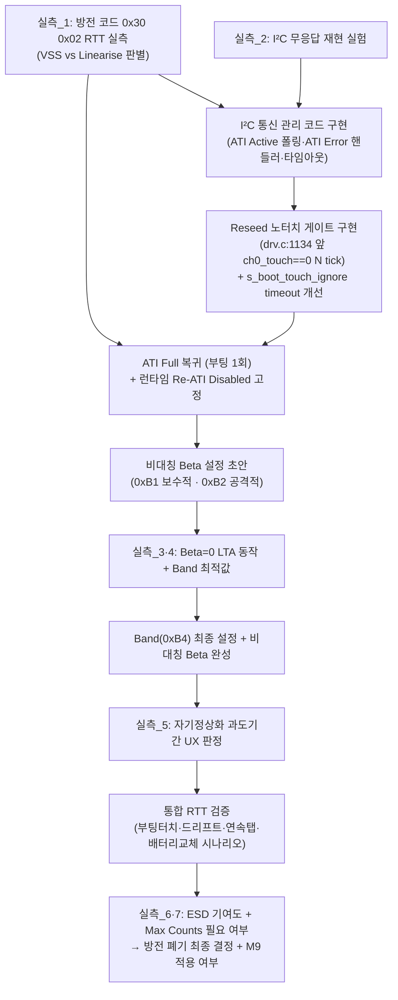

# D01 · 기술 최종 합의 — IQS323 터치 IC 문제 해결 방향

> **TL;DR**: 20인 회의 전 과정 종합 결론 — 은수님 안(M1~M9)의 방향은 전부 조건부 이상으로 유효하나 "단독 충분"은 없다. 최종 합의 해결책은 "하이브리드(ATI Full + 노터치 게이트 + 비대칭 Beta + Re-ATI 차단 + I²C 관리)"이며, 은수님 안의 핵심 통찰 4가지가 하이브리드의 중추를 이룬다. 방전 폐기 여부는 RTT 실측 선행 후 결정한다.

---

## 1. 은수님 명제 최종 판정표

| 명제 | 판정 | 근거 (1~2줄) |
|---|:---:|---|
| **M1** autoATI는 LTA→카운터 수렴 구조 → 터치된 채 부팅이어도 손 떼면 수렴함 | **△ 조건부** | 수렴 엔진은 LTA IIR(Beta/256)이고 autoATI는 MULT/COMP 설정만 담당한다. 그러나 결론 방향("손 떼면 수렴")은 성립하며 비대칭 Beta 설정이 전제다. (B01, C02) |
| **M2** 터치 중 LTA 업데이트 안 됨 → 부팅 터치 인식 시 터치 해제 대기 코드로 해결 | **△ 조건부** | "frozen 덕분"이 아니라 "frozen 부재 덕분"이 메커니즘이 반전된다. M2 의도 방향은 옳으나, 구현은 `ch0_touch==1` 대기가 아니라 Reseed 앞 `ch0_touch==0 N tick` 확인(노터치 게이트)이어야 한다. M2는 권고 A의 독립 재발견으로 위치된다. (B03, B04, C02) |
| **M3** Beta 값 조정으로 빠른 수렴 가능 | **△ 조건부** | Beta 방향은 데이터시트 §5.6과 정확히 일치한다. 단 LTA Beta 단일 상향은 약터치 흡수를 유발하므로 금지이며, 일반 LTA Beta(0xB1) 보수적 + Fast Filter Band(0xB4) + LTA Fast Beta(0xB2) 공격적 비대칭 구현이 전제다. Band 값은 RTT 실측 필수. (B01, B03, C02) |
| **M4** DC 블로킹 캡(C51 100pF) 때문에 터치패드보다 IC 내부 드리프트가 주원인 예상 | **⚠️ 수정 필요** | 결론 방향("IC 내부 드리프트 지배")은 옳으나 이유가 틀렸다. C51이 원인이 아니라 **ATI 보정 부재(FIXED 운용)**가 주원인이다. 방전 코드 0x30 0x02의 효력이 불명확하므로 M4의 추론 경로(방전에도 드리프트 발생 → IC 내부 주원인)는 순환 논리 위험이 있다. "ATI 보정 부재 때문에"로 교정 시 B02가 명시적으로 방향을 수용한다. (A03, B02, C02) |
| **M5** 먹통 상태 + 충전기 연결 → 터치 복귀 (DC 블로킹 캡 있어 터치패드 주원인 아님) | **△ 조건부** | 충전기 연결 복귀는 **POR(Power-On Reset) 메커니즘**으로 해석해야 한다. "터치패드 주원인 아님"이라는 결론 방향은 B02가 수용하지만 "C51 때문에"라는 논거는 삭제가 필요하다. (B02) |
| **M6** 기구 GND 쇼트 → 방전 가능성 있으나 주요 원인 아님 | **△ 조건부** | 물리적으로 가능한 경로이나 SW LTA 문제와 독립적이며 Phase 1·2에서 "주요 원인 아님" 판정이 지지됨. 단 ESD 기여도는 실측 게이트 미완료 상태. (A03, B02) |
| **M7** (기구 GND 쇼트 · 절전 관련 주장) | **⚠️ 수정 필요** | A05의 판정: 절전 관련 주장은 현 코드 사실관계와 반대이거나 전제 미성립. IC 전력 모드를 실제 설정하는 코드(0xC0 PM write + Report Rate write)가 현재 완전 누락 상태. 절전 관점 1차 권고는 IC 자체 절전 활용이 0%인 현 상태 개선이다. (A05) |
| **M8** 결론: autoATI + Beta 빠른 수렴만으로 모든 문제 해결 가능 예상 | **⚠️ 수정 필요** | "방향 옳음, 단독 불충분"이 전 에이전트 공통 판정이다. I²C 통신 관리 누락(B04·B06 치명 지적)과 "모든 문제 해결 가능"이라는 조기 낙관이 가장 큰 수정 대상이다. 전제 4가지(I²C 관리·런타임 Re-ATI 차단·비대칭 Beta·timeout fallback)를 명시하면 조건부 방어 가능. "만으로"는 삭제 필수. (A01, B04, B05, B06, C02, C04) |
| **M9** 카운터 최대값 4096보다 크게 하면 더 안정적일까? | **△ 조건부** | 데이터시트 A.7에서 16383까지 지원 확인. 근본 해결이 아닌 보조 완충이며, autoATI 복귀 후 RTT로 noTouch counts 최대값 실측 후 필요 시 조정하는 방식이 §5.4.2 "예상 max counts 위의 최소값 선택" 원칙과 양립한다. 당장 결정 불필요. (B01, B04, C03) |

---

## 2. 판정 요약 통계

| 판정 | 명제 |
|---|---|
| ✅ 옳음 | 없음 |
| △ 조건부 | M1, M2, M3, M5, M6, M9 |
| ⚠️ 수정 필요 | M4, M7, M8 |
| ❌ 틀림 | 없음 |

> [!NOTE]
> 단순 틀림(❌)은 하나도 없다. 은수님 안은 전반적으로 방향이 옳으나, 핵심 명제(M8)에서 필수 안전망 3종이 누락된 상태로 "단독 충분"을 주장한 것이 Phase 1·2·3의 공통 지적 대상이다.

---

## 3. 최종 합의 해결 방향

### 3.1 합의 결론 — 하이브리드

**합의된 해결 방향: 하이브리드**

은수님 안과 이전 결론 중 어느 쪽도 단독으로는 최적이 아니다. 은수님 안의 핵심 통찰이 하이브리드의 중추를 이루고, 이전 결론이 안전망 체계를 제공하는 **통합 하이브리드**가 최종 합의다.

```
하이브리드 구성 5요소:

[1] ATI Full 복귀 (부팅 1회 ATI + 런타임 Re-ATI Disabled)
    출처: 은수님 M1·M8 통찰 + 이전 권고 B
    역할: P4 뿌리(ATI 보정 부재로 인한 드리프트) 해소

[2] Reseed 노터치 게이트 (drv.c Reseed 직전 ch0_touch==0 N tick 확인)
    출처: 이전 권고 A (M2는 이의 독립 재발견)
    역할: P1 뿌리(Reseed 타이밍 오염) 해소 + 손 안 뗌 고착 방지
    추가: timeout fallback + s_boot_touch_ignore timeout 개선

[3] 비대칭 Beta (0xB1 보수적 + 0xB4 Fast Filter Band + 0xB2 공격적)
    출처: 은수님 M3 통찰 구체화
    역할: 손뗌 수렴 가속 + 약터치 흡수 방지
    조건: Band 값은 RTT 실측 후 결정

[4] 런타임 자율 Re-ATI 차단
    출처: 이전 결론
    역할: 진동 환경 반복 Re-ATI 방지 + 방전과 충돌 방지

[5] I²C 통신 관리
    출처: 이전 결론 (은수님 안에서 완전 누락)
    역할: ATI Full 복귀 시 무응답 재현 방지
    내용: RDY 핸드셰이크·ATI Active 폴링·ATI Error 핸들러·타임아웃 복구
```

### 3.2 선택 이유

**은수님 안 단독 채택을 하지 않는 이유 (C04·B04 근거)**:

| 누락 항목 | 단독 채택 시 위험 시나리오 |
|---|---|
| I²C 통신 관리 | ATI Full 재활성 직후 Stuck-Touch → I²C 영구 단절 (현 펌웨어 FIXED 선택의 실증 이유 재현) |
| Reseed 노터치 게이트 | 배터리 교체·워치독 리셋 후 손 닿은 채 부팅 → LTA 영구 고착 → 터치 전부 무반응 |
| Re-ATI 차단 구분 | 방전 유지 상태에서 "autoATI Full 상시"는 4축 충돌로 구현 불가 |

**이전 결론 단독 채택을 하지 않는 이유**:

이전 결론은 은수님 통찰(자기정상화·Beta 수렴 방향)이 이미 하이브리드에 흡수된 상태다. 은수님 안이 이전 결론을 대체하지 않고 보완하는 것이므로 "이전 결론 단독" vs "은수님 안 단독"의 대립은 실제 대립이 아니다.

**하이브리드를 선택하는 이유 (C02 중재·C04 최종 근거)**:

두 뿌리(P1: Reseed 오염, P4: ATI 보정 부재)가 독립적이며 각각 다른 요소가 담당한다. 하이브리드는 이 두 뿌리를 동시에 제거하는 유일한 구조다.

---

## 4. 합의된 사항 vs 미합의(실측 필요) 사항

### 4.1 합의 완료 사항

다음 항목은 Phase 1·2·3 전원 동의로 구현 착수 전에 확정된 합의다.

| # | 합의 내용 | 합의 근거 |
|---|---|---|
| **합의_1** | autoATI 복귀 방향이 옳다 (FIXED 포기) | A01~A07·B01~B06·C01~C04 전원 조건부 이상 지지 |
| **합의_2** | LTA Beta 단일 상향 금지 — 비대칭 설계(0xB1·0xB4·0xB2) 필수 | A01·B01·B03·A06 일치 |
| **합의_3** | 노터치 게이트 원칙(ch0_touch==0 N tick 확인 후 Reseed 허용)은 필수 | A01·A02·A07·B03·B04·B06 일치 |
| **합의_4** | I²C 통신 관리는 ATI Full 복귀의 선행 필수 조건 | A01·A02·B03·B04·B06·C02·C04 일치 |
| **합의_5** | "터치 해제 대기(M2)"와 "Reseed 노터치 게이트"는 대체 관계가 아닌 상보 관계 | B03·B04·C02·C04 일치 |
| **합의_6** | 런타임 자율 Re-ATI는 부팅 1회 ATI와 분리해 차단 | B04·B06·C02·C04 일치 |
| **합의_7** | IC 내부 드리프트 주원인 = ATI 보정 부재(FIXED 운용), C51 인과 삭제 | A03·B02·C02 일치 |
| **합의_8** | M4 결론 방향("IC 내부 드리프트 지배")은 유효, 이유만 수정 | A03·B02·C03 일치 |
| **합의_9** | M9(Max Counts 상향)은 근본 해결 아닌 보조 완충, autoATI 복귀 후 실측 결과에 따라 결정 | B01·B04·C03 일치 |
| **합의_10** | 구현 순서: 방전 코드 실측 + I²C 통신 관리 먼저 → Reseed 노터치 게이트 → ATI Full 복귀·비대칭 Beta → 통합 RTT 검증 | C01·C02 일치 |

### 4.2 미합의 사항 — 실측 필요

다음 항목은 에이전트 토론으로 결론이 불가하며, RTT 실측이 유일한 판단 경로다.

| # | 미합의 항목 | 실측 방법 | 결정하는 것 | 우선순위 |
|---|---|---|---|:---:|
| **실측_1** | 방전 코드 0x30 0x02 = VSS 방전인가 Linearise인가 | RTT: 방전 전후 0x30 레지스터 값 + CH0 Counts 변화 관찰 | 방전 폐기 가능 여부, 쟁점 2(Full 상시 vs Disabled) 전제 | 🔴 1순위 |
| **실측_2** | ATI Full 복귀 시 I²C 무응답 재현 가능성 | Stuck-Touch 유발 실험 + I²C 통신 관찰 | I²C 통신 관리 로직의 충분성 검증 | 🔴 1순위 |
| **실측_3** | Beta=0(POR default) 상태에서 LTA가 실제로 동결되는가 | RTT: LTA 레지스터 변화 관찰 (beta=0으로 운용 중 자연 드리프트 추적) | 현행 동작 정확한 이해 + Beta 설정 효과 비교 기준 | 🟠 2순위 |
| **실측_4** | Fast Filter Band 최적값 | RTT: 노이즈 delta + 약터치(경계 강도) delta 측정 | 비대칭 Beta 구현의 Band 값 결정 | 🟠 2순위 |
| **실측_5** | 자기정상화 과도기간 (손 뗀 후 첫 정상 인식까지) | RTT: 터치 중 부팅 → 손 뗌 → counts 수렴 시간 측정 | 과도기간 UX 허용 여부 (2초 이내 허용, 5초 이상 대안 필요) | 🟠 2순위 |
| **실측_6** | ESD 물리 전하 누적 기여도 | 방전 폐기 후 드리프트 속도 비교 측정 | 방전 완전 폐기 안전성 확인 | 🟡 3순위 |
| **실측_7** | Max Counts 4095 → 16383 필요 여부 | RTT: autoATI 복귀 후 noTouch counts 최대값 관찰 | M9 적용 여부 | 🟡 3순위 |

---

## 5. 최종 합의 구현 로드맵



---

## 6. 은수님 안 vs 이전 결론 vs 하이브리드 — 최종 비교

| 항목 | 은수님 안 | 이전 결론 | 합의 하이브리드 |
|---|---|---|---|
| **P1 해소** | M2("터치 해제 대기") — 구현 오류 위험 | 권고 A(Reseed 노터치 게이트) — 원천 차단 | 권고 A(노터치 게이트) + M2 상보 통합 |
| **P4 해소** | M8(autoATI 복귀) — 방향 정확 | 권고 B(ATI Full 복귀) — 동일 방향 | 부팅 1회 ATI Full + 런타임 Disabled |
| **드리프트 수렴** | M3(Beta 상향) — 단일 상향 위험 | 비대칭 Fast Filter Band 설계 | 비대칭 Beta (0xB1·0xB4·0xB2) |
| **I²C 안전** | 누락 | 선행 필수로 발굴 | ATI Full과 한 쌍 구현 |
| **방전 처리** | 폐기(M8 함의) — 실측 전 결정 불가 | 실측 선행 요구 | 실측_1 후 결정 (당분간 방전 유지·충돌 처리) |
| **Re-ATI 차단** | 구분 없음 | 부팅 1회·런타임 구분 | 런타임 자율 Re-ATI Disabled 고정 |
| **구현 항목 수** | 4개 (단순) | 6개 (상세) | 5개 (균형) |
| **미실측 위험** | 높음 (6종 미완료) | 낮음 (안전망 포함) | 중간 (실측 순차 진행) |

---

## 7. 합의자 D01 최종 의견

### 7.1 은수님 1차 정리에 대한 평가

은수님 M1~M9는 **하이브리드의 핵심 원리를 독립적으로 재발견한 통찰**이다. 특히 "자기정상화"(M1), "IC 내부 드리프트 주원인"(M4), "Beta 빠른 수렴"(M3)은 Phase 1·2·3 전체 에이전트가 방향으로는 지지하는 핵심 통찰이다.

Phase 1·2가 추가한 것은 은수님 안의 **방향을 부정한 것이 아니라, 경계 조건(손 안 떼는 시나리오·약터치·I²C hang)과 구현 순서를 보완한 것**이다.

### 7.2 구현 착수를 위한 타협 불가 최소 요건 3가지

```
[필수 1] I²C 통신 관리 선행 구현
         → ATI Full 복귀 없이 선행 개발·검증 후 ATI Full 활성화

[필수 2] Reseed 노터치 게이트 (ch0_touch==0 N tick + timeout fallback)
         → P1의 진짜 뿌리(Reseed 타이밍) 원천 차단

[필수 3] 비대칭 Beta 설계 (단일 LTA Beta 상향 절대 금지)
         → 약터치 흡수 방지 + 손뗌 수렴 가속
```

이 3가지를 충족하는 구현은 어떤 경로로 진행하더라도 Phase 1·2·3의 합의 기준을 통과한다.

### 7.3 합의자 한 줄 결론

> **은수님 안(자기정상화·IC 드리프트 SW 원인·Beta 수렴)의 방향 통찰을 하이브리드의 중추로 흡수하고, I²C 통신관리·Reseed 노터치 게이트·Re-ATI 차단을 안전망으로 결합한 5요소 하이브리드가 최종 합의 해결 방향이며, 방전 코드 물리효력(실측_1)과 I²C 무응답 재현(실측_2)이 구현 착수 전 1순위 필수 게이트다.**
