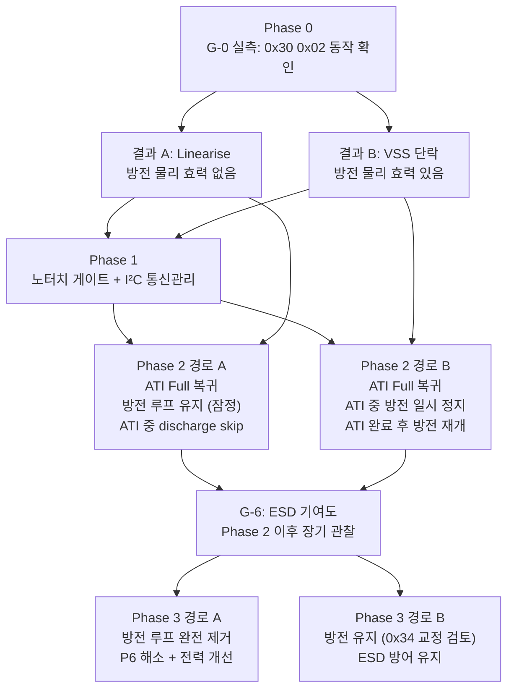

# D02 · 실행 로드맵 — IQS323 터치 문제 근본 해결

> **TL;DR**: Phase 1·2·3 13개 에이전트 합의를 4-Phase 실행 로드맵으로 구체화한다. Phase 0(정정·무위험) → Phase 1(노터치 게이트 + I²C 통신관리) → Phase 2(ATI Full 복귀 + 비대칭 Beta) → Phase 3(방전 처리 + 선택 최적화) 순서로 진행하며, 각 Phase는 독립 롤백 가능하고 선행 실측 게이트를 충족해야 다음 Phase로 진입한다.

---

## 0. 로드맵 설계 원칙

### 0.1 Phase 1·2·3 합의 핵심 3가지

모든 에이전트(A01~A07, B01~B06, C01~C04)가 타협 없이 일치한 항목:

| 필수 항목 | 근거 출처 | 위반 시 결과 |
|---|---|---|
| **I²C 통신관리 선행** | A01·A02·B03·B04·B06·C02 | ATI Full 복귀 즉시 I²C hang → 영구 통신 단절 |
| **노터치 게이트 (Reseed 직전)** | A01·A07·B03·B04·B06·C01·C02·C04 | 손 안 떼는 시나리오에서 LTA 영구 고착 → P1 재현 |
| **비대칭 Beta 설계** | A01·B01·B03·C02 | 단일 Beta 상향 → 약터치 흡수 → 인공와우 사용자 미인식 |

### 0.2 실행 로드맵 설계 기준

각 Phase는 다음 기준으로 설계한다:
- **목적**: 해소하는 근본 뿌리 명시 (뿌리 A = Reseed 오염, 뿌리 B = ATI 보정 부재)
- **구체 작업**: 코드 변경 위치·레지스터·함수 단위 명세
- **위험도**: 도입 위험 + 롤백 용이성
- **선행 실측 게이트**: 착수 전 확인 필수 항목 (필수 vs 선택)
- **독립 롤백**: Phase 단위 git revert 가능 여부

### 0.3 뿌리 구조 재확인

```
P1 (터치된 채 부팅 → 먹통) ← 뿌리 A: Reseed가 터치 counts로 LTA seed
P4 (드리프트 누적 → 먹통)  ← 뿌리 B: ATI Disabled(FIXED)로 환경변화 미보정
P6 (부팅마다 감도 다름)    ← 뿌리 C: 200ms 방전이 부팅 시 LTA counts를 교란
```

---

## 1. 실측 게이트 우선순위 목록

Phase 착수 전 반드시 통과해야 하는 게이트를 필수/선택으로 분류한다.

### 1.1 필수 게이트 (Phase 착수 전 차단 조건)

| 게이트 ID | 내용 | 실측 방법 | 결정하는 것 | 해당 Phase |
|---|---|---|---|---|
| **G-0** | 방전 코드 `0x30 0x02`의 실제 동작 — VSS 단락인가 Linearise 비트 플립인가 | RTT로 방전 전후 `REG_ADDR_SENSOR0_SETUP(0x30)` 읽기 + CH0 Counts 변화 관찰 (VSS 단락이면 핀이 0V로 당겨져 counts 급락) | Phase 2 시작 전 "방전 유지 vs 폐기" 분기 결정 | Phase 0 완료 후 즉시 |
| **G-1** | ATI Full 재활성 시 I²C 무응답 재현 여부 | Stuck-Touch 유발 실험(지속 터치 후 ATI Full 상태 진입) + I²C SDA 핀 오실로스코프 또는 RTT ATI Active bit 폴링 응답 확인 | I²C 통신관리 코드 완성 기준 검증 | Phase 1 완료 직후 |
| **G-2** | Beta=0 POR default에서 LTA가 완전 동결인지 동작하는지 | RTT에서 noTouch 상태 Count·LTA 1초 이상 연속 관찰 (LTA 값이 변하면 동작, 고정이면 동결) | 현재 자기수렴 능력 baseline 파악 + 비대칭 Beta 레지스터 값 결정의 기준점 | Phase 2 착수 전 |

### 1.2 선택 게이트 (구현 후 검증 단계에서 수행)

| 게이트 ID | 내용 | 실측 방법 | 결정하는 것 | 권장 시점 |
|---|---|---|---|---|
| **G-3** | 노터치 게이트의 N tick 적정값 | RTT에서 "터치된 채 부팅 → 손 뗌" 시나리오 수행, ch0_touch==0 연속 확인 최소 필요 샘플 측정 | Reseed 노터치 게이트의 N 값 결정 | Phase 1 구현 후 |
| **G-4** | Fast Filter Band 최적값 — "노이즈 < Band < 약터치 delta" 창 | RTT에서 ① 손 없이 noise delta 측정 ② 경계 강도(약터치) delta 측정 → Band = (noise + 약터치delta) / 2 근방 | 비대칭 Beta 0xB4 레지스터 값 결정 | Phase 2 구현 후 |
| **G-5** | 자기정상화 과도기간 — 손 떼고 첫 정상 터치 인식까지 걸리는 시간 | RTT에서 "터치된 채 부팅 → 손 뗌 → 터치 입력" 시나리오, 손 뗀 시각부터 터치 인식 성공까지 샘플 수 × 주기 계산 | 2초 이내: 허용. 5초 이상: 추가 대책(노터치 게이트 강화 또는 UI 피드백) 필요 | Phase 2 구현 후 |
| **G-6** | ESD 물리 전하 누적 기여도 | 방전 폐기 후 1주일 이상 정상 운용 + 동일 먹통 재현 여부 관찰 | Phase 3 "방전 완전 폐기" 최종 확정 | Phase 3 이후 |
| **G-7** | noTouch 운용 시 Max Counts(4095) 초과 여부 | Phase 2 구현 후 RTT에서 noTouch counts 최대값 장시간 관찰 | M9(Max Counts 16383 상향) 필요 여부 결정 | Phase 2 구현 후 |

---

## 2. Phase 0 — 정정·무위험 (즉시 착수 가능)

### 2.1 목적

코드 변경 전 "잘못된 전제"를 제거해 이후 단계의 분석 오류 전파를 차단한다.
해소 뿌리: 없음 (기능 개선 아님). 단 G-0 실측을 이 단계에서 수행한다.

### 2.2 구체 작업

| 작업 | 위치 | 내용 | 비고 |
|---|---|---|---|
| **T0-1** | RTT 실측 | G-0 수행: `discharge_crx0()` 실행 중 0x30 레지스터 값 + CH0 Counts 변화 RTT 캡처 | 별도 코드 변경 없음, 관찰만 |
| **T0-2** | RTT 실측 | G-2 수행: Beta=0 현재 상태에서 LTA 변화 1분 관찰 | 별도 코드 변경 없음, 관찰만 |
| **T0-3** | 코드 주석 | `tdc_drv_iqs323.c:1134` Reseed 라인 + `main.c:880` Reseed 라인에 TODO 주석 추가: `/* TODO(P1): 노터치 게이트 추가 — ch0_touch==0 N tick 확인 후 Reseed */` | 코드 변경 최소, 롤백 불필요 |
| **T0-4** | `tdc_drv_iqs323.c` | `discharge_crx0()` 함수 헤더 주석에 "0x30 0x02 = Linearise 가능성 미검증, G-0 실측 후 경로 결정 필요" 추기 | 주석만, 동작 변경 없음 |

### 2.3 위험도

🟢 **없음** — 코드 동작 변경 없음. 관찰 + 주석만.

### 2.4 선행 실측 게이트

없음 (이 Phase 자체가 실측 수행 단계).

### 2.5 독립 롤백

주석 변경이므로 즉시 revert 가능. G-0·G-2 결과는 Phase 1·2·3 분기 결정에 반드시 사용한다.

### 2.6 완료 조건

- G-0 결과 기록 (VSS 단락 확인 / Linearise 확인 / 미판별)
- G-2 결과 기록 (LTA 동결 / LTA 동작)
- TODO 주석 2건 추가 완료

---

## 3. Phase 1 — 노터치 게이트 + I²C 통신관리

### 3.1 목적

뿌리 A(Reseed 오염) 해소. 손 안 떼는 시나리오 포함 P1 완전 차단.
I²C 통신관리를 ATI Full 복귀 착수 전에 선행 구현해 Phase 2의 안전 기반 확보.

### 3.2 구체 작업

#### T1-1. Reseed 노터치 게이트 (핵심, 뿌리 A)

```
대상 파일: tdc_drv_iqs323.c (Reseed 라인 ~1134)
           main.c (func_sleep Reseed 라인 ~880)

구현 개요:
  [레이어 1] Reseed 직전 — ch0_touch==0 연속 N tick 확인
    ch0_touch bit를 N tick 연속으로 확인 (N: G-3 실측 결과, 초기값 5)
    N tick 내 ch0_touch==1 감지 시: 대기 연장
    timeout(예: 10초) 도달 시: timeout fallback 강제 진행 + s_dirty_lta 플래그 set
    N tick 모두 ch0_touch==0 확인 시: Reseed 발행
```

> [!IMPORTANT]
> `ch0_touch==1 대기`로 구현하면 안 된다. 부팅 baseline 오염 시 delta≈0이라 ch0_touch bit가 set되지 않아 대기 조건 자체가 발동하지 않는다. **"ch0_touch==0을 N tick 연속 확인 후 Reseed 발행"이 올바른 구현 방향이다** (C01·C02·C04 전원 일치).

#### T1-2. `s_boot_touch_ignore` timeout fallback 추가 (레이어 2)

```
대상 파일: tdc_touch.c (s_boot_touch_ignore 관련 로직)

현행 문제: timeout 없이 무한 대기 가능
추가 내용:
  - timeout N초(G-5 과도기간 실측 결과 2배 마진) 추가
  - timeout 도달 시 강제 해제 + s_dirty_lta 플래그 set
  - s_dirty_lta set 시: autoATI IIR 수렴 대기 + 수렴 완료 후 정상 전환
```

#### T1-3. I²C 통신관리 코드 구현 (Phase 2 선행 기반)

```
대상 파일: tdc_drv_iqs323.c (I²C 통신 관련 함수)

구현 4항목:
  (1) ATI Active bit(bit5) 폴링: ATI_CTRL 레지스터 bit5 set 구간 감지
  (2) ATI Error bit(bit6) 핸들러: ATI_Error 감지 시 수동 Re-ATI 트리거 로직
  (3) RDY 핸드셰이크 강화: event mode 또는 타임아웃 폴링으로 교체
  (4) I²C 타임아웃 강제 복구 시퀀스: N회 재시도 → 실패 시 IC MCLR 트리거
```

> [!WARNING]
> I²C 통신관리 코드 없이 T1-1·T1-2만 완료한 채로 Phase 2(ATI Full 복귀)에 진입 금지. 현 펌웨어가 FIXED를 선택한 원인(I²C hang 실증)이 재현된다.

### 3.3 위험도

🟡 **낮음-중간**
- T1-1·T1-2: Reseed 시점만 변경. ATI 모드 동일(FIXED 유지). 부팅 로직 변경이므로 리그레션 주의
- T1-3: 통신 레이어 추가. 기존 FIXED 운용에서는 ATI Active가 발생하지 않으므로 새 코드가 트리거될 일이 없음 → 현재 동작 영향 없음

### 3.4 선행 실측 게이트

| 게이트 | 필수/선택 | 이유 |
|---|---|---|
| G-0 완료 (Phase 0에서 수행) | 필수 | T1-1 구현 방향에 영향 없으나 Phase 2 분기 결정 재료 확보 |
| G-2 완료 (Phase 0에서 수행) | 필수 | LTA 동결 여부에 따라 s_boot_touch_ignore timeout 기준 조정 |

### 3.5 독립 롤백

T1-1 Reseed 게이트: 게이트 코드 제거 → 즉시 원복 (Reseed 타이밍만 변경).
T1-2 timeout fallback: 추가 로직 제거 → 즉시 원복.
T1-3 I²C 통신관리: 비활성 코드(FIXED 운용 중 미트리거) 이므로 제거해도 현재 동작 변화 없음.

### 3.6 완료 조건 + G-1 검증

Phase 1 완료 후 **G-1(ATI Full I²C 무응답 재현 여부)** 즉시 수행:
- T1-3 통신관리 코드 기반으로 Stuck-Touch 유발 실험
- I²C 무응답 미재현 확인 후 Phase 2 진입

---

## 4. Phase 2 — ATI Full 복귀 + 비대칭 Beta

### 4.1 목적

뿌리 B(ATI 보정 부재) 해소. autoATI 자기정상화 복원 + 비대칭 Beta로 수렴 가속.
G-1 통과 후에만 착수한다.

### 4.2 구체 작업

#### T2-1. ATI Full 복귀 (부팅 1회 ATI)

```
대상 파일: tdc_drv_iqs323.c (ATI_CTRL 레지스터 설정)

변경 내용:
  - ATI Mode: FIXED(0x00) → Full(0x03) — 부팅 1회 ATI 실행
  - T1-3 I²C 통신관리와 연동: ATI Active bit 폴링으로 완료 대기
  - ATI 완료 확인 후 → ATI Mode → Disabled(0x00) 고정 (런타임 자율 Re-ATI 차단)
```

> [!IMPORTANT]
> "ATI Full 상시"가 아닌 **"부팅 1회 ATI + 이후 Disabled 고정"** 구조다. 런타임 자율 Re-ATI는 진동 환경에서 LTA Band 초과 → 자동 Re-ATI → 수렴 중 무반응 반복을 유발한다 (B04·B06 C3 확인). G-0 결과 방전 폐기가 결정된 경우에도 이 구조는 동일하게 적용한다.

#### T2-2. 비대칭 Beta 설정

```
대상 파일: tdc_drv_iqs323.c (Beta 레지스터 설정)

레지스터:
  0xB1 (LTA Beta): 보수적 값 (예: 4) — 일반 LTA 추적 속도 낮춤
  0xB4 (Fast Filter Band): 중간 값 (G-4 실측 결과 반영 전 초기값: 노이즈 + 여유)
  0xB2 (LTA Fast Beta): 공격적 값 (예: 12) — Band 내 빠른 수렴

주의: Beta 단일 상향(0xB1만 증가) 금지 — 약터치 흡수 발생
초기 기본값은 G-4 실측 전 보수적으로 설정하고, G-4 통과 후 최적화
```

#### T2-3. 방전-ATI 충돌 처리 (G-0 결과 분기)

```
G-0 결과 A (0x30 = Linearise 확인):
  → 현재 방전이 물리 효력 없음 확인
  → 방전 루프 200ms 코드 잠정 유지 (G-6 ESD 실측 전까지 보수적 유지)
  → 단, ATI Active bit set 구간: discharge_crx0() skip (비트 덮어쓰기 방지)
  → Phase 3에서 방전 폐기 최종 결정

G-0 결과 B (VSS 단락 확인):
  → 현재 방전이 실제 물리 방전임 확인
  → ATI Active bit 폴링으로 방전 일시 정지 필수
  → ATI 완료 후 방전 재개
  → Phase 3에서 ESD 실측 후 방전 폐기 여부 결정

G-0 미판별:
  → Phase 0 G-0 재수행 후 진입 또는 G-0 결과 B(보수적 경로) 적용
```

#### T2-4. M9(Max Counts) 검토 — Phase 2 구현 후

```
Phase 2 구현 완료 후 G-7 수행:
  RTT에서 noTouch counts 최대값 장시간 관찰
  → 4095에 근접(>3800)하면: Max Counts 16383(bits[7:6]=11)으로 상향 결정
  → 4095에 충분한 여유 있으면: 현행 유지

변경 시 주의: 데이터시트 §5.4.2 "정상 예상 max counts 위의 가장 작은 값" 원칙
→ 16383 고정이 아닌, noTouch counts 최대 실측값 + 여유(×1.5 권장) 기준 결정
```

### 4.3 위험도

🟠 **중간**
- T2-1: ATI 모드 변경 — Phase 1 I²C 통신관리 없이는 🔴 치명 위험. G-1 통과 필수.
- T2-2: Beta 레지스터 변경 — G-4 실측 전 초기값은 보수적 선택, 튜닝은 선택 게이트 통과 후
- T2-3: 방전-ATI 공존 처리 — G-0 결과에 따라 두 경로 중 하나 선택

### 4.4 선행 실측 게이트

| 게이트 | 필수/선택 | 이유 |
|---|---|---|
| **G-1 통과** (Phase 1 완료 후) | **필수** | ATI Full 재활성화 안전 확인 |
| **G-0 결과 확인** (Phase 0) | **필수** | T2-3 방전 처리 분기 결정 |
| **G-2 결과 확인** (Phase 0) | 필수 | Beta 설정 기준점 확인 (LTA 동결 여부) |
| G-4 (Fast Filter Band 실측) | 선택 | Phase 2 구현 후 수행, 초기값으로 시작 가능 |
| G-5 (과도기간 실측) | 선택 | Phase 2 구현 후 수행 |

### 4.5 독립 롤백

T2-1 ATI Full 복귀: ATI Mode를 다시 FIXED로 되돌리면 Phase 1 상태로 즉시 복귀.
T2-2 Beta 설정: 0x0000(POR default)으로 복원 → Beta 적용 전 상태로 복귀.
T2-3 방전-ATI 충돌 처리: ATI Active 폴링 코드 제거 → Phase 1 상태로 복귀.
**세 변경은 서로 독립적이어서 각각 별도 롤백 가능.**

### 4.6 완료 조건

- G-5(과도기간) 실측 완료 + 2초 이내 확인 또는 대책 적용
- G-7(Max Counts) 실측 완료 + 필요 시 T2-4 수행
- "터치된 채 부팅 → 손 뗌 → 정상 터치 인식" 시나리오 RTT 검증 통과
- "장시간 운용 후 드리프트 먹통 재현 없음" 48시간 내 관찰 통과

---

## 5. Phase 3 — 방전 처리 + 선택 최적화

### 5.1 목적

뿌리 C(방전으로 인한 부팅 감도 편차) 해소 검토 + 보조 안전망 최적화.
Phase 2 완료 + G-6 실측 후에만 착수한다.

### 5.2 구체 작업

#### T3-1. 방전 코드 폐기 or 교정 (G-0·G-6 결과 기반)

```
G-0 = Linearise + G-6 = ESD 기여 없음 확인 시:
  → discharge_crx0() 함수 및 200ms 주기 호출 코드 완전 제거
  → P6(부팅마다 감도 다름) 자동 해소
  → 전력 소비 개선 (A05: IC 절전 모드 활용 공간 확보)

G-0 = VSS 단락 + G-6 = ESD 기여 존재 확인 시:
  → 방전 유지 (T2-3 공존 처리 상태 유지)
  → 방전 실효성 추가 검토 (0x34 경로 비교 실험 권고)

G-0 = VSS 단락 + G-6 = ESD 기여 없음 확인 시:
  → 방전 폐기 결정 가능 (단 ESD 재발 시 복구 절차 사전 준비 권고)
```

#### T3-2. IC 절전 모드 활성화 검토 (A05 권고)

```
현재 상태: IC 전력 모드 설정 코드(0xC0 PM write + Report Rate write) 미구현
배터리 예산 사양 확보 후 검토:
  - 방전 폐기 시: 200ms 절전 루프 제거로 전력 여유 확보
  - IC 자체 절전(low-power NP) 활성화 가능성 검토
  - 실전류 측정 없이 절전 우선순위 결정 불가 → 선택 항목 유지
```

#### T3-3. Max Counts 최종 확정 (T2-4 후속)

```
G-7 결과가 "4095 근접"이었고 T2-4에서 16383 상향을 결정했다면:
  → 실운용 후 noTouch counts 최대값 재확인
  → §5.4.2 원칙에 따라 필요 최소값으로 재조정
  → "더 안정적"이 아닌 "예상 최대값 + 여유" 기준으로 결정
```

### 5.3 위험도

🟢 **낮음** (G-6 실측 기반이므로 결정 근거가 실증됨)
단, 방전 폐기 후 ESD 재발 가능성은 장기 관찰이 유일한 확인 방법 — 폐기 결정 후 2주 이상 모니터링 권고.

### 5.4 선행 실측 게이트

| 게이트 | 필수/선택 | 이유 |
|---|---|---|
| **G-6 통과** (Phase 2 이후 장기 관찰) | **필수** | 방전 폐기의 유일한 안전 판단 근거 |
| Phase 2 "장시간 드리프트 없음" 확인 | 필수 | Phase 3 착수 조건 |

### 5.5 독립 롤백

T3-1 방전 폐기: `discharge_crx0()` 호출 코드 복원 → Phase 2 상태로 즉시 복귀.
T3-2 절전 모드: 추가 레지스터 write 제거 → 기존 전력 모드 복귀.
T3-3 Max Counts: 레지스터 값 원복 → 4095로 즉시 복귀.

---

## 6. 은수님 M9(Max Counts) 제안 처리 계획

### 6.1 M9 위치 확정

| 구분 | 내용 |
|---|---|
| **어느 Phase** | Phase 2 완료 후 (T2-4), 최종 확정은 Phase 3 (T3-3) |
| **성격** | 근본 해결책이 아닌 **보조 안전망** (B01·B04 일치) |
| **검토 기준** | 데이터시트 §5.4.2: "정상 운용 예상 max counts 위의 가장 작은 max counts" |

### 6.2 M9 처리 절차

```
1. Phase 2 구현 완료 후 G-7 수행 (RTT: noTouch counts 최대값 장시간 관찰)
2. noTouch max counts ≤ 3000: 현행 4095 유지 (M9 불필요)
3. noTouch max counts 3000~4000: 주의 구간 — 16383 상향 검토
4. noTouch max counts > 4000 (4095 초과 위험): 16383 상향 결정
5. 상향 후: 강터치 stuck 위험 재평가 (16383 고착이면 HW 이상 수준)
```

### 6.3 M9 관련 주의사항

- 16383 무조건 상향은 **하드웨어 이상 조기감지 능력을 4배 저하**시킴 (B04 C5)
- `autoATI 복귀 → ATI Target 정규화 → noTouch counts 상승` 경로가 실측으로 확인된 경우에만 상향 근거가 성립
- M9는 "실측 후 필요 시 조정"으로 재정의 (C03 §4.4 방어 논거 수용)

---

## 7. 방전 코드(0x30) 교정 타임라인

### 7.1 전체 타임라인



### 7.2 교정 우선순위

1. **즉시 (Phase 0)**: G-0 실측으로 0x30 0x02의 실제 레지스터 의미 확인
2. **Phase 2**: G-0 결과에 따라 방전-ATI 공존 처리 방식 결정 (Linearise vs VSS 분기)
3. **Phase 3**: G-6 ESD 실측 결과 기반 방전 폐기 또는 유지 최종 결정
4. **Phase 3 선택**: G-0 = VSS이고 효력 실증 시, 0x34 경로(진짜 핀-VSS 단락)와 비교 실험 권고

---

## 8. 롤백 독립성 요약

| Phase | 롤백 내용 | 이전 상태 | 영향 |
|---|---|---|---|
| **Phase 0 롤백** | TODO 주석 제거 | 코드 원상복귀 | 없음 |
| **Phase 1 롤백** | T1-1: Reseed 게이트 제거, T1-2: timeout 코드 제거, T1-3: I²C 통신관리 코드 제거 | Phase 0 상태 | ATI 모드 변경 없으므로 동작 동일 |
| **Phase 2 롤백 (전체)** | T2-1: ATI Mode → FIXED, T2-2: Beta 0x0000, T2-3: ATI-방전 공존 처리 제거 | Phase 1 상태 | P4 드리프트 문제 재현 (Phase 1 이전 상태로 완전 복귀 아님, P1은 Phase 1 덕분에 해소 유지) |
| **Phase 2 롤백 (부분)** | T2-1만 롤백: FIXED 복귀 | I²C 통신관리 + 노터치 게이트 유지 상태 | P1 해소 유지, P4 재현 |
| **Phase 3 롤백** | T3-1: 방전 코드 복원, T3-2: 절전 설정 제거, T3-3: Max Counts 원복 | Phase 2 완료 상태 | P6 감도 편차 재현 가능 |

> [!NOTE]
> **Phase 간 독립성 핵심**: Phase 1(노터치 게이트)은 Phase 2(ATI Full)와 완전 독립이다. Phase 2를 롤백해도 Phase 1 효과(P1 해소)는 유지된다. 이것이 C02 "1단계: Reseed 게이트 → 2단계: ATI Full" 순서 제안의 가장 중요한 이유다.

---

## 9. 최종 실행 판정표

### 9.1 Phase별 한 줄 목표

| Phase | 한 줄 목표 | 해소 뿌리 | 착수 조건 |
|---|---|---|---|
| **Phase 0** | G-0·G-2 실측 + 주석 정정 | 없음 | 즉시 |
| **Phase 1** | P1 원천 차단 + ATI Full 복귀 기반 구축 | 뿌리 A | Phase 0 완료 |
| **Phase 2** | P4 드리프트 해소 + 자기정상화 복원 | 뿌리 B | G-1 통과 (Phase 1 완료 후) |
| **Phase 3** | P6 감도 편차 해소 + 선택 최적화 | 뿌리 C | G-6 통과 (Phase 2 이후 장기 관찰) |

### 9.2 M1~M9 처리 요약

| 명제 | 처리 결과 | 구현 Phase |
|---|---|---|
| M1 (자기정상화) | 재정의 후 수용 — 수렴 엔진은 IIR, autoATI는 MULT/COMP 설정 | Phase 2 |
| M2 (터치 해제 대기) | 레이어 1(노터치 게이트) + 레이어 2(s_boot_touch_ignore timeout) 상보 구현 | Phase 1 |
| M3 (Beta 빠른 수렴) | 비대칭 Beta(0xB1 보수 + 0xB2 공격 + 0xB4 Band)만 허용 | Phase 2 (G-4 후 최적화) |
| M4 (IC 내부 드리프트 주원인) | 인과 연결 교정: "C51 때문에" → "ATI 보정 부재 때문에" | 정정 사항 (문서) |
| M5 (충전기 복귀) | POR 메커니즘으로 재해석, 결론 방향 유지 | 정정 사항 (문서) |
| M6·M7 (GND 쇼트 방전) | 조건부 수용 — 보조 경로, 주요 원인 아님 | Phase 3 G-6 장기 관찰 |
| M8 (autoATI+Beta만으로 해결) | 전제 4가지 명시 후 조건부 수용: I²C 관리·부팅 1회 ATI·비대칭 Beta·timeout fallback | Phase 1~2 전체 |
| M9 (Max Counts 상향) | 보조 안전망으로 위치 확정 — 실측 후 필요 시 조정 | Phase 2 T2-4 / Phase 3 T3-3 |

---

## 10. D02 로드맵 결론

> **Phase 1·2·3 13개 에이전트가 도달한 합의의 핵심은 단순하다: "은수님 안(autoATI + Beta 수렴)은 방향이 옳고, 이전 분석(노터치 게이트 + I²C 통신관리 + Re-ATI 차단)은 그것을 안전하게 실현하는 방법이다." 두 접근은 대립이 아닌 상보 관계다. 본 로드맵은 그 상보 관계를 Phase 0→1→2→3의 순서로 구체화하며, 각 Phase는 독립 롤백이 가능하고 실측 게이트(G-0~G-7)를 통과해야 다음 Phase에 진입한다. 방전 코드(0x30) 교정은 G-0 즉시 실측이 가장 빠른 진입점이고, M9(Max Counts)는 Phase 2 이후 G-7 실측 기반 보조 조정 항목이다.**
