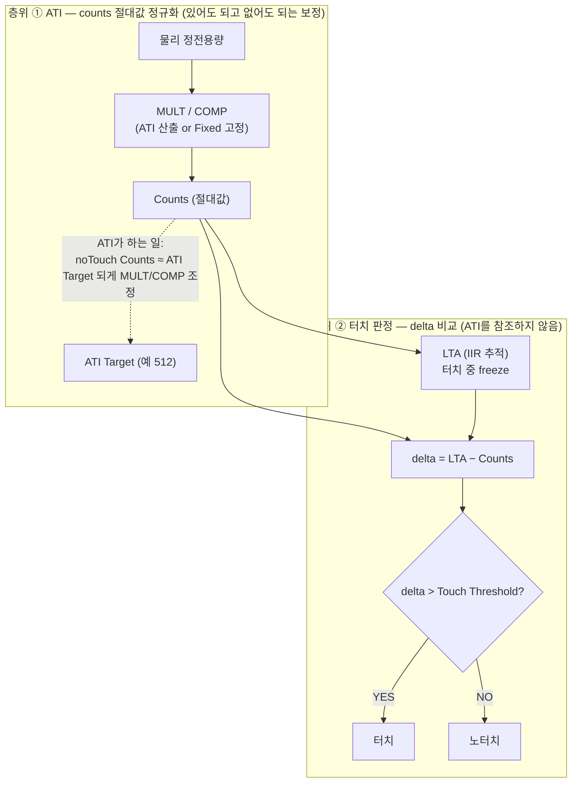
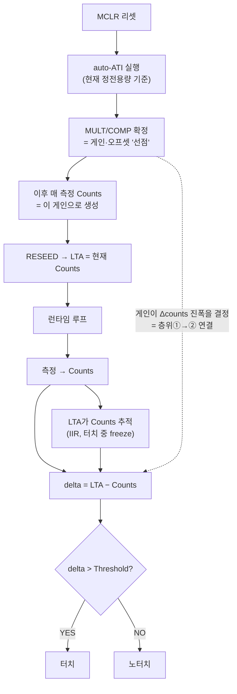
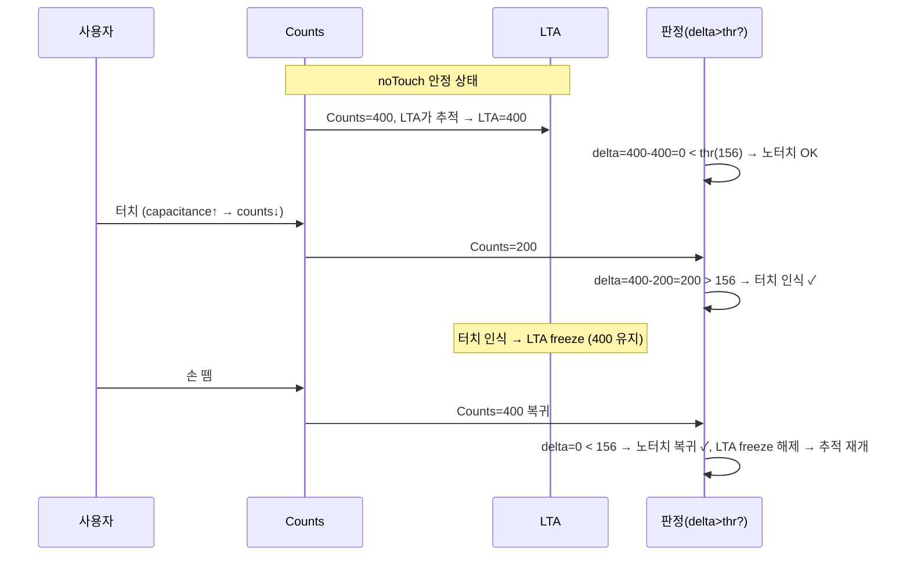
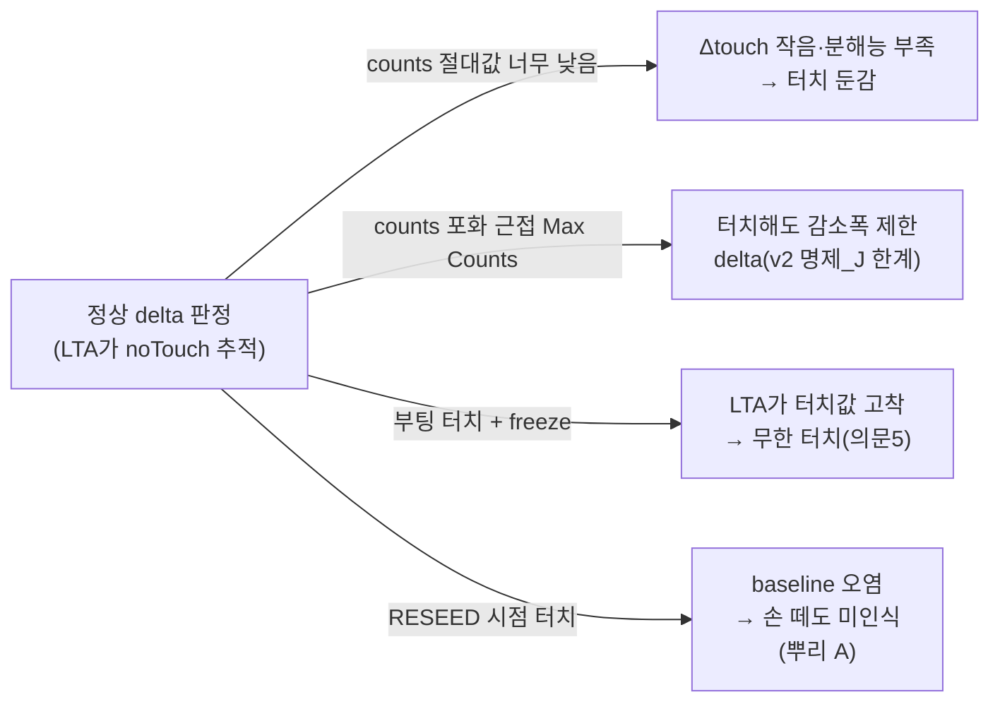

# 개념 정리 — IQS323 터치 동작 모델 (왜 헤매는가)

**TL;DR**: 터치 시스템에는 **두 개의 다른 층위**가 있다 — ① ATI(MULT/COMP로 counts 절대값을 Target에 정규화)와 ② 터치 판정(delta = LTA−Counts를 threshold와 비교). 분석이 헤매는 근본 이유는 이 둘을 섞어 "ATI가 안 되면 터치가 깨진다"고 보기 때문이다. 실제로는 ATI 없이도 터치 판정은 성립하며, ATI는 별도의 가치(절대값 균일화)를 가진다. 본 문서는 이 분리를 중심으로 5개 의문을 해소하고 해법을 정리한다.

---

## 0. 이 문서의 목적

「터치센서 재검토」 논의에서 은수님이 "분석할수록 더 이해가 안 된다"고 하신 지점을 진단한다. 결론부터: **혼란은 지식 부족이 아니라, 본질적으로 분리된 두 메커니즘을 한 덩어리로 보는 시야 때문**이다. 층위를 분리하면 5개 의문이 일관되게 풀린다.

> [!NOTE]
> 근거: 데이터시트 §5.5(LTA IIR)·§5.7(터치 판정)·§5.9(ATI)·§5.10(Re-ATI)·§5.11(ATI Error), 에이전트-로그 `v1/01`·`v2/12`·`v1/03`. 정량 미확정은 **[확정 필요]**, 추론은 **[추정]** 표기.

---

## 1. 왜 헤매는가 — 한 문장 진단

> **ATI(counts 절대값 정규화)와 터치 판정(delta 비교)이라는 서로 다른 두 층위를 한데 섞어 보고 있기 때문.**

거의 모든 의문이 *"ATI가 제대로 안 되면 터치 판정이 깨진다"*는 전제에서 출발한다. 자연스러운 직관이지만 **부정확**하다. 실제 구조는:

- **터치 판정**은 ATI를 **직접 참조하지 않는다** (판정식 `(LTA−Counts) > Threshold`에 ATI 변수 없음, §5.7).
- **ATI**는 터치 판정을 돕는 게 아니라, counts의 **절대 위치**를 Target 근처로 옮겨 **분해능·포화 마진을 확보**하는 별도 작업이다.

이 둘을 분리하는 순간, "ATI 없이도 터치는 되는데(층위 ②), 왜 실제로 먹통이 나는가(층위 ① 절대값 극단)"가 명확해진다.

---

## 2. 5개 핵심 개념

| 개념 | 정의 | 단위/값 | 누가 정하나 | 근거 |
|---|---|---|---|---|
| **Counts** | IC가 매 측정마다 출력하는 raw 센서값 (MULT/COMP 적용 후) | 정수 (예: 0~1023, Max Counts까지) | IC 측정 + MULT/COMP | §5.5 |
| **MULT / COMP** | counts를 만드는 게인(Multiplier)·오프셋(Compensation) | 레지스터값 | ATI가 산출 **또는** Fixed로 고정 | §5.9 |
| **ATI Target** | ATI가 noTouch counts를 맞추려는 목표 위치 | 고정값 (예: 512) | 설정 | §5.9 |
| **ATI Band** | ATI Target 주변 허용 범위. LTA가 이 밖으로 가면 Re-ATI 트리거 | Target/16 (Small) 또는 Target/8 (Large), `ATI Setup` bit3 | 설정 | §5.10, v1/01 |
| **LTA** (Long-Term Average) | noTouch 기준선. 매 샘플 IIR로 counts 추적. **터치 인식 중엔 freeze** | counts와 같은 단위 | IC 자동(IIR) | §5.5, v1/03 |
| **Touch Threshold** | 터치 인식 문턱. `(LTA−Counts) > Threshold`면 터치 | delta 단위 | 설정 | §5.7 |
| **delta** | `LTA − Counts`. 터치로 counts가 기준선보다 얼마나 내려갔나 | counts 단위 | 계산 | §5.7 |

> self-cap 방식: **터치 = capacitance 증가 = counts 감소**. 그래서 터치 시 `Counts < LTA` → `delta > 0`.

---

## 3. 두 층위 분리 (이 문서의 핵심)

**읽는 법**:
- 층위 ②(터치 판정)는 `cnt`와 `lta`만 있으면 돈다. **ATI Target·ATI Band·MULT/COMP는 등장하지 않는다.**
- 층위 ①(ATI)은 `cnt`의 **절대 위치**를 Target으로 옮길 뿐, 층위 ②의 판정식을 바꾸지 않는다.
- **그래서 ATI Disabled(Fixed)여도 층위 ②는 성립한다** — 현 펌웨어가 실제로 이렇게 동작 중(명제_J 참).

---

## 3-A. 두 층위의 "연결고리" — MULT/COMP가 절대값과 Δ를 *동시에* 정한다

> [!IMPORTANT]
> 은수님 지적대로 두 층위는 **완전 독립이 아니다.** 연결고리는 **MULT(게인)** 다. ATI가 정한 MULT/COMP가 ① noTouch counts의 **절대 위치**와 ② 터치 시 **신호 진폭(Δcounts)** 을 *동시에* 결정하고, 그 Δ가 곧 층위 ②(delta 판정)의 입력이 된다. 즉 "①이 ②의 입력값 스케일을 정하는" 한 방향 의존이 있다.

### ATI가 실제로 하는 일 (데이터시트 §5.9)

ATI는 **2단계**로 counts를 ATI Target에 맞춘다:

1. **MULT 단계** (Coarse/Fine Divider·Multiplier): 전하 분배 비율을 바꿔 counts의 **절대 범위(게인)** 를 ATI Base에 맞춘다 — "같은 전극 용량에서 더 많거나 적은 사이클이 필요하게" 만드는 **거친 배율** (§5.9, 데이터시트 line 555).
2. **COMP 단계** (Compensation Value·Divider): 내부 커패시터 뱅크로 기생 정전용량 일부를 상쇄(offset)해 counts를 Target까지 **미세 조정** (line 557).

$$\text{ATI Target} = \text{ATI Base} \times \frac{\text{ATI Resolution Factor}}{16}, \qquad \text{Sensitivity} \propto \frac{\text{ATI Target}}{\text{ATI Base}}$$

(데이터시트 line 633·639)

### 핵심: MULT는 noTouch 위치와 터치 Δ를 *같은 게인으로* 스케일한다

counts는 정전용량의 단조 함수이고(self-cap: 터치=정전용량↑=counts↓, line 223~224), **MULT가 그 함수의 스케일(게인)을 정한다.** 따라서 터치로 정전용량이 ΔC만큼 변할 때:

$$\Delta\text{counts} \;\propto\; \text{게인(MULT)} \times \Delta C \quad [\text{§5.9 정성, 정확한 charge-transfer 수식은 확정 필요}]$$

> 즉 **MULT가 크면(감도↑) 같은 물리 터치라도 Δcounts(신호 진폭)가 크다.** 그리고 그 Δcounts가 그대로 `delta = LTA − Counts`가 되어 threshold와 비교된다. **이것이 층위 ①(ATI/게인)과 층위 ②(delta 판정)의 연결고리다.**

### 부팅 auto-ATI 선점 → 이후 전 과정

핵심: 부팅 시 auto-ATI가 MULT/COMP를 **한 번 확정(선점)** 하면, 이후 모든 counts는 그 게인으로 생성되고 — 그 다음부터는 사실상 "Fixed"와 같다(런타임 MULT/COMP 불변). 차이는 **그 선점된 게인이 어떤 정전용량 상태를 기준으로 정해졌느냐** 뿐이다.

### 그래서 보드 편차가 이렇게 갈린다 (의문 3·4의 정확한 메커니즘)

| 항목 | ATI Full (게인 자동) | Fixed (게인 고정) |
|---|---|---|
| noTouch counts 절대값 | 모든 보드 ≈ Target (게인이 흡수) | 보드별 다름 (게인 동일) |
| 터치 Δcounts 진폭 | 모든 보드 균일 (게인 정규화) | **보드별 다름** |
| 동일 threshold의 의미 | 모든 보드 동일 감도 | **보드별 감도 편차**(둔감/과민) |
| noTouch delta | ≈0 (LTA 흡수) | ≈0 (LTA 흡수) — **여기는 같음** |

> [!NOTE]
> **delta(노터치≈0)는 양쪽 같다** — 그래서 "노터치인데 터치로 오인"은 게인 때문이 아니다(의문 3 정정). 갈리는 건 **터치 시 Δ 진폭** = 감도다. ATI Full은 이 Δ를 게인으로 정규화해 균일화한다. 이것이 ATI의 단 하나의 진짜 실익이다.

### 부팅 노터치 vs 터치 — 게인이 무엇을 기준으로 선점되나

- **노터치 부팅**: ATI가 noTouch 정전용량을 기준으로 게인 산출 → 터치 시 Δ 적절 → 정상.
- **터치 부팅**: ATI가 **터치 상태 정전용량**을 기준으로 게인 산출 → ① 게인이 터치 기준으로 왜곡(Δ 진폭 부적절) **＋** ② noTouch baseline 오염(뿌리 A) → 손 떼도 부정확. (게다가 §5.11 ATI_Error 가능)

> **결론**: 이것이 "부팅 시 *노터치 상태에서* ATI 1회"가 필수인 이유다 — 게인을 noTouch 기준으로 선점해야 이후 모든 counts·Δ가 올바르다. 터치 중 선점하면 게인 자체가 틀어진다.

---

## 4. 정상 동작 시퀀스 (수치 예시)

여기까지가 **ATI와 무관하게 성립하는 정상 동작**이다. 보드별 noTouch counts가 400이든 600이든, LTA가 그 값을 추적하므로 noTouch delta는 항상 ≈0이다.

---

## 5. 은수님 5개 의문 — 모델로 해소

| 의문 | 어느 층위 혼동인가 | 정답 |
|---|---|---|
| **1.** drift로 counts↓ → LTA↓ → ATI Band 벗어나 에러? | ① Band(ATI Target 기준)와 ② 판정을 섞음 | drift면 counts·LTA 같이↓ → **delta 보존(②는 OK)**. ATI Band 벗어남은 ①의 일(Re-ATI 트리거)이고, Fixed면 Re-ATI 안 함. **ATI Band = ATI Target ± Target/16(or/8)**, `ATI Setup` bit3 |
| **2.** 터치 RESEED 후에도 결국 noTouch=LTA 되나? | ② 내부 | **맞음.** LTA IIR이 손 뗀 후 noTouch counts를 추적 → 수렴. 단 수렴 시간 동안 부정확(= 뿌리 A 증상) |
| **3.** 보드별 counts 차 → threshold 보드별 차 → 무터치 지속? | ①의 절대값 차이를 ②의 threshold 차이로 오해 | noTouch delta≈0(LTA 흡수)이라 **threshold 레벨은 보드 무관**. 진짜 차이는 **터치 시 감소폭(Δ)·분해능** → 동일 threshold에 **보드별 감도 차이**(둔감/과민). false touch가 아님 |
| **4.** Re-ATI만 부팅 시 정규화하면, 실시간 안 바뀌어 보드별 차 남나? | ①의 1회성 정규화로 충분함을 간과 | **부팅 1회 ATI로 그 보드 counts를 Target에 정규화 → 편차 흡수.** 실시간 불필요(드리프트는 ②의 LTA가). **단 부팅 시 노터치 상태여야**(터치면 baseline 오염) |
| **5.** thr < ATI Band + 부팅 터치로 baseline 낮음 → Re-ATI 사각지대 + 무한 터치? | ①과 ②의 경계(사각지대) 정조준 | **논리적으로 실재.** thr < ATI Band이면 "Re-ATI는 안 걸리는데(Band 안) 터치는 인식(thr 초과)"되는 구간 + freeze로 LTA 고착 → 무한 터치. **[정량 확정 필요]** + stuck-touch 가드로 차단 |

> 의문 3·4·5는 **층위 ①(절대값)이 극단으로 가면 층위 ②(delta)가 깨지는 경계**를 정확히 짚은 것이다. 다음 절이 그 경계다.

---

## 6. 진짜 문제 — delta 모델이 깨지는 4가지 (Fixed의 한계)

층위 ②(delta 판정)는 이론상 보드·드리프트와 무관하지만, **counts 절대값이 극단으로 가거나 LTA가 오염되면** 깨진다. 이것이 "Fixed인데 먹통"의 정체다.

| 깨짐 | 원인 | LTA IIR로 해결? | ATI Full로 해결? |
|---|---|---|---|
| 둔감/분해능 (의문 3) | counts 절대값이 너무 낮음 | ✗ | **✓ (Target 정규화)** |
| 침묵 실패 (v2 명제_J) | counts 포화(Max Counts 근접) | ✗ | △ (Target 정규화로 마진 확보) |
| 무한 터치 (의문 5) | 부팅 터치 + freeze + thr<Band 사각지대 | ✗ | △ (stuck 가드가 본질) |
| baseline 오염 (뿌리 A) | RESEED 시점 터치 | ✗ | **✗ (ATI 무관, 노터치 게이트 필요)** |
| 순수 환경 drift | counts·LTA 동반 이동 | **✓ (delta 보존)** | ✓ (실익 작음) |

> **결정적 통찰**: ATI Full이 실제로 해결하는 것은 "counts 절대값을 Target으로 정규화"(둔감·포화 마진)뿐이다. **무한 터치(의문5)·baseline 오염(뿌리 A)은 ATI Full로도 안 풀린다** — 각각 stuck 가드·노터치 게이트가 본질이다.

---

## 7. ATI Full의 진짜 실익과 한계

| ATI Full이 하는 일 | ✓/✗ |
|---|---|
| 보드/환경별 counts 절대값을 Target에 정규화 → 감도 균일화·포화 마진 확보 | ✓ 실익 |
| 부팅 터치 baseline 오염 방지 | ✗ (오히려 부팅 터치면 ATI 실패/오염 — 노터치 게이트 필요) |
| 무한 터치(freeze 고착) 방지 | ✗ (stuck 가드가 본질) |
| 물리 ESD/전하 누적 해소 | ✗ (방전/HW 필요) |
| 부작용: 터치 중 Re-ATI 시 ATI_Error → 자동 재시도 없음(§5.11) → 영구먹통 | ⚠ 핸들러 필수 |

> 즉 ATI Full은 "만능 해결책"이 아니라 **절대값 정규화 전용 도구**다. 다른 깨짐들은 각자의 가드가 필요하다.

---

## 8. 방법은 있다 — 원인별로 분리하면 보인다

| 깨짐 원인 | 해법 | 층위 |
|---|---|---|
| 보드/환경 절대값 편차 (의문 3·4) | **부팅 시 노터치 상태에서 ATI 1회** (counts 정규화) | ① |
| 부팅 터치 baseline 오염 (의문 4, 뿌리 A) | **노터치 게이트** (터치 중이면 ATI/RESEED 보류) | ①②경계 |
| 순수 드리프트 (의문 1·2) | **LTA IIR** (자동, 추가 작업 불필요) | ② |
| 무한 터치 (의문 5) | **stuck-touch timeout 재활성** (현재 Disabled) | ② |
| counts 포화 (v2 명제_J) | **Max Counts 조정 + 포화 감지 stub** | ① |
| ATI_Error 영구먹통 | **ATI_Error 전용 핸들러** (수동 Re-ATI `0xC0` bit2) | ① |
| 물리 ESD 누적 | **방전/HW** (실측 후) | HW |

> [!IMPORTANT]
> 은수님이 5개 의문으로 스스로 도달하신 이 조합 = **"부팅 노터치 ATI 1회 + 노터치 게이트 + LTA + stuck 가드"** 는 `control-redesign` 만장일치 권고("ATI Full 복귀 + 노터치 게이트")와 정확히 일치한다. 즉 **방법은 이미 수렴해 있었고, 은수님의 의문은 그 방법이 왜 필요한지를 역으로 증명한 것**이다.

---

## 9. 아직 확정 못 한 것 (추측 금지 — 정밀 검증 필요)

| 항목 | 왜 필요 | 확정 방법 |
|---|---|---|
| **thr vs ATI Band 정량 관계** (의문 5) | 무한 터치 사각지대 존재 여부·파라미터 | 데이터시트 §5.7·§5.10 정량 + 실측 |
| **counts 분해능·Max Counts 실제값** (의문 3, v2 명제_J) | 둔감·포화 마진 | 데이터시트 + 실측 V2 |
| **터치 중 ATI 실패 vs baseline 오염 분기** | ATI Full 부팅 거동 | 데이터시트 §5.9 + 실측 |
| **현 보드 noTouch counts·터치 Δ 실측값** | 위 전부의 입력 | RTT 실측 |

---

## 10. 한 줄 요약

> **ATI(절대값 정규화)와 터치 판정(delta 비교)은 분리된 층위다. Fixed로도 터치는 되지만, counts 절대값이 극단으로 가거나 LTA가 오염되면 깨진다. 해법은 "ATI 하나"가 아니라 원인별 가드(노터치 게이트·stuck 가드·포화 감지·ATI_Error 핸들러)의 조합이다.**
