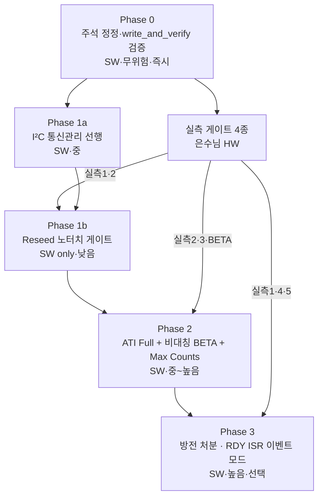

# 계획 — 터치센서 재검토 (Phase 0~3 전체 설계) · Rev.1

**TL;DR**: 누적 권고를 단일 구현 로드맵으로 통합. Phase 0(주석·검증, 즉시 무위험) → 실측 게이트(은수님 HW) → Phase 1(I²C 통신관리 + Reseed 노터치 게이트, SW only) → Phase 2(ATI Full + 비대칭 BETA + Max Counts) → Phase 3(방전 처분·이벤트 모드). 각 Phase는 빌드 가드/독립 롤백 가능, 실측 게이트 통과 순서로 ④ 단계 진행.

> [!IMPORTANT]
> 본 계획은 ③ 산출물 — **단계 ④ 코드 구현은 은수님 승인 후**. 실측 게이트 의존 단계(Phase 1 일부·2·3)는 은수님 하드웨어 작업 완료를 전제로 한다.
>
> **Rev.1 (2026-06-18)**: 은수님 retry-and-count 전략 8 페르소나 검증(분석.md §8) 결과 반영. 핵심 변경: ① **상위 갈림길 신설**(ATI Full 도입 vs FIXED 유지 — 실측5 선결), ② **실측 게이트 +3종**(실측5·6·7), ③ **Phase 1a 우선순위 역전**(ATI_Error 핸들러 최우선), ④ retry-and-count를 Phase 1a 최후 안전망으로 편입(보완 5종 조건).
>
> **Rev.2 (2026-06-18)**: 은수님 추가 입력(RDY 윈도우·스트리밍·FIXED LTA delta) `Workflow` 재검증(분석.md §9) 반영. 핵심 변경: ① **명제_J(FIXED LTA delta)는 정상 counts 범위서 유효하나 counts 포화 시 침묵 실패** → **실측_V2(Max Counts) FIXED 결정 선행 게이트 추가** + **Phase 0에 counts 포화 감지 stub 신설**, ② 통신 윈도우 비용 큼(read 1회=force 2회, 130ms) → **Event Mode 우선순위 격상**(실측_V3 전류 후 Phase 3 재검토), ③ Phase 1a 보완_3에 force 이중 타임아웃 반영.
>
> **Rev.3 (2026-06-19)**: Fixed+Auto-ATI 하이브리드 53에이전트 오케스트레이션(분석.md §10) 반영. **v3 최종 아키텍처·Phase −1~4 상세 계획·빌드가드 #error 9종·블로킹 목록은 [`에이전트-로그/v3/99_최종종합.md`](에이전트-로그/v3/99_최종종합.md)를 정본으로 채택** (본 계획의 Phase 0~3은 그 하위 구성으로 통합). 핵심 신규:
> - **🔴 Phase −1 (즉시 실행, 실측 불필요)**: 코드 확정 버그 2건 — ①`wait_re_ati_done()` WDT 갱신 0건(최악 ~2.3초 blocking WDT 리셋 위험) ②`re_ati_trigger()` MSB=0x00→CH_TIMEOUT(0x07) 소멸. + `tdc_touch_config.h` 빌드가드 define 일괄 추가.
> - **확정 아키텍처(수렴)**: 공장 절대기준 → 노터치 게이트 → 조건부 Re-ATI → 자기치유 → 크래들 race 소멸 (5층). 절전/부팅 baseline 통합.
> - **구현 전 블로킹 게이트**: A(noTouch counts 분포)·B(방전 효과)·D(Beta POR)·G(MCLR LTA 초기화)·J(ATI_SETUP_FULL DS)·L(boot_touch_ignore)·M(ATI중 I2C disabled) — 실측/확인 완료 전 Phase 1 착수 금지. **수치 기준값(MARGIN·COUNTS)은 실측 전 임의 설정 절대 금지(기본값 0 유지)**.

---

## 0-A. 상위 갈림길 — ATI Full 도입 vs FIXED 유지 (Rev.1 신설)

> [!WARNING]
> 8 페르소나 검증에서 **"FIXED 유지(현 상태)만으로 Sound1 현장에서 충분한가"가 미검증**임이 드러났다(분석.md §8 핵심 갈림길). FIXED 유지 시 auto-ATI가 없어 **I2C 블로킹·Phase 1a·retry-count 논의 전체가 불필요**해진다. 따라서 Phase 2(ATI Full) 진입 전에 **실측5(FIXED 환경 drift 실재성)**로 ATI Full 필요성 자체를 먼저 판정한다.
>
> - 실측5 = "FIXED로 충분" → Phase 2·1a 폐기, 뿌리 B는 Reseed 노터치 게이트(Phase 1b) + 드리프트 관찰로 한정.
> - 실측5 = "드리프트 실재, ATI Full 필요" → Phase 1a(I²C 관리) → Phase 2 진행.
>
> **Rev.2 보완**: FIXED 유지를 택해도 **counts 포화 시 침묵 실패**(터치해도 delta<threshold로 미인식, 분석.md §9 명제_J) 위험이 남는다. 따라서 **실측_V2(Max Counts 값·noTouch counts 마진)를 FIXED 결정 선행 게이트로 추가**하고, FIXED·ATI Full 어느 쪽이든 **Phase 0의 counts 포화 감지 stub를 공통 기반 전제**로 둔다. 즉 "FIXED 안전 선언"은 실측_V2 + 포화 감지 없이는 불완전.

---

## 0. 전체 로드맵·의존관계

| 단계 | 실측 의존 | 빌드 가드 | 독립 롤백 |
|---|---|---|---|
| Phase 0 | 없음 | 불요(무위험) | 가능 |
| Phase 1a (I²C 관리) | 없음 | 선택 | 가능 |
| Phase 1b (노터치 게이트) | 실측1·2 권장(없어도 안전) | `TDC_TOUCH_RESEED_NOTOUCH_GATE` | 가능 |
| Phase 2 | 실측2·3 + BETA 실측 필수 | `TDC_TOUCH_ATI_FULL` | 가능 |
| Phase 3 | 실측1·4·5 필수 | `TDC_TOUCH_EVENT_MODE` 등 | 가능 |

---

## 1. Phase 0 — 주석 정정 + write_and_verify 실검증 (즉시·무위험)

| 항목 | 위치 | 변경 |
|---|---|---|
| 롱터치 주석 | `touch.h:6` | "2.8초" → "2.4초(`LONG_TOUCH_MS=2400`)" |
| 폴링 주석 | `touch.c:334` | "100ms" → "200ms(`POLL_INTERVAL=200`)" |
| PACKAGE ATI 주석표 | `iqs323.c:640` | `0x5E`/`0xE4` → 실제 `0x5C`/`0xEF` |
| write_and_verify 실검증 | `iqs323.c:265~280` | read-back 값과 write 값 비교 추가, 불일치 시 false 반환 (또는 이름 변경) |
| **(Rev.2) counts 포화 감지 stub** | `read_status()` / `tdc_touch_process()` | noTouch Counts가 Max Counts 근접 시 `ci_printw` 경보. FIXED·ATI Full 공통 기반 — 명제_J 침묵 실패(분석.md §9) 조기 감지. 무위험(로그만) |

- 검증: 정적(빌드 가드 무관, 동작 동등) + 빌드 PASS(은수님). 회귀 위험 0.
- 커밋: `Docs/Fix(touch): IQS323 주석 불일치 정정 + write_and_verify 실검증`.

> [!NOTE]
> `write_and_verify` 실검증 추가는 동작 변경(이전엔 항상 true)이라 무위험은 아님 — read-back 불일치가 실제 발생하면 false 경로 진입. 안전하게 **로그 경고 우선**(값 불일치 시 `ci_printw`)으로 시작하고 false 반환은 별도 판단.

---

## 2. 실측 게이트 (은수님 하드웨어 — Phase 1b 이후 선행)

| ID | 실측 | 방법 | 결정 |
|---|---|---|---|
| 실측1 | 방전 물리 효력 | RTT로 `discharge_crx0()` 전후 `0x30`·CH0 Counts 캡처 | Phase3 방전 폐기 가부 |
| 실측2 | ATI Full I²C 무응답 | ATI Full 재활성 후 RDY 점유·통신 멈춤 재현 | Phase1a/2 설계 기준 |
| 실측3 | BETA 부호 세만틱 | `0xB1` 0→큰값 write 시 LTA 수렴 시간 RTT 측정 | Phase2 비대칭 BETA 값 |
| 실측4 | 오염 실채널 | 터치한 채 MCLR 부팅 후 LTA/Counts 1회 캡처 | Phase1b·2 착수 확정 |
| **실측5** | **FIXED 환경 drift 실재성** | FIXED 유지 상태로 장시간/온도변화 시 LTA·Counts가 ATI Band 이탈하는지 RTT 관찰 | **상위 갈림길(§0-A) — ATI Full 필요성 판정** |
| **실측6** | **t_ati 정량** | RTT로 ATI_Active(0x10 bit5) high 구간 측정 (POR auto-ATI vs 런타임 Re-ATI 구분) | retry-count K값 산정 |
| **실측7** | **ATI_Error 발생 빈도** | ATI Full 운용 중 ATI_Error(bit6) set 빈도 관찰 | ATI_Error 핸들러 필요성·복구주기 |
| **실측V2** | **Max Counts 값·noTouch 마진** (Rev.2) | 데이터시트 정밀 확인 또는 채널 차폐 후 포화 측정 → noTouch Counts가 Max Counts 대비 갖는 마진 | **FIXED 유지 결정 선행 게이트** — 포화 침묵 실패(명제_J) 현실성 |
| **실측V3** | **스트리밍/Event 전류 소모** (Rev.2) | NP 모드 + Report Rate=0 전류 프로브 → Event Mode 전환 전력 절감 정량 | Event Mode(Phase 3) 우선순위 재검토 |

> Phase 0·1b는 실측 전에도 안전 배포 가능(게이트는 어느 오염원이든 무해). **실측5·6은 Phase 1a 설계의 선행 게이트, 실측V2는 FIXED 유지 결정의 선행 게이트**, 실측은 Phase 2 착수의 필수 전제.

---

## 3. Phase 1a — I²C 통신관리 선행 (ATI Full 필수 선행) · Rev.1 재설계

- 전제: §0-A 실측5 = "ATI Full 필요" 판정 + 실측6(t_ati) 확보.
- 목적: ATI Full 재활성 시 재현되는 I²C 무응답·ATI_Error 영구먹통을 방어.
- **우선순위 (Rev.1 역전 — 분석.md §8 보완 5종)**:

| 순위 | 구현 | 위치/레지스터 | 근거 |
|---|---|---|---|
| **①** | **ATI_Error 전용 핸들러** | `0x10` bit6 → `(void) ati_error`(`touch.c:393`) 무시 제거 → 수동 Re-ATI(`0xC0` bit2 / `re_ati_trigger()`) 발행 | **영구먹통 경로 차단**(분석 §8). 이것 없으면 retry-count·폴링 모두 무력 |
| ② | **retry-and-count 안전망** | `tdc_touch.c` 카운터+분기 ~19줄 | 보완_2(READY 후 카운트)·보완_3(K=실측6 후 산정, 임시 7@200ms — **(Rev.2) read 1회=force 2회 이중 타임아웃 130ms 반영 + 실제 read 소요 RTT 측정**)·보완_4(실패 시 NOT_TOUCH 강제)·보완_5(3-상태 구분). **(Rev.2) 절전 클럭 강하 시 타임아웃 분기 검토(D-1)** |
| ③ | **ATI_Active 폴링** | `0x10` bit5 대기 루프(타임아웃) | 1차 방어 — ATI 진행을 통신실패와 명시 구분 |
| ④ | **I²C 타임아웃 복구** | write/read 래퍼(`iqs323.c:178~265`) | 무응답 N회 시 강제 복구 |

- 빌드 가드 `TDC_TOUCH_I2C_MGMT`. ①은 ATI Full 전제이나 현 FIXED에서도 무해(ati_error 무시 제거만).
- **결합 판단**: 06노드 "상보성 허위" 비판은 보완_1(①) 이행 시 무효화 — ATI_Active 폴링(③)+retry-count(②) 결합이 ~19줄 비용으로 최적.
- 검증: 정적 + 실측2·7 환경에서 ATI Full 켜고 무응답·영구먹통 미발생 확인.

> [!NOTE]
> 은수님 retry-and-count 평가: **조건부 채택**. 단순함(~19줄)은 실재하나 단독은 위험(통신실패↔ATI진행 미구분·POR burst 오판·영구먹통). 보완 5종 이행 후 Phase 1a 안전망으로 편입.

---

## 4. Phase 1b — Reseed 노터치 게이트 (SW only·최우선 효과)

- 목적: 뿌리 A(진입 baseline 오염) 해소.
- 구현(빌드 가드 `TDC_TOUCH_RESEED_NOTOUCH_GATE`):

| 위치 | 변경 |
|---|---|
| `iqs323.c:1146` (노말 RESEED) | `ch0_touch==0` 연속 N tick 확인 후에만 `0xC0 0x08` 발행. 미충족 시 defer. |
| `iqs323.c:955` (절전 RESEED) | 동일 게이트 적용 |
| timeout fallback | 상시 접촉 시 `INIT_TIMEOUT_MS`(2500ms 패턴) 후 강제 시딩 + `s_boot_baseline_dirty` set + 해제 순간 1회 recapture |
| `touch.c:46/323/352` | `s_boot_touch_ignore`를 "baseline 확정 게이트"로 승격(레이어2 사후 방어 유지) |

- 검증: 정적(게이트 로직·타임아웃 경로) + 실기(터치한 채 부팅 → 손 뗌 후 정상 인식, AC-1).
- 리스크 낮음: 어느 오염원이든 게이트 무해. 롤백 = 가드 OFF.

---

## 5. Phase 2 — ATI Full 복귀 + 비대칭 BETA + Max Counts

- 전제: Phase 1a(I²C 관리) 완료 + 실측2·3 통과.
- 구현(빌드 가드 `TDC_TOUCH_ATI_FULL`):

| 항목 | 위치 | 변경 |
|---|---|---|
| ATI Full | `iqs323.c:651`(`0x36`), `write_ati_compensation()` | 부팅 1회 ATI Mode=Full(010) 실행 → 완료 후 Disabled. FIXED 덮어쓰기 제거/조건화. 절전 경로 동일 |
| Re-ATI 차단 | 신규 | 터치 중 frozen + ATI Band Large + 수동 Re-ATI는 노터치 게이트 후만 |
| 비대칭 BETA | `apply_settings` 내 신규 write | `0xB1` 보수(NP LTA Beta) · `0xB2` 공격(Fast Beta) · `0xB4` Fast Filter Band(실측3 값). 웜부트마다 재write |
| Max Counts | `0x61` 인접 Prox Control | RTT noTouch counts 최대 실측 → 4095 근접 시 16383 조정 |

- 검증: 정적 + 실기(다회 터치 감도 유지 AC-2, I²C 무응답 없음 AC-3, 절전 동작 AC-5).
- 리스크 중~높음: I²C 무응답 회귀. → Phase 1a 선행 + 가드로 격리. 롤백 = 가드 OFF(현 FIXED 복귀).

---

## 6. Phase 3 — 방전 처분 + 이벤트 모드 (선택·실측 필수)

- 전제: 실측1(방전 효력)·4·5 통과.
- 방전: VSS 방전 확인 시 ESD 실측 후 결정 / Linearise flip(효력 없음) 확인 시 `discharge_crx0` 제거.
- 이벤트 모드(선택, `ci_dio.c:121` 템플릿): RDY falling-edge ISR + DIO16 power button semantics 통합. ULP wake-source 실측 필요.
- 리스크 높음: 실측 없이 방전 폐기 시 ESD 공백. 롤백 = 가드 OFF.

> [!IMPORTANT]
> **(Rev.2) Event Mode 우선순위 격상 검토**: 분석.md §9 명제_G — 현 폴링 구조는 `read_register` 1회마다 `force_window_open` 2회(최악 130ms)의 통신 비용이 구조적으로 발생한다. **Event Mode + falling-edge 인터럽트 전환 시 이 비용이 0**이 되며(DS §8.11.2 제품 권장 구조), 통신 지연·retry-count K값 부담·절전 전류까지 동시 개선된다. 따라서 Event Mode는 단순 "선택" 항목이 아니라 **통신 비용·전력의 근본 해법**으로, 실측_V3(전류 정량) 후 Phase 우선순위를 재검토한다(Phase 3 → 상위 이동 가능).

---

## 7. 단계별 검증·커밋 전략

- 각 Phase는 **독립 feature 작업** — `claude_feature_touch-review-phaseN`, 단계별 커밋 → 은수님 빌드·실기 검증 → 머지(`--no-ff`, 승인 후).
- 단계_4 검증: 정적 fan-out(코드 정합·레지스터 비트·회귀·스타일) 전수 PASS까지 루프(상한 3회). 실기 검증은 은수님.
- 빌드 가드로 각 Phase 격리 → 문제 시 가드 OFF로 즉시 롤백, 이전 Phase 무영향.
- 산출물: 본 작업 폴더에 Phase별 진행을 이력 및 결과.md 시계열로 기록.

---

## 8. 미해결·승인 필요 사항

- 본 계획 전체 승인 후 **Phase 0부터 ④ 착수** (실측 비의존, 즉시 가능).
- Phase 1b 이후는 은수님 실측 게이트 결과 입력 후 진행.
- BETA 비대칭 구체값·Max Counts 조정값은 실측3 데이터 확보 후 계획에 보강(Rev.1).
