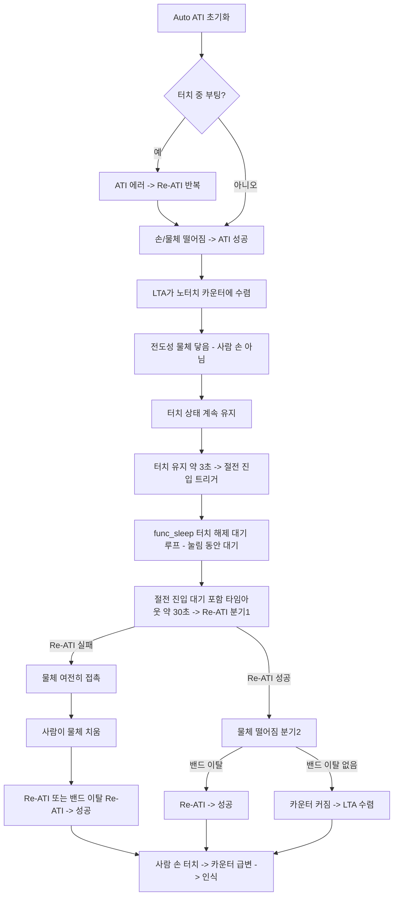

# 브레인스토밍 — Full ATI 타임아웃 단순안

**TL;DR**: v3의 공장 캘리브레이션(보드별 절대 노터치 기준 저장)이 과하다는 문제의식에서, 은수님이 **Full ATI + CH 타임아웃 + 메인루프 ATI 에러 폴링 Re-ATI + Beta/halt 튜닝 + human-in-the-loop** 단순안을 제시. 시나리오 검증 결과 **단순안이 v3 공장 캘리보다 우수**하다는 평가. 핵심 게임체인저는 "펌웨어가 ATI 에러를 100ms 주기로 능동 폴링해 즉시 Re-ATI" — 타임아웃 자동복구의 지연 먹통을 사실상 제거한다. 남는 급소는 **터치 중 Re-ATI 경계**(정상 터치를 노터치로 흡수) 1개로 좁혀지며, v3에서 살릴 것은 "터치 중 Re-ATI 보류 게이트 + MCLR 포화 안전망" 둘뿐. **데이터시트 검증 결과(§6)**: 타임아웃은 30초 설정 가능하나, IC Channel Timeout은 ① 동작이 Reseed(Re-ATI 아님) ② ULP 모드와 공존 불가 ③ 발생 전용 이벤트 비트 없음 — 따라서 **IC 타임아웃 대신 펌웨어 SW 타임아웃(Touch 지속 카운트 → 수동 Reseed)이 유리**(ULP 유지·관측 가능).

---

## 1. 배경 — 왜 단순안인가

- v3 수렴 아키텍처는 **공장 캘리브레이션으로 노터치 절대 기준을 저장**하고, 그 기준으로 "지금 터치인가"를 즉시 판별하는 구조(5층 방어).
- 문제의식: 공장 캘리는 **보드별 절대값 측정·저장·관리 부담**이 크고, 실측 의존이 높다.
- 은수님 대안: 절대 기준 없이 **Full ATI(자동 Re-ATI 활성) + 타임아웃 + 사람 개입**으로 stuck 상태를 사후 복구한다. 전제는 **Full ATI 설정**.

## 2. 은수님 시나리오 (전도성 물체 장기 오접촉)



**시나리오의 숨은 복구 메커니즘 = human-in-the-loop**: 안 되면 사람이 "왜 안 되지?" 하고 물체를 치우거나 손을 떼본다 → 그 순간 Re-ATI 성공.

### 2-1. 절전 시퀀스 맞물림 (코드 근거)

이 시나리오는 절전 진입 시퀀스와 맞물린다 (`main.c`):

- 정상 모드에서 터치를 약 3초 유지하면 **절전 진입 트리거**(`func_sleep`).
- **`func_sleep` 첫 단계 = 터치 해제 대기 루프** (`main.c:877~882`):
  ```c
  while (tdc_drv_iqs323_read_status(&pressed, &ati_error) && pressed) {
      /* WAIT TOUCH RELEASE */ SYS_WATCHDOG_REFRESH(); delay_ms(100);
  }
  ```
  눌림(`pressed`)이 유지되는 동안 100ms마다 대기하며 **워치독을 refresh**한다 → WDT 리셋도 안 걸린다.
- 따라서 **전도성 물체가 안 떨어지면 이 대기 루프에서 막혀 절전 루프(ULP)로 진입하지 못한다.** 은수님 지적대로 "**터치 해제가 한 번 인식돼야** 절전 루프로 들어간다".

**함의 (단순안 추가 논거)**:
- 이 대기 구간에서 **CH 타임아웃(약 30초)이 발동해 Re-ATI** → 물체를 노터치로 흡수 → `pressed=false` → 대기 탈출 → 절전 진입. 즉 **타임아웃이 이 "절전 진입 대기 먹통"까지 자가복구**한다.
- 반면 **현재 타임아웃 비활성(v3)이면**: 이 대기 루프가 LTA가 물체를 흡수할 때까지(ATI Disabled + 느린 Beta면 매우 오래) 지속 → **잠재 영구 대기 = 먹통**. Full ATI + 타임아웃 활성이 이 구멍을 메운다.
- 절전 루프(ULP) 진입 후에는 터치를 `ULP_LONG_TOUCH_MS`(2200ms) 연속 감지 시 칩 리셋(재부팅=절전 복귀)으로 이어진다 (`main.c:997~1001`).

## 3. 반박별 평가 (제기된 5개 우려 → 재평가)

| # | 은수님 반박 | 평가 | 핵심 |
|---|---|---|---|
| 1 | ATI 실패 시 성공까지 반복 + 사람이 물체/손 치움 | **타당 ✅** | human-in-the-loop가 강력한 복구. "30초 자동 먹통"은 자동복구만 가정한 오판이었음. 먹통 시간 = 사용자 인지 시간. 예외=counts 포화(큰 물체) |
| 2 | 카운터 수렴하면 해결 + Beta 빠르게 | **개념 맞음, Beta 양날 ⚠️** | 결국 손 떼면 밴드 이탈→Re-ATI→정상. 단 Beta 너무 빠르면 유지/약한 터치도 LTA가 흡수 → delta 소멸. **halt(터치 중 LTA 동결)와 한 쌍**이어야 안전 |
| 3 | 롱터치 없음 + timeout 1분 조정 | **타당, 범위 확인 🔍** | 의도적 30초+ 입력 없으면 무효화 문제 소멸. timeout 최대 범위(1분 가부)는 데이터시트 확인. 길수록 stuck 자동복구 늦음(단 4번이 보완) |
| 4 | 메인루프서 ATI 에러 폴링 → 즉시 Re-ATI 반복 | **가장 강력 ✅✅** | timeout(수십초)을 안 기다리고 100ms 주기로 즉시 Re-ATI → 지연 먹통 사실상 제거. **timeout은 백업으로만 남음** |
| 5 | Beta로 노터치 빠른 수렴 = 해결 | **2번과 동일, halt 조합이면 합리적 ⚠️** | 명확한 터치는 halt 보호, 애매한 물체·드리프트는 빠르게 흡수. 단 halt 임계 아래 약한 터치는 흡수돼 미탐 |

### 4번이 게임체인저인 이유

펌웨어가 **ATI Error 비트를 능동 폴링**해 즉시 Re-ATI를 치면, IC 자동 타임아웃(수십 초)에 의존할 필요가 없다. 지연 구간이 메인루프 주기(100ms) 수준으로 축소된다. 단 **2개 경계가 생명**:

- **"ATI 에러일 때만" Re-ATI** — "터치 중일 때" Re-ATI는 정상 손 터치를 노터치로 학습해 죽인다. ATI Error 비트와 Touch 비트를 구분해 트리거.
- **I2C 읽기 에러 ≠ ATI 에러** — 통신 실패면 Re-ATI 명령도 못 보낸다. 읽기 에러는 재통신/리셋, ATI 에러는 Re-ATI로 경로 분기.

## 4. 종합 평가 — 단순안이 v3보다 우수

**결론: 은수님 단순안이 v3 공장 캘리브레이션보다 우수하다.** 핵심 통찰 = "사람이 루프 안에 있고 + 펌웨어가 ATI 에러를 능동 폴링하면, 복잡한 절대 기준 없이도 대부분의 stuck이 풀린다." 공장 캘리(보드별 절대값 저장·관리)는 과하다.

**단 v3에서 살릴 가치가 있는 2가지** (공장 캘리 없이도 구현 가능):

| 살릴 요소 | 이유 |
|---|---|
| **터치 판정 중 Re-ATI 보류 게이트** | 4번 리스크(정상 터치 흡수) 방어의 최소 장치. Full ATI는 IC가 터치 중에도 밴드 이탈 시 자동 Re-ATI를 칠 수 있어, 이 경계가 단순안의 진짜 급소 |
| **MCLR 포화 안전망** | counts 포화(큰 물체)는 timeout·재시도로 못 풀어 유일한 회복 경로 |

## 5. 남는 리스크 (3개로 수렴)

| 리스크 | 내용 | 대응 |
|---|---|---|
| **A. 터치 중 Re-ATI** | Full ATI가 정상 터치를 노터치로 흡수 (최대 급소) | "ATI 에러 때만" 트리거 + 터치 중 보류 게이트 |
| **B. counts 포화** | 큰 물체 → Re-ATI 실패 + conversion 정지 | MCLR 안전망 유지 |
| **C. Beta 양날** | 빠르면 약한/유지 터치 미탐, 느리면 드리프트 추종 지연 | Beta·halt·임계 동시 튜닝(실측) |

## 6. 타임아웃 실현가능성 — 데이터시트 검증 (2026-06-19)

> 근거: 데이터시트 §5.8 Channel Timeouts, A.31 Event Timeouts(0xD2), A.2 System Status(0x10), A.30 System Control / CH_TIMEOUT_DISABLE(0xC4). 현 펌웨어 `tdc_drv_iqs323.c`.

| 은수님 질문 | 답 | 근거 |
|---|---|---|
| 30초 가능? | **✅ 가능** — Event Timeout = value×512ms. Touch=bits[15:8] 8비트 → 0~255 → **0~130.56초**. 30초 = value 59(=30.2초). 1분(118)도 가능 | A.31(0xD2) |
| 설정 가능? | **✅ 가능** — 0xD2 Event Timeouts에 Touch timeout value write + 0xC4 상위 **CH0 Timeout Disable(bit8)=0**. 현재는 의도적으로 비활성(=1) | A.30·A.31 |
| Full ATI에서? | **✅ ATI Mode와 독립**. 단 **timeout 동작 = Reseed**(Re-ATI 아님) — 아래 함의 A | §5.8 |
| 발생 인지 가능? | **⚠️ 전용 이벤트 비트 없음** — System Status(0x10)에 reseed/timeout event 없음. Touch bit clear로 Touch Event(bit1) 간접 감지, 단 **정상 손뗌과 구분 불가** | A.2 |
| ULP 공존? | **🔴 불가** — Channel Timeout 사용 시 ULP 모드 금지(Automatic No ULP 강제) — 아래 함의 B | §5.8 각주 |

### 함의 A — timeout 동작은 Re-ATI가 아니라 Reseed 🔧

시나리오(§2 다이어그램)는 "타임아웃 → Re-ATI"를 가정했으나, **데이터시트 §5.8 실제 동작**은:
1. **Reseed** — LTA를 현재 counts로 기록(물체를 노터치 기준으로 재정의)
2. **Touch/Prox 상태 강제 clear**

→ **게인(MULT/COMP) 재보정은 없음.** stuck 해제 목적(물체 노터치화 + 상태 clear)은 Reseed로 달성되지만, 게인 왜곡까지 고치려면 Reseed 후 **ATI Band 이탈로 인한 자동 Re-ATI**(Full ATI 시) 또는 수동 Re-ATI가 추가로 필요. **시나리오의 "Re-ATI" 노드는 "Reseed(+조건부 Re-ATI)"로 정정**해야 정확하다.

### 함의 B — Channel Timeout과 ULP는 공존 불가 🔴

데이터시트 §5.8 각주가 "채널 prox/touch timeout 사용 시 **ULP 모드 금지**, Automatic No ULP"를 명시한다.
- 현 Sound1 절전이 IQS323을 ULP로 운용한다면, **IC Channel Timeout을 켜는 순간 ULP 포기(LP까지만) → 절전 소비 전류 증가**.
- (현 IC Power Mode 설정은 [확인 필요] — 코드에 System Control Power Mode write가 없어 기본값 추정)
- **단순안의 핵심 트레이드오프**: IC 타임아웃 자가복구 ↔ ULP 최저전력이 배타적. 절전 전력 예산이 LP를 허용하는지가 갈림.

### 결론 — IC 타임아웃보다 SW 타임아웃이 유리 ✅

전용 이벤트 비트가 없고(인지 불가) + ULP와 충돌하는 IC Channel Timeout 대신, **펌웨어가 직접 Touch 지속시간을 카운트해 자체 타임아웃 판정 → 수동 Reseed(또는 조건부 Re-ATI) 트리거**하는 SW watchdog 방식이 더 낫다:
- **관측 가능** — 펌웨어가 timeout 판정 시점을 직접 알고 로깅 가능(IC는 silent)
- **ULP 충돌 우회** — IC Channel Timeout 미사용이므로 ULP 유지 가능
- **§2-1 메인루프 폴링·은수님 질문 4번과 동일 계열** — 이미 ULP 루프(`main.c:967~`)에서 터치 샘플링 중이라 Touch 지속 카운트 추가가 자연스러움
- 단 절전 진입 대기 루프(`func_sleep` 877행)에도 동일 SW 타임아웃을 넣어야 그 구간 먹통(§2-1)까지 커버

### 잔여 미확인 (실측·추가 조회)

1. 현 IQS323 IC Power Mode 설정값(ULP 운용 여부) — 코드/실측 확인
2. **Beta + halt 상호작용** — 터치 판정 중 LTA halt 조건, halt 해제 타임아웃
3. Reseed 후 ATI Band 이탈 자동 Re-ATI의 실제 발동 조건(Full ATI)

## 7. 제안 단계 (정식 검증 시)

- 이 단순안("Full ATI + 메인루프 ATI에러 폴링 + Beta/halt 튜닝 + timeout 백업 + 터치중 보류 + MCLR 안전망")을 v3 대안으로 정식 분석·검증.
- 우선 검증 대상: **급소 리스크 A(터치 중 Re-ATI 경계)** + §6 잔여 미확인(IC Power Mode 설정·Beta/halt·Reseed 후 자동 Re-ATI)을 adversarial로 확정.
- **설계 방향 갱신(§6 검증 반영)**: IC Channel Timeout(ULP 충돌·인지 불가) 대신 **SW 타임아웃(Touch 지속 카운트 → 수동 Reseed/조건부 Re-ATI)**을 1순위로. ULP 유지 + 관측 가능.
- 외부 자료 근거: [`참고/touch/적용가이드/IQS323-제어운영-적용가이드.md`](../../../참고/touch/적용가이드/IQS323-제어운영-적용가이드.md) §2.3(ATI 실패 처리)·§3(LTA·halt·Reseed)·§9(체크리스트).
