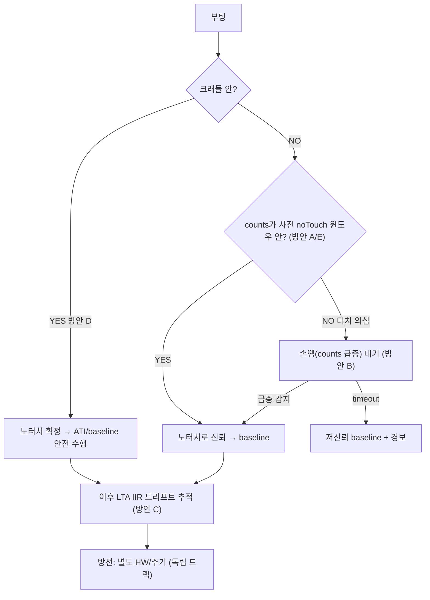

# 브레인스토밍 — 부팅 시 터치 모호성 문제와 해결방안

**TL;DR**: 근본 문제는 **"전원 ON 시점에 그 보드의 noTouch 기준을 알 방법이 없다"**(Cold-Start Touch Ambiguity)는 것이다. 미지수가 ① 보드 절대 noTouch counts ② 현재 터치 여부 — 둘인데 부팅 시 둘 다 모른다(방정식 1개·미지수 2개 = 불능). 해결은 미지수 하나를 외부에서 고정하는 것뿐이다: 미지수①→사전 캘리브레이션(절대 기준), 미지수②→부팅 환경 보장(크래들). 방전(ESD)은 이와 독립이라 별도 HW/주기 방전이 필요하다. 본 문서는 5개 방안을 발산·비교한다.

> [!NOTE]
> 본 문서는 은수님 브레인스토밍을 정리한 것으로, 일부는 기술 타당성 **[확정 필요]**·추론 **[추정]**을 표기했다. 개념 기반은 [`개념정리_터치동작모델.md`](개념정리_터치동작모델.md) 참조.

---

## 1. 문제 정의 — Cold-Start Touch Ambiguity

전원 ON 시점, 펌웨어는 현재 counts 값 하나만 본다. 그런데 그 값이:
- **그 보드의 정상 noTouch counts**인지 (보드별 정전용량 편차로 절대값이 다름)
- **터치 때문에 변한 값**인지

를 구분할 **절대 기준이 없다.** 현 두 방식 모두 "현재 = noTouch"라는 암묵 가정에 의존한다:

| 방식 | 첫 기준 잡는 법 | 터치 중 부팅 시 |
|---|---|---|
| **RESEED/LTA** (현 Fixed) | LTA ← 현재 counts | LTA가 터치 counts로 오염 → 손 떼도 미인식 (뿌리 A) |
| **auto-ATI** | MULT/COMP를 현재 정전용량 기준 선점 | 게인이 터치 기준으로 왜곡 + ATI_Error 가능 |

### 닭-달걀 구조


### 은수님이 짚은 추가 난점

1. **"터치됐는지 어떻게 아는가"** — 절대 기준이 없으니 현재 counts가 터치인지 noTouch인지 판별 불가.
2. **"살짝 옆으로 밀린 애매한 터치"** — 부분 접촉은 counts가 중간값 → 절대 기준이 있어도 모호.
3. **"손 뗌을 어떻게 아는가"** — 터치 해제 후 Re-ATI 한다 쳐도, 해제 시점을 알아야 함.

---

## 2. 왜 어려운가 — 미지수 2개, 방정식 1개

$$\text{관측: Counts}_{now} = f(\underbrace{\text{보드 noTouch 기준}}_{\text{미지수 ①}},\ \underbrace{\text{터치량}}_{\text{미지수 ②}})$$

부팅 시 둘 다 모름 → **불능**. 푸는 유일한 길은 **미지수 하나를 외부에서 고정**:

| 고정 대상 | 방법 | 대응 방안 |
|---|---|---|
| 미지수 ① (보드 기준) | 사전 캘리브레이션(공장 측정·EEPROM 저장) | 방안 A·C·E |
| 미지수 ② (터치 여부) | 부팅 환경 보장(크래들=손 안 댐) 또는 손뗌 감지 | 방안 B·D |

---

## 3. 해결방안 발산 (5안)

### 방안 A — 사전 절대 캘리브레이션 (은수님 제안)

MULT/COMP를 고정값으로 두고, **공장에서 그 보드의 noTouch counts(타겟)를 측정해 EEPROM에 저장**. 부팅 시 RESEED/LTA 없이 현재 counts를 그 절대 타겟과 직접 비교:

$$\text{터치} \iff \text{Counts}_{now} < (\text{타겟}_{저장} - \text{Threshold})$$

- ✅ 부팅 터치 판별 가능 (절대 기준 보유) · baseline 오염 없음 · 보드 편차 해결(개별 캘리브레이션)
- ❌ **환경 드리프트 미추적** (온도/습도로 noTouch 변하면 고정 타겟이 틀려짐) · 보드별 캘리브레이션 공정 필요 · 방전 문제 별개

### 방안 B — 손 뗌 이벤트 감지 (counts 점프)

부팅 후 counts를 모니터링. 터치 해제 순간 = **counts 급상승**(self-cap: 손 떼면 정전용량↓ → counts↑). 급증 이벤트 감지 후 안정값을 noTouch baseline으로 확정.

- ✅ 캘리브레이션 불요 · 손 뗌 시점 명확히 포착
- ❌ 부팅 후 **손 안 떼면 영영 baseline 못 잡음** (timeout fallback 필수) · 애매한 부분 터치는 점프가 작아 감지 어려움

### 방안 C — 하이브리드 (절대 윈도우 + LTA 드리프트)

방안 A의 절대 타겟을 **"유효 범위 윈도우"**로만 사용(타겟 ± 허용범위 안이면 noTouch로 신뢰) → 부팅 판별. 안정 후 **LTA IIR로 전환**해 환경 드리프트를 흡수.

- ✅ A의 부팅 판별 + LTA의 드리프트 추적 결합 (A의 최대 약점 보완)
- ❌ 복잡도 · 캘리브레이션 여전 필요

### 방안 D — 부팅 환경 보장 (크래들 = 노터치)

**충전 크래들에 있을 때만** baseline/ATI 수행. 크래들 = 손 안 댐 보장 → 미지수 ②(터치 여부)를 noTouch로 확정. Sound1은 이미 **크래들 뚜껑 감지(BLE 0x34)** 기능 보유([`LED/20260615_cradle-lid-detection`](../LED/20260615_cradle-lid-detection/)).

- ✅ 미지수 ② 제거 (크래들이면 noTouch 확정) · 가장 견고 · 추가 캘리브레이션 불요
- ❌ **크래들 밖 콜드 부팅엔 무력** (크래들 없이 켜면 다시 모호) · 크래들 신호 의존

### 방안 E — 통계적 안정화 + 절대 윈도우

부팅 후 N초간 counts 분포 관찰. **분산이 작고(안정) + 절대값이 사전 noTouch 윈도우 안**이면 noTouch 확정 baseline. 터치 중이면 분산/절대값으로 배제 → 손 뗄 때까지 대기.

- ✅ 캘리브레이션 윈도우 + 통계로 견고 · 손뗌 감지(B) 자연 포함
- ❌ 부팅 지연 · **정지된 애매 터치**(분산 작은 부분 접촉)는 여전 모호

---

## 4. 비교표

| 방안 | 부팅 터치 판별 | 환경 드리프트 | 보드 편차 | 애매 부분터치 | 캘리브레이션 | 방전 문제 | 복잡도 |
|---|---|---|---|---|---|---|---|
| A 절대 기준 | ✅ | ❌ | ✅ | △ | 필요 | 별개 | 낮음 |
| B 손뗌 감지 | △(손 떼야) | ✅(LTA 병용) | ✅(LTA) | ❌ | 불요 | 별개 | 낮음 |
| C 하이브리드 | ✅ | ✅ | ✅ | △ | 필요 | 별개 | 높음 |
| D 크래들 | ✅(크래들시) | ✅(LTA 병용) | ✅ | ✅(크래들=노터치) | 불요 | 별개 | 중간 |
| E 통계+윈도우 | ✅ | △ | ✅ | ❌ | 필요(윈도우) | 별개 | 중간 |

---

## 5. 핵심 통찰

1. **은수님 제안(방안 A 절대 기준)이 부팅 모호성의 정공법** — 미지수 ①을 사전 고정해 닭-달걀을 끊는다.
2. **단 순수 A는 환경 드리프트에 약하다** → C(하이브리드: 절대 윈도우로 부팅 판별 후 LTA로 드리프트 흡수)나 D(크래들)와 결합해야 완성된다.
3. **"애매한 부분 터치"는 어떤 방법으로도 100% 해결 불가** — 물리적으로 중간 신호라 본질적 모호. 절대 윈도우 + 손뗌 감지 + timeout으로 **확률적 완화**가 한계.
4. **방전(ESD/전하 누적)은 baseline 방법과 완전히 독립** — SW로 기준을 아무리 잘 잡아도 물리 전하는 남는다. 모든 방안에 **별도 HW 블리더(전극 GND 1~10MΩ) 또는 주기 방전**이 잔존 과제(j3-charge·discharge 작업 참조).

---

## 6. 잠정 권고 (브레인스토밍 결론)



- **부팅 모호성**: D(크래들 노터치 보장) → A/E(절대 윈도우) → B(손뗌 fallback) → C(LTA 드리프트) 다층 조합.
- **방전**: 별도 트랙 (HW 블리더 or 주기 방전, 실측1 후 결정).

---

## 6-A. 은수님 공장 캘리브레이션 구체안 — 평가

### 제안 흐름

1. **공장초기화(노터치 보장) 시 auto-ATI 1회** → 그 보드의 MULT/COMP 산출
2. **MULT/COMP + noTouch counts(타겟)를 EEPROM 저장**
3. 이후 매 부팅: 저장 MULT/COMP를 **Fixed로 기록**(런타임 auto-ATI 안 함)
4. **RESEED 없이** 현재 counts vs 저장 타겟 직접 비교로 터치 판정
5. 주기적 방전

### 평가 — 핵심 두 문제는 해결된다

| 문제 | 해결? | 이유 |
|---|---|---|
| 보드 편차 | **✅** | 보드별 공장 캘리브레이션(MULT/COMP+타겟 개별 저장) |
| 터치 상태 부팅 | **✅** | 저장 절대 기준 보유 → 부팅 터치여도 판정 가능, **RESEED 오염 원천 제거** |
| auto-ATI 게인 왜곡 | **✅** | 런타임 auto-ATI 안 함(저장값 Fixed) → ATI_Error 영구먹통 경로도 소멸 |
| ESD 방전 | △ | 주기 방전으로 별도 처리(HW 권장) |
| **환경 드리프트** | **❌** | **LTA/RESEED를 제거하면 고정 타겟이 온도·경년 변화를 못 따라감** |

**기술 가능성**: 기존 [`ati-calib-mode`](../touch/20260604_ati-calib-mode/) 작업이 "auto-ATI → MULT/COMP 읽기"를 **이미 구현**했으므로 전제는 충족된다(EEPROM 저장·로드 경로만 신규). 공장초기화 과정도 Sound1에 존재(팩토리 리셋 LED 버전).

### 유일한 약점 — 환경 드리프트 (수치 예시)

LTA를 완전히 버리면, 공장값(고정)이 환경 변화를 추적하지 못한다:

- 공장 noTouch = 400, threshold = 30 가정
- 6개월 후 온도로 실제 noTouch = 360 → **노터치인데** delta = 400−360 = 40 > 30 → **false touch** (터치 안 했는데 터치로 오인)
- 반대로 noTouch = 440 → 터치 시 delta 부족 → **둔감**(터치해도 미인식)

### 개선 — "공장값을 RESEED 노터치 게이트 *기준*으로" (드리프트까지 잡힌다)

> [!WARNING]
> **RESEED는 "현재 counts로만" LTA를 seed한다(§5.5.1). 임의값(공장값)으로 LTA를 직접 set하는 것은 불가능하다.** 따라서 "LTA 초기값을 공장값으로"는 그대로는 안 된다. 대신 공장값을 **LTA 값**이 아니라 **"RESEED를 허용할지 판별하는 절대 기준"** 으로 쓴다.

RESEED 자체는 현재 counts로 하되, **언제 RESEED할지를 공장값으로 게이트**한다:

```
부팅 → 공장 MULT/COMP 적용 → 현재 counts 읽기
  ├─ 현재 counts ∈ [공장값 − 허용, 공장값 + 허용]  (노터치로 판단)
  │     → RESEED 실행 (LTA ← 현재 counts ≈ 공장값) ✅
  └─ 현재 counts ≪ 공장값  (터치 의심: counts가 비정상적으로 낮음)
        → RESEED 보류 → counts가 공장값 근처로 회복(손 뗌)할 때까지 대기
        → 회복 시 RESEED ✅  (timeout 시 저신뢰 폴백)
```

- **부팅 터치**: 현재 counts가 공장값보다 크게 낮음 → 터치로 판별 → **RESEED 보류**(오염 방지) ✅
- **부팅 노터치**: 현재 counts ≈ 공장값 → 즉시 RESEED ✅
- **이후**: RESEED된 LTA를 IIR이 드리프트 추적 → 환경 변화 흡수 ✅

핵심은 **공장값이 "지금 터치 중인가"를 판별하는 절대 잣대를 제공**한다는 것이다. 기존 노터치 게이트(방안 B/E)는 "counts 안정/급증"만 봤지만, **절대 기준이 없어 부팅 즉시 노터치 여부를 단정 못 했다.** 공장값이 그 빈칸을 채운다.

| | 은수님 원안 (LTA 제거·절대비교) | 개선 (공장값=RESEED 게이트 기준) |
|---|---|---|
| 보드 편차 | ✅ | ✅ |
| 터치 부팅 | ✅ | ✅ |
| **환경 드리프트** | ❌ | **✅** (RESEED 후 LTA IIR) |
| LTA 직접 write 필요 | 해당 없음 | **불요** (RESEED는 현재 counts로) |
| 복잡도 | 낮음 | 낮음~중간 |

> [!IMPORTANT]
> 정리: **"공장 캘리브레이션(절대 기준) → 그 기준으로 RESEED 노터치 게이트 → RESEED 후 LTA IIR 드리프트 추적"**. 이것이 RESEED 제약(현재 counts만) 안에서 부팅 모호성·보드 편차·드리프트를 모두 잡는 구현이다. = `control-redesign` "노터치 게이트" + 공장 절대 기준의 결합.

### 방전은 여전히 별도

은수님 말씀대로 이 방식에서도 **방전 문제는 독립적으로 남는다**. 주기적 방전(현 `discharge_crx0`) 또는 HW 블리더로 별도 처리하되, `0x30` write의 물리 효력은 실측1로 먼저 확인해야 한다.

---

## 6-B. RESEED vs Re-ATI, 그리고 게이트 race의 한계 (은수님 지적)

### (1) 노터치 게이트 하에선 RESEED보다 Re-ATI가 낫다

> 은수님: "그렇게 노터치를 판단할 거였으면, auto-ATI를 활성화시키는 게 낫지."

**맞다.** 노터치 판별 메커니즘이 어차피 필요하다면, 그 시점에:

| | RESEED만 | Re-ATI |
|---|---|---|
| 갱신 대상 | LTA(baseline)만 | **MULT/COMP(게인) + baseline 전부** |
| 환경 변화 시 게인 | 공장 시점 고정 (부적합 가능) | **그 시점 환경에 재보정** |
| 보드/온도 적응 | LTA만 | **전 범위** |

즉 게인까지 그 순간 환경에 맞추는 **Re-ATI가 우월**하다. 따라서 은수님의 "공장값 게이트 + Re-ATI" 결론은 **`control-redesign` 만장일치 권고("ATI Full 복귀 + 노터치 게이트")로 정확히 수렴**한다. 한 바퀴 돌아 같은 답에 도달한 것이며, 공장 캘리브레이션은 그 게이트에 **절대 판별 기준**을 더해 더 견고하게 만든다.

### (2) 게이트 race — 제거 불가, 그러나 치명적이지 않다

> 은수님: "카운트가 윈도우 범위다 → 리시드(or ATI)하려 한다 → 그 사이 터치가 발생한다. 이 경우를 벗어날 수 없잖아."

**맞다. "노터치 판별 ~ 실행" 사이의 race는 어떤 SW로도 100% 제거 불가능하다.** 그러나 치명도는 낮출 수 있다:

| 완화 장치 | 효과 |
|---|---|
| **저확률** | 판별~실행 간격은 μs~수 ms. 사람이 *바로 그 순간* 터치를 시작할 확률은 극히 낮다 [추정] |
| **자기 치유** | race로 터치 상태가 캡처돼도, 손 떼면 counts가 윈도우 밖(위)으로 → 재게이트 또는 LTA IIR 추적으로 복구. **영구 먹통이 아니라 일시 오류** |
| **사후 검증·재시도** | RESEED/ATI 실행 *직후* counts가 정상 범위인지 재확인 → 벗어나면 재시도 (race를 사후 검출) |
| **크래들 부팅** (방안 D) | 크래들에 있으면 손 안 댐 → **race 자체가 거의 소멸** |

### (3) 핵심 — 완벽한 해는 원래 없다

> **모든 capacitive touch 시스템은 cold-start baseline race를 본질적으로 가진다.** 목표는 race "제거"(불가능)가 아니라 **"확률 최소화 + 자기 치유 + 빠른 복구"**다.

은수님이 "벗어날 수 없다"고 느끼신 건 정확하다 — 단, 그건 **완벽을 추구할 때만 막다른 길**이다. 현실적 목표를 "충분히 견고"로 두면 다층 방어로 도달 가능하다:

```
크래들 부팅(race 소멸) → 공장값 게이트(노터치 절대 판별)
  → Re-ATI(게인+baseline 재보정) → 사후 검증·재시도
  → 그래도 뚫리면 자기 치유(손 뗌 시 복구)
```

각 층이 race 확률을 곱셈으로 줄인다. 어느 한 층도 100%는 아니지만, **합치면 실사용에서 무시 가능한 수준**으로 수렴한다.

---

## 7. 미해결 / 확정 필요

| 항목 | 왜 필요 | 확정 방법 |
|---|---|---|
| IQS323 raw counts 절대값 안정 readout 가능성 | 방안 A/E 캘리브레이션 전제 | 데이터시트 + RTT 실측 |
| 크래들 감지 신호의 부팅 시점 가용성 | 방안 D 전제 | 코드(BLE 0x34) + 시퀀스 확인 |
| 환경 드리프트로 noTouch counts 변동 폭 | 절대 윈도우 허용범위 설정 | 실측5(장기 관찰) |
| 애매 부분터치 실제 빈도·counts 분포 | 방안 한계 영향 평가 | RTT 실측 |
| 방전 물리 효력 | 방전 트랙 설계 | 실측1 |
