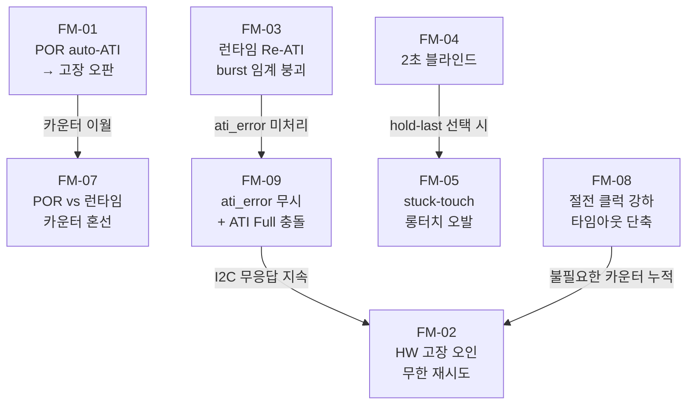

# 07 adversarial 반증가 — 실패 모드 전체 목록 (명제_F)

> **TL;DR**: 은수님 retry-and-count 전략과 ATI_Active 결합안에는 6대 실패 모드 계열이 존재한다. 가장 심각한 3개는 ①POR auto-ATI 정상 burst를 센서 고장으로 오판(임계 붕괴), ②진짜 하드웨어 고장을 auto-ATI로 오인한 무한 재시도(탈출 불가), ③2초 블라인드 중 롱터치 91% 소멸(응답성 파국). 나머지 3개 계열(stale 데이터 오해석·POR vs 런타임 카운터 혼선·절전 경로 교란)도 각각 medium~high 심각도다. 모든 실패 모드는 근거 라인과 함께 완화책을 명시한다.

> [!IMPORTANT]
> 아래 분석은 **ATI Mode=Full 재활성을 포함한 결합안** 기준이다. 현재 운용(ATI Mode=Disabled)에서는 일부 실패 모드(특히 계열_2)가 잠재 상태로 억제된다. Phase 1a(ATI Full 전환) 이후 즉시 활성화된다는 점에 주의.

---

## 근거 파일 참조

| 파일 | 핵심 근거 |
|---|---|
| `tdc_drv_iqs323.c` L143~172 | `force_window_open()` 타임아웃 로직 |
| `tdc_drv_iqs323.c` L312~331 | `is_auto_ati_done_single_read()` 통신 실패·ATI진행 미구분 |
| `tdc_drv_iqs323.c` L265~280 | `write_and_verify()` read-back 비교 없음 |
| `tdc_drv_iqs323.c` L644~651 | ATI_SETUP_LSB=0x08 주석 "stuck-touch → auto-reATI → ATI_ERROR → I2C 무응답 경로 차단" |
| `tdc_touch.c` L337, L341~349 | `POLL_INTERVAL` 기준 폴링 + `got_state` 처리 |
| `tdc_touch.c` L389~393 | `ati_error` `(void)` 무시 |
| `01_datasheet-ati.md` | §5.11: ATI_Error 자동 재시도 없음, 마스터 수동 Re-ATI 필요 |
| `02_i2c-mechanism.md` | §8.4: ATI 중 RDY window 미열림 → `force_window_open()` 타임아웃이 실패 형태 |
| `03_touch-ati-interaction.md` | 부팅 터치 → delta≈0 → 터치 미인식 → LTA freeze 없음 → Re-ATI 발동 가능 |
| `04_timing-probability.md` | POR auto-ATI ~1500ms, T_read 실측 200ms → N_fail=8 (임계 10에 근접); T_read=100ms 가정 시 N_fail=15 (임계 초과) |
| `05_firmware-impl.md` | 은수님 안 ~19줄, POLL_INTERVAL 200→100 변경 시 방전 주기 교란 가능성 |

---

## 실패 모드 전체 목록

> **심각도 등급**: Critical(서비스 불능·안전 위험) / High(기능 오작동·사용자 체감 불량) / Medium(간헐적 오판·잠재 신뢰성 저하) / Low(관찰만 영향)

| # | 실패 모드 | 발생 조건 | 증상 | 심각도 | 완화책 |
|---|---|---|---|---|---|
| FM-01 | **POR auto-ATI를 고장으로 오판** | 부팅 직후 POR auto-ATI 1.5초 burst + POLL_INTERVAL=100ms → N_fail=15 > 임계 10 | 정상 부팅 중 `HW FAULT` 판정, 터치 기능 영구 비활성 | **Critical** | POR 경로를 별도 INIT_TIMEOUT(2500ms, 이미 존재)으로 흡수. 런타임 카운터는 READY 전이 후에만 시작. §참고: `04` §2.3·§5 |
| FM-02 | **진짜 HW 고장을 auto-ATI로 오인 — 무한 재시도** | RDY 영구 LOW/HIGH stuck(하드웨어 고장), 통신 실패가 수백 tick 지속 | 카운터가 임계에 도달해야만 판정 → 고장 감지 지연(T_read×N = 100ms×10 = 1초). 더 나쁜 경우: 임계 낮게 설정 시 이 경로는 OK이나 임계 높게 시 무한 재시도 | **High** | 임계 도달 후 즉각 MCLR 재시도 1회, 복구 실패 시 상위 에러 전달 or WDT 리셋. 재시도 없이 `ci_printe` 로그만 남기면 HW 고장이 묵살됨 |
| FM-03 | **런타임 Re-ATI burst로 임계 붕괴** | ATI Full 활성 + 환경 급변(온도·습도) → LTA drift → Re-ATI 발동 + t_ati ≥ 1000ms → N_fail=10 (T_read=100ms 기준) | 정상 Re-ATI 1회가 임계를 정확히 채워 고장 오판. 빈발 환경에서 반복 오판 가능 | **High** | t_ati 실측 후 임계 K > ceil(t_ati_max / T_read) + 안전마진으로 산정. ATI_Active 폴링 결합 시 Re-ATI burst 동안 카운터 증가 자체를 억제 가능 |
| FM-04 | **2초 블라인드 중 탭 묵살** | POLL_INTERVAL 실측 200ms + 임계 10회 = 2초 블라인드, 롱터치 기준 2200ms의 91% | ATI burst와 겹친 단발 탭(~300ms 이하)이 완전히 무시됨. 사용자 입력 손실 | **High** | (a) 블라인드 기간 hold-last 상태 유지 → 탭 잔류 위험도 함께 평가 필요. (b) POLL_INTERVAL=100ms 변경 + 임계 5회(=500ms) 검토. (c) ATI_Active 폴링 결합으로 블라인드 단축 |
| FM-05 | **hold-last 전략의 stuck-touch 잔류** | read 실패 중 "직전 TOUCH 상태 유지" 선택 시, 실제 손 뗐음에도 TOUCH 유지 → proc_long_touch() 롱터치 오발 | 손이 없는데 롱터치 이벤트 → 전원 제어·매핑 변경 의도치 않은 작동. 현재 코드는 got_state=false면 상태 유지(L341~349 else-절 없음) | **High** | read 실패 시 명시적으로 NOT_TOUCH 강제 or "N회 실패 후 NOT_TOUCH"로 정책 명시. 현재 묵시적 hold-last가 가장 위험한 쪽임 |
| FM-06 | **0xEE stale 값 터치 상태 오해석 경로** | ATI 완료 직전 window 닫힌 순간 강제 read 시도 → IQS323이 0xEE 반환 → `is_auto_ati_done_single_read()`에서 false 처리(L322~325) — 여기는 안전. 그러나 `read_status()`는 0xEE 체크 없이 `pressed` bit 해석 | `read_register()`가 성공하고 lsb=0xEE라면 0x10 System Status의 pressed bit(lsb bit0)=0이므로 NOT_TOUCH로 해석 → 터치 중임에도 NOT_TOUCH 오판. (실제 확률은 낮으나 경로 존재) | **Medium** | `tdc_drv_iqs323_read_status()` 내부에 `(lsb==0xEE)&&(msb==0xEE)` 체크 추가 → false 반환. 현재 해당 체크가 `is_auto_ati_done_single_read()`에만 존재(L322~325), `read_status()`에는 없음(L1166~1183 확인 필요) |
| FM-07 | **POR vs 런타임 카운터 혼선** | 단일 `s_i2c_fail_count` 카운터가 INIT(MCLR_DONE 상태)와 READY 상태 양쪽에서 누적되면, POR auto-ATI 실패 횟수가 런타임 카운터에 이월 | READY 전이 직후 카운터가 이미 N에 달해 첫 정상 read 실패 1회만으로 고장 판정 | **Medium** | READY 전이 시 `s_i2c_fail_count = 0` 리셋. 또는 MCLR_DONE 상태에서 카운터 증가 금지(INIT 경로는 `try_finish_init()` 타임아웃 경로가 담당하므로 카운터와 분리) |
| FM-08 | **절전 클럭 강하 중 force_window_open() 타임아웃 단축** | func_sleep(2.56MHz) 상태에서 타임아웃 계산이 `SystemCoreClock` 기반(`tdc_drv_iqs323.h` L30: `DEFAULT_DELAY_MS = SystemCoreClock/1000`)이라 클럭 강하 시 실효 대기 단축. `MAX_WAIT_MS_FOR_WINDOW_OPEN=45ms`(L31)가 절전 클럭 비율로 줄어듦 | ATI 중이 아님에도 타임아웃 조기 발생 → 불필요한 실패 카운터 누적 → 절전 중 고장 오판. (단 `ci_timer_get_tick()`이 SystemCoreClock 추종이면 자동 보정될 수 있어 실측 필요) | **Medium** | 절전 진입 시 카운터 리셋 or 절전 중 카운터 증가 금지. `tdc_is_iqs323_in_ulp_mode()` API(`tdc_drv_iqs323.c` L30~33, 헤더 L460)가 이미 존재하므로 분기 활용 가능 |
| FM-09 | **ati_error 무시와 ATI Full 재활성 충돌** | 현재 `ati_error` = `(void)` 무시(touch.c L389~393). ATI Full 재활성 후 ATI_Error 발생 시 마스터가 수동 Re-ATI를 트리거해야 하나(데이터시트 §5.11), 무시 경로가 이를 차단 | ATI Full + ATI_Error 상황에서 센서가 스스로 복구 불가 → I2C 무응답 지속 → retry-and-count 카운터 누적 → 결국 고장 판정(정상 판정이 맞으나 경로가 틀림) | **Medium** | ATI Full 전환 시 `ati_error` 무시 제거. ATI_Error 감지 → 노터치 확인 → 수동 Re-ATI 트리거(re_ati_trigger() L569~579 이미 존재). retry-and-count는 이 경로와 별도 레이어로 유지 |
| FM-10 | **write_and_verify 실검증 부재로 설정 실패 무시** | `write_and_verify()`(L265~280)는 read-back 후 값 비교 없이 항상 true → ATI Full 설정(0x36) write 실패가 투명하게 통과 | ATI Mode가 실제로 Full로 전환되지 않은 채 retry-and-count가 활성화 → "ATI 중 실패"가 아닌 다른 I2C 문제를 ATI 탓으로 오귀인 | **Medium** | `write_and_verify()` 내부 read-back 값 비교 복원(분석 §4-8 기존 권고). ATI Full 전환 후 0x36 read-back으로 ATI Mode=Full(bits[2:0]=100) 확인 |
| FM-11 | **방전 주기 교란 — POLL_INTERVAL 200→100** | 은수님 안 POLL_INTERVAL=200→100 변경 시, `tdc_drv_iqs323_discharge_crx0()`(touch.c L422)도 100ms로 빨라짐 → 방전 사이클 변화 | ESD 방전이 too frequent → 충전 완료 전 방전 → Counts 측정 불안정 → 터치/노터치 채터링 | **Low** | POLL_INTERVAL 변경 전 방전 주기 독립화 검토. 또는 실측 후 100ms 방전 문제 없음 확인(실측1 게이트, 05 §1-1에서 이미 표기) |

---

## 심각도별 분류 요약

### Critical (1개)

| FM | 실패 모드 | 핵심 조건 |
|---|---|---|
| FM-01 | POR auto-ATI를 센서 고장으로 오판 | POLL_INTERVAL=100ms, t_ati_POR=1500ms → N_fail=15 > 임계 10 |

### High (4개)

| FM | 실패 모드 | 핵심 조건 |
|---|---|---|
| FM-02 | 진짜 HW 고장을 auto-ATI로 오인, 무한 재시도 | RDY stuck + 임계 이후 복구 경로 부재 |
| FM-03 | 런타임 Re-ATI burst로 임계 붕괴 | t_ati ≥ 1000ms + T_read=100ms |
| FM-04 | 2초 블라인드 중 탭 묵살 | POLL_INTERVAL=200ms 실측 × 10회 = 2초 |
| FM-05 | hold-last 묵시적 전략 → stuck-touch 롱터치 오발 | got_state=false 시 명시적 처리 없음 |

### Medium (4개)

FM-06(0xEE 오해석), FM-07(POR vs 런타임 카운터 혼선), FM-08(절전 클럭 강하 타임아웃 단축), FM-09(ati_error 무시 + ATI Full 충돌), FM-10(write_and_verify 실검증 부재)

### Low (1개)

FM-11(방전 주기 교란)

---

## 실패 모드 상호작용 (연쇄 위험)

> [!WARNING]
> FM-09 → FM-02 연쇄: ATI Full 활성 + ATI_Error 발생 → `ati_error` 무시 → 수동 Re-ATI 미트리거 → I2C 무응답 지속 → 카운터 누적 → 고장 판정. 이 연쇄는 현 코드의 `iqs323.c:645` 주석 "stuck-touch → auto-reATI → ATI_ERROR → I2C 무응답 경로 차단"이 실증한 바로 그 경로다. ATI Full 전환 시 ati_error 무시를 반드시 제거해야 한다.

---

## 가정_2 의존 실패 모드 (부팅 터치 시나리오)

가정_2 "터치 중 auto-ATI 미동작"이 실제로 **반증되는 조건**(부팅 시점 터치, 03 §5.2 시나리오_나):

- 부팅 중 터치 → RESEED로 LTA가 터치 counts(낮음)로 seed됨
- delta≈0 → 터치 미인식 → LTA freeze 없음
- LTA가 터치 counts 추적 → ATI Band 경계[350, 450] 이탈 → Re-ATI 자동 발동
- I2C 무응답 → retry-and-count 카운터 누적

이 조건에서는 FM-03(런타임 Re-ATI burst 임계 붕괴)와 FM-01(POR auto-ATI 오판)이 동시에 활성화될 수 있어 연쇄 Critical 위험이 된다.

**완화**: `s_boot_touch_ignore`(touch.c L46)가 이미 구현되어 있어 부팅 터치 무시는 READY 이후 구현됨. 그러나 카운터는 READY 전이 후부터 시작하므로 FM-07(카운터 혼선)과 결합하면 부팅 터치 해제 직후 카운터가 높게 초기화된 상태로 시작할 수 있다.

---

## 최우선 완화 과제 (우선순위순)

| 우선순위 | 대상 FM | 완화 조치 | 구현 규모 |
|---|---|---|---|
| 1 | FM-01 | READY 전이 후에만 카운터 시작. INIT 경로는 INIT_TIMEOUT 흡수 | ~2줄 조건 추가 |
| 2 | FM-05 | read 실패 시 명시적 처리 정책 결정 (hold-last vs NOT_TOUCH 강제) | 설계 결정 + ~3줄 |
| 3 | FM-04 | 임계 K를 실측 T_read(200ms) 기반으로 재산정, 또는 POLL_INTERVAL=100ms 후 실측 확인 | 상수 1개 변경 |
| 4 | FM-09 | ATI Full 전환 시 ati_error 무시 경로 제거, Re-ATI 수동 트리거 경로 연결 | ~10줄 |
| 5 | FM-02 | 임계 도달 후 MCLR 재시도 1회 + 복구 실패 시 에스컬레이션 경로 | ~10줄 |
| 6 | FM-07 | READY 전이 시 `s_i2c_fail_count = 0` 명시 리셋 | ~1줄 |
| 7 | FM-06 | `read_status()` 내 0xEE 체크 추가 | ~3줄 |
| 8 | FM-08 | `tdc_is_iqs323_in_ulp_mode()` 분기로 절전 중 카운터 동결 | ~2줄 |
