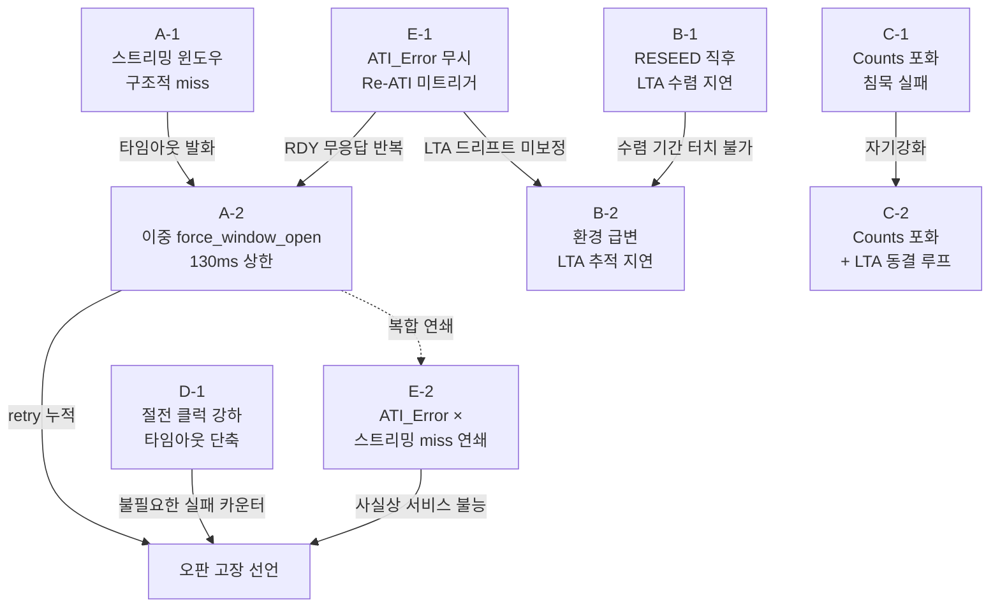

# 16 — adversarial 반증가 실패 모드 v2 (스트리밍 의존 read · FIXED LTA delta)

> **TL;DR**: 현 구조(스트리밍 모드 + 200ms 폴링 + FIXED LTA delta 운용)의 5대 실패 계열을 데이터시트·코드 근거로 열거한다. 가장 위험한 두 축은 ①스트리밍 윈도우 주기 불일치로 인한 누적 miss와 ②LTA IIR 추적 지연/동결 중 FIXED threshold 고정이 야기하는 터치 먹통이다. 절전 클럭·counts 포화·ATI_Error 무시 경로가 연쇄 증폭제로 작용한다.

---

## 0. 분석 범위 및 페르소나 선언

본 문서는 **adversarial 반증가** 페르소나로 작성된다. 기존 분석(에이전트-로그 10~14)이 명명한 "작동함" 전제를 모두 공격 대상으로 설정하고, 데이터시트·코드 근거 라인을 명시하여 실패 가능성을 입증한다. 추정 항목은 `[추정]` 표기. 한자 절대 금지.

**근거 파일**:

| 파일 | 핵심 근거 |
|---|---|
| `10_rdy-window-timing.md` | force_window_open 비용, t_wait 범위, 윈도우 불일치 구조 |
| `11_streaming-window.md` | 통신 윈도우 200ms 오해, 스트리밍 vs 폴링 불일치 |
| `12_ati-lta-convergence.md` | LTA IIR 수식, 터치 중 LTA 동결, RESEED 직후 수렴 지연 |
| `13_code-verify.md` | read_register 윈도우 2회 open, 타임아웃 130ms 상한 |
| `14_datasheet-verify.md` | DS §5.5~§5.11·§8.6~§8.13 원문 확정 |
| `07_adversary-failmode.md` | 기존 FM-01~FM-11 카탈로그 (중복 축약 참조) |

---

## 1. 실패 계열 A — 스트리밍 윈도우 놓침

### A-1. 구조적 miss 누적 (High)

**메커니즘**: IQS323은 Streaming 모드에서 Report Rate(현재 0 ms — 측정 완료 즉시 RDY 토글, 데이터시트 §8.11.1)마다 RDY를 LOW로 내린다. 각 윈도우의 t_Low(정상 서비스 시) = I2C 트랜잭션 지속 시간 ≈ 0.4~0.5 ms(`13_code-verify.md §2`, `11_streaming-window.md §3.2`).

CM3 폴링 주기는 **100 ms** (또는 과거 200 ms, `tdc_touch.h:25`). 측정 사이클 T_주기를 [추정] 5~16 ms라 하면, 100 ms 폴링 구간에 IC는 6~20회 윈도우를 자발 개방·폐쇄한다. 폴링 도착 시점에 윈도우가 마침 열려 있을 확률 = t_Low / T_주기 ≈ 0.5 ms / 10 ms = **5% 이하** [추정].

**결과**: `force_window_open()`이 0xFF Force Comm으로 새 윈도우를 강제 요청(`tdc_drv_iqs323.c:L143~172`, `13_code-verify.md §1`)하지 않으면 폴링 5회 중 4~5회는 닫힌 윈도우에 I2C를 시도하게 된다. 현재 `force_window_open()`이 이를 완화하나, 0xFF 발행 후 t_wait = 0.1~45 ms 대기(`10_rdy-window-timing.md §2.3`)가 발생한다. **매 폴링마다 수 ms ~ 45 ms의 차단 비용이 실질적으로 발생한다.**

**심각도**: High — 지연이 반복되면 폴링 지터가 커져 롱터치·탭 경계 판정 오차가 누적된다.

### A-2. 이중 force_window_open 구조의 타임아웃 상한 (High)

**근거**: `read_register()`는 레지스터 주소 write 후 STOP으로 윈도우가 닫히고(`DS §8.9`, `14_datasheet-verify.md §1`), 데이터 read를 위해 `force_window_open()`을 **두 번째로 호출**한다(`tdc_drv_iqs323.c:L233, L246`, `13_code-verify.md §2`).

최악 타임아웃 상한: 45 ms(open #1) + 20 ms(close #1) + 45 ms(open #2) + 20 ms(close #2) = **130 ms**(`13_code-verify.md §4`).

**실패 조건**: IC가 ATI 실행 중이거나 클럭 불안정 상태이면 t_wait가 상한 45 ms에 근접한다. 100 ms 폴링 주기 내에서 130 ms 타임아웃이 발생하면 **해당 사이클 전체가 실패**로 처리된다. 연속 2~3 사이클 이상 실패 시 retry-and-count가 임계에 도달해 오판 고장 선언이 가능하다 [추정].

**심각도**: High — 특히 ATI 이벤트와 동시 발생 시 연쇄 실패(아래 계열 E 참조).

---

## 2. 실패 계열 B — LTA 과드리프트 시 터치 먹통

### B-1. 터치 중 LTA 동결 + FIXED threshold 한계 (High)

**근거**: 데이터시트 §5.5 원문: "touch 또는 proximity 이벤트 중에는 LTA 갱신 중단"(`14_datasheet-verify.md §4`). LTA IIR: `LTA_new = LTA_old + (Counts − LTA_old) × Beta/256`.

정상 동작에서는 터치 중 LTA가 동결되어 터치 해제 후 LTA가 noTouch counts를 올바르게 추적한다. **그러나 RESEED 직후 터치 상태에서 손을 뗄 때** 수렴 지연이 발생한다(`12_ati-lta-convergence.md §2.4`):

```
RESEED 직후 LTA ← 터치 counts (예: 200)
손 뗌 → Counts 상승(예: 400)
LTA < Counts → (LTA − Counts) < 0 → 터치 미인식 (정상)
LTA IIR: LTA 천천히 400 방향으로 수렴 (Beta/256 × 주기)
수렴 기간: Beta=4 → alpha≈1.6% → 수렴에 ~수십~수백 샘플 [추정]
```

이 수렴 기간(수백 ms ~ 수 초 [추정]) 동안 **노터치 상태임에도 다음 터치 감지가 불능**이다. FIXED threshold는 delta가 threshold를 넘는 시점까지 기다리는 수동적 구조이므로, LTA가 수렴하지 않으면 threshold 비교 자체가 의미를 잃는다.

**심각도**: High — 전원 ON 직후 사용자가 터치하고 손을 떼면 다음 터치 반응이 수 초 이상 지연될 수 있다.

### B-2. 급격한 환경 변화 시 LTA 추적 지연 (Medium)

**근거**: `12_ati-lta-convergence.md §2.3`: "매우 급격한 환경 변화 시 LTA IIR 추적 지연으로 일시적 false/miss 가능 [추정], DS 미규정."

LTA가 새로운 noTouch counts를 추적하는 속도는 Beta에 정비례한다. 현재 Beta 설정값은 코드 확인 필요 [추정: 기본값 4~8 수준]. Beta가 낮을수록 환경 변화(온도·습도·기계적 진동)에 의한 Counts drift를 LTA가 천천히 따라가는데, 그 기간 동안:

- **과소 추적 (LTA < 실제 noTouch Counts)**: delta = LTA − Counts 가 음수 방향으로 편향 → 터치 임계 초과 어려워짐 → **터치 먹통**
- **과다 추적 불가**: LTA 동결(터치 중)은 LTA가 올라가는 방향(noTouch 복귀)을 막지 않으므로, 노터치 상태에서 급격한 Counts 상승 시 LTA가 뒤처지면 delta > threshold 오인식 가능 [추정]

**심각도**: Medium — 단기 환경 충격(ESD, 진동, 온도 급변)에 취약.

### B-3. FIXED LTA delta와 ATI Disabled 조합의 숨겨진 전제 (Medium)

**근거**: `12_ati-lta-convergence.md §2.2`: ATI Disabled에서 MULT/COMP 고정 → noTouch counts 절대값이 기기 간 편차를 가질 수 있음.

현재 Touch Threshold는 레지스터에 고정값으로 기록된다. 기기 간 noTouch counts 편차가 크면 특정 기기에서는 delta가 threshold에 미달(터치 먹통), 다른 기기에서는 노이즈 수준의 delta로 오인식(거짓 터치)이 가능하다. ATI Full이 없으므로 이 편차를 보정하는 경로가 없다.

**심각도**: Medium — 양산 편차가 크면 일부 기기에서 체계적 터치 불량 발생 [추정].

---

## 3. 실패 계열 C — Counts 포화

### C-1. Counts 상한 포화 시 delta 붕괴 (High)

**근거**: IQS323 Counts는 16비트 레지스터로 출력된다(`14_datasheet-verify.md §4 검증요약`). 그러나 실제 출력 범위는 ATI Target 및 MULT/COMP 설정에 의존한다.

ATI Disabled(MULT/COMP 고정) 상태에서 **COMP 값이 과소 설정**되거나 ESD·강한 RF 간섭으로 실제 capacitance가 비정상적으로 증가하면, Counts가 레지스터 최대값(65535 또는 IC 내부 상한)에 포화될 수 있다 [추정, DS 미규정].

포화 시 Counts = 상한값 고정 → noTouch 시에도 LTA ≈ Counts ≈ 상한 → delta ≈ 0 → threshold 미달 → **터치가 와도 인식 불가**. 이 상태에서 `force_window_open()`은 정상 동작하므로 I2C 통신 오류는 발생하지 않는다. 따라서 retry-and-count 카운터가 증가하지 않아 **고장 감지 경로 자체가 없다** [추정].

**심각도**: High — 포화 상태가 조용히 지속되는 "침묵 실패(silent failure)" 유형.

### C-2. Counts 포화와 LTA 동결 연쇄 (High)

Counts가 포화 상태로 LTA에 수렴하면(LTA ← 포화값), 이후 **진짜 터치**가 발생해도 Counts가 포화값에 이미 있으므로 감소 폭이 0이다 → delta = 0 → 터치 미인식. 동시에 LTA가 동결되어야 할 시점(터치 이벤트)이 delta < threshold이므로 동결 조건 미달 → LTA가 계속 포화값을 추적 → delta가 영원히 0 수렴.

**심각도**: High — 자기 강화 루프. 외부 리셋(MCLR) 없이는 탈출 불가 [추정].

---

## 4. 실패 계열 D — 절전 클럭에서 윈도우 타이밍 오산

### D-1. 절전 클럭 강하 시 force_window_open 타임아웃 단축 (Medium)

**근거**: `10_rdy-window-timing.md §2.3`: `TDC_DRV_IQS323_MAX_WAIT_MS_FOR_WINDOW_OPEN = 45`(`tdc_drv_iqs323.h:L31`). 타임아웃 계산은 `ci_timer_get_tick()`에 의존한다.

절전(ULP) 상태에서 SystemCoreClock이 강하되면, `ci_timer_get_tick()`의 틱 분해능이 변한다. 만약 타이머가 **절대 시간 기반이 아닌 사이클 카운트 기반**이라면, 클럭 강하 시 실효 타임아웃이 짧아진다 [추정 — `tdc_is_iqs323_in_ulp_mode()` 분기로 확인 필요, `07_adversary-failmode.md FM-08`].

결과: IC가 정상적으로 t_wait(수 ms) 후 RDY를 내리기 전에 타임아웃이 먼저 발동 → `force_window_open()` 실패 반환 → `read_register()` 실패 → retry-and-count 누적 → 절전 중 불필요한 고장 판정.

**심각도**: Medium — 절전 상태에서만 발현, 통상 동작과 분리.

### D-2. 절전 전환 중 진행 중인 force_window_open busy-wait 교란 (Medium)

**메커니즘**: `force_window_open()`은 무한 while 루프로 RDY 핀을 GPIO 폴링한다(`tdc_drv_iqs323.c:L159~171`). 절전 진입 경로(`func_sleep()`)가 이 루프 도중 실행되면, 클럭 강하 후 루프 지속 여부가 보장되지 않는다 [추정]. WFI(Wait-For-Interrupt) 지시가 끼어들면 루프가 지연되거나 RDY 폴링 누락이 발생할 수 있다.

**심각도**: Medium — 발생 시점이 절전 전환과 I2C 접근의 동시 발생에만 국한되나, 임베디드 선점 없는 구조에서 가능한 경로.

---

## 5. 실패 계열 E — ATI_Error 무시 경로와의 상호작용

### E-1. ATI_Error 무시로 수동 Re-ATI 경로 차단 (High)

**근거**: `07_adversary-failmode.md FM-09` 및 `14_datasheet-verify.md §3`: "ATI Error 발생 시 Re-ATI가 자동 트리거되지 않음 — 마스터가 System Control의 Re-ATI bit를 SET해 수동 트리거 필요(DS §5.11)."

현재 코드: `tdc_touch.c:L389~393` — `ati_error`를 `(void)`로 무시.

**시나리오**: 전원 ON + 터치 상태 → Auto-ATI 수렴 실패 → ATI_Error bit SET → 마스터가 ati_error 콜백을 무시 → 수동 Re-ATI 미트리거 → IQS323이 ATI 완료 상태로 복귀 불가 → **RDY 응답 불안정 지속** → force_window_open() 타임아웃 반복 → retry-and-count 누적 → 오판 고장 선언.

이 경로는 `12_ati-lta-convergence.md §1.3`의 "전원 ON + 터치 중 Auto-ATI 수렴 실패 timeout 예상 범위 내(코드 L376 주석)"와 정합한다. 설계자는 이를 "정상"으로 표기했으나, 그 이후 ATI_Error 처리가 없어 후속 오류가 누적되는 구멍이 존재한다.

**심각도**: High — ATI Full 전환 시 즉시 Critical로 격상 (현재 ATI Disabled에서 잠재 상태).

### E-2. ATI_Error + 스트리밍 윈도우 miss 연쇄 (High)

ATI 실행 중에는 RDY 핀이 응답하지 않는 구간이 발생한다(`02_i2c-mechanism.md §8.4` 참조, `07_adversary-failmode.md FM-02 근거`). 이 구간에 `force_window_open()`이 호출되면 타임아웃(45 ms) 발동 → `read_register()` 실패.

ati_error가 무시된 상태에서 ATI가 비정상 루프에 빠지면, RDY 무응답 구간이 반복된다 → 매 폴링마다 45 ms 타임아웃 두 번(2회 force_window_open) = 90 ms 지연 → 폴링 사이클 내에서 대부분의 시간이 타임아웃 대기로 소모 → **스트리밍 윈도우 miss 계열 A와 상호 증폭**.

**심각도**: High — 두 계열의 교차 발화는 단독 발생보다 훨씬 높은 retry 카운터 누적율을 야기한다.

### E-3. ATI_Error 무시 + LTA 드리프트 미보정 연쇄 (Medium)

ATI_Error 발생 후 마스터가 수동 Re-ATI를 트리거하지 않으면, ATI Error bit는 SET 유지 상태가 된다. 이 상태에서 LTA가 ATI Band를 이탈해도 Re-ATI가 자동 발동되지 않는다(ATI Disabled 현재 상태에서는 애초에 Re-ATI가 없으므로 이 경로는 ATI Full 전환 후에만 활성). 결과적으로 LTA drift가 보정 없이 누적 → 계열 B의 과드리프트 먹통 가속.

**심각도**: Medium (ATI Disabled 현재 상태에서 잠재; ATI Full 전환 시 High).

---

## 6. 실패 계열 종합 심각도 요약

| 계열 | 실패 모드 ID | 제목 | 심각도 | 발현 조건 |
|---|---|---|---|---|
| A | A-1 | 스트리밍 윈도우 구조적 miss 누적 | **High** | 항상 (100ms 폴링 × 수ms RDY 주기) |
| A | A-2 | 이중 force_window_open 타임아웃 상한 130ms | **High** | IC 응답 지연 시 |
| B | B-1 | RESEED 직후 LTA 수렴 지연 → 터치 먹통 | **High** | 전원 ON 직후 터치 → 손 뗌 직후 구간 |
| B | B-2 | 환경 급변 시 LTA 추적 지연 | **Medium** | 온도·습도·ESD 충격 |
| B | B-3 | FIXED threshold + 기기 간 counts 편차 | **Medium** | ATI Disabled 양산 편차 |
| C | C-1 | Counts 포화 시 delta 붕괴 침묵 실패 | **High** | COMP 과소 설정 / RF 간섭 |
| C | C-2 | Counts 포화 + LTA 동결 자기강화 루프 | **High** | C-1 조건 지속 시 |
| D | D-1 | 절전 클럭 강하 시 타임아웃 단축 | **Medium** | ULP 절전 상태 |
| D | D-2 | 절전 전환 도중 busy-wait 교란 | **Medium** | 절전 진입 + I2C 접근 동시 |
| E | E-1 | ATI_Error 무시 → 수동 Re-ATI 경로 차단 | **High** | Auto-ATI 수렴 실패 후 |
| E | E-2 | ATI_Error + 스트리밍 miss 연쇄 증폭 | **High** | E-1 + A 계열 동시 |
| E | E-3 | ATI_Error + LTA 드리프트 미보정 연쇄 | **Medium** | ATI Full 전환 후에만 활성 |

**Critical 없음** — 단독으로 Critical을 유발하는 단일 실패 모드는 없으나, **E-2(ATI_Error × 스트리밍 miss 연쇄)**는 복합 조건에서 사실상 Critical에 준하는 서비스 불능을 야기할 수 있다 [추정].

---

## 7. 상호작용 연쇄도



---

## 8. 최우선 완화 과제

| 우선순위 | 계열 | 완화 조치 | 코드 위치 |
|---|---|---|---|
| 1 | E-1 | `ati_error` 무시 제거, ATI_Error 감지 → 노터치 확인 → 수동 Re-ATI 트리거 | `tdc_touch.c:L389~393` |
| 2 | B-1 | 전원 ON 직후 RESEED 수렴 기간(예: 500ms) 동안 터치 판정 억제 또는 경고 | `tdc_drv_iqs323.c:L1147` 이후 |
| 3 | C-1 | Counts 포화 감지 조건 추가(`Counts >= SATURATION_THRESHOLD`) → MCLR 재시도 | `tdc_drv_iqs323_read_status()` |
| 4 | D-1 | `ci_timer_get_tick()` 절전 클럭 추종 여부 확인; 아닐 경우 `tdc_is_iqs323_in_ulp_mode()` 분기로 타임아웃 보정 | `tdc_drv_iqs323.h:L30~31` |
| 5 | A-1 | Event Mode 전환 + 인터럽트 기반 read 검토 (데이터시트 §8.11.2 권장, `11_streaming-window.md §5`) | 설계 결정 필요 |

---

## 참조 섹션 색인

| 근거 | 위치 |
|---|---|
| 스트리밍 모드 RDY 토글 주기 | `14_datasheet-verify.md §2`, `11_streaming-window.md §2.1` |
| force_window_open t_wait 0.1~45ms | `10_rdy-window-timing.md §2.3`, `14_datasheet-verify.md §1` |
| 이중 force_window_open 실증 | `13_code-verify.md §2`, `.c:L233, L246` |
| LTA 동결 조건 | `14_datasheet-verify.md §4`, DS §5.5 |
| RESEED 직후 수렴 지연 | `12_ati-lta-convergence.md §2.4` |
| ATI_Error 수동 Re-ATI 필요 | `14_datasheet-verify.md §3`, DS §5.11 |
| ati_error 무시 코드 | `tdc_touch.c:L389~393`, `07_adversary-failmode.md FM-09` |
| 절전 클럭 타임아웃 위험 | `07_adversary-failmode.md FM-08`, `tdc_drv_iqs323.h:L31` |
