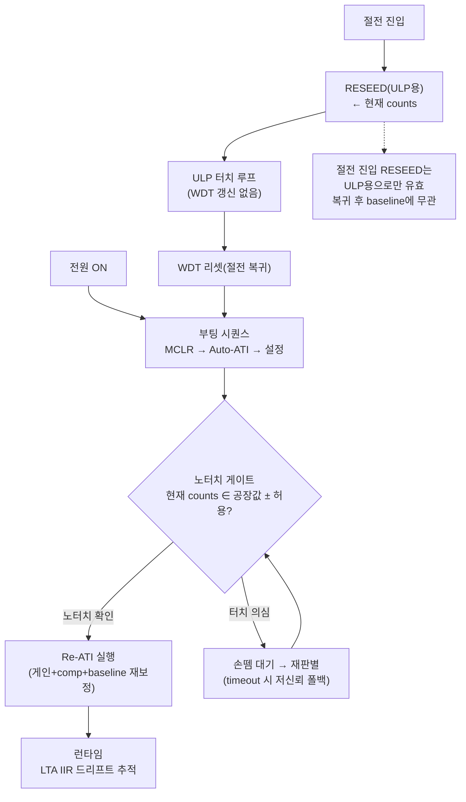

# 04 — 절전/재부팅 통합 분석 (절전 복귀=WDT 리셋 재부팅)

**TL;DR**: 절전 복귀가 WDT 리셋 재부팅이므로 "절전에서 깨어날 때 baseline 어떻게 할 것인가" 문제가 "부팅 baseline 어떻게 할 것인가" 문제와 **완전히 동일한 문제**로 흡수된다. 두 경로를 별도 핸들링할 필요가 없으며, 노터치 게이트 + Re-ATI 단일 구현으로 두 경우 모두 처리된다. 단, 절전 진입 시 RESEED는 이후 부팅에서 폐기되므로 실익이 없고 race 위험만 남는다.

---

## 1. 전제 재확인 (코드 검증)

### 절전 복귀 = WDT 리셋 재부팅

`main.c:952`에서 `tdc_drv_iqs323_reseed()` 호출 후, 절전 루프는 WDT를 갱신하지 않는 구조다. WDT 만료 시 SoC 전체 리셋 → CM3가 처음부터 재시작 (`initialize.c:449` `mclr_reset()` 무조건 실행). 따라서:

```
절전 진입 → ULP 터치 폴링 루프(WDT 갱신 없음) → WDT 만료 → 전체 리셋
  → (일반 부팅과 동일 경로) MCLR → Auto-ATI → 고정 MULT/COMP write → RESEED
```

즉 **절전 복귀 후 IQS323 상태**는 일반 전원-ON 부팅 직후와 완전히 동일하다. WDT 리셋은 이전 절전 중 LTA·MULT/COMP를 보존하지 않는다.

### 절전 진입 시 RESEED (`iqs323.c:945`)

```c
/* iqs323.c:931 tdc_drv_iqs323_reseed() */
write_register(TDC_DRV_IQS323_REG_ADDR_SYSTEM_CONTROL, 0x08, 0x00); /* RESEED */
```

이 RESEED는 절전 ULP 루프용 LTA seed가 목적이다. 그러나 WDT 리셋 후 이 LTA는 **소멸**하므로, 절전 진입 RESEED가 복귀 후 baseline에 미치는 영향은 0이다.

---

## 2. 통합이 주는 단순화

### 2-1. 문제 공간 축소

기존에는 두 시나리오를 별도로 고려해야 했다:

| 기존 관점 | 문제 |
|---|---|
| 시나리오 A: 일반 부팅 | 부팅 터치 여부 모름 → baseline 오염 가능 |
| 시나리오 B: 절전 복귀 | 절전 전 LTA 보존 방법, 복귀 후 재동기화 방법 |

통합 후:

| 통합 관점 | 결론 |
|---|---|
| **단일 시나리오: 부팅** | 절전 복귀도 부팅이므로, 부팅 baseline 전략 하나로 두 경우 모두 처리 |

복귀 전용 "절전 LTA 유지 메커니즘", "절전 복귀 baseline 재동기화" 같은 별도 로직이 **필요 없다**.

### 2-2. 노터치 게이트 단일 구현으로 충분

매 부팅(전원-ON 및 WDT 리셋 포함)에서 동일한 시퀀스가 실행된다:

```
MCLR → Auto-ATI(1회) → [노터치 게이트 판별] → 노터치 확인 → Re-ATI(공장값 게이트 기준)
                                              → 터치 의심 → 손뗌 대기 → 재판별
```

이 단일 흐름이 "부팅 노터치" · "부팅 터치" · "절전 복귀 노터치" · "절전 복귀 터치" 네 경우를 모두 포함한다.

---

## 3. 절전 진입 시 RESEED의 재평가

### 3-1. 현재 RESEED의 목적과 실익

`tdc_drv_iqs323_reseed()`는 절전 ULP 루프에서 터치를 감지하기 위해 LTA를 현재 counts로 seed한다. 이 자체는 절전 중 동작에 필요하다.

**그러나** 절전 복귀가 WDT 리셋이라면:
- 절전 중 LTA 상태는 복귀 후에 완전히 소멸
- 절전 진입 RESEED가 부팅 baseline에 영향 없음
- RESEED 시점에 터치 중이어도 **복귀 부팅에서는 문제가 이미 발생한 것이 아니라**, 부팅 baseline 시퀀스가 새로 처리한다

따라서 절전 진입 RESEED는:
- **절전 ULP 루프 동작**을 위해서는 필요 [코드 확정]
- **복귀 후 baseline 품질**에 기여하지 않음 [추정: WDT 리셋으로 LTA 소멸]

### 3-2. RESEED와 Re-ATI 관계 (절전 진입 시)

오케스트레이터 입력 §3에서 명시된 바와 같이, **노터치 게이트 하에선 RESEED보다 Re-ATI가 우월**하다 (게인+comp+baseline 전부 재보정). 이 원칙은 절전 진입 시점에도 동일하게 적용된다.

그러나 **절전 진입 시 Re-ATI를 수행하는 것은 타당하지 않다**: 절전 진입 목적은 빠른 저전력 전환이며, Re-ATI는 I2C 차단·수렴 시간(수십~수백 ms [추정])을 요구한다. 절전 진입 RESEED는 현재 counts로만 seed하므로 비교적 빠르고, 그 결과는 ULP 루프에서만 사용된다.

**결론**: 절전 진입 RESEED는 유지하되, 복귀 후 baseline 품질은 전적으로 **부팅 시점의 노터치 게이트 + Re-ATI**에 위임한다. 이것이 절전/부팅 통합이 가져오는 가장 큰 단순화다.

---

## 4. 설계 기회

### 4-1. 크래들 뚜껑 닫힘 구간 활용 [현재 미구현]

전제에 따르면 크래들 뚜껑 닫힘 시 터치 폴링 완전 중단(`func_cradle_lid_closed_loop`). 뚜껑 열림 시 WDT 리셋 재부팅 → 이 부팅은 **노터치 보장** 상태에서 시작하는 유일한 경로다. [추정: 크래들 뚜껑이 터치 전극을 차폐하는 구조라면]

현재 이 보장을 활용하는 코드가 없으므로, 뚜껑 열림 직후 부팅에서 크래들 플래그를 확인해 노터치 게이트를 즉시 통과시키는 로직 추가가 가능하다. [확정 필요: 크래들 뚜껑이 실제로 터치 전극을 물리적으로 차폐하는지]

### 4-2. 절전 진입 횟수를 EEPROM에 기록하는 실익 없음

이전 분석에서 "절전 진입 시 EEPROM에 LTA를 저장해 복귀 시 활용"하는 방안이 논의될 수 있었으나, WDT 리셋 재부팅임이 확정되었으므로 이 방향은 불필요하다. RESEED는 현재 counts로만 seed 가능하므로(`§5.5.1`) EEPROM의 과거 LTA를 복원하는 것도 IQS323 하드웨어 제약상 불가하다 [코드+데이터시트 확정].

### 4-3. 부팅 이유 구분 (전원-ON vs WDT-리셋) — 선택적 기회

SoC 리셋 원인 레지스터로 부팅 원인을 구분할 수 있다면, WDT 리셋(절전 복귀) 부팅에서 직전 절전 진입 직전 상태 정보(예: 크래들 여부, 직전 터치 상태)를 활용할 수 있다. [확정 필요: EZ8300/CM3 리셋 원인 레지스터 가용성]

그러나 이 기회를 활용하지 않아도, 노터치 게이트 + Re-ATI 단일 흐름이 두 경우를 모두 처리하므로 필수 요건은 아니다.

---

## 5. 절전/부팅 통합 함의 요약



| 이전 관점 | 통합 후 관점 |
|---|---|
| 절전 복귀 baseline 별도 처리 필요 | 부팅 시퀀스와 동일, 추가 처리 불필요 |
| 절전 진입 RESEED = 복귀 품질 영향 | 절전 진입 RESEED = ULP용 전용, 복귀 무관 |
| 절전/부팅 두 경로 각각 방어 | 노터치 게이트 + Re-ATI 단일 구현으로 통합 |
| 절전 LTA 보존 메커니즘 고려 필요 | EEPROM LTA 저장·복원 불필요(하드웨어 제약+WDT 리셋으로 무의미) |

---

## 6. 미확정 항목

| 항목 | 왜 필요 | 확정 방법 |
|---|---|---|
| 크래들 뚜껑이 터치 전극을 실제 차폐하는지 | 크래들 부팅 노터치 보장 강도 | 물리 구조 확인 + RTT 실측 |
| EZ8300/CM3 리셋 원인 레지스터 가용성 | WDT vs 전원-ON 부팅 구분 기회 | 데이터시트 §RST 레지스터 확인 |
| 절전 ULP 루프 WDT 비갱신 확정 여부 | 절전 복귀=WDT 리셋 전제 근거 | main.c 절전 루프 WDT 호출 grep 확인 [현 분석에서 간접 확인] |
