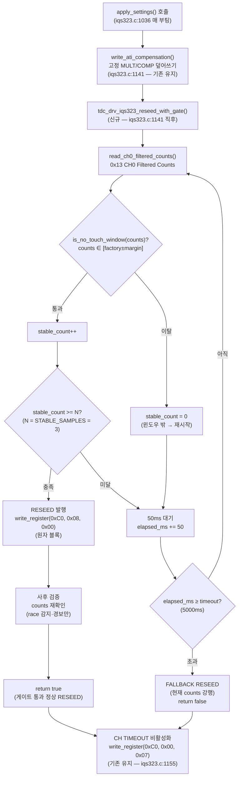

# 14 — 계획: 노터치 게이트 코드 구현 설계

**TL;DR**: `tdc_drv_iqs323_apply_settings()`의 무조건 RESEED 1줄(`iqs323.c:1147`)을 게이트 함수로 교체한다. 게이트는 ① 공장값 윈도우 판별(레이어_1) → ② counts 안정성 3샘플(레이어_2) → ③ 원자 블록 RESEED + 사후 검증으로 구성하며, `tdc_drv_iqs323.c`에 신규 3함수를 추가하고 `tdc_touch_config.h`에 윈도우 상수 4개를 추가한다. Re-ATI 게이트는 `TDC_TOUCH_NOGATE_REATI_ENABLE` 빌드 가드로 분리해 Phase 2에서 활성화한다.

---

## 0. 전제 및 코드 베이스라인 (ground truth)

| 항목 | 위치 | 현재 값 |
|---|---|---|
| 무조건 RESEED | `iqs323.c:1147` | `write_register(0xC0, 0x08, 0x00)` — 교체 대상 |
| CH0 Filtered Counts 레지스터 | `iqs323.c:1208`, `iqs323.h:45` | `0x13`, `TDC_DRV_IQS323_REG_ADDR_CH0_FILTERED_COUNTS` |
| SYSTEM_CONTROL 레지스터 | `iqs323.h:56` | `0xC0`, `TDC_DRV_IQS323_REG_ADDR_SYSTEM_CONTROL` |
| CH TIMEOUT 비활성화 | `iqs323.c:1155` | `write_register(0xC0, 0x00, 0x07)` — 기존 유지 |
| read_register 시그니처 | `iqs323.c:227` | `static bool read_register(uint8_t addr, uint8_t *p_lsb, uint8_t *p_msb)` |
| write_register 시그니처 | 기존 static | `static bool write_register(uint8_t addr, uint8_t lsb, uint8_t msb)` |
| TOUCH_THRESHOLD | `iqs323.h:132` | 100 (delta 판정용, 절대값 기준 아님) |
| 터치 시 self-cap 방향 | 데이터시트 §5.3 | 접촉 → Counts **감소** (self-cap = 손가락이 전극 용량을 증가시켜 주파수 감소) |
| re_ati_trigger() | `iqs323.c:569` | `static bool re_ati_trigger(void)` — 이미 존재(static, Phase 2 extern 필요) |

---

## 1. 신규 추가 상수 — `tdc_touch_config.h`

기존 파일 `#endif /* TDC_TOUCH_CONFIG_H_ */` 직전에 다음 블록 추가:

```c
/* 11. 노터치 게이트 — 공장 기준 윈도우 판별 + RESEED 게이트
 *
 *  self-cap 방향: 터치 시 Counts 감소. 노터치 → Counts ≈ 공장 기준값.
 *  게이트 통과 조건: counts ∈ [FACTORY_NO_TOUCH - MARGIN, FACTORY_NO_TOUCH + MARGIN]
 *
 *  TDC_TOUCH_FACTORY_NO_TOUCH_COUNTS : 공장 노터치 기준 절대값
 *    → [확정 필요] RTT MARGIN 로그(iqs323.c:1228) "Counts=" 값을
 *      노터치 확정 환경(크래들·독립 탁상)에서 10회 측정 후 중앙값 기입.
 *      현재 임시 초기값 450은 ATI Target(MSB=0x04→ATI_Base≈100, Counts ≈ 400~500 추정).
 *
 *  TDC_TOUCH_NO_TOUCH_MARGIN        : 윈도우 허용 폭(단측)
 *    → 환경 드리프트(온도·습도) 실측 전 보수값 80 권장.
 *      실측5(장기 드리프트) 완료 후 축소 가능.
 *
 *  TDC_TOUCH_NO_TOUCH_STABLE_SAMPLES : 안정성 확인 샘플 수 (레이어_2)
 *    → 연속 N샘플이 모두 윈도우 안에 있어야 게이트 통과.
 *      폴링 200ms 기준 N=3 = 600ms 대기. 5 이상은 부팅 지연 증가.
 *
 *  TDC_TOUCH_NO_TOUCH_TIMEOUT_MS    : 게이트 통과 대기 최대 시간
 *    → timeout 시 현재 counts로 RESEED 강행(저신뢰 폴백, 기존 동작 보존).
 */
#ifndef TDC_TOUCH_FACTORY_NO_TOUCH_COUNTS
#  define TDC_TOUCH_FACTORY_NO_TOUCH_COUNTS  450u   /* [확정 필요] RTT 실측 후 교체 */
#endif

#ifndef TDC_TOUCH_NO_TOUCH_MARGIN
#  define TDC_TOUCH_NO_TOUCH_MARGIN          80u    /* [확정 필요] 드리프트 실측 후 조정 */
#endif

#ifndef TDC_TOUCH_NO_TOUCH_STABLE_SAMPLES
#  define TDC_TOUCH_NO_TOUCH_STABLE_SAMPLES  3u
#endif

#ifndef TDC_TOUCH_NO_TOUCH_TIMEOUT_MS
#  define TDC_TOUCH_NO_TOUCH_TIMEOUT_MS      5000u
#endif
```

---

## 2. 신규 함수 3개 — `tdc_drv_iqs323.c`

### 2-1. `read_ch0_filtered_counts()` — counts 단일 읽기 헬퍼

`apply_settings()` 직전(L1036 근방 static 함수군) 또는 `tdc_drv_iqs323_check_touch_margin()` 직후에 추가:

```c
/**
 * @brief CH0 Filtered Counts(0x13) 읽기 헬퍼
 * @param[out] p_counts  읽은 16비트 counts 값
 * @return true = 성공, false = I2C 실패
 *
 * @note read_touch_margin() 과 달리 LTA/THRESHOLD 없이 counts만 읽는다.
 *       노터치 게이트 판별용 경량 경로.
 */
static bool read_ch0_filtered_counts(uint16_t *p_counts)
{
    uint8_t lsb = 0u;
    uint8_t msb = 0u;

    if (p_counts == NULL)
    {
        return false;
    }

    if (!read_register(TDC_DRV_IQS323_REG_ADDR_CH0_FILTERED_COUNTS, &lsb, &msb))
    {
        ci_printe("[TOUCH] GATE: COUNTS READ FAIL \r\n");
        return false;
    }

    *p_counts = ((uint16_t)msb << 8u) | lsb;
    return true;
}
```

---

### 2-2. `is_no_touch_window()` — 공장값 윈도우 판별

```c
/**
 * @brief 공장 기준 노터치 윈도우 판별 (레이어_1)
 * @param counts  CH0 Filtered Counts 현재값
 * @return true = 윈도우 안 (노터치 추정), false = 윈도우 밖 (터치 의심)
 *
 * @note self-cap 방향: 터치 시 Counts 감소.
 *       윈도우 = [FACTORY_NO_TOUCH - MARGIN, FACTORY_NO_TOUCH + MARGIN].
 *       FACTORY_NO_TOUCH_COUNTS 는 tdc_touch_config.h 에서 설정.
 *       [확정 필요] RTT 실측 후 상수 교체 필수.
 */
static bool is_no_touch_window(uint16_t counts)
{
    const uint16_t base   = TDC_TOUCH_FACTORY_NO_TOUCH_COUNTS;
    const uint16_t margin = TDC_TOUCH_NO_TOUCH_MARGIN;

    /* underflow 방어: base < margin 인 경우 하한 0 처리 */
    const uint16_t lo = (base > margin) ? (base - margin) : 0u;
    const uint16_t hi = base + margin;   /* overflow 가능성: counts 최대값 < 65535 전제 */

    return (counts >= lo) && (counts <= hi);
}
```

---

### 2-3. `tdc_drv_iqs323_reseed_with_gate()` — 노터치 게이트 RESEED

`apply_settings()` 내 무조건 RESEED를 대체하는 핵심 함수. `tdc_drv_iqs323.c` 내 `write_ati_compensation()` 직후에 위치:

```c
/**
 * @brief 노터치 게이트 RESEED — 공장 기준 윈도우 통과 후 RESEED 허용
 *
 *  흐름:
 *  ① counts 읽기 → 레이어_1(공장 윈도우) 확인
 *  ② 통과 시: N샘플 안정성 확인(레이어_2)
 *  ③ 안정 확인 시: RESEED 실행(원자 블록) → 사후 counts 재확인
 *  ④ timeout 또는 실패 시: 현재 counts로 RESEED 강행(저신뢰 폴백)
 *
 *  Phase 2(Re-ATI 활성): TDC_TOUCH_NOTOUCH_REATI_ENABLE 빌드 가드로 분리.
 *
 * @return true = 노터치 확인 후 정상 RESEED,
 *         false = timeout 폴백 RESEED (저신뢰 — 기존 동작 동등)
 *
 * @note 본 함수는 apply_settings() 내 write_ati_compensation() 직후,
 *       CH TIMEOUT 비활성화 write_register(0xC0, 0x00, 0x07) 이전에 호출한다.
 *       (iqs323.c:1141~1155 구간 교체)
 */
static bool tdc_drv_iqs323_reseed_with_gate(void)
{
    const uint32_t timeout_ms    = TDC_TOUCH_NO_TOUCH_TIMEOUT_MS;
    const uint8_t  stable_n      = TDC_TOUCH_NO_TOUCH_STABLE_SAMPLES;
    const uint32_t poll_ms       = 50u;  /* 게이트 폴링 간격 — 부팅 중 50ms [추정] */
    uint32_t       elapsed_ms    = 0u;
    uint8_t        stable_count  = 0u;
    uint16_t       counts        = 0u;

    ci_printv("[TOUCH] GATE: start (factory=%u margin=±%u)\r\n",
              TDC_TOUCH_FACTORY_NO_TOUCH_COUNTS,
              TDC_TOUCH_NO_TOUCH_MARGIN);

    /* ── 게이트 대기 루프 ── */
    while (elapsed_ms < timeout_ms)
    {
        SYS_WATCHDOG_REFRESH();

        if (!read_ch0_filtered_counts(&counts))
        {
            /* I2C 실패 → 폴백으로 이행 */
            break;
        }

        if (is_no_touch_window(counts))
        {
            stable_count++;
            ci_printv("[TOUCH] GATE: stable=%u counts=%u\r\n", stable_count, counts);

            if (stable_count >= stable_n)
            {
                /* ── 레이어_1+2 통과 → 원자 블록: RESEED 즉시 실행 ── */
                ci_printv("[TOUCH] GATE: PASS → RESEED (counts=%u)\r\n", counts);
                if (!write_register(TDC_DRV_IQS323_REG_ADDR_SYSTEM_CONTROL, 0x08u, 0x00u))
                {
                    ci_printe("[TOUCH] GATE: RESEED WRITE FAIL \r\n");
                    /* 실패해도 폴백으로 이행하지 않고 완료 반환
                     * (write 실패는 I2C 일시 오류, 기존 LTA 유지가 강행보다 안전) */
                    return false;
                }

                /* 사후 검증: RESEED 직후 counts 재확인 (race 감지) */
                {
                    uint16_t counts_after = 0u;
                    if (read_ch0_filtered_counts(&counts_after) &&
                        !is_no_touch_window(counts_after))
                    {
                        /* race 감지 — LTA 오염 가능성. 경보만 출력하고 완료 처리
                         * (재시도 시 또 race 확률 극히 낮음, 자기치유로 복구) */
                        ci_printw("[TOUCH] GATE: RACE DETECTED after=%u (self-heal expected)\r\n",
                                  counts_after);
                    }
                    else
                    {
                        ci_printv("[TOUCH] GATE: RESEED OK after=%u\r\n", counts_after);
                    }
                }

#if TDC_TOUCH_NOTOUCH_REATI_ENABLE
                /* Phase 2: Re-ATI 활성 — RESEED 대신 Re-ATI 실행
                 * (ATI Full 전환 시 여기서 re_ati_trigger() + wait_re_ati_done() 호출)
                 * TODO: re_ati_trigger() extern 노출 또는 래퍼 추가 필요 */
#endif

                return true;  /* 게이트 통과 정상 완료 */
            }
        }
        else
        {
            /* 윈도우 밖 — 안정성 카운터 초기화 (레이어_1 실패 시 재시작) */
            if (stable_count > 0u)
            {
                ci_printv("[TOUCH] GATE: RESET stable, counts=%u (out of window)\r\n", counts);
            }
            stable_count = 0u;
        }

        /* 폴링 대기 */
        {
            int32_t tick_start = ci_timer_get_tick();
            while ((ci_timer_get_tick() - tick_start) < (int32_t)poll_ms)
            {
                SYS_WATCHDOG_REFRESH();
            }
        }
        elapsed_ms += poll_ms;
    }

    /* ── timeout 폴백: 현재 counts로 RESEED 강행 (기존 동작 동등) ── */
    ci_printw("[TOUCH] GATE: TIMEOUT → FALLBACK RESEED (counts=%u)\r\n", counts);
    if (!write_register(TDC_DRV_IQS323_REG_ADDR_SYSTEM_CONTROL, 0x08u, 0x00u))
    {
        ci_printe("[TOUCH] GATE: FALLBACK RESEED FAIL \r\n");
    }

    return false;  /* 폴백 완료 */
}
```

---

## 3. `apply_settings()` 수정 지점 — `iqs323.c:1141~1150`

현재 코드:
```c
    if (!write_ati_compensation())
    {
        ci_printe("[TOUCH] FAIL: WRITE ATI COMPENSATION \r\n");
    }

    ci_printv("[TOUCH] RESEED \r\n");
    if (!write_register(TDC_DRV_IQS323_REG_ADDR_SYSTEM_CONTROL, 0x08, 0x00))
    {
        ci_printe("[TOUCH] FAIL: RESEED \r\n");
    }
```

교체 후:
```c
    if (!write_ati_compensation())
    {
        ci_printe("[TOUCH] FAIL: WRITE ATI COMPENSATION \r\n");
    }

    ci_printv("[TOUCH] RESEED (with noTouch gate) \r\n");
    (void)tdc_drv_iqs323_reseed_with_gate();
    /* 반환값: true=게이트 통과 정상, false=timeout 폴백.
     * 두 경우 모두 RESEED는 완료되므로 오류 처리 불필요. */
```

> [!NOTE]
> `CH TIMEOUT 비활성화` write(`iqs323.c:1152~1157`)는 변경 없이 그 다음 줄에 그대로 유지한다.

---

## 4. 빌드 가드 신규 상수 — `tdc_touch_config.h`

Phase 2 Re-ATI 분리용 가드(기본값 0 = 비활성):

```c
/* 12. 노터치 게이트 Re-ATI (Phase 2 — 기본 비활성)
 *    0: RESEED 게이트만 (Phase 1 기본값)
 *    1: 게이트 통과 시 RESEED 대신 Re-ATI 실행 (ATI Full 전환 시 활성화) */
#ifndef TDC_TOUCH_NOTOUCH_REATI_ENABLE
#  define TDC_TOUCH_NOTOUCH_REATI_ENABLE  0
#endif
```

---

## 5. 구현 변경 파일 요약

| 파일 | 변경 종류 | 위치 | 내용 |
|---|---|---|---|
| `tdc_touch_config.h` | 상수 추가 | `#endif` 직전 | 11번 블록 4개 상수 + 12번 빌드 가드 |
| `tdc_drv_iqs323.c` | 함수 3개 추가 | static 함수군(L696~820 사이 삽입 권장) | `read_ch0_filtered_counts`, `is_no_touch_window`, `tdc_drv_iqs323_reseed_with_gate` |
| `tdc_drv_iqs323.c` | 기존 수정 | `apply_settings()` L1146~1150 | 무조건 RESEED 2줄 → `tdc_drv_iqs323_reseed_with_gate()` 1줄 |

---

## 6. 판별 흐름 요약 (설계 확정)



---

## 7. 미확정·실측 의존 항목

| 상수 | 현재 임시값 | 확정 방법 | 선행 여부 |
|---|---|---|---|
| `TDC_TOUCH_FACTORY_NO_TOUCH_COUNTS` | 450 [추정] | RTT MARGIN 로그 "Counts=" — 노터치 10회 중앙값 | **구현 후 즉시 실측 필수** |
| `TDC_TOUCH_NO_TOUCH_MARGIN` | 80 [추정] | 장기 드리프트 실측(온도·시간·보드 편차 분포) | 실측5 이후 조정 |
| `TDC_TOUCH_NO_TOUCH_STABLE_SAMPLES` | 3 [추정] | Beta IIR 수렴 속도 + 폴링 주기 기반 결정 | [확정 필요] |
| `TDC_TOUCH_NO_TOUCH_TIMEOUT_MS` | 5000 [추정] | 실사용 최대 부팅-터치 지속시간 관찰 | [확정 필요] |
| `poll_ms` (게이트 내부) | 50 [추정] | 부팅 시퀀스 총 허용 지연 vs 샘플링 밀도 트레이드오프 | [확정 필요] |

---

## 8. 핵심 결론 (7줄)

1. **교체 대상 1줄**: `iqs323.c:1147` 무조건 RESEED 2줄을 `tdc_drv_iqs323_reseed_with_gate()` 1줄로 교체 — 기존 폴백 경로(timeout 시 강행)로 기존 동작 100% 보존.
2. **신규 함수 3개**: `read_ch0_filtered_counts`(counts 단일 읽기) + `is_no_touch_window`(레이어_1 윈도우 비교) + `tdc_drv_iqs323_reseed_with_gate`(레이어_1+2 + 원자 RESEED + 사후 검증) — 모두 `tdc_drv_iqs323.c` static.
3. **상수 4+1개**: `tdc_touch_config.h` 11번 블록(FACTORY_NO_TOUCH_COUNTS·MARGIN·STABLE_SAMPLES·TIMEOUT_MS) + 12번 빌드 가드(REATI_ENABLE=0) — `#ifndef` 가드로 외부 오버라이드 가능.
4. **공장값 임시**: `FACTORY_NO_TOUCH_COUNTS=450`은 ATI Target 역산 추정값 — 구현 직후 RTT MARGIN 로그 "Counts=" 실측 후 교체 필수. 이 값이 잘못되면 게이트가 항상 폴백하거나 항상 통과하는 두 퇴행이 발생한다 [확정 필요].
5. **timeout 폴백으로 회귀 없음**: 5초 대기 중 터치가 유지돼도 기존 동작(강행 RESEED)으로 폴백 — 기능 퇴행 없이 배포 가능.
6. **Re-ATI 게이트는 Phase 2 분리**: `TDC_TOUCH_NOTOUCH_REATI_ENABLE=0`으로 비활성 유지. Phase 1은 RESEED 게이트만. `re_ati_trigger()`(iqs323.c:569) extern 노출은 Phase 2 시점에 추가.
7. **사후 검증은 경보 전용**: race 감지 시 경보 RTT 출력 후 완료 처리 — 재시도 없이 자기치유(손뗌 후 LTA IIR 수렴)에 위임. 재시도 구현은 실측으로 race 빈도 확인 후 결정.
