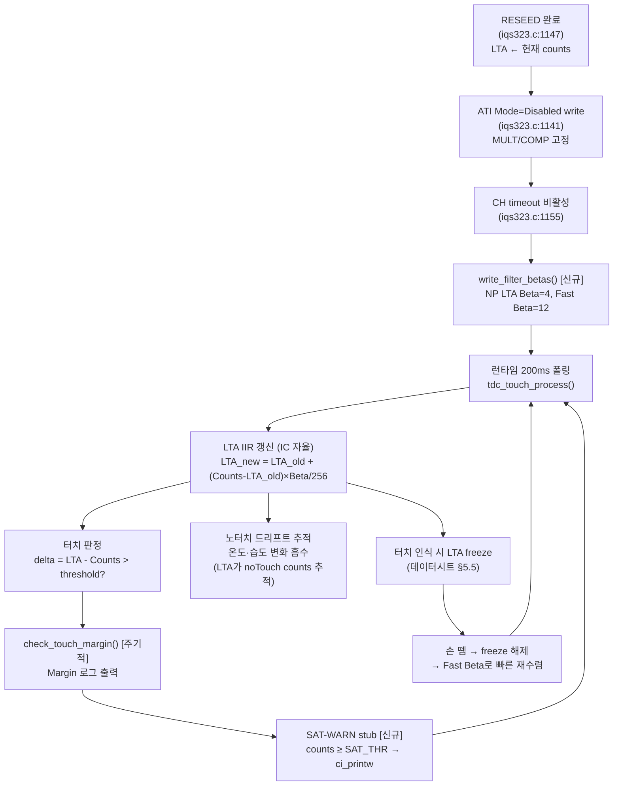

# 15 — 계획: RESEED 후 LTA IIR 드리프트 추적 + counts 포화 감지 stub

**TL;DR**: LTA IIR은 데이터시트 §5.6 수식(`LTA_new = LTA_old + (Counts - LTA_old) × Beta/256`)으로 동작하며, 현 펌웨어는 Beta write가 0건(POR default 0x0000)이다. Beta POR default=0은 LTA가 전혀 추적하지 않음을 의미하므로, 노터치 게이트+RESEED 이후 환경 드리프트를 IIR로 흡수하려면 Beta를 설정해야 한다. counts 포화 감지 stub는 `tdc_drv_iqs323_check_touch_margin()` 내 Counts 읽기를 확장해 `[TOUCH] SAT-WARN` 경보를 출력하는 ~10줄 구조로 구현한다.

---

## 0. 전제 및 현황 요약 (시스템 검증 완료)

| 전제 | 코드 근거 | 본 페르소나 임무 관련 함의 |
|---|---|---|
| 절전 복귀 = WDT 리셋 재부팅 | `main.c:944~952` | 절전/부팅 통합 → LTA IIR 수렴은 항상 "부팅 후 런타임"에서 이루어짐 |
| 매 부팅 MCLR + Auto-ATI → 고정 MULT/COMP write → ATI Disabled | `iqs323.c:651, 700~726, 1147, 1155` | Auto-ATI 후 RESEED 완료 시점이 LTA IIR 추적 시작 기점 |
| RESEED = 현재 counts로만 seed | `iqs323.c:945` (`0x08` to 0xC0) | LTA ← 현재 counts 으로 초기화. 이후 IIR이 환경 drift 추적 담당 |
| **BETA write 0건 → POR default 0x0000** | `분석.md §핵심 발견 #6`: BETA 0xB0~B4 write 없음 확정 | **Beta=0이면 LTA IIR 갱신 없음** → 드리프트 추적 불능 → 현 상태는 LTA 고착 |
| CH0 Filtered Counts 레지스터: 0x13 | `tdc_drv_iqs323.h:45` | counts 포화 감지 stub가 읽는 레지스터 |
| CH0 LTA 레지스터: 0x14 | `tdc_drv_iqs323.h:46` | LTA 읽기 경로 존재 (`iqs323.c:1200` `read_touch_margin()`) |

---

## 1. LTA IIR 메커니즘 — 데이터시트 §5.5·§5.6 확정

### 1.1 IIR 수렴 수식

$$\text{LTA}_{\text{new}} = \text{LTA}_{\text{old}} + (\text{Counts} - \text{LTA}_{\text{old}}) \times \frac{\text{Beta}}{256}$$

(데이터시트 §5.6, `에이전트-로그/v2/14_datasheet-verify.md §4` 확정)

- Beta는 4비트(0~15)
- alpha = Beta/256 → Beta=8일 때 alpha≈3.1%, Beta=15일 때 ≈5.9%
- **항상 강한 스무딩 구조** — 가장 빠른 Beta=15라도 단일 샘플 반영률 5.9%뿐
- 전력 모드별 3종 별도 레지스터: `Counts Filter Betas`, `LTA Filter Betas`, `LTA Fast Filter Betas`
- **LTA 동결 조건**: touch 또는 proximity 이벤트 중 LTA 갱신 중단(§5.5 확정)

### 1.2 Fast Filter Band 비대칭

> 데이터시트 §5.6: Counts가 LTA 대비 sensing **반대 방향**(noTouch 방향)으로 Fast Filter Band 이상 drift하면 fast beta 적용, 그 미만이면 normal beta.

- **비대칭 설정 실익** (`분석.md §3-A`, 은수님6 통찰): 약터치 방향(터치 방향)에는 느린 Beta(오인식 억제), 노터치 복귀 방향에는 빠른 Fast Beta(LTA 빠른 재수렴). 단일 Beta 상향의 "약터치 흡수" 부작용 회피.
- 현 펌웨어 0xB0~0xB4 write 없음 → POR default 0x0000 → **비대칭 미적용, LTA IIR 사실상 정지**

### 1.3 POR default 0x0000 함의

> [!IMPORTANT]
> `분석.md §핵심 발견 #6`: BETA 레지스터(0xB0~0xB4) write 0건 확정. POR default=0x0000이면 Beta=0 → alpha=0 → LTA_new = LTA_old (LTA 불변).
>
> **즉 현재 펌웨어는 RESEED 이후 LTA가 전혀 변하지 않는다.** 환경 드리프트가 발생해도 LTA가 추적하지 않아, counts가 장기 이동할 경우 delta가 누적 오차를 가질 수 있다. [확정: 코드 grep 근거]

POR default 확인 필요 — IQS323 데이터시트가 Beta POR default를 0이라 명시하는지, 아니면 다른 값인지 실측으로 교차 확인 필요. [확정 필요: 데이터시트 POR table 또는 MCLR 후 0xB0 read 실측]

---

## 2. Beta 설정 설계

### 2.1 Beta 레지스터 맵 (데이터시트 §5.6 구조)

현재 코드에 0xB0~0xB4 write가 없으므로 신규 write 구현이 필요하다.

```c
/* IQS323 Filter Betas 레지스터 맵 (데이터시트 §5.6 기반) [확정 필요: 정확한 주소·비트 레이아웃] */
/* 0xB0: NP Counts Filter Betas
   0xB1: LP Counts Filter Betas
   0xB2: NP LTA Filter Betas
   0xB3: LP LTA Filter Betas
   0xB4: NP/LP LTA Fast Filter Betas */
```

### 2.2 Beta 값 설계 원칙

| 상황 | 권장 전략 | 이유 |
|---|---|---|
| **LTA 느린 드리프트 추적 (noTouch drift 방향)** | Beta = 4~8 (alpha ≈ 1.6~3.1%) | 온도·습도 변화(수 분~수십 분 단위)에 따라가되 급격한 단기 변화는 스무딩 |
| **LTA 빠른 복귀 (Fast Beta, 터치 해제 후 노터치 방향)** | Beta = 12~15 (alpha ≈ 4.7~5.9%) | 손 뗌 후 LTA가 noTouch counts로 신속 재수렴 → 자기치유 속도 향상 |
| **약터치 방향(터치 방향) LTA 억제** | Beta(LTA, 터치 방향)는 낮게 | 약터치 시 LTA가 터치값을 학습해 threshold 소진하는 것 방지 |

> **비대칭 설정 목표**: 노터치 방향 Fast Beta = 12 이상, LTA Beta (normal) = 4~6 [추정: 실측_Beta 선행 후 조정].

### 2.3 수렴 시간 정량 (Beta=4, 폴링 주기 200ms 기준)

$$\text{수렴 샘플 수(95\%)} \approx \frac{1}{\alpha} \times \ln\!\left(\frac{1}{0.05}\right) = \frac{256}{4} \times 3 \approx 192\text{ 샘플}$$

$$192 \text{ 샘플} \times 200\text{ms} \approx 38.4\text{ 초} \quad [\text{추정: 폴링 주기 실측 필요}]$$

- **Beta=4 → 약 40초**: 온도 변화 정도의 느린 drift(수 분)에 충분히 따라감 [추정]
- **Beta=12 → 약 13초**: 손 뗌 후 LTA 재수렴에 적당한 속도 [추정]

[확정 필요: 실측_Beta — 실제 폴링 주기 및 Beta별 수렴 속도 RTT로 측정]

### 2.4 구현 위치 및 코드 윤곽

```c
/* tdc_drv_iqs323.c — apply_settings() 또는 별도 write_filter_betas() 함수 신설 */

/* IQS323 Filter Betas 레지스터 주소 (신규 — 데이터시트 §5.6 확인 후 정확한 주소 기재) */
/* [확정 필요] 아래 주소는 IQS323 데이터시트 §5.6 레지스터 맵 기준 추정값 */
#define TDC_DRV_IQS323_REG_ADDR_NP_LTA_FILTER_BETA  0xB2  /* NP LTA Filter Betas */
#define TDC_DRV_IQS323_REG_ADDR_NP_LTA_FAST_BETA    0xB4  /* NP LTA Fast Filter Betas */

/* LTA Beta 설정값 (실측_Beta 전 초기 추정값) */
#define TDC_DRV_IQS323_LTA_BETA_NORMAL  4   /* alpha ≈ 1.6%, 느린 드리프트 추적 */
#define TDC_DRV_IQS323_LTA_FAST_BETA    12  /* alpha ≈ 4.7%, 노터치 복귀 빠른 수렴 */

static bool write_filter_betas(void)
{
    /* NP 모드 LTA Beta: LSB=LTA_BETA_NORMAL, MSB=LTA_FAST_BETA (비트 레이아웃 확인 필요) */
    if (!write_register(TDC_DRV_IQS323_REG_ADDR_NP_LTA_FILTER_BETA,
                        TDC_DRV_IQS323_LTA_BETA_NORMAL,
                        TDC_DRV_IQS323_LTA_FAST_BETA))
    {
        ci_printe("[TOUCH] FAIL: LTA Beta write\r\n");
        return false;
    }
    ci_printv("[TOUCH] LTA Beta NP=%u Fast=%u\r\n",
              TDC_DRV_IQS323_LTA_BETA_NORMAL, TDC_DRV_IQS323_LTA_FAST_BETA);
    return true;
}
```

> [!IMPORTANT]
> `write_filter_betas()` 호출 시점: RESEED 완료 후, ATI Disabled 설정 직후 (현재 `iqs323.c:1155` CH timeout 비활성 직후). RESEED 전 Beta 설정은 의미 없음 — RESEED로 LTA가 리셋된 후 IIR이 동작해야 하므로.
>
> **[확정 필요]**: 0xB0~0xB4 레지스터 정확한 주소·비트 레이아웃은 IQS323 데이터시트 §5.6 레지스터 맵에서 확인 후 기재. 현재 코드에 이 레지스터 define이 없으므로 신규 추가 필요.

---

## 3. counts 포화 감지 stub 설계

### 3.1 포화 문제 정의 (명제_J 반증 경로)

`개념정리_터치동작모델.md §6`, `분석.md §3 명제_J`:

- Fixed 구조에서 noTouch counts가 환경 drift로 Max Counts에 근접하면 → 터치 시 counts 감소폭(Δcounts) 제한 → `delta = LTA − Counts < Touch Threshold` → **터치 미인식(침묵 실패)**
- 이 실패는 경보 없이 조용히 발생("침묵 실패") → 조기 감지 stub가 없으면 필드에서 파악 불가

### 3.2 stub 구현 목표

- **Phase 0** 우선 — FIXED/ATI Full 전환과 무관하게 즉시 적용 가능
- **런타임 경보 전용**: CI printf로 경보만 출력, 동작 변경 없음(stub 수준)
- **구현 규모**: ~10줄 추가로 기존 `tdc_drv_iqs323_check_touch_margin()` 함수 내 Counts 읽기 확장

### 3.3 구현 위치 및 코드 윤곽

```c
/* tdc_drv_iqs323.c 내 tdc_drv_iqs323_check_touch_margin() (iqs323.c:1185~1228) 확장 */

/* counts 포화 경보 임계값 (Max Counts 실측 전 임시값) */
/* [확정 필요]: Max Counts 실측_V2 후 실제 상한값으로 교체 */
#define TDC_DRV_IQS323_COUNTS_SAT_WARN_THRESHOLD   800u  /* [추정] Max Counts 대비 ~78% 수준 */
#define TDC_DRV_IQS323_COUNTS_LOW_WARN_THRESHOLD    50u  /* [추정] 너무 낮으면 분해능 부족 */

/* 기존 check_touch_margin() 내 counts 읽기(iqs323.c:1208) 직후 아래 추가 */

    /* [stub] counts 포화 경보 — Phase 0, 동작 변경 없음 */
    if (counts >= TDC_DRV_IQS323_COUNTS_SAT_WARN_THRESHOLD)
    {
        ci_printw("[TOUCH] SAT-WARN: counts=%u >= thr=%u (포화 근접 — 침묵 실패 위험)\r\n",
                  counts, TDC_DRV_IQS323_COUNTS_SAT_WARN_THRESHOLD);
    }
    else if (counts <= TDC_DRV_IQS323_COUNTS_LOW_WARN_THRESHOLD && counts > 0u)
    {
        ci_printw("[TOUCH] LOW-WARN: counts=%u <= thr=%u (분해능 부족 위험)\r\n",
                  counts, TDC_DRV_IQS323_COUNTS_LOW_WARN_THRESHOLD);
    }
    /* stub 끝 — counts는 이후 기존 margin 계산에 그대로 사용 */
```

> [!NOTE]
> `check_touch_margin()`은 현재 `TDC_TOUCH_MARGIN_LOG_ENABLE=1` 시 `TDC_TOUCH_MARGIN_LOG_INTERVAL` 주기마다 호출된다(`tdc_touch_config.h:133,141`). 포화 경보도 동일 주기로 자연히 출력된다. 별도 폴링 루프 신설 불필요.

### 3.4 Max Counts 확인 선행 필요 [확정 필요]

현재 Max Counts 실제값 미확정:
- IQS323 데이터시트에서 Max Counts(ADC 상한) 확인 필요
- 또는 전극 완전 차폐(=무한 정전용량 시뮬레이션) 후 RTT counts 관찰
- 포화 임계값 `TDC_DRV_IQS323_COUNTS_SAT_WARN_THRESHOLD = 800` [추정]은 실측_V2 후 교체 필요

---

## 4. RESEED 후 LTA IIR 드리프트 추적 전체 시퀀스



---

## 5. 구현 단계 분류 및 우선순위

### Phase 0 (즉시 — 동작 변경 없음)

| 항목 | 구현 내용 | 위치 | 규모 |
|---|---|---|---|
| **counts 포화 감지 stub** | `check_touch_margin()` 내 SAT-WARN·LOW-WARN 경보 | `tdc_drv_iqs323.c:1208` 직후 | ~10줄 |
| **SAT/LOW 임계값 define** | `TDC_DRV_IQS323_COUNTS_SAT_WARN_THRESHOLD = 800` [추정] | `tdc_drv_iqs323.h` | +2 define |

### Phase 2 (Beta 설정 — 노터치 게이트 + RESEED 구현 이후)

| 항목 | 구현 내용 | 위치 | 규모 | 선행 조건 |
|---|---|---|---|---|
| **Beta 레지스터 define 추가** | 0xB2·0xB4 주소 define | `tdc_drv_iqs323.h` | +4 define | 데이터시트 §5.6 레지스터 주소 확인 |
| **write_filter_betas() 함수** | NP LTA Beta·Fast Beta write | `tdc_drv_iqs323.c` | ~20줄 | 주소 확정 |
| **apply_settings() 내 호출** | RESEED 완료 후 write_filter_betas() 호출 | `iqs323.c:1155` 직후 | +2줄 | 함수 구현 |
| **실측_Beta 후 값 조정** | LTA_BETA_NORMAL·FAST_BETA 실측 근거로 교체 | define 수정 | +0줄 | RTT 실측 |

---

## 6. 미확정 항목 및 확정 방법

| 항목 | 현재 상태 | 확정 방법 | Phase |
|---|---|---|---|
| **POR default Beta 값** | [추정] 0 — Beta=0이면 LTA 완전 고착 | MCLR 후 0xB0 register read RTT 확인 | Phase 2 전 선행 |
| **Beta 레지스터 정확한 주소·비트 레이아웃** | [추정] 0xB0~0xB4 | IQS323 데이터시트 §5.6 레지스터 맵 확인 | Phase 2 전 선행 |
| **실측_Beta: Beta별 LTA 수렴 시간** | [추정] Beta=4→40s, Beta=12→13s | RTT counts·LTA 동시 로그, 환경 변화 시 수렴 관찰 | Phase 2 이후 |
| **Max Counts 실제값 (실측_V2)** | [확정 필요] SAT_WARN_THRESHOLD 임시 800 | 전극 차폐 후 RTT counts 상한 측정 | Phase 0 이후 즉시 |
| **NP vs LP 모드 분리 필요 여부** | [추정] NP 모드만 사용 | 절전 모드 Beta 별도 필요 여부 확인 | Phase 2 |
| **노터치 방향 vs 터치 방향 Beta 비대칭 레지스터 구조** | [추정] Fast Filter Band 이용 | 데이터시트 §5.6 Fast Filter Band 비트 레이아웃 확인 | Phase 2 |

---

## 7. 기존 코드와의 정합성

### 7.1 PROX_THRESHOLD와 LTA freeze 관계

`tdc_touch_config.h:150` `TDC_TOUCH_PROX_THRESHOLD_ENABLE=0` (기본 비활성):
- Prox threshold 비활성 시 prox 이벤트 미생성 → LTA freeze가 prox 이벤트로 발생하지 않음 → LTA 추적 더 자유로움 [추정]
- Beta 설정과 동시에 prox threshold 활성화 여부를 검토 필요 [확정 필요]

### 7.2 `s_boot_touch_ignore`와의 상호작용

- Beta가 0(현재 상태)이면 부팅 직후 LTA가 고착되어 있어 `s_boot_touch_ignore` 5초 기간 이후에도 baseline이 RESEED 시점 값 그대로 유지됨
- Beta 설정 후: RESEED 이후 LTA가 천천히 noTouch counts를 추적하므로 `s_boot_touch_ignore` 해제 후 LTA가 정상 추적 중인 상태가 된다
- 이는 noTouch 게이트 + RESEED + Beta 설정의 조합이 올바르게 동작하는 전제

### 7.3 자기치유(Self-heal) 속도

`07_사후검증자기치유.md §3`:
- 현재 Beta=0 → LTA freeze 해제 후에도 LTA가 추적하지 않음 → 자기치유 동작 불가 [추정]
- Beta 설정(특히 Fast Beta=12) → 손 뗌 후 LTA 빠른 재수렴 → 자기치유 메커니즘 실질 활성화

> [!IMPORTANT]
> **Beta 설정은 자기치유 메커니즘의 필수 선행 조건이다.** `07_사후검증자기치유.md §3.1`에서 "LTA IIR이 수 초 내 noTouch counts 재수렴"이라고 설명하나, 이는 Beta가 적절히 설정된 경우에만 성립한다. 현재 Beta=0이라면 자기치유는 실질적으로 동작하지 않는다.

---

## 8. 핵심 결론 (7줄)

1. **현재 BETA write 0건 → POR default 0 → LTA IIR 추적 사실상 정지**: RESEED 후 LTA가 환경 드리프트를 전혀 추적하지 못하는 상태. `분석.md §발견 #6` 확정.
2. **Beta 설정 원칙**: NP LTA Beta=4(alpha≈1.6%, 느린 드리프트 흡수), Fast Beta=12(alpha≈4.7%, 노터치 복귀 빠른 수렴) 비대칭 설정 — 약터치 방향 LTA 학습 억제와 노터치 복귀 속도를 동시 최적화. [추정: 실측_Beta 후 조정]
3. **구현 위치**: `write_filter_betas()` 신설, `iqs323.c:1155`(CH timeout 비활성) 직후 호출. 레지스터 주소 0xB2·0xB4 [확정 필요: 데이터시트 §5.6].
4. **counts 포화 감지 stub**: `check_touch_margin()` 내 counts 읽기(L1208) 직후 ~10줄 추가. `counts ≥ 800` → `[TOUCH] SAT-WARN` 경보, 동작 변경 없음. SAT 임계 800은 [추정], 실측_V2 후 교체.
5. **Phase 0 즉시 적용 가능**: counts 포화 감지 stub는 ATI 모드·노터치 게이트 구현 전에 독립적으로 적용. 침묵 실패 조기 감지 목적.
6. **Beta 설정이 자기치유의 선행 조건**: `07_사후검증자기치유.md §3`의 "손뗌 후 LTA IIR 수 초 수렴" 메커니즘은 Beta=0 현재 상태에서 동작하지 않음. Phase 2 Beta 설정 완료 후 자기치유 실질 활성화.
7. **실측 선행 필요 2건**: ① POR default Beta 값(MCLR 후 0xB0 read) — Beta=0 확인 후 Phase 2 착수, ② Max Counts(실측_V2) — SAT_WARN 임계값 확정 및 FIXED 안전마진 판단.
