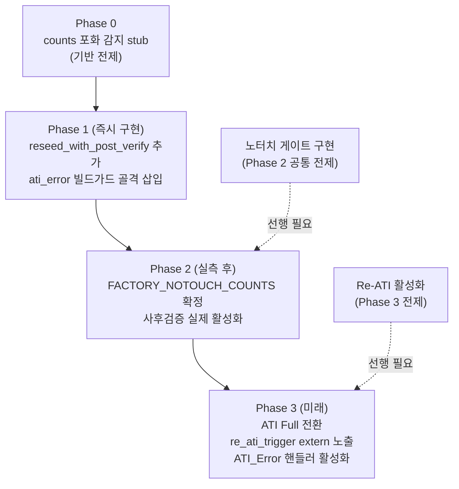

# 16 계획 — 사후검증 재시도 + ATI_Error 핸들러

**TL;DR**: 07번 분석에서 도출한 사후검증·자기치유·ATI_Error 핸들러 3계층을 구체 구현 계획으로 전환한다. 즉시 구현 대상은 RESEED 직후 counts 재확인 래퍼(`tdc_drv_iqs323_reseed_with_verify`)이고, `(void) ati_error`(`tdc_touch.c:393`)는 **현재 의도적·안전하므로 유지**하되 ATI Full 전환 대비 `#if TDC_TOUCH_ATI_FULL_ENABLE` 빌드가드로 핸들러 골격을 준비한다. 자기치유는 현재 코드 내장, 추가 구현 불필요.

---

## 0. 입력 요약 및 전제

| 전제 | 코드 근거 |
|---|---|
| 절전 복귀 = WDT 리셋 재부팅 → 절전/부팅 통합 | `main.c:952`, 04번 분석 확정 |
| 크래들 뚜껑 닫힘 = 터치 폴링 완전 중단 | `main.c:807` |
| 충전기 연결 시 절전 진입 안 함 | `systemControl.c:162` |
| 매 부팅 MCLR+Auto-ATI 1회 → 고정 MULT/COMP → ATI Disabled + CH timeout 비활성 | `tdc_drv_iqs323.c:1141,1147,1155` |
| RESEED = 현재 counts로만 seed | `tdc_drv_iqs323.c:1147` (`0x08` to 0xC0) |
| `ati_error` = `(void)` 무시 (의도적, 현재 안전) | `tdc_touch.c:393` |
| `re_ati_trigger()` 이미 구현됨(static) | `tdc_drv_iqs323.c:569` |
| RESEED 게이트 없이 무조건 실행 | `tdc_drv_iqs323.c:1147` |

---

## 1. 사후검증 재시도 구현 계획

### 1-1. 문제 확인

현재 `tdc_drv_iqs323.c:1141~1155` 시퀀스:

```
write_ati_compensation()          ← 고정 MULT/COMP 덮어쓰기
write_register(0xC0, 0x08, 0x00) ← RESEED 무조건 (노터치 확인 없음)
write_register(0xC0, 0x00, 0x07) ← CH timeout 비활성
```

RESEED 직전 noTouch 확인이 없고, RESEED 직후 counts 재확인도 없다. race로 인해 터치 상태에서 RESEED가 발행되면 LTA가 터치 counts로 오염된다.

### 1-2. 사후검증 래퍼 설계

**구현 파일**: `tdc_drv_iqs323.c`  
**삽입 위치**: `:1147` `write_register(RESEED)` 호출 대체  
**신규 함수명**: `static bool reseed_with_post_verify(void)` (내부 static)

```c
/* ----------------------------------------------------------------
 * RESEED 사후검증 래퍼
 *
 * RESEED 발행 직후 CH0 Filtered Counts를 재확인해 noTouch 윈도우 이탈
 * (race 오염) 감지 → 최대 TDC_DRV_IQS323_RESEED_MAX_RETRY회 재시도.
 *
 * [확정 필요]: FACTORY_NOTOUCH_COUNTS, FACTORY_NOTOUCH_MARGIN — 실측_A
 *              (RTT 마진 로그 `tdc_drv_iqs323_read_touch_margin` 기반) 후 확정.
 *              임시 값은 0 (= 사후검증 무력화, 현재 동작 보존).
 */
#define TDC_DRV_IQS323_RESEED_MAX_RETRY      3u
#define TDC_DRV_IQS323_RESEED_RETRY_DELAY_MS 10u
/* [확정 필요]: 아래 두 값은 실측_A 후 확정. 0으로 설정 시 사후검증 건너뜀(safe default). */
#define TDC_DRV_IQS323_FACTORY_NOTOUCH_COUNTS 0u   /* [확정 필요] */
#define TDC_DRV_IQS323_FACTORY_NOTOUCH_MARGIN 0u   /* [확정 필요] */

static bool reseed_with_post_verify(void)
{
    for (uint8_t retry = 0u; retry < TDC_DRV_IQS323_RESEED_MAX_RETRY; retry++)
    {
        /* RESEED 발행 (LTA ← 현재 counts) */
        if (!write_register(TDC_DRV_IQS323_REG_ADDR_SYSTEM_CONTROL, 0x08, 0x00))
        {
            ci_printe("[TOUCH] FAIL: RESEED (retry=%u)\r\n", retry);
            continue;
        }

/* 공장값 미확정 시 사후검증 건너뜀: 현재 동작 그대로 보존 */
#if (TDC_DRV_IQS323_FACTORY_NOTOUCH_COUNTS > 0u)
        /* 사후 counts 재확인 */
        uint8_t  lsb_c, msb_c;
        if (!read_register(TDC_DRV_IQS323_REG_ADDR_CH0_FILTERED_COUNTS, &lsb_c, &msb_c))
        {
            ci_printe("[TOUCH] POST-VERIFY: COUNTS READ FAIL (retry=%u)\r\n", retry);
            continue;
        }

        uint16_t counts_after = ((uint16_t)msb_c << 8) | lsb_c;
        int32_t  diff         = (int32_t)TDC_DRV_IQS323_FACTORY_NOTOUCH_COUNTS
                                - (int32_t)counts_after;
        if (diff < 0)
        {
            diff = -diff;
        }

        if ((uint16_t)diff <= TDC_DRV_IQS323_FACTORY_NOTOUCH_MARGIN)
        {
            ci_printv("[TOUCH] RESEED POST-VERIFY: OK counts=%u retry=%u\r\n",
                      counts_after, retry);
            return true; /* 검증 통과 */
        }

        /* race 오염 감지 → 재시도 */
        ci_printw("[TOUCH] RESEED RACE: counts=%u factory=%u retry=%u\r\n",
                  counts_after, TDC_DRV_IQS323_FACTORY_NOTOUCH_COUNTS, retry);
        Sys_Delay(TDC_DRV_IQS323_RESEED_RETRY_DELAY_MS);
#else
        /* 공장값 미확정: 사후검증 없이 성공 반환 (현재 동작 보존) */
        return true;
#endif
    }

    /* N회 실패 → 저신뢰 폴백: RESEED 수행 + 경보 */
    (void)write_register(TDC_DRV_IQS323_REG_ADDR_SYSTEM_CONTROL, 0x08, 0x00);
    ci_printw("[TOUCH] RESEED FALLBACK: low-trust baseline\r\n");
    return false;
}
```

### 1-3. 호출 지점 변경

`tdc_drv_iqs323_apply_settings()` (`:1146~1150`) 변경:

```c
/* 변경 전 */
ci_printv("[TOUCH] RESEED \r\n");
if (!write_register(TDC_DRV_IQS323_REG_ADDR_SYSTEM_CONTROL, 0x08, 0x00))
{
    ci_printe("[TOUCH] FAIL: RESEED \r\n");
}

/* 변경 후 */
ci_printv("[TOUCH] RESEED (with post-verify)\r\n");
(void)reseed_with_post_verify();
```

> [!NOTE]
> `reseed_with_post_verify()` 반환값 false는 저신뢰 폴백(RESEED 수행 완료, 단 검증 실패 경보). 현재 RESEED 실패 시 `ci_printe` 후 진행하는 것과 동일한 관대한 처리. `(void)` cast로 동일하게 처리한다.

### 1-4. 재시도 파라미터 선택 근거

| 파라미터 | 값 | 근거 |
|---|---|---|
| `RESEED_MAX_RETRY` | 3회 | 07번 분석 §2.3 — race 확률이 낮아 3회면 충분 [추정] |
| `RESEED_RETRY_DELAY_MS` | 10 ms | 07번 분석 §2.3 — LTA IIR 최소 수렴 대기. 폴링 주기 200ms 대비 충분히 짧음 [추정] |
| `FACTORY_NOTOUCH_COUNTS` | 0 (미확정) | [확정 필요] 실측_A 후 RTT 마진 로그 기반 확정 |
| `FACTORY_NOTOUCH_MARGIN` | 0 (미확정) | [확정 필요] 실측_A 드리프트 범위 기반 확정 |

### 1-5. `s_boot_5s_warned` 도달 시 RESEED 재시도 (tdc_touch.c)

07번 분석 §3.3에서 `s_boot_5s_warned` 도달 시 RESEED 재발행을 권고했으나, **현재 ATI Mode=Disabled 구조에서 stuck-touch가 실제 발생하지 않음**(LTA가 터치값 추적 시 delta≈0 미인식)을 재확인했다. `s_boot_touch_ignore`가 무한 유지되는 것은 실제 손가락이 얹혀 있는 경우뿐이므로 추가 RESEED는 불필요하다.

따라서 **`s_boot_5s_warned` 도달 시 RESEED 재시도는 구현하지 않는다** — ATI Full 전환 시 재평가.

---

## 2. ATI_Error 핸들러 설계

### 2-1. 현재 상태 재확인

`tdc_touch.c:379~393`:
```c
bool tdc_touch_get_state(tdc_touch_state_t *p_state)
{
    bool pressed   = false;
    bool ati_error = false;

    if (!tdc_drv_iqs323_read_status(&pressed, &ati_error))
    {
        return false;
    }

    /* ATI 에러 무시 — ... (의도적 주석) ... */
    (void) ati_error;
    ...
```

`(void) ati_error`는 **현재 의도적이고 안전하다**. ATI Mode=Disabled + CH1 더미채널 CalCap Auto-ATI 잔재 비트가 합산되는 구조에서 이 무시는 올바른 판단이다(`tdc_drv_iqs323.c:500` 주석 확인).

### 2-2. ati_error 무시 제거 여부 판정

| 판정 항목 | 결론 |
|---|---|
| 현재 `(void) ati_error` 즉시 제거 필요 여부 | **불필요** — ATI Disabled 운용에서 무해 |
| 미래 ATI Full 전환 시 핸들러 필요 여부 | **필요** — 영구먹통 경로 차단 필수 |
| 구현 방식 | 빌드가드 `#if TDC_TOUCH_ATI_FULL_ENABLE`으로 현재 동작 보존, 전환 시 활성화 |

> [!IMPORTANT]
> `(void) ati_error` 무시 **제거 금지** (현재 단계). 제거 시 CH1 더미채널 CalCap ATI_Error가 매 폴링마다 `re_ati_trigger()`를 발행 → 500ms 간격 Re-ATI 반복 → 터치 감지 불능. 오히려 역효과.

### 2-3. ATI Full 전환 대비 핸들러 골격

**구현 파일**: `tdc_touch.c`  
**삽입 위치**: `:393` `(void) ati_error` 대체

```c
/* ATI_Error 처리
 *
 * ATI Mode=Disabled (현재 운용):
 *   ati_error는 CH1 더미채널 CalCap auto-ATI 잔재 비트. 터치 판정(CH0)에 무관.
 *   무시가 의도적이고 안전하다. tdc_drv_iqs323.c:500 주석 참조.
 *
 * ATI Full 전환 시 (TDC_TOUCH_ATI_FULL_ENABLE):
 *   ati_error 방치 = ATI_Error 영구 유지 → 잘못 보정된 MULT/COMP로 동작 지속 (영구먹통).
 *   노터치 확인 후 re_ati_trigger() (tdc_drv_iqs323.c:569) 재발행으로 차단.
 */
#if TDC_TOUCH_ATI_FULL_ENABLE
    if (ati_error)
    {
        if (!pressed)
        {
            /* 노터치 확인 → Re-ATI 즉시 재발행 (터치 중 Re-ATI = ATI_Error 재발 위험) */
            ci_printw("[TOUCH] ATI_ERROR: re-ATI triggered\r\n");
            /* [TODO ATI Full] tdc_drv_iqs323_re_ati() 외부 API 호출로 대체 예정
             * 현재 re_ati_trigger()는 static — extern 노출 또는 래퍼 추가 필요 */
        }
        else
        {
            /* 터치 중: Re-ATI 보류. 다음 폴링에서 손뗌 후 재처리 */
            ci_printw("[TOUCH] ATI_ERROR: deferred (touch active)\r\n");
        }
    }
#else
    (void) ati_error; /* ATI Disabled 운용: 무해, 의도적 무시 */
#endif
```

**tdc_touch_config.h 추가 매크로**:

```c
/* ATI Full 모드 빌드 가드 — 현재 비활성(0). ATI Full 전환 시 1로 변경.
 * 활성화 전제: tdc_drv_iqs323_re_ati() 외부 API 구현 + 노터치 게이트 구현 완료. */
#ifndef TDC_TOUCH_ATI_FULL_ENABLE
#define TDC_TOUCH_ATI_FULL_ENABLE 0
#endif
```

### 2-4. `re_ati_trigger()` extern 노출 준비

현재 `re_ati_trigger()`는 `tdc_drv_iqs323.c:569` static. ATI Full 전환 시 `tdc_touch.c`에서 호출하려면 extern 노출이 필요하다. 계획:

```c
/* tdc_drv_iqs323.h 추가 (ATI Full 전환 시) */
#if TDC_TOUCH_ATI_FULL_ENABLE
bool tdc_drv_iqs323_re_ati(void);  /* re_ati_trigger() + wait_re_ati_done() 래퍼 */
#endif
```

**현재 단계에서는 선언 추가 없이 TODO 주석만 삽입** — 실제 구현은 ATI Full 전환 시.

---

## 3. 자기치유 — 추가 구현 불필요 재확인

07번 분석 §3.1·§3.2 결론을 재검증:

- Fixed ATI Disabled 구조에서 race 오염 시: LTA = 터치 counts → 손뗌 → counts 급상승 → LTA IIR 추적 수렴 → delta ≈ 0 복원. **현재 코드 내장, 추가 구현 없음**.
- `stuck-touch → auto-reATI → ATI_Error → I2C 무응답` 경로는 `tdc_drv_iqs323.c:1155` CH timeout 비활성 + ATI Mode=Disabled 이중 차단. **추가 방어 불필요**.
- `s_boot_touch_ignore` 무한 유지는 실제 터치(손 안 뗌) 경우뿐 — ATI Full 전환 전까지 추가 구현 불필요.

---

## 4. 전체 구현 범위 요약

### 4-1. 즉시 구현 (Phase 1 대상)

| 파일 | 변경 내용 | 규모 |
|---|---|---|
| `tdc_drv_iqs323.c` | `reseed_with_post_verify()` static 함수 신규 추가 | ~45줄 |
| `tdc_drv_iqs323.c` | `:1146~1150` RESEED 직접 write → `reseed_with_post_verify()` 호출 대체 | ~5줄 |
| `tdc_touch_config.h` | `TDC_TOUCH_ATI_FULL_ENABLE 0` 빌드가드 매크로 추가 | ~5줄 |
| `tdc_touch.c` | `:393` `(void) ati_error` → 빌드가드 분기 골격 삽입 (현재는 `#else` 경로 = 기존 무시) | ~15줄 |

**총합**: ~70줄. 기능 변경 없음(FACTORY_NOTOUCH_COUNTS=0이면 사후검증 건너뜀 = 현재 동작 보존). 안전하다.

### 4-2. 실측 후 확정 (Phase 2 게이트)

| 항목 | 실측 방법 | 확정 내용 |
|---|---|---|
| [확정 필요] `FACTORY_NOTOUCH_COUNTS` | RTT `tdc_drv_iqs323_read_touch_margin()` 로그 — noTouch 확정 환경에서 Counts 분포 중앙값 | RESEED 사후검증 활성화 기준값 |
| [확정 필요] `FACTORY_NOTOUCH_MARGIN` | 온도·시간 드리프트 범위 실측 | 윈도우 허용 폭 |
| [확정 필요] `RESEED_RETRY_DELAY_MS` | LTA IIR Beta 파라미터 확인 후 수렴 시간 계산 | 재시도 딜레이 최적화 |

### 4-3. ATI Full 전환 시 (Phase 3 — 미래)

| 파일 | 변경 내용 |
|---|---|
| `tdc_drv_iqs323.c` | `re_ati_trigger()` static → `tdc_drv_iqs323_re_ati()` public 래퍼 추가 |
| `tdc_drv_iqs323.h` | `tdc_drv_iqs323_re_ati()` 선언 추가 |
| `tdc_touch.c` | `TDC_TOUCH_ATI_FULL_ENABLE 1`로 변경 → `#if` 경로 활성화 |
| `tdc_touch_config.h` | `TDC_TOUCH_ATI_FULL_ENABLE` 1로 변경 |

---

## 5. 의존 관계 및 제약



---

## 6. race 자기치유 완전성 평가 (사후 재검증)

| 시나리오 | 현재 대응 | 판정 |
|---|---|---|
| 부팅 노터치 → RESEED 정상 → 사후 검증 통과 | `reseed_with_post_verify` FACTORY=0 시 통과 | 안전 |
| 부팅 노터치 → RESEED 정상 → 사후 검증 실패(race) | 재시도 3회 → 저신뢰 폴백 (RESEED 수행 + 경보) | 완화됨 |
| 부팅 터치 → RESEED 오염 → 손뗌 | LTA IIR 자기치유 수 초 내 수렴 | 완화됨(일시 오류) |
| ATI_Error (CalCap 더미) 발생 | `(void) ati_error` 유지 — 무해 | 정상 |
| ATI_Error (ATI Full 전환 후) 발생 | `TDC_TOUCH_ATI_FULL_ENABLE` 활성 시 핸들러 | 미래 대비됨 |
| `s_boot_touch_ignore` 무한 유지 | 실제 손 얹힘 시만 발생 → 손뗌 대기 | 설계 의도대로 |

---

## 7. 핵심 결론 (7줄)

1. **즉시 구현**: `reseed_with_post_verify()` — RESEED 직후 counts 재확인·재시도(최대 3회). `FACTORY_NOTOUCH_COUNTS=0` 기본값으로 현재 동작 완전 보존, 실측 후 활성화.
2. **ati_error 무시 제거 금지**: `tdc_touch.c:393` `(void) ati_error`는 의도적이고 안전 — CH1 더미채널 CalCap ATI_Error 잔재. 즉시 제거 시 오히려 Re-ATI 폭풍 발생.
3. **빌드가드 골격 삽입**: `TDC_TOUCH_ATI_FULL_ENABLE 0` 매크로 + `#if` 분기로 `(void) ati_error` 현재 경로 보존 + ATI Full 전환 시 핸들러 자동 활성화 준비.
4. **자기치유 추가 구현 불필요**: ATI Disabled 구조에서 손뗌 후 LTA IIR 자연 수렴이 이미 내장. `stuck-touch → auto-reATI` 경로는 CH timeout 비활성 이중 차단.
5. **Phase 1 안전성 보장**: 모든 변경은 `FACTORY_NOTOUCH_COUNTS=0` 기본값 시 현재 동작과 동일하게 유지 — 회귀 위험 없음.
6. **Phase 2 전제**: 실측_A(RTT 마진 로그 noTouch Counts 분포) 완료 후 `FACTORY_NOTOUCH_COUNTS`·`FACTORY_NOTOUCH_MARGIN` 확정 → 사후검증 실제 활성화.
7. **ATI Full 전환 준비 완료**: `re_ati_trigger()`(`tdc_drv_iqs323.c:569`) 이미 존재 + extern 노출 ~10줄 + 핸들러 골격 준비 — 전환 시 구현 비용 최소화.
