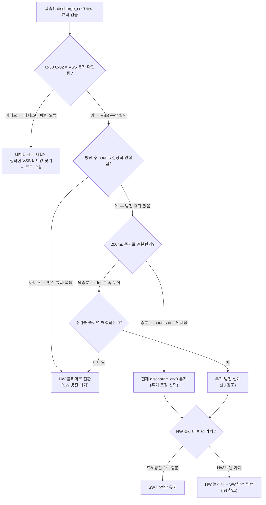

# 17 — 계획: 방전(ESD) 별도 트랙

**TL;DR**: SW baseline/ATI 개선(01~16 페르소나)과 ESD 물리 전하 누적은 완전히 독립적인 문제다. 방전 트랙은 3단계로 설계한다 — ① discharge_crx0 물리 실측1(0x30 write의 실효성 검증), ② 실측 결과에 따른 처분 분기(유지/주기 전환/폐기), ③ HW 블리더(1~10 MΩ) 병행 옵션 평가. 실측 전에는 현재 코드(`iqs323.c:955/960`) 무조건 유지 — 데이터시트 A.5 해석 미확정 상태에서 폐기 금지.

---

## 0. 방전 트랙 독립 근거

`브레인스토밍_부팅터치모호성.md §5 핵심 통찰_4` 확정:

> **방전(ESD/전하 누적)은 baseline 방법과 완전히 독립** — SW로 기준을 아무리 잘 잡아도 물리 전하는 남는다. 모든 방안에 별도 HW 블리더(전극 GND 1~10 MΩ) 또는 주기 방전이 잔존 과제.

`08_FixedATI하이브리드.md §4` 달성도 평가에서도 "물리 ESD 전하 누적 — 독립 트랙(HW 블리더 or 주기 방전), 이 아키텍처로 해결 불가"로 명시.

즉 01~16 페르소나가 설계하는 Fixed+Auto-ATI 하이브리드 아키텍처가 완성되어도, ESD 전하 누적은 SW 게이트·Re-ATI·LTA IIR 어떤 것으로도 제거할 수 없다. 방전 트랙은 독립적으로 추진해야 한다.

---

## 1. 현재 discharge_crx0 코드 분석 (코드 확정)

### 1-1. 구현 위치 및 동작

```
tdc_drv_iqs323.c:951 — tdc_drv_iqs323_discharge_crx0()
  ① write_register_discharge(0x30, 0x02, 0x00)
     — SENSOR0_SETUP(0x30) LSB=0x02: INACTIVE_RXS_CRX0_VSS
       (CH0 비활성 + CRX0을 IC 내부 VSS에 연결)
  ② write_register_discharge(0x30, 0x01, 0x01)
     — 복원: enable_channel=1, ctx0=1 (정상 Sensor0 설정 복귀)
```

- 호출 경로: `tdc_touch.c:422` → `tdc_touch_process()` 매 200ms 폴링마다 호출 (코드 확정, `분석.md §2`)
- write 로그 헬퍼: `write_register_discharge()`(`:200~203`) — verbose 로그 억제용 전용 래퍼, I2C 통신 자체는 일반 `write_register()`와 동일
- 빌드 가드: `TDC_TOUCH_CRX0_DISCHARGE_ENABLE`(`tdc_touch_config.h:113`) — 기본값 1(활성)
- 전제: `TDC_TOUCH_CRX1_DUMMY_ENABLE=1` 필수 — CH0 유일 활성 채널이면 비활성 순간 RDY 윈도우 먹통 발생 → CH1 더미 채널이 measurement cycle 유지

### 1-2. 데이터시트 해석 불확실성 (실측1 필요 핵심 이유)

`분석.md §7` 명시:

> 방전 코드(`discharge_crx0`)의 `0x30 0x02`가 데이터시트 A.5에서는 **Linearise** 해석 → 실칩 매핑 실측(실측1) 전 폐기 금지.

- 데이터시트 A.5 `Sensor_Setup` 레지스터 LSB bits[3:2]/[1:0] 필드가 실제로 "비활성 채널 CRx 접지"인지 "Linearise"인지 현재 코드 주석(`tdc_drv_iqs323.h:84~89`)은 "VSS=GND 연결"로 해석하나, 데이터시트 원문과 매핑이 확인 안 됨 [확정 필요].
- 따라서 **`0x30 0x02` write가 실제로 CRX0을 VSS에 연결해 ESD 전하를 방전하는지** 또는 전혀 다른 동작을 하는지는 RTT 실측(실측1) 전에 단정 불가.

---

## 2. 실측1 — discharge_crx0 물리 실효성 검증

### 2-1. 실측 목적

| 질문 | 기대 답 | 확정 방법 |
|---|---|---|
| `0x30 0x02` write가 실제로 CRX0=VSS 동작을 하는가 | 데이터시트 A.5 bits 매핑 확인 | 데이터시트 원문 + RTT counts 변화 관찰 |
| 방전 1회(200ms 주기) 후 counts에 변화가 생기는가 | counts 감소→복귀 또는 무변화 | RTT: 방전 전/후 counts 연속 관찰 |
| ESD 누적 재현 후 방전이 counts를 정상화하는가 | 마찰/접촉 후 counts 비정상→방전 후 정상화 | RTT: counts drift 유도 → 방전 효과 관찰 |
| 방전 주기(200ms)가 적절한가 | 누적 속도 대비 충분한 방전인가 | RTT: 방전 없을 때 vs 있을 때 counts 장기 추이 비교 |

### 2-2. 실측 절차

```
1. RTT_TUNING 활성화 + TDC_TOUCH_MARGIN_LOG_ENABLE=1 + TDC_TOUCH_CRX0_DISCHARGE_LOG=1
2. 노터치 확정 상태에서 counts baseline 기록 (최소 30초)
3. 전극에 마찰·정전기 유도 후 counts drift 확인
4. discharge_crx0 방전 200ms 주기 관찰 — counts가 정상 범위로 복귀하는지
5. TDC_TOUCH_CRX0_DISCHARGE_ENABLE=0 → 방전 없을 때 drift 누적 속도 측정
6. 데이터시트 A.5 원문 재확인 — 0x02(bits[1:0]=10)가 "VSS" 인지 "Linearise" 인지
```

### 2-3. 실측1 판정 기준 및 처분 분기



---

## 3. 주기 방전 설계 (실측1 이후 — 효과 있으나 주기 부족 시)

### 3-1. 현재 방전 구조

- 방전 위치: `tdc_touch_process()` 매 호출 말미 (`touch.c:422`) — 200ms마다 1회 고정
- 방전 = CH0 일시 비활성 + CRX0=VSS → 즉시 복원 (약 1~2 I2C 트랜잭션, ~수 ms)
- 타이밍: **측정 직후** 방전 → 방전이 다음 측정 전 CRX0 클리어

### 3-2. 주기 조정 옵션

| 옵션 | 구현 위치 | 설명 |
|---|---|---|
| **옵션_A: 매 폴링 유지 (현재)** | `touch.c:422` 현행 | 200ms마다 방전. 실측1에서 충분하면 변경 불요 |
| **옵션_B: 폴링 N회마다 1회** | `touch.c` 폴링 카운터 추가 | I2C 부하 감소, 실측1 후 적정 N 결정 [확정 필요] |
| **옵션_C: 크래들 뚜껑 닫힘 시 집중 방전** | `main.c:742` 앞 삽입 | 노터치 보장 구간에서 장시간 방전 → 누적 전하 완전 제거. 현재 뚜껑 닫힘 구간 I2C 미활용(터치 폴링 중단 전제) |

> [!NOTE]
> **옵션_C 전제 충돌**: 현재 `func_cradle_lid_closed_loop()`(`main.c:807`) 내부는 IQS323 I2C 통신이 완전 중단된 상태다(`분석.md §전제4`). 뚜껑 닫힘 진입 직전(`main.c:742` 앞)에 삽입하면 I2C는 아직 살아 있으므로 방전 가능하다. 이 위치는 03_크래들기회에서 Re-ATI 훅 삽입 지점(지점 A)과 동일하다 — 크래들 기회 훅과 함께 묶어 구현 효율 확보 가능.

### 3-3. 절전 진입 시 방전 추가 옵션

절전 진입 경로(`main.c:944` → `apply_sleep_settings()` → `ci_power_sleep()` → `tdc_drv_iqs323_reseed()`)에서 현재 RESEED만 실행한다. 절전 전 방전 1회 추가:

```c
/* main.c:943 앞 또는 apply_sleep_settings() 내부에 삽입 제안 */
(void)tdc_drv_iqs323_discharge_crx0();  /* 절전 진입 전 ESD 클리어 */
```

절전 중 IQS323은 ULP 모드로 동작하므로, 진입 직전 클리어가 ULP 중 ESD 영향을 줄이는 기회다 [추정: 절전 중 ESD 누적 속도 미확인, 실측1 연장 항목].

---

## 4. HW 블리더 옵션 평가

### 4-1. 개념 및 배치

HW 블리더: 터치 전극(CRX0 패드) ↔ GND 사이에 1 MΩ~10 MΩ 저항 연결 → 전하 누적 시 수동적·지속적으로 방전.

```
[터치 전극 패드(CRX0)] ─── R_bleed(1~10 MΩ) ─── GND
```

- SW 방전(`discharge_crx0`)과의 차이: SW 방전은 I2C write 1회(~수 ms) 동안만 VSS 연결 → 이후 Floating 복귀. HW 블리더는 항상 저항 연결 → 연속 방전.
- 저항값 선택 기준:
  - 너무 낮음(< 1 MΩ): 정전용량 측정에 간섭 → counts 감도 저하 [추정: 실측 없으면 수치 불확실]
  - 너무 높음(> 10 MΩ): 방전 효과 미미 [추정]
  - 권고 범위: 1~10 MΩ [추정 — 브레인스토밍에서 "HW 블리더(전극 GND 1~10 MΩ)"로 언급]
  - [확정 필요]: 실제 터치 감도(MULT/게인) 및 counts 변화에 미치는 영향은 HW 시험 후 확인

### 4-2. SW 방전 대비 장단점

| 항목 | HW 블리더 | SW discharge_crx0 |
|---|---|---|
| 방전 연속성 | 항상 연속 방전 | 200ms마다 순간 방전 |
| I2C 통신 부하 | 없음 (순수 HW) | 200ms마다 write 2회 |
| 절전 중 방전 | 유효 (배터리 소모 증가) | IQS323 통신 없으면 방전 없음 |
| 구현 비용 | PCB 수정 (R_bleed 추가) | 코드 이미 존재 |
| 감도 영향 | 저항값에 따라 counts 기준값 이동 가능 [확정 필요] | 없음 |
| 즉시 적용 가능 여부 | PCB 개정 필요 | 코드 빌드 가드로 즉시 |

### 4-3. 적용 우선순위

```
실측1 → SW 방전 효과 충분하면: SW만 유지 (빠른 경로)
실측1 → SW 방전 효과 불충분하면:
    단기: SW 방전 주기 조정 (옵션_B/C) 시도
    장기: HW 블리더 PCB 추가 검토 (PCB 개정 비용 고려)
    병행: SW + HW 동시 적용 (가장 강건)
```

> [!IMPORTANT]
> HW 블리더는 PCB 수정 없이 즉시 적용 불가 — **실측1이 SW 방전 효과 없음을 입증하기 전까지는 SW 트랙(discharge_crx0) 유지**가 기본 방침이다.

---

## 5. 방전 트랙과 다른 트랙의 인터페이스

### 5-1. 노터치 게이트와의 관계

방전이 부족하면 counts가 비정상적으로 낮아진다(ESD 전하 누적 = self-cap 증가 = counts 감소). 이 경우:

- 노터치 게이트(`05_노터치게이트메커.md §1` 레이어_1) 판별에서 counts가 `[factory_noTouch − MARGIN]` 이하로 떨어지면 **터치 의심으로 오판**될 수 있다.
- 즉 ESD 누적이 심하면 Re-ATI/RESEED 게이트가 영구 닫힘 상태가 될 수 있다 [추정].
- 따라서 방전 트랙이 충분히 작동해야 노터치 게이트의 절대 윈도우가 의미를 가진다.

**결론**: 방전 트랙은 노터치 게이트 아키텍처의 전제 조건 중 하나다 — 둘을 직렬로 보면 안 되고, 방전이 먼저 counts를 정상 범위에 유지시켜야 게이트가 올바르게 동작한다.

### 5-2. 크래들 기회와의 공유

`03_크래들기회.md §3 지점 A`(진입 시 Re-ATI/RESEED 훅)와 `§3-2 옵션_C`(진입 직전 집중 방전)는 **동일한 코드 삽입 지점**(main.c:742 앞)을 공유한다:

```c
/* main.c:742 앞 — 뚜껑 닫힘 직전 노터치 보장 구간 활용 */
/* [방전 트랙] 집중 방전 (실측1 후 주기 부족 판정 시) */
(void)tdc_drv_iqs323_discharge_crx0();

/* [크래들 기회 트랙] RESEED (Phase 1) 또는 Re-ATI (Phase 2) */
/* tdc_drv_iqs323_reseed_normal();  */  /* Phase 1 구현 시 해제 */
```

두 트랙을 같은 진입 지점에서 순서대로 실행 — 방전 먼저, 이후 Re-ATI/RESEED. 방전이 counts를 정상화한 뒤 Re-ATI를 실행해야 정확한 게인 보정이 가능하다.

---

## 6. 실측1 선행 필요 항목 요약

| 항목 | 왜 필요 | 방법 |
|---|---|---|
| `0x30 0x02` bits 매핑 확인 | 코드 주석이 "CRX0=VSS"로 해석하나 데이터시트 A.5 원문 재확인 필요 | 데이터시트 A.5 `Sensor Setup LSB` bits[1:0] 원문 + RTT 관찰 |
| 방전 전/후 counts 변화 측정 | SW 방전의 물리 실효성 — 없으면 주기 무의미 | RTT: `TDC_TOUCH_CRX0_DISCHARGE_LOG=1` + margin log |
| ESD 누적 속도 측정 | 200ms 주기 적정성 — 누적보다 방전이 빠른가 | RTT: 방전 비활성화 후 counts drift 속도 관찰 (5~10분) |
| 절전 중 ESD 누적 여부 | 절전 진입 전 방전 추가 가치 | RTT: 절전 진입→복귀 사이 counts 변화 비교 |
| HW 블리더 필요성 | SW 방전이 불충분한 경우에만 PCB 수정 검토 | 실측1 결과 기반 판단 |

---

## 7. 구현 계획 — 방전 트랙 단계

| 단계 | 내용 | 선행 조건 | 코드 위치 |
|---|---|---|---|
| **단계_0: 현상 유지** | `discharge_crx0` 유지 (`TDC_TOUCH_CRX0_DISCHARGE_ENABLE=1`) | 없음 (즉시) | `tdc_touch_config.h:113`, `touch.c:422` |
| **단계_1: 실측1 수행** | RTT로 방전 효과·주기 적정성 검증 | RTT 환경 + 빌드 가드 활성 | 코드 변경 없음 (빌드 설정만) |
| **단계_2A: 효과 확인 → 유지** | 실측1 통과 — 현 discharge_crx0 유지, 주기 조정 선택 | 실측1 완료 | 선택: `touch.c` 폴링 카운터 추가 |
| **단계_2B: 효과 없음 → 재설계** | 레지스터 비트 수정 또는 주기 조정 후 재실측 | 실측1 + 데이터시트 A.5 확인 | `tdc_drv_iqs323.c:955` 비트값 수정 |
| **단계_3: 크래들 집중 방전 (선택)** | `main.c:742` 앞 방전 추가 — 뚜껑 닫힘 직전 집중 방전 | 실측1에서 주기 부족 판정 시 | `main.c:742` 앞 1줄 추가 |
| **단계_4: HW 블리더 (선택)** | PCB에 1~10 MΩ 블리더 저항 추가 | 실측1에서 SW 방전 한계 확인 | PCB 개정 (SW 변경 없음) |

---

## 8. 핵심 결론 (7줄)

1. **ESD 방전은 SW baseline/ATI 개선과 완전 독립** — Fixed+Auto-ATI 하이브리드가 완성되어도 물리 전하 누적은 남는다. 방전 트랙은 별도로 추진해야 한다.
2. **실측1이 전 방전 트랙의 전제** — `0x30 0x02` write의 실제 물리 효력이 미확정(데이터시트 A.5 해석 불확실)이므로, 효력 확인 전 폐기·변경 금지.
3. **실측1 판정에 따라 3분기** — ① VSS 매핑 오류 시 비트값 수정, ② 효과 없음 시 HW 블리더로 전환, ③ 효과 있으나 주기 부족 시 크래들 집중 방전(단계_3) 추가.
4. **HW 블리더(1~10 MΩ) 옵션은 SW 방전 한계 판정 후** — PCB 개정 비용이 있으므로 실측1 불충분 판정 이후에만 추진.
5. **방전 트랙은 노터치 게이트의 전제 조건** — ESD 누적이 심하면 counts가 noTouch 윈도우 이탈 → 게이트 영구 닫힘(Re-ATI 불가). 방전이 counts를 정상 범위에 유지시켜야 게이트가 동작한다.
6. **크래들 뚜껑 닫힘 직전(`main.c:742` 앞)이 집중 방전 기회** — 03_크래들기회 훅 삽입 지점과 동일, 방전→Re-ATI 순서로 묶어 구현 효율 확보.
7. **현재 방전 코드 유지 + 실측1 착수가 즉시 실행 가능한 단계_0/1** — 추가 코드 변경 없이 RTT 관찰만으로 실측1 가능.
