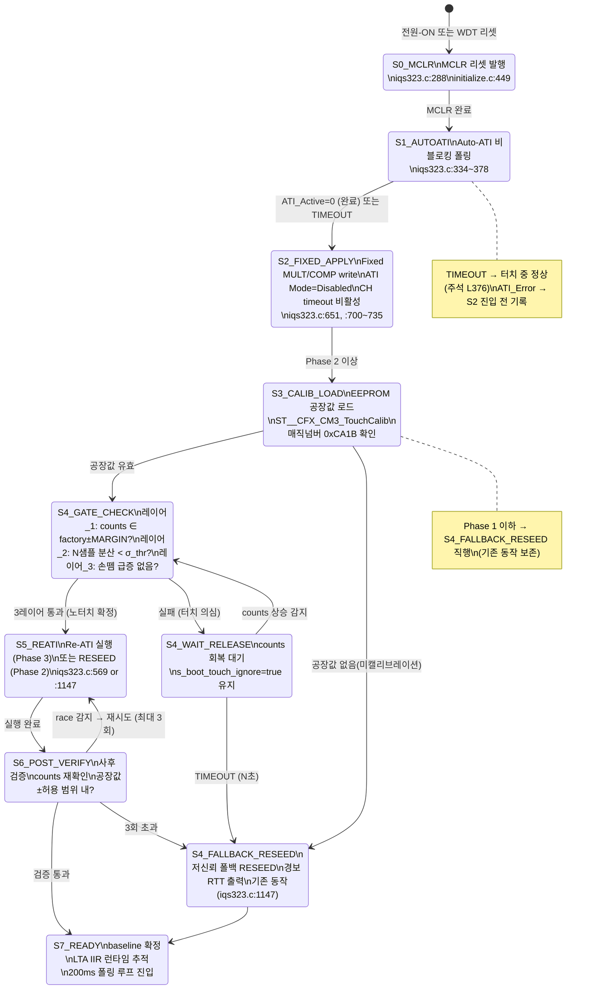
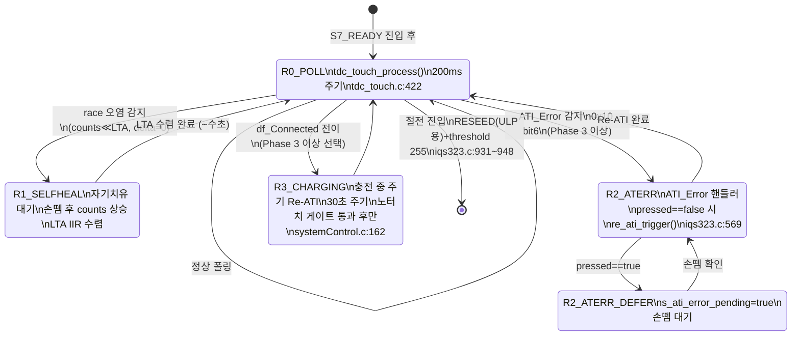
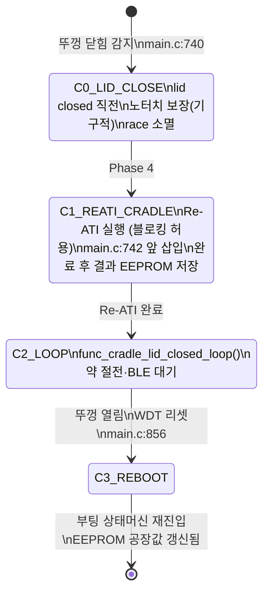

# 18_계획_통합아키텍처 — Fixed+Auto-ATI 하이브리드 통합 구현 설계

**TL;DR**: 분석 8종(01~08)을 종합해 Fixed 기저 + 노터치 게이트 + 조건부 Re-ATI + 크래들 경로 + 사후검증·자기치유의 5층 방어를 하나의 상태머신과 5단계 빌드가드 계획으로 정리한다. 공장 캘리브레이션(EEPROM)이 전 아키텍처의 선행 필수 조건이며, Phase 0(포화 감지 stub)→Phase 1(ATI_Error 핸들러)→Phase 2(노터치 게이트+RESEED)→Phase 3(Re-ATI 조건부 활성)→Phase 4(크래들 Re-ATI 연결) 순서로 롤백 가능하게 빌드가드를 분리한다.

---

## 1. 아키텍처 원리 — 5층 방어 요약

분석 8종에서 수렴한 핵심 원리는 하나다:

> **공장 절대 기준으로 노터치를 판별하고, 노터치가 확인된 순간에만 Re-ATI를 허용한다.**

이 조건 하나가 Fixed(부팅 안전)와 Auto-ATI(환경 적응)의 약점을 교차 보완한다. (`08_FixedATI하이브리드.md §2` 확정)

| 층 | 담당 | 코드 위치 | Phase |
|---|---|---|---|
| **층위 1: Fixed 기저** | 항상 유효한 최소 동작 보장 | `iqs323.c:651, :700~735` | 현재 존재 |
| **층위 2: 노터치 게이트** | Cold-Start Ambiguity 해소, RESEED/Re-ATI 오염 방지 | `iqs323.c:1141~1149` 대체 신설 | Phase 2 |
| **층위 3: 조건부 Re-ATI** | 게인(MULT/COMP)+baseline 전부 그 시점 환경 기준 재보정 | `iqs323.c:569~623` 기존 재활용 | Phase 3 |
| **층위 4: 사후검증·자기치유** | race 사후 검출·재시도, 손뗌 LTA IIR 수렴 | `iqs323.c` 신설 래퍼, `tdc_touch.c:360` 보강 | Phase 2~3 |
| **층위 5: 크래들 race 소멸** | 뚜껑 닫힘 구간 노터치 절대 보장, race 원천 제거 | `main.c:742` 앞 삽입 | Phase 4 |

> [!IMPORTANT]
> 공장 캘리브레이션(EEPROM에 MULT/COMP + noTouch counts 저장)은 층위 2~5의 **공통 선행 조건**이다. 공장값 없이는 "지금 노터치인가" 판별이 불능이다. (`01_부팅ATI게이트.md §3-1`, `02_공장캘리.md §5-2`, `05_노터치게이트메커.md §1-2` 공통 확정)

---

## 2. 전체 상태머신

### 2-1. 부팅 초기화 상태머신 (매 부팅·WDT 리셋 공통)

절전 복귀=WDT 리셋 재부팅이므로 절전 복귀와 일반 부팅이 동일한 단일 상태머신으로 흡수된다. (`04_절전재부팅통합.md §2-1` 확정)



### 2-2. 런타임 상태머신 (200ms 폴링 루프)



### 2-3. 크래들 뚜껑 닫힘 경로 (Phase 4)



---

## 3. 빌드가드 계획 — 단계별 롤백 보장

각 Phase는 독립 빌드가드로 감싸져, 상위 Phase를 OFF해도 하위 Phase가 동작하는 구조를 보장한다.

```c
/* tdc_touch_config.h — 빌드가드 정의 */

/* Phase 0: counts 포화 감지 stub (항상 활성 권고, 런타임 비용 없음) */
#define TDC_TOUCH_SATURATE_DETECT_ENABLE   1u

/* Phase 1: ATI_Error 핸들러 (ATI Disabled 현재: (void) 유지, ATI Full 전환 시 1로) */
#define TDC_TOUCH_ATI_FULL_ENABLE          0u  /* 현재 0. Phase 3과 동시 활성화 */

/* Phase 2: 노터치 게이트 + 공장 캘리브레이션 EEPROM 로드 */
#define TDC_TOUCH_NOTOUCH_GATE_ENABLE      0u  /* 공장 캘리브레이션 완료 후 1로 */

/* Phase 3: 노터치 게이트 통과 시 Re-ATI 활성 (Phase 2 선행 필수) */
#define TDC_TOUCH_REATI_ON_NOTOUCH_ENABLE  0u  /* Phase 2 검증 후 1로 */

/* Phase 4: 크래들 뚜껑 닫힘 시 Re-ATI 실행 (Phase 3 선행 필수) */
#define TDC_TOUCH_CRADLE_REATI_ENABLE      0u  /* main.c:742 삽입 후 1로 */

/* 공장 캘리브레이션 실행 모드 (기존 ATI_CALIB_MODE 확장) */
#define TDC_TOUCH_FACTORY_CALIB_ENABLE     0u  /* 공장 캘리브레이션 공정에서만 1로 */
```

### 3-1. 빌드가드 의존 관계

```
TDC_TOUCH_FACTORY_CALIB_ENABLE (공장 공정용 — 런타임 비활성)
        ↓ EEPROM에 공장값 기록
TDC_TOUCH_NOTOUCH_GATE_ENABLE (Phase 2)
        ↓ 선행 필수
TDC_TOUCH_REATI_ON_NOTOUCH_ENABLE (Phase 3)
  + TDC_TOUCH_ATI_FULL_ENABLE (ATI_Error 핸들러, Phase 3과 동시)
        ↓ 선행 필수
TDC_TOUCH_CRADLE_REATI_ENABLE (Phase 4)

TDC_TOUCH_SATURATE_DETECT_ENABLE (Phase 0 — 독립, 항상 ON)
```

> [!IMPORTANT]
> `TDC_TOUCH_REATI_ON_NOTOUCH_ENABLE=1` 활성화 전에 반드시 `TDC_TOUCH_ATI_FULL_ENABLE=1` 동시 설정 필수. ATI_Error 핸들러 없이 Re-ATI를 활성화하면 ATI_Error 발생 시 영구먹통 경로가 열린다. (`07_사후검증자기치유.md §4.1`, `08_FixedATI하이브리드.md §5` 확정)

### 3-2. 롤백 절차

| 이상 현상 | 롤백 조치 | 영향 범위 |
|---|---|---|
| Phase 3 Re-ATI 후 오동작 | `REATI_ON_NOTOUCH_ENABLE=0` | Phase 2 노터치 게이트+RESEED 유지 |
| Phase 2 게이트 후 오동작 | `NOTOUCH_GATE_ENABLE=0` | Phase 0 포화 감지 stub만 유지 — 기존 동작 100% 복원 |
| Phase 4 크래들 Re-ATI 오동작 | `CRADLE_REATI_ENABLE=0` | Phase 3까지 유지 |
| 전체 긴급 롤백 | `NOTOUCH_GATE_ENABLE=0`+`REATI_ON_NOTOUCH_ENABLE=0`+`CRADLE_REATI_ENABLE=0` | 현 펌웨어(고정값+무조건 RESEED) 완전 복원 |

---

## 4. 신규 구현 골격

### 4-1. 신규 자료구조 (cfx_cm3_sharedMemory.h 확장)

```c
/* ST__CFX_CM3_SharedMemory_userSettingValue 확장 또는 별도 구조체 신설 */
typedef struct {
    uint16_t touch_mult_16;          /* Auto-ATI 결과 MULT (16비트 little-endian) */
    uint16_t touch_comp_16;          /* Auto-ATI 결과 COMP (16비트 little-endian) */
    uint16_t touch_noTouch_counts;   /* noTouch 절대기준 (CH0 Filtered Counts, 16비트) */
    uint16_t touch_calib_magic;      /* 캘리브레이션 완료 매직넘버 = 0xCA1B */
} ST__CFX_CM3_TouchCalib;
/* [확정 필요]: CFX 측 userSettingValue 파서 크기 제약 확인 후 통합 or 별도 구조체 결정 */
```

### 4-2. 노터치 게이트 함수 (tdc_drv_iqs323.c 신설)

```c
/* 노터치 3레이어 게이트 + RESEED/Re-ATI 원자 블록 */
/* [확정 필요]: FACTORY_NOTOUCH_COUNTS, FACTORY_MARGIN — 실측_A 후 확정 */
#define TDC_NOTOUCH_FACTORY_COUNTS   (400u)   /* 임시 [추정] — RTT 실측 후 교체 */
#define TDC_NOTOUCH_FACTORY_MARGIN   (80u)    /* 임시 [추정] — drift 실측 후 교체 */
#define TDC_NOTOUCH_N_SAMPLES        (5u)     /* 레이어_2 안정성 샘플 수 [추정] */
#define TDC_NOTOUCH_SIGMA_THR        (10u)    /* 레이어_2 분산 임계 [추정] */
#define TDC_NOTOUCH_SPIKE_THR        (30u)    /* 레이어_3 손뗌 급증 임계 [추정] */
#define TDC_RESEED_MAX_RETRY         (3u)     /* 사후검증 재시도 최대 횟수 */

typedef enum {
    TDC_NOTOUCH_GATE_PASS = 0,        /* 노터치 확인, RESEED/Re-ATI 실행 완료 */
    TDC_NOTOUCH_GATE_TOUCH_HOLD,      /* 터치 의심, 대기 중 */
    TDC_NOTOUCH_GATE_TIMEOUT,         /* timeout, 저신뢰 폴백 실행 */
    TDC_NOTOUCH_GATE_RACE_RETRY,      /* race 감지, 재시도 중 */
    TDC_NOTOUCH_GATE_NO_CALIB,        /* 공장값 없음, 기존 RESEED 실행 */
} tdc_notouch_gate_result_t;

/* Phase 2 이상 — 노터치 게이트 판별 후 RESEED 실행 */
tdc_notouch_gate_result_t tdc_drv_iqs323_notouch_gate_reseed(
    const ST__CFX_CM3_TouchCalib *p_calib);

/* Phase 3 이상 — 노터치 게이트 판별 후 Re-ATI 실행 */
tdc_notouch_gate_result_t tdc_drv_iqs323_notouch_gate_reati(
    const ST__CFX_CM3_TouchCalib *p_calib);
```

### 4-3. 공장 캘리브레이션 함수 (기존 calib_read_ati 확장)

```c
/* Phase 2 선행 — 공장 공정 시 TDC_TOUCH_FACTORY_CALIB_ENABLE=1 하에서 1회 실행 */
/* 기존 tdc_drv_iqs323_calib_read_ati() (iqs323.c:820) 재활용 + EEPROM 저장 추가 */
bool tdc_drv_iqs323_factory_calib_store(ST__CFX_CM3_TouchCalib *p_out);
/* 흐름: Auto-ATI 완료 → MULT/COMP 읽기(기존) → apply_settings() → ~50ms 안정화
         → CH0 Filtered Counts 읽기 → 3값+매직넘버 EEPROM write */
```

### 4-4. Phase 0 포화 감지 stub (iqs323.c 또는 tdc_touch.c)

```c
/* 200ms 폴링 루프 내, counts 읽기 후 삽입 */
#if TDC_TOUCH_SATURATE_DETECT_ENABLE
    if (counts >= TDC_COUNTS_SATURATE_WARN_THR) {  /* [확정 필요]: Max Counts 실측 후 */
        ci_printw("[TOUCH] WARN: counts near saturation (%u)\r\n", counts);
    }
#endif
```

### 4-5. ATI_Error 핸들러 (tdc_touch.c:389~393 대체, Phase 3 동시)

```c
/* 기존: (void) ati_error; */
#if TDC_TOUCH_ATI_FULL_ENABLE
    if (ati_error)
    {
        if (!pressed)
        {
            ci_printw("[TOUCH] ATI_ERROR: triggering Re-ATI\r\n");
            (void)tdc_drv_iqs323_re_ati_trigger();  /* iqs323.c:569 — extern 노출 필요 */
        }
        else
        {
            s_ati_error_pending = true;
        }
    }
#else
    (void) ati_error;  /* ATI Disabled 현재: 의도적 무시 */
#endif
```

### 4-6. 크래들 Re-ATI 삽입 (main.c:742, Phase 4)

```c
/* main.c:742 앞 (led_force_fade_off() 직후, func_cradle_lid_closed_loop() 직전) */
#if TDC_TOUCH_CRADLE_REATI_ENABLE
    {
        ST__CFX_CM3_TouchCalib calib_update;
        if (tdc_drv_iqs323_factory_calib_store(&calib_update))
        {
            /* EEPROM 갱신 (공장값 드리프트 추적 업데이트) */
            tdc_touch_calib_save_to_eeprom(&calib_update);
            ci_printi("[TOUCH] CRADLE: Re-ATI + calib update OK\r\n");
        }
        else
        {
            ci_printw("[TOUCH] CRADLE: Re-ATI failed, keep previous calib\r\n");
        }
    }
#endif
```

---

## 5. 수정 파일 목록 및 변경 규모

| 파일 | 변경 유형 | Phase | 규모 |
|---|---|---|---|
| `tdc_touch_config.h` | 빌드가드 상수 추가 | 0~4 | ~10줄 신설 |
| `cfx_cm3_sharedMemory.h` | `ST__CFX_CM3_TouchCalib` 구조체 추가 [확정 필요: CFX 파서] | Phase 2 | ~8줄 신설 |
| `tdc_drv_iqs323.c` | `tdc_drv_iqs323_notouch_gate_reseed/reati()` 신설, `apply_settings()` 내 RESEED 대체, 포화 stub | Phase 0~3 | ~80줄 신설·10줄 수정 |
| `tdc_drv_iqs323.h` | `tdc_notouch_gate_result_t`, 신설 함수 API 노출, `re_ati_trigger` extern 추가 | Phase 2~3 | ~20줄 신설 |
| `tdc_touch.c` | ATI_Error 핸들러 대체, `s_ati_error_pending` 플래그, `s_boot_5s_warned` RESEED 재시도 보강 | Phase 3 | ~25줄 수정 |
| `main.c` | 크래들 진입 전 Re-ATI 훅 삽입 | Phase 4 | ~15줄 신설 |
| (공장 공정 전용) `tdc_drv_iqs323.c` | `tdc_drv_iqs323_factory_calib_store()` 신설 | Phase 2 전제 | ~40줄 신설 |

---

## 6. 실측 의존 항목 및 게이트

아래 실측이 선행돼야 해당 Phase 확정값을 설정할 수 있다. 실측 전까지 [추정] 임시값으로 빌드가드 OFF 상태로 개발·테스트한다.

| 실측 ID | 내용 | 결정 내용 | 필요 Phase |
|---|---|---|---|
| **실측_A** | RTT noTouch counts 절대값 분포(온도·시간 변화 포함) | `TDC_NOTOUCH_FACTORY_COUNTS`, `TDC_NOTOUCH_FACTORY_MARGIN` 확정 | Phase 2 **선행 필수** |
| **실측_V2** | Max Counts 값 (counts 포화 임계) | `TDC_COUNTS_SATURATE_WARN_THR` 확정 | Phase 0 |
| **실측_Beta** | POR default Beta 파라미터 → LTA IIR 수렴 시간 | RESEED 재시도 딜레이, 안정화 대기 시간 | Phase 2 |
| **실측5** | Fixed 유지 시 현장 환경 drift 실재성 | Phase 3(Re-ATI 필요 여부) 최종 결정 | Phase 3 판단 전제 |
| **실측_K** | t_ati 실제 소요 시간 | Re-ATI timeout 설정 | Phase 3 |
| **CFX_확인** | userSettingValue 파서 크기 제약 | EEPROM 구조체 통합 vs 별도 확정 | Phase 2 전제 |

---

## 7. 핵심 결론 (7줄)

1. **단일 원리**: 공장 절대 기준으로 노터치 판별 후 Re-ATI 허용 — 이 조건 하나가 Fixed와 Auto-ATI의 약점을 교차 보완하고 5층 방어 아키텍처의 중심축이다.
2. **공장 캘리브레이션 EEPROM 저장이 전 아키텍처의 선행 조건**: 매직넘버 0xCA1B로 미캘리브레이션을 구분하고, 공장값 없으면 기존 동작(기존 RESEED)으로 폴백해 회귀를 방지한다.
3. **빌드가드 5단계(Phase 0~4)로 롤백 보장**: 각 Phase는 독립 빌드가드로 감싸져, 상위 Phase를 OFF해도 하위 Phase가 유지되고 Phase 0~1 OFF 시 현 펌웨어 동작이 100% 복원된다.
4. **ATI_Error 핸들러는 Phase 3(Re-ATI 활성)과 반드시 동시 활성화**: `TDC_TOUCH_ATI_FULL_ENABLE`과 `TDC_TOUCH_REATI_ON_NOTOUCH_ENABLE`이 항상 함께 ON/OFF된다 — 핸들러 없는 Re-ATI 활성은 영구먹통 경로를 개방한다.
5. **절전 복귀=WDT 리셋으로 부팅·절전 복귀 상태머신 통합**: 절전 진입 RESEED는 ULP용 전용으로 유지하고, 복귀 후 baseline 품질은 부팅 상태머신(S0~S7)이 전담한다.
6. **크래들 뚜껑 닫힘이 유일한 race-free 기회**: Phase 4에서 main.c:742 앞에 Re-ATI 훅 삽입 시 노터치 절대 보장 구간에서 게인+baseline 전체 재보정 + EEPROM 갱신이 가능하다.
7. **실측_A(noTouch counts 절대값)가 Phase 2 블로킹 조건**: 이 값 없이 노터치 게이트 구현 불가 — RTT `Counts` 로그 관찰로 확정 전까지 Phase 2 빌드가드 OFF 상태로 개발한다.
