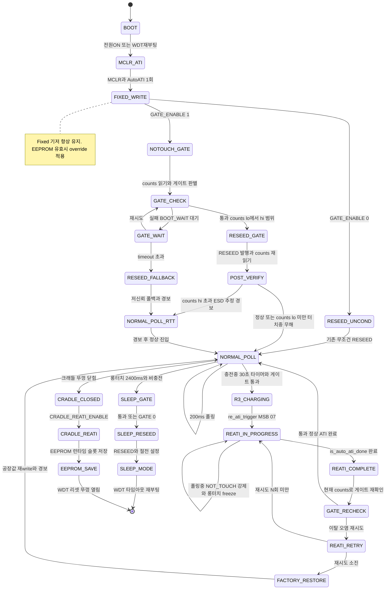

# 99 — v3 최종 종합 (1차 + 재검증 1·2·3 통합)

**TL;DR**: 32개 adversarial 노드(분석8·계획8·검증8 + 재검증 3라운드×8)를 거쳐 도출된 Fixed+Auto-ATI 하이브리드 아키텍처 최종안. 아키텍처 원리는 3회 공격에서도 기각되지 않아 수렴 확정. 즉시 실행 버그 2건(WDT 갱신 누락·re_ati_trigger CH_TIMEOUT 덮어쓰기)과 Phase 1 착수 전 블로킹 6건을 식별하며, 공장 절대 기준 노터치 게이트 + 조건부 Re-ATI 구조로 부팅 터치 모호성·보드 편차·드리프트를 다층 방어로 실사용 무시 가능 수준으로 수렴시킨다.

---

## 1. 확정 아키텍처 원리

> **"공장 절대 기준으로 노터치를 판별하고, 노터치가 확인된 순간에만 Re-ATI를 허용한다."**

이 원리는 분석8·계획8·검증8·재검증 3라운드(총 32개 adversarial 노드)에서 한 번도 기각되지 않았으며, 대안비교 3라운드(48·58·68) 누적에서도 기각 근거가 발굴되지 않아 **수렴 확정**으로 판정한다.

### 1-1. 층위 구조 (최종)

| 층위 | 담당 | 현재 상태 | 최종 정제 사항 |
|---|---|---|---|
| **층위 0 — Fixed 기저** | 공장 MULT/COMP를 매 부팅 적용 | 현재 존재(단일 고정값) | `write_ati_compensation()` 내 ATI_SETUP write를 `ATI_FULL_ENABLE` 빌드가드로 분기(회귀_1). EEPROM 로드값 주입을 **선택지_2(정적 변수 신설)** 방식으로 구현. BOARD_VARIANT별 슬롯·SLEEP ATI 경로 별도 설계 필수 |
| **층위 1 — 노터치 게이트** | 공장 noTouch 절대 기준으로 부팅·절전 RESEED 판별 | **미구현** | `gate_check()` lo 언더플로·hi 오버플로 이중 가드(컴파일타임 #error + 런타임 클램프). 게이트 진행 구간 `s_gate_in_progress` 플래그 또는 `s_boot_touch_ignore` 확장으로 억제(블로킹_L). 절전 RESEED도 동일 게이트 적용(블로킹_G 대기 불필요) |
| **층위 2 — 조건부 Re-ATI** | 게인+baseline 전체 재보정 | **미구현** | 비블로킹 R3_CHARGING 3단계 구조. `tdc_drv_iqs323_is_auto_ati_done()` 공개 API 활용(`iqs323.c:926`). `re_ati_trigger()` MSB=0x07 수정(CH_TIMEOUT 유지) 즉시 필요 |
| **층위 3 — 자기치유** | 손뗌 후 LTA IIR 수렴 | **Beta POR 미확인으로 보장 불가** | 블로킹_D(Beta POR 실측) 해소 전 자기치유 근거 없음. Beta POR=0 시 CH_TIMEOUT 재활성이 유일 복구 경로 가능성 |
| **층위 4 — 크래들 race 소멸** | 뚜껑 닫힘 = 노터치 보장 | **미구현** | Phase 4 Re-ATI + EEPROM 저장 쌍으로만 구현. 공장값 슬롯·런타임 슬롯 분리(대안_Z) |

### 1-2. 절전/부팅 통합

절전 복귀 = WDT 리셋 재부팅 → 부팅 노터치 게이트 하나로 통합 처리. 절전 RESEED 오염→ULP 즉시 재부팅 루프는 Phase 1 절전 진입 게이트화로 해소(블로킹_G 대기 불필요, 재검증3 수렴).

---

## 2. 상태머신 (Mermaid)



---

## 3. 단계별 구현 계획

### Phase −1 (즉시 실행 — 현재 기존 코드 버그 수정)

**긴급 버그 2건 즉시 수정 (블로킹 해소 불필요)**:

#### 버그_1: `wait_re_ati_done()` WDT 갱신 누락 (현장 버그)

`iqs323.c:581~623` 10회 루프 내 `SYS_WATCHDOG_REFRESH()` 0건. 최악 ~2.3초 blocking 중 WDT 리셋 위험. 현재 `ATI_CALIB_MODE=1` 경로(`iqs323.c:860`)에서 이미 호출 중이므로 잠재 현장 버그.

```c
/* iqs323.c:581~623 wait_re_ati_done() 루프 내 수정 */
for (uint8_t i = 0u; i < 10u; i++) {
    SYS_WATCHDOG_REFRESH();  /* read_register 직전 (130ms busy-wait 방어) */
    if (!read_register(...)) { ... }
    SYS_WATCHDOG_REFRESH();  /* Sys_Delay 직전 (기존 Phase-1 위치) */
    Sys_Delay(TDC_DRV_IQS323_DEFAULT_DELAY_MS * 100);
}
/* ATI_CALIB_MODE(iqs323.c:860)·SLEEP_MEASURE_MODE(iqs323.c:893) 두 경로 모두 커버 */
```

> [!IMPORTANT]
> WDT timeout 설정값 확인 필요(확인_19). timeout < 130ms 시 `read_register` 직전 삽입 위치가 결정적. [확정 필요]

#### 버그_2: `re_ati_trigger()` CH_TIMEOUT 덮어쓰기 (코드 2라인 대조 확정)

`iqs323.c:569~579`에서 `reg.bytes[2] = 0x00`이 CH_TIMEOUT 비활성화 설정(0x07)을 소멸시킨다.

```c
/* iqs323.c:569~579 수정 */
static bool re_ati_trigger(void)
{
    tdc_drv_iqs323_reg_system_control_t reg;
    reg.bytes[0]            = TDC_DRV_IQS323_REG_ADDR_SYSTEM_CONTROL;
    reg.bytes[1]            = 0x00;
    reg.bytes[2]            = 0x07;  /* CH_TIMEOUT 비활성화 유지 (ch0/ch1/ch2_timeout_disable=1) */
    reg.elements.lsb.re_ati = TDC_DRV_IQS323_TRIGGER_RE_ATI;
    return write_register(reg.bytes[0], reg.bytes[1], reg.bytes[2]);
}
```

#### 추가: `tdc_touch_config.h` 신규 define 일괄 추가 (빌드가드 실효화 선행)

현재 `tdc_touch_config.h`에 신규 define 0건. Phase 0 이전 아래 최종 빌드가드 세트 v3를 일괄 추가해야 `#error` 가드가 실제 작동한다. 기존 13개 define(`TDC_TOUCH_ATI_CALIB_MODE` 등) 역할 중복 검토 선행.

### 최종 빌드가드 세트 v3 (tdc_touch_config.h)

```c
/* ===== Phase 0: 포화 감지 (실측_E 완료 전 OFF) ===== */
#define TDC_TOUCH_SATURATE_DETECT_ENABLE     0u  /* 실측_E 완료 후 1u로 */
#define TDC_TOUCH_SATURATE_MAX_COUNTS        0u  /* [확정 필요] 블로킹_E 해소 후 */

/* ===== Phase 1: 노터치 게이트 ===== */
#define TDC_TOUCH_NOTOUCH_GATE_ENABLE        0u  /* 블로킹_A+B+D+G+L 완료 후 1로 */
#define TDC_TOUCH_FACTORY_NOTOUCH_COUNTS     0u  /* [확정 필요] 실측_A 완료 후 */
#define TDC_TOUCH_NOTOUCH_MARGIN_STRICT      0u  /* [확정 필요] 실측 기반만 (수치 제안 금지) */
#define TDC_TOUCH_NOTOUCH_MARGIN_UP          0u  /* [확정 필요] 드리프트 실측 후 */

/* ===== Phase 2: 공장 캘리브레이션 ===== */
#define TDC_TOUCH_FACTORY_CALIB_ENABLE       0u  /* BOARD_VARIANT 슬롯·SLEEP 경로 설계 후 */
/* 주의: TDC_TOUCH_RTT_TUNING은 iqs323.c 내 #if 심볼명 grep 일치 확인 후 여기 추가 */

/* ===== Phase 3: Re-ATI + ATI_Error 핸들러 (항상 쌍) ===== */
#define TDC_TOUCH_REATI_ON_NOTOUCH_ENABLE    0u  /* Phase 2 + 블로킹_J + 확인_14·16·17 완료 후 */
#define TDC_TOUCH_ATI_FULL_ENABLE            0u  /* 위와 항상 동일값 */

/* ===== Phase 4: 크래들 Re-ATI + EEPROM 저장 ===== */
#define TDC_TOUCH_CRADLE_REATI_ENABLE        0u  /* 대안_Z 슬롯 정책 확정 후 */

/* ===== 컴파일 타임 의존성 강제 v3 ===== */
#if TDC_TOUCH_REATI_ON_NOTOUCH_ENABLE && !TDC_TOUCH_ATI_FULL_ENABLE
#error "REATI_ON_NOTOUCH_ENABLE requires ATI_FULL_ENABLE"
#endif
#if TDC_TOUCH_CRADLE_REATI_ENABLE && !TDC_TOUCH_REATI_ON_NOTOUCH_ENABLE
#error "CRADLE_REATI_ENABLE requires REATI_ON_NOTOUCH_ENABLE"
#endif
#if TDC_TOUCH_REATI_ON_NOTOUCH_ENABLE && !TDC_TOUCH_NOTOUCH_GATE_ENABLE
#error "REATI_ON_NOTOUCH_ENABLE requires NOTOUCH_GATE_ENABLE"
#endif
#if TDC_TOUCH_NOTOUCH_GATE_ENABLE && (TDC_TOUCH_FACTORY_NOTOUCH_COUNTS == 0u)
#error "NOTOUCH_GATE_ENABLE requires FACTORY_NOTOUCH_COUNTS != 0"
#endif
#if TDC_TOUCH_NOTOUCH_GATE_ENABLE && TDC_TOUCH_RTT_TUNING
#error "NOTOUCH_GATE와 RTT_TUNING 동시 활성 불가 — MULT/COMP 기준 불일치"
#endif
#if TDC_TOUCH_FACTORY_CALIB_ENABLE && TDC_TOUCH_RTT_TUNING
#error "FACTORY_CALIB_ENABLE과 RTT_TUNING 동시 활성 불가 — EEPROM 공장값 무효화"
#endif
#if TDC_TOUCH_NOTOUCH_GATE_ENABLE && \
    (TDC_TOUCH_NOTOUCH_MARGIN_STRICT >= TDC_TOUCH_FACTORY_NOTOUCH_COUNTS)
#error "NOTOUCH_MARGIN_STRICT must be < FACTORY_NOTOUCH_COUNTS (lo underflow risk)"
#endif
#if TDC_TOUCH_NOTOUCH_GATE_ENABLE && \
    ((uint32_t)TDC_TOUCH_FACTORY_NOTOUCH_COUNTS + TDC_TOUCH_NOTOUCH_MARGIN_UP > 0xFFFFu)
#error "FACTORY_NOTOUCH_COUNTS + NOTOUCH_MARGIN_UP overflows uint16 range (hi overflow risk)"
#endif
#if TDC_TOUCH_ATI_CALIB_MODE && TDC_TOUCH_REATI_ON_NOTOUCH_ENABLE
#error "ATI_CALIB_MODE와 REATI_ON_NOTOUCH_ENABLE 동시 활성 불가 — Re-ATI 완료 소유권 충돌"
#endif
```

---

### Phase 0 — counts 포화 감지 stub

- `SATURATE_DETECT_ENABLE=0u` 기본 유지, 블로킹_E 해소 후 활성
- CH_TIMEOUT 이중 차단 이유: `iqs323.c:1152~1155` 주석에 이미 명시됨(재검증3 즉시 해소) — CH_TIMEOUT 재활성 시점은 **Phase 3(ATI Full 활성화 시점)**으로 결정

> [!NOTE]
> Phase 0는 실질 동작 없는 빈 단계 성격이 강함(재검증3 지적). 블로킹_E 해소 후 Phase 1 착수 시 SATURATE를 함께 활성화하는 방향 검토 가능.

---

### Phase 1 — 노터치 게이트 + RESEED 조건부

**삽입점**: `tdc_drv_iqs323_apply_settings()` 말미

```
write_ati_compensation()              ← 항상 실행 유지 (Fixed 기저)
[TDC_TOUCH_NOTOUCH_GATE_ENABLE]
  tdc_drv_iqs323_notouch_gate_reseed()  ← RESEED 게이트 (아래 구현)
[else]
  write_register(0xC0, 0x08, 0x00)   ← 기존 무조건 RESEED 보존
write_register(0xC0, 0x00, 0x07)     ← CH_TIMEOUT 항상 실행 유지
```

**gate_check() 최종 구현 (lo 언더플로 + hi 오버플로 이중 가드)**:

```c
static bool tdc_notouch_gate_check(uint16_t counts)
{
    /* lo 방향 런타임 이중방어 (컴파일 타임 #error 보완) */
    if (TDC_TOUCH_FACTORY_NOTOUCH_COUNTS <= TDC_TOUCH_NOTOUCH_MARGIN_STRICT) {
        return false;  /* 비정상 설정 안전 거부 */
    }
    uint32_t lo = (uint32_t)TDC_TOUCH_FACTORY_NOTOUCH_COUNTS
                  - TDC_TOUCH_NOTOUCH_MARGIN_STRICT;
    uint32_t hi = (uint32_t)TDC_TOUCH_FACTORY_NOTOUCH_COUNTS
                  + TDC_TOUCH_NOTOUCH_MARGIN_UP;
    /* hi 방향 런타임 이중방어 */
    if (hi > 0xFFFFu) {
        hi = 0xFFFFu;  /* 오버플로 클램프 */
    }
    return ((uint32_t)counts >= lo && (uint32_t)counts <= hi);
}
```

**사후 검증 완전 3분기** (재시도 루프 완전 제거):

```
RESEED 발행 → counts 1회 재읽기
  → counts < lo  (터치 중 = counts 감소 방향): 정상 터치 진행 중, RTT 경보 불필요 — 무해
  → counts ∈ [lo, hi]: 정상 noTouch 유지 확인 — Re-ATI 가능 상태
  → counts > hi  (상한 이탈): ESD 추정 또는 이상 상태, RTT 경보 발행
                  (LTA IIR이 증가된 counts 추적 → false touch 위험 — 블로킹_B 해소 후 방어 설계)
  → 재RESEED 없음. Beta POR 실측(블로킹_D) 후 자기치유 설계 revisit.
```

**게이트 진행 구간 억제** (블로킹_L):

```
RESEED 완료 전 → s_gate_in_progress=true (또는 s_boot_touch_ignore 범위 확장)
  → RESEED 완료(또는 timeout 폴백) 후 s_gate_in_progress=false
  → 이 전체 구간 동안 터치 이벤트 상위 전달 차단
```

**절전 진입 RESEED 게이트화** (블로킹_G 대기 불필요):

```c
/* func_sleep() 내 tdc_drv_iqs323_reseed() 직전 삽입 */
#if TDC_TOUCH_NOTOUCH_GATE_ENABLE
{
    uint16_t counts = tdc_drv_iqs323_read_counts();
    if (!tdc_notouch_gate_check(counts)) {
        /* 절전 RESEED 차단 — RTT 경보 후 RESEED 없이 절전 진행 */
    }
}
#endif
```

**선행 블로킹**: 블로킹_A·B·D·G·L 모두 해소 후. `tdc_touch_config.h` 신규 define 추가 완료 후.

---

### Phase 2 — 공장 캘리브레이션 + EEPROM 저장·로드

**EEPROM 로드 경로: 선택지_2(정적 변수 신설) 최종 권고**:

```c
/* iqs323.c 파일 스코프 정적 변수 신설 (RTT_TUNING s_tdc_normal_tuning 패턴과 동일 레이어) */
static uint8_t s_override_mult_lsb = 0u;
static uint8_t s_override_mult_msb = 0u;
static uint8_t s_override_comp_lsb = 0u;
static uint8_t s_override_comp_msb = 0u;
static bool    s_override_valid     = false;

/* tdc_drv_iqs323_apply_settings() 내 write_ati_compensation() 직전 */
#if TDC_TOUCH_FACTORY_CALIB_ENABLE == 0
if (tdc_touch_calib_load_eeprom(&calib)) {
    s_override_mult_lsb = calib.mult_lsb;
    /* ... 4개 필드 */
    s_override_valid = true;
}
#endif
write_ati_compensation();  /* 내부서 s_override_valid 분기로 값 선택 */
```

**EEPROM 슬롯 정책 (대안_Z)**:
- 공장값 슬롯: 불변 (공장 공정 1회만 write)
- 런타임 슬롯: Phase 4 크래들 Re-ATI 결과 갱신 가능

**선행 필수**: 블로킹_C(CFX 파서 크기 확인) — CFX 확인 전 `cfx_cm3_sharedMemory.h` 수정 절대 금지.

**구조체 타입**: `int×4`(CFX 파서 호환) — `uint16_t×4` 사용 금지.

**calib_read_ati() 가용 범위**: `#if TDC_TOUCH_ATI_CALIB_MODE` 가드 내에만 존재 — 공장캘리 함수도 동일 가드로 묶어야 링크 오류 없음.

**BOARD_VARIANT별 슬롯 분리 + SLEEP ATI 경로 별도 설계 필수** (Phase 2 착수 전):

```
BOARD_VARIANT별: s_override_* 변수를 VARIANT별 슬롯에서 로드하는 경로 설계
SLEEP ATI 경로: apply_sleep_settings() 는 독립 경로 — SLEEP_ATI_MULT_* 별도 또는
                공장 캘리브 시 SLEEP 환경 별도 측정 여부 결정 [확정 필요]
```

---

### Phase 3 — Re-ATI + ATI_Error 핸들러

**`write_ati_compensation()` 내 ATI_SETUP write 분기** (회귀_1):

```c
/* iqs323.c:700 근방 수정 */
#if TDC_TOUCH_ATI_FULL_ENABLE
    write_register(SENSOR0_ATI_SETUP, ATI_SETUP_FULL_LSB, ATI_SETUP_MSB);
    /* ATI_SETUP_FULL_LSB: DS §5.9 bits[2:0] ATI Mode Full — [확정 필요] 블로킹_J */
#else
    write_register(SENSOR0_ATI_SETUP, TDC_DRV_IQS323_ATI_SETUP_LSB, ATI_SETUP_MSB);
#endif
```

**R3_CHARGING 비블로킹 3단계 완전 명세**:

```
전제: apply_settings() 진행 중이면 대기 (상호 배제)

① re_ati_trigger() 발행 (MSB=0x07, CH_TIMEOUT 유지)
   → s_ati_in_progress=true

② 폴링 중 s_ati_in_progress=true
   → NOT_TOUCH 강제
   → 롱터치 카운터: freeze (증가 중단, 리셋 금지) — 확인_17

③ tdc_drv_iqs323_is_auto_ati_done() [iqs323.c:926]
   → 완료 확인 [확정 필요: ati_event vs ati_active 의미 — 확인_18]
   → 완료 시:
     iii-a. 현재 counts로 게이트 재확인
            기준값: 확인_14 결과에 따라 공장값(정적) 또는 마지막 Re-ATI 후 동적값
     iii-b. 통과 시 → 정상 ATI 완료, s_ati_in_progress=false, 롱터치 카운터 복원
     iii-c. 이탈 시 → 재시도 카운터 증가 + 게이트 재확인 후 re_ati_trigger() 재발행
     iii-d. 재시도 상한 N회 소진 (제안 3회 [확정 필요]):
            → write_ati_compensation(s_override_* 공장값) IC MULT/COMP 명시 재write
            → s_ati_in_progress=false, 롱터치 카운터 복원, RTT 경보
```

**30초 타이머 구현 (충전 중 주기 Re-ATI)**:

```c
/* tdc_touch_process() 내 정적 카운터 (200ms 폴링 기준) */
static uint16_t s_r3_charging_poll_count = 0u;
#define TDC_TOUCH_R3_CHARGING_INTERVAL_POLLS  150u  /* 30초 = 150 × 200ms [추정] */
/* [확정 필요: 30초 근거를 실측_F로 확정] */
```

**DS §8.4 ATI 진행 중 I2C disabled 여부 확인 필수** (블로킹_M) — Phase 3 착수 전.

**CH_TIMEOUT 재활성**: Phase 3 ATI Full 활성화 시점에서 재검토.

---

### Phase 4 — 크래들 Re-ATI + EEPROM 저장

- 삽입점: `func_cradle_lid_closed_loop()` 직전 (`led_force_fade_off()` 직후)
- 삽입점 I2C 윈도우 상태·`force_window_open()` 비용 포함 타이밍 분석 필수 (확인_8)
- EEPROM 런타임 슬롯에만 write (공장값 슬롯 불변 — 대안_Z)
- BOARD_VARIANT별 동일 슬롯 정책 적용
- `wait_re_ati_done()` 내 WDT 갱신 포함(Phase-1에서 이미 수정)

---

## 4. 실측 게이트 (블로킹 미지수 최종 목록)

| ID | 항목 | 블로킹 Phase | 해소 방법 |
|---|---|---|---|
| **블로킹_A** | RTT noTouch counts 절대값 분포 (온도·시간 포함) | Phase 1 활성화 전 | RTT `tdc_drv_iqs323_check_touch_margin()` Counts 로그 (방전 완료 후, 노터치 확정 환경) |
| **블로킹_B** | 방전 실측: `0x30 0x02` write 효과 (실측_B → 실측_A 순서 의존) | Phase 1 활성화 전 | RTT 방전 전후 counts 측정. ESD 환경 폴백 동작이 현재보다 나쁘지 않음 확인 필수 |
| **블로킹_C** | CFX userSettingValue 파서 크기 제약 | Phase 2 착수 전 | CFX 코드 리뷰 → 옵션_A(구조체 확장) vs 옵션_B(nvmctrl 독립 저장) 결정 |
| **블로킹_D** | Beta 레지스터(0xB0~0xB4) POR default + LP/ULP Beta 별도 존재 여부 | **Phase 1 착수 전** | MCLR 직후 RTT 0xB0 read; DS §5.6 확인 |
| **블로킹_E** | Max Counts 실제값 | Phase 0 임계 확정 전 | DS §5.5 + RTT 실측 |
| **블로킹_F** | `write_ati_compensation()` 내 레지스터 write 전체 목록(L696~) + 선택지_2 신설 위치 | Phase 1·2 착수 전 | 코드 read + 정적 변수 추가 위치 결정 |
| **블로킹_G** | MCLR 후 IQS323 전 레지스터(LTA·THRESHOLD 포함) POR 완전 초기화 여부 | Phase 1 착수 전 | DS §3.4/§4.1 확인 + MCLR 후 LTA 레지스터 직독 + THRESHOLD read 실측. 대안_Q(부팅 시 명시 write로 우회) 검토 |
| **블로킹_I** | Auto-ATI 완료 직후 counts 안정화 delay 필요 여부 | Phase 1 활성화 전 | DS §5.9 확인 + 실측_A 수행 시 병행 |
| **블로킹_J** | ATI_SETUP_FULL_LSB 실제값 (DS §5.9 bits[2:0] ATI Mode Full) | Phase 3 착수 전 | DS §5.9 직독 — 임의 추정 절대 금지 |
| **블로킹_L** | `s_boot_touch_ignore` 해제 조건 + 게이트 진행 구간 억제 설계 | Phase 1 착수 전 | `touch.c:323/352` 확인 + 억제 전략 확정(s_gate_in_progress 신설 또는 s_boot_touch_ignore 확장) |
| **블로킹_M** | DS §8.4 ATI 진행 중 I2C disabled 여부 | Phase 3 착수 전 | DS §8.4 확인 + 실측 |
| **EEPROM전달** | `write_ati_compensation()` 인자 전달: 선택지_2 정적 변수 신설 + BOARD_VARIANT·SLEEP 경로 설계 | Phase 2 착수 전 | 코드 설계 확정 |
| **대안_Z** | 크래들 EEPROM 슬롯 정책 | Phase 4 착수 전 | 공장/런타임 분리 설계 |

> [!NOTE]
> 재검증3에서 즉시 해소된 항목: 블로킹_H(`tdc_drv_iqs323_is_auto_ati_done()` `iqs323.c:926` 존재 확인), 블로킹_K(`MAX_WAIT_MS_FOR_WINDOW_CLOSE=20ms` `tdc_drv_iqs323.h:32` 확인 → 최악 ~2.3초 수렴), 확인_12(CH_TIMEOUT 이중 차단 코드 주석 확인).

**권고 실행 순서**: Phase-1 즉시 수정(WDT 삽입·re_ati_trigger 버그·tdc_touch_config.h define 추가) → 블로킹_J·확인_18·블로킹_F(코드/DS 확인, 실측 불필요) → 블로킹_A·D·G(실측 우선) → Phase 1 착수.

---

## 5. 롤백 전략

| Phase | 롤백 조건 | 롤백 방법 |
|---|---|---|
| Phase-1 버그 수정 | wait_re_ati_done WDT 삽입 후 ATI_CALIB_MODE 동작 이상 | 기존 루프 복원 (git revert) |
| Phase 1 게이트 활성화 | GATE_ENABLE=1 후 부팅 불안정 | `TDC_TOUCH_NOTOUCH_GATE_ENABLE=0`으로 즉시 비활성 (기존 무조건 RESEED 경로 보존 구조) |
| Phase 2 EEPROM 로드 | EEPROM 유효 데이터 없을 때 컴파일타임 상수 폴백 | `s_override_valid=false` 시 자동 폴백 (설계 내 포함) |
| Phase 3 Re-ATI 활성 | ATI_Error 반복 또는 감도 저하 | `TDC_TOUCH_REATI_ON_NOTOUCH_ENABLE=0`으로 즉시 비활성 |
| Phase 4 크래들 | Re-ATI 타이밍 문제 | `TDC_TOUCH_CRADLE_REATI_ENABLE=0`으로 즉시 비활성 |

---

## 6. 100% 근접 달성도 평가 (최종)

### 6-1. 다층 방어 곱셈 확률 모델 [추정]

게이트 race 치명도 평가 (단일 부팅 기준):

```
P(race 발생) = P(게이트 판별 ~ RESEED 사이 터치 시작) × P(자기치유 실패)
             ≈ (10ms race 창 / 200ms 폴링) × P(Beta POR=0)
             ≈ 0.05 × [블로킹_D 해소 전 미확정]

다층 방어 보완:
  × P(크래들 race 없음 보장) = 크래들 진입 시 race 소멸
  × P(사후 검증 RTT 경보 후 LTA IIR 복구) = Beta POR ≠ 0 시 자기치유
  → 복합 실패 확률: [확정 필요 — 블로킹_D 해소 후 재산출]
```

### 6-2. 달성도 표 (정성)

| 문제 | 해결 경로 | 달성도 |
|---|---|---|
| 부팅 터치 모호성(Cold-Start Ambiguity) | 공장 noTouch 절대 기준 → 부팅 즉시 판별 | ✅ (Phase 1 + 블로킹 전체 해소 후) |
| 보드 편차(감도 불균일) | 공장 캘리브 MULT/COMP EEPROM 로드(선택지_2) + Phase 3 Re-ATI | △ (EEPROM 로드 전달 메커니즘·BOARD_VARIANT 설계 확정 후) |
| 환경 드리프트(온도·경년) | R3_CHARGING 비블로킹 + Phase 3 Re-ATI + Beta POR 확정 후 LTA IIR | △ (R3_CHARGING 구현 + Beta 실측 후) |
| 게이트 race | 크래들(소멸) · RTT 경보 · Beta POR 확정 후 자기치유 다층 | △ (블로킹_D 해소 전 미확정) |
| ATI_Error 영구먹통 | Phase 3 ATI_Error 핸들러 + 재시도 상한 + 소진 시 공장값 재write | ✅ (Phase 3 완료 후) |
| counts 포화 침묵 실패 | Phase 0 포화 감지 + Phase 3 Re-ATI | △ (블로킹_E + SATURATE_ENABLE 수정 후) |
| 부분 터치 모호성 | MARGIN_STRICT 절대 윈도우 단방향 엄격화(실측 기반) | △ 확률적 완화 + 감도 저하 트레이드오프 |
| ESD 전하 누적 | 독립 트랙 (실측_B 후 결정). Phase 1 ESD 환경 폴백 = 현재 동작 동치 + 부팅 지연 | 별도 (블로킹_B 선행 필수) |
| 절전 RESEED 오염→ULP 재부팅 루프 | Phase 1 절전 진입 게이트화로 해소 가능 (블로킹_G 대기 불필요) | ✅ (Phase 1 포함 설계) |
| SLEEP 경로 공장 캘리브 미반영 | apply_sleep_settings() 별도 경로 설계 | △ (Phase 2 SLEEP 경로 설계 후) |

**현실적 달성 목표**: ESD·부분 터치·CFX 미확인·Beta POR 불확정을 제외한 SW 층위 문제 전체를 다층 방어로 실사용 무시 가능 수준으로 수렴. 100% 완벽은 cold-start race의 물리적 원리상 불가.

---

## 7. 미해결 / 원리상 해소 불가

| 항목 | 이유 | 접근 |
|---|---|---|
| 게이트 race 원천 제거 | 노터치 판별~RESEED 사이 원자 블록 불가 | RTT 경보 + Beta POR 실측 후 자기치유 확인 |
| 부분 터치 모호성 | 물리적 counts 중간값 | MARGIN_STRICT 실측 기반 설정 + 감도 저하 트레이드오프 수용 |
| ESD/물리 전하 누적 | SW 불가 | 실측_B → HW 블리더 or 주기 방전 |
| CFX 코드 접근 불가 | Phase 2 EEPROM 경로 확정 불가 | 블로킹_C 해소 전 Phase 2 착수 불가 |
| 공장 기준 게이트의 장기 드리프트 자기 모순 | Re-ATI 반복 후 noTouch counts가 공장값에서 멀어지면 R3_CHARGING 게이트 영구 실패 순환 | 확인_14 — 게이트 기준 동적 업데이트 정책 결정 필수 |
| ESD 방전 후 LTA 상향 수렴 → false touch | counts>hi RTT 경보 후 LTA가 증가값 추적 | 블로킹_B 해소 후 ESD 방전 경로 차단 설계 |
| BOARD_VARIANT별 EEPROM 슬롯 분리 | 다른 변형 보드에 동일 슬롯 로드 시 게인 불일치 | Phase 2 착수 전 BOARD_VARIANT별 캘리브 정책 결정 |
| SLEEP 환경 공장 캘리브 미반영 | apply_sleep_settings() 독립 경로 | Phase 2 SLEEP 경로 별도 설계 |
| 비블로킹 Re-ATI 중 I2C disabled | DS §8.4 미확인 | 블로킹_M 해소 후 Phase 3 착수 |
| ATI_CALIB_MODE + R3_CHARGING 동시 활성 | Re-ATI 완료 소유권 충돌 | 빌드가드 `#error`로 차단 (세트 v3에 포함) |
| **All-or-Nothing 의도적 선택 명시** | 공장 캘리브 미완료 시 Phase 1 착수 불가가 전략적 결정인지 불명 | 전략적 결정으로 명시 — 런타임 추정 기준값 대안은 의도적으로 채택하지 않음 |

---

## 8. 구현 파일 변경 목록 (최종)

| 파일 | 변경 | Phase |
|---|---|---|
| `tdc_touch_config.h` | 신규 define 10종+ + 컴파일타임 #error 9종 + 단일 기준값 소스 | Phase-1~4 전 |
| `tdc_drv_iqs323.c` | wait_re_ati_done() WDT 삽입(Phase-1) · re_ati_trigger() MSB=0x07(Phase-1) · notouch_gate_check() · reseed_gate() · 포화 감지 stub · ATI_SETUP 분기 · s_override_* 정적 변수 신설 · R3_CHARGING 비블로킹 3단계 | Phase-1~3 |
| `tdc_drv_iqs323.h` | 신설 API 노출 | Phase 2~3 |
| `tdc_touch.c` | ATI_Error 핸들러(Phase 3) · s_gate_in_progress 플래그 · s_boot_touch_ignore 통합 | Phase 1·3 |
| `cfx_cm3_sharedMemory.h` | TouchCalib 구조체(int×4) [CFX 확인 완료 후만] | Phase 2 |
| `main.c` | 크래들 Re-ATI 훅 [Phase 4] · 절전 RESEED 게이트 [Phase 1] | Phase 1·4 |

---

## 9. 분석.md / 계획.md 반영안

### 분석.md 추가 항목

1. **§3 두 문제 뿌리에 추가**: Cold-Start Ambiguity(미지수 2개·식 1개 불능) — 공장 절대 기준 없이 SW로 근본 해소 불가.
2. **§4 Ground Truth 추가 항목**:
   - `re_ati_trigger()` MSB=0x00 → CH_TIMEOUT 0x07 소멸 버그 (코드 확정)
   - `wait_re_ati_done()` WDT 갱신 0건 (코드 확정, 잠재 현장 버그)
   - `tdc_drv_iqs323_is_auto_ati_done()` 공개 API `iqs323.c:926` 존재
   - CH_TIMEOUT 이중 차단 이유 `iqs323.c:1152~1155` 주석 명시
   - `MAX_WAIT_MS_FOR_WINDOW_CLOSE=20ms` (`tdc_drv_iqs323.h:32`) → wait_re_ati_done() 최악 ~2.3초
   - `TDC_BOARD_VARIANT`별 MULT/COMP 다중화 구조 존재 (`iqs323.c:651~735`)
   - `apply_sleep_settings()` 독립 경로: `TDC_DRV_IQS323_SLEEP_ATI_MULT_*` 상수 별도 세트 (`iqs323.c:657~690`)
3. **§5 권고 방향 업데이트**: 현 RESEED 무조건 발행을 노터치 게이트로 교체, Re-ATI 조건부 활성, ATI_Error 핸들러 신설.

### 계획.md 반영안

1. **Phase 계획 마스터**: 본 문서 §3(Phase-1~4) 채택 — 기존 계획8(11~18번) 불일치 삽입점·기준값 분산 문제 통합 해소.
2. **즉시 구현 가능 항목(Phase-1)**: wait_re_ati_done WDT 삽입·re_ati_trigger 버그 수정·tdc_touch_config.h define 추가 — 실측 불필요, 즉시 PR 가능.
3. **블로킹 게이트 명시**: 블로킹_A·B·D·G·L → Phase 1 활성화 전 실측 완료 의무.
4. **수치 추정 금지 명시**: MARGIN_STRICT·MARGIN_UP·FACTORY_NOTOUCH_COUNTS는 실측_A 완료 전 임의 수치 설정 절대 금지. tdc_touch_config.h 기본값 0으로 유지.

---

## 10. 수렴도 최종 판정

**부분 수렴 (수렴 방향 강화)** — 판정 근거:

| 항목 | 상태 |
|---|---|
| 단일 아키텍처 원리 | **수렴 확정** (32개 adversarial 노드·대안비교 3라운드 기각 없음) |
| Phase-1 즉시 수정 2건 | **수렴** (코드 확인으로 버그 확정, 수정안 명확) |
| 빌드가드 세트 v3 (#error 9종) | **수렴** (재검증3 최종 세트 완결) |
| 삽입점 통합 (write_ati_compensation 항상, RESEED만 게이트) | **수렴** |
| EEPROM 전달 선택지_2(정적 변수) 권고 | **수렴** |
| 사후 검증 3분기 방향 | **수렴** |
| 재시도 루프 완전 제거 | **수렴** |
| 절전 RESEED 게이트화 Phase 1 포함 | **수렴** |
| 구현 전 해소 필수 블로킹 | **잔존** (블로킹_A·B·D·G·J·L·M + EEPROM전달 + 대안_Z) |
| 수치 기준값(MARGIN·COUNTS) 확정 | **실측_A 의존, 미확정** |

**즉시 실행 권고**: Phase-1 즉시 수정 3건 → 블로킹_J·확인_18(DS/코드 확인) → 블로킹_A·D·G(실측) → Phase 1 착수.
