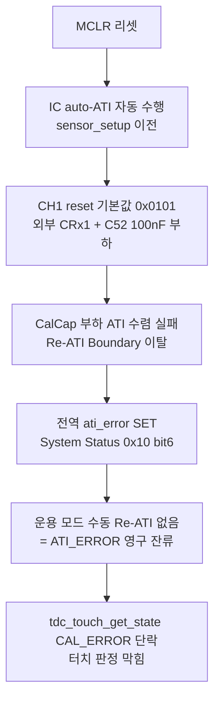

# 01 분석 — Full ATI 전환 (레지스터·I2C 무응답·폴링 충돌)

**TL;DR**: ATI Mode를 Disabled(0x36 LSB=0x08)→Full(0x0C)로 바꾸고 FIXED MULT/COMP write를 폐기하면 IC가 자율 보정·자동 Re-ATI를 수행한다. 과거 I2C 무응답의 진짜 원인은 "Full ATI 자체"가 아니라 ① ATI 진행 중 RDY 윈도우 미개방(force timeout)과 ② CH1 더미채널 reset 기본값(외부 CRx1+C52)의 auto-ATI 수렴 실패가 결합된 것이다. 100ms 폴링은 ATI burst와 충돌해도 read 실패만 일으키므로, 은수님 가정(실패 시 다음 100ms 재시도, N회 연속 실패 시 고장 판정)은 타당하다. 단 N은 POR/Re-ATI burst 시간을 흡수하도록 산정해야 한다([실측 게이트]). 권고 N=10(@100ms = 1초).

---

## 1. 핵심 질문 3가지

1. ATI Mode=Disabled→Full 전환 시 레지스터 변경점은 무엇인가
2. ATI 진행 중 I2C 무응답이 왜 났는가 (과거 펌웨어가 ATI를 끈 이유)
3. 100ms 폴링과 ATI burst 충돌 대책 — 은수님 가정(실패 시 재시도, N회 연속 실패=고장) 타당성·N값

---

## 2. 레지스터 변경점 (Disabled → Full)

### 2.1 직접 변경 — ATI Setup 0x36 LSB

현 코드 `write_ati_compensation()`가 0x36에 `TDC_DRV_IQS323_ATI_SETUP_LSB = 0x08`을 write한다 [`tdc_drv_iqs323.c:651·700`].

| 레지스터 | 비트 | 현(Disabled) | Full | 근거 |
|---|---|---|---|---|
| 0x36 ATI Setup | bits[2:0] ATI Mode | `000` (Disabled) | `100` (Full) | [데이터시트 06 §A.12] |
| 0x36 LSB 전체 | — | `0x08` | `0x0C` | bits[15:4]=64 Res Factor·bit3=1 Large Band 유지 시 |

- 0x36 reset = `0x040C` = bits[15:4]=64(Res Factor) + bit3=1(Large ATI Band 1/8) + bits[2:0]=100(Full) [06 §A.12].
- 현 코드는 reset의 bits[2:0]을 000으로 끈 `0x08`을 쓴다. **Full 복귀 = LSB를 `0x0C`로 되돌림** = reset 값과 동일. MSB는 `0x04` 유지 [`tdc_drv_iqs323.c:652`].
- 검증: 절전 측정 모드 코드가 이미 동일 전환을 실증한다 — `write_register(0x36, 0x0C, ...)` 주석 "ATI Mode=Full(bits[2:0]=100)" [`tdc_drv_iqs323.c:881~882`].

### 2.2 폐기 대상 — FIXED MULT/COMP

Full 모드에서는 ATI 알고리즘이 MULT(0x38)·COMP(0x39)를 **자동 산출**한다 [데이터시트 02 §5.9]. 따라서:

- `write_ati_compensation()`의 0x38(MULT)·0x39(COMP) write **폐기** [`tdc_drv_iqs323.c:711~729`].
- 보드 변종별 FIXED 테이블(MINI·DEVELOP·PACKAGE) **폐기** [`tdc_drv_iqs323.c:650~694`].
- `apply_sleep_settings()`의 SLEEP_ATI FIXED write도 동일 폐기 대상이나, 절전 시퀀스는 노드 03 담당.

> [!IMPORTANT]
> Full 전환의 본질은 "0x36 1비트 변경 + FIXED write 제거". 부수적으로 Re-ATI(자동/수동) 경로가 살아나므로, **CH timeout disable·ati_error 무시 같은 "ATI 봉쇄 장치"가 의미를 잃거나 충돌**한다(노드 02·07 연계).

### 2.3 Full 전환과 충돌·연동하는 현 설정

| 현 설정 | 위치 | Full 전환 시 영향 |
|---|---|---|
| CH timeout disable (0xC0 MSB=0x07) | `tdc_drv_iqs323.c:1155` | SW 타임아웃 채택 시 유지 가능. IC timeout 미사용 전제(노드 03) |
| ati_error 무시 `(void)ati_error` | `tdc_touch.c:393` | Full에서 ATI_Error 폴링→Re-ATI가 핵심이라 **반드시 해제**(노드 02) |
| CH1 더미채널 (CalCap) | `tdc_drv_iqs323.c:479~510` | Full 전환의 과거 무응답 재현 위험 핵심 — §3 참조 |
| RESEED 무조건 발행 (0xC0=0x08) | `tdc_drv_iqs323.c:1147` | Full에서 Re-ATI가 baseline 재보정하므로 게이트 재검토(노드 02·03) |

---

## 3. 과거 I2C 무응답의 진짜 원인 (왜 ATI를 껐나)

### 3.1 통념 vs 코드 ground truth

"Full ATI를 켜면 I2C가 무응답"이라는 통념은 **부분적으로만 맞다**. 직전분석·이슈해결 문서가 확정한 실제 원인은 두 갈래다.

#### 원인 A — ATI 진행 중 RDY 윈도우 미개방

- ATI burst 동안 IC는 I2C 통신 윈도우를 제공하지 않는다(ATI 진행 중 RDY 미열림) [직전분석 §8 02노드, 데이터시트 §8.4 "I²C disabled during ATI" 인용].
- 현 드라이버는 모든 transaction 전 `force_window_open()`을 호출하는데, ATI 중이면 RDY가 안 열려 `TDC_DRV_IQS323_MAX_WAIT_MS_FOR_WINDOW_OPEN`(45ms) 타임아웃 → false 반환 [`tdc_drv_iqs323.c:143~172·31`].
- 단 이것은 **일시적 read 실패**일 뿐, IC가 죽은 게 아니다. ATI 종료 후 RDY 재개방된다(아래 §4).

#### 원인 B — CH1 더미채널 auto-ATI 수렴 실패 (영구 ATI_ERROR)

이쪽이 과거 "먹통"의 실질 원인이다 [이슈해결 §4·§6 확정].



- MCLR 직후 auto-ATI는 `sensor_setup()`보다 **먼저** 돈다 [이슈해결 §6]. 그 시점 CH1은 아직 reset 기본값(외부 CRx1 + C52 DC-block 부하)이라 ATI 수렴 실패.
- 전역 ati_error가 SET되고, 운용 모드엔 수동 Re-ATI 발행 주체가 없어 영구 잔류 [데이터시트 02 §5.11 "Re-ATI 자동 트리거 안 됨, 수동 0xC0 bit2 필요"].
- 직전분석 v3 ATI_Error 영구먹통 경로와 동일 구조 [직전분석 §8 06노드 허점_3].

### 3.2 과거 펌웨어가 ATI를 끈 이유 (정리)

- ATI Disabled는 **두 원인을 동시에 회피**하는 임시방편이었다: ① auto-ATI burst 자체가 없어 RDY 미개방 구간 소멸, ② CH1 CalCap 수렴 실패도 ATI를 안 도니 안 남.
- 본 단순안의 전제는 이 회피를 풀고 Full로 가는 것이므로, **두 원인을 정면으로 해소해야 한다**:
  - **원인 A 해소**: 100ms 재시도(은수님 가정) — ATI 종료 후 자연 회복(§4·§5).
  - **원인 B 해소**: 단순안은 **CRX0 단일 채널, CH1 더미채널 폐기** [00 오케스트레이터 §1] → CalCap auto-ATI 수렴 실패원 자체 제거. 단 "단일 활성 채널 정지 이슈"가 재부상하므로 노드 07이 별도 검증.

> [!IMPORTANT]
> **결론**: Full ATI 전환의 과거 무응답은 "Full ATI 본질 결함"이 아니라 "CH1 더미채널 + 영구 ATI_ERROR 미처리"가 80%다. 단순안이 CH1을 폐기하고 ati_error 핸들러를 도입하면(노드 02) 원인 B는 소멸, 원인 A는 재시도로 흡수된다. **Full 전환은 안전하게 가능**하다 — 단 단일채널 정지(노드 07)·ATI_Error 핸들러(노드 02)가 선행 조건.

---

## 4. ATI burst 시간 정량 ([자료 미명시] — 실측 의존)

은수님 가정 평가에 필요한 t_ati를 데이터시트에서 추정한다.

### 4.1 데이터시트 명시값

- ATI 알고리즘은 "짧은 시간에 실행되어 사용자가 인지 못 함"이라고만 서술 — **구체 ms 미명시** [데이터시트 02 §5.9].
- POR Start-Up: Tinit ≈ 10ms, Time to first RDY ≈ 25ms [데이터시트 01 §4.6]. 이는 ATI 수렴 시간과는 별개.
- 현 펌웨어 부팅 ATI 대기 타임아웃 = `TDC_TOUCH_INIT_TIMEOUT_MS` 2500ms [`tdc_touch.h:27`], 블로킹 Re-ATI 대기 = 10회 × ~100ms~ ≈ 최악 2.3초 [`tdc_drv_iqs323.c:586~618`, 직전분석 §10].
- 직전분석 v1: "POR auto-ATI ~1.5초가 100ms 기준 15회 연속 실패" [직전분석 §8 04노드] — 단 이 1.5초는 [추정]이며 보드·채널 수 의존.

### 4.2 추정

- self-cap 단일 채널 Full ATI는 MULT(coarse·fine) + COMP 2단계 수렴 [데이터시트 02 §5.9]. 채널 1개라 multi-채널보다 짧다 [추정].
- **t_ati(단일 CRX0) ≈ 수백 ms 추정** [추정]. 정확값은 [실측 게이트] — 0x36 Full write 후 ati_active(0x10 bit5)가 1→0 되기까지 100ms 폴링 횟수 측정 필요.

---

## 5. 100ms 폴링 vs ATI burst 충돌 대책 (은수님 가정 평가)

### 5.1 은수님 가정

> I2C 실패 시 다음 100ms에 재시도, N회 연속 실패 시 고장 판정.

### 5.2 충돌 메커니즘

1. Re-ATI(자동/수동) 발생 → ATI burst 중 RDY 미개방 → 다음 100ms 폴링의 `read_status()` 내부 `force_window_open()` 45ms 타임아웃 → read 실패 [`tdc_drv_iqs323.c:182·232·246`].
2. ATI 종료 → RDY 재개방 → 다음 폴링 read 성공.

즉 충돌은 **read 실패 = "이번 tick은 상태 모름"**으로 나타나며, IC가 죽은 게 아니다. 이는 ATI burst 시간만큼만 지속된다(§4).

### 5.3 타당성 평가

| 항목 | 판정 | 근거 |
|---|---|---|
| "실패 시 다음 100ms 재시도" | **타당** | ATI burst는 유한 시간 → 재시도하면 종료 후 자연 회복. 현 논블로킹 폴링 구조와 정합 [`tdc_touch.c:337~341`] |
| "N회 연속 실패 = 고장" | **조건부 타당** | read 실패의 두 원인(ATI burst 진행 / 진짜 통신 장애)을 N으로 구분. **단 N이 ATI burst 시간보다 짧으면 정상 ATI를 고장 오판** [직전분석 §8 04노드 FM-01] |
| "묵시적 hold-last" 회피 | **필수 보완** | read 실패 중 상태를 직전값 유지하면 stuck-touch 롱터치 오발 위험 → **NOT_TOUCH 명시 강제** 권고 [직전분석 §8 보완_4] |

### 5.4 N값 권고

조건: `N × T_poll > t_ati_max` (ATI burst 동안의 연속 실패가 고장으로 오판되지 않아야 함).

- T_poll: 단순안은 100ms 폴링 가정 [00 오케스트레이터 §2]. (현 코드는 200ms `TDC_TOUCH_POLL_INTERVAL` [`tdc_touch.h:25`] — 단순안 전환 시 100ms로 변경 가정. 주기는 노드 06이 정합 검토.)
- t_ati_max: §4 [실측 게이트]. 보수적으로 t_ati ≤ 1초 가정 [추정] → N > 10.
- **권고 N = 10 (@100ms = 1초)**. 단 두 분기로 산정:
  - **부팅 POR 구간**: auto-ATI가 더 길 수 있음(직전분석 ~1.5초) → 부팅 카운터는 READY 전이 후에만 시작 [직전분석 §8 보완_2], 또는 부팅 전용 N_boot = 20(@100ms = 2초).
  - **운용 중 Re-ATI 구간**: 단일채널 t_ati 짧음 → N = 10 충분.

> [!IMPORTANT]
> **N은 임의 고정 금지** — t_ati 실측(0x36 Full write 후 ati_active 클리어까지 폴링 횟수) 후 `N > ceil(t_ati_max / T_poll) + 마진`으로 확정 [실측 게이트]. 마진은 force_window_open 이중 타임아웃(read 1회 = 2×45ms 최악) 고려 [직전분석 §9 명제_G].

### 5.5 read 실패 원인 3-상태 구분 (구조 보완)

현 `is_auto_ati_done_single_read()`·`read_status()`는 "통신 실패"와 "ATI 진행"을 둘 다 false로 미구분한다 [직전분석 §8 02·05노드, `tdc_drv_iqs323.c:312~331`]. 은수님 가정의 "고장 판정"이 정확하려면 다음 구분이 필요:

- **통신 실패** (force_window timeout, 0xEEEE 노이즈): 카운터 증가 → N 도달 시 고장.
- **ATI 진행 중** (ati_active=1을 읽을 수 있으면): 고장 아님 → 카운터 미증가가 이상적. 단 ATI 중엔 read 자체가 실패할 수 있어 ati_active를 못 읽을 수도 있음 → 결국 N 안전망으로 흡수.
- **ATI_Error** (read 성공 + bit6=1): 고장 아님, **Re-ATI 트리거 경로**(노드 02) — 카운터와 별개 처리.

---

## 6. 현 코드 init 시퀀스 대조

현 부팅 시퀀스 [`tdc_touch.c:289~299·216~271`, `tdc_drv_iqs323.c:1036~1164`]:

```
tdc_touch_init_begin()
  → mclr_reset()                         [IC POR → auto-ATI 자동 시작]
tdc_touch_process() (매 tick)
  → is_auto_ati_done() 논블로킹 폴링      [ati_active=0 대기, 2500ms 타임아웃]
  → apply_settings():
       ACK reset → confirm reset
       sensor_setup()                    [CH1 CalCap 더미 + CH0]
       touch_settings / prox_settings / events_enable
       write_ati_compensation()          [0x36=0x08 Disabled + FIXED MULT/COMP]  ← Full 전환점
       RESEED (0xC0=0x08)
       CH timeout disable (0xC0 MSB=0x07)
  → READY 전이 + boot_touch_ignore 가드
```

### Full 단순안 전환 시 변경점 (본 노드 범위)

| 단계 | 현재 | Full 단순안 |
|---|---|---|
| sensor_setup CH1 | CalCap 더미 활성 | **CH1 폐기**(노드 07 — 단일채널 정지 대책 전제) |
| write_ati_compensation | 0x36=0x08 + FIXED MULT/COMP | **0x36=0x0C(Full), MULT/COMP write 폐기** |
| auto-ATI 결과 | FIXED가 덮어씀 | **IC 자율 보정값 유지** |
| ati_error | `(void)` 무시 | **폴링→Re-ATI 핸들러**(노드 02) |
| RESEED | 무조건 | Re-ATI가 baseline 보정 → 게이트 재검토(노드 02·03) |
| read 실패 처리 | 논블로킹 false | **N회 연속 실패 카운터 + NOT_TOUCH 강제**(§5) |

> [!NOTE]
> Full 전환은 `apply_settings()`의 `write_ati_compensation()` 단계 1곳 변경 + sensor_setup CH1 폐기 + ati_error 핸들러 추가로 구현된다. 시퀀스 골격(MCLR → auto-ATI 대기 → ACK → setup → READY)은 그대로 유지된다. 부팅 ATI 대기 타임아웃(2500ms)은 Full에서 더 의미 있어진다(실제 auto-ATI 수렴 대기).

---

## 7. 핵심 결론

1. **레지스터 변경점**: 0x36 LSB `0x08`→`0x0C`(bits[2:0] 000→100 Full) 1비트 + FIXED MULT/COMP(0x38·0x39) write 폐기. MSB(0x04)·Res Factor·Large Band 유지. reset 값 `0x040C`과 동일. [데이터시트 06 §A.12, `tdc_drv_iqs323.c:651·881`]
2. **과거 I2C 무응답 원인**: ① ATI 진행 중 RDY 미개방(force timeout, 일시적) + ② CH1 더미채널 auto-ATI 수렴 실패→영구 ATI_ERROR(실질 먹통). 단순안의 CH1 폐기 + ati_error 핸들러로 원인 B 소멸, 원인 A는 재시도 흡수. [이슈해결 §4·§6, 데이터시트 02 §5.11]
3. **은수님 가정 타당성**: "실패 시 재시도"는 타당, "N회 연속=고장"은 조건부 타당(N이 t_ati보다 길어야). hold-last 대신 NOT_TOUCH 강제 + 3-상태 구분 보완 필수. [직전분석 §8]
4. **N값 권고**: N=10(@100ms=1초) 운용 구간, 부팅 POR는 N_boot=20 또는 READY 후 카운터 시작. t_ati 실측 후 확정. [실측 게이트]

---

## 8. 미해결·실측 게이트

- **[실측 게이트] t_ati(단일 CRX0 Full)**: 0x36 Full write 후 ati_active(0x10 bit5) 1→0까지 100ms 폴링 횟수. N 산정의 직접 입력.
- **[실측 게이트] 부팅 POR auto-ATI 시간**: CH1 폐기 후 단일채널 POR 수렴 시간 (현 ~1.5초 추정이 단일채널에서 줄어드는지).
- **[자료 미명시] ATI 중 RDY 미개방 지속**: force_window 45ms 타임아웃 1회로 ATI burst 전 구간을 커버하는지(burst가 45ms보다 길면 다중 폴링 tick 소요).
- **[추정] T_poll 100ms 확정**: 단순안 100ms 가정 vs 현 200ms — 노드 06 컨버전/전력 정합 결과 의존.
- 연계 의존: ati_error 핸들러 설계(노드 02), 단일채널 정지 대책(노드 07), RESEED 게이트(노드 02·03), 절전 Full 적용(노드 03).
