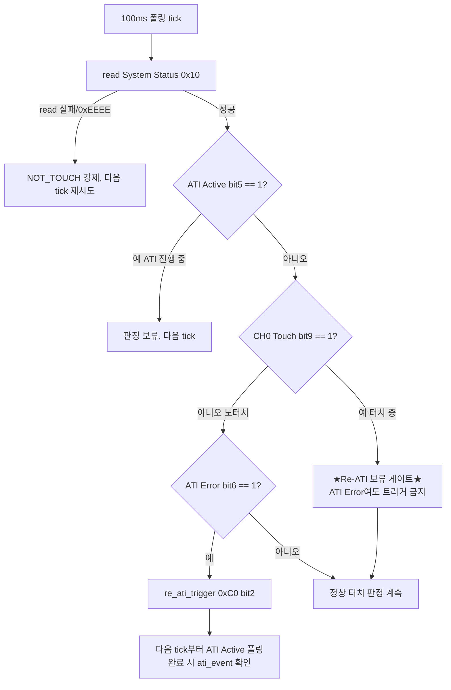

# 02 분석 — Re-ATI / ATI 에러 처리 (터치 중 Re-ATI 경계)

**TL;DR**: System Status(0x10) bit6 ATI Error 폴링→System Control(0xC0) bit2 Re-ATI 트리거 시퀀스를 데이터시트로 확정. **급소 결론: 자동 Re-ATI는 LTA 기반(§5.10)이라 터치 중 LTA 동결(§5.5)이 발동을 막는다 — 즉 IC 자동 경로는 안전.** 그러나 SW가 ATI Error 비트만 보고 무조건 Re-ATI를 쏘면 터치로 낮아진 Counts를 Target에 재정규화해 터치를 노터치로 학습한다. 따라서 **"터치 중 Re-ATI 보류" SW 게이트 필수**(CH0 Touch 비트로 분기). LTA halt는 자동 경로만 막고 수동 트리거는 못 막는다.

---

## 1. 역할·범위

- 다루는 요구사항: 요구사항_2(ATI 에러→Re-ATI), 요구사항_12(노말 루프 ATI 에러→Re-ATI), 요구사항_13(드리프트 LTA 밴드 이탈→Re-ATI), 검토_2(터치 중 Re-ATI 급소)
- 핵심 질문 2개:
  - **질문_1 (시퀀스)**: ATI Error 폴링→Re-ATI 트리거 레지스터·순서·완료 확인 시퀀스는?
  - **질문_2 (급소)**: 터치 판정 중 밴드이탈/ATI에러로 Re-ATI가 발동하면 터치를 노터치로 학습하는가? LTA halt(§5.5)가 이를 막는가? "터치 중 Re-ATI 보류" 게이트가 필요한가?

---

## 2. 데이터시트 사실관계 (인용 고정)

먼저 본 분석의 모든 결론이 의존하는 4개 원문 사실을 못 박는다.

| # | 사실 | 출처 |
|---|---|---|
| 사실_A | **터치·근접 이벤트 중 LTA는 동결(frozen)** — 갱신 멈춤 | [데이터시트 §5.5] "LTA는 touch·proximity 이벤트 중에는 frozen" |
| 사실_B | **자동 Re-ATI는 채널 LTA가 ATI Band 밖으로 drift할 때 실행** (트리거 입력 = LTA) | [데이터시트 §5.10] "re-ATI는 채널 LTA가 ATI Band(ATI Target 중심) 밖으로 drift할 때 실행" |
| 사실_C | **ATI Error는 ATI 완료 후 Counts가 Re-ATI Boundary 밖이면 set. 자동 재시도 없음 → master가 0xC0 bit2로 수동 트리거** | [데이터시트 §5.11] |
| 사실_D | **ATI 알고리즘은 현재 Counts를 입력으로 divider·multiplier·compensation을 재설정해 Counts를 ATI Target에 근접시킨다** | [데이터시트 §5.9] "ATI 트리거 시 먼저 divider·multiplier로 counts를 ATI Base에 근접… ATI Target = (적용 후 Counts) × (Resolution Factor/16)" |

> [!IMPORTANT]
> 사실_B와 사실_C의 **트리거 입력이 다르다**는 점이 급소의 분기점이다. 자동 Re-ATI의 입력은 **LTA**(사실_B), ATI Error의 판정 대상은 **Counts**(사실_C). 터치 중 LTA는 동결(사실_A)되지만 Counts는 실시간으로 낮아진다(self-cap, [§5.4] counts∝1/C).

---

## 3. 질문_1 — ATI Error 폴링 → Re-ATI 트리거 시퀀스

### 3.1 레지스터 맵 (확정)

| 단계 | 레지스터 | 비트 | 동작 |
|---|---|---|---|
| 폴링 | System Status `0x10` (RO) | bit6 ATI Error (0 정상·1 에러) [A.2] | 100ms 주기 read, set 검출 |
| 폴링 보조 | System Status `0x10` | bit5 ATI Active (1 = ATI 진행 중) [A.2] | Re-ATI 완료 판정 |
| 폴링 보조 | System Status `0x10` | bit4 ATI Event (1 = ATI 완료 이벤트) [A.2] | Re-ATI 성공 확인 |
| 트리거 | System Control `0xC0` | bit2 Re-ATI (1 = Trigger) [A.30] | Re-ATI 발행, IC가 자동 clear [§5.11] |

### 3.2 현 코드 자산 (재사용 가능)

현 드라이버에 트리거·완료확인 함수가 이미 존재한다 — Full ATI 전환 시 그대로 활용한다.

- `re_ati_trigger()` ([tdc_drv_iqs323.c:569]): `0xC0`에 `lsb.re_ati=1` write. **시퀀스 정확** (사실_C 부합).
- `wait_re_ati_done()` ([tdc_drv_iqs323.c:581]): ati_error set이면 false, ati_event set이면 true 반환. **단 블로킹 루프(최대 10회×100ms=1초)** — 운용 메인루프엔 부적합, 논블로킹 폴링으로 재작성 필요.
- `tdc_drv_iqs323_read_status()` ([tdc_drv_iqs323.c:1166]): `p_ati_error`로 bit6를 이미 추출. **현재는 호출부에서 `(void) ati_error`로 무시**([tdc_touch.c:393]) — Full ATI 전환 시 이 무시를 **제거**하고 게이트 통과 시 Re-ATI로 연결해야 한다.

> [!NOTE]
> 현 코드의 `(void) ati_error` 무시는 ATI Disabled + CalCap 더미채널 시절의 정당한 회피였다([이슈해결 §7]: 운용 모드가 ATI를 안 써서 ati_error가 무의미). **Full ATI 전환으로 이 전제가 깨진다** — ATI를 실제로 쓰므로 ati_error는 다시 유효한 신호가 된다. 회귀 충돌 지점(10_검증 참조).

### 3.3 운용 폴링 시퀀스 (논블로킹, 권고 골격)



핵심: **터치 판정(D)을 Re-ATI 트리거(F→G)보다 먼저 분기**한다. 터치 중이면 ATI Error가 떠 있어도 Re-ATI를 보류하고, 노터치 구간에서만 Re-ATI를 발행한다.

---

## 4. 질문_2 (급소) — 터치 중 Re-ATI가 터치를 노터치로 학습하는가?

### 4.1 두 경로 분리 — 자동 Re-ATI vs SW 강제 Re-ATI

급소를 풀려면 Re-ATI가 발동하는 **두 경로**를 분리해야 한다. 결론이 정반대다.

| 경로 | 트리거 입력 | 터치 중 거동 | 위험 |
|---|---|---|---|
| **경로_1: IC 자동 Re-ATI** | LTA가 ATI Band 밖 drift (사실_B) | LTA 동결(사실_A) → drift 자체가 멈춤 → **밴드 이탈 발생 안 함 → 자동 Re-ATI 미발동** | **없음** (LTA halt가 막아줌) |
| **경로_2: SW가 ATI Error 보고 강제 Re-ATI** | SW가 0x10 bit6 set 검출 후 0xC0 bit2 write (사실_C) | LTA 동결과 **무관** — SW가 능동 발행. Re-ATI는 현재 Counts(터치로 낮아짐)를 Target에 맞춤(사실_D) → **터치 Counts를 노터치 기준으로 재정규화** | **치명** (터치를 노터치로 학습) |

### 4.2 LTA halt가 막는 범위 — "절반만 막는다"

은수님이 검토_2에서 던진 "LTA halt가 막아주는가?"에 대한 정확한 답:

> **LTA halt(§5.5)는 경로_1(IC 자동 Re-ATI)만 막는다. 경로_2(SW 강제 Re-ATI)는 못 막는다.**

논거:
- 자동 Re-ATI의 발동 조건은 "LTA가 ATI Band 밖으로 drift"(사실_B)다. 터치 중 LTA는 동결(사실_A)되어 **그 자리에 고정**되므로 밴드를 벗어날 수 없다. 따라서 IC는 터치 중 자동 Re-ATI를 스스로 발동하지 않는다. → **은수님 직관 "LTA halt가 막아준다"는 자동 경로에 한해 참.**
- 그러나 요구사항_2/요구사항_12가 명시한 **"상태 레지스터 읽어 ATI 에러면 Re-ATI"는 경로_2다.** 이건 SW가 직접 0xC0 bit2를 쓰는 것이라 LTA 동결과 아무 상관이 없다. SW가 터치 중에도 쏠 수 있다.

### 4.3 경로_2가 터치를 노터치로 학습하는 메커니즘 (정량)

self-cap 터치 시 Counts가 LTA 아래로 내려간 상태에서 SW가 Re-ATI를 강제하면:

```
[터치 중 상태]
  LTA      = L  (동결, 노터치 baseline)
  Counts   = C_touch < L   (손가락 추가용량 → counts 감소, §5.4)
  Delta    = L − C_touch > Touch Threshold  → 터치 판정 성립

[SW가 Re-ATI 강제 발행 (경로_2)]
  ATI 알고리즘이 현재 Counts(C_touch)를 입력으로 (사실_D)
  divider·multiplier·comp를 재설정 → C_touch 를 ATI Target 근방으로 끌어올림
  결과: Counts' ≈ ATI Target  (터치 중인데 노터치 목표값으로 정규화됨)

[Re-ATI 직후 LTA 재동기]
  Re-ATI는 보정 후 baseline을 새 Counts에 맞춤 (LTA ← Counts' ≈ Target)
  → LTA' ≈ Counts'  → Delta' ≈ 0

[손을 뗀 후]
  손가락 제거 → 실제 노터치 Counts는 정규화 기준보다 더 높아짐(C 감소분 회복)
  Counts_release > LTA'  → Delta = LTA' − Counts_release < 0
  → self-cap 판정식 (LTA − Counts) > Threshold 미충족 → 노터치 (정상 복귀처럼 보임)
  그러나 baseline이 "터치 상태 기준"으로 오염 →
  다음 진짜 터치의 Delta 마진이 변질, 최악엔 영구 미감지
```

이것은 [이슈해결 §0]의 과거 ESD 먹통(터치 counts로 LTA가 seed되어 손 떼도 미인식)과 **동형 실패**다. Re-ATI는 RESEED보다 더 강하게 작동한다 — LTA뿐 아니라 게인(MULT/COMP)까지 터치 상태에 맞추기 때문이다.

> [!CAUTION]
> [적용가이드 §2.3 / AZD004 §12.7] "interaction(상호작용) 중 ATI는 constant errors를 유발"·[AZD125 §8.1] "자동 추종은 device가 not in touch일 때만 허용" — **두 외부 앱노트가 독립적으로 '터치 중 ATI 금지'를 명시**한다. 경로_2 보류 게이트의 외부 근거.

### 4.4 추가 함정 — 터치 중 ATI Error는 "정상 발생"한다

[직전분석 §190]: 터치로 counts가 낮아진 상태에서 ATI가 돌면 Target까지 못 올려 **하향 이탈 → ATI Error**가 정상적으로 뜬다([§5.4] + [§5.11] 조합). 즉:

- 터치 부팅·터치 중 환경급변 시 ATI Error bit6가 set되는 것은 **이상이 아니라 물리적 정상 결과**다.
- SW가 이걸 "에러니까 Re-ATI"로 단순 반응하면 → 경로_2 발동 → 터치를 노터치 학습.
- 게다가 Re-ATI를 쏴도 터치가 유지되는 한 또 하향 이탈 → 또 ATI Error → **Re-ATI 무한 재발**(검토_8 burst 위험과 결합).

따라서 ATI Error는 "터치 여부"와 함께 해석해야 하며, **단독 신호로 Re-ATI를 발행하면 안 된다.**

---

## 5. 결론 — "터치 중 Re-ATI 보류" 게이트 필요 여부

### 5.1 판정: **게이트 필수 (NECESSARY)**

| 질문 | 결론 |
|---|---|
| 터치 중 Re-ATI가 터치를 노터치로 학습하는가? | **경로_2(SW 강제)는 예** — Counts를 Target에 재정규화(사실_D) → 손 떼도 baseline 오염 |
| LTA halt(§5.5)가 막는가? | **자동 경로(경로_1)만 막는다.** SW 강제 경로(경로_2)는 못 막는다 — 트리거 입력이 LTA가 아니라 SW write |
| "터치 중 Re-ATI 보류" 게이트 필요? | **필수.** 요구사항_2/12가 SW 폴링 기반 Re-ATI(경로_2)를 명시하므로, LTA halt에만 의존하면 막을 수 없다 |

### 5.2 게이트 규칙 (구현 명세)

> **규칙: Re-ATI는 "CH0 Touch == 0 (노터치) AND ATI Active == 0 (ATI 미진행)"인 폴링 tick에서만 발행한다.**

- **노터치 게이트** (필수): `System Status` bit9(CH0 Touch)==0 일 때만 Re-ATI 허용. 터치 중이면 ATI Error가 떠도 보류.
- **ATI Active 게이트** (필수): bit5(ATI Active)==1이면 이미 진행 중 → 중복 트리거 금지.
- **부수 효과**: 터치 중 누적된 ATI Error는 손을 뗀 직후 첫 노터치 tick에서 처리된다 → 자연스러운 지연 해소. 터치가 30초 이상 stuck이면 SW 타임아웃(노드 03)이 별도 처리.

### 5.3 게이트 + 안정화 (검토_8 연계)

노터치 게이트만으로 burst를 완전히 못 막는 경우(환경 급변으로 노터치 구간에도 연속 Re-ATI):
- [적용가이드 §2.3 / AZD004 §12.7] "Re-ATI 사이에 delay 추가" 권고 적용 → **Re-ATI 발행 후 최소 N초 쿨다운**(연속 재발행 금지). 구체 N은 노드 06 컨버전/ATI 시간 + 노드 99 종합에서 확정.

### 5.4 LTA halt의 잔여 가치 — 자동 경로 안전망

게이트가 경로_2를 막는다고 LTA halt가 무의미한 건 아니다. **경로_1(IC 자동 Re-ATI)은 LTA halt 덕분에 게이트 없이도 안전**하다. 즉 Full ATI에서 자동 Re-ATI를 켜둬도, 터치 중 자동 발동은 LTA 동결로 원천 차단된다. SW 게이트는 경로_2 전용이다. **두 방어가 경로별로 정확히 분담**한다.

---

## 6. 미해결·실측 게이트

| 항목 | 내용 | 라벨 |
|---|---|---|
| 미해결_1 | Re-ATI 1회 소요시간(ATI burst) — 게이트 쿨다운 N값 산정 근거 | [실측 게이트] (노드 06 의존) |
| 미해결_2 | 터치 중 ATI Error set까지의 폴링 latency — 손 뗀 후 baseline 정상화 시간 | [실측 게이트] |
| 미해결_3 | Re-ATI 직후 LTA 자동 재동기 동작이 RESEED와 동일한지 — Re-ATI가 LTA를 새 Counts로 seed하는지 데이터시트 명시 없음(§5.9는 게인만 언급, LTA 재seed는 [자료 미명시]) | [자료 미명시] → 실측 확인 |
| 미해결_4 | Full ATI 자동 Re-ATI(경로_1)와 SW 강제 Re-ATI(경로_2) 동시 활성 시 상호 간섭 — 자동이 노터치 drift로 돌고 SW가 노터치 ATI Error로 돌 때 중복 가능성 | [실측 게이트] (ATI Active 게이트로 1차 방어, 노드 99 종합) |

> [!NOTE]
> 미해결_3이 게이트 설계의 안전마진을 좌우한다. Re-ATI가 LTA를 자동 재seed하지 **않으면** 경로_2 발동 후에도 LTA가 옛 baseline을 유지해 피해가 줄 수 있다. 반대로 재seed하면 §4.3 시나리오대로 즉시 오염된다. 데이터시트는 §5.9에서 게인 보정만 명시하고 LTA 거동은 침묵 → **보수적으로 "재seed한다"고 가정**하고 게이트를 거는 것이 안전하다.

---

## 7. 설계 함의 (노드 99 종합 입력)

1. **`(void) ati_error` 무시 제거** ([tdc_touch.c:393]) — Full ATI 전환의 필수 선행. ati_error를 다시 유효 신호로 격상.
2. **Re-ATI 트리거 게이트 함수 신규**: `tdc_touch_should_re_ati()` 류 — 조건 `CH0 Touch==0 && ATI Active==0 && ATI Error==1` AND 쿨다운 경과. 터치 판정 분기를 Re-ATI 분기보다 **앞에** 둔다(§3.3 플로우).
3. **`wait_re_ati_done()` 논블로킹화**: 현 블로킹 루프(최대 1초)는 메인 100ms 폴링과 충돌 → ATI Active 폴링 기반 상태머신으로 재작성.
4. **자동 Re-ATI(경로_1)는 Full ATI에서 켜두되 LTA halt에 위임** — SW가 별도 차단 불필요. SW 게이트는 경로_2(ATI Error 응답)에만 적용.
5. **터치 중 ATI Error는 정상으로 간주** — 에러 카운트/알림 트리거로 쓰지 말 것. 노터치 구간 ATI Error만 실제 캘리 이상 신호.
