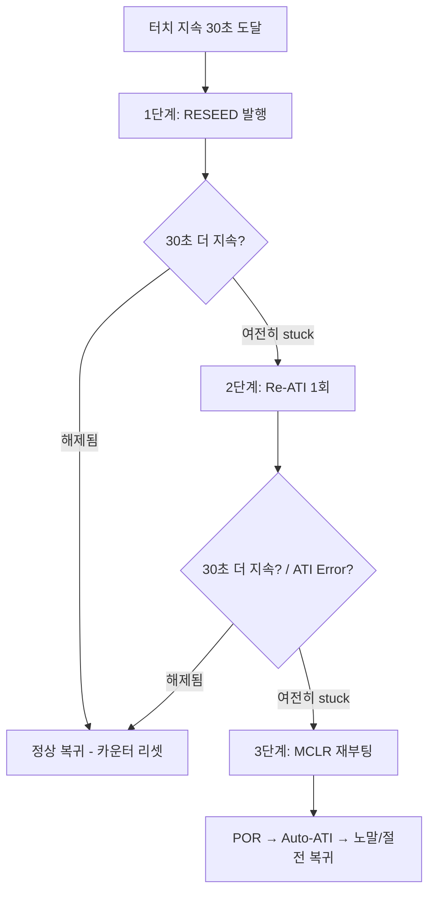
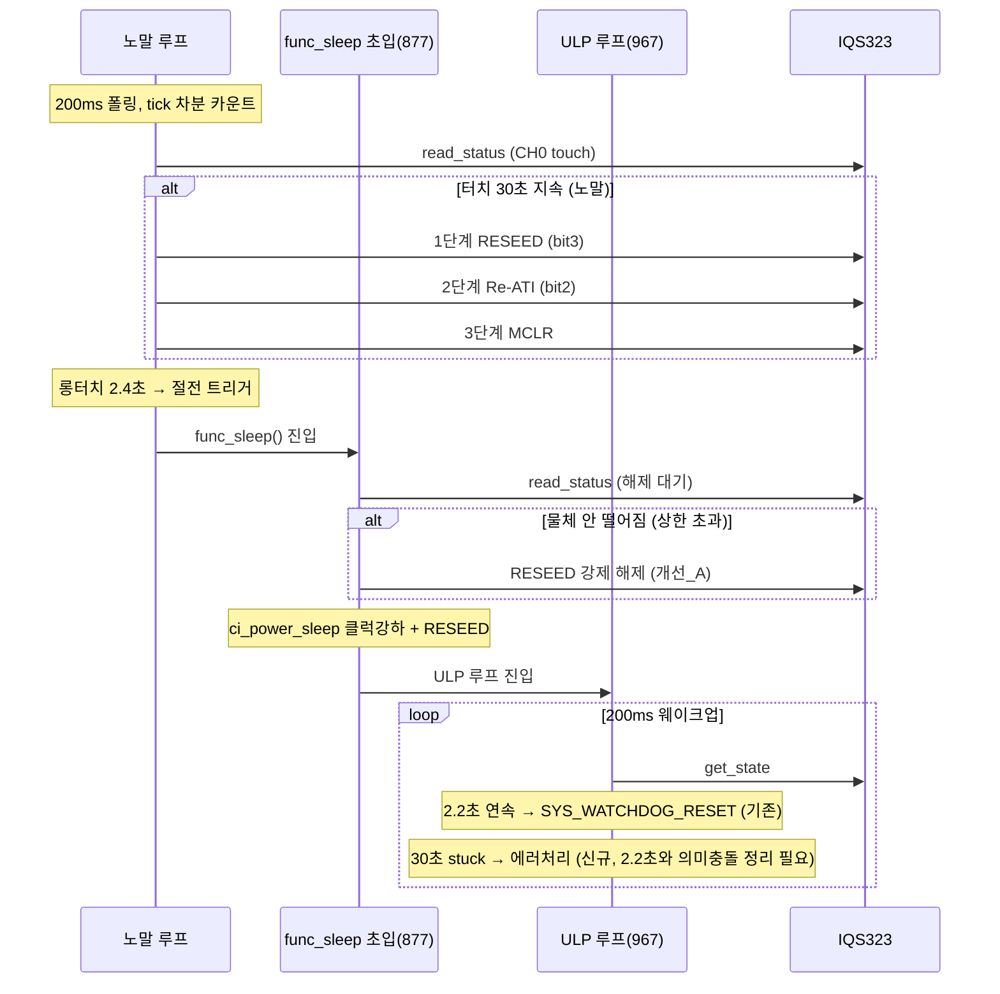

# 03 분석 — SW 타임아웃 시퀀스

**TL;DR**: 터치 지속시간을 노말·절전 양쪽에서 100ms/200ms 폴링 tick 누적으로 SW 카운트한다(read 실패·노터치 시 0 리셋). 절전 30초 대기는 **함수 초입 877행 단일 대기루프가 아니라 967행 ULP 루프에 통합**해야 한다(초입 대기는 ULP 클럭 강하 전이라 30초가 비현실적이고 워치독·전류 손해). Full ATI면 절전 함수 내 RESEED는 보존 권고(노터치 환경 baseline 재동기), Fixed 게인 재쓰기는 불필요. 30초 후 에러 처리는 **1순위 RESEED(System Control bit3) → 효과 없으면 Re-ATI(bit2) 1회 → 그래도 stuck이면 MCLR 재부팅** 3단계 에스컬레이션을 권고한다. MCLR 단독 1단계는 과하고(부팅 비용·human-in-the-loop 방해), RESEED 단독은 게인 왜곡 미복구라 불충분하다.

---

## 1. 다루는 요구사항·검토

| 항목 | 내용 |
|---|---|
| 요구사항_3 | IC 타임아웃 미사용. SW에서 터치 유지 시간 체크 → 30초 이상 지속 시 에러 처리 |
| 요구사항_4 | 약 3초 후 절전 진입 시 3초 + 이후 터치 유지 시간 체크 방법 필요. 노말/절전 함수·시퀀스 다름 |
| 요구사항_5 | 절전 함수 초입에서 30초 대기? vs 절전 루프 내 대기? (Full ATI면 절전 함수 내 센서 재설정 불필요?) |
| 요구사항_10 | 노말 부팅 시 터치 유지를 노말 메인 루프에서 확인(초기화서 해제 대기 불필요) |
| 검토_1 | SW 타임아웃 30초 후 "에러 처리"의 구체 동작 (Re-ATI/Reseed/MCLR/알림) |

---

## 2. 현 코드 구조 (ground truth)

### 2.1 노말 루프 — 터치 폴링은 이미 존재

- `func_normal()` while 루프 안에서 `tdc_touch_process()` 호출([main.c:450]). 이 함수가 `TDC_TOUCH_POLL_INTERVAL`(200ms, [tdc_touch.h:25])마다 `tdc_touch_get_state()`로 상태를 읽고 `proc_long_touch()`로 2.4초 롱터치를 판정해 절전 트리거(`powerButtonPushed`)를 만든다([tdc_touch.c:301~377]).
- 즉 **노말 루프는 200ms 주기로 터치 상태를 이미 샘플링**하고 있으며, 지속시간 카운트(롱터치 2.4초)도 tick 차분(`ci_timer_get_tick() - s_tick_first_touch`)으로 구현돼 있다([tdc_touch.c:103]). **30초 SW 타임아웃은 이 패턴을 그대로 확장**하면 된다.
- 부팅 직후 터치 무시(`s_boot_touch_ignore`)는 `tdc_touch_process()` 안에서 노말 루프 폴링으로 해제 판정한다([tdc_touch.c:351~367]) — 요구사항_10의 "초기화서 해제 대기 불필요"가 이미 충족됨.

### 2.2 절전 함수 — 대기루프 2곳

`func_sleep()`([main.c:869~1026])에는 터치를 보는 루프가 **둘** 있다.

| 위치 | 코드 | 성격 | 클럭 |
|---|---|---|---|
| 초입 대기루프 | [main.c:877~882] `while(read_status && pressed) { delay_ms(100); }` | **터치 해제 1회 확인 전까지 블로킹** | 정상속도 (ci_power_sleep 전) |
| ULP 루프 | [main.c:967~1023] `while(1) { WFI; get_state; ... }` | 절전 본 루프 (200ms 웨이크업) | 저속 (ci_power_sleep 후, SYSCLK 2.56M) |

- **초입 대기루프(877행)**: 절전 진입 직전 "터치 해제가 한 번 인식돼야" 다음 단계(RESEED·클럭 강하·ULP 루프)로 진행한다. 전도성 물체가 안 떨어지면 여기서 막힌다([브레인스토밍 §2-1]).
- **ULP 루프(967행)**: 이미 `touch_cnt`로 연속 터치를 카운트한다([main.c:958, 996~1003]). `ULP_LONG_TOUCH_COUNT`(=`ceil(2200/200)`=11회) 연속 터치면 `SYS_WATCHDOG_RESET()`로 칩 리셋([main.c:997~1001]). **즉 ULP 루프엔 이미 "터치 지속 카운트 → 동작" 골격이 존재**한다.

> [!IMPORTANT]
> 절전 루프(967행)는 **터치 지속 SW 카운트의 본거지로 이미 구현돼 있다.** 30초 타임아웃은 `ULP_LONG_TOUCH_COUNT`(11회=2.2초)와 **별개의 더 긴 임계(30초=150회)**를 추가하는 일이다. 다만 현재 2.2초 동작은 "리셋(재부팅=절전 복귀)"이므로, 30초 동작과 의미가 겹치지 않게 분리 설계가 필요하다(§5.3).

---

## 3. 터치 지속시간 SW 카운트 방법

### 3.1 권고 — tick 차분 방식 (카운터 방식보다 견고)

두 가지 구현이 가능하다.

| 방식 | 원리 | 장점 | 단점 |
|---|---|---|---|
| **(A) tick 차분** | 첫 터치 tick 저장 → `now - first ≥ 30000ms` 판정 | 폴링 주기 변동·웨이크업 지터 무관. 절대 시간 정확 | tick 오버플로 방어 필요 |
| (B) 연속 카운터 | 터치 1회마다 `cnt++`, 임계 `cnt ≥ N` | 단순(현 ULP `touch_cnt` 방식) | 폴링 주기 정확도에 의존, 주기 변동 시 시간 오차 |

- **노말 루프**: `proc_long_touch()`([tdc_touch.c:78])가 이미 (A) tick 차분이다. 동일 패턴으로 `TDC_TOUCH_STUCK_TIMEOUT_MS`(30000) 임계를 추가하면 된다. `ci_timer_get_tick()`은 `g_ci_timer_main_tick`(CFX iteration 활성 시 증가) 기준이라 노말에서 유효.
- **절전 루프**: ULP 루프는 200ms 주기가 `ci_timer_init_prescaled()`로 하드웨어 고정([main.c:954])이므로 (B) 카운터도 시간 오차가 작다(`30000/200=150`회). 단 **저속 클럭(2.56M)에서 `g_ci_timer_main_tick`이 정상 증가하는지 불확실**[실측 게이트] → 절전은 **WFI 웨이크업 카운트 (B)**가 안전하다. 현 `touch_cnt`([main.c:958])와 동일 계열.

> [!NOTE]
> 노말은 (A) tick 차분, 절전(ULP)은 (B) 웨이크업 카운트 — **두 환경의 시간 기준이 다르므로 카운트 방법도 분리**하는 것이 자연스럽다. 공통 임계 상수(`TDC_TOUCH_STUCK_TIMEOUT_MS=30000`)만 공유하고, 절전은 `30000/ULP_WAKE_INTERVAL_MS=150`회로 환산.

### 3.2 카운터 리셋 규칙 (공통)

- **노터치 판정** → 카운터/첫터치 tick 리셋 (현 ULP `touch_cnt=0` [main.c:1012]와 동일).
- **read 실패** → 리셋 (현 ULP `touch_cnt=0` [main.c:1021]와 동일). read 실패를 stuck으로 오판하면 통신 글리치가 30초 누적돼 오동작.
- **에러 처리 발동 직후** → 리셋(재카운트). 에스컬레이션 단계 진행을 위해(§5.3).

### 3.3 요구사항_4 "3초 + 이후 터치 유지" 해석

- 노말에서 터치 2.4초([TDC_TOUCH_LONG_TOUCH_MS])면 절전 트리거. 절전 진입 후에도 물체가 붙어 있으면 ULP 루프에서 다시 카운트.
- **두 구간의 카운트는 연속이 아니다**(노말 카운터는 절전 진입 시 리셋, 절전은 0부터 시작). 은수님이 말한 "3초 + 이후"는 **물리적으로는 누적 33초+지만, SW 구현은 절전 진입 후 30초부터 새로 카운트**하는 것이 단순·안전하다. 누적 합산을 굳이 이어붙일 실익이 없다(절전 진입 = 환경·클럭·감도 전부 바뀜 → 카운트 리셋이 의미적으로 옳음).

---

## 4. 절전 30초 대기 위치 — 은수님 질문 (초입 877행 vs 루프 967행)

### 4.1 결론: **ULP 루프(967행)에 통합** — 초입 877행 대기에 30초를 넣지 말 것

| 비교 항목 | 초입 877행 대기루프 | ULP 루프 967행 |
|---|---|---|
| 클럭 | 정상속도(30.72M) — `ci_power_sleep()` 전 | 저속(2.56M) — 절전 본연 |
| 전류 | 높음 (절전 미진입 상태) | 낮음 (ULP) |
| 30초 머무름 | **절전 진입이 30초 지연** → 그동안 정상전류 소비 | 절전 상태에서 카운트 |
| delay 방식 | `delay_ms(100)` busy/blocking | `WFI` (인터럽트 대기, 저전력) |
| 워치독 | refresh 있음(문제 없음) | refresh 있음 |
| 의미 | "해제 1회 확인" 게이트 | "절전 중 터치 모니터링" |

- **초입 877행 대기에 30초 타임아웃을 넣으면**: 전도성 물체가 붙은 채로 절전을 시도할 때 **정상속도·고전류 상태로 최대 30초 머무른다**. 절전의 목적(저전력)에 정면 배치된다.
- **올바른 설계**: 초입 877행 대기루프는 **타임아웃 없이 빠르게 통과시키거나(또는 N회 제한 후 강제 RESEED로 해제) ULP 루프로 넘긴다**. 진짜 30초 stuck 감시는 저전력 ULP 루프(967행)에서 한다.

### 4.2 초입 877행 대기루프의 처리 (구체)

현 877행은 "터치 해제까지 무한 대기"라 물체가 안 떨어지면 영구 블로킹(워치독은 refresh돼 리셋도 안 걸림 → 먹통). 두 가지 개선안:

| 개선안 | 동작 | 평가 |
|---|---|---|
| **개선_A (권고)** | 877행 대기에 **짧은 상한**(예: N=수 초, 또는 즉시) 두고, 상한 초과 시 **RESEED 1회로 강제 해제**(물체를 노터치 baseline화 → `pressed=false`) → ULP 루프 진입. 진짜 30초 감시는 ULP 루프에서 | 절전 진입 지연 최소화 + 저전력 루프에서 본 감시. 브레인스토밍 §2-1 "절전 진입 대기 먹통" 해소 |
| 개선_B | 877행 대기를 아예 제거하고 곧장 RESEED·클럭강하·ULP 진입 | 가장 단순하나, 터치 중 RESEED가 물체를 baseline에 굳혀 ULP에서 손 떼도 미인식(delta=0) 위험 → ULP 첫 200ms 후 LTA 추종 필요. 02노드 "터치 중 Re-ATI 경계"와 연계 검토 |

> [!WARNING]
> 877행 대기에서 RESEED로 강제 해제하면 **물체 counts가 LTA에 박혀** 이후 손/물체를 떼도 delta≈0으로 미인식될 수 있다([직전분석 §A "진입 baseline 오염"]). 이는 ULP 루프 진입 후 LTA가 노터치 환경으로 재수렴(Beta)하거나 밴드 이탈 Re-ATI로 풀린다. **Beta 수렴 속도(04노드)·터치 중 Re-ATI 경계(02노드)와 반드시 교차검증** 필요.

---

## 5. Full ATI 시 절전 함수 내 센서 재설정 필요 여부 (요구사항_5)

### 5.1 현 절전 시퀀스 (ground truth, [main.c:944~952])

```
apply_sleep_settings()  // THRESHOLD/HYSTERESIS/MULT/COMP/CH_TIMEOUT 기록 (정상속도 I2C)
  → ci_power_sleep()    // SYSCLK 30.72M→2.56M 클럭 강하
  → i2c_set_master_prescale()  // SCL 122kHz 유지
  → tdc_drv_iqs323_reseed()  // SLEEP 감도 재적용 + System Control bit3 RESEED 발행
```

### 5.2 Full ATI에서 무엇이 불필요해지나

| 현 절전 단계 | Fixed/Disabled 시 | Full ATI 시 | 권고 |
|---|---|---|---|
| Fixed MULT/COMP 재쓰기 (`apply_sleep_settings` 내 SLEEP_ATI) | 필요 (보드별 고정 게인) | **불필요** — Full ATI가 자동 게인 산출. Fixed write는 오히려 ATI 결과를 덮어씀 | **제거** |
| THRESHOLD/HYSTERESIS (절전 감도) | 필요 | **여전히 필요** — 절전은 약터치도 잡아야 하므로 감도 상향 유지 | 유지 |
| RESEED (System Control bit3) | 필요 (baseline 동기) | **보존 권고** — 절전 환경(주변장치 OFF) baseline으로 LTA 재동기. 단 터치 해제 후에만 | 조건부 유지 |
| CH_TIMEOUT_DISABLE | 필요 (IC 타임아웃 비활성) | SW 타임아웃 쓰므로 **IC 타임아웃 계속 비활성** | 유지 |

> [!IMPORTANT]
> **"센서 재설정 불필요"의 정답**: Full ATI면 **게인(MULT/COMP) 고정값 재쓰기는 불필요**하다(자동 산출). 그러나 **RESEED(baseline 재동기)와 절전 감도(THRESHOLD) 설정은 여전히 필요**하다. 절전은 노말과 환경(주변장치 OFF·클럭 저속)이 달라 baseline이 이동하므로, 터치 해제 후 RESEED로 한 번 맞춰주는 것이 안전하다. 단, **Full ATI라면 클럭 강하 후 Re-ATI를 한 번 돌려 저속 환경에 맞는 게인을 재산출**하는 선택지도 있다([실측 게이트] — 저속 2.56M에서 ATI burst 성공 여부는 06노드 컨버전 분석·실측 의존).

### 5.3 RESEED vs Re-ATI 의미 차이 (System Control 0xC0, [데이터시트 A.30])

- **bit3 Reseed** = LTA를 현재 counts로 강제 동기화. **게인 재보정 없음**. 물체를 노터치 기준으로 재정의 + 상태 clear. (현 `tdc_drv_iqs323_reseed()`가 `0x08`=bit3 발행 [iqs323.c:945])
- **bit2 Re-ATI** = ATI 알고리즘 재실행(게인 MULT/COMP 재산출) + baseline 재설정. (현 `re_ati_trigger()`가 bit2 발행 [iqs323.c:576])
- **bit1 Soft Reset / bit0 ACK Reset** = 소프트 리셋 / 이벤트 ACK.

→ **stuck 해제 강도: RESEED < Re-ATI < MCLR**. 30초 에러 처리는 이 강도 순으로 에스컬레이션한다(§6).

---

## 6. 30초 후 "에러 처리" 구체 동작 정의 (검토_1 — 핵심 결정)

### 6.1 후보별 평가

| 후보 | 동작 | 장점 | 단점·위험 |
|---|---|---|---|
| RESEED | LTA←현재 counts, 상태 clear (bit3) | 가볍고 빠름, ULP 유지, 게인 안 건드림 | 게인 왜곡(큰 물체·드리프트)은 미복구. 물체 붙은 채면 또 stuck |
| Re-ATI | 게인 재산출 (bit2) | 게인 왜곡까지 복구 | ATI burst 동안 I²C 무응답 위험(검토_4), 저속 클럭서 성공 불확실[실측 게이트], 물체 붙은 채면 ATI Error |
| MCLR 재부팅 | 하드 리셋 → POR → Auto-ATI | 가장 확실한 회복 (Max Counts 포화도 풀림) | 부팅 ~500ms+ATI 비용, 절전 깨짐, human-in-the-loop 흐름 끊김 |
| 사용자 알림 | LED 패턴 등 | 인지 유도(human-in-the-loop) | 단독으론 stuck 미해소. 보조 수단 |

### 6.2 권고 — 3단계 에스컬레이션 (RESEED → Re-ATI → MCLR)



| 단계 | 트리거 | 동작 | 근거 |
|---|---|---|---|
| 1 | 터치 30초 지속 | **RESEED** (System Control bit3, 현 `tdc_drv_iqs323_reseed()` 재활용 가능하나 절전 감도 재적용 부작용 분리 필요) | 가장 가벼운 해제. 대부분의 "노터치 환경 LTA 표류 + 약한 오접촉"을 푼다. ULP 유지 [데이터시트 §5.8 timeout 동작=Reseed와 동형] |
| 2 | RESEED 후 30초 더 지속 | **Re-ATI 1회** (bit2). 단 터치 중 Re-ATI 경계(02노드) 적용 — ATI Error면 게인 왜곡 복구 시도 | 게인 왜곡(큰 물체 근접·온도 드리프트 누적)까지 복구. RESEED로 안 풀린 케이스 |
| 3 | Re-ATI도 실패(또는 ATI Error 반복·Max Counts 포화) | **MCLR 재부팅** (`tdc_drv_iqs323_mclr_reset()` → 칩 POR, 또는 시스템 `SYS_WATCHDOG_RESET()`) | 유일한 최종 회복 경로. Max Counts 포화는 conversion 정지라 MCLR만 회복 [적용가이드 §5, 검토_7] |

> [!IMPORTANT]
> **단일 동작이 아니라 에스컬레이션이 정답인 이유**: ① RESEED 단독은 게인 왜곡 미복구(검토_7 Max Counts 케이스 못 풂). ② MCLR 단독은 매번 부팅 비용·절전 깨짐이 과하고, 대부분의 stuck은 RESEED로 충분히 풀려 과잉 대응. ③ human-in-the-loop([브레인스토밍 §2])가 1·2단계 사이에 작동하면(사용자가 물체 치움) 보통 MCLR까지 안 간다. **각 단계마다 30초 재카운트**로 사람·환경 변화에 기회를 준다.

### 6.3 노말 vs 절전 에러 처리 차이

| | 노말 루프 | 절전 ULP 루프 |
|---|---|---|
| 카운트 | tick 차분 (A), `tdc_touch_process` 확장 | 웨이크업 카운트 (B), `touch_cnt`와 별도 30초 카운터 |
| 1단계 RESEED | 가능 (정상속도 I2C) | 가능 (저속 I2C 122kHz, 단일 레지스터 write라 부담 작음) |
| 2단계 Re-ATI | 가능(정상 클럭, burst 성공 유리) | **저속 클럭서 ATI burst 성공 불확실**[실측 게이트] → 절전은 2단계 생략하고 1단계 실패 시 곧장 3단계(MCLR=재부팅)도 합리적 |
| 3단계 MCLR | 칩 MCLR 또는 시스템 재부팅 | 절전에서 `SYS_WATCHDOG_RESET()`은 이미 롱터치 2.2초 경로에 존재([main.c:1001]) → **재부팅=절전 복귀** 흐름 재활용 |

> [!NOTE]
> 절전 ULP 루프는 이미 "롱터치 2.2초 → `SYS_WATCHDOG_RESET()` 재부팅"이 있다([main.c:997~1001]). 이 2.2초 동작과 30초 stuck 타임아웃의 **의미 충돌을 정리**해야 한다: 2.2초 롱터치는 "사용자 의도적 롱터치 = 절전 깨우기" UX이고, 30초는 "물체 stuck 복구"다. 둘 다 결국 재부팅이라 **절전에서는 사실상 2.2초 경로가 30초보다 먼저 발동**한다. 따라서 **절전에서 30초 SW 타임아웃은 "롱터치 리셋이 의도적으로 비활성/길어진 변종"에서만 의미**가 있다(요구사항 변경 시). 현 절전 구조 그대로면 30초 stuck은 2.2초 리셋이 선제 처리 → 절전 SW 타임아웃의 실효 범위는 좁다[설계 결정 필요].

---

## 7. 시퀀스 다이어그램 — 통합



---

## 8. 설계 함의 (레지스터·시퀀스·모듈)

### 8.1 신규 상수 (`tdc_touch_config.h` 또는 `tdc_touch.h`)

```
TDC_TOUCH_STUCK_TIMEOUT_MS   30000   /* 터치 지속 stuck 판정 (요구사항_3) */
/* 절전 환산: TDC_TOUCH_STUCK_TIMEOUT_MS / ULP_WAKE_INTERVAL_MS = 150회 */
```

### 8.2 노말 — `tdc_touch.c` 확장

- `proc_long_touch()` 옆에 `proc_stuck_timeout()`(가칭) 추가: tick 차분 30초 판정 → 에스컬레이션 단계 상태머신(RESEED→Re-ATI→MCLR) 구동.
- 드라이버 API 재활용: RESEED는 `tdc_drv_iqs323_reseed()`(단 절전 감도 재적용 부작용 분리 — 순수 System Control bit3만 발행하는 `tdc_drv_iqs323_reseed_only()` 신설 권고), Re-ATI는 내부 `re_ati_trigger()` 공개화 필요, MCLR은 `tdc_drv_iqs323_mclr_reset()`.

### 8.3 절전 — `main.c func_sleep`

- 877행 대기루프: 무한 대기 → 상한 + RESEED 강제 해제(개선_A).
- 967행 ULP 루프: `touch_cnt`(2.2초)와 별개의 `stuck_cnt`(150회=30초) 추가, 에러 처리는 저속 클럭 제약 반영(1단계 RESEED → 곧장 MCLR=`SYS_WATCHDOG_RESET`, 2단계 Re-ATI는 [실측 게이트]).
- `apply_sleep_settings()`/`reseed()`에서 **Fixed MULT/COMP write 제거**(Full ATI 자동 게인) — 단 절전 게인을 Full ATI Re-ATI로 재산출할지 노말 게인 유지할지는 06노드·실측 의존.

### 8.4 드라이버 신규/변경 API (권고)

| API | 목적 |
|---|---|
| `tdc_drv_iqs323_reseed_only()` | System Control bit3만 발행(절전 감도 재적용 없이 순수 RESEED) — 에스컬레이션 1단계용 |
| `tdc_drv_iqs323_re_ati_trigger()` | 내부 `re_ati_trigger()` 공개화 — 에스컬레이션 2단계용 (현재 static [iqs323.c:569]) |
| (기존) `tdc_drv_iqs323_mclr_reset()` | 3단계용 (이미 공개 [iqs323.h:375]) |

---

## 9. 미해결·실측 게이트

| # | 항목 | 사유 |
|---|---|---|
| 1 | 저속 클럭(2.56M)서 Re-ATI burst 성공 여부 | 절전 에스컬레이션 2단계 가부 결정 — 06노드 컨버전 분석 + 실측 [실측 게이트] |
| 2 | 절전 30초와 ULP 롱터치 2.2초 리셋의 의미 충돌 | 현 구조선 2.2초가 선제 발동 → 30초 SW 타임아웃 실효 범위 좁음. 요구사항 재확인 필요 [설계 결정] |
| 3 | 877행 RESEED 강제 해제 시 baseline 오염 | 손 떼도 미인식 위험 — Beta 수렴(04노드)·터치 중 Re-ATI 경계(02노드) 교차검증 |
| 4 | 노말 저속 아닌 환경서 `g_ci_timer_main_tick` 절전 중 증가 여부 | 절전 카운트 (A) tick 차분 가부 — (B) 웨이크업 카운트로 우회 권고 [실측 게이트] |
| 5 | RESEED 후 Full ATI 자동 Re-ATI 발동 조건 | RESEED만으로 게인까지 풀리는지 — [자료 미명시], 적용가이드 §10 후속과제와 동일 |
| 6 | 절전 시 Fixed 게인 제거 후 게인 출처(노말 ATI 결과 유지 vs 절전 Re-ATI 재산출) | 06노드·실측 의존 |
