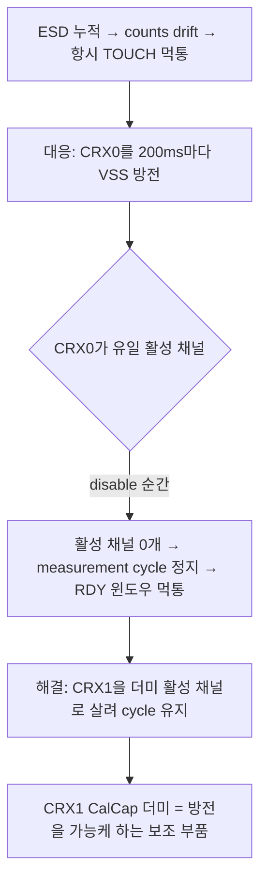

# 07 분석 — 단일채널 ESD (CRX1 폐기 가부)

**TL;DR**: CRX1 CalCap 더미는 "ESD 방어 부품"이 아니라 **CRX0 주기 방전을 위한 measurement cycle 유지 짝**이다([이슈해결 §1·§3]). 따라서 폐기의 진짜 조건은 "CRX0 방전을 함께 폐기하느냐"다. Full ATI 전환 시 ESD 누적은 ATI 밴드 이탈 Re-ATI가 자가복구하므로 방전+CalCap **세트 폐기 가능**(조건부). 단 Re-ATI는 LTA drift형 ESD만 커버하고, Max Counts(상한) 포화형은 못 막으므로 **MCLR 안전망은 유지 필수**. 단일채널 정지 이슈는 "방전을 안 하면" 원천 소멸.

---

## 1. 핵심 질문 재정의 — CRX1은 ESD 부품이 아니다

요구사항/검토는 "CRX1 = ESD 더미채널(방전)"로 표현하나, 이슈해결 문서 정독 결과 **인과가 뒤집혀 있다.** 정확한 구조는 다음과 같다.

- ESD 먹통 실체 = ESD 전하 누적 → counts drift → 항시 TOUCH 오판 ([이슈해결 §0]).
- 방어 실체 = `discharge_crx0()`이 200ms 폴링마다 CH0를 `0x30` Inactive Rxs=VSS로 잠깐 두었다 복원 (`tdc_drv_iqs323.c:951~965`).
- **CRX1 CalCap 더미의 존재 이유** = "CH0은 유일 활성 측정 채널. SENSOR0(enable=0)로 방전하는 순간 활성 채널이 0개가 되어 measurement cycle이 멈추고 RDY 윈도우가 닫히지 않는다 ... CH0를 잠깐이라도 끄려면 다른 활성 채널이 하나는 있어야 한다" ([이슈해결 §1]).

> [!IMPORTANT]
> 결론적으로 CRX1 CalCap 더미는 **ESD를 직접 방전하지 않는다.** ESD 방전은 CRX0 자신이 하고, CalCap은 그 방전 동작이 IC를 정지시키지 않게 받쳐주는 짝이다 ([이슈해결 §1·§3]). 따라서 "CRX1 폐기 가부"는 단독 결정이 아니라 **"CRX0 방전을 폐기하느냐"와 한 묶음**이다.

---

## 2. Full ATI가 ESD 누적을 자가복구하는가

### 2.1 ESD 먹통의 물리 = LTA drift (ATI Error 아님)

ESD 누적 먹통은 ATI Error 경로가 아니다. 이슈해결 문서가 명시한다: "ESD 먹통은 ATI Error가 아니라 counts drift(LTA/delta) 문제라 ati_error로는 어차피 안 잡힌다" ([이슈해결 §7 트레이드오프]). 즉 ESD가 CRX0 전극에 전하를 누적시키면 raw counts가 한 방향으로 천천히 밀려 LTA와의 delta가 고착되고, 고정 MULT/COMP에서는 이를 능동 보정할 수단이 없어 항시 TOUCH로 굳는다.

### 2.2 Full ATI의 자가복구 경로 — 가능하나 부분적

Full ATI(ATI Mode=Full, `0x36` bits[2:0]=100, reset 기본값) 전환 시 두 자가복구 경로가 열린다 ([데이터시트 §5.10·§5.11]).

| 경로 | 발동 조건 | ESD 커버 |
|---|---|---|
| **자동 Re-ATI** | 채널 LTA가 `Re-ATI Boundary = ATI Target ± ATI Band` 밖으로 drift ([§5.10]) | ✅ ESD가 LTA를 밴드 밖으로 밀면 IC가 자동 재캘리 → MULT/COMP/COMP 재보정으로 기준선 복원 |
| **수동 Re-ATI(SW 폴링)** | System Status bit6(ATI Error) set → SW가 `0xC0` bit2 트리거 ([§5.11]) | △ ATI Error는 "ATI 완료 후 counts가 밴드 밖"일 때만. ESD가 ATI 직후 누적되면 Error가 아니라 런타임 drift라 이 경로로는 늦거나 미발동 |

- ATI Band: reset이 Large(`0x36` bit3=1) = ±⅛ × ATI Target ([A.12]). Target=400 가정 시 Re-ATI Boundary = **350~450** ([직전분석 §10]). ESD가 LTA를 이 밖으로 밀면 자동 Re-ATI 발동.
- **핵심 차이 vs 현 FIXED**: 현재는 ATI Mode=Disabled + CH timeout 비활성으로 자동 Re-ATI 경로를 **이중 봉쇄**(`tdc_drv_iqs323.c:651,1152~1155`)해 ESD drift를 능동 보정할 수단이 아예 없었다. 그래서 SW 방전(`discharge_crx0`)으로 우회했다. Full ATI는 이 봉쇄를 풀어 **ESD drift → 밴드 이탈 → 자동 Re-ATI**라는 IC 내장 복구 경로를 되살린다.

> [!NOTE]
> AZD125 §8.1 "when the device is not in touch"에서만 자동 추종을 허용하는 원칙([적용가이드 §3.4])과 정합한다. ESD drift가 노터치 구간에 누적되면 LTA가 따라가다 밴드 이탈 시 Re-ATI가 받는 구조다.

### 2.3 자가복구의 한계 — human-in-the-loop가 전제

- ESD가 LTA를 밴드 안에서만 천천히 밀어 **항시 약한 TOUCH로 고착**되면, 터치 중에는 LTA가 halt되어([§5.5]) 추종이 멈추고 Re-ATI 자동 발동도 안 될 수 있다. 이때는 브레인스토밍의 human-in-the-loop(사용자가 손/물체 뗌 → 노터치 인식 → LTA 추종 재개)이 복구 트리거다 ([브레인스토밍 §2]).
- 즉 Full ATI 단독이 ESD를 100% 자동 복구하지는 못하나, **단순안 전체(Full ATI + 노터치 시 Re-ATI + human-in-the-loop + SW 타임아웃)** 조합에서는 ESD 먹통이 "지연 후 복구"로 완화된다. 과거 SW RESEED 3회로도 못 풀던([이슈해결 §0]) 영구 고착이 자동 재캘리 경로 부활로 풀린다는 점이 개선이다.

---

## 3. CRX0 주기 방전(discharge)을 함께 폐기할 수 있는가

CRX1 폐기는 CRX0 방전 폐기와 한 묶음이므로, 방전 폐기 정당성을 먼저 따진다.

| 논점 | 방전 유지 | 방전 폐기 (권고) |
|---|---|---|
| ESD 누적 대응 | 200ms마다 전하 능동 제거 | Full ATI 밴드이탈 Re-ATI로 사후 복구 |
| 단일채널 정지 위험 | CalCap 더미 필수(없으면 정지) | **방전 안 하므로 정지 위험 원천 소멸** |
| 통신 비용 | 방전 write 2회 × 200ms 추가([직전분석 §9 force 이중]) | 제거 |
| 측정 교란 | 방전이 측정 cycle·LTA를 흔들 수 있음([직전분석 §7 0x30 충돌]) | 제거 |
| 회로 의존 | HW 변경 없음 | HW 변경 없음(SW만) |

- 직전분석은 방전 코드의 `0x30 0x02` 부호 세만틱이 데이터시트 A.5에서 Linearise로도 해석돼 **실칩 매핑 실측(실측1) 전 폐기 금지**라고 명시했다 ([직전분석 §7·§4-5]). 그러나 이는 "FIXED 유지" 전제의 보류였고, **Full ATI 전환은 방전의 존재 이유(ESD drift를 능동 보정할 다른 수단 부재) 자체를 대체**한다. 방전이 ESD를 우회하던 유일 수단이었는데, Full ATI Re-ATI가 그 자리를 메우므로 방전의 필요성이 구조적으로 사라진다.
- 단, 방전이 ESD에 실제로 효력이 있었는지(물리 효력)는 [실측 게이트]로 남아 있다([직전분석 §7]). Full ATI Re-ATI 복구가 방전 없이 ESD 먹통을 실사용 수준으로 막는지는 **실보드 ESD 재현 실측**으로 확인해야 한다.

> [!IMPORTANT]
> **방전 폐기 = CalCap 더미 폐기 = 단일채널(CRX0)로 단순화**가 일관된 한 묶음이다. Full ATI 전환과 정확히 정합한다. 단 "방전 없이 ESD를 충분히 막는가"는 실측 게이트.

---

## 4. 단일채널 정지 이슈 재검토 — 폐기로 원천 소멸

이슈해결 §1의 "단일 활성 채널 방전 시 IC 정지"는 **"방전을 한다"는 전제에서만** 발생한다.

- 정지 메커니즘: CH0(유일 활성) disable → 활성 채널 0개 → measurement cycle 정지 → RDY 윈도우 안 닫힘 → `WAIT WINDOW CLOSE soft timeout` 무한 반복 ([이슈해결 §1], 코드 `wait_rdy_window_closed` `tdc_drv_iqs323.c:120~141`).
- **방전을 폐기하면 CH0를 끌 일이 없다** → 활성 채널이 항상 1개(CRX0) 유지 → 정지 조건 자체가 성립 불가.
- 따라서 단일채널(CRX0 단독) 구성은 "방전을 안 하는 한" 정상이다. CalCap 더미·CRX1·CRX0 방전 셋 모두 폐기해도 measurement cycle은 끊기지 않는다.

### 4.1 폐기 후 레지스터 변경점

| 주소 | 항목 | 현재(DUMMY) | 폐기 후(단일채널 Full ATI) |
|---|---|---|---|
| 0x40 | Sensor1 Setup | enable + CalCap Rx/Tx (`tdc_drv_iqs323.c:490~499`) | reset 0x0101 또는 **Sensor1 비활성**(enable_channel=0). Sensor2와 동일 처리 |
| 0x44 | Pattern Def 1 | CalCap size=1pF (`:485`) | reset 0x030A(CalCap=0pF) — CalCap 비활성 ([§5.12.3 미사용 시]) |
| 0x46 | Sensor1 ATI Setup | ATI Disabled (`:502`) | CH1 미사용이므로 무관(채널 disable이면 ATI 대상 아님) |
| 0x70 | Channel1 Setup | Independent (`:507`) | reset 0x0000 |
| 0x30 | Sensor0 Setup | enable+CTx0, 방전 시 VSS 토글 | enable+CTx0 **고정**(방전 토글 제거) |
| 0x36 | Sensor0 ATI Setup | Disabled 0x08 (`:651`) | **Full 0x0C** (bits[2:0]=100) — 단순안 핵심 |
| 0xC0 | System Control | CH timeout disable 0x07 (`:1024,1155`) | **검토** — SW 타임아웃 채택 시 IC timeout은 계속 disable 유지(ULP 충돌 회피) |

> [!NOTE]
> CalCap 미사용 시 데이터시트는 3개 레지스터 명시 비활성화를 요구한다: `Pattern Definitions` CalCap=0pF, `Sensor Setup` CalCap Rx/Tx clear, `Prox Input` Calibration Capacitor Select clear ([§5.12.3]). 현 코드는 0x43(Prox Input)을 미수정(reset 0x01CF, CalCap Select=0=enabled)으로 두었으나, CalCap Rx/Tx(0x40 bit14/13)를 clear하면 CalCap이 측정 경로에 연결되지 않으므로 실효 비활성이다. **단일채널 전환 시 0x40을 reset/disable로 되돌리면 CalCap 경로는 자연 차단**되어 0x43 추가 수정 없이 안전(이슈해결 §2의 0x43 reserved 먹통 재발 방지).

---

## 5. Max Counts 포화 안전망(MCLR) — 유지 필수

### 5.1 Max Counts 정지는 Re-ATI로 못 푼다

- Max Counts(`Prox Control 0x32` bit7-6) = reset 0x1290 기준 **4095** ([A.7]). 코드에서 명시 write 없음 → reset 유지([직전분석 §4-7]).
- 동작: "ATI 설정·하드웨어가 한계 초과 count를 유발하면 **conversion 정지**, max value가 read됨(에러 조건에서 stuck 방지)" ([§5.4.2]).
- **conversion이 정지하면 Re-ATI도 측정을 못 한다** — Re-ATI는 측정 cycle 위에서 동작하므로, conversion 정지 상태에서는 자가복구 경로 자체가 무력화된다. 브레인스토밍도 "counts 포화는 Re-ATI 실패 + conversion 정지 → MCLR 안전망 유지"로 결론([브레인스토밍 §5 리스크 B]).

### 5.2 ESD/단일채널 관점의 포화 방향성

- self-cap 터치·전도체 접촉은 counts **하향**(Cx↑ → counts↓, [§5.4]). Max Counts는 **상한** → 일반 터치/ESD drift는 포화 반대 방향이라 conversion 정지 안 함 ([적용가이드 §5.2]).
- 그러나 ESD가 Cx를 **감소**시키는 방향(전극 floating·단선·역방향 누적)이거나 ATI가 비정상 게인을 잡으면 counts 상향 포화가 발생할 수 있다 — 드문 이상이나 회복 경로가 MCLR뿐이다.

> [!IMPORTANT]
> **Max Counts 포화 안전망(MCLR)은 CRX1 폐기·방전 폐기와 무관하게 유지한다.** Full ATI Re-ATI는 LTA drift형 ESD를 커버하지만 conversion 정지형(상한 포화)은 못 푼다. SW 타임아웃(터치 지속)과도 별개 경로다(타임아웃은 측정이 살아있어야 카운트 가능). 코드는 이미 `mclr_reset()`(`tdc_drv_iqs323.c:288~298`)을 보유 → **포화 감지(counts==Max 또는 0xEEEE 지속) 시 MCLR** 조건부 호출 stub만 추가하면 된다 ([적용가이드 §5.2 "Max Counts 포화 시에만 MCLR"]).

---

## 6. CRX1 폐기 가부 결론

### 6.1 결론 — **조건부 폐기 가능**

CRX1 CalCap 더미는 **폐기 가능**하다. 단 다음을 한 묶음으로 처리해야 한다.

| 항목 | 결정 |
|---|---|
| CRX1 CalCap 더미 | **폐기** (Sensor1·Channel1·Pattern Def CalCap 비활성, 0x43 미수정 유지) |
| CRX0 주기 방전(`discharge_crx0`) | **폐기** (CalCap 폐기와 한 묶음 — 방전의 존재 이유가 Full ATI Re-ATI로 대체됨) |
| 단일채널(CRX0 단독) | **확정** (방전 안 하므로 정지 이슈 원천 소멸) |
| ESD 대책 | **Full ATI 밴드이탈 Re-ATI(자동) + 노터치 시 SW Re-ATI 폴링 + human-in-the-loop** 로 전환 |
| Max Counts 포화 안전망 | **MCLR 유지** (Re-ATI로 못 푸는 conversion 정지형) |

### 6.2 폐기 조건 (실측 게이트 포함)

1. **[실측 게이트] ESD 재현 복구 확인** — Full ATI 전환 후 방전 없이도 실보드 ESD 누적 먹통이 밴드이탈 Re-ATI(+human-in-the-loop)로 실사용 수준 복구되는지. 과거 방전이 ESD에 실효였는지([직전분석 §7])와 함께 검증.
2. **[실측 게이트] 밴드이탈 Re-ATI 발동 빈도** — ESD/온도 drift가 잦으면 Re-ATI burst → 통신/전류(검토_8). ATI Band(Small ±6.25% vs Large ±12.5%) 선택으로 빈도 조율([A.12], 04·05 노드 정량과 연계).
3. **Max Counts 포화 감지 + MCLR stub 구현** — conversion 정지(counts==4095 또는 read 0xEEEE 지속) 감지 시 MCLR 조건부 호출([적용가이드 §5.2]).
4. **레지스터 정합** — CalCap 비활성 시 0x40 CalCap Rx/Tx clear로 경로 차단, 0x43은 reset 0x01CF 유지(reserved·CalCap Select 보존, 이슈해결 §2 0x43 먹통 재발 방지).

### 6.3 폐기의 회로적 함의

- HW 무변경: CRX1(J4)은 외부 전극 미연결(배선만)·SW상 CalCap이었으므로([회로분석 §7.2·§10]), 폐기는 SW 레지스터 변경만으로 완결. C52(100nF)·R32·J4 회로는 그대로 둬도 무관.
- CRX0 ESD 보강(R31 100Ω→470Ω 등)은 **별도 HW 검토 항목**([회로분석 §11.2·§12])으로, 본 SW 폐기 결정과 독립. 본 노드 범위 밖.

---

## 7. 미해결·실측 게이트 요약

- **[실측 게이트]** 방전 없이 Full ATI Re-ATI(+human-in-the-loop)가 ESD 먹통을 실사용 수준 복구하는가 (방전 물리 효력 미확정 포함).
- **[실측 게이트]** 밴드이탈 Re-ATI 발동 빈도·burst(검토_8 — 04·05 노드 정량 연계).
- **[추정]** ESD가 counts 상한 포화를 일으키는 케이스 빈도 — 드문 이상으로 추정, 정량 [자료 미명시]. MCLR 안전망으로 일괄 처리.
- **[자료 미명시]** ATI Mode=Full에서 자동 Re-ATI의 정확한 LTA drift 임계 동역학(데이터시트는 경계식만, 시정수 미명시) — 04 노드 Beta·05 노드 임계와 교차 검증 필요.
