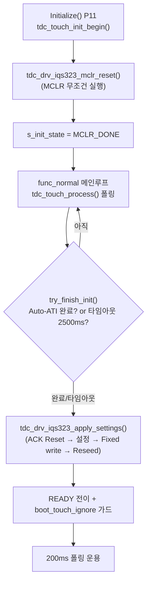
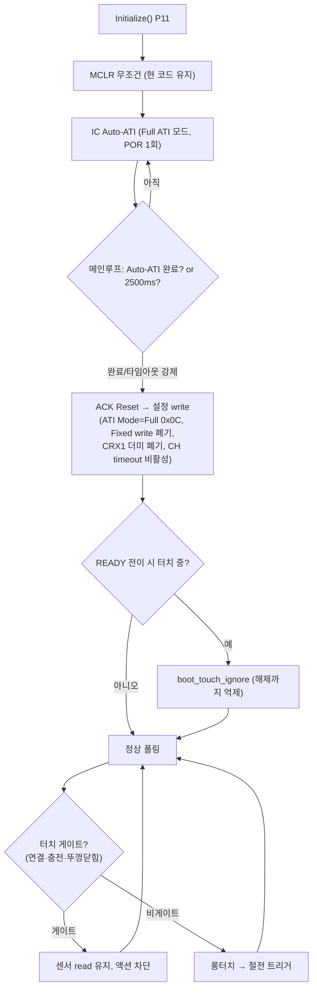

# 08 분석 — 부팅 게이트 (MCLR vs ATI 에러 체크 + 미사용 게이트)

**TL;DR**: Full ATI 단순안에서 부팅 초기화는 **"MCLR 항상 + 부팅 후 ATI 에러 폴링은 노말 루프가 담당"** 1순위 권고. 현 코드가 이미 매 (웜)부팅 MCLR을 무조건 실행하므로([초기화 §449]) 별도 분기 추가 없이 가장 단순하고 확실하다. MCLR 후 IC Auto-ATI(POR) 1회로 Full ATI가 보드 기생 C를 흡수하므로 Fixed write·CRX1 더미 폐기와 정합한다. 부팅 추가 시간은 MCLR hold 1ms + boot wait 50ms + Auto-ATI 수렴 ~수백ms(현 타임아웃 2500ms·터치 부팅 대비 강제 진행)로, 사용자 체감 ~500ms 범위 내 흡수 가능. 터치 미사용 게이트는 현 구조(크래들 뚜껑 닫힘→`func_cradle_lid_closed_loop`에서 폴링 안 함 + 충전/연결 중 `powerButtonPushed` 무시)를 **명시 게이트로 통합**하는 것을 권고.

---

## 1. 핵심 질문 (json 08_분석_부팅게이트)

1. 부팅 시 **"ATI 에러 체크 → Re-ATI"** vs **"MCLR 항상 초기화 후 노말 진입"** 비교·권고 (단순성·부팅시간·확실성).
2. **내부기 연결(`df_Connected`)·크래들 충전·뚜껑 닫힘** 중 터치 미사용 게이트 구현 (현 코드 `main.c` `systemControl`·`func_cradle_lid_closed_loop` 참조).
3. 부팅 **~500ms + ATI 시간** 영향.

다루는 요구사항: 요구사항_6(내부기·충전 중 터치 미사용), 요구사항_11(부팅 ATI 에러 체크 vs MCLR 택1), 검토_6(부팅 MCLR vs ATI 에러).

---

## 2. 현 코드 부팅 시퀀스 (ground truth)

### 2.1 부팅 초기화 경로



근거:
- `mclr_reset()`은 **매 (웜)부팅 무조건 실행** — IC POR (웜부트 상태 보존 없음) [직전분석 §부팅·노말 1, `initialize.c:449`].
- `mclr_reset()`: DIO16(RDY/MCLR) OUTPUT→LOW 1ms 유지→INPUT 복원→boot wait 50ms [`tdc_drv_iqs323.c:288~298`, `tdc_drv_iqs323.h:38~39`].
- MCLR 후 IQS323이 **자체 Auto-ATI 수행** [`tdc_drv_iqs323.c:336`]. 메인루프가 `is_auto_ati_done_single_read()`로 ATI Active(System Status bit5)=0을 폴링 [`tdc_drv_iqs323.c:312~330`].
- 타임아웃 `TDC_TOUCH_INIT_TIMEOUT_MS = 2500ms` 초과 시 강제 진행 (터치 누른 채 부팅 대비) [`tdc_touch.h:27`, `tdc_touch.c:220~224`].

### 2.2 현 설정 → Full ATI 단순안 전환점

| 항목 | 현 코드 (ATI Disabled) | Full ATI 단순안 |
|---|---|---|
| ATI Setup bits[2:0] (ATI Mode) | `000` Disabled (`ATI_SETUP_LSB=0x08`) [`tdc_drv_iqs323.c:651`] | `100` Full (`0x0C`) [데이터시트 06 §A.12] |
| Fixed MULT/COMP write | 보드 변종별 고정값 write [`write_ati_compensation()`] | 폐기 (Auto-ATI가 결정) |
| CRX1 더미채널 | `TDC_TOUCH_CRX1_DUMMY_ENABLE=1` [config §6-1] | 폐기 (CRX0 단일) |
| 부팅 Auto-ATI 결과 | Fixed write가 덮어씀 (무의미) [직전분석 §반증된 통념] | **그대로 사용** (게인 캘리 = Auto-ATI) |

> [!IMPORTANT]
> ATI Setup 레지스터(0x36/0x46/0x56) 기본값 `0x040C`, bits[2:0]=100=Full, bit3=1=Large ATI Band(1/8) [데이터시트 06 §A.12]. Full 전환 시 `ATI_SETUP_LSB`를 `0x08`→`0x0C`로 바꾸면 ATI Mode가 Disabled→Full이 된다. (단 ATI Band·Target 등 정량은 04·05 노드 담당)

---

## 3. 부팅 전략 비교 — ATI 에러 체크 vs MCLR 항상

### 3.1 두 안의 정의

| 안 | 정의 | 부팅 동작 |
|---|---|---|
| **안_A: MCLR 항상** (요구사항_11 후단) | 부팅 시 무조건 MCLR → IC POR → Auto-ATI 1회 → 노말 진입 | ATI 에러 여부 무관, IC를 깨끗한 초기 상태로 강제 |
| **안_B: ATI 에러 체크 → Re-ATI** (요구사항_11 전단) | MCLR 없이(또는 후) System Status bit6(ATI Error) 폴링 → 에러면 Re-ATI 트리거 | 정상이면 Re-ATI 생략, 에러일 때만 재캘리 |

### 3.2 3축 비교

| 축 | 안_A (MCLR 항상) | 안_B (ATI 에러 체크) |
|---|---|---|
| **단순성** | ✅ **최고**. 현 코드가 이미 MCLR 무조건 실행 → **분기 추가 없음** [`initialize.c:449`]. 부팅=POR 1경로 | ⚠️ 분기 2개(정상/에러) + 상태 폴링 + Re-ATI 완료 대기 로직 추가 |
| **부팅 시간** | ⚠️ MCLR(1ms)+boot wait(50ms)+**Auto-ATI 수렴 ~수백ms** 항상 발생 | ✅ 정상 시 Auto-ATI 생략 가능(이론). 단 MCLR 없으면 웜부트 IC 상태 의존 → 불확실 |
| **확실성** | ✅ **최고**. IC를 항상 동일 초기 상태(POR)로 강제 → 직전 상태(stuck·오염 LTA·전 모드 잔재) 완전 소거 | ⚠️ MCLR 생략 시 직전 stuck 상태가 남을 수 있음. ATI 에러가 "안 뜬" 채 잘못 보정된 케이스(Counts는 밴드 안인데 감도 이상) 미검출 가능 |

### 3.3 안_B의 함정 — "ATI 에러 없음 ≠ 정상"

- ATI Error는 **Counts가 Re-ATI Boundary(ATI Target ± ATI Band) 밖일 때만** set [데이터시트 02 §5.11]. 즉 "밴드 안이지만 게인이 직전 환경에 맞춰진 채 굳은" 상태는 ATI Error를 띄우지 않는다 → 안_B는 이걸 정상으로 오판한다.
- MCLR 생략 시 **직전 stuck-touch로 오염된 LTA·Reseed 잔재**가 웜부트로 살아남을 위험. 직전분석이 "웜부트 IC 보존도 거짓(MCLR 무조건 POR)"을 현 동작으로 확정했는데 [직전분석 §44], 이건 **MCLR 항상이 주는 안전성**이다 — 안_B는 이 안전성을 스스로 버리는 셈.
- 안_B가 "MCLR 후 ATI 에러 체크"라면 결국 MCLR을 하므로 안_A 대비 단순성·시간 이득이 없고 **에러 핸들러만 추가**된다.

### 3.4 부팅 시간 영향 정량 [데이터시트 §4.6 + 현 코드]

부팅 추가 시간 = MCLR hold + boot wait + Auto-ATI 수렴.

| 구성 | 값 | 근거 |
|---|---|---|
| MCLR LOW hold | 1 ms | `TDC_DRV_IQS323_MCLR_HOLD_MS=1` [`tdc_drv_iqs323.h:38`] (DS 요구 ≥250ns) |
| boot wait (MCLR 해제 후) | 50 ms | `TDC_DRV_IQS323_BOOT_WAIT_MS=50` [`tdc_drv_iqs323.h:39`] |
| Tinit (전원→내부 초기화) | ≈10 ms | [데이터시트 01 §4.6] |
| Time to first RDY | ≈25 ms | [데이터시트 01 §4.6] |
| Auto-ATI(POR) 수렴 | **~수백ms ~ 최대 2500ms** | 직전분석 "POR auto-ATI ~1.5초" [직전분석 §107] / 현 타임아웃 상한 2500ms [`tdc_touch.h:27`] |

- **계산**: 결정 경로(터치 없이 정상 수렴) ≈ 1 + 50 + (Auto-ATI 수백ms) ≈ **수백ms**. Full ATI는 ATI Mode=Full에서 알고리즘이 MULT·COMP를 모두 탐색하므로 Disabled(Auto-ATI 후 Fixed 덮어씀)보다 수렴 시간이 길 가능성 [추정] — 정확값 [실측 게이트].
- 현 메인루프 폴링이 100~200ms 주기로 `try_finish_init()`을 호출하므로, Auto-ATI 완료 감지 지연은 최대 1폴링(~200ms) [`tdc_touch.c:312`, `tdc_touch.h:25`].
- **터치 누른 채 부팅** 시: Auto-ATI가 수렴 못 하고 타임아웃(2500ms)까지 감 → **강제 진행** [`tdc_touch.c:220~224`] → READY 전이 직후 `boot_touch_ignore` 가드가 해제까지 폴링 억제 [`tdc_touch.c:46/323/352`]. Full ATI에서도 이 경로 그대로 유효.

> [!NOTE]
> 은수님이 명시한 "부팅 ~500ms"는 Auto-ATI 정상 수렴 시 충분히 들어오는 범위다(MCLR+boot wait 51ms + Auto-ATI 수백ms). 단 **Full ATI 수렴 시간 실측**이 필요하며, 터치 부팅·드리프트 큰 환경은 타임아웃 2500ms까지 늘 수 있다(강제 진행으로 먹통은 아님). 사용자 인지 측면에서 부팅 LED 시퀀스가 이 구간을 가린다.

### 3.5 권고 — 안_A (MCLR 항상) 1순위

> [!IMPORTANT]
> **권고: 부팅은 "MCLR 항상" 채택. 부팅 단계에서 ATI 에러 전용 체크·Re-ATI는 두지 않고, 런타임(노말 루프) ATI 에러 폴링에 위임.**

근거:
1. **단순성**: 현 코드가 이미 MCLR 무조건 실행 → 분기 추가 0. 요구사항_11이 "번거로우면 MCLR 항상도 OK"라고 명시한 그 선택지.
2. **확실성**: IC를 항상 POR 초기 상태로 강제 → 직전 stuck·오염 LTA 완전 소거. Full ATI 전환의 핵심 가치(보드 기생 C 자동 흡수)가 매 부팅 깨끗하게 발휘됨.
3. **부팅 시간**: Auto-ATI는 어차피 MCLR 후 IC가 자동 수행 → 안_B(ATI 에러 체크)도 MCLR을 하면 같은 시간. 안_B의 "정상 시 ATI 생략" 이득은 MCLR 생략을 전제로만 성립하는데, 그건 확실성을 버리는 대가라 기각.
4. **런타임 분리**: 부팅 후 드리프트로 인한 ATI 에러는 **노말 루프 100ms 폴링(02 노드 ReATI에러처리)**이 잡는다. 부팅 단계에 중복 핸들러를 두면 시퀀스만 복잡해진다. **부팅=초기화(MCLR/POR), 런타임=유지보수(에러 폴링 Re-ATI)** 로 역할 분리가 깔끔.

**예외/조건부 (검토_7·Max Counts 안전망과 연계)**:
- 부팅 직후 **Max Counts 포화(conversion 정지)** 감지 시에만 추가 MCLR 재시도. 단 MCLR 항상이면 이미 매 부팅 MCLR이므로, 포화는 "MCLR 직후에도 포화면 하드웨어 이상" 판정으로 격상 [적용가이드 §5.2, §2.3: 3회 재시도 후 "Possible Hardware Issue"]. 상세 안전망은 07 노드(단일채널ESD)·99 종합 담당.

---

## 4. 터치 미사용 게이트 (요구사항_6)

### 4.1 현 코드의 암묵 게이트 (ground truth)

현 펌웨어는 터치 미사용을 **명시 게이트 함수 없이 분산된 조건**으로 처리한다:

| 상황 | 현 동작 | 코드 근거 |
|---|---|---|
| **크래들 뚜껑 닫힘** | `systemState.cradleLidClosed && !isd_state.conneded_ISD` 첫 감지 시 `func_cradle_lid_closed_loop()` 진입 → 그 루프엔 **터치 폴링 없음** (BLE 뚜껑 열림 패킷만 대기) | `main.c:740~743`, `:807~866` |
| **내부기(ISD) 연결 중** | 크래들 뚜껑 닫힘 게이트가 `!conneded_ISD`로 막힘(연결 중이면 약 절전 미진입). 노말 루프는 계속 도는데 매핑 연결 시 `powerButtonPushed=false`로 무시 | `main.c:740`, `systemControl.c:235~241` |
| **충전기 직결(케이스 없이)** | `chargerConnectorPluggedIn==df_Connected` → systemControl이 충전 분기 → 노말 `enable_ISD` 분기 미진입 | `systemControl.c`(충전 분기) |
| **부팅 직후 터치** | READY 전이 시 터치 중이면 `boot_touch_ignore=true` → 해제까지 폴링 억제 | `tdc_touch.c:46/323/352` |

핵심: 노말 루프는 `tdc_touch_process()`를 **항상 호출**하지만(터치 상태는 늘 읽음), 그 결과 `powerButtonPushed`는 연결·매핑·충전 상황에서 **systemControl이 소비 시점에 무시**한다. 즉 "센서는 돌지만 액션은 게이트"되는 구조.

### 4.2 `df_Connected` / 크래들 cover state 메커니즘

- `tdc_cradle_get_cover_state()`: BLE 패킷(data[2])로 갱신되는 뚜껑 상태. 1=열림→`df_Connected`, else=닫힘→`df_Disconnected` [`batteryNPowerControl.c:149~159`].
- `conneded_ISD`: 내부기 연결 상태. `isd_interface.c`가 stimulation 단계 도달 시 true [`isd_interface.c:247~265`].
- `chargerConnectorPluggedIn`/`carryingCasePluggedIn`: GPIO 읽기 → `df_Connected`/`df_Disconnected` [`cfx_cm3_sharedMemory.c:73~74`].

### 4.3 게이트 구현 권고

> [!IMPORTANT]
> **권고: 단일 게이트 헬퍼 `tdc_touch_is_gated()`를 도입해, 노말 루프에서 터치 폴링/액션을 조건부로 건너뛴다. Full ATI 전환과 무관하게 적용 가능.**

설계:

```c
/* 터치 미사용 게이트 — true면 터치 폴링·롱터치 액션 건너뜀 */
static bool tdc_touch_is_gated(const ST__SYSTEM_STATE *sys,
                               const ST__ISD_STATUS   *isd,
                               const ST__USB_CONNECTOR *usb)
{
    if (isd->conneded_ISD)                                      return true; /* 내부기 연결 중 */
    if (usb->chargerConnectorPluggedIn == df_Connected)        return true; /* 충전 중 */
    if (sys->cradleLidClosed)                                  return true; /* 크래들 뚜껑 닫힘 */
    return false;
}
```

적용 지점:
- `func_normal` 메인루프에서 `tdc_touch_process()` 호출 직전/직후 게이트 평가 → 게이트면 `powerButtonPushed=false` 강제(현 분산 무시 로직을 한 곳으로 수렴).
- 단, **센서 read 자체는 유지**(터치 상태 추적·LTA 환경 추종 지속). 게이트는 **액션(절전 트리거·롱터치)만 차단**. Full ATI는 게이트 중에도 IC가 계속 측정·Re-ATI 자동 보정하므로 게이트 해제 시 즉시 정상 동작.

> [!NOTE]
> 현 구조를 헬퍼로 **리팩터링하는 수준**이지 새 동작 추가가 아니다. 분산된 `powerButtonPushed=false` 3곳([systemControl.c:240·247])과 크래들 게이트([main.c:740])를 한 함수로 통합해 가독성·일관성 확보. 요구사항_6의 "향후 사용 가능성"은 게이트 조건만 조정하면 되도록 헬퍼화가 유리.

### 4.4 게이트와 Full ATI·Re-ATI 상호작용

- 게이트 중(충전·연결)에도 Full ATI는 IC가 **자동 Re-ATI로 환경(충전 노이즈·온도) 흡수** → 게이트 해제 시 baseline이 최신 → 즉시 정상 감지. (현 ATI Disabled는 게이트 중 드리프트를 Fixed로 못 따라가 해제 직후 오판 위험이 있었음 — Full ATI가 이 점 개선)
- 단 **게이트 중 터치 무시 + Re-ATI 자동**이면, 충전 중 손가락 등이 닿아도 Re-ATI가 흡수 → 정상. 게이트가 "액션만 차단"이고 "센서·Re-ATI는 살아있음"이 핵심.
- 충전 중 노이즈로 ATI 에러 빈발 가능성(검토_8 드리프트 Re-ATI burst) → 02 노드(ReATI에러처리)·06 노드(컨버전전력)와 교차 검토 필요.

---

## 5. 부팅 시퀀스 권고 (Full ATI 단순안 통합)



변경점(현 코드 대비):
1. `ATI_SETUP_LSB` `0x08`→`0x0C` (ATI Mode Disabled→Full).
2. `apply_settings()`에서 `write_ati_compensation()`(Fixed write) **제거** — Auto-ATI 결과를 그대로 사용.
3. CRX1 더미채널(`TDC_TOUCH_CRX1_DUMMY_ENABLE`) **0으로** (07 노드 담당).
4. 부팅 ATI 에러 전용 핸들러 **추가 안 함** — 런타임 폴링(02 노드)에 위임.
5. 터치 게이트 헬퍼 `tdc_touch_is_gated()` 도입(§4.3).

---

## 6. 미해결 · 실측 게이트

| # | 항목 | 사유 |
|---|---|---|
| 미해결_1 | **Full ATI Auto-ATI 수렴 실측 시간** | Disabled→Full 전환 시 POR Auto-ATI 시간이 늘어나는지 [실측 게이트]. 부팅 ~500ms 예산 검증 필요 |
| 미해결_2 | **Reseed 후 ATI 자동 트리거 (Full ATI)** | [User Guide §3.5.4] "may trigger ATI" — Full ATI에서 실제 발동 조건 [자료 미명시]. apply_settings 말미 Reseed 유지 여부는 99 종합 결정 |
| 미해결_3 | **게이트 중 Re-ATI burst 빈도** | 충전 노이즈로 ATI 에러 빈발 시 통신/전류 영향 — 02·06 노드 교차 [실측 게이트] |
| 미해결_4 | **타임아웃 2500ms 적정성 (Full ATI)** | Full 수렴이 길어지면 강제 진행 비율 증가 → 타임아웃 상향 필요 여부 [실측 게이트] |
| 미해결_5 | **Max Counts 포화 부팅 안전망** | MCLR 항상 후에도 포화면 하드웨어 이상 — 07·99 노드 담당 |

---

## 7. 핵심 결론 요약

1. **부팅 = "MCLR 항상" 1순위** (요구사항_11 후단). 현 코드가 이미 매 부팅 MCLR 무조건 실행 → 분기 추가 0, 단순성·확실성 최고 [`initialize.c:449`].
2. **부팅 ATI 에러 전용 핸들러는 두지 않음** — "ATI 에러 없음 ≠ 정상" 함정 + MCLR로 직전 상태 완전 소거되므로 불필요. 런타임 ATI 에러 폴링(02 노드)에 위임. 역할 분리(부팅=POR / 런타임=유지보수).
3. **부팅 추가 시간** ≈ MCLR 1ms + boot wait 50ms + Auto-ATI 수백ms ≈ 수백ms(정상 수렴). 터치 부팅은 타임아웃 2500ms 강제 진행 [데이터시트 §4.6, `tdc_touch.h:27`]. ~500ms 예산은 정상 시 충족, Full 수렴 시간 실측 필요.
4. **터치 게이트는 `tdc_touch_is_gated()` 헬퍼로 통합** — 내부기 연결(`conneded_ISD`)·충전(`df_Connected`)·뚜껑 닫힘(`cradleLidClosed`) 시 센서 read는 유지하고 **액션만 차단**. 현 분산 로직(systemControl `powerButtonPushed=false` 3곳 + 크래들 루프)의 리팩터링 수준.
5. **Full ATI 정합**: 게이트 중에도 IC 자동 Re-ATI가 환경 흡수 → 해제 시 즉시 정상. ATI Setup LSB `0x08`→`0x0C`, Fixed write·CRX1 더미 폐기와 일관.
