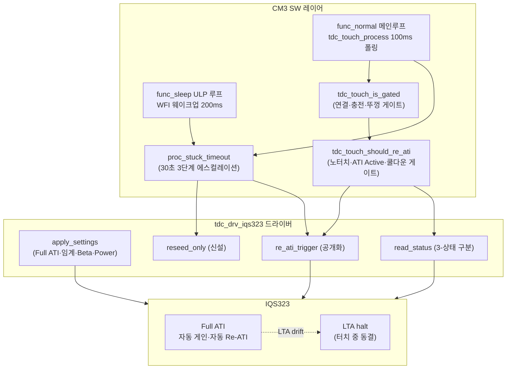
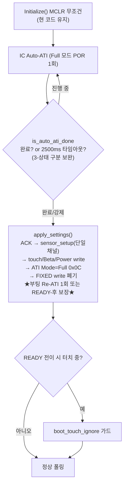
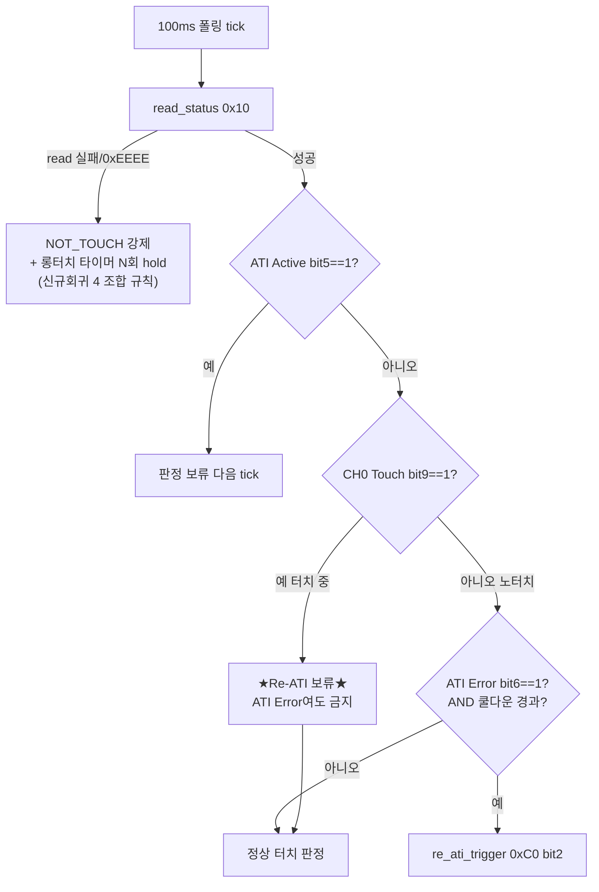
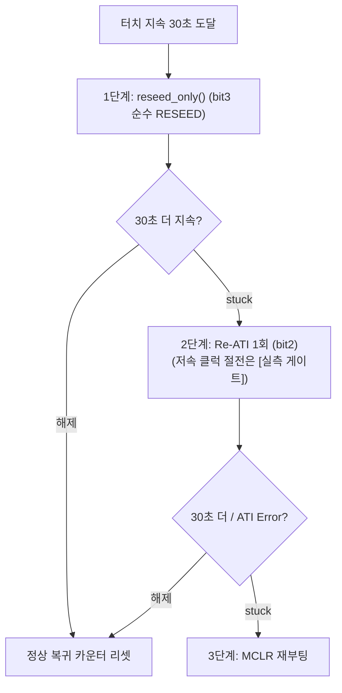

# 99 종합 — Full ATI 터치 제어 단일 구현 설계

**TL;DR**: 8 분석 + 2 검증을 통합한 단일 설계. Full ATI 전환의 본질은 "ATI Setup 0x36 LSB 0x08→0x0C(1비트) + FIXED MULT/COMP write 폐기 + CRX1 더미·CRX0 방전 폐기 + ati_error 폴링 부활". 검증 09가 05 노드 Touch Threshold 부등식의 [단위오류]를 적출 — 레지스터값은 raw count가 아니라 `계수×LTA/256` 비율계수이며 올바른 부등식은 **Touch Threshold 계수 < 32**(LTA≈Target), Base 상향만으론 미해결·계수 하향이 본질. 검증 10이 [신규회귀 5건]·[원자적 3쌍]·[신규 API 2종]을 적출. Re-ATI는 "노터치 AND ATI Active==0 AND 쿨다운 경과" 게이트에서만 발행, SW 타임아웃 30초 3단계 에스컬레이션(RESEED→Re-ATI→MCLR). 다수 정량은 [실측 게이트] 확정 필요.

---

## 1. 통합 설계 개관

### 1.1 Full ATI 단순안의 4대 축 (확정)

| 축 | 내용 | 담당 노드 |
|---|---|---|
| **자동 캘리 부활** | ATI Mode=Full(0x36 LSB 0x0C), FIXED MULT/COMP·공장 캘리 폐기 → IC 자율 게인 산출 + 자동 Re-ATI | 01·08 |
| **에러 능동 처리** | System Status bit6(ATI Error) 폴링 → 게이트 통과 시 수동 Re-ATI. `(void)ati_error` 무시 제거 | 02 |
| **단일채널 단순화** | CRX0 단독. CRX1 CalCap 더미·CRX0 주기 방전 세트 폐기(정지 이슈 원천 소멸) | 07 |
| **SW stuck 처리** | IC Channel Timeout 미사용 → SW 터치 지속 30초 카운트 → 3단계 에스컬레이션 | 03 |

### 1.2 검증 2노드가 바꾼 것 (반드시 반영)

> [!IMPORTANT]
> 본 종합은 검증 노드 09·10의 적출을 **분석 노드 원안보다 우선**한다. 아래 두 정정이 핵심이다.
>
> 1. **[09 단위오류 정정]** 05 노드의 "Touch Threshold(100) > ATI Band(50), 2배 위반" 논증은 단위 불일치다. Touch Threshold 레지스터값은 raw count가 아니라 `(계수×LTA)/256` 비율계수다([06 A.17]·[현코드 tdc_drv_iqs323.h:391 주석]·[적용가이드 §4.4]). 올바른 부등식은 **계수 < 256/8 = 32**(LTA≈Target 기준). **Base 상향(Target 800)만으로는 부등식이 안 풀린다**(LTA·Target 비례가 소거됨) → **계수 하향이 본질**. 05의 권고 계수 50~80도 32 초과라 미해결 → §4에서 계수 기준 재권고.
> 2. **[10 신규회귀]** 분석 노드들이 놓친 코드 정합 충돌 5건. 특히 (가) `reseed()`가 절전 감도 동반(순수 RESEED 아님), (나) read 실패 시 NOT_TOUCH 미강제(hold-last), (다) 부팅 운용 `apply_settings()`에 수동 Re-ATI 부재. 이들은 "권고"가 아니라 **선행 수정 필수**로 격상한다.

### 1.3 모듈·레이어 구조 (전체)



---

## 2. 단일 구현 설계 — 레지스터 설정

### 2.1 ATI 코어 레지스터 (Full 전환 핵심)

| 주소 | 레지스터 | 현재(Disabled) | **Full 단순안** | 근거 |
|---|---|---|---|---|
| 0x36 | Sensor0 ATI Setup | `0x0408` (LSB 0x08, Mode=Disabled) | **`0x040C`** (LSB 0x0C, bits[2:0]=100 Full, bit3=1 Large Band, Res 64) | [06 A.12], [01 §2.1] |
| 0x37 | Sensor0 ATI Base | `0x0064` (100) | **`0x00C8`** (200) 권고 — 단 부등식과 무관(§4.3 주의) | [06 A.12], [05 §6.1] |
| 0x38 | Sensor0 ATI MULT | FIXED write (보드별) | **write 폐기** (Full 자동 산출) | [02 §5.9], [01 §2.2] |
| 0x39 | Sensor0 ATI COMP | FIXED write (보드별) | **write 폐기** | [02 §5.9], [01 §2.2] |

> [!IMPORTANT]
> Full 전환은 0x36 1비트(LSB 0x08→0x0C) + FIXED write 2개(0x38·0x39) 폐기다. `0x040C`는 데이터시트 reset 기본값과 동일하며, 절전 측정 경로에 이미 `write_register(0x36, 0x0C, ...)` 선례가 있다([tdc_drv_iqs323.c:881~882]). 3개 보드 변종 매크로(MINI·DEVELOP·PACKAGE, [:651·665·679]) **전부** 변경 필요([10 §3]).

### 2.2 임계·필터 레지스터 (Beta·Touch)

| 주소 | 레지스터 | 현재 | **권고** | 근거·비고 |
|---|---|---|---|---|
| 0x62 | Touch Settings (Threshold) | 계수 100 | **계수 12~24** (§4.3 — 32 미만 필수) | [09 §4.4 단위오류 정정]. 05 원안 50~80 폐기 |
| 0x62 | Touch Settings (Hysteresis) | 80 | **Threshold 계수의 ~50%** (비율 4비트, §4.4) | [06 A.17] 비율값 [실측 게이트] |
| 0xB0 | Counts Filter Beta (NP/LP) | POR 0x0000 | alpha≈0.125~0.25 (해석_A reg 32~64) | [04 §5.2] — 명시 write 필수 |
| 0xB1 | LTA Normal Beta (NP/LP) | POR 0x0000 | alpha≈0.004~0.008 (약터치 보존) | [04 §5.2] |
| 0xB2 | LTA Fast Beta (NP/LP) | POR 0x0000 | alpha≈0.125~0.25 (노터치 복귀) | [04 §5.2] |
| 0xB4 | Fast Filter Band | POR 0x0000 | **8~15 cnt** (POR=0 함정, §4.2) | [04 §5.3] — 0이면 비대칭 붕괴 |

> [!WARNING]
> Beta 4종(0xB0·0xB1·0xB2·0xB4) 전부 POR 0x0000이라 미설정 시 필터 무력/비대칭 붕괴([04 §6]). **레지스터 정수값(해석_A reg=alpha×256 vs 해석_B reg=시프트지수)은 [실측 게이트]** — alpha=0.125 1개를 reg=32(A) 또는 reg=3(B)로 시험 write → LTA 수렴 step 실측으로 1회 판별 후 전체 적용([04 §7, 09 §2.5]).

### 2.3 전력·컨버전 레지스터 (신규 write)

| 주소 | 레지스터 | 현재 | **권고** | 근거 |
|---|---|---|---|---|
| 0x31 | Conversion Frequency | POR 0x057F (Period 5, 1MHz) | **0x057F 방어적 write** (1MHz 유지) | [06 §7.1] — self-cap 권장 상한 |
| 0xC0 | System Control (Power Mode bit6:4) | NP 고정(write 없음) | **`101` Automatic No ULP** | [06 §5.3] — LP 유지 목표·단일채널 |
| 0xC0 | System Control (CH Timeout bit) | disable(MSB 0x07) | **disable 유지** (SW 타임아웃 채택) | [03·06], 주석 갱신 필요(§5) |
| 0xC2 | LP Report Rate | POR 0x0000 | **≈100ms** | [06 §7.2] — 폴링 정합 |
| 0xC5 | Power Mode Timeout | POR 0x0000 | **>0 (수 초)** | [06 §7.2] — 0이면 LP 미진입 |

### 2.4 단일채널 폐기 레지스터 (CRX1·방전)

| 주소 | 항목 | 현재(DUMMY) | **폐기 후** | 근거 |
|---|---|---|---|---|
| 0x40 | Sensor1 Setup | enable + CalCap Rx/Tx | **disable** (CalCap Rx/Tx clear → 경로 차단) | [07 §4.1] |
| 0x44 | Pattern Def 1 | CalCap size=1pF | reset 0x030A (CalCap 0pF) | [07 §4.1, DS §5.12.3] |
| 0x70 | Channel1 Setup | Independent | reset 0x0000 | [07 §4.1] |
| 0x43 | Prox Input | reset 유지 | **미수정 유지** (0x43 reserved 먹통 재발 방지) | [07 §4.1, 이슈해결 §2] |
| 0x30 | Sensor0 Setup | enable + 방전 VSS 토글 | enable+CTx0 **고정** (방전 토글 제거) | [07 §4.1] |

---

## 3. 단일 구현 설계 — 시퀀스

### 3.1 부팅 시퀀스 (MCLR 항상)



- **MCLR 항상 채택**([08 §3.5]): 현 코드가 이미 매 부팅 MCLR 무조건 실행([initialize.c:449]) → 분기 추가 0, 직전 stuck·오염 LTA 완전 소거. 부팅 ATI 에러 전용 핸들러는 두지 않고 런타임(노드 02)에 위임.
- **[10 신규회귀 1 차단]**: 운용 `apply_settings()`([tdc_drv_iqs323.c:1101~1158])에 수동 Re-ATI가 없다. FIXED write 제거 시 게인 캘리가 MCLR 직후 auto-ATI 1회뿐인데, auto-ATI는 sensor_setup보다 먼저 돌아 실패 시 ATI_Error를 clear할 주체가 없다(과거 영구 잔류 재현). **부팅 시 1회 명시 Re-ATI를 apply_settings 말미에 넣거나(ㄱ), 노드 02 런타임 핸들러가 READY 직후 첫 노터치 tick에서 ATI_Error를 확실히 clear함을 보장(ㄴ)** 중 하나를 반드시 구현. boot_touch_ignore 가드와의 상호작용을 검증 항목으로 확정(§6).

### 3.2 노말 루프 Re-ATI 게이트 시퀀스 (급소)



> [!CAUTION]
> **급소 결론([02 §5])**: Re-ATI 발동 경로는 둘이며 결론이 정반대다. **경로_1(IC 자동 Re-ATI)**은 트리거 입력이 LTA라 터치 중 LTA 동결([§5.5])이 막아줘 안전 → SW 차단 불필요. **경로_2(SW가 ATI Error 보고 강제 Re-ATI)**는 LTA halt와 무관하게 SW가 능동 발행하므로, 터치로 낮아진 Counts를 Target에 재정규화([§5.9])해 터치를 노터치로 학습한다 → **"터치 중 Re-ATI 보류" 게이트 필수**.
>
> **게이트 규칙**: Re-ATI는 `CH0 Touch==0 (노터치) AND ATI Active==0 (미진행) AND 쿨다운 경과`인 tick에서만 발행. 터치 판정(D)을 Re-ATI 트리거(F→G)보다 **먼저** 분기. 터치 중 ATI Error는 물리적 정상 결과이므로 에러 카운트/알림으로 쓰지 말 것.

### 3.3 SW 타임아웃 30초 — 3단계 에스컬레이션



- **카운트 방법**([03 §3]): 노말은 tick 차분(A, `proc_long_touch` 패턴 확장), 절전 ULP는 웨이크업 카운트(B, `30000/200=150`회). 공통 임계 상수 `TDC_TOUCH_STUCK_TIMEOUT_MS=30000`. **리셋 규칙**: 노터치·read 실패·에러처리 발동 직후 리셋.
- **[10 신규회귀 2 차단]**: 1단계 RESEED는 반드시 **`reseed_only()`(신설, 순수 bit3)**로 구현. 기존 `reseed()`([tdc_drv_iqs323.c:931~949])는 절전 감도(:934)·절전 Prox(:940)를 재적용하므로, 노말에서 재활용하면 노말 환경에 절전 감도가 오염된다. 절전 진입 전용으로 격리.
- **절전 특례**([03 §6.3]): 저속 클럭(2.56M)에서 Re-ATI burst 성공 불확실 → 절전은 2단계 생략하고 1단계 실패 시 곧장 3단계(`SYS_WATCHDOG_RESET`, 이미 [main.c:1001] 존재)도 합리적. **단 ULP 롱터치 2.2초 리셋이 30초보다 먼저 발동**하므로([03 §6.3 NOTE]) 절전 SW 30초 타임아웃의 실효 범위는 좁다 — 요구사항 재확인 필요(§6).

### 3.4 절전 진입 시퀀스 (감도 단일화)

- **30초 대기 위치**([03 §4]): 초입 877행 대기루프가 아니라 **967행 ULP 루프에 통합**. 초입에 30초를 넣으면 정상속도·고전류로 최대 30초 머물러 절전 목적에 배치. 초입은 짧은 상한 + RESEED 강제 해제(개선_A)로 빠르게 통과시키고 진짜 30초 감시는 ULP 루프에서.
- **[10 신규회귀 3 차단]**: 절전 진입 시 감도를 두 번, 다른 값으로 쓴다 — `apply_sleep_settings()`(:978) `touch_settings_impl(255,255)` → `reseed()`(:934) `(100,80)` 덮어씀. Full FIXED 제거와 동시에 **절전 감도 단일화** 정리.
- **Full ATI 시 불필요**([03 §5.2]): FIXED MULT/COMP 재쓰기는 폐기(자동 산출). THRESHOLD/HYSTERESIS(절전 감도)·RESEED(baseline 재동기)는 유지.

---

## 4. 결정 8항목 결론 (검토_1~8)

| 검토 | 항목 | 결론 |
|---|---|---|
| 검토_1 | SW 타임아웃 30초 후 동작 | **3단계 에스컬레이션**: reseed_only(bit3) → Re-ATI(bit2) → MCLR. 각 단계 30초 재카운트. 단일 동작(MCLR만/RESEED만)은 과하거나 불충분([03 §6.2]) |
| 검토_2 | 터치 중 Re-ATI 경계(급소) | **게이트 필수**. LTA halt는 경로_1(자동)만 막음. 경로_2(SW 강제)는 못 막아 터치를 노터치 학습 → `노터치 AND ATI Active==0 AND 쿨다운` 게이트([02 §5]) |
| 검토_3 | CRX1 폐기 ESD | **조건부 폐기 가능**. CRX1 더미·CRX0 방전 세트 폐기(정지 이슈 원천 소멸). ESD는 Full 자동 Re-ATI + human-in-the-loop로 전환. 단 ESD 복구 실효는 [실측 게이트]([07 §6]) |
| 검토_4 | Full ATI I²C 무응답 | **안전 가능**. 과거 무응답 80%는 CH1 더미 auto-ATI 수렴 실패→영구 ATI_Error. CH1 폐기로 소멸. ATI 중 RDY 미개방은 일시적 read 실패라 N회 재시도 흡수([01 §3]) |
| 검토_5 | Beta 수렴 vs 약터치 흡수 | **Fast Filter Band 비대칭**. 단일 β 상향은 양립 불가(1~5초 수렴 β=2~4면 약터치 0.14~0.63초 흡수). LTA Normal 느리게(약터치 보존)+LTA Fast 빠르게(노터치 복귀)+Band 8~15cnt([04 §5]) |
| 검토_6 | 부팅 MCLR vs ATI 에러 체크 | **MCLR 항상** 1순위. "ATI 에러 없음≠정상" 함정 + MCLR이 직전 상태 완전 소거. 부팅 전용 핸들러 미설치, 런타임 위임([08 §3.5]) |
| 검토_7 | Max Counts 안전망 | **MCLR 유지 필수**. Full Re-ATI는 LTA drift형만 커버, conversion 정지(상한 포화)형은 못 풀어 MCLR만 회복. 포화 감지 stub 추가([07 §5]) |
| 검토_8 | Re-ATI burst | **쿨다운 N초 + Band 확대 + 노터치 RESEED 병행**. burst 실측 시간 [실측 게이트]. 부등식 위반(§4.3)이 burst 근본 트리거 중 하나라 임계 재설정 동반 필수([02 §5.3, 05·10]) |

---

## 4(이어). 정량 권고값·범위

### 4.1 Beta (수렴 vs 약터치, [04])

| 레지스터 | 역할 | 권고 alpha | 해석_A reg | 해석_B β | 특성 |
|---|---|---:|---:|---:|---|
| 0xB0 Counts | raw 평활 | 0.125~0.25 | 32~64 | 2~3 | t95% 1.0~2.2s(100ms) |
| 0xB1 LTA Normal | 환경 추종+약터치 보존 | 0.004~0.008 | 1~2 | 7~8 | 약터치 흡수 5~10s 안전 |
| 0xB2 LTA Fast | 노터치 복귀 빠름 | 0.125~0.25 | 16~64 | 2~4 | t95% 1.0~4.6s = 목표 1~5초 달성 |
| 0xB4 Fast Band | fast 발동 임계 | — | **8~15 cnt** | — | 노이즈 4cnt 위·약터치 20cnt 아래 |

- **검증 09 [확인됨]**: IIR 수렴표(τ=−T/ln a, t95=ln(0.05)/ln(a)·T)·약터치 흡수표 독립 재계산 소수점 일치. β=2 t95=1.04s, β=4 4.64s, β=6 19.0s, β=10 306.6s. AZD004 권고 LTA β=6~10은 stuck 해소(1~5초)에 한참 미달(느린 환경 드리프트용).
- NP/LP 각 8비트 필드에 동일 권고값 함께 write(LP 유지 환경에서 LP beta가 실동작 모드). 레지스터 정수는 [실측 게이트].

### 4.2 ATI Target/Base/Band ([05] — 09 정정 반영)

| 파라미터 | 현재 | 권고 | 비고 |
|---|---|---|---|
| ATI Base (0x37) | 100 | **200 (0x00C8)** | Target·Band 2배 확대 — 단 부등식과 무관(§4.3) |
| ATI Resolution Factor | 64 | 64 (유지) | Target=Base×4 |
| ATI Target (계산) | 400 | **800** | 200×(64/16) |
| ATI Band (Large 1/8 폭) | 50 | **100** | 800/8. Small(1/16) 금지 |

- **검증 09 [확인됨]**: Target=Base×(Res/16)([06 A.12]), Band Large 1/8([02 §5.10]), 온도 −18cnt/°C(AZD125 §8.2.4 (1000−550)/25=18.0 재계산 일치), SNR≥5 raw 20cnt(AZD125 §10.1). Band 100 → 온도 5.6°C마다 Re-ATI(합당).

### 4.3 Touch Threshold — 계수 기준 재권고 (09 단위오류 정정 — 핵심)

> [!CAUTION]
> **05 원안 "Threshold 100 vs Band 50 raw 직접 비교, 권고 50~80"은 [단위오류]로 폐기**([09 §4.4]). Touch Threshold 레지스터값은 raw count가 아니라 `(계수×LTA)/256` 비율계수다([06 A.17]·[현코드 tdc_drv_iqs323.h:391 주석 "절대=계수×LTA/256"]·[적용가이드 §4.4]). 계수 100·LTA 400이면 절대 임계 = 100×400/256 = **156.25 raw cnt**(100도 50도 아님).
>
> **올바른 부등식 재유도** (raw count 일관 환산, "절대임계 < Band"):
> ```
> (계수 × LTA)/256  <  Target/8
> LTA ≈ Target(노터치 정상) 가정:
> (계수 × Target)/256  <  Target/8
> 계수  <  256/8 = 32
> ```
> **즉 Touch Threshold 계수 < 32가 본질 조건.** Base 상향(Target 800)은 Band를 키우지만 분모 LTA도 같이 커져 **계수 기준 부등식은 Base 상향과 무관**(LTA·Target 비례 소거). 05의 권고 계수 50~80도 32 초과라 미해결.

| 파라미터 | 현재 | **종합 권고** | 근거 |
|---|---|---|---|
| Touch Threshold (계수) | 100 | **12~24** (32 미만 + SNR 하한 확보) | [09 §4.4] 계수<32 + SNR≥5(raw 20cnt). LTA≈800 시 계수 16 → 절대 50raw, 계수 24 → 75raw |
| Touch Hysteresis (비율) | 80 | **Threshold 계수의 ~50%** (비율 4비트) | [06 A.17]·[09 §4.5]. Hysteresis도 `(Hyst/256)×Threshold` 비율값. 단순 raw 차감 아님 |

- **검증 게이트**: 펌웨어/캘리에 `Touch Threshold 계수 < 32` AND `절대 임계(계수×LTA/256) ≥ 20 raw(SNR)` AND `Hysteresis 비율 < Threshold 계수`를 static_assert/부팅 검증으로 강제([09 §6.2] — 단위 환산 포함 재작성). **계수↔raw 환산의 실제 LTA값은 [실측 게이트]**.
- **[10 원자적 적용 의무]**: Threshold<Band 위반은 Full 자동 Re-ATI가 살아나면 터치 진입 전 밴드 이탈→경로_1 발동. **Full 전환과 임계 재설정(계수 하향)은 원자적으로 함께 적용**.

### 4.4 컨버전·전력 ([06] — 09 [확인됨])

| 항목 | 권고 | 근거 |
|---|---|---|
| f_xfer | **1.00 MHz 유지** (0x31=0x057F) | self-cap 권장 상한. 1MHz<2MHz라 Full Compensation 제약 없음 |
| Power Mode | **Automatic No ULP (101)** | LP 유지 목표·단일채널·통신 안정 |
| 전류(추정) | NP 수십~125µA / LP 10~37µA @3.3V | [01 §3.4] 표(3ch·500kHz·Event) → 단일채널·1MHz·스트리밍 [실측 게이트] |
| 1 measurement | ≈0.4ms~수 ms [추정] | 100ms 폴링 정합(≥9.6:1 여유) |
| force-window | 최악 130ms | 100ms 폴링 침범 가능 → tick 기반 시간 카운트로 흡수 |

---

## 5. 신규 API·코드 변경점 매트릭스 (10 통합)

| 변경 지점 | 코드 위치 | 정합 | 처리 |
|---|---|---|---|
| ATI_SETUP_LSB 0x08→0x0C | tdc_drv_iqs323.c:651·665·679 (3변종) | 정합 | 3개 보드 변종 매크로 전부 변경 |
| FIXED MULT/COMP write 제거 | write_ati_compensation() :696, 호출 :1141 | **충돌** | 부팅 Re-ATI 또는 READY-후 ATI_Error 처리 보장(신규회귀 1) |
| CH1 더미 폐기 | sensor_setup() :479~510 | 정합 | CRX1_DUMMY_ENABLE=0 |
| 방전 폐기 | discharge_crx0() :951, 호출 tdc_touch.c:422 | 정합 | CRX0_DISCHARGE_ENABLE=0 |
| `(void)ati_error` 제거 | tdc_touch.c:393 | 정합 | Full 필수 선행 |
| **`reseed_only()` 신설** | (없음, reseed() :931 감도 동반) | **회귀** | 순수 bit3 신규 API(신규회귀 2) |
| **`re_ati_trigger` 공개화** | static :569 | 충돌 | 헤더 공개 API 신규 |
| **read 실패 NOT_TOUCH** | get_state() :386·process() :369 | **회귀** | NOT_TOUCH 강제 + N회 hold 조합(신규회귀 4) |
| **is_auto_ati_done 3-상태** | :312~331 | 충돌 | 통신실패↔ATI진행 구분(신규회귀 5) |
| 임계 재설정(계수<32) | tdc_drv_iqs323.h:132~133 | 충돌 | Full과 원자적 적용 |
| Power Mode write 신설 | (없음, NP 고정) | 신규 | 0xC0/0xC2/0xC5 추가 |
| Beta write 신설 | (없음, POR 0) | 신규 | 0xB0/B1/B2/B4 추가 |
| **주석 갱신** | :1152~1153 "이중 방어"·:625~648 | 문서 | Full 후 거짓화 — 갱신 |

> [!IMPORTANT]
> **원자적 적용 의무 3쌍([10 §5])**: ① Full 전환 ↔ 임계 재설정(계수 하향), ② FIXED 제거 ↔ 부팅 Re-ATI 또는 READY-후 ATI_Error 처리, ③ 방전 폐기 ↔ CH1 폐기. 어느 한쪽만 적용 시 회귀.
>
> **신규 API 2종 필수**: `reseed_only()`(순수 bit3), `re_ati_trigger` 공개화.
>
> **read 실패 조합 규칙(단일 정의)**: "read 실패 = NOT_TOUCH로 보되, 롱터치 타이머는 N회까지 hold". NOT_TOUCH 강제(stuck 방지)와 N회 카운터(ATI burst 흡수)가 상충하므로 본 종합에서 단일 규칙으로 확정. N은 t_ati 실측 후 `N > ceil(t_ati_max/T_poll)+마진`.

---

## 6. 실측 게이트 (실보드 확정 필요 — 통합)

| # | 항목 | 분류 | 영향 |
|---|---|---|---|
| 1 | **Beta 레지스터 정수 해석_A/B** | [실측 게이트] | alpha=0.125를 reg=32(A)/reg=3(B) 시험 write → LTA 수렴 step 1회 판별 |
| 2 | **Touch Threshold 계수↔raw 환산 LTA값** | [실측 게이트] | 부등식 `계수<32` 재계산 입력. LTA 실측값 |
| 3 | **Hysteresis 레지스터 비트폭** | [실측 게이트] | A.17 4비트 vs 코드 8비트 매크로 — 코드 비트필드(tdc_drv_iqs323.h:256) 실제 정의 확인 |
| 4 | **t_ati (단일 CRX0 Full)** | [실측 게이트] | 0x36 Full write 후 ati_active 1→0 폴링 횟수 → N·N_boot 산정 |
| 5 | **부팅 단일채널 auto-ATI 실패 시 운용 Re-ATI 부재 잔류** | [실측 게이트] | 신규회귀 1 실재성·수렴 성공률 |
| 6 | **read 실패 NOT_TOUCH 강제 시 진짜 롱터치 끊김 빈도** | [실측 게이트] | 신규회귀 4 조합 규칙 N 산정 |
| 7 | **방전 폐기 후 ESD 복구를 자동 Re-ATI가 실사용 수준 커버** | [실측 게이트] | 이슈②④ 잔존. 방전 물리 효력 미확정 |
| 8 | **Threshold<Band 위반 Full 표면화 + Base 200 ATI 수렴성** | [실측 게이트] | MULT 포화→ATI Error 여부 |
| 9 | **Re-ATI burst 실측 시간** | [실측 게이트] | 쿨다운 N(검토_8) |
| 10 | **단일채널·1MHz·스트리밍 실제 전류** | [실측 게이트] | 표는 3ch·500kHz·Event 기준 |
| 11 | **온도 cnt/°C 보드 실측** | [실측 게이트] | −18은 1000cnt 예시, Target 800 환산 |
| 12 | **저속 클럭(2.56M)서 Re-ATI burst 성공** | [실측 게이트] | 절전 2단계 에스컬레이션 가부 |
| 13 | **절전 30초 vs ULP 롱터치 2.2초 의미 충돌** | [설계 결정] | 현 구조선 2.2초 선제 발동 → 30초 실효 범위 좁음. 요구사항 재확인 |
| 14 | **1 conversion 사이클 수 N** | [자료 미명시] | measurement 시간 확정 |

> [!NOTE]
> **검증 의존 핵심 확정 항목([10 §5.4])**: 노드 08 "부팅 핸들러 불필요"는 노드 02 런타임 핸들러가 READY 직후 첫 노터치 tick에서 ATI_Error를 확실히 clear함이 전제이며, boot_touch_ignore 가드와의 상호작용 검증이 필요하다. 본 종합은 이를 **구현 검증 항목으로 격상**(§3.1).

---

## 7. 계획.md 골격 (Phase 단계·코드 위치·빌드가드)

### 7.1 Phase 구성

| Phase | 목표 | 주요 변경 | 빌드가드 | 검증 |
|---|---|---|---|---|
| **P0 안전망·API 선행** | 회귀 차단 인프라 | `reseed_only()` 신설, `re_ati_trigger` 공개화, read 실패 NOT_TOUCH+N hold, is_auto_ati_done 3-상태 | — | 단위: API 시그니처·기존 동작 무영향 |
| **P1 단일채널 폐기** | CRX1·방전 제거 | `CRX1_DUMMY_ENABLE=0`, `CRX0_DISCHARGE_ENABLE=0`, 0x40/0x44/0x70 reset | `TDC_TOUCH_CRX1_DUMMY_ENABLE`·`TDC_TOUCH_CRX0_DISCHARGE_ENABLE` | 정지 이슈 미발생([10 이슈②]) |
| **P2 Full ATI 전환(원자적)** | ATI Mode + 임계 동시 | 0x36 0x08→0x0C(3변종), FIXED write 폐기, 부팅 Re-ATI 또는 READY-후 보장, `(void)ati_error` 제거, **임계 계수<32 동시** | `TDC_TOUCH_FULL_ATI_ENABLE`(신규, P2 전체 묶음) | t_ati 실측, 부팅 ATI_Error clear 확인 |
| **P3 Re-ATI 게이트** | 터치 중 보류 급소 | `tdc_touch_should_re_ati()` 게이트(노터치·ATI Active·쿨다운), 터치 판정 선분기 | — | 터치 중 Re-ATI 미발행([02 §5]) |
| **P4 Beta·Power write** | 필터·전력 | 0xB0/B1/B2/B4 Beta, 0xC0/C2/C5 Power, 0x31 방어 write | Beta 해석_A/B 매크로 | 수렴 step 실측(해석 판별) |
| **P5 SW 타임아웃 30초** | stuck 에스컬레이션 | `proc_stuck_timeout()` 노말 tick 차분, ULP 웨이크업 카운트, 3단계 | `TDC_TOUCH_STUCK_TIMEOUT_MS` | 30초 후 RESEED→Re-ATI→MCLR |
| **P6 게이트·절전 정리** | 미사용 게이트·감도 단일화 | `tdc_touch_is_gated()`, 절전 감도 이중 write 정리, Max Counts MCLR stub | `TDC_TOUCH_GATE_ENABLE` | 게이트 중 액션 차단·센서 유지 |

### 7.2 코드 위치 요약

- **드라이버**: `src/2__cm3/Cortex-M3-src/systemControl/tdc_drv_iqs323.c`·`.h` — apply_settings(:1101), write_ati_compensation(:696), reseed(:931), re_ati_trigger(:569), is_auto_ati_done(:312), sensor_setup(:479), discharge_crx0(:951), 보드 변종 매크로(:651·665·679)
- **터치 로직**: `systemControl/tdc_touch.c`·`.h` — process(:341), get_state(:379), proc_long_touch(:78), ati_error 무시(:393)
- **설정**: `systemControl/tdc_touch_config.h` — CRX1_DUMMY_ENABLE, CRX0_DISCHARGE_ENABLE, THRESHOLD/HYSTERESIS, POLL_INTERVAL
- **절전·부팅**: `main.c` func_sleep(:869~1026, 877 초입·967 ULP), func_normal(:450); `initialize.c:449` MCLR

### 7.3 빌드가드 전략

> [!NOTE]
> 각 Phase를 독립 빌드가드로 묶어 단계별 롤백·실측 비교 가능하게 한다. **P2(Full ATI 전환)는 원자적 묶음**이므로 단일 가드 `TDC_TOUCH_FULL_ATI_ENABLE`로 ATI Mode·FIXED 제거·임계 계수·부팅 Re-ATI를 한꺼번에 토글(부분 적용 회귀 차단). Beta 해석_A/B는 매크로 분기로 시험 write 1회 판별 후 고정.

---

## 8. 핵심 결론 요약

1. **Full 전환 본질**: 0x36 LSB 0x08→0x0C(1비트) + FIXED MULT/COMP(0x38·0x39) write 폐기 + CRX1 더미·CRX0 방전 폐기 + `(void)ati_error` 제거. 시퀀스 골격(MCLR→auto-ATI 대기→ACK→setup→READY)은 유지.
2. **[09 단위오류 정정]** Touch Threshold는 raw count가 아니라 `계수×LTA/256` 비율계수. 부등식은 **계수 < 32**(LTA≈Target). Base 상향만으론 미해결, **계수를 12~24로 하향**이 본질.
3. **[검토_2 급소]** Re-ATI는 `노터치 AND ATI Active==0 AND 쿨다운` 게이트에서만. 경로_1(자동)은 LTA halt가, 경로_2(SW 강제)는 게이트가 분담 방어.
4. **[10 신규회귀 5건]** 부팅 Re-ATI 부재·reseed 감도 동반·절전 감도 이중 write·read 실패 hold-last·auto-ATI 3-상태 미구분 — 선행 수정 필수. **원자적 3쌍·신규 API 2종**.
5. **SW 타임아웃**: 30초 3단계(reseed_only→Re-ATI→MCLR). 절전은 2.2초 ULP 리셋과 의미 충돌 정리 필요.
6. **Beta 비대칭**: LTA Normal 느리게+LTA Fast 빠르게+Band 8~15cnt로 수렴(1~5초)·약터치 보존 양립.
7. **다수 정량 [실측 게이트]**: Beta 해석·계수↔raw LTA·t_ati·ESD 복구·전류 등 14항목 실보드 확정.
