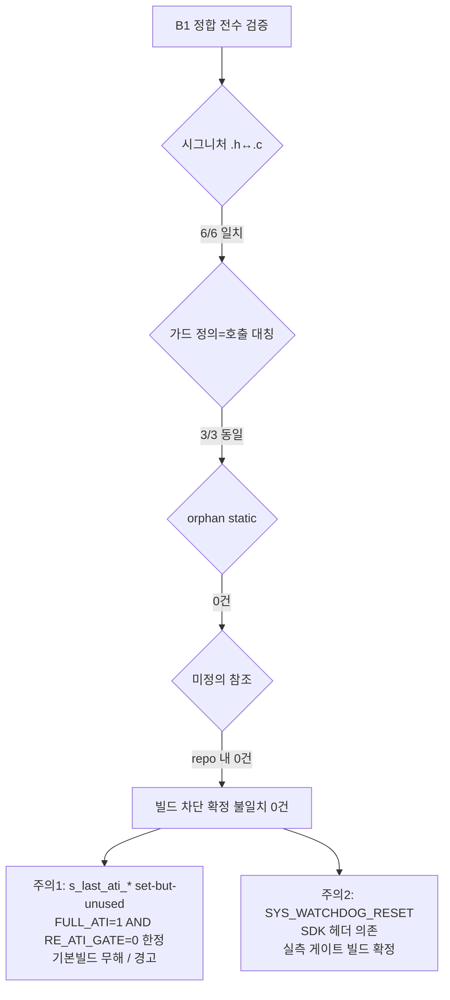

# B1 선언/호출 정합 재검증

**TL;DR**: 신규·변경 6함수(reseed_only·re_ati_trigger 공개·read_status_full·proc_re_ati_gate·proc_stuck_timeout·apply_filter_power_settings)의 호출↔선언↔정의 전수 검증 결과 **시그니처 전부 일치, 가드 정의=호출 대칭, orphan static 없음**. 빌드를 막는 [확정] 불일치는 **0건**. 다만 ① `s_last_ati_error/active` set-but-unused 경고 후보(FULL_ATI=1 AND RE_ATI_GATE=0 조합 한정, 기본값 둘 다 1이라 기본 빌드 무해), ② `SYS_WATCHDOG_RESET` 정의는 SDK 헤더(`hw.h` 체인) 제공이라 정적 확정 불가([실측 게이트: 빌드]) — 단 동일 파일이 `SYS_WATCHDOG_REFRESH`를 기존 컴파일하고 bootloader가 RESET 혼용 빌드하므로 접근성 성립 [추정-강].

---

## 1. 점검 대상·방법

빌드 미실행 정적 추론. 대상 파일: `src/2__cm3/Cortex-M3-src/systemControl/{tdc_drv_iqs323.c,tdc_drv_iqs323.h,tdc_touch.c,tdc_touch_config.h}`, 호출 상위 `main.c`. 점검 항목 ①~⑤(시그니처·범위·빌드가드·include·중복).

라벨: [확정]=코드 명시, [추정]=합리적 정적 추론, [실측 게이트]=빌드/실기 필요.

---

## 2. 함수별 호출↔선언↔정의 정합 (항목 ①·②·⑤)

| 함수 | 선언(.h) | 정의(.c) | 시그니처 일치 | 범위 | 호출처 | 판정 |
|---|---|---|---|---|---|---|
| `tdc_drv_iqs323_reseed_only` | `iqs323.h:454` `bool (void)` | `iqs323.c:970` `bool (void)` | [확정] 일치 | 공개 | `tdc_touch.c:281` (stuck stage1) | OK |
| `tdc_drv_iqs323_re_ati_trigger` | `iqs323.h:450` `bool (void)` | `iqs323.c:983` `bool (void)` | [확정] 일치 | 공개 | `tdc_touch.c:237`(게이트)·`288`(stuck stage2) | OK |
| `tdc_drv_iqs323_read_status_full` | `iqs323.h:446` `bool (bool*,bool*,bool*)` | `iqs323.c:1322` 동일 | [확정] 일치 | 공개 | `tdc_touch.c:505` (3-arg 모두 비-NULL) | OK |
| `proc_re_ati_gate` | (static, 헤더 없음) | `tdc_touch.c:224` `static void (tdc_touch_state_t)` | [확정] 일치 | 파일-내부 | `tdc_touch.c:482` | OK |
| `proc_stuck_timeout` | (static, 헤더 없음) | `tdc_touch.c:252` `static void (tdc_touch_state_t)` | [확정] 일치 | 파일-내부 | `tdc_touch.c:486` | OK |
| `apply_filter_power_settings` | (static, 헤더 없음) | `iqs323.c:1082` `static bool (void)` | [확정] 일치 | 파일-내부 | `iqs323.c:1243` | OK |

- 공개 3함수: 호출처가 동일 TU(`tdc_touch.c`)이며 `#include <tdc_drv_iqs323.h>`(tdc_touch.c:9)로 선언 가시 [확정]. 인자·반환 타입·개수 모두 일치, **불일치 0건**.
- `read_status_full` out param NULL 허용 설계(`iqs323.c:1341·1345·1349`)이나 실제 호출(`get_state:505`)은 3개 모두 비-NULL 주소 전달 → 안전 [확정].
- `re_ati_trigger` 공개 wrapper(`iqs323.c:983`)는 내부 static `re_ati_trigger`(`iqs323.c:569`)를 호출. **이름 동일·범위 분리**(공개=`tdc_drv_iqs323_re_ati_trigger`, static=`re_ati_trigger`)라 충돌 없음 [확정].
- `reseed_only` 공개 함수와 별개로 static 동명 심볼 없음 → 중복 정의 0건 [확정].

---

## 3. 빌드가드별 심볼 가용성 (항목 ③ — 핵심)

정의 가드 ↔ 호출 가드의 **대칭성**을 전수 대조. 비대칭이면 orphan static(정의만) 또는 미정의 참조(호출만)가 발생.

| 심볼 | 정의 가드 | 호출 가드 | 대칭 | 판정 |
|---|---|---|---|---|
| `proc_re_ati_gate` | `iqs323→touch.c:223` `FULL_ATI && RE_ATI_GATE` | `tdc_touch.c:481` 동일 | [확정] 동일 | orphan/미정의 모두 없음 |
| `proc_stuck_timeout` | `tdc_touch.c:251` `FULL_ATI && (STUCK_MS>0)` | `tdc_touch.c:485` 동일 | [확정] 동일 | orphan/미정의 모두 없음 |
| `apply_filter_power_settings` | `iqs323.c:1078` `FULL_ATI && BETA_POWER` | `iqs323.c:1241` 동일 | [확정] 동일 | orphan/미정의 모두 없음 |

- 4대 빌드가드 조합(FULL_ATI 0/1 · RE_ATI_GATE 0/1 · BETA_POWER 0/1 · GATE 0/1) 전수에서 위 3 static은 **정의·호출이 같은 #if로 묶여 동시 ON/OFF** → 어느 조합에서도 orphan static·미정의 참조 **0건** [확정].
- 공개 wrapper 2종(`reseed_only`·`re_ati_trigger`)·`read_status_full`은 **무가드 정의** → 모든 조합에서 심볼 항상 존재. 호출처(touch.c 게이트/stuck)는 가드 안이지만, 호출이 사라져도 정의는 무가드라 미정의 참조 불가 [확정].
- static `re_ati_trigger`·`wait_re_ati_done`(`iqs323.c:569·581`)도 **무가드 정의**. 호출처는 CALIB(`863`)·SLEEP_MEASURE(`906`)·ATI_DUMP(`1176`)·FULL_ATI(`1255`) 가드 안 + **무가드 공개 wrapper(`986`)** → 공개 wrapper가 항상 호출하므로 모든 조합에서 unused static 아님 [확정]. (FULL_ATI=0이어도 wrapper 경유 참조 살아있음.)

### 3.1 [주의] set-but-unused 경고 후보 — 빌드 차단 아님

- `s_last_ati_error`/`s_last_ati_active`(`tdc_touch.c:45·46`)는 `get_state`에서 **무가드로 write**(`512·513` 실패 시 false, `521·522` 성공 시 갱신). 521~522 사이 #if 없음 확인 [확정].
- 두 변수의 **유일한 read는 `proc_re_ati_gate:234`** 뿐이고, 이건 `FULL_ATI && RE_ATI_GATE` 가드 안.
- 따라서 **FULL_ATI=1 AND RE_ATI_GATE=0** 조합에서 두 변수는 write-only가 되어 `-Wunused-but-set-variable` 경고 후보 [추정]. 단:
  - 기본값 `RE_ATI_GATE=1`(config.h:177)이라 **기본 프로덕션 빌드는 read 발생 → 무해** [확정].
  - 경고이지 에러 아님 → `-Werror` 미설정이면 빌드 통과 [추정]. (B6/검증 노드에서 `-Werror` 여부 확인 권고.)
- `s_read_fail_cnt`(`:48`)는 `process:447·455`에서 무가드 read/write → 미사용 없음 [확정].

---

## 4. include 체인·외부 심볼 접근성 (항목 ④)

| 외부 심볼 | 사용 위치(신규) | 정의 출처 | 접근 경로 | 판정 |
|---|---|---|---|---|
| `SYS_WATCHDOG_RESET()` | `tdc_touch.c:300` (stuck stage3, **신규**) | src 트리 내 정의 **없음** → ONsemi Ezairo SDK 헤더(`hw.h` 체인) | `tdc_touch.c:11` `#include <hw.h>` | [실측 게이트] 빌드로 확정 |
| `SYS_WATCHDOG_REFRESH()` | `tdc_touch.c:159·330·392` (기존) | 동상 (SDK) | 동상 | [확정] 기존 컴파일 선례 |
| `ci_printi/printw/printe/printv` | touch.c·iqs323.c 다수 | `ci_printf.h` | `#include <ci_printf.h>` (touch.c:13, iqs323.h:17) | [확정] |
| `ci_timer_get_tick` | `proc_stuck_timeout:268·273·275·295` | `ci_timer.h` | `#include <ci_timer.h>` (touch.c:12) | [확정] |
| `write_register`(static) | `reseed_only:975`·`apply_filter_power_settings` 다수 | `iqs323.c:178` 동일 TU | 동일 파일 | [확정] |

### 4.1 SYS_WATCHDOG_RESET 접근성 — 정적 결론 [추정-강]

- src 전체 grep 결과 `SYS_WATCHDOG_RESET`·`SYS_WATCHDOG_REFRESH` **정의(`#define`)가 repo 내 0건** → 두 매크로 모두 **외부 SDK 헤더(`hw.h`가 끌어오는 ONsemi montana/HAL)** 제공 [확정].
- `tdc_touch.c`는 이미 `<hw.h>`를 include하고, **동일 파일에서 `SYS_WATCHDOG_REFRESH`를 기존에 정상 컴파일**(line 159·330·392) → 같은 헤더 체인이 `SYS_WATCHDOG_RESET`도 함께 제공한다면 추가 include 없이 접근 가능 [추정-강].
- diff상 `tdc_touch.c`에 **include 추가 없음** 확인 [확정] → 새 의존 헤더를 안 들였다는 뜻. 즉 RESET이 REFRESH와 **동일 헤더에 함께 정의**돼야 빌드 통과.
- 방증: bootloader `service.c:261`이 `SYS_WATCHDOG_RESET()`을, 같은 파일 `82·97`이 `SYS_WATCHDOG_REFRESH()`를 **혼용해 빌드되는 선례** → 두 매크로는 같은 SDK 헤더에 공존할 개연성 매우 높음 [추정-강].
- **잔여 리스크**: 만약 RESET이 REFRESH와 다른 SDK 헤더(예: reset/system 전용)에 있고 `hw.h`가 그걸 안 끌어오면 미정의 → 빌드 에러. SDK 헤더 repo 미포함이라 **정적 확정 불가** → [실측 게이트: 빌드 1회로 즉시 판명].

---

## 5. 종합 판정

| 구분 | 결과 |
|---|---|
| **빌드 차단 [확정] 불일치** | **0건** |
| 시그니처 정합 | 6/6 일치 [확정] |
| 가드 대칭(정의=호출) | 3/3 동일 [확정], orphan static 0 |
| 미정의 참조(repo 내부) | 0건 [확정] |
| 중복 정의 | 0건 [확정] |
| 잠재 경고 [추정] | `s_last_ati_error/active` set-but-unused (FULL_ATI=1 AND RE_ATI_GATE=0, 비기본 조합) |
| 정적 확정 불가 [실측 게이트] | `SYS_WATCHDOG_RESET` SDK 헤더 접근성(빌드 1회 판명), `-Werror` 여부 |

### 후속 권고 (검증/빌드 노드)
1. [실측 게이트] Eclipse 빌드 1회 → `SYS_WATCHDOG_RESET` 링크/컴파일 통과 확인. 실패 시 `tdc_touch.c`에 RESET 정의 헤더 명시 include 추가.
2. 빌드 플래그에 `-Werror` 포함 시, **FULL_ATI=1 AND RE_ATI_GATE=0** 변종 빌드는 `s_last_ati_*` set-but-unused로 깨질 수 있음 → 해당 조합 빌드 전 `(void)s_last_ati_error;` 가드 또는 변수 자체를 RE_ATI_GATE 가드로 묶는 방어 권고. 기본 조합(둘 다 1)은 무관.
