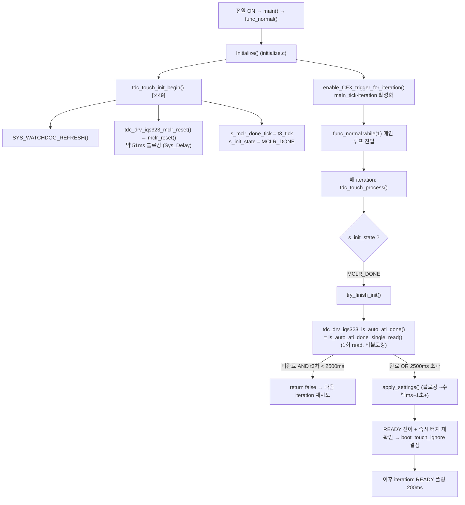

# B2 부팅 시퀀스 — 콜스택·타이밍 동작 분석

**TL;DR**: 부팅은 `Initialize()`→`tdc_touch_init_begin()`에서 MCLR(약 51ms 블로킹) 1회 + 상태머신 `MCLR_DONE`로 진입 후, **메인 루프가 매 iteration `tdc_touch_process()`를 호출하며 비블로킹으로 auto-ATI 완료(또는 t3 기준 2500ms 타임아웃)를 폴링**한다. 완료 tick에서 단 1회 `apply_settings()`가 실행되는데, 이 함수는 ACK→sensor_setup→touch/Beta/Power write→Full ATI write→**부팅 Re-ATI(`wait_re_ati_done` 최대 약 1초+ 블로킹)**→RESEED→Power Mode write 순서로 **한 tick을 길게 점유**한다(블로킹). 그 직후 READY 전이·즉시 터치 재확인으로 `boot_touch_ignore` 결정. 부팅 중 터치 상태였으면 auto-ATI 타임아웃·boot Re-ATI 미확정 경고가 정상 로그로 뜨고 `boot_touch_ignore=true`로 해제까지 입력 무시. t_ati는 [실측 게이트].

---

## 1. 부팅 콜스택 트리 (Full ATI, 운용 모드)



- **진입점 콜스택**: `func_normal()`([main.c:332·371]) → `Initialize()` → `tdc_touch_init_begin()`([initialize.c:449], [tdc_touch.c:388]).
- **MCLR은 부팅 초반 `tdc_touch_init_begin()` 안에서 동기 블로킹 1회**. auto-ATI 대기는 **블로킹이 아니라** 메인 루프 폴링(상태머신)이다 — 운용 모드 핵심 구조([tdc_touch.c:312~331·411~426]).

---

## 2. 단계별 블로킹·타이밍

### 2.1 MCLR (약 51ms 블로킹) — [확정]

`tdc_touch_init_begin()`([tdc_touch.c:388~398]) → `tdc_drv_iqs323_mclr_reset()`([tdc_drv_iqs323.c:940]) → `mclr_reset()`([:288~298]):

```
Sys_DIO_Config(RDY, OUTPUT); Sys_GPIO_Set_Low(RDY);
Sys_Delay(DEFAULT_DELAY_MS * MCLR_HOLD_MS)   // 1ms LOW 유지
Sys_DIO_Config(RDY, INPUT);
Sys_Delay(DEFAULT_DELAY_MS * BOOT_WAIT_MS)   // 50ms 부팅 대기
```

- `MCLR_HOLD_MS=1`([:38]), `BOOT_WAIT_MS=50`([:39]) → **총 약 51ms 동기 블로킹**(오케스트레이터 입력 "~55ms"는 이 51ms + 함수 호출 오버헤드 어림). [확정]
- `DEFAULT_DELAY_MS = SystemCoreClock/1000`([:30]) × N → `Sys_Delay`는 사이클 카운트 busy-wait이므로 약 N ms. [확정]
- 이 51ms는 **CFX iteration 활성화 이전**(LED 버스트와 병렬 예정)이라 체감 시간은 0에 가깝다([initialize.c:448] 주석). [확정]
- MCLR은 **Full ATI 여부와 무관하게 매 부팅 무조건 실행** → 직전 stuck·오염 LTA 완전 소거(설계 §3.1 "MCLR 항상"). [확정]
- MCLR 본 변경 diff에 없음 → Full ATI 전환으로 MCLR 경로 **무변경**. [확정]

### 2.2 auto-ATI 대기 — 비블로킹 폴링, 타임아웃 2500ms (t3 기준) — [확정]

운용 모드 auto-ATI 완료 감지는 **블로킹 루프가 아니다**. 상태머신이 메인 루프 매 iteration `tdc_touch_process()` → `try_finish_init()`([tdc_touch.c:315])에서 1회 read만 한다:

- `tdc_drv_iqs323_is_auto_ati_done()`([:945~948]) = `is_auto_ati_done_single_read()`([:312~331]): System Status(0x10) 1회 read, `ati_active==0`이면 완료. read 실패·0xEEEE는 `false`(미완료) 반환 → **다음 iteration 재시도**([:319·325]). [확정]
- **타임아웃**: `TDC_TOUCH_INIT_TIMEOUT_MS=2500`([tdc_touch.h:27])을 **`tdc_timer_get_t3_tick() - s_mclr_done_tick`** 과 비교([tdc_touch.c:319]). 초과 시 `[TOUCH] AUTO-ATI: TIMEOUT, FORCING FINISH` 경고 + **강제 진행**(설정 적용은 그대로)([:321~322]). [확정]
- 시간 기준이 **t3 tick(TIMER3 LED·터치 공유)** 인 점이 핵심: `init_begin` 시점은 CFX iteration 미활성이라 `g_ci_timer_main_tick`이 안 증가해서 t3를 쓴다([tdc_touch.c:25~27]). [확정]
- 블로킹 변종 `wait_auto_ati_done()`([:343~378], 20회×50ms = 최대 약 1초)는 **DUMP 모드 전용**(주석 [:341])이라 운용 부팅 경로에서 호출되지 않는다. [확정]
- **t_ati [실측 게이트]**: 단일 CRX0 Full ATI의 실제 수렴 시간. 정상 노터치라면 auto-ATI는 보통 수백 ms 내 완료([설계 §4.4 1 measurement ≈0.4ms~수ms, 수렴 step 수 미확정]) → 2500ms 타임아웃 여유 충분으로 추정. 단 **단일채널 Full POR auto-ATI 실패 시 ati_active가 안 내려가 2500ms 풀 소비 후 강제 진행**할 수 있음([설계 실측게이트 5]). [실측 게이트]

### 2.3 apply_settings() — 1회 블로킹, 부팅 Re-ATI 포함 — [확정]/[추정]

완료(또는 강제) tick에서 `try_finish_init()`([:332])이 `tdc_drv_iqs323_apply_settings()`([tdc_drv_iqs323.c:1131])를 **1회** 호출. Full ATI 운용 경로(`ATI_DUMP_ENABLE=0`) 시퀀스([:1196~1300]):

| 순번 | 단계 | 함수·레지스터 | 블로킹 성격 | 라벨 |
|---|---|---|---|---|
| 1 | ACK Reset Event | `ack_reset_event()` 0xC0=0x0001 [:380] | write 1회 | [확정] |
| 2 | Confirm Reset | `confirm_reset_event()` [:385] 최대 10회×1ms | 최대 약 10ms+read | [확정] |
| 3 | Sensor Setup (단일채널) | `sensor_setup()` [:1210] | 다수 write (CRX1 더미 폐기 반영) | [확정] |
| 4 | Touch Settings | `touch_settings()`→계수 16/Hyst 8 [:1216] | write_and_verify | [확정] |
| 5 | Prox Settings | `prox_settings()` [:1222] | (PROX_THRESHOLD_ENABLE=0이면 no-op) | [확정] |
| 6 | Events Enable | `events_enable()` [:1228] | write | [확정] |
| 7 | **Full ATI write** | `write_ati_compensation()` [:1236]→0x36=0x040C·0x37=0x00C8 [:698~714] | write 2회 | [확정] |
| 8 | **Filter/Power write** | `apply_filter_power_settings()` [:1242]→0x31·0xB0·0xB1·0xB2·0xB4·0xC2·0xC5 | write 7회 | [확정] |
| 9 | **부팅 Re-ATI** | `re_ati_trigger()` [:1255] + 50틱 spin + `wait_re_ati_done()` [:1265] | **블로킹(아래 2.4)** | [확정] |
| 10 | RESEED | 0xC0=0x0008 [:1273] | write 1회 | [확정] |
| 11 | **Power Mode** | 0xC0 LSB 0x50(Auto No ULP)·MSB 0x07(CH Timeout Disable) [:1283] | write 1회 | [확정] |
| 12 | `tdc_clear_iqs323_in_ulp_mode()` [:1298] | 플래그 clear | — | [확정] |

- 각 write/read는 내부에서 `force_window_open()`(최대 45ms 타임아웃 [:31·161]) + `wait_rdy_window_closed()`(최대 20ms 타임아웃 [:32·196]) busy-wait을 동반. 정상 시 즉시 통과지만 **최악 누적 시 단계당 수십 ms 가능**. [추정]
- **이 전체가 한 `tdc_touch_process()` 호출 안에서 동기 실행** → READY 전이 직전 한 tick이 길게 점유된다(부팅 1회뿐이라 UX 무해). 사이사이 `SYS_WATCHDOG_REFRESH()` 3회([:1173·1234·1253·1269·1300])로 워치독 방어. [확정]

### 2.4 부팅 Re-ATI의 wait_re_ati_done 블로킹 최대 시간 — [확정]

`apply_settings()` 9단계([:1249~1270]):
```
re_ati_trigger();                       // 0xC0 bit2 write
{ 50틱 spin (ci_timer_get_tick 차분) }   // 약 50ms busy-wait (t_main 단위)
wait_re_ati_done();                     // 블로킹 폴링
```

`wait_re_ati_done()`([:581~623]) 구조:
- `for i = 0..9` (최대 10회 iteration).
- 각 iteration: `read_register(0x10)` 1회.
  - read 실패 → `Sys_Delay(DEFAULT_DELAY_MS*100)` = **약 100ms** 후 continue([:592]).
  - 0xEEEE → 약 100ms 후 continue([:599]).
  - `ati_error` SET → 즉시 `false` 반환([:608]) — **터치 중이면 여기로 빠질 수 있음**.
  - `ati_event`(=ATI 완료) SET → 즉시 `true` 반환([:614]).
  - 어느 것도 아니면(ATI 진행 중) `Sys_Delay(약 100ms)` 후 다음 iteration([:618]).
- 10회 모두 미완료 시 `[TOUCH] RE-ATI: TIMEOUT` + `false` 반환([:621]).

**최대 블로킹**: 10 iteration × (read 트랜잭션 시간 + 약 100ms delay) ≈ **약 1000ms + read 10회 오버헤드** → **최악 약 1.0~1.3초** [확정]. 정상(노터치, ATI 빠른 수렴) 시 1~2 iteration 내 `ati_event`로 즉시 빠져 **약 50~250ms** [추정].
- 50틱 선행 spin([:1259~1263])까지 더하면 9단계 총 블로킹 **최악 약 1.05~1.35초**. [확정]
- 반환값이 false여도 `ci_printw("BOOT RE-ATI: NOT CONFIRMED (터치 중이면 정상)")` 경고만 찍고 시퀀스 계속([:1265~1267]) → **부팅이 막히지 않는다**. [확정]

> [!NOTE]
> 부팅 Re-ATI(9단계)는 `wait_re_ati_done` false라도 진행하므로 **auto-ATI 2500ms 타임아웃과 별개의 추가 블로킹**이다. 최악 시나리오(auto-ATI 2500ms 풀 + apply_settings 내 boot Re-ATI 약 1.3초)에서 **부팅 한 tick이 최대 약 3.8초+α** 점유 가능. 부팅 1회 한정이고 워치독 refresh가 사이에 있어 안전하나, LED 버스트(약 1.8초)보다 길어질 수 있어 체감 시간 0 가정이 깨질 여지 [추정]. 실제는 t_ati 실측 의존. [실측 게이트]

### 2.5 RESEED·Power Mode — [확정]

- 9단계 직후 10단계 **RESEED**([:1272~1276]): `write_register(0xC0, 0x08, 0x00)` 1회. Re-ATI로 산출된 게인 위에서 LTA를 현재 counts로 재동기 → 부팅 baseline 확정. [확정]
- 11단계 **Power Mode**([:1278~1286]): `0xC0 LSB 0x50`(Power Mode bits[6:4]=101 Automatic No ULP) + `MSB 0x07`(CH0~2 Timeout Disable). IC Channel Timeout 미사용(SW 타임아웃 채택) → disable 유지. LP까지만 자동 강하, ULP 미진입. [확정]
- 순서 주의: **RESEED가 Power Mode write보다 먼저**. Re-ATI→RESEED→Power Mode 순이라 Re-ATI 진행 중 RESEED가 겹칠 가능성은 9단계 `wait_re_ati_done`이 흡수(완료/타임아웃 후 진행). [추정]

---

## 3. READY 전이 + 부팅 중 터치 상태 — [확정]

`apply_settings()` 반환 후 `try_finish_init()` 말미([:363~369]):
- `s_touch_tick_old = ci_timer_get_tick()`, `s_touch_state_old = RESET`으로 폴링 상태 초기화. **여기서부터 시간 기준이 main_tick으로 전환**([tdc_touch.c:27]). [확정]
- `try_finish_init()` true 반환 → `tdc_touch_process()`([:411~425])가 `s_init_state = READY`, `s_boot_ready_tick = main_tick` 설정 후 **즉시 `tdc_touch_get_state(&boot_state)` 1회 호출**해 부팅 터치 재확인. [확정]

### 부팅 중 터치 상태였을 때 동작 — [확정]/[추정]

1. **auto-ATI 단계**: 터치 중이면 ati_active가 안 내려가 `is_auto_ati_done_single_read`가 계속 false → **2500ms 타임아웃 후 강제 진행**(`AUTO-ATI: TIMEOUT (터치 중이면 정상)` 류 경고)([:321·376]). [확정]
2. **부팅 Re-ATI(9단계)**: 터치 중 Re-ATI는 ATI_Error로 빠지거나([:608]) 미수렴 → `wait_re_ati_done` false → `BOOT RE-ATI: NOT CONFIRMED (터치 중이면 정상)` 경고([:1267]). **ATI_Error 잔류 가능**(주석 [:1252]). [확정]
3. **READY 즉시 재확인**: `boot_state == TOUCH`이면 `s_boot_touch_ignore = true` + `BOOT TOUCH ? ignoring until released` 경고([:420~423]). [확정]
4. **해제 시 복귀**: 이후 폴링에서 `curr_state != TOUCH`(NOT_TOUCH) 인식 tick에 `s_boot_touch_ignore = false` + `BOOT TOUCH RELEASED ? sensing resumed`([:560~566 diff]). [확정]
   - **diff 변경점**: 과거 `if (got_state && curr_state != TOUCH)`였으나, read 실패 처리가 `tdc_touch_process` 상단에서 NOT_TOUCH로 일원화(N회 hold 후 강제)되어 **`got_state` 가드가 제거**됨([tdc_touch.c diff 559~564]). 즉 해제 판정이 read 성공 캐시가 아니라 일원화된 `curr_state`로 단순화. [확정]
5. **ATI_Error 잔류 복구**: boot Re-ATI에서 못 지운 ATI_Error는 **해제 후 노터치 구간에서 `proc_re_ati_gate`가 자동 Re-ATI 발행**해 clear(주석 [:1252], 게이트 조건 노터치 AND !ati_active AND ati_error AND 쿨다운 [:442])로 복구된다고 설계. **단 이 복구의 실효성은 단일채널 auto-ATI 성공률에 의존** → [실측 게이트 5]. [추정]

---

## 4. 정합·주의 (정적 점검)

- `apply_settings()` 운용 경로는 `re_ati_trigger()`(static [:569])를 **내부 직접 호출**([:1255])하고, 공개 래퍼 `tdc_drv_iqs323_re_ati_trigger()`([:973~977 diff])는 게이트/stuck 경로용. 부팅 Re-ATI는 게이트 불요(설정 직후 1회)라 static 직접 호출이 일관됨. [확정]
- 부팅 Re-ATI 블록은 `#if TDC_TOUCH_FULL_ATI_ENABLE`([:1249])로만 가드 — `BETA_POWER_WRITE` 가드 밖이라 Full ATI=1이면 BETA write 여부와 무관하게 부팅 Re-ATI는 항상 수행. **정합 OK**. [확정]
- `apply_filter_power_settings()`는 `#if (FULL_ATI && BETA_POWER_WRITE)`([:1129]) 가드 안에 정의·호출([:1241~1247]) → 한쪽만 켜면 정의/호출 동시 소거되어 orphan/미정의 없음. [확정]
- 시간 기준 혼용 주의: auto-ATI 타임아웃은 **t3 tick**([:319]), boot Re-ATI 50틱 spin·READY 후 폴링은 **main_tick**([:1260·434]). 부팅 초기 main_tick 미증가 구간을 t3로 커버하는 설계라 정합. **단 50틱 spin([:1259])이 main_tick 기준인데 이 시점은 CFX iteration 활성 후(apply_settings는 READY 폴링 tick에서 실행)라 main_tick 증가 중 → 약 50ms로 동작**. [추정]

---

## 5. 핵심 타이밍 요약 (부팅)

| 구간 | 블로킹 | 시간 | 라벨 |
|---|---|---|---|
| MCLR (`mclr_reset`) | 동기 1회 | 약 51ms | [확정] |
| auto-ATI 대기 | **비블로킹 폴링** | 정상 수백ms / 최악 2500ms 타임아웃 | [확정]·t_ati [실측 게이트] |
| apply_settings 1~8 (write 다수) | 동기 | 정상 수십~수백ms (최악 window 타임아웃 누적) | [추정] |
| 부팅 Re-ATI(`wait_re_ati_done`) | 동기 폴링 | 정상 약 50~250ms / 최악 약 1.0~1.3초 | [확정] |
| RESEED·Power Mode | 동기 | 수 ms | [확정] |
| READY 전이·즉시 재확인 | 동기 read 1회 | 수 ms | [확정] |
| **부팅 1 tick 총점유 최악** | — | **약 3.8초+α** (auto-ATI 2.5s 풀 + boot Re-ATI 1.3s) | [추정] |

> [!IMPORTANT]
> 부팅 정상 경로(노터치, auto-ATI 빠른 수렴)에서는 LED 버스트(약 1.8초)와 병렬이라 체감 0에 수렴. 그러나 **부팅 중 터치 또는 단일채널 auto-ATI 미수렴** 시 2500ms 타임아웃 + boot Re-ATI 약 1.3초가 직렬로 누적될 수 있어, t_ati 실측으로 INIT_TIMEOUT 2500ms·wait_re_ati_done 10회 적정성 재확인 권고. [실측 게이트: t_ati(단일 CRX0 Full), 부팅 단일채널 auto-ATI 실패 시 운용 Re-ATI 잔류]
