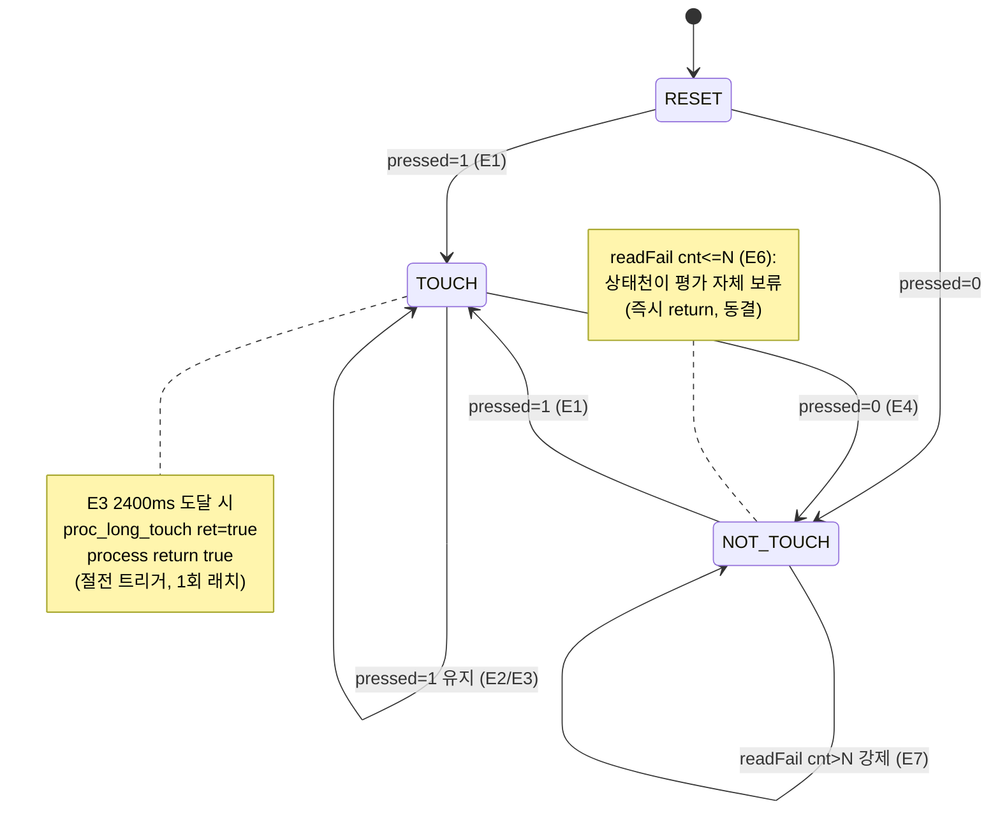

# B3 노말 루프 이벤트·상태 천이

**TL;DR**: 노말 메인 루프는 `iterationFlag` tick마다 `tdc_touch_process()`를 호출하고, 내부 200ms 폴링([tdc_touch.h:25] `POLL_INTERVAL=200`, 설계서 "100ms"는 부정확)에서 `get_state→read_status_full`로 3-상태(pressed·ati_error·ati_active)를 1회 read·캐시한다. read 성공 시 `proc_re_ati_gate`(드리프트 Re-ATI) → `proc_stuck_timeout`(30초 3단계) → `proc_long_touch`(2400ms, [tdc_touch.h:26] `LONG_TOUCH_MS=2400`, 설계서 "3초"는 부정확) 순으로 흐른다. read 실패는 N회(`READ_FAIL_HOLD_CNT=10`)까지 hold(상태·게이트·stuck·롱터치 전부 보류) 후 N회 초과 시 NOT_TOUCH 강제. 롱터치만 process가 `true` 반환 → main `powerButtonPushed`→`systemControl()` 절전 트리거. **[확정] 게이트·stuck·롱터치가 read 실패 hold 구간에서 전부 동결**되는 점이 회귀4 단일 규칙의 핵심 side effect다.

---

## 1. 콜스택 (노말 루프 폴링)

```
main.c while(1) [main.c:435]
  └─ iterationFlag==true [main.c:437]
       └─ (TDC_TOUCH_GATE_ENABLE=0 기본 → 직접) powerButtonPushed = tdc_touch_process() [main.c:463]
            └─ tdc_touch_process() [tdc_touch.c:400]
                 ├─ switch(s_init_state) → READY break [tdc_touch.c:428]
                 ├─ if (POLL_INTERVAL(200) <= curr_tick - s_touch_tick_old) [tdc_touch.c:436]  ← 200ms 게이팅
                 │    ├─ got_state = tdc_touch_get_state(&curr_state) [tdc_touch.c:440]
                 │    │    └─ tdc_drv_iqs323_read_status_full(&pressed,&ati_error,&ati_active) [tdc_touch.c:505]
                 │    │         └─ read_register(0x10) [tdc_drv_iqs323.c:259]  ← 0xEEEE 글리치 → false
                 │    │         └─ 성공: s_last_ati_error/active 캐시 [tdc_touch.c:521-522]
                 │    │         └─ 실패: 캐시 false로 무효화 [tdc_touch.c:512-513]
                 │    ├─ if(!got_state){ ++s_read_fail_cnt<=10 ? return false : NOT_TOUCH 강제 } [tdc_touch.c:445]
                 │    ├─ if(state_old != curr_state) STATE 로그 [tdc_touch.c:458]
                 │    ├─ if(s_boot_touch_ignore){ … return false } [tdc_touch.c:465]  ← 부팅 무시 구간
                 │    ├─ proc_re_ati_gate(curr_state) [tdc_touch.c:482]   (FULL_ATI && RE_ATI_GATE)
                 │    │    └─ 조건 충족 시 tdc_drv_iqs323_re_ati_trigger() [tdc_touch.c:237]
                 │    ├─ proc_stuck_timeout(curr_state) [tdc_touch.c:486]  (FULL_ATI && STUCK_MS>0)
                 │    │    └─ 30초 도달 시 reseed_only/re_ati/MCLR [tdc_touch.c:281·288·300]
                 │    └─ if(proc_long_touch(curr_state)) return true [tdc_touch.c:489]
                 │         └─ 2400ms 지속 시 ret=true (최초 1회)
                 └─ return false (폴링 간격 미도달 또는 비롱터치)
       └─ systemControl(..., powerButtonPushed, ...) [main.c:504·508]  ← 롱터치 true 소비
```

> [!IMPORTANT]
> **[확정] 폴링 간격은 200ms** ([tdc_touch.h:25]). 오케스트레이터 입력·설계서 §3.2의 "100ms 폴링"은 매크로 실값과 불일치. 쿨다운·hold 카운트 환산(`N=10 → 2초`)은 200ms 기준이 맞다([tdc_touch_config.h:688·714 주석 "@200ms"]).
>
> **[확정] 순서: 게이트 → stuck → 롱터치** ([tdc_touch.c:482→486→489]). 설계서 §3.2가 요구한 "터치 판정(D)을 Re-ATI(F→G)보다 먼저 분기"는 `proc_re_ati_gate`가 `curr_state`(이미 판정된 상태)를 입력받아 `NOT_TOUCH`에서만 발행하는 구조로 충족 — 게이트 함수 호출 위치 자체가 롱터치보다 앞서도, 터치 상태에서는 게이트가 no-op이라 무해.

---

## 2. read_status_full 3-상태 매핑 (정적 확정)

| out param | 소스 비트 | 코드 | 매핑 |
|---|---|---|---|
| `pressed` | System Status MSB bit9 ch0_touch | [tdc_drv_iqs323.c:275] | `== CH0_IN_TOUCH(1)` → TOUCH |
| `ati_error` | LSB bit6 ati_error | [tdc_drv_iqs323.c:279] | `== ATI_ERROR(1)` |
| `ati_active` | LSB bit5 ati_active | [tdc_drv_iqs323.c:282] | `!= 0` |
| (실패) | lsb==0xEE && msb==0xEE | [tdc_drv_iqs323.c:265] | I2C 글리치 → return false |

- 비트필드 [tdc_drv_iqs323.h:226·241·242] 정렬 일치 확인 [확정].
- `get_state`는 `pressed`만으로 TOUCH/NOT_TOUCH를 결정([tdc_touch.c:524]); ati_error/active는 **캐시만** 하고 상태 enum에 반영 안 함 [확정]. `CALIBRATION_ERROR` 상태는 Full ATI에서도 발생 경로 없음([tdc_touch.h:38] 미사용 주석 유효).

---

## 3. 이벤트별 상태 천이표

기준: `s_touch_state_old`(process 레벨 [tdc_touch.c:41]), `proc_long_touch::s_state_old`·`proc_stuck_timeout::s_prev`(각 함수 static). curr_state는 get_state 산출 또는 read 실패 강제값.

| # | 이벤트 | 입력 조건 (read 결과) | curr_state | s_touch_state_old 천이 | 게이트/stuck/롱터치 side effect | process 반환 |
|---|---|---|---|---|---|---|
| E1 | **노터치→터치 진입** | pressed=1, active=0 | TOUCH | NOT_TOUCH→TOUCH (로그) | stuck: s_stuck_tick0 기록·s_stage=0 / long: s_tick_first_touch 기록 | **false** |
| E2 | **터치 유지(<2.4s)** | pressed=1 | TOUCH | TOUCH(무변) | stuck: 경과 누적 / long: 미달 ret=false | false |
| E3 | **터치 유지(=2.4s 도달)** | pressed=1 | TOUCH | TOUCH(무변) | long: s_is_long_touch=true, ret=true (최초 1회) | **true** (롱터치 EVENT) |
| E4 | **터치 해제** | pressed=0, active=0 | NOT_TOUCH | TOUCH→NOT_TOUCH (로그) | stuck: s_stage=0·s_prev=NOT_TOUCH·return / long: TOUCH→비TOUCH → s_is_long_touch=false | false |
| E5 | **드리프트(노터치 ATI Error)** | pressed=0, error=1, active=0, 쿨다운경과 | NOT_TOUCH | 변화 시 로그 | **gate: re_ati_trigger() 발행 + s_cooldown=10** / stuck·long: NOT_TOUCH라 무동작 | false |
| E5' | 드리프트 쿨다운 중 | pressed=0, error=1, active=0, cooldown>0 | NOT_TOUCH | — | gate: 발행 보류(s_cooldown--) | false |
| E5'' | ATI 진행 중 | pressed=0, error=1, **active=1** | NOT_TOUCH | — | gate: active 비-0이라 미발행 | false |
| E6 | **read 실패(≤N회)** | got_state=false, cnt≤10 | (미설정) | **천이 평가 안 함** | **즉시 return false** — 게이트·stuck·롱터치 전부 보류, 캐시 false 무효화 | false |
| E7 | **read 실패(N회 초과)** | got_state=false, cnt>10 | NOT_TOUCH 강제 | →NOT_TOUCH 가능(로그) | gate: error 캐시=false라 미발행 / stuck: NOT_TOUCH→리셋 / long: 비TOUCH | false |
| E8 | **롱터치 발동** | E3와 동일 | TOUCH | TOUCH | long ret=true | **true → systemControl 절전** |
| E9 | **부팅 무시(터치 지속)** | s_boot_touch_ignore=1, pressed=1 | TOUCH | 로그 가능 | **return false** (게이트·stuck·롱터치 도달 전 차단), 5초 시 보라 LED | false |
| E10 | **부팅 무시 해제** | s_boot_touch_ignore=1, curr_state!=TOUCH | NOT_TOUCH | 로그 | ignore=false 복귀, **그래도 그 tick은 return false** | false |

---

## 4. 이벤트별 상세 (분기·반환값·side effect)

### E1 노터치→터치 진입 [확정]
- `read_status_full` pressed=1 → `get_state` `*p_state=TOUCH` [tdc_touch.c:526], `s_last_ati_*` 갱신.
- `s_touch_state_old != TOUCH` → STATE 로그 + old=TOUCH [tdc_touch.c:458-461].
- `proc_re_ati_gate(TOUCH)`: state_now!=NOT_TOUCH → 조건 거짓, **no-op** (s_cooldown만 감소) [tdc_touch.c:234]. **터치 중 Re-ATI 보류 급소가 여기서 성립** — 터치 진입 즉시 ati_error=1이어도 게이트가 막음.
- `proc_stuck_timeout(TOUCH)`: s_prev(직전 NOT_TOUCH/RESET)!=TOUCH → `s_stuck_tick0=tick, s_stage=0` 기록 [tdc_touch.c:266-269].
- `proc_long_touch(TOUCH)`: s_state_old(NOT_TOUCH/RESET) 분기 → first_touch tick 기록, ret=false [tdc_touch.c:124·128].
- **반환 false** (롱터치 미발동).

### E2/E3 터치 유지 / 롱터치 도달 [확정]
- E2: long s_state_old=TOUCH && state_now=TOUCH && !is_long_touch && (tick-first<2400) → ret=false [tdc_touch.c:104-110].
- E3: 동일 경로에서 `2400 <= (tick-first)` → s_is_long_touch=true, **ret=true** [tdc_touch.c:110-113]. process가 EVENT 로그 + **true 반환** [tdc_touch.c:489-492].
- **2.4초이지 3초 아님** [확정, tdc_touch.h:26]. 1회만 true(is_long_touch 래치) — 터치 계속 유지해도 재발동 없음.

### E4 터치 해제 [확정]
- pressed=0 → NOT_TOUCH. stuck: state_now!=TOUCH → s_stage=0 리셋 + **early return** [tdc_touch.c:258-263] (30초 카운터 무효화). long: s_state_old=TOUCH, state_now!=TOUCH → s_is_long_touch=false [tdc_touch.c:117-119], ret=false.
- side effect: 모든 stuck 단계·롱터치 래치 리셋. 다음 터치는 새 카운트.

### E5 드리프트 Re-ATI (노터치 ATI Error) [확정]
- 조건 4개 동시: `curr_state==NOT_TOUCH && !s_last_ati_active && s_last_ati_error && s_cooldown==0` [tdc_touch.c:234].
- 충족 시: 로그 + `tdc_drv_iqs323_re_ati_trigger()` (0xC0 bit2) + `s_cooldown=TDC_TOUCH_RE_ATI_COOLDOWN_CNT(10)` [tdc_touch.c:236-238].
- **side effect**: IC 수동 Re-ATI 1회 → LTA 재정규화. 노터치 구간이므로 정상(드리프트 자동 복구). 다음 10폴링(2초)간 재발행 차단.
- **[추정]** Full ATI 자동 Re-ATI(경로_1)도 LTA 밴드 이탈 시 IC 자체 발동 가능 — SW 게이트(경로_2)와 별개. 노터치 구간이라 양쪽 모두 안전.

### E6/E7 read 실패 (N회 hold → NOT_TOUCH 강제) [확정 — 회귀4 단일 규칙]
- E6 (cnt≤10): `++s_read_fail_cnt<=10` → **즉시 return false** [tdc_touch.c:447-450].
  - **side effect (핵심)**: s_touch_state_old 천이 평가·게이트·stuck·롱터치 **전부 건너뜀**. 진행 중 터치/롱터치 카운트가 **그 tick 동안 동결**(증가도 리셋도 안 됨). proc_long_touch::s_tick_first_touch는 tick 차분이라 다음 성공 read에서 누적 경과가 그대로 반영 → 일시 read 실패가 롱터치를 끊지 않음(의도된 burst 흡수).
  - get_state 실패 시 `s_last_ati_error/active=false`로 캐시 무효화 [tdc_touch.c:512-513] → **stale 캐시 누출 차단**(급소 수정).
- E7 (cnt>10): `curr_state=NOT_TOUCH` 강제 [tdc_touch.c:451] → 이후 정상 흐름.
  - stuck: NOT_TOUCH → 리셋. long: 비TOUCH → 래치 해제. gate: error 캐시 false라 미발행.
  - **side effect**: 통신 글리치로 인한 stuck 롱터치 오발 방지(N회 초과 후 강제 해제).
- **[실측 게이트]** N=10(@200ms=2초)이 t_ati burst 구간보다 큰지 — burst가 2초 초과면 진짜 터치 중에도 NOT_TOUCH 강제될 위험. 설계서 실측게이트#6.

### E8 롱터치 → 절전 트리거 [확정]
- process true 반환 → main `powerButtonPushed=true` [main.c:463] → `systemControl(...,powerButtonPushed,...)` [main.c:508].
- **side effect**: systemControl 내부에서 파워오프/절전 전환 평가(상위 모듈). 본 노드 스코프 밖이나, 롱터치가 절전 진입 트리거임이 호출 경로로 확정.

### E9/E10 부팅 무시 구간 [확정]
- READY 전이 시 터치 중이면 `s_boot_touch_ignore=true` [tdc_touch.c:420-422].
- E9 (지속): ignore && curr_state==TOUCH → 5초 경과 시 보라 LED 1회 [tdc_touch.c:472-477], **return false** (게이트·stuck·롱터치 도달 전 차단) [tdc_touch.c:478].
- E10 (해제): ignore && curr_state!=TOUCH → ignore=false + 로그 [tdc_touch.c:467-470], **그 tick도 return false**.
- **diff 개선점**: 과거 `got_state && curr_state!=TOUCH` 이중 조건 → 신규는 read 실패 시 이미 상위에서 처리(N회 hold/NOT_TOUCH 강제)되므로 `curr_state!=TOUCH`만으로 단순화 [tdc_touch.c:467]. read 실패 hold 중(E6)이면 E9/E10 도달 전 return → ignore 해제 보류(안전).

---

## 5. 상태 머신 다이어그램 (process 레벨 s_touch_state_old)



> [!NOTE]
> read 실패 hold(E6)는 **상태 머신에 진입조차 안 함**(즉시 return). 그래서 다이어그램에 self-loop로도 표기 불가 — "동결"이 정확. E7(N회 초과)에서만 NOT_TOUCH로 강제 진입.

---

## 6. 정합·불일치 요약

| 항목 | 코드 실값 | 설계/주석 표기 | 판정 |
|---|---|---|---|
| 폴링 간격 | 200ms [tdc_touch.h:25] | "100ms"(설계 §3.2·오케 입력) | **불일치** — 코드 200 채택. 쿨다운/hold 환산은 200 기준 [config:688·714] |
| 롱터치 시간 | 2400ms [tdc_touch.h:26] | "3초"(오케 입력)·"2.8초"([tdc_touch.h:7 주석]) | **불일치** — 코드 2400(2.4초) 채택 |
| 게이트↔롱터치 순서 | gate→stuck→long [tdc_touch.c:482·486·489] | "터치 판정 선분기"(설계 §3.2) | **정합** — curr_state 입력 + NOT_TOUCH 게이트로 터치 중 보류 성립 |
| 부팅 무시 read 실패 | E6 hold가 E9/E10 선점 | 설계 미명시 | **정합 강화** — hold 중 ignore 해제 보류(안전) |
| stuck 30초 카운트 | tick 차분, NOT_TOUCH 리셋 [tdc_touch.c:258·273] | 설계 §3.3 일치 | 정합 |

**[추정] 동시성 주의**: `proc_re_ati_gate`(E5)와 `proc_stuck_timeout` stage2 Re-ATI([tdc_touch.c:288])는 둘 다 `re_ati_trigger`를 호출하나 경로 분리 — gate는 NOT_TOUCH 전용, stuck stage2는 TOUCH 지속 전용이라 동일 tick 동시 발행 불가([확정], curr_state가 한 값). 단 gate 쿨다운(s_cooldown)과 stuck stage 카운터는 독립 static이라 상호 간섭 없음.

**[실측 게이트]**: ① t_ati burst > N×200ms(2초)면 E6→E7 전이로 진짜 터치 중 NOT_TOUCH 강제 위험(#6). ② 드리프트 ati_error가 노터치 구간에서 실제로 SET되는지·쿨다운 10회가 burst보다 긴지(#9). ③ proc_long_touch first_touch tick이 read 실패 hold 누적 구간에서 끊김 없이 이어지는지(#6).
