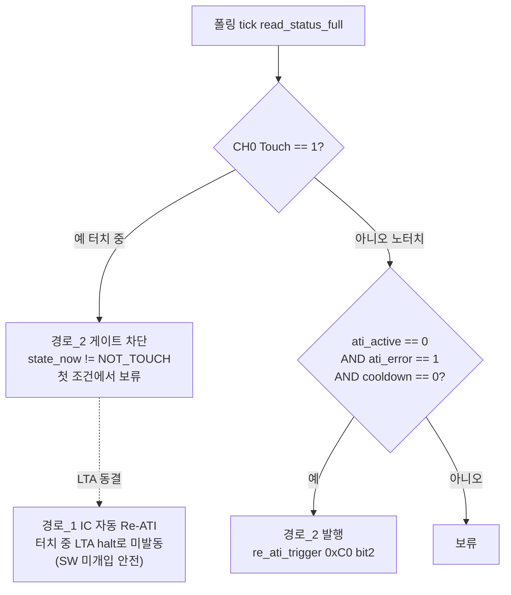
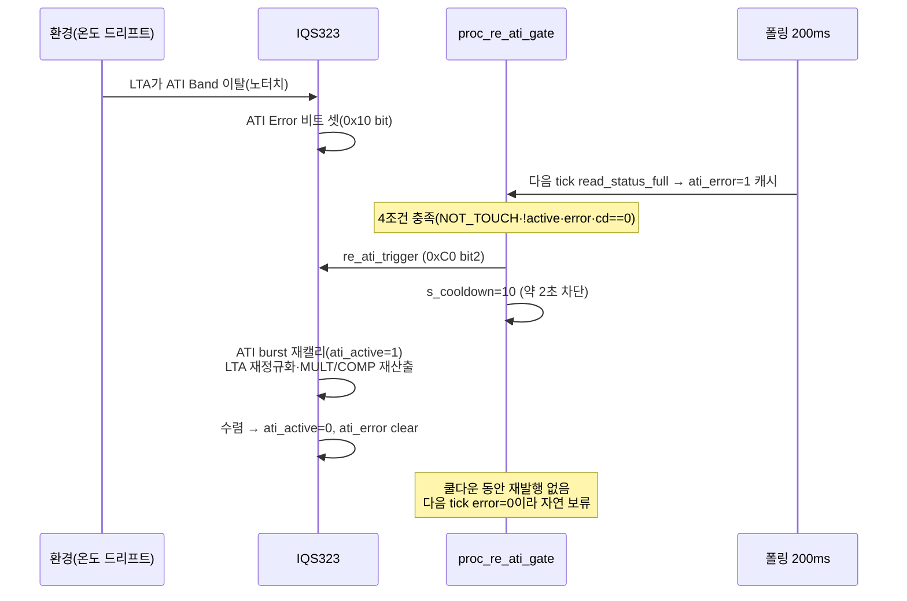

# B4 Re-ATI 게이트 타이밍 동작분석

**TL;DR**: `proc_re_ati_gate`(노말 200ms 폴링 tick마다 호출)는 4조건 `NOT_TOUCH AND !ati_active AND ati_error AND cooldown==0`이 동시 충족된 tick에서만 1회 `re_ati_trigger`를 발행하고 즉시 `s_cooldown=10`(약 2초 @200ms 폴링)을 채워 재발행을 차단한다. 게이트는 경로_2(SW 강제 Re-ATI)만 다루며 터치 중에는 첫 조건(`NOT_TOUCH`)에서 차단(보류) — 경로_1(IC 자동 Re-ATI)은 LTA halt가 별도로 막는다. 드리프트 1사이클은 "노터치 드리프트→ATI Error 셋→다음 폴링 tick 게이트 발행→약 2초 쿨다운 동안 IC가 burst 재캘리·LTA 재정규화→Error clear"로 닫힌다. read 실패 tick에서는 `get_state`가 `s_last_ati_error/active`를 false로 무효화하므로 `ati_error` 조건이 깨져 게이트는 비활성(stale 캐시 누출 차단). [확정] 다수 / 쿨다운 충분성·t_ati는 [실측 게이트].

---

## 1. 분석 대상 코드 경로

| 요소 | 위치 | 역할 |
|---|---|---|
| 게이트 본체 | `tdc_touch.c:224~240` (`proc_re_ati_gate`) | 4조건 평가·쿨다운 관리·발행 |
| 게이트 호출 | `tdc_touch.c:481~483` (폴링 tick, READY) | 매 폴링 tick 1회 호출 |
| 입력 캐시 갱신 | `tdc_touch.c:521~522` (`get_state` 성공) | `s_last_ati_error/active` 셋 |
| 입력 캐시 무효화 | `tdc_touch.c:512~513` (`get_state` 실패) | 둘 다 false로 강제 |
| 발행 대상 | `tdc_drv_iqs323.c:983~986`→`:569` (`re_ati_trigger`) | 0xC0 bit2 write |
| 폴링 주기 | `tdc_touch.h:25` `TDC_TOUCH_POLL_INTERVAL=200` | 200ms |
| 쿨다운 상수 | `tdc_touch_config.h:183` `TDC_TOUCH_RE_ATI_COOLDOWN_CNT=10` | 10 polls |
| 3-상태 read | `tdc_drv_iqs323.c:1322~1353` (`read_status_full`) | pressed·ati_error·ati_active |

> [!NOTE]
> **타이밍 단위 정정**: 오케스트레이터 입력은 폴링을 "100ms"로 느슨히 기술했으나 실제 상수는 `TDC_TOUCH_POLL_INTERVAL=200`ms다 [`tdc_touch.h:25`]. 쿨다운 주석도 "@200ms 폴링 = 약 2초"로 200ms 기준이다 [`tdc_touch_config.h:182~183`]. 본 문서는 200ms를 정본으로 쓴다. [확정]

---

## 2. 4조건 충족 타이밍

게이트는 매 폴링 tick에서 다음 순서로 평가된다 [`tdc_touch.c:228~239`].

1. `s_cooldown > 0`이면 먼저 1 감소 (조건 평가 전 선감소) [`:228~231`].
2. `state_now == NOT_TOUCH AND !s_last_ati_active AND s_last_ati_error AND s_cooldown == 0` 동시 충족 시 발행 [`:234`].

| 조건 | 의미 | 셋 타이밍 | 라벨 |
|---|---|---|---|
| `state_now == NOT_TOUCH` | 손가락 비접촉(또는 read N회 초과 강제 NOT_TOUCH) | 폴링 tick에서 `curr_state` 결정 — `get_state`가 `pressed==false`면 NOT_TOUCH [`tdc_touch.c:530`] | [확정] |
| `!s_last_ati_active` | ATI 미진행(burst 종료) | 직전 성공 read의 `ati_active` 비트(`status.lsb.ati_active != 0`) 반전 [`tdc_drv_iqs323.c:1351`] | [확정] |
| `s_last_ati_error` | ATI Error 보고(드리프트로 밴드 이탈) | 직전 성공 read의 `ati_error` 비트 [`:1347`], `get_state`가 캐시 [`tdc_touch.c:521`] | [확정] |
| `s_cooldown == 0` | 직전 발행 후 약 2초 경과 | 발행 시 10으로 세팅 후 tick마다 1 감소 [`:238·:230`] | [확정] |

> [!IMPORTANT]
> **호출 순서가 보장하는 게이트 정합** [`tdc_touch.c:440~487`]: ① `get_state`로 `curr_state`와 `s_last_ati_*` 캐시 동시 갱신(같은 read) → ② read 실패 hold/강제 처리 → ③ `s_boot_touch_ignore` 가드(true면 early return, 게이트 미도달) → ④ `proc_re_ati_gate(curr_state)`. 즉 게이트가 보는 `state_now`와 `s_last_ati_*`는 **같은 폴링 tick의 같은 read에서 유래**해 정합(원자적 한 묶음). [확정]

### 2.1 최단 발행 지연

드리프트가 IC 내부에서 ATI Error를 셋한 직후를 기준으로:

- 그 tick의 read에서 `ati_error=1`이 잡히고 `NOT_TOUCH AND !ati_active AND cooldown==0`이면 **그 tick에서 즉시 발행** (추가 지연 0). [확정]
- 단, IC가 ATI Error를 셋하는 시점과 폴링 tick은 비동기 → 최악 1 폴링 주기(200ms) 검출 지연. [추정]

---

## 3. 쿨다운 — 재발행 차단 (약 2초)

발행 직후 `s_cooldown = TDC_TOUCH_RE_ATI_COOLDOWN_CNT = 10` [`tdc_touch.c:238`, `tdc_touch_config.h:183`].

| tick(상대) | s_cooldown(진입 시) | 선감소 후 | cooldown==0? | 발행 가능? |
|---:|---:|---:|:---:|:---:|
| 발행 tick | 0 | 0 | 예 | **발행 → 10 세팅** |
| +1 (200ms) | 10 | 9 | 아니오 | 차단 |
| +2 | 9 | 8 | 아니오 | 차단 |
| … | … | … | … | … |
| +9 | 2 | 1 | 아니오 | 차단 |
| +10 (2000ms) | 1 | 0 | 예 | 재발행 가능 |

> [!NOTE]
> **쿨다운 실효 = 10 폴링 = 약 2000ms** [확정]. 발행 tick에서 10을 세팅하므로, 다음 발행 가능 tick은 +10(누적 약 2초). 카운트는 "발행 후"부터 시작하므로 발행과 발행 사이 최소 간격이 약 2초로 보장된다. **단 이 약 2초가 IC Re-ATI burst 완료보다 충분히 긴지는 [실측 게이트]**(설계 §6 #9 t_ati·burst 실측 후 N 확정, 종합 검토_8). burst가 2초보다 길면 쿨다운 해제 시점에 `ati_active`가 아직 1이라 두 번째 조건이 깨져 추가 발행이 자연 보류된다(이중 안전). [추정]

### 3.1 쿨다운 진행 중 상태 무관 감소

`s_cooldown`은 4조건과 무관하게 매 게이트 호출(폴링 tick)마다 감소한다 [`:228~231`]. 단 게이트는 `s_boot_touch_ignore` 가드 통과 후에만 호출되므로 [`tdc_touch.c:465~479·481`], 부팅 무시 구간에서는 쿨다운이 진행되지 않는다. read 실패 N회 이내 hold tick도 early return으로 게이트 미호출 → 쿨다운 미감소 [`:445~450`]. [확정]

---

## 4. 터치 중 보류 vs 자동 Re-ATI 분담

설계 §3.2 급소: Re-ATI 발동 경로는 둘이고 결론이 정반대다.



| 경로 | 주체 | 터치 중 거동 | 방어 수단 |
|---|---|---|---|
| 경로_1 (IC 자동 Re-ATI) | IC 내부(LTA가 밴드 이탈 트리거) | 터치 중 LTA halt(동결)로 자동 미발동 → 안전 | IC 하드웨어 LTA halt (SW 미개입) |
| 경로_2 (SW 강제 Re-ATI) | `proc_re_ati_gate` | 터치 중 발행하면 낮아진 Counts를 Target에 재정규화 → 터치를 노터치로 학습(급소) | **게이트 첫 조건 `NOT_TOUCH`로 보류** [`tdc_touch.c:234`] |

> [!CAUTION]
> **게이트가 막는 것은 경로_2뿐**이다. 터치 중(`state_now == TOUCH`)이면 `proc_re_ati_gate`는 호출되더라도 [`:482`] 첫 조건 `state_now == TDC_TOUCH_STATE_NOT_TOUCH`가 거짓이라 발행하지 않는다(보류). 따라서 터치 중 IC가 ATI Error를 물리적으로 보고(`s_last_ati_error=1`)해도 SW는 Re-ATI를 발행하지 않는다 — 이것이 "터치 중 Re-ATI 보류"의 코드 구현이다. [확정]
>
> **stuck 타임아웃의 stage2 Re-ATI는 별개 경로**: `proc_stuck_timeout`의 case 1은 의도적으로 게이트를 우회해 터치 중 Re-ATI를 발행한다 [`tdc_touch.c:285~289`] — 60초 stuck을 강제 재캘리로 푸는 복구 동작이며, proc_re_ati_gate의 보류 규칙과 독립이다(주석 명시 :286). [확정]

---

## 5. 드리프트 복구 1사이클 타이밍

온도/환경 드리프트로 LTA가 ATI Band(Target/8 = 800/8 = 100cnt)를 노터치 구간에서 이탈하는 경우의 1사이클:



| 단계 | 타이밍 | 라벨 |
|---|---|---|
| 드리프트 → ATI Error 셋 | 환경 의존(설계: Band 100 → 온도 약 5.6°C마다, 종합 §4.2) | [추정] |
| Error 검출 → 발행 | 최악 1 폴링(200ms) | [확정] 코드 / 비동기 위상 [추정] |
| 발행 → burst 완료(ati_active 1→0) | t_ati(단일 CRX0 Full) — 폴링 횟수 미상 | [실측 게이트] (설계 §6 #4) |
| burst 완료 → Error clear | IC 내부 수렴 시 자동 | [추정] |
| 재발행 차단 | 발행 후 약 2초(쿨다운 10) | [확정] |

> [!NOTE]
> **자가 안정화**: 발행 다음 tick부터 IC가 burst 중이면 `ati_active=1`이 캐시되어 두 번째 조건 `!s_last_ati_active`가 거짓 → 추가 발행 자동 보류. burst가 끝나 Error가 clear되면 `s_last_ati_error=0`으로 세 번째 조건도 거짓. 즉 쿨다운(시간 기반)과 ati_active/ati_error(상태 기반)가 **삼중**으로 재발행을 막아 1사이클이 단일 Re-ATI로 닫힌다. [확정/추정 혼합 — burst 길이는 실측]

---

## 6. read 실패 시 캐시 무효화 → 게이트 비활성

가장 중요한 급소 차단 [`tdc_touch.c:505~514`]:

```c
if (!tdc_drv_iqs323_read_status_full(&pressed, &ati_error, &ati_active)) {
    s_last_ati_error  = false;   // 캐시 무효화
    s_last_ati_active = false;
    return false;
}
```

- read 실패(0xEEEE 글리치 포함, `read_status_full`이 0xEEEE를 false 반환 [`tdc_drv_iqs323.c:1335~1338`]) tick에서 `s_last_ati_error`를 **false로 강제** → 게이트 세 번째 조건 `s_last_ati_error`가 거짓 → 발행 불가. [확정]
- **누출 시나리오 차단**: stale 캐시(직전 성공 read가 '터치 중 + ati_error=1 + ati_active=0')가 남으면, 상위가 read 연속 실패를 NOT_TOUCH로 강제한 tick에서 게이트가 그 stale 값으로 4조건을 충족 → 손가락이 닿아 있어도(통신 글리치로 read만 실패) Re-ATI 발행 → 터치를 노터치로 학습. 캐시를 false로 내려 이 누출을 막는다 [주석 `:507~511`]. [확정]

> [!IMPORTANT]
> **타이밍 상호작용 — read N회 초과 강제 NOT_TOUCH tick에서도 안전**: read가 `TDC_TOUCH_READ_FAIL_HOLD_CNT=10`회 초과하면 [`tdc_touch.c:447`] `curr_state=NOT_TOUCH`로 강제하고 게이트로 진행하지만 [`:451·482`], 이 tick들은 모두 `get_state` 실패 tick이라 매번 `s_last_ati_error=false`로 무효화된 상태다. 따라서 강제 NOT_TOUCH + 게이트 도달이어도 `s_last_ati_error==false`라 발행되지 않는다. read 실패와 게이트 발행이 같은 tick에서 양립 불가 — **read 성공 tick에서만 ati_error 캐시가 살아있고, 그 tick은 곧 정상 read이므로 게이트 입력이 신뢰 가능**. [확정]
>
> 단 hold 구간(N회 이내)은 early return으로 게이트 미도달 [`:449`] → 그 tick은 쿨다운도 감소 안 함. N=10@200ms = 약 2초 burst 흡수 [실측 게이트, 설계 §6 #6 N 산정]. [확정 코드 / N 충분성 실측]

---

## 7. 빌드가드 의존성

게이트 전체가 `#if (TDC_TOUCH_FULL_ATI_ENABLE && TDC_TOUCH_RE_ATI_GATE_ENABLE)`로 감싸진다 [`tdc_touch.c:223·481`]. 기본값은 둘 다 1 [`tdc_touch_config.h:170·177`]이라 기본 빌드에서 게이트 활성.

| 가드 조합 | proc_re_ati_gate 정의 | 호출부 | 결과 |
|---|---|---|---|
| FULL_ATI=1, GATE=1 (기본) | 정의됨 [`:224`] | 호출됨 [`:482`] | 게이트 활성 |
| FULL_ATI=1, GATE=0 | 미정의 | 미호출 | 게이트 없음(드리프트 자동 복구 미수행 — 경로_1만 의존) |
| FULL_ATI=0 | 미정의 | 미호출 | 게이트 없음(Fixed ATI Disabled, ati_error 무시 복귀) |

- `s_last_ati_error/s_last_ati_active`(static 변수, `tdc_touch.c:45~46`)와 캐시 갱신/무효화([`:512·521`])는 가드 밖 무조건 컴파일된다. GATE=0이면 캐시는 갱신되지만 소비자(게이트)가 없어 orphan write가 되나, 미사용 정적 변수 경고 수준이며 동작 무해. [추정]
- `tdc_drv_iqs323_re_ati_trigger`(공개 래퍼 `:983~986`)는 가드와 무관하게 항상 정의 — stuck 타임아웃 stage2도 사용하므로 정합. [확정]

---

## 8. 정합·예측 불확실·실측 게이트

### 8.1 정합 확인 (게이트 관점)
- `read_status_full` 3-out-param 시그니처 [`tdc_drv_iqs323.h:388`] ↔ `get_state` 호출 [`tdc_touch.c:505`] 정합. [확정]
- `re_ati_trigger`(static `:569`) ↔ 공개 래퍼 `tdc_drv_iqs323_re_ati_trigger`(`:983`) ↔ 게이트 호출(`:237`) ↔ 헤더 선언(`tdc_drv_iqs323.h:392`) 정합. [확정]
- 쿨다운 상수/폴링 상수 정의-사용 정합 [`tdc_touch_config.h:183`·`tdc_touch.h:25`·`tdc_touch.c:238`]. [확정]

### 8.2 예측 불확실 / 실측 게이트
| # | 항목 | 분류 |
|---|---|---|
| 1 | 쿨다운 약 2초가 Re-ATI burst 완료보다 충분히 긴가(t_ati) | [실측 게이트] (설계 §6 #4·#9) |
| 2 | 드리프트→ATI Error 셋 검출 위상 지연(최악 200ms) 실측 | [실측 게이트] |
| 3 | read 실패 흡수 N=10이 t_ati burst를 덮는가 | [실측 게이트] (설계 §6 #6) |
| 4 | ati_active 비트가 burst 전 구간 1을 유지하는가(삼중 안전의 두 번째 축 유효성) | [실측 게이트] |
| 5 | GATE=0 시 ati_error 캐시 orphan write의 컴파일 경고 여부 | [추정] (정적 분석 — 무해 예상) |

### 8.3 예측 동작 요약
- **정상**: 노터치 드리프트 → 다음 200ms tick 게이트 발행 1회 → 약 2초 쿨다운 + ati_active/ati_error 상태로 단일 Re-ATI로 복구 닫힘. [확정/실측 혼합]
- **경계(터치 중 드리프트)**: 게이트 첫 조건 NOT_TOUCH에서 보류 → 터치 해제 후 첫 노터치 tick에서 비로소 발행 가능. 터치 중 ATI Error는 정상 결과로 무시(에러 카운트 미사용). [확정]
- **경계(read 글리치 중 터치 유지)**: 캐시 무효화로 게이트 비활성 → 손가락 닿은 채 Re-ATI 누출 차단(급소 수정 핵심). [확정]
- **이상 회피**: 연속 발행 폭주는 쿨다운(시간)+ati_active(진행)+ati_error(잔류) 삼중으로 차단. [확정 코드 / burst 길이 실측 의존]
