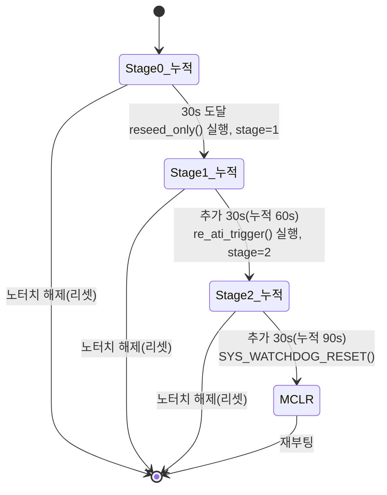

# B5 SW 타임아웃 에스컬레이션 — proc_stuck_timeout 동작분석

**TL;DR**: 전도성 물체 stuck 시 `proc_stuck_timeout()`이 노말 전용으로 터치 지속을 누적해 30초마다 단계 상승한다 — 0~30s 누적 후 1단계 `reseed_only()`(순수 RESEED bit3), 30~60s 후 2단계 `re_ati_trigger()`(Re-ATI bit2, 노터치 게이트 우회), 60~90s 후 3단계 `SYS_WATCHDOG_RESET()`(MCLR 재부팅). 카운트는 `ci_timer_get_tick()` ms 차분(=TOUCH 진입 tick 기준), 단계 실행 시 기준 tick을 즉시 갱신해 다음 30초 재카운트. TOUCH 외 상태(노터치·read 글리치·RESET) 시 즉시 `s_stage=0` 리셋. 폴링은 200ms(설계 100ms 가정과 불일치하나 ms 절대시간 기반이라 30초 임계 자체는 무관). 절전 미적용(ULP는 별경로 2.2초 리셋 선발동) [확정]. Max Counts 포화는 직접 감지 없이 stuck 지속→3단계 MCLR로 간접 회복 [추정].

---

## 1. 분석 대상 코드

| 항목 | 위치 | 근거 |
|---|---|---|
| `proc_stuck_timeout()` 정의 | `tdc_touch.c:251~305` | [tdc_touch.c:252] |
| 호출 지점(노말 폴링) | `tdc_touch.c:485~487` | [tdc_touch.c:486] |
| 빌드가드 | `FULL_ATI && (STUCK_TIMEOUT_MS>0)` | [tdc_touch.c:251], [tdc_touch_config.h:701] |
| 임계 상수 | `TDC_TOUCH_STUCK_TIMEOUT_MS = 30000` | [tdc_touch_config.h:702] |
| 폴링 간격 | `TDC_TOUCH_POLL_INTERVAL = 200ms` | [tdc_touch.h:25] |
| 단계 API: 1단계 | `tdc_drv_iqs323_reseed_only()` (bit3 순수) | [tdc_drv_iqs323.c:980~991] |
| 단계 API: 2단계 | `tdc_drv_iqs323_re_ati_trigger()` (bit2) | [tdc_drv_iqs323.c:993~997] |
| 단계 API: 3단계 | `SYS_WATCHDOG_RESET()` (MCLR) | [tdc_touch.c:300] |
| tick 소스 | `ci_timer_get_tick()` = ms 단위 int | [OTE_1_5gen_timer.h:49] |

---

## 2. 카운트·전이 메커니즘 [확정]

### 2.1 함수 구조 (상태기계)

`proc_stuck_timeout(state_now)`는 매 200ms 폴링 tick마다 1회 호출되며([tdc_touch.c:486], 폴링 게이트 `TDC_TOUCH_POLL_INTERVAL` 통과 시), 3개 `static` 상태로 동작한다([tdc_touch.c:254~256]):

| 변수 | 역할 | 초기값 |
|---|---|---|
| `s_stuck_tick0` | 현 단계 카운트 시작 tick(ms) | 0 |
| `s_prev` | 직전 호출의 state(전이 검출) | `RESET` |
| `s_stage` | 현재 에스컬레이션 단계 0/1/2 | 0 |

### 2.2 카운트 로직 (tick 차분, ms 절대시간)

- **TOUCH 진입 검출**: `s_prev != TOUCH && state_now == TOUCH`이면 `s_stuck_tick0 = ci_timer_get_tick()`, `s_stage=0`으로 카운트 기점 설정([tdc_touch.c:266~270]). 즉 첫 TOUCH 진입 tick이 0초 기준.
- **임계 비교**: `30000 <= (ci_timer_get_tick() - s_stuck_tick0)`이면 단계 액션 수행([tdc_touch.c:273]). **터치 지속 30초**(누적 경과 ms) 도달 판정.
- **재카운트**: 단계 액션 직전 `s_stuck_tick0 = ci_timer_get_tick()`으로 기준 tick을 **즉시 현재값으로 갱신**([tdc_touch.c:275]) → 다음 30초가 새로 카운트 시작.

> [!IMPORTANT]
> 카운트는 **폴링 횟수가 아니라 `ci_timer_get_tick()`의 ms 절대시간 차분**이다([tdc_touch.c:273]). 따라서 설계 99 문서가 가정한 "100ms 폴링" vs 실제 `TDC_TOUCH_POLL_INTERVAL=200ms`([tdc_touch.h:25]) 불일치는 **30초 임계 자체에 영향 없다** — 200ms 폴링이라도 30000ms 경과는 동일하게 검출된다. 폴링 간격은 단지 **판정 해상도**(±200ms 지터)일 뿐이다 [확정].

### 2.3 단계 전이 조건 [확정]

`switch(s_stage)` 분기([tdc_touch.c:277~302]). 30초 임계 도달 시점에만 1회 실행, 실행 후 `s_stage`를 다음 값으로 올린다:

- `case 0` → `reseed_only()` 호출, `s_stage=1` ([tdc_touch.c:279~283])
- `case 1` → `re_ati_trigger()` 호출, `s_stage=2` ([tdc_touch.c:285~290])
- `default`(stage≥2) → 20ms RTT 로그 드레인 busy-wait 후 `SYS_WATCHDOG_RESET()` ([tdc_touch.c:292~301]). 재부팅이라 복귀 없음.

### 2.4 해제 시 리셋 [확정]

`state_now != TOUCH`(노터치·RESET·강제 NOT_TOUCH)이면 함수 초입에서 `s_stage=0`, `s_prev=state_now` 설정 후 **즉시 return**([tdc_touch.c:258~263]). 단계 진행이 완전 초기화된다.

> [!NOTE]
> **read 실패와의 상호작용** [확정]: read 연속 실패가 `TDC_TOUCH_READ_FAIL_HOLD_CNT`(10회) 이하인 동안엔 `tdc_touch_process()`가 `return false`로 **폴링 본문 자체를 건너뛰어**([tdc_touch.c:443] hold), `proc_stuck_timeout`이 **호출조차 안 된다** → 카운트·단계 보존(동결). 10회 초과 시 `curr_state=NOT_TOUCH` 강제([tdc_touch.c:451])되어 `proc_stuck_timeout(NOT_TOUCH)`로 진입 → **단계 리셋**. 즉 통신 글리치 2초(10×200ms)까지는 stuck 카운트 유지, 그 이상이면 리셋. 진짜 stuck(전도성 물체)은 read가 정상이므로 영향 없음.

---

## 3. stuck 시나리오 시간축 동작 (전도성 물체) [확정]

손가락/전도성 물체가 CRX0에 계속 닿아 `read_status_full`이 매 폴링 `pressed=true`(`ch0_touch==IN_TOUCH`)를 반환 → `curr_state=TOUCH` 지속 가정.

| 구간 | 누적 경과 | s_stage(진입 시) | 30s 도달 시 액션 | s_stage(이후) | 효과 |
|---|---|---|---|---|---|
| 0~30s | 0→30000ms | 0 | `reseed_only()` (RESEED bit3) | 1 | LTA를 현재 counts로 재동기. stuck이 baseline이 되면 touch 해제될 수 있음 |
| 30~60s | 0→30000ms (재카운트) | 1 | `re_ati_trigger()` (Re-ATI bit2) | 2 | 게인 재캘리(Target 재정규화). RESEED로 안 풀린 drift형 stuck 흡수 시도 |
| 60~90s | 0→30000ms (재카운트) | 2 | `SYS_WATCHDOG_RESET()` (MCLR) | (재부팅) | 칩 완전 재부팅 → 모든 stuck·오염 LTA 소거 |

- **1단계 (0~30s 경과 후, t≈30s)**: `reseed_only()`([tdc_touch.c:281])는 System Control bit3(0x08)만 write([tdc_drv_iqs323.c:985])해 LTA를 현재 raw counts로 재설정. **절전 감도·Prox 재적용 없음**([tdc_drv_iqs323.c:982~984] 주석) — 노말 감도 오염 차단(신규회귀 2 대응). RESEED 후 LTA가 stuck된 counts를 baseline으로 삼으면 (LTA−Counts) 차이가 0에 수렴해 터치 판정이 해제될 수 있음 [추정].
- **2단계 (30~60s 경과 후, t≈60s)**: `re_ati_trigger()`([tdc_touch.c:288])는 System Control bit2 write([tdc_drv_iqs323.c:996]→`re_ati_trigger()` static). **노터치 게이트(`proc_re_ati_gate`)를 우회**한 의도적 강제 Re-ATI([tdc_touch.c:286] 주석). RESEED만으로 못 푼 게인 drift형 stuck을 재캘리로 흡수 시도.
- **3단계 (60~90s 경과 후, t≈90s)**: stage≥2에서 30s 추가 도달 시 20ms RTT 드레인([tdc_touch.c:295~298]) 후 `SYS_WATCHDOG_RESET()`([tdc_touch.c:300]). MCLR 재부팅으로 conversion 정지·상한 포화형 stuck까지 회복.

> [!CAUTION]
> **stage2 Re-ATI의 터치 중 발행 = 의도적 위험 행위** [확정]. `proc_re_ati_gate`의 급소 결론은 "터치 중 Re-ATI 보류"(터치를 노터치로 학습)이나, `proc_stuck_timeout` stage2는 **그 게이트를 일부러 우회**해 TOUCH 상태에서 Re-ATI를 발행한다([tdc_touch.c:286~288]). 정상 터치라면 60초 연속 터치는 비현실적이므로, 이 경로 도달 = 이미 비정상(stuck) 전제 → 노터치 재학습이 오히려 복구. 단 **정상 사용자가 60초 이상 의도적 롱터치**하는 엣지 케이스에선 터치가 강제 해제되는 부작용 [추정·실측 게이트].

> [!NOTE]
> **롱터치(2.4초)와의 선후 관계** [확정]: `TDC_TOUCH_LONG_TOUCH_MS=2400ms`([tdc_touch.h:26])라 정상 롱터치 이벤트는 stuck 30초보다 **훨씬 먼저** 발동([tdc_touch.c:489])해 `func_normal`이 `true`를 받아 절전 진입을 시도한다. 따라서 **노말에서 30초까지 TOUCH가 지속되려면 롱터치 후 절전 전환이 막혀야** 한다(예: QCC 미연결로 절전 진입 실패, 또는 절전 후 즉시 노말 복귀 반복). stuck 30초 경로의 실제 도달 조건은 [실측 게이트] — 정상 흐름에선 롱터치→절전이 선점.

---

## 4. 절전 미적용 경계 (노말 전용) [확정]

> [!IMPORTANT]
> `proc_stuck_timeout`은 **`tdc_touch_process()` 내부에서만** 호출된다([tdc_touch.c:486]). 절전 루프 `func_sleep`의 ULP 경로([main.c:981~1018])는 `tdc_touch_process()`를 **호출하지 않고** `tdc_touch_get_state()`를 직접 샘플링([main.c:993])하므로, `proc_stuck_timeout`은 절전에서 **실행 경로가 없다** [확정].

- **노말 호출 경로**: `func_normal` 메인루프([main.c:460·463]) → `tdc_touch_process()` → 200ms 폴링 게이트([tdc_touch.c:436]) → `proc_stuck_timeout(curr_state)`([tdc_touch.c:486]).
- **절전 별경로**: ULP 루프는 자체 `touch_cnt >= ULP_LONG_TOUCH_COUNT`([main.c:1011]) 검사로 stuck을 처리. `ULP_LONG_TOUCH_MS=2200ms`, `ULP_WAKE_INTERVAL_MS=200ms` → `ULP_LONG_TOUCH_COUNT=11`회([main.c:809~812]). 즉 **절전은 2.2초 연속 TOUCH면 곧장 `SYS_WATCHDOG_RESET()`**([main.c:1015]).
- **의미 충돌**(설계 99 §6 게이트 13) [확정]: 절전의 2.2초 리셋이 노말의 30초 3단계보다 **압도적으로 빠르게 선발동**한다. 절전에서 stuck이 생기면 30초 에스컬레이션을 거치지 않고 2.2초 만에 MCLR. 따라서 **절전 SW 30초 타임아웃의 실효 범위는 0**(코드 경로 부재 + ULP 2.2초 선점). 본 구현은 이를 "은수님 결정: 절전 ULP는 기존 2.2초 리셋 유지"로 명시 반영([tdc_touch.c:456], [tdc_touch_config.h:699~700]).

---

## 5. Max Counts 포화 간접 처리 [추정]

- **직접 감지 부재** [확정]: 본 diff에 Max Counts(상한 포화) 레지스터를 폴링하거나 임계 비교하는 코드는 **없다**. 설계 99 §4 검토_7이 명시한 "포화 감지 stub"은 이 구현 범위에 미포함(P6 게이트 정리로 이연).
- **간접 회복 경로** [추정]: conversion 정지·상한 포화형 stuck은 LTA drift형이 아니라 RESEED·Re-ATI로 못 푼다(설계 99 §4 검토_7). 이 경우 stuck TOUCH가 90초까지 지속 → `proc_stuck_timeout` stage2 다음 30초에서 **3단계 MCLR**([tdc_touch.c:300])이 발동해 conversion 엔진을 완전 재시작함으로써 **간접 회복**한다. 즉 포화 전용 빠른 감지는 없으나, 30초 3단계의 **마지막 안전망(MCLR)이 포화도 흡수**하는 구조 [추정].
- **한계** [실측 게이트]: 포화형 stuck에서 1·2단계(RESEED·Re-ATI)가 무효라면 0~60초 동안 터치가 오발 지속되다가 90초에야 회복 → 사용자 체감 응답 지연 가능. 포화 전용 감지 stub 부재의 실효 영향은 실보드 확정 필요.

---

## 6. 핵심 결론·정합 노트

1. **타이밍** [확정]: 30초×3단계 = stuck 시작 후 **t≈30s(RESEED)→t≈60s(Re-ATI)→t≈90s(MCLR)**. 각 단계 실행 시 `s_stuck_tick0` 즉시 갱신([tdc_touch.c:275])으로 정확히 30초씩 재카운트. ms 절대시간 차분이라 200ms 폴링 지터(±200ms) 외 누적 오차 없음.
2. **전이/해제** [확정]: `s_stage` 0→1→2→MCLR 단조 증가. TOUCH 외 상태 진입 시 즉시 `s_stage=0` 리셋([tdc_touch.c:258~263]). read 글리치는 hold(10회 이하)→카운트 동결, 초과→NOT_TOUCH 강제→리셋.
3. **절전 경계** [확정]: 노말 전용. ULP는 별경로 2.2초 리셋 선점으로 30초 경로 실효 0. 의미 충돌은 설계 의도대로 명시 격리.
4. **Max Counts** [추정]: 직접 감지 없음. 3단계 MCLR이 포화형 stuck의 유일 회복 경로로 간접 작동.

### 정합 불일치·불확실

- **[불일치·경미]** 설계 99 §3.3·다이어그램은 폴링 "100ms" 가정이나 실제 `TDC_TOUCH_POLL_INTERVAL=200ms`([tdc_touch.h:25]). 30초 임계는 ms 절대시간이라 **무영향**, 단계 판정 해상도만 ±200ms. 문서 정합상 폴링 200ms 표기로 정정 권고.
- **[불확실·실측 게이트]** stuck 30초 경로 도달 가능성: 정상 롱터치(2.4초)→절전 전환이 선점하므로, 30초까지 노말 TOUCH 지속은 절전 진입 실패 등 비정상 전제가 필요. 실제 도달 빈도 [실측 게이트].
- **[불확실·실측 게이트]** stage2 Re-ATI의 정상 60초+ 롱터치 강제 해제 부작용, 1단계 RESEED가 stuck을 baseline 학습해 자가 해제하는 효력은 실보드 확정 필요.
- **[추정]** Max Counts 포화 전용 stub 부재 → 0~60초 오발 지속 후 90초 MCLR 회복까지의 체감 지연.
