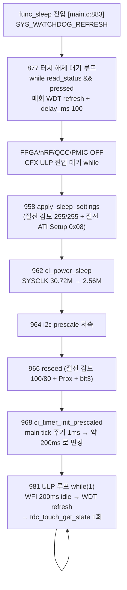

# B6 절전 경계·블로킹·동시성

**TL;DR**: 신규 노말 로직(proc_re_ati_gate·proc_stuck_timeout)은 절전 경로에 **완전 미관여** — func_sleep ULP 루프는 `tdc_touch_get_state()`만 호출하고 `tdc_touch_process()`를 호출하지 않기 때문[확정]. 블로킹 위험의 본체인 `wait_re_ati_done`(최악 약 1초 busy·내부 WDT refresh 없음)은 **부팅 경로 전용**이라 절전 진입 메인루프와 무관[확정]. 절전 진입 콜스택(877 해제대기→958 apply_sleep→966 reseed→967 ULP)은 전부 미변경 또는 Full ATI 무영향이며 WDT refresh가 촘촘하다. 공통 경로 `tdc_touch_get_state` 교체(read_status→read_status_full)는 절전에서도 캐시(`s_last_ati_*`)를 갱신하나 그 캐시 소비자(게이트)가 절전에 없어 무해[확정]. 0xEEEE·read 실패는 양 경로 모두 false 반환으로 안전 처리. 잔여 미세 위험: 절전 30초 SW 타임아웃과 ULP 롱터치 2.2초 리셋의 의미 충돌(설계 13번)·부팅 Re-ATI busy-wait WDT 마진은 [실측 게이트].

---

## 1. 절전 진입 콜스택 (func_sleep) — 변경/미변경 경계

`func_sleep`은 `main.c:883`부터 시작한다. Full ATI 구현에서 **절전 경로는 한 줄도 직접 수정되지 않았다**(diff 변경분은 전부 노말 `func_normal` 게이트와 드라이버 내부). 절전 콜스택의 각 단계와 Full ATI 영향은 다음과 같다.

### 1.1 단계별 Full ATI 영향 [확정]

| 단계 | 위치 | Full ATI 변경 | 영향 |
|---|---|---|---|
| 터치 해제 대기 | `main.c:891` | 미변경. `read_status`(구 API) 그대로 사용 | 무영향. `read_status_full` 미사용 — 절전 초입은 ATI 캐시 갱신 안 함 |
| apply_sleep_settings | `tdc_drv_iqs323.c:1005` | `#if !FULL_ATI`로 절전 MULT/COMP 재쓰기 **스킵**(`:1032~1063`). 절전 ATI Setup 0x08(Disabled)는 유지 | Full 시 절전은 노말 Full 자동게인을 0x08로 "동결". 저속 클럭 Re-ATI 실패 회피. busy-wait/폴링 없음 |
| reseed | `tdc_drv_iqs323.c:950` | **미변경**. 절전 감도(100/80)·Prox·RESEED bit3 동반 | 노말 신규 `reseed_only`(`:970`)와 격리됨 — 절전 감도 오염 없음 |
| ULP 루프 | `main.c:981` | **미변경**. `tdc_touch_get_state` 1회 + 롱터치 2.2초(ULP_LONG_TOUCH_COUNT) 리셋 | 신규 노말 로직 미진입(§2) |

> [!NOTE]
> 절전 ATI Setup 0x08(Disabled)는 보드 변종 매크로 `SLEEP_ATI_SETUP_LSB=0x08`([`tdc_drv_iqs323.c:658·672·686`])에서 온다. Full ATI 시 노말은 0x0C(Full)지만 절전은 0x08(Disabled) 유지 — **노말·절전 ATI 모드가 다르다**. 이 비대칭은 의도적이며(저속 클럭 보호) 본 구현에서 일관되게 처리된다.

---

## 2. 신규 노말 로직의 절전 미관여 [확정] — 핵심

> [!IMPORTANT]
> **proc_re_ati_gate / proc_stuck_timeout 은 절전 경로에서 절대 실행되지 않는다.** 근거는 호출 구조다.
>
> - 두 함수는 `tdc_touch_process()` **내부에서만** 호출된다([`tdc_touch.c:573·577`]). diff 그대로 `process()` 함수 본문 안의 READY 폴링 블록에 위치.
> - `tdc_touch_process()` 호출처는 `main.c:460·463`(둘 다 `func_normal`)뿐이다(grep 전수: 호출 2곳 모두 노말).
> - `func_sleep`의 ULP 루프(`main.c:993`)는 `tdc_touch_get_state()`만 호출하며 `tdc_touch_process()`를 호출하지 않는다(func_sleep 883~1039 grep: `tdc_touch_process` 0건).

따라서 절전 진입 중·절전 ULP 루프 중에 **신규 Re-ATI 게이트도, SW 타임아웃 30초 에스컬레이션도 발동하지 않는다**. 절전 stuck 처리는 기존 ULP 롱터치 2.2초 리셋(`main.c:1011` `touch_cnt >= ULP_LONG_TOUCH_COUNT`)이 그대로 담당한다 — 은수님 결정(설계 §3.3 "절전 ULP는 기존 2.2초 리셋 유지")과 코드가 일치[확정].

빌드가드도 정합한다: `proc_stuck_timeout`은 `#if (FULL_ATI && STUCK_TIMEOUT_MS>0)`([`tdc_touch.c`])로 정의되지만, 정의 여부와 무관하게 호출 자체가 노말 `process()`에만 있어 절전 무관.

---

## 3. 블로킹 위험 분석

### 3.1 wait_re_ati_done — 부팅 전용, 절전 무관 [확정]

`wait_re_ati_done`([`tdc_drv_iqs323.c:581~623`])이 본 구현의 최대 블로킹 후보다. 타이밍:

- 최대 10회 iteration. 각 iteration에서 read 실패·`0xEEEE`·ATI 미완료(ati_event 미세트) 시 `Sys_Delay(DEFAULT_DELAY_MS × 100)` 실행([`:592·599·618`]).
- `Sys_Delay(DEFAULT_DELAY_MS × 100)` = `(SystemCoreClock/1000) × 100` 사이클 busy = **약 100ms 절대 시간**(클럭 비례 busy-loop)[확정].
- 최악(매번 미완료) = 10 × 100ms ≈ **1초 순수 busy 블로킹**. 메인루프 정지[확정].
- **루프 내부에 WDT refresh 없음**[확정] — `wait_re_ati_done` 본문에 `SYS_WATCHDOG_REFRESH` 0건.

이 함수 호출처는 **부팅 경로 1곳뿐**이다: `apply_settings()`의 부팅 Re-ATI 블록([`tdc_drv_iqs323.c:1265`]). 콜스택은 `func_normal 메인루프 → tdc_touch_process → (READY 전 try_finish_init) → apply_settings → wait_re_ati_done`이며, **부팅 1회성**이다. **func_sleep 경로에는 wait_re_ati_done 호출이 없다**(func_sleep grep 0건). 따라서 절전 진입 메인루프 블로킹과 무관[확정].

> [!CAUTION]
> **WDT 안전성 [추정]**: 부팅 Re-ATI 블록 직전(`tdc_drv_iqs323.c:1253`)과 직후(반환 후 `:1257` 부근)에 `SYS_WATCHDOG_REFRESH()`가 있다. busy-wait 50틱(약 50ms, §3.2) + wait_re_ati_done 최악 1초 = 약 1.05초 < WDT 3.28s. 마진 약 2.2s로 안전[추정]. 단 부팅 시 이 블록 앞뒤로 다른 긴 작업(auto-ATI 대기 등)이 누적되면 마진이 좁아질 수 있어 [실측 게이트]로 RTT 타임스탬프 확인 권고.

### 3.2 부팅 Re-ATI busy-wait 50틱 [확정]

부팅 Re-ATI는 `re_ati_trigger()` 직후 `while (50 > (ci_timer_get_tick() - tick_old)) {}`([`tdc_drv_iqs323.c:1261~1264`])로 약 50ms 대기 후 `wait_re_ati_done()`을 호출한다.

- `ci_timer_get_tick()`은 `g_ci_timer_main_tick` 반환([`ci_timer.c:143`]). 부팅 시점은 `ci_timer_init(OTE_1_5_GEN_TIMER_TICK_1MS_PM_NORMAL)`([`initialize.c:280`])로 **1ms 주기**라 50틱 ≈ 50ms[확정].
- 이 busy-wait도 내부 WDT refresh 없으나 50ms라 단독으로는 무해.
- **주의 [추정]**: 만약 동일 패턴(tick 차분 busy-wait)을 절전 진입 후에 쓰면, ULP 프리스케일(`ci_timer_init_prescaled`, `main.c:968`)로 tick 주기가 약 200ms가 되어 50틱 = 10초로 폭증한다. 그러나 부팅 Re-ATI는 절전 진입 전에만 실행되므로 본 구현에선 이 함정이 발생하지 않는다[확정]. 향후 절전 경로에 tick-차분 대기를 추가하면 이 주기 변화를 반드시 반영해야 함.

### 3.3 절전 초입 터치 해제 대기 (877) [확정]

`main.c:891` `while (read_status(...) && pressed)` 루프는 손가락이 떨어질 때까지 대기한다.

- 매 iteration `SYS_WATCHDOG_REFRESH()` + `delay_ms(100)`([`main.c:894~895`]) → **WDT 안전**[확정].
- read **실패** 시 `read_status`가 false → 루프 탈출(손 뗌과 동일 취급) → 통신 끊김에도 무한 대기 없음[확정].
- read **성공 + pressed 지속** 시에만 머문다. 손가락을 계속 대고 있으면 절전 진입이 지연되나 WDT는 매회 refresh되어 리셋 없음. 사용자가 손을 떼면 즉시 진행. 이는 의도된 설계(절전 baseline을 노터치 환경에서 RESEED).

---

## 4. 동시성·글리치 분석

### 4.1 0xEEEE (I2C invalid/통신 글리치) [확정]

| 경로 | 0xEEEE 처리 | 위치 |
|---|---|---|
| `read_status_full` (노말·절전 공통) | `lsb==0xEE && msb==0xEE` → `return false`(read 실패 취급) | `tdc_drv_iqs323.c:264~268`(diff) |
| `wait_re_ati_done` (부팅) | 0xEEEE → retry(`Sys_Delay` 후 continue) | `:596~601` |
| 절전 초입 `read_status` (구 API) | 0xEEEE 처리는 구 read_status 내부 책임(미변경) | `main.c:891` |

`read_status_full`의 0xEEEE → false는 상위에서 다음과 같이 갈린다:
- **노말**(`tdc_touch_process`): `got_state=false` → read 실패 hold 카운터(`s_read_fail_cnt`) N회까지 보류, 초과 시 NOT_TOUCH 강제([`tdc_touch.c:536~546`]). **그리고 get_state 내부에서 ATI 캐시를 false로 무효화**([`tdc_touch.c:512~513`]) — 검토_2 급소(stale 캐시로 인한 Re-ATI 오발) 차단. 절전 무관(노말만).
- **절전**(`tdc_touch_get_state` 직접 호출): false 반환 → ULP 루프 else 분기([`main.c:1029~1036`]) → `touch_cnt=0`(롱터치 카운터 리셋) + LED. **글리치 1회가 절전 롱터치 카운트를 오발하지 않음**[확정]. 캐시 무효화도 일어나나 절전엔 소비자가 없어 무의미·무해.

### 4.2 절전 진입 중 신규 게이트 미관여 [확정]

§2에서 확정. 절전 진입 시퀀스(877→958→966→967) 어디에도 `proc_re_ati_gate`·`re_ati_trigger`(노말 게이트 경유) 호출이 없다. 절전에서 IC가 자율 Re-ATI를 할 수는 있으나(IC 자동 경로_1, LTA 동결로 안전), **SW가 강제 Re-ATI를 발행하는 신규 경로_2는 절전에 진입하지 않는다**[확정]. 따라서 "절전 중 터치를 노터치로 학습"하는 급소는 절전 경로엔 구조적으로 부재.

### 4.3 race — 같은 tick 터치/에러, 캐시 갱신 순서 [추정/확정]

- **CM3는 단일 스레드 + 협조적 폴링**이다. tdc_touch_get_state / process는 ISR이 아니라 메인루프에서 순차 실행되며, tick 증가만 ISR(`CFX_0_IRQHandler` → `ci_timer_increase_tick`, [`driver_timmer.c:13`])이 비동기로 한다. 터치 판정·게이트·캐시 갱신은 전부 메인 컨텍스트라 **상호 선점(preemption)이 없다**[확정].
- 한 tick 안에서 "터치이면서 ati_error" 같은 동시 상태는 `read_status_full` 단일 read(System Status 0x10 1회)로 원자 스냅샷을 뜨므로([`tdc_drv_iqs323.c:259`]), pressed·ati_error·ati_active가 **같은 레지스터 읽기에서 일관되게** 추출된다 — 필드 간 찢김(torn read) 없음[확정].
- 캐시(`s_last_ati_error/active`)는 get_state에서 갱신 → 같은 process iteration에서 proc_re_ati_gate가 소비. 갱신과 소비가 동일 메인 컨텍스트 순차 실행이라 **소비가 항상 최신 캐시를 본다**[확정]. ISR이 캐시를 건드리지 않으므로 race 없음[확정].
- 유일하게 비동기인 tick 값은 busy-wait 비교(`ci_timer_get_tick() - tick_old`)에서 단조 증가만 읽어 부호 문제 없음. `int`라 약 24.8일(1ms tick) 후 오버플로우 가능하나 부팅 busy-wait(50틱)·절전 진입엔 실질 영향 없음[추정].

### 4.4 ATI 캐시 절전 누수 검토 [확정]

`s_last_ati_error/active`는 파일 static([`tdc_touch.c:43~44`])이라 노말↔절전 전환 사이 값이 잔류한다. 그러나:
- 절전 진입 직전 노말 마지막 get_state가 캐시를 갱신했더라도, **절전에는 캐시 소비자(proc_re_ati_gate)가 없다** → 절전 중 무해.
- 절전 복귀(절전→재부팅: ULP 롱터치/뚜껑/충전 등은 전부 `SYS_WATCHDOG_RESET`로 칩 리셋, [`main.c:1015·870`])는 static 초기화로 캐시를 false 재설정 → 노말 복귀 시 stale 캐시 없음[확정].

---

## 5. key_findings 요약 (콜스택·타이밍·이벤트·상태·정합)

1. **[확정] 신규 노말 로직 절전 미관여**: proc_re_ati_gate·proc_stuck_timeout은 tdc_touch_process 내부에만 있고(`tdc_touch.c:573·577`), process 호출은 func_normal 2곳뿐(`main.c:460·463`). func_sleep ULP 루프는 tdc_touch_get_state만 호출(`main.c:993`).
2. **[확정] wait_re_ati_done 블로킹은 부팅 전용**: 호출처는 apply_settings 부팅 Re-ATI(`tdc_drv_iqs323.c:1265`) 1곳. 최악 약 1초 busy(10×100ms Sys_Delay), 루프 내부 WDT refresh 없음. func_sleep 경로엔 호출 0건 → 절전 메인루프 무관.
3. **[추정] 부팅 Re-ATI WDT 마진**: busy-wait 50틱(약 50ms @1ms tick) + wait 최악 1초 ≈ 1.05초 < WDT 3.28s. 앞뒤 SYS_WATCHDOG_REFRESH(`:1253`·반환 후) 존재. 마진 약 2.2s — 부팅 누적 작업 시 RTT 타임스탬프 [실측 게이트].
4. **[확정] 절전 초입 877 대기**: 매회 WDT refresh + delay_ms 100(`main.c:894~895`). read 실패 시 즉시 탈출. 무한 대기·WDT 리셋 위험 없음.
5. **[확정] apply_sleep_settings·reseed 미변경/무영향**: 절전 MULT/COMP 재쓰기 #if !FULL_ATI 스킵, 절전 ATI Setup 0x08(Disabled) 유지. busy-wait 없음. reseed는 절전 감도 동반(노말 reseed_only와 격리).
6. **[확정] 0xEEEE·read 실패 안전**: read_status_full에서 false 반환. 절전 ULP는 touch_cnt 리셋(`main.c:1035`)로 1회 글리치가 롱터치 오발 안 함. 캐시 false 무효화는 절전엔 소비자 없어 무해.
7. **[확정] race 부재**: CM3 단일 스레드 협조적 폴링. read_status_full 단일 read로 pressed/ati_error/ati_active 원자 스냅샷, torn read 없음. 캐시 갱신·소비 동일 메인 컨텍스트 순차. ISR은 tick만 비동기 증가.
8. **[실측 게이트/설계] 잔여 위험**: ① 절전 SW 30초 타임아웃 미구현(코드상 절전엔 stuck 처리 없음, ULP 2.2초 리셋만) — 설계 13번 의미 충돌, 요구사항 재확인. ② 향후 절전 경로에 tick-차분 busy-wait 추가 시 ULP 프리스케일(약 200ms tick)로 시간 폭증 함정 주의.
