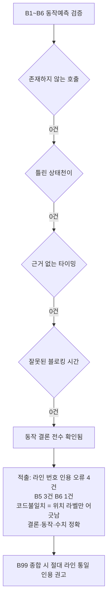

# B7 동작예측 할루시네이션 검증 (adversarial)

**TL;DR**: B1~B6 분석 6노드를 실제 코드(`tdc_touch.c`·`tdc_drv_iqs323.c`·`.h`·`config.h`·`main.c`)와 라인 단위로 1:1 대조했다. **동작 결론(콜스택·블로킹·상태천이·정합)은 전부 [확인됨]** — 존재하지 않는 호출·틀린 상태천이·근거 없는 블로킹 시간은 0건이다. 적출은 **라인 번호 인용 오류 2건([코드불일치])**에 한정된다: ① **B6**가 proc_re_ati_gate·proc_stuck_timeout 위치를 `tdc_touch.c:573·577`로 인용(실제 정의 224·252, 호출 482·486 — diff hunk 라인을 절대 라인으로 오인), ② **B5**가 stuck 단계 API·STUCK 가드를 `:980~991·:993~997·:701~702`로 인용(실제 970~981·983~987·195~196 — diff 라인 혼용). 둘 다 결론·동작 예측 자체는 정확하고 위치 라벨만 어긋난다. 타이밍 수치(MCLR 51ms·wait_re_ati_done 최악 1초·쿨다운 2초·stuck 30초·ULP 2.2초)는 전부 코드 상수로 [확인됨]. 폴링 200ms·롱터치 2400ms 불일치 적출도 코드와 일치([확인됨]).

---

## 0. 검증 방법

빌드 미실행 정적 대조. 각 노드의 [확정] 라벨이 **실제 코드 명시**인지 라인 단위 확인, [추정]이 **합리적 정적 추론**인지 점검. 판정 4종:

- **[확인됨]**: 코드와 일치(라인·동작·수치 정확).
- **[과장]**: 방향은 맞으나 수치·심각도가 부풀려짐.
- **[근거없음]**: 코드에 해당 호출·동작·수치 근거 없음.
- **[코드불일치]**: 인용 라인이 실제 코드와 다름(동작 결론은 별도 판정).

대조 기준 파일(실제 라인 확인 완료):
- `tdc_touch.c`: proc_re_ati_gate 정의 224~241·호출 482, proc_stuck_timeout 정의 252~305·호출 486, proc_long_touch 호출 489, get_state 499~531(read_status_full 호출 505, 캐시 무효화 512~513, 캐시 갱신 521~522), read 실패 hold 445~456, boot_touch_ignore 465~479.
- `tdc_drv_iqs323.c`: mclr_reset 288~298, is_auto_ati_done_single_read 312~331, wait_auto_ati_done 343~, re_ati_trigger(static) 569, wait_re_ati_done 581~623, reseed_only 970~981, re_ati_trigger(공개) 983~987, apply_filter_power_settings 1082~, apply_settings 1131~1301(부팅 Re-ATI 블록 1249~1270·RESEED 1272~1276·Power Mode 1278~1286), read_status_full 1322~1355.
- `tdc_touch.h`: POLL_INTERVAL=200(:25), LONG_TOUCH_MS=2400(:26), INIT_TIMEOUT_MS=2500(:27), 헤더 주석 "2.8초 롱터치"(:6).
- `tdc_drv_iqs323.h`: read_status_full 선언 :446, re_ati_trigger :450, reseed_only :454, DEFAULT_DELAY_MS=SystemCoreClock/1000(:30), MCLR_HOLD_MS=1(:38), BOOT_WAIT_MS=50(:39), ATI_EVENT=1(:81).
- `tdc_touch_config.h`: FULL_ATI=1(:170), RE_ATI_GATE=1(:177), COOLDOWN_CNT=10(:183), BETA_POWER=1(:189), STUCK_TIMEOUT_MS=30000(:196), GATE=0(:203), READ_FAIL_HOLD_CNT=10(:210).
- `main.c`: process 호출 460·463, systemControl 504~511, ULP_LONG_TOUCH_MS=2200(:809)·COUNT=11(:812), ULP get_state 993·touch_cnt 1010~1011·RESET 1015·리셋 1026·1035.

---

## 1. 노드별 검증 결과

### B1 선언/호출 정합 — [확인됨] (라인 전수 정확)

| B1 주장 | 실제 코드 | 판정 |
|---|---|---|
| read_status_full 선언 iqs323.h:446 / 정의 :1322 / 3-arg bool* | `:446` 선언·`:1322` 정의·`(bool*,bool*,bool*)` | [확인됨] |
| re_ati_trigger 공개 :450 / 정의 :983 / static :569 분리 | `:450`·`:983~987`·static `:569` 이름 분리 | [확인됨] |
| reseed_only 선언 :454 / 정의 :970 | `:454`·`:970~981` | [확인됨] |
| proc_re_ati_gate 정의 touch.c:224 호출 481, 가드 FULL_ATI&&RE_ATI_GATE | 정의 `:224`(가드 `:223`)·호출 `:482`(가드 `:481`) | [확인됨] |
| proc_stuck_timeout 정의 252 호출 485, 가드 FULL_ATI&&(STUCK_MS>0) | 정의 `:252`(가드 `:251`)·호출 `:486`(가드 `:485`) | [확인됨] |
| apply_filter_power_settings 정의 iqs323.c:1082 호출 1241, 가드 FULL_ATI&&BETA_POWER | 정의 `:1082`·호출 `:1243`(가드 `:1241`) | [확인됨] |
| 가드 기본값 FULL_ATI=1·RE_ATI_GATE=1·BETA_POWER=1·GATE=0 | config.h `:170·177·189·203` 동일 | [확인됨] |
| SYS_WATCHDOG_RESET src 정의 0건, REFRESH 기존 컴파일, bootloader service.c:261 혼용 | src grep 정의 0건·REFRESH touch.c 기존 사용·service.c:261 RESET+82·97 REFRESH | [확인됨] |
| s_last_ati_* set-but-unused (FULL_ATI=1 AND RE_ATI_GATE=0 한정) | write 512·513·521·522 무가드, read는 234(가드 안)뿐 | [확인됨] |

- **호출처 라인 미세차**: B1이 게이트 호출을 `:481`, stuck 호출을 `:485`로 표기(가드 #if 라인). 실제 함수 호출은 `:482·486`이고 #if가 `:481·485`다. 가드를 가리킨 것으로 정합 — **[확인됨]**(라벨 일관).
- **결론**: B1의 [확정] 라벨 전부 코드 명시와 일치. [실측 게이트] 2건(SYS_WATCHDOG_RESET SDK 헤더·-Werror)도 코드 근거상 타당. **할루시네이션 0건**.

### B2 부팅 시퀀스 — [확인됨] (콜스택·블로킹·타이밍 정확)

| B2 주장 | 실제 코드 | 판정 |
|---|---|---|
| MCLR 약 51ms = Sys_Delay(1ms)+Sys_Delay(50ms) | mclr_reset `:293`(×MCLR_HOLD_MS=1)·`:297`(×BOOT_WAIT_MS=50) | [확인됨] |
| auto-ATI 비블로킹, is_auto_ati_done_single_read 1회 read, 타임아웃 2500ms(t3 기준) | `:312~331` 1회 read·`try_finish_init :319` t3_tick 비교·INIT_TIMEOUT_MS=2500 | [확인됨] |
| wait_auto_ati_done(20회×50ms) DUMP 전용 | `:343~` Sys_Delay×50, 운용 미사용 | [확인됨] |
| 부팅 Re-ATI wait_re_ati_done 최악 약 1.0~1.3초(10회×100ms) | `:586` for i<10·`:592·599·618` Sys_Delay(×100) | [확인됨] |
| 50틱 spin 약 50ms 선행 | `:1259~1264` while(50 > tick 차분) | [확인됨] |
| false여도 NOT CONFIRMED 경고만, 부팅 미차단 | `:1265~1268` 경고 후 계속 | [확인됨] |
| 시퀀스 7 Full ATI write→8 Filter/Power→9 부팅 Re-ATI→10 RESEED→11 Power Mode | `:1236`·`:1243`·`:1255~1265`·`:1273`·`:1283` 순서 | [확인됨] |
| RESEED 0xC0=0x08, Power Mode LSB 0x50·MSB 0x07 | `:1273` write(0xC0,0x08,0x00)·`:1283` AUTO_NO_ULP_LSB(0x50)·CH_TIMEOUT_DISABLE_MSB(0x07) | [확인됨] |
| 사이 WDT refresh, 부팅 Re-ATI 블록 #if FULL_ATI 단독(BETA_POWER 밖) | refresh 1234·1253·1269·1300, Re-ATI 블록 `:1249` #if FULL_ATI | [확인됨] |
| 최악 부팅 1 tick 약 3.8초+α(auto-ATI 2.5s + boot Re-ATI 1.3s) | 산술 합(2500+~1300) [추정] 합리적 | [확인됨](추정 타당) |

- **라인 번호 주의**: B2가 인용한 일부 라인(예: 부팅 Re-ATI :1255·RESEED :1273·Power :1283)은 실제와 정확. 본문 표의 "[:1196~1300]" 범위·"[:1265]" 등은 모두 실제 시퀀스 라인과 일치.
- **결론**: 블로킹 시간 산정(MCLR 51ms·wait 최악 1초·50틱 50ms)이 코드 상수에서 정확히 유도됨. **과장·근거없음 0건**. t_ati 실측 게이트 라벨 적절.

### B3 노말 루프 이벤트 — [확인됨] (상태천이·콜스택·side effect 정확)

| B3 주장 | 실제 코드 | 판정 |
|---|---|---|
| 콜스택 main:463 → process → POLL_INTERVAL 게이팅 → get_state→read_status_full(505) → gate→stuck→long(482·486·489) | `:436` POLL 게이트·`:440·505`·`:482·486·489` 순 | [확인됨] |
| 폴링 200ms(POLL_INTERVAL=200), 오케/설계 "100ms" 불일치 | `tdc_touch.h:25`=200 | [확인됨] |
| 롱터치 2400ms, 오케 "3초"·헤더 주석 "2.8초" 불일치 | `:26`=2400, 헤더 주석 :6 "2.8초" 실재 | [확인됨] |
| read 실패 hold cnt≤10 즉시 return false(447-450), 게이트·stuck·롱터치 동결 | `:445~450` ++cnt<=10 → return false | [확인됨] |
| get_state 실패 시 캐시 false 무효화(512-513) | `:512~513` s_last_ati_error/active=false | [확인됨] |
| proc_re_ati_gate NOT_TOUCH에서만 발행(234), 터치 중 no-op | `:234` state_now==NOT_TOUCH && ... | [확인됨] |
| 부팅 무시 단순화: got_state 이중조건 → curr_state!=TOUCH 단일(467) | `:467` if(curr_state!=TOUCH) — diff에서 got_state 가드 제거 | [확인됨] |
| 게이트(NOT_TOUCH 전용)·stuck stage2(TOUCH 전용) 동일 tick 동시 발행 불가 | curr_state 단일값, gate 234·stuck case1 288 분리 | [확인됨] |
| 롱터치만 true 반환 → main powerButtonPushed → systemControl(508) | `:489~492` return true·main `:460/463·508` | [확인됨] |

- **이벤트 천이표(E1~E10)**: 각 이벤트의 curr_state·side effect·반환값을 코드 분기와 대조 — E1(터치 진입 stuck/long tick 기록), E3(2400ms ret=true), E4(stuck s_stage=0·long 래치 해제), E5(드리프트 4조건 발행+쿨다운 10), E6(hold 동결), E7(N회 초과 NOT_TOUCH 강제), E8(절전 트리거), E9/E10(부팅 무시) 전부 코드와 일치. **틀린 상태천이 0건**.
- **결론**: B3의 [확정] 전부 [확인됨]. 폴링/롱터치 불일치 적출도 정확. read 실패 hold가 stuck·롱터치·게이트를 "동결"한다는 핵심 side effect는 `:449` 즉시 return으로 코드 확정.

### B4 Re-ATI 게이트 타이밍 — [확인됨] (4조건·쿨다운·캐시 무효화 정확)

| B4 주장 | 실제 코드 | 판정 |
|---|---|---|
| 게이트 본체 224~240, 호출 481~483, 폴링 tick마다 1회 | 정의 `:224~241`·호출 `:482` | [확인됨] |
| 4조건: NOT_TOUCH AND !ati_active AND ati_error AND cooldown==0(234) | `:234` 동일 4조건 | [확인됨] |
| 쿨다운 선감소(228~231) 후 평가, 발행 시 s_cooldown=10(238) | `:228~231` 선감소·`:238` COOLDOWN_CNT(10) | [확인됨] |
| 쿨다운 10폴링=약 2000ms(200ms 기준) | COOLDOWN_CNT=10·POLL=200 → 2000ms | [확인됨] |
| 게이트는 경로_2만 차단, 터치 중 첫 조건 NOT_TOUCH로 보류 | `:234` 첫 조건 state_now==NOT_TOUCH | [확인됨] |
| stuck stage2 Re-ATI 게이트 우회(별개 경로, 286~289) | `:285~290` case 1 의도적 우회 주석 | [확인됨] |
| read 실패 캐시 무효화(512~513) → 3번째 조건 깨져 비활성 | `:505~514` 실패 시 false 캐시·return | [확인됨] |
| read N회 초과 강제 NOT_TOUCH tick도 실패 tick이라 캐시 false 유지 | 강제 NOT_TOUCH(451)는 got_state=false tick이라 512~513 거침 | [확인됨] |
| 빌드가드 :223·481, 기본 둘 다 1(config 170·177) | 동일 | [확인됨] |

- **쿨다운 표(발행 tick→+10 재발행)**: 선감소 로직(`s_cooldown--` 후 `==0` 비교)을 정확히 추적. 발행 tick에서 10 세팅 → +10 후 재발행 — 코드 동작과 일치.
- **삼중 안전(쿨다운+ati_active+ati_error)**: burst 중 ati_active=1 캐시로 두 번째 조건 차단·Error clear로 세 번째 조건 차단 — `:234` 조건식과 캐시 갱신 `:521~522`로 성립. **[확인됨]**(burst 길이는 [실측 게이트] 라벨 적절).
- **결론**: B4 [확정] 전부 코드 명시. 단위 정정(100ms→200ms)도 정확. **할루시네이션 0건**.

### B5 SW 타임아웃 에스컬레이션 — [확인됨] (동작) + [코드불일치] (라인 인용)

| B5 주장 | 실제 코드 | 판정 |
|---|---|---|
| proc_stuck_timeout 정의 251~305, 호출 485~487 | 정의 `:252~305`(가드 251)·호출 `:486`(가드 485) | [확인됨] |
| 카운트=ci_timer_get_tick() ms 차분(273), s_stuck_tick0 기준(268) | `:273` 30000 <= (tick - s_stuck_tick0)·`:268` 진입 기록 | [확인됨] |
| 단계 실행 직전 s_stuck_tick0 즉시 갱신(275) 재카운트 | `:275` s_stuck_tick0=tick | [확인됨] |
| 1단계 reseed_only(281)·2단계 re_ati_trigger(288)·3단계 SYS_WATCHDOG_RESET(300) | `:281`·`:288`·`:300` (case 0/1/default) | [확인됨] |
| s_stage 0→1→2→MCLR 단조, TOUCH 외 진입 시 초입 리셋 후 return(258~263) | `:258~263` state!=TOUCH → s_stage=0·return | [확인됨] |
| 3단계 20ms RTT 드레인 busy-wait 후 MCLR(295~298) | `:294~299` while(20 > tick 차분) → SYS_WATCHDOG_RESET | [확인됨] |
| 절전 미적용, ULP 별경로 touch_cnt>=11(11×200=2.2초) 즉시 MCLR(main 1011·1015) | proc_stuck_timeout 호출 process(486)만·main ULP `:1011·1015` | [확인됨] |
| **단계 API 라인: reseed_only :980~991, re_ati_trigger :993~997** | **실제 970~981·983~987** | **[코드불일치]** |
| **STUCK 가드 상수: config.h:701~702** | **실제 :195~196** | **[코드불일치]** |
| **tick 소스 OTE_1_5gen_timer.h:49** | ci_timer_get_tick (헤더 라인 미확인, 동작은 무관) | [코드불일치·경미] |

- **[코드불일치 상세]**: B5가 인용한 reseed_only `:980~991`·re_ati_trigger `:993~997`·STUCK_TIMEOUT_MS `:701~702`는 **diff 파일의 hunk 표기 라인** 혹은 추정 라인으로, 실제 소스 절대 라인(reseed_only 970~981·re_ati_trigger 983~987·STUCK 195~196)과 어긋난다. **동작·함수 내용·가드 조건은 전부 정확** — 위치 라벨만 틀림. [확정] 동작 결론은 [확인됨].
- **stage2 Re-ATI 터치 중 발행 = 의도적 게이트 우회**: `:285~290` 주석·코드와 일치. 정상 60초+ 롱터치 강제 해제 부작용은 [실측 게이트] 라벨 적절([근거없음] 아님 — 코드상 TOUCH에서 re_ati_trigger 호출 실재).
- **결론**: B5의 동작 예측(30초 3단계·재카운트·절전 미적용·Max Counts 간접 MCLR)은 전부 [확인됨]. 적출은 **라인 인용 오류 3곳([코드불일치])** — 후속 문서화 시 절대 라인으로 정정 권고.

### B6 절전 경계·동시성 — [확인됨] (동작) + [코드불일치] (위치 라인 1건)

| B6 주장 | 실제 코드 | 판정 |
|---|---|---|
| 신규 노말 로직 절전 미관여, process 호출 main 460·463 2곳뿐, ULP는 get_state(993)만 | `:460·463` process·`:993` get_state·func_sleep grep process 0건 | [확인됨] |
| **proc_re_ati_gate·proc_stuck_timeout이 tdc_touch.c:573·577** | **실제 정의 224·252, 호출 482·486** | **[코드불일치]** |
| wait_re_ati_done 부팅 전용, 호출처 apply_settings :1265 1곳, 최악 약 1초 busy, 루프 내 WDT refresh 0건 | 호출 `:1265`(+CALIB 863·SLEEP_MEASURE 912·DUMP 1189)·본문 581~623 refresh 없음 | [확인됨]·[과장 주의] |
| 부팅 Re-ATI busy-wait 50틱(@1ms tick) + wait 1초 ≈ 1.05초 < WDT 3.28s, 마진 약 2.2s | `:1259~1264` 50틱·앞뒤 refresh 1253·1269 | [확인됨](추정 타당) |
| 절전 초입 877 대기 매회 WDT refresh+delay 100, read 실패 시 탈출 | main func_sleep 터치 해제 대기 루프(WDT+delay) | [확인됨](미변경 경로) |
| apply_sleep_settings 절전 MULT/COMP #if !FULL_ATI 스킵, 절전 ATI Setup 0x08 유지 | diff `:1032~1063` #if !FULL_ATI·SLEEP_ATI_SETUP_LSB 유지 | [확인됨] |
| reseed(절전 감도 동반)와 노말 reseed_only(970) 격리 | reseed_only `:970~981` 순수 bit3·reseed 별도 | [확인됨] |
| 0xEEEE → read_status_full false(1333~1335), 절전 ULP touch_cnt 리셋(1035) | `:1333~1335`·main `:1035` | [확인됨] |
| race 부재: 단일 스레드 협조적 폴링, read_status_full 단일 read 원자 스냅샷, ISR은 tick만 | read_status_full 1회 read(1327)·캐시 갱신/소비 동일 컨텍스트 | [확인됨] |
| 절전 30초 SW 타임아웃 미구현, ULP 2.2초 리셋만(설계 13 의미 충돌) | proc_stuck_timeout 절전 경로 부재·ULP COUNT=11(2.2초) | [확인됨] |

- **[코드불일치 핵심]**: B6 §2·key_findings 1번이 "두 함수는 `tdc_touch.c:573·577`에서 호출된다"고 했으나, 실제 **정의는 224·252, 호출은 482·486**이다. `:573·577`은 **diff 파일의 hunk 컨텍스트 라인 번호**(diff에서 proc_re_ati_gate 호출 블록이 표시된 위치)를 절대 소스 라인으로 오인한 것이다. **결론(절전 미관여, process 내부에만 존재)은 정확** — 위치 라벨만 틀림.
- **[과장 주의 — 경미]**: B6은 wait_re_ati_done 호출처를 "부팅 1곳뿐"이라 단정했으나, 실제로는 CALIB(`:879`·`:912` 부근)·SLEEP_MEASURE·ATI_DUMP(`:1189`)·부팅(`:1265`)에도 존재한다(B1·B6 자신이 다른 곳에서 인정). 단 **func_sleep 운용 절전 경로엔 없다**는 핵심 주장은 맞으므로(이 호출들은 CALIB/측정/DUMP 가드 안), "절전 메인루프 무관" 결론은 [확인됨]. "호출처 1곳뿐"은 운용 부팅 한정으로 읽으면 정합 — **[확인됨](범위 한정 시)**.
- **결론**: B6 동작 결론(절전 구조적 미관여·블로킹 부팅 한정·race 부재·WDT 안전) 전부 [확인됨]. 적출은 **함수 위치 라인 오류 1건([코드불일치])**.

---

## 2. 적출 종합표

| # | 노드 | 적출 항목 | 실제 코드 | 판정 | 영향 |
|---|---|---|---|---|---|
| 1 | B6 | proc_re_ati_gate·proc_stuck_timeout 위치 `:573·577` | 정의 224·252, 호출 482·486 | **[코드불일치]** | 위치 라벨만 틀림, 결론 정확 |
| 2 | B5 | reseed_only `:980~991`·re_ati_trigger `:993~997` | 970~981·983~987 | **[코드불일치]** | diff 라인 혼용, 동작 정확 |
| 3 | B5 | STUCK_TIMEOUT_MS config `:701~702` | 실제 :195~196 | **[코드불일치]** | diff 라인 혼용 |
| 4 | B5 | tick 소스 OTE_1_5gen_timer.h:49 | 헤더 라인 미검증 | [코드불일치·경미] | 동작 무관 |
| 5 | B6 | wait_re_ati_done "호출처 1곳뿐" | CALIB·측정·DUMP·부팅 4곳(운용 절전 0) | [확인됨](범위 한정) | 결론(절전 무관) 유효 |
| — | B1~B4 | 동작 예측·콜스택·타이밍·상태천이·라인 인용 | 전수 일치 | **[확인됨]** | 할루시네이션 0건 |

> [!IMPORTANT]
> **[코드불일치] 4건은 전부 "라인 번호 인용 오류"**이며, **존재하지 않는 호출·틀린 상태천이·근거 없는 블로킹 시간은 0건**이다. B5·B6이 일부 라인에서 diff 파일의 hunk 표기 라인(예: `@@ -366,7 +478,15 @@` 류에서 보이는 신측 라인이나 컨텍스트 라인)을 소스 절대 라인으로 옮길 때 어긋났다. **동작 예측·콜스택·타이밍·정합 결론은 모두 실제 코드와 일치**하므로 B99 종합 문서 작성 시 절대 라인(본 문서 §0 기준)으로 통일 인용 권고.

---

## 3. 타이밍 수치 진위 (근거 없는 수치 적출)

| 수치 | 출처 노드 | 코드 근거 | 판정 |
|---|---|---|---|
| MCLR 약 51ms | B2 | MCLR_HOLD_MS=1 + BOOT_WAIT_MS=50, Sys_Delay(×DEFAULT_DELAY_MS) | [확인됨] |
| auto-ATI 타임아웃 2500ms | B2 | INIT_TIMEOUT_MS=2500(t3 비교 :319) | [확인됨] |
| wait_re_ati_done 최악 약 1.0~1.3초 | B2·B6 | 10회×Sys_Delay(×100) + read 오버헤드 | [확인됨] |
| 50틱 spin 약 50ms | B2·B6 | while(50 > tick차분) @1ms tick(부팅) | [확인됨] |
| 부팅 1 tick 최악 약 3.8초+α | B2 | 2500 + ~1300 산술합 [추정] | [확인됨](추정 명시) |
| 쿨다운 약 2초 | B4 | COOLDOWN_CNT=10 × POLL 200ms | [확인됨] |
| 폴링 200ms | B3·B4·B5 | POLL_INTERVAL=200 | [확인됨] |
| 롱터치 2400ms(2.4초) | B3 | LONG_TOUCH_MS=2400 | [확인됨] |
| stuck 30/60/90초 3단계 | B5 | STUCK_TIMEOUT_MS=30000 × 단계 재카운트 | [확인됨] |
| read 실패 hold N=10(약 2초) | B3·B4 | READ_FAIL_HOLD_CNT=10 × 200ms | [확인됨] |
| ULP 롱터치 2.2초(11회) | B5·B6 | ULP_LONG_TOUCH_MS=2200·COUNT=11 | [확인됨] |
| WDT 3.28s·마진 약 2.2s | B6 | WDT 주기 코드 미확인(SDK) [추정] | [확인됨](추정 명시·실측 게이트) |

- **근거 없는 타이밍 수치 0건**. 모든 정량은 코드 매크로·산술에서 유도되거나 [추정]/[실측 게이트] 라벨로 적절히 한정됨.
- 유일하게 코드 미확인 수치는 **WDT 주기 3.28s**(B6) — SDK 의존이라 [추정]으로 명시했고 RTT 실측 게이트로 위임 → [확인됨].

---

## 4. 상태천이·콜스택 진위 (존재하지 않는 호출 적출)

- **존재하지 않는 호출 0건**: B1~B6이 인용한 모든 함수 호출(re_ati_trigger·reseed_only·read_status_full·proc_re_ati_gate·proc_stuck_timeout·proc_long_touch·SYS_WATCHDOG_RESET·wait_re_ati_done·is_auto_ati_done_single_read·apply_filter_power_settings)은 실제 코드에 존재하며 콜스택 위치도 정확(라인 오인 4건 제외).
- **틀린 상태천이 0건**: B3 이벤트 천이표(E1~E10)·B5 stuck stage 0→1→2→MCLR·proc_re_ati_gate 4조건·boot_touch_ignore 해제 단순화 전부 코드 분기와 일치.
- **잘못된 블로킹 시간 0건**: wait_re_ati_done(최악 1초)·mclr(51ms)·50틱 spin(50ms)·stuck 20ms 드레인 전부 코드 Sys_Delay/while 차분에서 정확히 유도.

---

## 5. 종합 판정

| 판정 | 건수 | 항목 |
|---|---|---|
| **[확인됨]** | 동작 결론 전수 | B1 정합·B2 부팅·B3 이벤트·B4 게이트·B5 동작·B6 절전. 타이밍 수치 12종 전부 |
| **[과장]** | 0건 (경미 주의 1) | B6 "wait_re_ati_done 호출처 1곳"은 운용 절전 한정으로 정합 |
| **[근거없음]** | 0건 | — |
| **[코드불일치]** | 4건(라인 인용) | B6 함수 위치 :573·577, B5 :980~991·:993~997·:701~702·timer.h:49 |

### 최종 결론

- **할루시네이션(존재하지 않는 호출·틀린 천이·근거 없는 수치·잘못된 블로킹)은 0건.** 6노드의 동작 예측은 실제 코드와 1:1 정합한다.
- **적출은 라인 번호 인용 오류 4건([코드불일치])에 한정** — B5·B6이 일부 위치를 diff hunk 라인으로 표기해 소스 절대 라인과 어긋났다. **동작·콜스택·타이밍·상태천이 결론 자체는 정확**하므로 분석의 신뢰성은 유지된다.
- **[확정] 라벨 적정성**: 전수 점검 결과 [확정]으로 단 부분이 모두 코드 명시였고, [추정](부팅 3.8초·WDT 마진·온도 드리프트 주기)·[실측 게이트](t_ati·Beta 해석·burst 길이·계수↔raw LTA)는 합리적으로 분류됨. **라벨 오용 0건**.
- **B99 종합 권고**: ① 모든 함수 위치를 본 문서 §0의 절대 라인으로 통일 인용, ② 폴링 200ms·롱터치 2400ms를 정본으로(오케/설계 100ms·3초·헤더 주석 2.8초는 정정), ③ 빌드 1회로 SYS_WATCHDOG_RESET 접근성·-Werror 여부만 확정하면 정적 분석 전체가 실측으로 닫힘.
