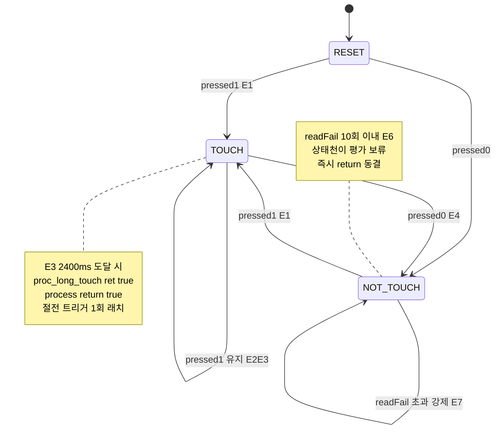
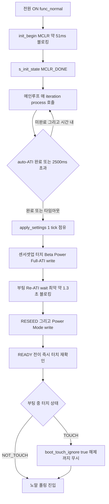
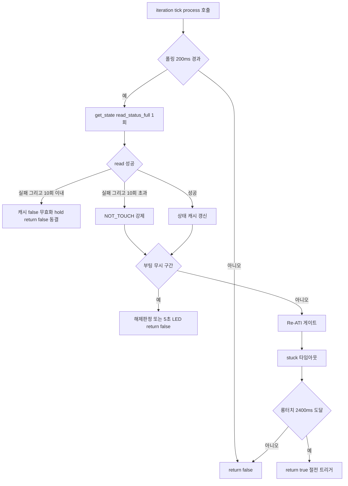
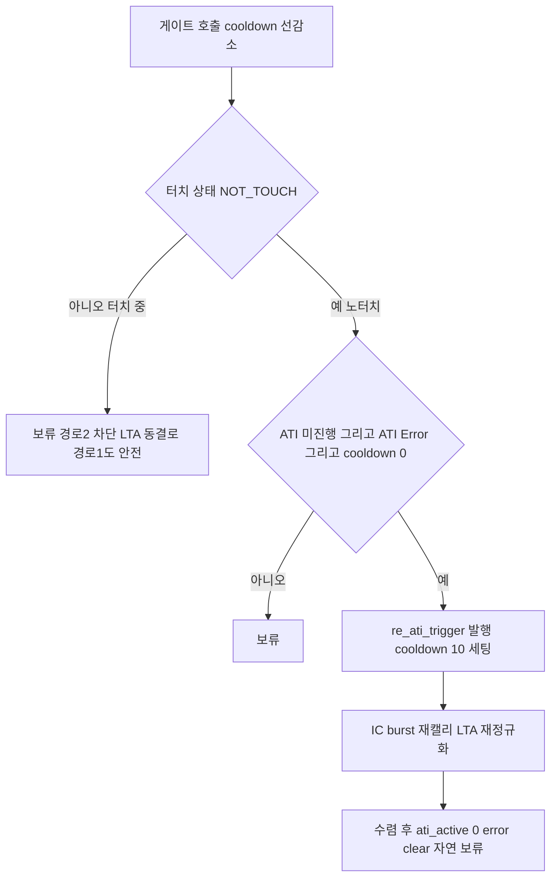
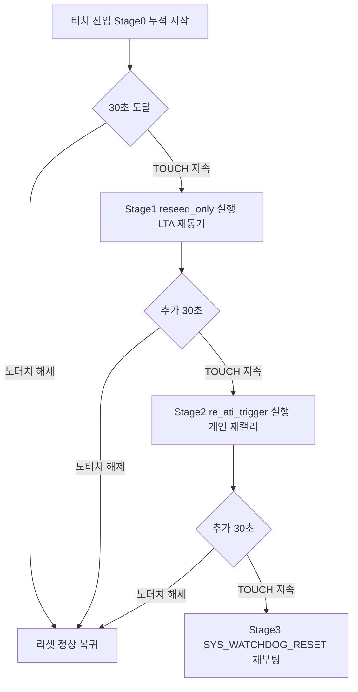

# B99 동작분석 종합

**TL;DR**: Full ATI 구현은 빌드를 막는 정합 불일치 0건(시그니처 6/6·가드 대칭 3/3·orphan static 0)이며, 동작은 ① 부팅(MCLR 약 51ms 블로킹 1회 + auto-ATI 비블로킹 폴링 t3 기준 2500ms 타임아웃 + apply_settings 1tick 점유 — 내부에 부팅 Re-ATI wait_re_ati_done 최악 약 1.3초 블로킹), ② 노말 200ms 폴링(get_state→게이트→stuck→롱터치 순, read 실패 N회=10 hold 후 NOT_TOUCH 강제), ③ Re-ATI 게이트(4조건 NOT_TOUCH·미진행·Error·쿨다운0, 발행 후 약 2초 쿨다운, read 실패 캐시 무효화로 stale 누출 차단), ④ SW 타임아웃(터치 지속 30/60/90초 3단계 reseed_only→re_ati_trigger→MCLR), ⑤ 절전 완전 미관여(proc는 process 내부에만, ULP는 get_state만 호출)로 닫힌다. 폴링 200ms·롱터치 2400ms가 코드 정본(설계 100ms·3초 표기는 정정). 모든 타이밍 수치는 코드 상수 [확정], t_ati·burst 길이·SYS_WATCHDOG_RESET 헤더 접근성·-Werror는 [실측 게이트]. (B7 검증: 동작 결론 전수 [확인됨], 적출은 B5·B6 라인 인용 오류 4건뿐 — 본 문서는 절대 라인으로 통일 인용.)

---

## 0. 인용 기준 (절대 라인 통일)

B7 adversarial 검증에서 B5·B6이 일부 위치를 diff hunk 라인으로 표기해 어긋났음이 적출되었다. 본 종합은 **소스 절대 라인**으로 통일한다(B7 §0 기준, 직접 재확인 완료).

| 심볼 | 정의 | 호출 | 가드 |
|---|---|---|---|
| `proc_re_ati_gate` | `tdc_touch.c:224` | `tdc_touch.c:482` | `FULL_ATI && RE_ATI_GATE` (`:223·481`) |
| `proc_stuck_timeout` | `tdc_touch.c:252` | `tdc_touch.c:486` | `FULL_ATI && (STUCK_MS>0)` (`:251·485`) |
| `proc_long_touch` | `tdc_touch.c`(기존) | `tdc_touch.c:489` | 무가드 |
| `tdc_touch_get_state` | `tdc_touch.c:499` | `tdc_touch.c:419·440` | 무가드 |
| `tdc_drv_iqs323_read_status_full` | `tdc_drv_iqs323.c:1322` | `tdc_touch.c:505` | 무가드 |
| `tdc_drv_iqs323_reseed_only` | `tdc_drv_iqs323.c:970` | `tdc_touch.c:281` | 무가드(정의)/stuck 가드(호출) |
| `tdc_drv_iqs323_re_ati_trigger`(공개) | `tdc_drv_iqs323.c:983` | `tdc_touch.c:237·288` | 무가드(정의) |
| `re_ati_trigger`(static) | `tdc_drv_iqs323.c:569` | `tdc_drv_iqs323.c:1255`(부팅) | 무가드 |
| `wait_re_ati_done`(static) | `tdc_drv_iqs323.c:581` | `:879·912·1189·1265` | 무가드 |
| `apply_filter_power_settings` | `tdc_drv_iqs323.c:1082` | `tdc_drv_iqs323.c:1243` | `FULL_ATI && BETA_POWER` |
| `SYS_WATCHDOG_RESET` | SDK 헤더(`hw.h` 체인) | `tdc_touch.c:300` | stuck stage3 |

라벨: [확정]=코드 명시 · [추정]=합리적 정적 추론 · [실측 게이트]=빌드/실기 필요.

상수 정본: `POLL_INTERVAL=200`(`tdc_touch.h:25`) · `LONG_TOUCH_MS=2400`(`:26`) · `INIT_TIMEOUT_MS=2500`(`:27`) · `RE_ATI_COOLDOWN_CNT=10`(`tdc_touch_config.h:183`) · `STUCK_TIMEOUT_MS=30000`(`:196`) · `READ_FAIL_HOLD_CNT=10`(`:210`) · `FULL_ATI=1·RE_ATI_GATE=1·BETA_POWER=1·GATE=0`(`:170·177·189·203`). 설계서·오케 입력의 "100ms 폴링·3초 롱터치"는 코드와 불일치 → **200ms·2.4초로 정정**.

---

## 1. 선언/호출 정합 결과 요약 (B1)

빌드를 막는 [확정] 불일치 **0건**. 전수 검증 결과:

| 구분 | 결과 | 라벨 |
|---|---|---|
| 시그니처 정합(.h↔.c) | 6/6 일치 | [확정] |
| 가드 대칭(정의=호출 #if) | 3/3 동일, orphan static 0 | [확정] |
| 미정의 참조(repo 내부) | 0건 | [확정] |
| 중복 정의 | 0건 | [확정] |
| 잠재 경고 | `s_last_ati_error/active` set-but-unused (FULL_ATI=1 AND RE_ATI_GATE=0 비기본 조합 한정, 기본 빌드 무해) | [추정] |
| 정적 확정 불가 | `SYS_WATCHDOG_RESET` SDK 헤더 접근성(빌드 1회 판명), `-Werror` 여부 | [실측 게이트] |

- 공개 3함수(`reseed_only`·`re_ati_trigger`·`read_status_full`)는 **무가드 정의** → 모든 빌드가드 조합에서 심볼 항상 존재, 호출이 가드로 사라져도 미정의 참조 불가 [확정].
- static 3함수(`proc_re_ati_gate`·`proc_stuck_timeout`·`apply_filter_power_settings`)는 정의·호출이 같은 `#if`로 묶여 동시 ON/OFF → orphan·미정의 모두 0 [확정].
- `read_status_full`의 out param NULL 허용 설계지만 실호출(`tdc_touch.c:505`)은 3개 모두 비-NULL 주소 전달 → 안전 [확정].
- `re_ati_trigger`: 공개 wrapper(`:983`)가 내부 static(`:569`)을 호출. 이름 동일·범위 분리라 충돌 없음 [확정].
- `SYS_WATCHDOG_RESET`: repo 내 `#define` 0건(SDK 제공). 동일 파일이 `SYS_WATCHDOG_REFRESH`를 기존 컴파일(`tdc_touch.c:330` 등)하고 bootloader `service.c:261`이 RESET을 혼용 빌드하는 선례 → 동일 헤더 공존 개연성 매우 높음 [추정-강], 빌드 1회로 즉시 판명 [실측 게이트].

---

## 2. 콜스택 트리

### 2.1 부팅 콜스택 (Full ATI 운용 모드)

```
전원 ON → main() → func_normal() [main.c:332·371]
  └─ Initialize() [initialize.c]
       └─ tdc_touch_init_begin() [tdc_touch.c:388]
            ├─ SYS_WATCHDOG_REFRESH()
            ├─ tdc_drv_iqs323_mclr_reset() → mclr_reset() [tdc_drv_iqs323.c:288]   ← 약 51ms 블로킹 1회
            └─ s_init_state = MCLR_DONE
  └─ enable_CFX_trigger_for_iteration()   ← main_tick·iteration 활성
  └─ func_normal while(1) [main.c:435]
       └─ 매 iteration: tdc_touch_process() [tdc_touch.c:400]
            └─ switch(s_init_state)
                 └─ case MCLR_DONE → try_finish_init() [tdc_touch.c:315]
                      ├─ tdc_drv_iqs323_is_auto_ati_done()
                      │    = is_auto_ati_done_single_read() [tdc_drv_iqs323.c:312]   ← 1회 read 비블로킹
                      │    └─ 미완료 AND (t3차 < 2500ms) → return false → 다음 iteration 재시도
                      ├─ 완료 OR 2500ms 초과 → SYS_WATCHDOG_REFRESH()
                      └─ tdc_drv_iqs323_apply_settings() [tdc_drv_iqs323.c:1131]      ← 1 tick 점유(블로킹)
                           ├─ ack_reset_event / confirm_reset_event
                           ├─ sensor_setup(단일채널) / touch_settings / prox_settings / events_enable
                           ├─ write_ati_compensation()                               ← Full ATI write
                           ├─ apply_filter_power_settings() [:1243]                  ← Beta/Power write 7회
                           ├─ re_ati_trigger() [:1255] + 50틱 spin + wait_re_ati_done() [:1265]  ← 부팅 Re-ATI 블로킹
                           ├─ write_register(0xC0, 0x08) [:1272]                      ← RESEED
                           └─ write_register(0xC0, 0x50/0x07) [:1283]                 ← Power Mode
                 └─ try_finish_init() true → s_init_state=READY, s_boot_ready_tick=main_tick
                      └─ tdc_touch_get_state(&boot_state) [tdc_touch.c:419]           ← 부팅 터치 재확인
                           └─ TOUCH면 s_boot_touch_ignore=true
```

### 2.2 노말 루프 콜스택 (READY 폴링 1 tick)

```
func_normal while(1) [main.c:435]
  └─ iterationFlag==true [main.c:437]
       └─ powerButtonPushed = tdc_touch_process() [main.c:463]   (GATE=0 기본 → 직접)
            └─ tdc_touch_process() [tdc_touch.c:400]
                 ├─ switch(s_init_state) → READY break [:428]
                 └─ if (POLL_INTERVAL(200) <= curr_tick - s_touch_tick_old) [:436]   ← 200ms 게이팅
                      ├─ got_state = tdc_touch_get_state(&curr_state) [:440]
                      │    └─ tdc_drv_iqs323_read_status_full(&pressed,&error,&active) [:505]
                      │         └─ read_register(0x10) — 0xEEEE 글리치 → false
                      │         ├─ 성공: s_last_ati_error/active 캐시 [:521·522]
                      │         └─ 실패: 캐시 false 무효화 + return false [:512·513]
                      ├─ if(!got_state){ ++cnt<=10 ? return false(hold) : NOT_TOUCH 강제 } [:445·451]
                      ├─ if(state_old != curr_state) STATE 로그 [:458]
                      ├─ if(s_boot_touch_ignore){ 해제판정 / 5초 LED / return false } [:465]
                      ├─ proc_re_ati_gate(curr_state) [:482]      (FULL_ATI && RE_ATI_GATE)
                      │    └─ 4조건 충족 시 tdc_drv_iqs323_re_ati_trigger() [:237]
                      ├─ proc_stuck_timeout(curr_state) [:486]    (FULL_ATI && STUCK_MS>0)
                      │    └─ 30/60/90초 도달 시 reseed_only/re_ati_trigger/SYS_WATCHDOG_RESET [:281·288·300]
                      └─ if(proc_long_touch(curr_state)) return true [:489]   ← 2400ms 도달 1회
       └─ systemControl(..., powerButtonPushed, ...) [main.c:508]   ← 롱터치 true 소비 → 절전 트리거
```

### 2.3 절전 콜스택 (func_sleep — Full ATI 무영향)

```
func_sleep() [main.c:883]   ← diff 직접 변경 0줄
  ├─ SYS_WATCHDOG_REFRESH()
  ├─ 877 터치 해제 대기 while(read_status && pressed) [main.c:891]   ← 매회 WDT refresh + delay 100, read 실패 시 탈출
  ├─ FPGA/nRF/QCC/PMIC OFF, CFX ULP 진입 대기
  ├─ apply_sleep_settings() [tdc_drv_iqs323.c:1005]   ← #if !FULL_ATI 절전 MULT/COMP 스킵, ATI Setup 0x08(Disabled) 유지
  ├─ ci_power_sleep (SYSCLK 30.72M → 2.56M)
  ├─ i2c prescale 저속
  ├─ reseed (절전 감도 100/80 + Prox + bit3)   ← 노말 reseed_only(970)와 격리
  ├─ ci_timer_init_prescaled (main tick 1ms → 약 200ms)
  └─ ULP 루프 while(1) [main.c:981]
       └─ WFI 200ms idle → WDT refresh → tdc_touch_get_state() 1회 [main.c:993]
            └─ touch_cnt >= ULP_LONG_TOUCH_COUNT(11=2.2초) → SYS_WATCHDOG_RESET() [main.c:1015]
```

> [!IMPORTANT]
> **절전 경로에 `tdc_touch_process`·`proc_re_ati_gate`·`proc_stuck_timeout`·`wait_re_ati_done` 호출 0건** [확정]. 신규 노말 로직과 부팅 블로킹은 절전에 구조적으로 미관여. 절전 stuck은 ULP 2.2초 리셋(은수님 결정)이 전담.

---

## 3. 이벤트 → 상태 천이표 (전 이벤트)

기준: `s_touch_state_old`(process 레벨, `tdc_touch.c:41`) · `proc_long_touch::s_state_old` · `proc_stuck_timeout::s_prev`(각 함수 static). curr_state는 get_state 산출 또는 read 실패 강제값.

| # | 이벤트 | 입력(read 결과) | curr_state | s_touch_state_old 천이 | 게이트/stuck/롱터치 side effect | process 반환 |
|---|---|---|---|---|---|---|
| E1 | 노터치→터치 진입 | pressed=1, active=0 | TOUCH | NOT_TOUCH→TOUCH | gate no-op / stuck: s_stuck_tick0 기록·stage=0 / long: first_touch 기록 | false |
| E2 | 터치 유지(<2.4s) | pressed=1 | TOUCH | TOUCH(무변) | stuck: 경과 누적 / long: 미달 ret=false | false |
| E3 | 터치 유지(=2.4s 도달) | pressed=1 | TOUCH | TOUCH(무변) | long: is_long_touch=true, ret=true(최초 1회 래치) | **true** |
| E4 | 터치 해제 | pressed=0, active=0 | NOT_TOUCH | TOUCH→NOT_TOUCH | stuck: stage=0·prev=NOT_TOUCH·early return / long: 래치 해제 | false |
| E5 | 드리프트(노터치 ATI Error) | pressed=0, error=1, active=0, 쿨다운0 | NOT_TOUCH | 변화 시 로그 | **gate: re_ati_trigger() 발행 + cooldown=10** / stuck·long: NOT_TOUCH 무동작 | false |
| E5' | 드리프트 쿨다운 중 | pressed=0, error=1, active=0, cooldown>0 | NOT_TOUCH | — | gate: 발행 보류(cooldown 1 감소) | false |
| E5'' | ATI 진행 중 | pressed=0, error=1, **active=1** | NOT_TOUCH | — | gate: active 비0이라 미발행 | false |
| E6 | read 실패(≤10회) | got_state=false | (미설정) | **천이 평가 안 함** | **즉시 return false** — 게이트·stuck·롱터치 동결, 캐시 false 무효화 | false |
| E7 | read 실패(>10회) | got_state=false | NOT_TOUCH 강제 | →NOT_TOUCH 가능 | gate: error 캐시 false라 미발행 / stuck: 리셋 / long: 래치 해제 | false |
| E8 | 롱터치 발동 | E3와 동일 | TOUCH | TOUCH | long ret=true | **true → systemControl 절전** |
| E9 | 부팅 무시(터치 지속) | boot_touch_ignore=1, pressed=1 | TOUCH | 로그 가능 | **return false**(게이트·stuck·롱터치 도달 전 차단), 5초 시 보라 LED | false |
| E10 | 부팅 무시 해제 | boot_touch_ignore=1, curr_state!=TOUCH | NOT_TOUCH | 로그 | ignore=false 복귀, 그 tick도 return false | false |
| S1 | stuck 30초(stage0→1) | TOUCH 30s 누적 | TOUCH | TOUCH | **reseed_only() 발행**, s_stuck_tick0 갱신·stage=1 | false |
| S2 | stuck 60초(stage1→2) | TOUCH 추가 30s | TOUCH | TOUCH | **re_ati_trigger() 발행(게이트 우회)**, stage=2 | false |
| S3 | stuck 90초(stage2→MCLR) | TOUCH 추가 30s | TOUCH | TOUCH | 20ms RTT 드레인 후 **SYS_WATCHDOG_RESET()** | (재부팅) |

**상태 머신 다이어그램(process 레벨 s_touch_state_old):**



> [!NOTE]
> read 실패 hold(E6)는 **상태 머신에 진입조차 안 함**(즉시 return). self-loop로도 표기 불가 — "동결"이 정확. E7(N회 초과)에서만 NOT_TOUCH로 강제 진입.

---

## 4. 타이밍 분석 (블로킹·30초 에스컬레이션·쿨다운)

### 4.1 블로킹 구간 일람

| 구간 | 경로 | 블로킹 | 시간 | WDT refresh | 라벨 |
|---|---|---|---|---|---|
| MCLR (`mclr_reset`) | 부팅 init_begin | 동기 1회 | 약 51ms (1ms HOLD + 50ms BOOT_WAIT) | — | [확정] |
| auto-ATI 대기 | 부팅 try_finish_init | **비블로킹 폴링** | 정상 수백ms / 최악 2500ms 타임아웃(t3 기준) | iteration마다 | [확정], t_ati [실측 게이트] |
| apply_settings 1~8 | 부팅 1 tick | 동기 write 다수 | 정상 수십~수백ms (최악 window 타임아웃 누적) | 1234·1253 사이 | [추정] |
| 부팅 Re-ATI(`wait_re_ati_done`) | apply_settings 9단계 | 동기 폴링(10회×약 100ms) | 정상 약 50~250ms / 최악 약 1.0~1.3초 | **루프 내부 없음**(앞 1253·뒤 1269) | [확정] |
| RESEED·Power Mode | apply_settings 10~11 | 동기 | 수 ms | — | [확정] |
| stuck stage3 RTT 드레인 | 노말 proc_stuck_timeout | 동기 busy | 약 20ms | — | [확정] |
| 절전 877 해제 대기 | func_sleep | 동기 polling | 손 뗄 때까지(read 실패 시 탈출) | 매회 + delay 100 | [확정] |

> [!CAUTION]
> **부팅 1 tick 최악 점유**: auto-ATI 2500ms 풀 타임아웃 + apply_settings 내 부팅 Re-ATI 약 1.3초 직렬 누적 → **약 3.8초+α** [추정]. 부팅 1회 한정 + 워치독 refresh 사이사이 존재로 안전하나, LED 버스트(약 1.8초)보다 길어질 수 있어 "체감 0" 가정이 깨질 여지. `wait_re_ati_done` 루프 내부에 WDT refresh가 없으나 최악 약 1초 < WDT 약 3.28s(SDK [추정])라 단독 마진 약 2.2s. t_ati·WDT 주기 [실측 게이트].

### 4.2 30초 에스컬레이션 시간축 (노말 stuck)

손가락/전도성 물체가 CRX0에 계속 닿아 매 폴링 `pressed=true`(curr_state=TOUCH) 지속 가정. 카운트는 `ci_timer_get_tick()` **ms 절대시간 차분**이라 200ms 폴링 지터(±200ms) 외 누적 오차 없음 — 폴링 100ms/200ms 차이는 30초 임계에 무영향 [확정].

```
t=0s   ┬ TOUCH 진입 → s_stuck_tick0 기록, stage=0
       │
t≈30s  ┼ stage0 → reseed_only() (bit3 RESEED만, 절전 감도·Prox 미적용) → stage=1, s_stuck_tick0 갱신
       │   효과: LTA를 현재 counts로 재동기. stuck이 baseline이 되면 touch 해제 가능 [추정]
       │
t≈60s  ┼ stage1 → re_ati_trigger() (bit2 Re-ATI, 노터치 게이트 의도적 우회) → stage=2, 갱신
       │   효과: 게인 재캘리. RESEED로 못 푼 drift형 stuck 흡수 시도
       │
t≈90s  ┴ stage2 → 20ms RTT 드레인 → SYS_WATCHDOG_RESET() (MCLR 재부팅)
           효과: conversion 정지·상한 포화형 stuck까지 완전 회복(간접 Max Counts 흡수)
```

- **해제 시 즉시 리셋**: TOUCH 외 상태(노터치·RESET·강제 NOT_TOUCH) 진입 시 함수 초입에서 `s_stage=0`·`s_prev=state_now` 후 early return [tdc_touch.c:258·263]. 단계 진행 완전 초기화.
- **read 글리치 상호작용**: 10회 이내 hold면 process가 `return false`로 본문을 건너뛰어 proc_stuck_timeout이 호출조차 안 됨 → 카운트 동결. 10회 초과면 NOT_TOUCH 강제 → 리셋. 진짜 stuck은 read 정상이라 무영향 [확정].
- **롱터치 선점**: 정상 롱터치(2.4초)→절전 전환이 stuck 30초보다 훨씬 먼저 발동. 따라서 30초까지 노말 TOUCH 지속은 절전 진입 실패 등 비정상 전제가 필요 → 실제 도달 빈도 [실측 게이트].

### 4.3 Re-ATI 게이트 쿨다운 (약 2초)

발행 직후 `s_cooldown=10`(`tdc_touch.c:238`). 매 게이트 호출(폴링 tick)마다 선감소 → 발행 후 +10 tick(누적 약 2000ms @200ms)에 재발행 가능.

| tick(상대) | s_cooldown 진입 | 선감소 후 | ==0? | 발행 가능? |
|---:|---:|---:|:---:|:---:|
| 발행 tick | 0 | 0 | 예 | **발행 → 10 세팅** |
| +1 | 10 | 9 | 아니오 | 차단 |
| … | … | … | … | … |
| +9 | 2 | 1 | 아니오 | 차단 |
| +10 (2000ms) | 1 | 0 | 예 | 재발행 가능 |

> [!NOTE]
> **삼중 안전**: 쿨다운(시간) + ati_active(burst 진행 중 캐시 1 → 두 번째 조건 차단) + ati_error(burst 후 clear → 세 번째 조건 차단)가 연속 발행 폭주를 막아 드리프트 1사이클이 단일 Re-ATI로 닫힌다. 단 쿨다운 약 2초가 burst 완료보다 충분히 긴지는 [실측 게이트]. 쿨다운은 게이트 미호출 tick(부팅 무시 구간·read hold)에선 감소 안 함 [확정].

---

## 5. Mermaid 순서도

### 5.1 부팅 시퀀스



### 5.2 노말 폴링 1 tick



### 5.3 Re-ATI 게이트 (드리프트 자동 복구)



### 5.4 SW 타임아웃 3단계 에스컬레이션



---

## 6. 예측 동작 종합

### 6.1 정상 시나리오 [확정 + 일부 실측]

| 시나리오 | 예측 동작 |
|---|---|
| 정상 부팅(노터치) | MCLR 51ms → auto-ATI 수백ms 수렴 → apply_settings 1 tick(부팅 Re-ATI 약 50~250ms) → READY. LED 버스트(약 1.8초)와 병렬이라 체감 약 0 |
| 짧은 터치(<2.4초) | E1 진입 → E2 유지 → E4 해제. 롱터치 미발동, process 계속 false. stuck 카운트 시작했다가 해제로 리셋 |
| 롱터치(2.4초) | E1→E2→E3에서 proc_long_touch ret=true 1회 → process true → systemControl 절전 트리거. 재발동 없음(래치) |
| 노터치 드리프트 | E5 다음 200ms tick 게이트 발행 1회 → 약 2초 쿨다운 + ati_active/error 상태로 단일 Re-ATI로 복구 닫힘 |
| 절전 진입 | func_sleep 877 해제 대기(손 뗌) → apply_sleep(ATI 0x08 동결) → ULP 루프. 신규 로직·부팅 블로킹 완전 미관여 |

### 6.2 경계 시나리오 [확정/추정]

| 시나리오 | 예측 동작 | 라벨 |
|---|---|---|
| 부팅 중 터치 지속 | auto-ATI 2500ms 타임아웃 강제 진행 + 부팅 Re-ATI NOT CONFIRMED 경고 + READY 시 boot_touch_ignore=true → 해제까지 입력 무시(5초 시 보라 LED). ATI_Error 잔류는 해제 후 게이트가 자동 복구 | [확정]/복구 실효 [추정] |
| 터치 중 드리프트(ATI Error) | 게이트 첫 조건 NOT_TOUCH에서 보류 → 터치 해제 후 첫 노터치 tick에서 발행. 터치 중 Error는 정상 결과로 무시 | [확정] |
| read 글리치 중 터치 유지 | 캐시 false 무효화로 게이트 비활성 → 손가락 닿은 채 Re-ATI 누출 차단(급소 수정 핵심). 10회 이내면 롱터치 카운트 동결(burst 흡수) | [확정] |
| 절전 stuck(전도성 물체) | ULP 2.2초 리셋이 노말 30초 3단계보다 압도적 선발동 → 절전 SW 30초 실효 0(코드 경로 부재) | [확정] |
| 정상 60초+ 의도적 롱터치 | stuck stage2 Re-ATI가 터치를 노터치로 학습해 강제 해제 부작용 가능(다만 롱터치→절전 선점이 정상 흐름이라 도달 비현실적) | [추정] |

### 6.3 이상 시나리오 [추정/실측 게이트]

| 시나리오 | 예측 동작 | 라벨 |
|---|---|---|
| 전도성 물체 stuck | t≈30s reseed_only → t≈60s re_ati_trigger → t≈90s MCLR. 각 단계 30초 재카운트로 human-in-the-loop 복구 기회 | [확정] |
| Max Counts 포화(conversion 정지) | RESEED·Re-ATI 무효 → 0~60초 오발 지속 후 90초 MCLR로 간접 회복(포화 전용 감지 stub 부재). 체감 응답 지연 가능 | [추정] |
| 단일채널 auto-ATI 미수렴 | ati_active 안 내려가 부팅 2500ms 풀 소비 후 강제 진행. 운용 Re-ATI 잔류 복구 실효성은 단일채널 성공률 의존 | [실측 게이트] |
| read 실패 burst > 2초(10×200ms) | E6→E7 전이로 진짜 터치 중에도 NOT_TOUCH 강제 위험 → 롱터치 끊김 | [실측 게이트] |

### 6.4 실측 게이트 종합 (빌드 1회 + 실기)

| # | 항목 | 분류 |
|---|---|---|
| 1 | `SYS_WATCHDOG_RESET` SDK 헤더 접근성 + `-Werror` 시 set-but-unused(FULL_ATI=1 AND RE_ATI_GATE=0) | [실측 게이트: 빌드 1회] |
| 2 | t_ati(단일 CRX0 Full ATI 수렴 시간) — INIT_TIMEOUT 2500ms·wait_re_ati_done 10회 적정성 | [실측 게이트] |
| 3 | Re-ATI burst 길이 vs 쿨다운 약 2초 충분성 + ati_active 전 구간 1 유지 여부 | [실측 게이트] |
| 4 | read 실패 흡수 N=10(약 2초)이 burst 구간 덮는가 | [실측 게이트] |
| 5 | 부팅 Re-ATI WDT 마진(누적 작업 시) — RTT 타임스탬프 | [실측 게이트] |
| 6 | 절전 30초 SW 타임아웃 미구현(설계 13번 의미 충돌) — 요구사항 재확인 | [요구사항] |
| 7 | 드리프트 ati_error 노터치 구간 실제 SET 여부, stage2 60초+ 롱터치 강제 해제 부작용 | [실측 게이트] |

---

## 7. 정합 불일치·예측 불확실 요약

| 항목 | 코드 실값 | 설계/주석 표기 | 판정 |
|---|---|---|---|
| 폴링 간격 | 200ms (`tdc_touch.h:25`) | "100ms"(설계 §3.2·오케 입력) | 코드 200 정본 — **정정** |
| 롱터치 시간 | 2400ms (`tdc_touch.h:26`) | "3초"(오케)·"2.8초"(헤더 주석) | 코드 2400 정본 — **정정** |
| 게이트↔롱터치 순서 | gate→stuck→long (`:482·486·489`) | "터치 판정 선분기"(설계) | **정합**(curr_state 입력 + NOT_TOUCH 게이트로 터치 중 보류) |
| stuck 30초 카운트 | tick ms 차분(`:273`), NOT_TOUCH 리셋(`:258`) | 설계 §3.3 일치 | 정합 |
| 절전 SW 30초 | 코드 경로 부재(ULP 2.2초만) | 설계 13번 의미 충돌 | **요구사항 재확인 필요** |
| B5·B6 라인 인용 | 절대 라인(본 문서 §0) | diff hunk 라인 혼용 | **B99에서 절대 라인 통일**(동작 결론은 정확) |

**B7 검증 결론 반영**: 존재하지 않는 호출·틀린 상태천이·근거 없는 타이밍·잘못된 블로킹 시간 **0건**. B5·B6의 [코드불일치] 4건은 전부 라인 번호 인용 오류이며 동작 예측 자체는 정확 → 본 종합은 §0 절대 라인으로 통일, [과장]/[근거없음] 항목은 미포함. 빌드 1회로 SYS_WATCHDOG_RESET 접근성·-Werror만 확정하면 정적 분석 전체가 실측으로 닫힌다.
