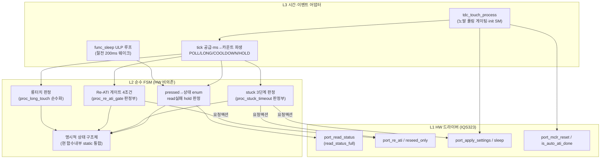

# 01 현코드 구조 매핑

**TL;DR**: 터치 코드 함수를 L2(순수 FSM·HW 비의존)·L1(HW I2C/레지스터/RDY)·L3(시간·이벤트 어댑터·tick 게이팅)로 분류. tdc_touch.c의 판정 로직 4종(`proc_long_touch`·`proc_re_ati_gate`·`proc_stuck_timeout`·init 상태머신)은 **순수화 가능하나 현재 함수 내부 static 변수·`ci_timer_get_tick()` 직접 호출·드라이버 직접 호출이 뒤섞여 비순수**다. tdc_drv_iqs323.c는 전부 L1(I2C·Sys_GPIO·Sys_Delay·RDY 윈도우). 전역/static 상태는 12개(tdc_touch.c 8 + 드라이버 1 + 각 proc 함수 내부 static 묶음). 시간 상수는 노말축(`POLL_INTERVAL=200`·`LONG_TOUCH_MS=2400`·`INIT_TIMEOUT_MS=2500`, ms 직접 비교)·절전축(`ULP_WAKE_INTERVAL_MS=200`·`ULP_LONG_TOUCH_MS=2200`→`ULP_LONG_TOUCH_COUNT` 올림 파생, main.c 소유)·쿨다운/hold(`RE_ATI_COOLDOWN_CNT=10`·`READ_FAIL_HOLD_CNT=10`, 폴링 카운트)로 **두 시간축이 분리·불일치 표기**되어 있다.

---

## 0. 분류 기준·범례

- **L1 HW 드라이버**: I2C 통신·레지스터·RDY 윈도우·GPIO·`Sys_Delay`·IQS323 종속 비트 — HW 비의존 불가.
- **L2 순수 FSM 로직**: 입력(상태·플래그·tick·카운터)→출력(다음상태·요청액션)이 결정적, HW·전역 부작용 없음 — 테스트 가능 후보.
- **L3 시간·이벤트 어댑터**: tick 공급·폴링 게이팅·ms→카운트 파생·L2 액션을 L1 호출로 변환.
- 라벨: [확정]=코드 명시 · [추정]=정적 추론 · [실측 게이트]=빌드/실기 필요.
- 근거는 [파일:라인]. 파일 약어: `T`=tdc_touch.c, `Th`=tdc_touch.h, `D`=tdc_drv_iqs323.c, `Dh`=tdc_drv_iqs323.h, `Cfg`=tdc_touch_config.h, `M`=main.c.

---

## 1. tdc_touch.c 함수 분류

| 함수 | 정의 | 현 책임 | 분류 | 순수화 가능성 |
|---|---|---|---|---|
| `tdc_touch_state_name` | T:65 | enum→문자열 | **L2 순수** | 이미 순수(입력만→반환). [확정] |
| `proc_long_touch` | T:85 | 롱터치 2.4초 판정 | **L2 후보** | 내부 static 3개(`s_state_old`·`s_tick_first_touch`·`s_is_long_touch`) + `ci_timer_get_tick()` 직접 호출(T:98·110·130) → 상태 구조체화 + tick 주입 시 순수화. [추정] |
| `proc_re_ati_gate` | T:224 | Re-ATI 게이트 4조건 판정 + 발행 | **L2 판정 / L1 발행 혼재** | 판정(상태·`s_last_ati_active`·`s_last_ati_error`·쿨다운)은 순수, 그러나 내부 static 쿨다운(`s_cooldown`) + `ci_printi` + `tdc_drv_iqs323_re_ati_trigger()` 직접 호출(T:237) → 판정은 L2, 액션 발행은 L3가 L1로 위임해야 분리. [추정] |
| `proc_stuck_timeout` | T:252 | 터치 30/60/90초 3단계 에스컬레이션 | **L2 판정 / L1·SDK 액션 혼재** | 내부 static 3개(`s_stuck_tick0`·`s_prev`·`s_stage`) + `ci_timer_get_tick()` 직접 + `tdc_drv_iqs323_reseed_only/re_ati_trigger` + `SYS_WATCHDOG_RESET()`(T:300) 직접 → 단계 판정은 순수, 액션은 L3/L1. stage3 칩 리셋은 부작용. [추정] |
| `try_finish_init` | T:315 | Auto-ATI 완료 감지→설정 적용 | **L1 위주 + L3 게이팅** | `tdc_drv_iqs323_is_auto_ati_done`·`apply_settings`·`tdc_timer_get_t3_tick` 직접 호출 + 타임아웃 ms 비교 + CALIB 무한루프(T:339) 포함 → 대부분 L1 호출·L3 시간게이팅. 순수화 대상 아님. [확정] |
| `tdc_touch_init_begin` | T:388 | MCLR 리셋 트리거 + 상태 전이 | **L1 위주** | `tdc_drv_iqs323_mclr_reset`·`tdc_timer_get_t3_tick` 직접 + static `s_init_state`·`s_mclr_done_tick` 기록. [확정] |
| `tdc_touch_process` | T:400 | init 상태머신 + 폴링 게이팅 + proc 호출 디스패치 | **L3 어댑터 핵심** | `ci_timer_get_tick()` 폴링 게이팅(T:436) + `tdc_touch_get_state` 호출 + read 실패 hold(`s_read_fail_cnt`) + boot ignore + proc 디스패치 → **L3 어댑터의 노말 메인 루프 그 자체**. [확정] |
| `tdc_touch_get_state` | T:499 | status_full read→상태 결정 + ATI 캐시 + 마진/방전 | **L1 위주 + L2 매핑** | `tdc_drv_iqs323_read_status_full` 직접 호출(T:505) + `s_last_ati_error/active` 캐시 기록(T:512·521) + 마진로그·방전 직접(T:543·551). pressed→상태 enum 매핑(T:524)만 순수, 나머지 L1. [확정] |
| `tdc_touch_consume_sleep_request` | T:377 | 절전 요청 1회 소비 | **L2 순수(트리비얼)** | static `s_sleep_request` 토글. SLEEP_MEASURE_MODE 빌드 전용. [확정] |
| `calib_*` (4함수) | T:154~211 | CALIB LED 이진 출력 | **L1(LED·delay)** | `led_request`·`calib_delay_ms`(`ci_timer_get_tick` busy-wait) + ATI_CALIB_MODE 빌드 전용. 운용 무관. [확정] |

### 1.1 핵심 발견 — 순수 로직이 비순수에 묶인 패턴

세 판정 함수(`proc_long_touch`·`proc_re_ati_gate`·`proc_stuck_timeout`)는 동일한 안티패턴을 공유한다 [확정]:
1. **함수 내부 `static` 변수로 상태 은닉** → 테스트 시 상태 주입·관찰 불가, 리셋 불가.
2. **`ci_timer_get_tick()` 직접 호출** → 시간을 인자로 받지 않아 시간축 고정·테스트 시 시간 제어 불가.
3. **드라이버/SDK 함수 직접 호출**(`re_ati_trigger`·`reseed_only`·`SYS_WATCHDOG_RESET`) → 판정과 액션이 한 함수에 결합, 액션을 mock 불가.

→ L2 분리 시 ①을 **명시적 상태 구조체**, ②를 **tick 인자 주입**, ③을 **요청 액션 enum 반환**(호출 측 L3가 L1로 디스패치)으로 전환해야 순수화·테스트 가능. (설계는 02·03·04 노드 소관.)

---

## 2. tdc_drv_iqs323.c 함수 분류 (전부 L1)

드라이버 전 함수가 I2C·GPIO·RDY 윈도우·`Sys_Delay`에 종속 → **전부 L1**. [확정] L2가 호출할 추상 경계 후보를 표시.

| 함수 | 정의 | HW 종속 근거 | L2 인터페이스 후보 |
|---|---|---|---|
| `i2c_write`/`i2c_read` | D:39/76 | `i2c_startWriteData`·`get_i2cDriverStatus` busy-loop | (내부, 노출 안 함) |
| `is_rdy_window_opened`·`wait_rdy_window_closed`·`force_window_open` | D:115/120/143 | `Sys_GPIO_Read`·`ci_timer_get_tick` busy-wait | (내부) |
| `write_register`/`read_register`/`write_and_verify`/`write_register_discharge` | D:178/227/265/203 | force window + i2c | (내부) |
| `mclr_reset` | D:288 | `Sys_GPIO`·`Sys_Delay` 51ms 블로킹 | `port_mclr_reset()` |
| `is_auto_ati_done_single_read`·`wait_auto_ati_done` | D:312/343 | status read + delay | `port_is_auto_ati_done()` |
| `ack_reset_event`·`confirm_reset_event`·`events_enable`·`sensor_setup`·`touch_settings(_impl)`·`prox_settings` | D:380~559 | 레지스터 write | `port_apply_settings()` 내부 |
| `re_ati_trigger`(static)·`wait_re_ati_done` | D:569/581 | write + read 폴링 + `Sys_Delay`(D:592·618) | `port_re_ati()` 내부 |
| `write_ati_compensation`·`apply_filter_power_settings` | D:696/1082 | 보드변종 매크로 write | `port_apply_settings()` 내부 |
| `dump_ati_registers`·`calib_*`·`sleep_measure_dump` | D:755~939 | read + RTT/LED, 빌드 전용 | (개발도구, 별도) |
| `tdc_drv_iqs323_mclr_reset` | D:940 | wrapper | `port_mclr_reset()` |
| `tdc_drv_iqs323_is_auto_ati_done` | D:945 | wrapper | `port_is_auto_ati_done()` |
| `tdc_drv_iqs323_apply_settings` | D:1131 | 노말 설정 일괄 + 부팅 Re-ATI 블로킹(D:1255~) | `port_apply_settings()` |
| `tdc_drv_iqs323_apply_sleep_settings` | D:1005 | 절전 설정 일괄 | `port_apply_sleep_settings()` |
| `tdc_drv_iqs323_reseed` | D:950 | 절전 감도+prox+RESEED write | `port_reseed_sleep()` |
| `tdc_drv_iqs323_reseed_only` | D:970 | RESEED bit3 write만 | `port_reseed_only()` |
| `tdc_drv_iqs323_re_ati_trigger` | D:983 | re_ati write wrapper | `port_re_ati()` |
| `tdc_drv_iqs323_read_status` | D:1303 | status read 2-out | `port_read_status()` |
| `tdc_drv_iqs323_read_status_full` | D:1322 | status read 3-out + 0xEEEE 글리치 검출(D:1333) | **`port_read_status()` ★L2 주입 핵심** |
| `tdc_drv_iqs323_read_touch_margin` | D:1357 | 3회 read + 환산 | `port_read_margin()` (개발) |
| `tdc_drv_iqs323_discharge_crx0` | D:989 | sensor setup write 2회 | `port_discharge()` (현재 미사용 기본값) |
| `tdc_set/clear/is_iqs323_in_ulp_mode` | D:20/25/30 | 전역 bool 플래그 | **상태 — L3 소유 재배치 후보** |
| `tdc_drv_iqs323_set/apply/clear/show_tuning` | D:1415~ | RTT 튜닝, 빌드 전용 | (개발도구) |

### 2.1 핵심 발견 — read_status_full이 L2 단일 입력 채널

L2 FSM이 필요로 하는 모든 센서 입력은 `read_status_full`이 반환하는 `(pressed, ati_error, ati_active)` 3-tuple + 성공여부 bool로 환원된다 [확정, T:505·D:1322]. → L1 인터페이스에서 이 한 함수가 L2의 주 입력 포트가 되며, mock 지점도 여기로 집약된다. 0xEEEE 글리치 검출(D:1333)도 L1 책임으로 캡슐화되어 L2는 단순 "read 실패=false"만 본다.

---

## 3. 전역/static 상태 인벤토리 — 소유 레이어

| 상태 | 위치 | 현 소유 | 역할 | 권장 레이어 |
|---|---|---|---|---|
| `s_init_state` | T:36 | tdc_touch.c | init 상태머신 단계 | **L3**(어댑터 수명주기) |
| `s_mclr_done_tick` | T:37 | tdc_touch.c | MCLR 완료 t3 tick | **L3** |
| `s_touch_tick_old` | T:40 | tdc_touch.c | 폴링 게이팅 기준 tick | **L3**(폴링 게이팅) |
| `s_touch_state_old` | T:41 | tdc_touch.c | 직전 상태(로그 전이용) | **L3** |
| `s_last_ati_error` | T:45 | tdc_touch.c | read의 ATI Error 캐시 | **L2 입력**(get_state가 set, gate가 소비) |
| `s_last_ati_active` | T:46 | tdc_touch.c | read의 ATI Active 캐시 | **L2 입력** |
| `s_read_fail_cnt` | T:48 | tdc_touch.c | read 실패 연속 hold 카운터 | **L2**(hold 판정) 또는 L3 |
| `s_boot_touch_ignore`·`s_boot_ready_tick`·`s_boot_5s_warned` | T:53~55 | tdc_touch.c | 부팅 터치 무시 구간 | **L2 판정 + L3 시간**(혼재) |
| `s_sleep_request` | T:59 | tdc_touch.c | 절전 요청 플래그(빌드전용) | L2/L3 |
| `proc_long_touch` 내부 static ×3 | T:87~89 | 함수 내부 | 롱터치 판정 상태 | **L2 상태 구조체** |
| `proc_re_ati_gate` 내부 `s_cooldown` | T:226 | 함수 내부 | Re-ATI 쿨다운 카운터 | **L2 상태 구조체** |
| `proc_stuck_timeout` 내부 static ×3 | T:254~256 | 함수 내부 | stuck 단계·tick·prev | **L2 상태 구조체** |
| `s_margin_log_cnt` | T:539 | 함수 내부 | 마진로그 주기 카운터 | L1(개발) |
| `g_tdc_iqs323_in_ulp_mode` | D:13 | tdc_drv_iqs323.c | ULP 모드 플래그 | **L3**(시간축 선택) |
| `s_tdc_normal/sleep_tuning` | D:16/17 | tdc_drv_iqs323.c | RTT 튜닝 값(빌드전용) | L1(개발) |
| `touch_cnt`·`ulp_state_prev`(ULP 루프 지역) | M:972/973 | main.c func_sleep | 절전 롱터치 카운트·직전상태 | **L3 절전 어댑터** |

### 3.1 핵심 발견 — 상태가 3곳에 산재

운용 상태는 ① tdc_touch.c 파일 static 8개, ② 각 proc 함수 내부 static 7개(은닉), ③ main.c func_sleep 지역 변수 2개(절전 롱터치)로 **3곳에 산재**한다 [확정]. 특히 ②의 함수 내부 static은 외부에서 리셋·관찰이 불가능해 유닛 테스트의 최대 장벽이며, 노말/절전 롱터치 판정이 ①·②(노말)과 ③(절전)으로 **이원화**되어 동일 개념이 두 코드 경로에 중복 구현되어 있다(노말=`proc_long_touch` T:85, 절전=`touch_cnt` 누적 M:1010~1011).

---

## 4. 시간 상수·파생값 현황

### 4.1 노말 시간축 (tdc_touch.h·config) — ms 직접 비교, 파생 없음

| 상수 | 값 | 정의 | 사용 | 단위·비교 방식 |
|---|---|---|---|---|
| `TDC_TOUCH_POLL_INTERVAL` | 200 | Th:25 | T:436 폴링 게이팅 | ms, `tick-old >= 200` 직접 |
| `TDC_TOUCH_LONG_TOUCH_MS` | 2400 | Th:26 | T:110 롱터치 판정 | ms, `2400 <= elapsed` 직접 |
| `TDC_TOUCH_INIT_TIMEOUT_MS` | 2500 | Th:27 | T:319 init 타임아웃 | ms(t3 tick), 직접 |
| boot 5s 경고 | 5000 | T:472 하드코딩 | boot ignore 5초 | ms, 매직넘버 |
| stage3 RTT 드레인 | 20 | T:296 하드코딩 | 로그 드레인 busy | ms(tick), 매직넘버 |

→ 노말축은 **ms 상수를 tick과 직접 비교**(tick=ms 가정). 파생 매크로 없음. 매직넘버 2개(5000·20) 잔존. [확정]

### 4.2 절전(ULP) 시간축 (main.c) — 유일한 올림 파생 선례

| 상수 | 값 | 정의 | 파생 |
|---|---|---|---|
| `ULP_WAKE_INTERVAL_MS` | 200 | M:808 | 웨이크 주기 |
| `ULP_LONG_TOUCH_MS` | 2200 | M:809 | 롱터치 ms |
| `ULP_LONG_TOUCH_COUNT` | =`(2200+200-1)/200`=11 | M:812 | **올림 나눗셈 파생**[확정] |
| `ULP_TIMER_PRESCALE` | 128 | M:818 | HW 타이머 |
| `ULP_TIMER_TIMEOUT_VALUE` | 62 | M:819 | =201.6ms 실측[확정] |

→ 절전축만 `(MS+INTERVAL-1)/INTERVAL` 올림 파생을 이미 사용(M:812). **이 패턴이 04 노드 파생 매크로의 직접 선례**다. 단 ms↔tick과 HW 타이머값(PRESCALE/TIMEOUT)이 별도 수동 정합(M:816 주석 "재계산 필요")이라 자동화 미완. [확정]

### 4.3 폴링 카운트 상수 (config) — 이미 폴링 단위

| 상수 | 값 | 정의 | 의미 |
|---|---|---|---|
| `TDC_TOUCH_RE_ATI_COOLDOWN_CNT` | 10 | Cfg:183 | 폴링 횟수(≈2초@200ms), [실측 게이트] |
| `TDC_TOUCH_READ_FAIL_HOLD_CNT` | 10 | Cfg:210 | 폴링 횟수(≈2초), [실측 게이트] |
| `TDC_TOUCH_STUCK_TIMEOUT_MS` | 30000 | Cfg:196 | ms(stuck 30초, T:273 직접 비교) |
| `wait_re_ati_done` 10회 | 10 | D:586 | 드라이버 내부 폴링 횟수 |

→ 쿨다운·hold는 **이미 폴링 카운트 단위로 수동 표기**(주석에 ms 환산 병기). STUCK만 ms 직접 비교. 04 노드는 이들을 ms 상수→폴링 카운트 자동 파생으로 통일할 후보. 주석에 "[실측 게이트] t_ati 측정 후 N>ceil(t_ati/T_poll)+마진" 명시(Cfg:208) → 파생 매크로가 t_ati 의존이라 실측 게이트 유지 필요. [확정]

### 4.4 핵심 발견 — 두 시간축 불일치·표기 분산

- **시간축 이원화**: 노말(`TDC_TOUCH_*`, tdc_touch.h, ms-tick 직접)과 절전(`ULP_*`, main.c, 올림 파생)이 **다른 파일·다른 표기 규칙**으로 분리. 동일 개념(롱터치)이 2400ms(노말)·2200ms(절전)로 값도 다름 [확정].
- **표기 3종 혼재**: ① ms 직접 비교(POLL·LONG·INIT·STUCK), ② 폴링 카운트 수동(COOLDOWN·HOLD), ③ 올림 파생(ULP_COUNT만). 04 노드가 단일 규칙(ms 상수→올림 파생 카운트)으로 통일할 대상.
- **B99 정합**: 폴링 200ms·롱터치 2400ms가 코드 정본(B99 §0이 설계서의 "100ms·3초" 표기를 코드값으로 정정) [확정].
- **tick=ms 가정**: 노말은 `ci_timer_get_tick()` 반환을 ms로 직접 비교 → tick 분해능이 1ms임을 전제(검증 필요 [실측 게이트]). 절전은 ULP 타이머가 201.6ms/tick(M:816)이라 tick≠ms → 노말/절전 tick 의미가 달라 L2가 tick을 직접 비교하면 시간축 혼동 위험.

---

## 5. 3레이어 매핑 종합 (01 결론)

**01 결론 4선**:
1. tdc_drv_iqs323.c는 **전부 L1**(I2C/GPIO/RDY/Delay 종속). L2 입력은 `read_status_full` 단일 채널, mock 지점도 여기 집약.
2. tdc_touch.c의 판정 4종(롱터치·게이트·stuck·상태매핑)은 **순수화 가능하나 현재 함수내부 static·tick 직접호출·드라이버 직접호출로 비순수**. L2 분리는 (상태 구조체화 + tick 주입 + 액션 enum 반환)이 필수 변환.
3. 상태가 **3곳 산재**(파일 static 8 + 함수내부 static 7 + main.c 절전 지역 2), 롱터치 판정이 노말/절전 **이원 중복 구현**. L2가 단일 상태 구조체로 통합하면 회귀 위험 지점.
4. 시간 상수는 **두 시간축(노말 ms-tick / 절전 올림파생) + 3표기 혼재**. 절전의 `ULP_LONG_TOUCH_COUNT` 올림 파생(M:812)이 04 노드 파생 매크로의 직접 선례. tick=ms 가정·tick 의미 차이(노말 1ms vs 절전 201.6ms)는 L2가 tick을 직접 비교하지 않고 L3가 카운트로 환산해 주입해야 안전.

**미해결·후속 노드 이관**:
- 함수내부 static→상태 구조체 필드 정의는 **02 L2 설계** 소관.
- `read_status_full`→`port_read_status` 추상 시그니처·vtable vs 직접호출은 **03 L1 경계** 소관.
- ms→카운트 파생 매크로·tick 시간축 통일은 **04 L3 어댑터** 소관.
- tick 분해능 1ms 여부, t_ati 실측, ULP 타이머 201.6ms 정합은 [실측 게이트].
