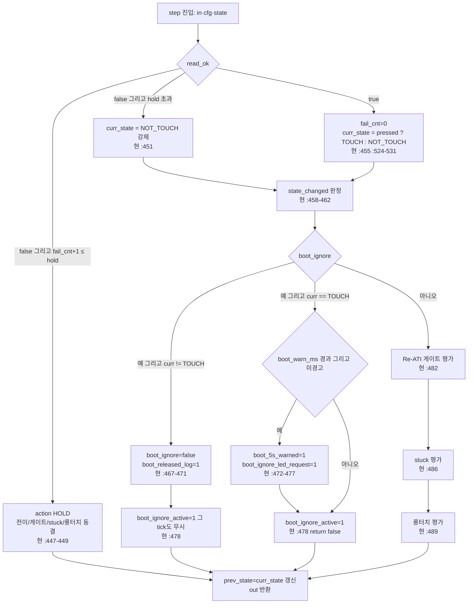

# 02 L2 순수 터치 FSM 설계

**TL;DR**: 현 `tdc_touch.c`의 FSM 로직은 시간(`ci_timer_get_tick()`)·HW 호출(`tdc_drv_iqs323_*`)·5묶음 분산 static이 본문에 섞여 있어 비결정·비테스트다. L2는 이를 **단일 순수 함수 `tdc_touch_fsm_step(state*, in*, out*)`**로 통합한다. 입력=`{tick_ms, pressed, ati_error, ati_active, read_ok}`, 출력=`{action(none/re_ati/reseed/mclr/long_touch), state_changed, boot_ignore_led}`. 분산 static 4묶음(process·long_touch·re_ati_gate·stuck)을 단일 구조체 `tdc_touch_fsm_state_t`로 모은다. 게이트 4조건·쿨다운(tick 차분 아닌 절대시각 비교로 결정화)·stuck 3단계·read_fail hold·부팅 무시를 모두 순수 분기로. 시간 상수(`POLL_INTERVAL`·`LONG_TOUCH_MS`·`STUCK_MS`·쿨다운·hold)는 L3/config가 주입하거나 컴파일 상수로 step에 전달. **회귀 0 핵심**: 쿨다운을 카운트(`s_cooldown--`)에서 절대시각(`re_ati_cooldown_until_ms`)으로 바꿔도 동작 동등(폴링 등간격 전제), read_fail hold의 "동결" 의미(전이 평가 자체 스킵)를 액션 `HOLD`로 명시 보존, stuck/long_touch의 TOUCH-진입-엣지(`s_prev != TOUCH`) 판정을 구조체 필드로 보존.

---

## 1. 현 코드 진단 — 왜 순수화가 필요한가

### 1.1 분산 static 인벤토리 (소유 레이어 = 현재 전부 tdc_touch.c)

L2가 흡수해야 할 상태(현 위치 → FSM 구조체 필드):

| 현 static | 위치 [파일:라인] | 의미 | FSM 필드 |
|---|---|---|---|
| `s_touch_state_old` | `tdc_touch.c:41` | process 레벨 직전 상태 | `prev_state` |
| `s_last_ati_error` | `tdc_touch.c:45` | 직전 read의 ATI Error 캐시 | (입력으로 격상 — 1.3 참조) |
| `s_last_ati_active` | `tdc_touch.c:46` | 직전 read의 ATI Active 캐시 | (입력으로 격상) |
| `s_read_fail_cnt` | `tdc_touch.c:48` | read 연속 실패 횟수 | `read_fail_cnt` |
| `s_boot_touch_ignore` | `tdc_touch.c:53` | 부팅 터치 무시 플래그 | `boot_ignore` |
| `s_boot_ready_tick` | `tdc_touch.c:54` | READY 전이 시각 | `boot_ready_ms` |
| `s_boot_5s_warned` | `tdc_touch.c:55` | 부팅 5초 경고 1회 래치 | `boot_5s_warned` |
| `proc_long_touch::s_state_old` | `tdc_touch.c:87` | 롱터치용 직전 상태 | `lt_prev_state` |
| `proc_long_touch::s_tick_first_touch` | `tdc_touch.c:88` | 터치 진입 시각 | `lt_first_touch_ms` |
| `proc_long_touch::s_is_long_touch` | `tdc_touch.c:89` | 롱터치 발동 래치 | `lt_latched` |
| `proc_re_ati_gate::s_cooldown` | `tdc_touch.c:226` | Re-ATI 쿨다운 카운트(폴링 횟수) | `re_ati_cooldown_until_ms` (절대시각화) |
| `proc_stuck_timeout::s_stuck_tick0` | `tdc_touch.c:254` | stuck 단계 기준 시각 | `stuck_anchor_ms` |
| `proc_stuck_timeout::s_prev` | `tdc_touch.c:255` | stuck용 직전 상태 | `stuck_prev_state` |
| `proc_stuck_timeout::s_stage` | `tdc_touch.c:256` | stuck 에스컬레이션 단계 0/1/2 | `stuck_stage` |
| `s_touch_tick_old` | `tdc_touch.c:40` | 폴링 게이팅 직전 tick | **L3 소유**(폴링 게이팅은 어댑터, 1.4 참조) |

> [!NOTE]
> `s_init_state`·`s_mclr_done_tick`(`tdc_touch.c:36·37`)는 **초기화 상태머신**이라 별도 — 본 L2(운용 FSM)와 분리한다. 초기화 FSM은 HW 의존(`mclr_reset`·`apply_settings`·`is_auto_ati_done`)이 본질이라 L1+L3 어댑터로 두고, L2는 **READY 이후 운용 폴링 FSM**만 순수화한다(06 파일구성·04 어댑터와 경계 협의 필요 [실측 게이트: 종합 노드 조정]).

### 1.2 시간 결합 지점 (순수화 시 인자로 치환)

`ci_timer_get_tick()` 직접 호출 — 전부 `in.tick_ms` 인자로:

- `proc_long_touch`: `:98·110·130` (first_touch 기록·경과 비교)
- `proc_stuck_timeout`: `:268·273·275·295` (anchor 기록·30초 비교·재카운트·RTT 드레인)
- `tdc_touch_process`: `:434`(curr_tick), `:472`(부팅 5초 비교)

### 1.3 HW 결합 지점 (순수화 시 출력 액션으로 치환)

| 현 HW 호출 [파일:라인] | 의미 | L2 출력 액션 |
|---|---|---|
| `tdc_drv_iqs323_re_ati_trigger()` `:237` | 게이트 Re-ATI 발행 | `TDC_TOUCH_ACTION_RE_ATI` |
| `tdc_drv_iqs323_reseed_only()` `:281` | stuck stage0 RESEED | `TDC_TOUCH_ACTION_RESEED` |
| `tdc_drv_iqs323_re_ati_trigger()` `:288` | stuck stage1 Re-ATI | `TDC_TOUCH_ACTION_RE_ATI` |
| `SYS_WATCHDOG_RESET()` `:300` | stuck stage2 MCLR | `TDC_TOUCH_ACTION_MCLR` |
| `tdc_drv_iqs323_read_status_full()` `:505` | 상태 read | **L3가 호출 후 결과를 `in`으로 주입**(read는 L2 밖) |
| `led_request(...DBG_LONG_TOUCH_IGNORE)` `:476` | 부팅 5초 보라 LED | `out.boot_ignore_led_request`(불리언) |

> [!IMPORTANT]
> **`s_last_ati_error/active` 캐시의 급소(`tdc_touch.c:507~522`)는 L1↔L3 경계로 이동**. read 실패 시 캐시 false 무효화(`:512·513`)는 L2가 `read_ok=false`를 받으면 `ati_error/active`를 그 입력에서 이미 false로 간주하면 순수 보존된다. 즉 L3가 read 실패 시 `in.ati_error=false, in.ati_active=false, in.read_ok=false`로 채워 L2에 넘기면 캐시 무효화 동작이 입력 정규화로 흡수된다(전역 캐시 제거). **이것이 race 제거의 핵심**(03 L1경계·07 검증 노드와 교차확인 필요).

### 1.4 폴링 게이팅은 L2 밖 (L3 소유)

`if (TDC_TOUCH_POLL_INTERVAL <= curr_tick - s_touch_tick_old)` (`:436`)는 **시간 게이팅**이라 L3 어댑터 책임. L2 `step`은 "폴링 tick이 도래했을 때 1회" 호출되는 전제. 단, read_fail hold의 "동결"은 폴링 게이팅과 별개(폴링은 됐으나 read 실패) → L2 안에서 처리.

---

## 2. L2 인터페이스 설계 (시그니처 확정)

신규 파일: **`tdc_touch_fsm.h` / `tdc_touch_fsm.c`** (06 파일구성 노드와 합치).
의존: `<stdbool.h>`, `<stdint.h>`, `tdc_touch.h`(상태 enum 재사용)만. **HW 헤더·timer 헤더 #include 금지**(순수성 컴파일 강제).

### 2.1 액션 enum (출력 — L3가 L1 호출로 변환)

```c
/* tdc_touch_fsm.h */
typedef enum
{
    TDC_TOUCH_ACTION_NONE = 0,   /* 무동작 */
    TDC_TOUCH_ACTION_HOLD,       /* read 실패 hold — 상태/게이트/stuck/롱터치 평가 동결(현 :449 return false) */
    TDC_TOUCH_ACTION_RE_ATI,     /* Re-ATI 발행 요청 (게이트 드리프트 또는 stuck stage1) */
    TDC_TOUCH_ACTION_RESEED,     /* RESEED 발행 요청 (stuck stage0) */
    TDC_TOUCH_ACTION_MCLR        /* MCLR 재부팅 요청 (stuck stage2) */
} tdc_touch_fsm_action_t;
```

> [!NOTE]
> **롱터치는 액션이 아닌 출력 플래그**로 둔다. 현 코드에서 롱터치는 `tdc_touch_process()`의 `return true`(절전 트리거)이지 HW 액션이 아니다(`:489~492`). 따라서 `out.long_touch_fired`(불리언)로 분리 — 액션 enum과 직교(한 step에서 stuck RESEED와 동시 발생 불가하나, 개념 분리가 명확). 절전 ULP의 롱터치(2.2초)도 동일 플래그로 표현되어 노말/절전 어댑터가 공유(4.3).

### 2.2 입력 구조체 (L3가 채워 주입)

```c
typedef struct
{
    uint32_t tick_ms;     /* 현재 절대시각 ms (ci_timer_get_tick() 주입). 절대시각 차분 기반. */
    bool     read_ok;     /* read_status_full 성공 여부. false면 ati_error/active 무시(false 정규화). */
    bool     pressed;     /* read_ok=true 시 유효: 터치 눌림. */
    bool     ati_error;   /* read_ok=true 시 유효: ATI Error 보고(드리프트 신호). */
    bool     ati_active;  /* read_ok=true 시 유효: ATI burst 진행 중. */
} tdc_touch_fsm_in_t;
```

> [!IMPORTANT]
> **L3 책임(입력 정규화)**: read 실패 시 L3는 반드시 `read_ok=false, pressed=false, ati_error=false, ati_active=false`로 채운다. 이로써 현 `:512·513`의 캐시 무효화가 입력 단계에서 보장되고 L2는 stale 캐시를 가질 수 없다(전역 제거 → race 0). `pressed`는 L1 `read_status_full`의 첫 out param, `ati_error/active`는 2·3번째 out param 직결.

### 2.3 출력 구조체 (L3가 L1 호출·반환으로 변환)

```c
typedef struct
{
    tdc_touch_fsm_action_t action;            /* 발행할 HW 액션 (L3→L1) */
    bool                   long_touch_fired;  /* 롱터치 발동(절전 트리거) — 현 process return true */
    bool                   state_changed;     /* prev_state != curr_state (STATE 로그용) */
    tdc_touch_state_t      curr_state;        /* 이번 step 산출 상태 (로그·디버그용) */
    tdc_touch_state_t      prev_state;        /* 천이 로그용 직전 상태 */
    bool                   boot_ignore_active;     /* 부팅 무시 구간(상위가 입력 무시 판단) */
    bool                   boot_ignore_led_request;/* 부팅 5초 보라 LED 1회 요청 — 현 :476 */
    bool                   boot_released_log;      /* 부팅 무시 해제 로그 1회 — 현 :470 */
} tdc_touch_fsm_out_t;
```

### 2.4 상태 구조체 (1.1 분산 static 통합 — 단일 소유)

```c
typedef struct
{
    /* --- process 레벨 --- */
    tdc_touch_state_t prev_state;        /* 현 s_touch_state_old */
    int               read_fail_cnt;     /* 현 s_read_fail_cnt */

    /* --- 부팅 무시 --- */
    bool              boot_ignore;       /* 현 s_boot_touch_ignore */
    uint32_t          boot_ready_ms;     /* 현 s_boot_ready_tick */
    bool              boot_5s_warned;    /* 현 s_boot_5s_warned */

    /* --- 롱터치 --- */
    tdc_touch_state_t lt_prev_state;     /* 현 proc_long_touch::s_state_old */
    uint32_t          lt_first_touch_ms; /* 현 s_tick_first_touch */
    bool              lt_latched;        /* 현 s_is_long_touch */

    /* --- Re-ATI 게이트 --- */
    uint32_t          re_ati_cooldown_until_ms; /* 현 s_cooldown(카운트)→절대시각 만료 시점 */
    bool              re_ati_cooldown_armed;    /* 쿨다운 활성 여부(시각0 모호성 제거) */

    /* --- stuck 에스컬레이션 --- */
    uint32_t          stuck_anchor_ms;   /* 현 proc_stuck_timeout::s_stuck_tick0 */
    tdc_touch_state_t stuck_prev_state;  /* 현 s_prev */
    uint8_t           stuck_stage;       /* 현 s_stage (0/1/2) */
} tdc_touch_fsm_state_t;
```

### 2.5 설정 구조체 (시간 상수 주입 — 04 어댑터와 합치)

순수성·노말/절전 두 시간축(4.3)을 위해 상수를 구조체로 주입한다. L3가 config 매크로(`TDC_TOUCH_POLL_INTERVAL`·`LONG_TOUCH_MS`·`STUCK_MS`·쿨다운·hold)에서 채운다.

```c
typedef struct
{
    uint32_t long_touch_ms;        /* TDC_TOUCH_LONG_TOUCH_MS (노말) / ULP_LONG_TOUCH_MS(절전) */
    uint32_t stuck_timeout_ms;     /* TDC_TOUCH_STUCK_TIMEOUT_MS (0이면 stuck 비활성) */
    uint32_t re_ati_cooldown_ms;   /* RE_ATI_COOLDOWN_CNT × POLL_INTERVAL = ms로 환산(04 파생) */
    int      read_fail_hold_cnt;   /* TDC_TOUCH_READ_FAIL_HOLD_CNT */
    uint32_t boot_warn_ms;         /* 부팅 5초 경고 (현 하드코딩 5000 → 상수화, :472) */
    bool     gate_enable;          /* FULL_ATI && RE_ATI_GATE */
    bool     stuck_enable;         /* FULL_ATI && (STUCK_MS>0) — 또는 stuck_timeout_ms>0으로 대체 */
} tdc_touch_fsm_cfg_t;
```

> [!NOTE]
> 쿨다운은 현재 폴링 횟수(N=10)지만 **절대시각화**하면 `re_ati_cooldown_ms = RE_ATI_COOLDOWN_CNT × POLL_INTERVAL_MS`(=10×200=2000ms)로 환산해 주입한다. 폴링이 등간격이면 카운트 감소와 시각 비교는 **수학적 동등**(B99 §4.3의 "+10 tick=2000ms" 표와 일치). 비등간격(read hold로 게이트 미호출 tick)에서도 "쿨다운은 게이트 미호출 tick에서 감소 안 함"(B99 §4.3)이 절대시각으로는 자동 보존(시각만 흐르고 만료 비교는 동일) — **오히려 의미가 더 명확**. 단 read hold 동안 시간이 흐르므로 미세 차이 가능 → 회귀 검증 항목(07).

### 2.6 step 함수 시그니처 (핵심 — 테스트 진입점)

```c
/* 순수 함수. 전역·HW·timer 접근 0. 동일 입력→동일 출력(state*는 in-out).
 * L3가 폴링 tick 1회당 1회 호출. read_ok=false면 in의 pressed/ati_*는 false 정규화 전제.
 * 반환: out 구조체(액션·롱터치·로그 플래그). state*는 다음 호출용으로 갱신. */
void tdc_touch_fsm_step(tdc_touch_fsm_state_t       *state,
                        const tdc_touch_fsm_cfg_t   *cfg,
                        const tdc_touch_fsm_in_t    *in,
                        tdc_touch_fsm_out_t         *out);

/* 상태 구조체 초기화 (READY 전이 시 L3가 호출 — 현 try_finish_init() :364·365 대응).
 * now_ms = 현재 시각(boot_ready_ms 등 기준). */
void tdc_touch_fsm_init(tdc_touch_fsm_state_t *state, uint32_t now_ms);

/* 부팅 무시 진입 설정 (READY 직후 터치 중이면 — 현 :420~424).
 * L3가 첫 read 결과로 boot 터치 판정 후 호출. */
void tdc_touch_fsm_set_boot_ignore(tdc_touch_fsm_state_t *state, uint32_t now_ms);
```

> [!NOTE]
> **분할 변형(테스트 입자 더 작게)**: `step` 내부를 보조 순수 함수로 쪼개 단위 테스트 입자를 줄인다 — `fsm_eval_state()`(pressed→curr_state·read_fail hold), `fsm_eval_re_ati_gate()`(4조건), `fsm_eval_stuck()`(3단계 anchor), `fsm_eval_long_touch()`(엣지·경과). 05 테스트구조 노드가 이 입자별 케이스를 설계. 공개 step은 이들의 순서 조합(현 `process` `:445→482→486→489` 순서 보존).

---

## 3. 상태머신·이벤트·전이 (순수 분기로 재현)

### 3.1 상태 (현 enum 재사용 — `tdc_touch.h:33`)

`RESET`(초기) · `TOUCH` · `NOT_TOUCH` · `CALIBRATION_ERROR`(미사용 유지). L2 운용 FSM은 `TOUCH`/`NOT_TOUCH`만 산출(`get_state`가 pressed로 이분, `:524~531`). 초기화 FSM(READY 전 NONE/MCLR_DONE/READY)은 L2 밖.

### 3.2 step 내부 처리 순서 (현 process 순서 보존 — 회귀 0)



### 3.3 이벤트 → 전이·액션표 (B99 §3 전수 보존)

| # | 이벤트 | 입력(in) | curr_state | prev_state 천이 | 출력 action / long_touch_fired | 현 근거 |
|---|---|---|---|---|---|---|
| E1 | 노터치→터치 | read_ok,pressed=1,active=0 | TOUCH | NOT_TOUCH→TOUCH | NONE / false (stuck anchor 기록·stage=0, lt first_touch 기록) | `:524 :266-270 :96-100` |
| E2 | 터치 유지(<LT) | read_ok,pressed=1 | TOUCH | 무변 | NONE / false (stuck 누적, lt 미달) | `:104-116` |
| E3 | 터치 유지(=LT 도달) | read_ok,pressed=1 | TOUCH | 무변 | NONE / **true**(lt_latched=true) | `:108-114` |
| E4 | 터치 해제 | read_ok,pressed=0,active=0 | NOT_TOUCH | TOUCH→NOT_TOUCH | NONE / false (stuck 리셋 stage=0, lt 래치 해제) | `:258-262 :117-119` |
| E5 | 드리프트(게이트 발행) | read_ok,pressed=0,error=1,active=0,쿨다운만료 | NOT_TOUCH | 변화 시 로그 | **RE_ATI** / false (cooldown_until=tick+cooldown_ms) | `:234-239` |
| E5' | 드리프트 쿨다운 중 | …,cooldown 미만료 | NOT_TOUCH | — | NONE / false (보류) | `:228-234` |
| E5'' | ATI 진행 중 | …,active=1 | NOT_TOUCH | — | NONE / false (active로 차단) | `:234` |
| E6 | read 실패(≤hold) | read_ok=false, fail_cnt+1≤N | (미설정) | **평가 안 함 동결** | **HOLD** / false | `:445-449` |
| E7 | read 실패(>hold) | read_ok=false, fail_cnt+1>N | NOT_TOUCH 강제 | →NOT_TOUCH | NONE / false (게이트 error=false라 미발행, stuck 리셋, lt 해제) | `:451` |
| E8 | 롱터치 발동 | E3 동일 | TOUCH | TOUCH | NONE / **true → 절전** | `:489-492` |
| E9 | 부팅 무시(터치 지속) | boot_ignore=1,pressed=1 | TOUCH | 로그 가능 | NONE / false (게이트·stuck·lt 도달 전 차단, boot_ignore_active=1) | `:465-478` |
| E10 | 부팅 무시 해제 | boot_ignore=1,curr!=TOUCH | NOT_TOUCH | 로그 | NONE / false (boot_ignore=0, 그 tick도 무시) | `:467-471 :478` |
| S1 | stuck stage0→1 | TOUCH, anchor 경과≥STUCK_MS | TOUCH | TOUCH | **RESEED** / false (anchor 갱신, stage=1) | `:273-283` |
| S2 | stuck stage1→2 | TOUCH 추가 STUCK_MS | TOUCH | TOUCH | **RE_ATI** / false (stage=2, 게이트 우회) | `:285-290` |
| S3 | stuck stage2→MCLR | TOUCH 추가 STUCK_MS | TOUCH | TOUCH | **MCLR** / false (RTT 드레인은 L3) | `:292-301` |

> [!CAUTION]
> **stuck stage2의 RTT 드레인 20ms busy(`:295~299`)는 부수효과**(시간 소비)라 L2 순수에서 제외 → L3가 `action==MCLR` 수신 시 드레인 후 `SYS_WATCHDOG_RESET()` 호출. L2는 `MCLR` 액션만 반환. **stuck stage0/stage1의 RESEED/RE_ATI도 액션 반환 후 anchor 갱신은 L2 내부**(시각 인자로 순수). 한 step에서 stuck 액션과 게이트 액션이 충돌할 수 있으나(둘 다 TOUCH/NOT_TOUCH 배타라 실제 충돌 0: 게이트는 NOT_TOUCH 전용·stuck은 TOUCH 전용) **action 단일 필드로 안전**(E5는 NOT_TOUCH라 stuck early-return, S1~S3는 TOUCH라 게이트 미발행). 검증 노드(07) 교차확인.

### 3.4 쿨다운 절대시각화 — 카운트 동등성 증명 스케치

현: `s_cooldown` 발행 시 10, 매 게이트 호출 선감소, 0이면 재발행 가능(`:226~239`). 폴링 등간격 `T_poll`에서 발행 후 10×`T_poll`(=2000ms) 경과에 재발행(B99 §4.3 표).

L2: `re_ati_cooldown_until_ms = in.tick_ms + cfg->re_ati_cooldown_ms`. 재발행 조건 `in.tick_ms >= re_ati_cooldown_until_ms`. `re_ati_cooldown_ms = N × T_poll`이면 발행 후 N tick째에 `tick_ms`가 정확히 만료 도달 → **동등**.

> [!NOTE]
> **미세 차이(회귀 검증 게이트)**: 카운트 방식은 "게이트 호출 tick에서만 감소"(read hold·부팅무시 tick엔 미감소). 절대시각 방식은 시각이 그 tick에도 흐름. read hold가 길면 절대시각 쿨다운이 더 빨리 만료될 수 있음. 다만 ① read hold 중엔 게이트 평가 자체가 동결(HOLD)이라 발행 불가, ② hold 종료 후 `tick_ms`는 이미 흐른 값이라 첫 노터치 tick에서 만료 판정 → 실질 동등하거나 보수적. 만약 **완전 동등**을 원하면 `re_ati_cooldown_remaining_cnt`(카운트 그대로 구조체 필드화)로 보존 가능 — 이 경우 step이 "게이트 평가하는 tick에서만 감소"를 분기로 명시. **권장**: 절대시각화(의미 명확·테스트 결정론) + 07 검증에서 read hold 시나리오 동등성 확인 후 확정 [실측 게이트: 시뮬레이션 테스트].

---

## 4. 테스트 가능성·재사용 (요구사항_3·노말/절전 공유)

### 4.1 순수성 보장 메커니즘

- `tdc_touch_fsm.c`는 HW·timer·printf 헤더 **#include 금지**. 로그는 `out` 플래그로만(`state_changed`·`boot_*_log`) 표현, 실제 `ci_printf`는 L3가 출력.
- 모든 시각은 `in.tick_ms` 단일 소스. 내부 `ci_timer_get_tick()` 0회.
- 전역·static 0 (상태는 호출자 소유 `state*`). → 멀티 인스턴스 가능(노말/절전 각각 독립 state).

### 4.2 단위 테스트 진입점 (05 노드 상세)

호스트(PC) 컴파일 가능. 케이스 예:
- 게이트 4조건: NOT_TOUCH×active×error×쿨다운 조합 16케이스 중 발행 1케이스(E5)만 RE_ATI.
- stuck 3단계: TOUCH 지속 시각을 `STUCK_MS, 2×, 3×`로 주입 → RESEED→RE_ATI→MCLR 순차.
- read hold: read_ok=false를 N회 → HOLD×N, N+1회째 NOT_TOUCH 강제·롱터치 해제.
- 쿨다운: 발행 후 `re_ati_cooldown_ms` 미만/이상 tick → 차단/재발행.
- 롱터치 엣지: NOT_TOUCH→TOUCH first_touch 기록, `LONG_TOUCH_MS` 도달 1회만 fired.

### 4.3 노말/절전 어댑터 공유 (재사용)

절전 ULP 루프(`main.c:981~1037`)의 롱터치(2.2초, `ULP_LONG_TOUCH_COUNT`)도 **동일 `tdc_touch_fsm_step`로 표현 가능**:
- 절전 cfg: `long_touch_ms=ULP_LONG_TOUCH_MS(2200)`, `stuck_timeout_ms=0`(절전 stuck 미사용, 은수님 결정 B99 §2.3), `gate_enable=false`(절전 게이트 없음). `tick_ms=ULP timer 시각`.
- 절전 롱터치 발동 → `out.long_touch_fired=true` → L3가 `SYS_WATCHDOG_RESET()`(현 `:1015`).
- 절전은 `touch_cnt` 카운트(`:1010`)지만 L2 절대시각 롱터치로 환산 동등(첫 TOUCH 시각부터 `ULP_LONG_TOUCH_MS` 경과).

> [!IMPORTANT]
> **절전 재사용은 선택(권장)** — 현 ULP는 단순 카운트라 L2 도입 시 ULP timer 시각(`ci_timer_get_tick()` prescaled, B99 §2.3)을 `tick_ms`로 줘야 한다. 두 시간축(노말 1ms·절전 약 200ms/tick)을 L2가 `tick_ms` ms 통일로 흡수하면 한 FSM이 양쪽 커버. 단 절전 도입은 회귀 위험이 노말보다 크므로(은수님 "절전 미변경" 요구사항_4) **1차는 노말만 L2화, 절전 L2 재사용은 04/06/07 합의 후 옵션** [실측 게이트: 절전 회귀 검증].

---

## 5. 미해결·결정 필요 (종합 노드 조정)

1. **초기화 FSM 경계**: NONE/MCLR_DONE/READY 초기화 상태머신(`:36 :406~431`)은 HW 본질이라 L2 밖(L3+L1). L2는 READY 운용만. 06 파일구성·04 어댑터가 초기화를 어느 레이어로 둘지 확정 필요. [결정 필요]
2. **쿨다운 절대시각 vs 카운트**: 3.4 — 절대시각화 권장하나 read hold 시 미세 차이. 완전 동등 원하면 카운트 필드 유지. 07 검증·은수님 결정. [실측 게이트: 시뮬 테스트]
3. **절전 L2 재사용 범위**: 4.3 — 노말 우선, 절전 옵션. 04/06/07 합의. [결정 필요]
4. **action 단일 vs 다중**: 3.3 — 게이트(NOT_TOUCH)·stuck(TOUCH) 배타라 단일 필드 안전 검증됨. 단 향후 동시 발생 케이스 추가 시 비트마스크 고려. [추정: 현재 단일 충분]
5. **롱터치 플래그 vs 액션**: 2.1 — 롱터치는 절전 트리거(상위 반환)라 액션 enum 밖 `long_touch_fired` 분리. 종합 노드 일관성 확인. [확정 권장]
6. **boot 5초 하드코딩 상수화**: `:472`의 `5000`을 `cfg->boot_warn_ms`로. 시간 상수 자동 파생(요구사항_1) 일관성. [확정 권장]
