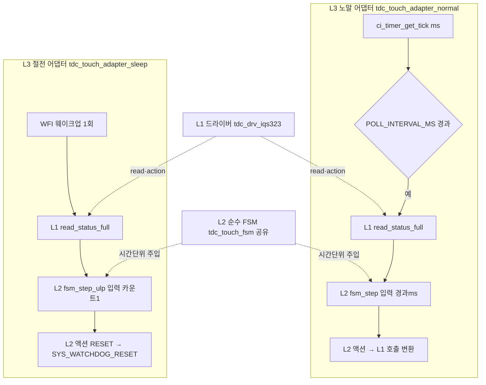

# 04 L3 시간·이벤트 어댑터 + 시간 상수 자동 파생

**TL;DR**: 현 코드는 시간 비교가 둘로 갈라져 있다 — **노말은 ms 절대시간 차분**(폴링 `200<=Δtick`·롱터치 `2400<=Δtick`·stuck `30000<=Δtick`, 카운트 파생 없음 [tdc_touch.c:436·110·273]), **절전은 웨이크업 카운트**(`ULP_LONG_TOUCH_COUNT=ceil(2200/200)=11` [main.c:812]). 카운트형 상수(쿨다운 10·readfail hold 10)는 ms 미연동 하드코딩 [config:183·210]. 설계: ① 단일 `tdc_touch_time.h`에 ms 상수 5종 + 파생 매크로 `TDC_TIME_TO_CNT(ms,interval)`(올림 나눗셈) 집약 → 은수님이 ms만 바꾸면 카운트 자동 갱신. ② L3를 **두 어댑터**(`tdc_touch_adapter_normal`·`tdc_touch_adapter_sleep`)로 분리 — 노말은 `ci_timer_get_tick()` ms 차분으로 게이팅·L2(`tdc_touch_fsm_step`) 호출·액션→L1 변환, 절전은 웨이크업 tick=1카운트 누적으로 L2 호출. 두 어댑터가 **공유 L2 FSM에 서로 다른 시간 단위(노말 ms / 절전 카운트)를 주입**한다. 동작 보존: 노말 ms 차분은 그대로 유지(파생 카운트는 보조), 절전은 기존 카운트 로직 등가. [실측 게이트] 쿨다운·hold ms 환산값은 t_ati 측정 후 확정.

---

## 1. 역할·경계 (L3가 무엇을 하는가)

L3 시간·이벤트 어댑터는 **순수 L2 FSM(HW 비의존)** 과 **L1 HW 드라이버(IQS323)** 사이의 시간·이벤트 접착층이다. 세 가지 책임만 진다.

| 책임 | 내용 | 현 코드 위치 |
|---|---|---|
| (가) 폴링 게이팅 | 시간 경과 판단 후 1폴링분 L2 호출 트리거 | `tdc_touch.c:436` (노말) / `main.c:983·1011` (절전 웨이크업) |
| (나) 시간 공급 | L2 입력으로 줄 "경과 시간/카운트" 산출 | `ci_timer_get_tick()` 차분(노말) / `touch_cnt++`(절전) |
| (다) 액션 변환 | L2가 돌려준 요청 액션을 L1 호출로 매핑 | `re_ati_trigger`·`reseed_only`·`SYS_WATCHDOG_RESET` 등 |

> [!IMPORTANT]
> L3는 시간을 **읽고**(L1/플랫폼 `ci_timer`) 액션을 **부른다**(L1 드라이버). L2는 시간을 **계산만** 한다(주입된 값으로). 따라서 `ci_timer_get_tick()`·`SYS_WATCHDOG_RESET()`·`tdc_drv_iqs323_*()` 호출은 **전부 L3에 격리**되고 L2에는 0건 — 이게 테스트 가능성의 핵심.

---

## 2. 현 시간축 인벤토리 (코드 근거)

### 2.1 노말 시간축 — ms 절대시간 차분 (카운트 파생 없음)

현 노말은 모든 시간 판정을 `ci_timer_get_tick()` ms 차분으로 직접 비교한다. **폴링 횟수로 환산하지 않는다.**

| 판정 | 코드 | 비교식 | 상수 출처 |
|---|---|---|---|
| 폴링 게이팅 | `tdc_touch.c:436` | `POLL_INTERVAL(200) <= (curr_tick - s_touch_tick_old)` | `tdc_touch.h:25` |
| 롱터치 | `tdc_touch.c:110` | `LONG_TOUCH_MS(2400) <= (tick - s_tick_first_touch)` | `tdc_touch.h:26` |
| stuck 30초 | `tdc_touch.c:273` | `STUCK_TIMEOUT_MS(30000) <= (tick - s_stuck_tick0)` | `config:196` |
| 부팅 5초 경고 | `tdc_touch.c:472` | `5000 <= (curr_tick - s_boot_ready_tick)` | 리터럴 5000 |
| 부팅 ATI 타임아웃 | `tdc_touch.c:319` | `INIT_TIMEOUT_MS(2500) < (t3 - s_mclr_done_tick)` | `tdc_touch.h:27` |

> B99 §4.2 명시: stuck 카운트는 "tick ms 절대시간 차분이라 200ms 폴링 지터(±200ms) 외 누적 오차 없음 — 폴링 100ms/200ms 차이는 30초 임계에 무영향" [B99:211]. 즉 **노말 시간 판정은 폴링 주기와 디커플링**되어 있다.

### 2.2 노말 카운트형 상수 — ms 미연동 하드코딩 (파생 결손)

반대로 폴링 **횟수** 단위 상수 2종은 ms와 무관하게 직접 박혀 있다. 폴링 주기 변경 시 의미가 바뀌는데 자동 보정이 없다.

| 상수 | 값 | 의미 | 현 환산(주석) | 코드 |
|---|---|---|---|---|
| `RE_ATI_COOLDOWN_CNT` | 10 | Re-ATI 재발행 금지 폴링 횟수 | "N=10 @200ms = 약 2초" | `config:182-183` |
| `READ_FAIL_HOLD_CNT` | 10 | read 실패 롱터치 hold 폴링 횟수 | "N=10 @200ms = 약 2초" | `config:209-210` |

소비처: `proc_re_ati_gate` `s_cooldown = RE_ATI_COOLDOWN_CNT` [tdc_touch.c:238], `++s_read_fail_cnt <= READ_FAIL_HOLD_CNT` [tdc_touch.c:447]. 둘 다 매 폴링 tick에서 1씩 감소/증가하는 **폴링 카운터**다. 주석이 "@200ms=2초"라 명시하나 코드상 200ms와 연결고리가 없다 — 폴링을 100ms로 바꾸면 실제 1초가 되는데 상수는 10으로 고정 → **요구사항_1이 정확히 노리는 결손**.

### 2.3 절전 시간축 — 웨이크업 카운트 (올림 나눗셈 파생 이미 존재)

절전 ULP는 노말과 완전히 다른 시간축이다. WFI로 약 200ms idle 후 1회 웨이크업하며, **웨이크업 횟수**로 시간을 잰다.

```c
/* main.c:808-812 — 절전 유일하게 올림 나눗셈 파생이 이미 존재 */
#define ULP_WAKE_INTERVAL_MS 200
#define ULP_LONG_TOUCH_MS    2200
#define ULP_LONG_TOUCH_COUNT ((ULP_LONG_TOUCH_MS + ULP_WAKE_INTERVAL_MS - 1) / ULP_WAKE_INTERVAL_MS)  /* = 11 */
```

소비처: `touch_cnt++` 후 `touch_cnt >= ULP_LONG_TOUCH_COUNT` 도달 시 `SYS_WATCHDOG_RESET()` [main.c:1010-1015]. 손 뗌·read 실패 시 `touch_cnt=0` 리셋 [main.c:1026·1035].

웨이크업 주기는 SW가 아니라 **타이머 HW**로 고정된다.

```c
/* main.c:814-819 — T[ms]=2^PRESCALE×(TIMEOUT+1)/40, 2^7×63/40=201.6ms ≈ 200 */
#define ULP_TIMER_PRESCALE      TIMER_PRESCALE_128
#define ULP_TIMER_TIMEOUT_VALUE 62
```

> [!NOTE]
> 절전은 `ci_timer_get_tick()` ms 차분을 **안 쓴다**(저속 클럭·WFI라 tick 신뢰 불가). 오로지 "웨이크업 1회 = 1카운트" 누적. 이 카운트 축이 노말 ms 축과 근본적으로 다르므로 **두 어댑터로 분리**해야 한다(요구사항_2 L3 = 노말·절전 두 어댑터).

### 2.4 두 시간축 대비 요약

| 항목 | 노말 어댑터 | 절전 어댑터 |
|---|---|---|
| 시간 소스 | `ci_timer_get_tick()` (1ms tick) | WFI 웨이크업 횟수 (HW 타이머 약 200ms) |
| 폴링 게이팅 | `POLL <= Δtick` (SW 비교) [tdc_touch.c:436] | HW 타이머 인터럽트 (자동) [main.c:983] |
| 롱터치 판정 | ms 차분 `2400<=Δtick` [tdc_touch.c:110] | 카운트 `cnt>=11` [main.c:1011] |
| stuck/쿨다운 | 적용 (ms·카운트) | 미적용 (ULP 2.2초 리셋이 전담, B99 §2.3) |
| 시간 단위 → L2 주입 | **경과 ms** | **누적 카운트** |

---

## 3. 시간 상수 자동 파생 설계 (요구사항_1)

### 3.1 신규 파일 `tdc_touch_time.h` — ms 상수 + 파생 매크로 단일 집약

현 분산(`tdc_touch.h:25-27` 노말, `config:183·196·210` 카운트/stuck, `main.c:808-819` 절전)을 **한 파일로 모은다**. 은수님이 여기 ms만 바꾸면 파생값이 전부 따라온다.

```c
/* tdc_touch_time.h — 시간 상수 한 곳. ms만 수정하면 카운트/임계 자동 파생. */
#ifndef TDC_TOUCH_TIME_H_
#define TDC_TOUCH_TIME_H_

/* ── 핵심 파생 매크로: ms를 폴링 주기로 나눠 올림(최소 1회 보장) ── */
#define TDC_TIME_TO_CNT(ms, interval_ms)  (((ms) + (interval_ms) - 1) / (interval_ms))

/* ====================================================================
 *  (A) 노말 모드 시간축 — ci_timer ms 차분 기준
 * ==================================================================== */
#define TDC_TOUCH_POLL_INTERVAL_MS   200    /* 폴링 주기 (ms) */
#define TDC_TOUCH_LONG_TOUCH_MS      2400   /* 롱터치 → 절전 (ms) */
#define TDC_TOUCH_INIT_TIMEOUT_MS    2500   /* 부팅 auto-ATI 대기 타임아웃 (ms) */
#define TDC_TOUCH_BOOT_WARN_MS       5000   /* 부팅 터치 5초 경고 (ms) — 리터럴 승격 */
#define TDC_TOUCH_STUCK_TIMEOUT_MS   30000  /* stuck 단계 간격 (ms) */

/* ms 기반 카운트형 상수 → ms 상수에서 자동 파생 (요구사항_1 핵심) */
#define TDC_TOUCH_RE_ATI_COOLDOWN_MS   2000  /* Re-ATI 재발행 금지 구간 (ms) */
#define TDC_TOUCH_READ_FAIL_HOLD_MS    2000  /* read 실패 롱터치 hold 구간 (ms) */

#define TDC_TOUCH_RE_ATI_COOLDOWN_CNT \
    TDC_TIME_TO_CNT(TDC_TOUCH_RE_ATI_COOLDOWN_MS, TDC_TOUCH_POLL_INTERVAL_MS)  /* @200=10 */
#define TDC_TOUCH_READ_FAIL_HOLD_CNT \
    TDC_TIME_TO_CNT(TDC_TOUCH_READ_FAIL_HOLD_MS, TDC_TOUCH_POLL_INTERVAL_MS)   /* @200=10 */

/* ====================================================================
 *  (B) 절전 ULP 시간축 — 웨이크업 카운트 기준
 * ==================================================================== */
#define TDC_TOUCH_ULP_WAKE_MS         200   /* 웨이크업 주기 (ms) — HW 타이머와 일치시킬 것 */
#define TDC_TOUCH_ULP_POLL_MS         200   /* 절전 폴링 주기 (ms) = 웨이크업당 1샘플 */
#define TDC_TOUCH_ULP_LONG_TOUCH_MS   2200  /* 절전 롱터치 → 리셋 (ms) */

#define TDC_TOUCH_ULP_LONG_TOUCH_CNT \
    TDC_TIME_TO_CNT(TDC_TOUCH_ULP_LONG_TOUCH_MS, TDC_TOUCH_ULP_WAKE_MS)  /* @200=11 */

/* 절전 HW 타이머 — ULP_WAKE_MS 변경 시 재계산 필요(자동 파생 불가, [실측 게이트])
 * 공식: T[ms]=2^PRESCALE×(TIMEOUT+1)/40 (SLOWCLK 40kHz). 2^7×63/40=201.6ms. */
#define TDC_TOUCH_ULP_TIMER_PRESCALE       TIMER_PRESCALE_128
#define TDC_TOUCH_ULP_TIMER_TIMEOUT_VALUE  62

#endif /* TDC_TOUCH_TIME_H_ */
```

### 3.2 파생 매크로 동작 검증 (올림 나눗셈)

`TDC_TIME_TO_CNT(ms, interval) = ((ms)+(interval)-1)/(interval)` — 정수 올림. 현 값 등가성:

| 호출 | 계산 | 결과 | 현 코드 값 | 등가? |
|---|---|---|---|---|
| `TDC_TIME_TO_CNT(2200, 200)` | (2200+199)/200=2399/200 | 11 | `ULP_LONG_TOUCH_COUNT`=11 [main.c:812] | 일치 |
| `TDC_TIME_TO_CNT(2000, 200)` | (2000+199)/200=2199/200 | 10 | `RE_ATI_COOLDOWN_CNT`=10 [config:183] | 일치 |
| `TDC_TIME_TO_CNT(2000, 200)` | 동일 | 10 | `READ_FAIL_HOLD_CNT`=10 [config:210] | 일치 |

> [!CAUTION]
> **괄호 필수**: 모든 인자·전체식 괄호. `(((ms)+(interval)-1)/(interval))` — `ms=200, interval=200` 같은 표현식 인자에서 우선순위 오류 방지. 또 **0 division 가드**: `interval`은 빌드타임 양수 상수라 런타임 0 불가, 단 `#if TDC_TOUCH_POLL_INTERVAL_MS == 0`+`#error` 추가로 오타 방어 권장.

### 3.3 노말 ms 차분은 "그대로 유지" — 파생 카운트는 보조 (동작 보존 급소)

> [!IMPORTANT]
> 롱터치·stuck·폴링 게이팅의 **ms 차분 비교는 절대 카운트 비교로 바꾸지 않는다.** 현 코드가 `2400<=Δtick`(ms 직접)이라 폴링 지터 외 누적 오차가 0인데 [B99:211], 카운트 비교(`cnt>=12`)로 바꾸면 폴링 지터가 누적되어 **회귀**가 된다. 파생 카운트(`RE_ATI_COOLDOWN_CNT`·`READ_FAIL_HOLD_CNT`)는 원래 **카운터형 상수**(매 폴링 1증감)였던 2종에만 적용. 롱터치/stuck은 ms 차분 그대로, 단지 상수 출처만 `tdc_touch_time.h`로 이동.

이로써 요구사항_1("상수만 바꾸면 동작")은 **두 결을 다르게** 만족한다.
- ms 차분 판정(롱터치·stuck·폴링): ms 상수 자체가 비교값이라 ms 변경=즉시 반영 (파생 불필요).
- 카운트 판정(쿨다운·hold·절전 롱터치): ms÷주기 올림 파생으로 ms 변경 시 카운트 자동 재계산.

---

## 4. L3 두 어댑터 인터페이스 설계 (요구사항_2)

### 4.1 어댑터 구조 — 공유 L2에 서로 다른 시간 단위 주입



> [!NOTE]
> L2 인터페이스(`tdc_touch_fsm_step`)의 정확한 시그니처·입출력 구조체는 02 노드(L2 순수 FSM) 소관. 본 04는 **L3가 L2를 어떻게 호출하고 시간을 어떻게 주입하는지**만 규정한다. [추정] L2가 `int now_ms` 또는 `uint32_t elapsed` 같은 단위 중립 시간 입력을 받고, 절전 경로는 "1 호출 = ULP_WAKE_MS 경과"로 환산해 동일 함수를 재사용 — 단위 통일을 02와 합의 필요(§7 미해결).

### 4.2 노말 어댑터 — `tdc_touch_adapter_normal.c/.h`

현 `tdc_touch_process()` READY 분기 [tdc_touch.c:428-496]를 어댑터로 추출. ms 차분 게이팅 + L2 호출 + 액션 변환.

```c
/* tdc_touch_adapter_normal.h */
#ifndef TDC_TOUCH_ADAPTER_NORMAL_H_
#define TDC_TOUCH_ADAPTER_NORMAL_H_
#include <stdbool.h>

/* POWER_ON 1회 — 내부 L1 MCLR 트리거 + FSM 초기화 (현 tdc_touch_init_begin 등가) */
void tdc_touch_adapter_normal_init(void);

/* 매 iteration 1회. 내부에서 POLL_INTERVAL_MS 게이팅.
 * 반환 true = 롱터치 발동(절전 트리거). 현 tdc_touch_process() 시그니처 보존. */
bool tdc_touch_adapter_normal_tick(void);

#endif
```

내부 흐름(현 동작 1:1 보존):

```c
bool tdc_touch_adapter_normal_tick(void)
{
    int now = ci_timer_get_tick();                     /* L3: 시간 읽기 */
    if (TDC_TOUCH_POLL_INTERVAL_MS > (now - s_last))   /* L3: 게이팅 [tdc_touch.c:436 등가] */
        return false;
    s_last = now;

    tdc_touch_io_t io;                                  /* L1 read 결과 → L2 입력 */
    bool ok = tdc_drv_iqs323_read_status_full(&io.pressed, &io.ati_error, &io.ati_active);

    tdc_touch_action_t act = tdc_touch_fsm_step(&s_fsm, ok, &io, now);  /* L2 순수 호출 */

    /* L3: L2 액션 → L1 호출 변환 (액션 enum → 드라이버 함수) */
    switch (act.kind) {
        case TDC_ACT_RE_ATI:    (void) tdc_drv_iqs323_re_ati_trigger(); break;  /* [:237·288] */
        case TDC_ACT_RESEED:    (void) tdc_drv_iqs323_reseed_only();    break;  /* [:281] */
        case TDC_ACT_MCLR_RESET: drain_rtt(); SYS_WATCHDOG_RESET();     break;  /* [:300] */
        case TDC_ACT_LED_WARN:  led_request(LED_SRC_DBG, LED_ST_DBG_LONG_TOUCH_IGNORE); break;
        case TDC_ACT_NONE:      default: break;
    }
    return act.long_touch;   /* 롱터치 발동 1회 래치는 L2가 판정 [tdc_touch.c:489] */
}
```

> 액션 enum 명세(L2가 돌려주고 L3가 소비)는 03(L1 경계)·02(L2)와 정합 필요. **L3는 액션→함수 매핑 테이블만 소유**, 어떤 액션을 언제 낼지는 L2 책임.

### 4.3 절전 어댑터 — `tdc_touch_adapter_sleep.c/.h`

현 `func_sleep()` ULP 루프 [main.c:981-1037]를 어댑터로 추출. 웨이크업당 1샘플 + 카운트 누적 + 리셋 액션.

```c
/* tdc_touch_adapter_sleep.h */
#ifndef TDC_TOUCH_ADAPTER_SLEEP_H_
#define TDC_TOUCH_ADAPTER_SLEEP_H_
#include <stdbool.h>

/* 절전 진입 시 1회 — HW 타이머 프리스케일 적용 + 카운트 리셋.
 * (현 ci_timer_init_prescaled + touch_cnt=0 [main.c:968·972] 등가) */
void tdc_touch_adapter_sleep_enter(void);

/* 매 웨이크업 1회 호출. 내부에서 1샘플 + 롱터치 카운트.
 * 반환 true = 절전 롱터치 도달(호출측이 SYS_WATCHDOG_RESET 수행).
 * — 리셋을 어댑터 내부에서 직접 부를지(현 동작)·반환만 할지는 §7 결정 사항. */
bool tdc_touch_adapter_sleep_wake(void);

#endif
```

내부 흐름(현 동작 등가, 카운트 축):

```c
bool tdc_touch_adapter_sleep_wake(void)
{
    /* L3: 웨이크업 1회 = ULP_WAKE_MS 경과. 게이팅은 HW 타이머가 이미 수행. */
    tdc_touch_state_t st;
    if (!tdc_touch_get_state(&st))   /* L1 read (현 main.c:993) */
    {
        s_touch_cnt = 0;             /* read 실패 → 리셋 [main.c:1035] */
        return false;
    }
    if (st == TDC_TOUCH_STATE_TOUCH)
    {
        if (++s_touch_cnt >= TDC_TOUCH_ULP_LONG_TOUCH_CNT)  /* 파생 카운트 [main.c:1011] */
            return true;             /* 롱터치 도달 → 리셋 신호 */
    }
    else
    {
        s_touch_cnt = 0;             /* 손 뗌 → 리셋 [main.c:1026] */
    }
    return false;
}
```

> [!IMPORTANT]
> 절전 어댑터는 **노말의 Re-ATI 게이트·stuck 30초를 호출하지 않는다** — B99 §2.3 "절전 경로에 proc_re_ati_gate·proc_stuck_timeout 호출 0건" [B99:136]. 절전 stuck은 ULP 2.2초 리셋이 전담(은수님 결정). 두 어댑터가 같은 L2 FSM을 쓰되 **절전은 롱터치(카운트)만 평가**하는 축소 경로다. L2가 모드 플래그(`is_ulp`)로 게이트/stuck 분기를 차단하도록 02와 합의.

### 4.4 어댑터 분리의 동작 보존 매핑

| 현 코드 | 신규 위치 | 보존 근거 |
|---|---|---|
| `tdc_touch_process()` READY [tdc_touch.c:428] | `adapter_normal_tick()` | ms 게이팅·게이트·stuck·롱터치 순서 [tdc_touch.c:482·486·489] 그대로 |
| 폴링 게이팅 `200<=Δtick` [:436] | `adapter_normal_tick` 첫 분기 | 비교식·상수 동일(출처만 time.h) |
| ULP 루프 [main.c:981-1037] | `adapter_sleep_wake()` | 카운트 증감·리셋 조건 동일 |
| `ULP_LONG_TOUCH_COUNT` [main.c:812] | `TDC_TOUCH_ULP_LONG_TOUCH_CNT` | 동일 올림 나눗셈, 값 11 불변 |
| `ci_timer_init_prescaled(PRESCALE,TIMEOUT)` [main.c:968] | `adapter_sleep_enter()` | PRESCALE/TIMEOUT 상수 time.h 이동, 값 불변 |

---

## 5. main.c 호출처 영향

| 위치 | 현 호출 | 신규 호출 |
|---|---|---|
| `func_normal` while [main.c:463] | `tdc_touch_process()` | `tdc_touch_adapter_normal_tick()` |
| `Initialize()` 내부 | `tdc_touch_init_begin()` | `tdc_touch_adapter_normal_init()` |
| `func_sleep` 진입 [main.c:958·966·968·972] | `apply_sleep_settings`+`reseed`+`init_prescaled`+`touch_cnt=0` | `tdc_touch_adapter_sleep_enter()` (드라이버 호출은 내부로) |
| `func_sleep` ULP 루프 [main.c:981-1037] | 인라인 카운트 로직 | `if (tdc_touch_adapter_sleep_wake()) { drain; SYS_WATCHDOG_RESET(); }` |
| `ULP_*` 매크로 [main.c:808-819] | main.c 로컬 #define | `tdc_touch_time.h`로 이동, main.c는 include만 |

> [!NOTE]
> main.c는 어댑터 2개 함수만 부른다 — 시간 상수·게이팅·드라이버 호출이 전부 L3로 숨는다. `func_sleep`의 절전 진입 시퀀스(FPGA OFF·PMIC OFF 등)는 **터치 무관**이라 main.c 잔류, 터치 관련(`apply_sleep_settings`·`reseed`·`init_prescaled`·카운트)만 `adapter_sleep_enter()`로 흡수. 06(파일 구성) 노드와 경계 정합 필요.

---

## 6. 빌드가드·마이그레이션

- `tdc_touch_time.h`는 무가드 상수 헤더(빌드가드 0) — 모든 빌드 변종 공통. `tdc_touch_config.h`의 `TDC_TOUCH_STUCK_TIMEOUT_MS`(P5)·`RE_ATI_COOLDOWN_CNT`(P3-1)·`READ_FAIL_HOLD_CNT`(P0)는 **time.h로 이전**하되, config는 "기능 ON/OFF 빌드가드"만 남기고 "시간 수치"는 time.h로 역할 분리.
  - 단 `STUCK_TIMEOUT_MS`는 `#if (... && STUCK_TIMEOUT_MS > 0)` 가드 분기 [tdc_touch.c:251·485]에 쓰이므로 **0=비활성 의미 유지** — time.h 이동 후에도 가드식 보존.
- 기존 `tdc_touch.h:25-27`(POLL·LONG·INIT) 매크로는 time.h로 이동 후 `tdc_touch.h`는 `#include <tdc_touch_time.h>`로 재노출(하위 호환). 또는 호출처 일괄 치환.
- 절전 `ULP_TIMER_PRESCALE/TIMEOUT_VALUE`는 자동 파생 불가(HW 공식 역산) — time.h에 두되 `ULP_WAKE_MS` 변경 시 재계산 주석 명시 [main.c:816 주석 보존], [실측 게이트].

---

## 7. 미해결·결정 필요·실측 게이트

| # | 항목 | 분류 |
|---|---|---|
| 1 | L2 시간 입력 단위(노말 ms vs 절전 카운트) 통일 방식 — L2가 `now_ms` 받고 절전이 `prev+ULP_WAKE_MS` 가산할지, L2를 단위 중립으로 둘지 | 02와 합의 필요 |
| 2 | 액션 enum 명세(`TDC_ACT_*`) — L2 산출·L3 소비 정합 | 02·03과 합의 |
| 3 | 절전 리셋을 어댑터 내부 `SYS_WATCHDOG_RESET` 직접 호출 vs 반환 후 호출측 수행 — 현 동작은 직접 [main.c:1015], 테스트 위해 반환 권장 | 결정 필요 |
| 4 | `RE_ATI_COOLDOWN_MS`·`READ_FAIL_HOLD_MS` = 2000 적정성 (현 카운트 10 역산값) — t_ati·burst 길이가 2초 덮는지 | [실측 게이트: B99 게이트 3·4] |
| 5 | `ULP_WAKE_MS`(200) ↔ HW 타이머 실측(201.6ms) 오차 — 파생 카운트는 200 기준, 실제 11회=2217.6ms | [실측 게이트] |
| 6 | `BOOT_WARN_MS`(5000) 리터럴 승격 시 부팅 5초 경고 동작 불변 확인 | 회귀 확인 |
| 7 | config의 시간 수치(P5/P3-1/P0) → time.h 이전 시 `-D` 외부 주입 호환(현 `#ifndef` 가드) 유지 | 06과 정합 |
