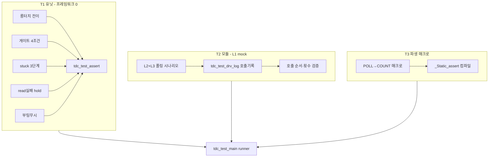

# 05 테스트 구조 — 유닛/모듈 테스트 경계·케이스·스텁 골격

**TL;DR**: L2 순수 FSM은 외부 의존 0(입력=상태·tick·플래그, 출력=다음상태·요청액션 enum)이라 **프레임워크 없이 `assert`+카운터만으로** 유닛 테스트 가능. 테스트 케이스는 ① 롱터치 전이(미달·도달·래치·해제 리셋), ② Re-ATI 게이트 4조건(NOT_TOUCH·!active·error·cooldown0), ③ stuck 3단계(reseed→re_ati→mclr·해제 리셋), ④ 쿨다운 10틱 감소, ⑤ read 실패 hold(≤N 동결·>N NOT_TOUCH 강제·캐시 무효화), ⑥ 부팅무시 진입·해제, ⑦ 시간 상수 파생 매크로 컴파일 타임 검증으로 구성. 모듈 테스트는 L2+L3를 묶고 L1을 `tdc_touch_port` 인터페이스 mock(호출 기록 구조체 `tdc_test_drv_log_t`)으로 대체해 read 시퀀스 주입→액션 호출 순서·횟수 검증. `tests/touch/`에 순수 호스트 컴파일(타깃 SDK 불요) 골격 제시. 회귀 0 기준은 20260619 B99 동작분석의 E1~E10·S1~S3 천이표를 그대로 테스트 케이스로 1:1 사상. 프레임워크 미도입 — `tdc_test_main.c` 단일 runner + `TDC_TEST_CHECK` 매크로. [실측 게이트] 없음(전부 정적 결정론), L2 시그니처는 02 노드 확정 의존 [추정].

---

## 0. 전제·근거·의존

- **프레임워크 미도입** (요구사항.md:25·44): Unity/CMock 등 미사용. 표준 C `assert.h` 또는 자체 `TDC_TEST_CHECK` 매크로 + 호출 기록 구조체만으로 검증. 호스트(PC) 컴파일·실행 — 타깃 SDK(`hw.h`·`ci_timer.h`) 불요.
- **테스트 대상 = L2 순수 FSM**: L2는 HW·시간 소스 비의존이라 결정론적. 입력→출력이 전역 상태에 숨지 않고 **상태 구조체 in/out**으로 노출되는 것이 02 노드 설계 전제 [추정]. 본 노드는 그 시그니처 형태를 가정하고 테스트를 설계하되, 최종 시그니처는 02_L2순수FSM·03_L1드라이버경계·04_L3어댑터 확정에 의존 [추정].
- **회귀 0 기준 = B99 동작분석 천이표**: 테스트 케이스는 `docs/tasks/touch/20260619_touch-fullati-control/에이전트-로그/동작분석/B99_동작분석종합.md` §3 이벤트→상태 천이표(E1~E10·S1~S3)·§4 타이밍을 1:1로 사상. 이 표가 "기능 동등(회귀 0)"의 ground truth.
- **현 코드 상태 출처**(전부 [확정], 절대 라인):
  - 롱터치: `tdc_touch.c:85`(proc_long_touch), 상수 `TDC_TOUCH_LONG_TOUCH_MS=2400` `tdc_touch.h:26`.
  - Re-ATI 게이트: `tdc_touch.c:224`(proc_re_ati_gate), 4조건 `:234`, 쿨다운 세팅 `:238`, 상수 `TDC_TOUCH_RE_ATI_COOLDOWN_CNT=10` `tdc_touch_config.h:183`.
  - stuck: `tdc_touch.c:252`(proc_stuck_timeout), 3단계 `:279·285·293`, 상수 `TDC_TOUCH_STUCK_TIMEOUT_MS=30000` `tdc_touch_config.h:196`.
  - read 실패 hold: `tdc_touch.c:445`, 캐시 무효화 `:512·513`, 상수 `TDC_TOUCH_READ_FAIL_HOLD_CNT=10` `tdc_touch_config.h:210`.
  - 부팅무시: `tdc_touch.c:465`, 진입 `:420`.
  - 폴링 게이팅: `tdc_touch.c:436`, 상수 `TDC_TOUCH_POLL_INTERVAL=200` `tdc_touch.h:25`.
  - 절전 시간 상수 파생 선례: `main.c:808~812`(`ULP_LONG_TOUCH_COUNT` 올림 나눗셈), `main.c:1011`(카운트 비교).

---

## 1. 테스트 3계층 경계

3레이어 코드 구조에 대응하는 3계층 테스트 경계:

| 계층 | 대상 | 의존 | mock 필요 | 결정론 |
|---|---|---|---|---|
| **T1 유닛(순수)** | L2 FSM 순수 함수 (롱터치·게이트·stuck·read실패·부팅무시) | 없음 | 없음 | 완전(입력→출력) |
| **T2 모듈(통합)** | L2 + L3 어댑터 (폴링 게이팅·tick 공급·액션→호출 변환) | L1 인터페이스 | **L1 mock** | tick 주입으로 결정론 |
| **T3 파생 매크로** | 시간 상수→카운트 매크로 (올림 나눗셈) | 없음 | 없음 | 컴파일 타임 `_Static_assert` |



---

## 2. T1 — L2 순수 함수 유닛 테스트

### 2.1 L2 순수 함수 시그니처 전제 (02 노드 확정 의존 [추정])

L2 FSM은 전역/static을 제거하고 **상태 구조체 + 입력 구조체 → 결과 구조체**로 변환되는 것을 전제한다. 본 노드가 가정하는 형태(02·04 노드와 정합 필요):

```c
/* tdc_touch_fsm.h — L2 순수 (HW·시간소스 비의존) [추정 시그니처] */

typedef enum {
    TDC_FSM_ACTION_NONE = 0,
    TDC_FSM_ACTION_RE_ATI,        /* L1 re_ati_trigger 요청 */
    TDC_FSM_ACTION_RESEED,        /* L1 reseed_only 요청 */
    TDC_FSM_ACTION_MCLR,          /* L1 mclr/watchdog reset 요청 */
    TDC_FSM_ACTION_LONG_TOUCH     /* 상위 절전 트리거 1회 */
} tdc_fsm_action_t;

/* 한 폴링 tick의 입력 (L3가 채워서 전달) */
typedef struct {
    tdc_touch_state_t curr_state;  /* read 산출 또는 강제값 */
    bool              read_ok;     /* L1 read 성공 여부 */
    bool              ati_error;   /* 최근 read의 ATI Error */
    bool              ati_active;  /* 최근 read의 ATI Active */
    int               now_ms;      /* L3 공급 tick(ms 절대) */
} tdc_fsm_input_t;

/* FSM 누적 상태 (테스트가 직접 초기화·검사) */
typedef struct {
    /* 롱터치 */
    tdc_touch_state_t lt_state_old;
    int               lt_tick_first;
    bool              lt_is_long;
    /* 게이트 */
    uint16_t          gate_cooldown;
    /* stuck */
    int               stuck_tick0;
    tdc_touch_state_t stuck_prev;
    uint8_t           stuck_stage;
    /* read 실패 */
    int               read_fail_cnt;
    /* 부팅무시 */
    bool              boot_ignore;
    int               boot_ready_ms;
    bool              boot_5s_warned;
} tdc_fsm_ctx_t;

/* 결과 — 액션 비트마스크 + 다음상태 */
typedef struct {
    uint32_t          actions;     /* (1u<<tdc_fsm_action_t) OR 누적 */
    tdc_touch_state_t next_state;
    bool              long_touch_event;
} tdc_fsm_result_t;

void tdc_touch_fsm_init(tdc_fsm_ctx_t *ctx);
tdc_fsm_result_t tdc_touch_fsm_step(tdc_fsm_ctx_t *ctx, const tdc_fsm_input_t *in);

/* 분해 순수 함수 — 개별 유닛 테스트 타깃 */
bool     tdc_touch_fsm_long_touch(tdc_fsm_ctx_t *ctx, tdc_touch_state_t now);
uint32_t tdc_touch_fsm_re_ati_gate(tdc_fsm_ctx_t *ctx, const tdc_fsm_input_t *in);
uint32_t tdc_touch_fsm_stuck(tdc_fsm_ctx_t *ctx, tdc_touch_state_t now, int now_ms);
```

> [!NOTE]
> 위 시그니처는 **테스트 설계용 가정**이다. 02 노드가 다른 분해(예: 게이트·stuck를 step 내부 인라인)를 확정하면 §2.2 케이스의 호출 대상만 `tdc_touch_fsm_step` 1점으로 합치고, 입력/검사는 그대로 유지한다. 즉 **케이스는 구현 분해와 무관하게 동작 천이로 정의**한다.

### 2.2 유닛 테스트 케이스 — 롱터치 (B99 E1~E4·E8)

상수 의존: `LONG_TOUCH_MS=2400`. now_ms 주입으로 결정론.

| 케이스 | 시퀀스(now_ms, curr_state) | 기대 long_touch_event | 기대 ctx |
|---|---|---|---|
| LT1 노터치→터치 진입 | (0,NOT_TOUCH)→(200,TOUCH) | false | lt_tick_first=200, lt_is_long=false (B99 E1) |
| LT2 터치 유지 미달 | (200,TOUCH)→(2400,TOUCH) [경과 2200<2400] | false | lt_is_long=false (B99 E2) |
| LT3 터치 도달 1회 래치 | (200,TOUCH)→(2600,TOUCH) [경과 2400] | **true (1회만)** | lt_is_long=true (B99 E3) |
| LT4 도달 후 재호출 비발동 | LT3 후 (2800,TOUCH) | false | 래치 유지(중복 미발동) |
| LT5 해제 시 래치 리셋 | TOUCH→(NOT_TOUCH) | false | lt_is_long=false (B99 E4) |
| LT6 재터치 타이머 재시작 | NOT_TOUCH→(3000,TOUCH) | false | lt_tick_first=3000 |
| LT7 경계 정확히 임계 | first=0, now=2400 [경과==2400, `<=` 비교] | **true** | `tdc_touch.c:110` `MS <= 경과` 경계 포함 검증 |

### 2.3 유닛 테스트 케이스 — Re-ATI 게이트 4조건 (B99 E5·E5'·E5'')

상수 의존: `RE_ATI_COOLDOWN_CNT=10`. 4조건 = NOT_TOUCH AND !ati_active AND ati_error AND cooldown==0 (`tdc_touch.c:234`).

| 케이스 | curr_state | ati_active | ati_error | cooldown 진입 | 기대 RE_ATI 액션 | 기대 cooldown |
|---|---|---|---|---|---|---|
| G1 4조건 모두 충족 발행 | NOT_TOUCH | false | true | 0 | **발행** | 10 세팅 (B99 E5) |
| G2 터치 중 보류(급소) | **TOUCH** | false | true | 0 | 미발행 | 0 (B99 §6.2 터치중 보류) |
| G3 ATI 진행 중 보류 | NOT_TOUCH | **true** | true | 0 | 미발행 | 0 (B99 E5'') |
| G4 error 없음 보류 | NOT_TOUCH | false | **false** | 0 | 미발행 | 0 |
| G5 쿨다운 중 보류 | NOT_TOUCH | false | true | **5** | 미발행 | 4 (선감소, B99 E5') |
| G6 쿨다운 만료 직후 재발행 | NOT_TOUCH | false | true | **1** | **발행** | 10 (선감소→0→발행) |
| G7 발행 후 10틱 뒤 재발행 | G1 후 9회 호출(error 유지) | … | true | (자동) | 10번째 호출에서 **발행** | B99 §4.3 쿨다운 표 |

> [!IMPORTANT]
> **G2(터치 중 보류)는 회귀 0의 최우선 급소** — B99 §6.2·`tdc_touch.c:234` 첫 조건 NOT_TOUCH. 순수화 과정에서 이 조건이 누락되면 손가락 닿은 채 Re-ATI→노터치 학습 회귀. 단일 케이스로 명시 고정.

### 2.4 유닛 테스트 케이스 — stuck 3단계 (B99 S1~S3·E4)

상수 의존: `STUCK_TIMEOUT_MS=30000`. now_ms 주입.

| 케이스 | 시퀀스 | 기대 액션 | 기대 stage |
|---|---|---|---|
| ST1 터치 진입 기록 | NOT_TOUCH→(t0,TOUCH) | NONE | stuck_tick0=t0, stage=0 |
| ST2 30초 미달 | (t0,TOUCH)→(t0+29999,TOUCH) | NONE | stage=0 (경과<30000) |
| ST3 30초 stage0→reseed | (t0,TOUCH)→(t0+30000,TOUCH) | **RESEED** | stage=1, stuck_tick0=t0+30000 (B99 S1) |
| ST4 60초 stage1→re_ati | ST3 후 (+30000,TOUCH) | **RE_ATI** | stage=2 (B99 S2, 게이트 우회) |
| ST5 90초 stage2→mclr | ST4 후 (+30000,TOUCH) | **MCLR** | (재부팅 요청) (B99 S3) |
| ST6 해제 시 즉시 리셋 | 임의 stage 중 TOUCH→NOT_TOUCH | NONE | stage=0, prev=NOT_TOUCH (B99 §4.2 해제 리셋) |
| ST7 비터치 상태 무동작 | (t,RESET)·(t,NOT_TOUCH) | NONE | early return, stage=0 (`tdc_touch.c:258`) |
| ST8 경계 정확히 30000 | t0=0, now=30000 [경과==30000, `<=`] | **RESEED** | `tdc_touch.c:273` 경계 포함 |

> [!NOTE]
> ST4 stage2 Re-ATI는 **게이트 우회**(stuck 복구 의도, `tdc_touch.c:286` 주석)라 게이트 4조건과 무관하게 발행됨을 명시 검증. 순수화 시 게이트와 stuck의 Re-ATI 경로를 합치는 회귀를 잡는다.

### 2.5 유닛 테스트 케이스 — read 실패 hold (B99 E6·E7)

상수 의존: `READ_FAIL_HOLD_CNT=10`. step 입력 read_ok=false 주입.

| 케이스 | read_ok 시퀀스 | 기대 동작 | 기대 ctx |
|---|---|---|---|
| RF1 1회 실패 hold | true→false(1회) | **hold(액션·천이 동결)** | read_fail_cnt=1, 캐시 ati_error/active=false 무효화 (B99 E6) |
| RF2 10회까지 hold | false ×10 | 전부 hold | read_fail_cnt=10 |
| RF3 11회째 NOT_TOUCH 강제 | false ×11 | **NOT_TOUCH 강제 진입** | curr_state=NOT_TOUCH (B99 E7, `tdc_touch.c:451`) |
| RF4 성공 시 카운터 리셋 | false×5→true | 정상 처리 | read_fail_cnt=0 (`tdc_touch.c:455`) |
| RF5 캐시 무효화 누출 차단(급소) | 터치중 error캐시→read실패 hold | hold 중 게이트 미발행 | 캐시 false라 게이트 4조건 불충족 (B99 §6.2 급소 수정 `tdc_touch.c:512`) |
| RF6 hold 중 stuck/롱터치 동결 | TOUCH 중 read 실패 hold | stuck·롱터치 카운트 비진행 | step이 hold tick에 미진입 (B99 §4.2 글리치 상호작용) |

> [!IMPORTANT]
> **RF5(캐시 무효화)는 회귀 0의 두 번째 급소** — `tdc_touch.c:507~513` 주석의 stale 캐시 누출. read 실패 시 ati_error/active를 false로 내려야 hold tick에서 게이트가 stale 값으로 오발행하지 않는다. 순수화 시 캐시 무효화 누락은 손가락 닿은 채 Re-ATI 회귀.

### 2.6 유닛 테스트 케이스 — 부팅무시 (B99 E9·E10)

| 케이스 | 시퀀스 | 기대 동작 | 기대 ctx |
|---|---|---|---|
| BT1 부팅 터치 진입 | boot_ignore=true 진입 후 (t,TOUCH) | **return 동결(게이트·stuck·롱터치 차단)** | boot_ignore 유지 (B99 E9) |
| BT2 부팅 해제 복귀 | boot_ignore=true, (t,NOT_TOUCH) | 그 tick도 동결, 이후 정상 | boot_ignore=false (B99 E10) |
| BT3 5초 경고 1회 | boot_ignore, TOUCH 지속 5000ms | LED 액션 1회(5s_warned 래치) | boot_5s_warned=true (`tdc_touch.c:472`) |

### 2.7 유닛 테스트 케이스 — step 순서 통합 (B99 §2.2 콜스택)

step 1회 호출 시 내부 순서가 **게이트→stuck→롱터치**(`tdc_touch.c:482·486·489`)임을 검증. 단일 tick에 게이트 발행 + 롱터치 도달이 동시 입력될 수 없음을 보장(게이트는 NOT_TOUCH, 롱터치는 TOUCH라 상호배타)하는 negative 케이스 포함.

| 케이스 | 입력 | 기대 |
|---|---|---|
| SQ1 NOT_TOUCH+error | curr=NOT_TOUCH, error=true, cd=0 | 게이트만 발행, 롱터치·stuck 무동작 |
| SQ2 TOUCH 도달+error | curr=TOUCH, error=true | 게이트 보류(터치중), 롱터치 도달 시 long_touch_event, stuck 진행 |

---

## 3. T2 — L2+L3 모듈 테스트 (L1 mock)

### 3.1 L1 인터페이스 전제 (03 노드 확정 의존 [추정])

L3 어댑터가 호출하는 L1 추상(03 노드 설계). 은수님 결정 "모듈 호출 격리"이므로 함수 포인터 vtable 또는 약한 심볼 링크 교체로 mock. 본 노드가 가정하는 인터페이스(`tdc_touch_port.h`):

```c
/* tdc_touch_port.h — L1 추상 (L2/L3가 호출, 구현=tdc_drv_iqs323 또는 mock) [추정] */
typedef struct {
    bool (*read_status)(bool *pressed, bool *ati_error, bool *ati_active);
    void (*re_ati)(void);
    void (*reseed_only)(void);
    void (*mclr_reset)(void);          /* = SYS_WATCHDOG_RESET 추상 */
    void (*apply_settings)(void);
    bool (*is_auto_ati_done)(void);
    int  (*now_ms)(void);              /* = ci_timer_get_tick 추상 (L3 시간소스) */
} tdc_touch_port_t;
```

### 3.2 HW mock 골격 (프레임워크 없이 호출 기록)

mock은 **호출 기록 구조체 + 주입 큐**로 구성. 프레임워크 없이 전역 구조체 1개:

```c
/* tdc_test_drv_mock.h/.c — L1 port mock */
typedef struct {
    /* 호출 횟수 기록 */
    int re_ati_calls;
    int reseed_calls;
    int mclr_calls;
    int apply_settings_calls;
    int read_status_calls;
    /* 호출 순서 기록(액션 식별자 스트림) */
    char order_log[256];
    int  order_len;
    /* read_status 주입 큐 — 미리 시퀀스 적재 */
    struct {
        bool ret;          /* read 성공 여부 */
        bool pressed;
        bool ati_error;
        bool ati_active;
    } read_queue[64];
    int read_queue_len;
    int read_queue_idx;
    /* now_ms 주입(가상 시계) */
    int virtual_now_ms;
} tdc_test_drv_log_t;

extern tdc_test_drv_log_t g_test_drv;

/* mock 구현 — read는 큐에서 pop, 나머지는 카운트+order_log append */
const tdc_touch_port_t *tdc_test_drv_mock_port(void);
void tdc_test_drv_reset(void);
void tdc_test_drv_push_read(bool ret, bool pressed, bool err, bool active);
void tdc_test_drv_set_now(int ms);
```

mock read 구현은 `read_queue`에서 순서대로 pop → L3 폴링 시나리오를 read 결과 시퀀스로 주입. re_ati/reseed/mclr 호출 시 `order_log`에 'R'/'S'/'M' append → 호출 순서·횟수를 문자열 비교로 검증.

### 3.3 모듈 테스트 케이스 (L2+L3, B99 §2.2 노말 루프 콜스택)

| 케이스 | 주입(read 큐·now_ms) | 기대 port 호출 |
|---|---|---|
| MT1 폴링 게이팅 200ms | now_ms 50씩 증가, read push | 200ms 미경과 tick은 read_status 미호출, 경과 tick만 호출 (`tdc_touch.c:436`) |
| MT2 정상 롱터치→절전 | TOUCH read ×13(2400ms 경과) | long_touch_event=true, re_ati/reseed/mclr 0회 |
| MT3 드리프트 1사이클 | NOT_TOUCH+error read | re_ati_calls=1, 쿨다운 후 추가 발행 0 |
| MT4 read 실패 burst 흡수 | ret=false ×10 push | read_status 호출은 되나 액션 0(hold), order_log 빈 문자열 |
| MT5 read 실패 burst 초과 | ret=false ×11 | NOT_TOUCH 강제, 게이트 미발행(캐시 무효화) |
| MT6 stuck 90초 시퀀스 | TOUCH read 30초간격 가상시계 | order_log == "SRM" (reseed→re_ati→mclr) |
| MT7 부팅무시 시퀀스 | 부팅 TOUCH→해제 read | 해제 전 액션 0, 해제 후 정상 |

> [!NOTE]
> MT6의 `order_log=="SRM"`이 stuck 3단계 순서·횟수를 한 줄로 고정한다. 가상 시계(`set_now`)로 30초를 즉시 점프해 실시간 대기 불요.

### 3.4 절전(ULP) 경로 테스트 [별도·경량]

절전 ULP는 `tdc_touch_process`·게이트·stuck 미관여(B99 §2.3 [확정]), `tdc_touch_get_state` 1회 + 카운트만. 따라서 ULP 롱터치 카운트 로직(`main.c:1010~1015`)을 L2 분리 시 별도 순수 함수로 테스트:

| 케이스 | 입력(get_state 시퀀스) | 기대 |
|---|---|---|
| SL1 절전 롱터치 카운트 | TOUCH ×ULP_LONG_TOUCH_COUNT | mclr 요청(B99 §2.3) |
| SL2 손 뗌 카운터 리셋 | TOUCH×5→NOT_TOUCH | touch_cnt=0 |
| SL3 read 실패 카운터 리셋 | read 실패 | touch_cnt=0 (`main.c:1035`) |

---

## 4. T3 — 시간 상수 파생 매크로 검증 (요구사항_1)

요구사항_1: ms 상수만 바꾸면 파생 카운트 자동 계산. 04 노드가 `tdc_touch_time.h`에 올림 나눗셈 매크로 정의([추정]). 컴파일 타임 `_Static_assert`로 회귀 0 고정:

```c
/* tdc_test_time.c — 파생 매크로 컴파일 타임 검증 */
#define TDC_DIV_CEIL(a, b) (((a) + (b) - 1) / (b))

/* 현 코드값 고정 검증 — 04 노드 매크로가 이 값을 산출해야 함 */
_Static_assert(TDC_DIV_CEIL(2400, 200) == 12, "LONG_TOUCH_COUNT");      /* 노말 롱터치 */
_Static_assert(TDC_DIV_CEIL(2200, 200) == 11, "ULP_LONG_TOUCH_COUNT");  /* 절전(main.c:812 현값) */
_Static_assert(TDC_DIV_CEIL(30000, 200) == 150, "STUCK_COUNT");         /* stuck 폴링환산(참고) */
_Static_assert(TDC_TOUCH_RE_ATI_COOLDOWN_CNT == 10, "COOLDOWN");
_Static_assert(TDC_TOUCH_READ_FAIL_HOLD_CNT == 10, "READ_FAIL_HOLD");
```

| 검증 | 근거 | 라벨 |
|---|---|---|
| 노말 롱터치 2400/200=12 | `tdc_touch.h:26` ÷ `:25` | [확정] |
| 절전 롱터치 2200/200=11 | `main.c:809·808·812` 현 산출 | [확정] |
| 올림 나눗셈 정확성 | `main.c:812` 동일 공식 선례 | [확정] |
| 상수 변경 시 파생 자동 추종 | `_Static_assert`가 회귀 즉시 컴파일 실패 | [추정 — 04 매크로 의존] |

> [!IMPORTANT]
> T3는 **테스트 실행 불요**(컴파일만으로 PASS/FAIL). 은수님이 상수를 바꾸면 `_Static_assert` 기대값도 함께 갱신해야 하므로, 기대값은 "현 동작 스냅샷"으로 고정하고 의도적 변경 시만 갱신. 이게 요구사항_1의 회귀 가드.

---

## 5. tests/ 폴더 구성 (06 노드 정합 의존)

현 `tests/`는 분석 .md만 존재(`.gitkeep` 외 실 테스트 코드 0). 신규 테스트 코드 트리:

```
tests/
├── touch/                          신규 — 터치 L2/L3 테스트
│   ├── tdc_test.h                  TDC_TEST_CHECK·TDC_TEST_CASE 매크로 + 카운터
│   ├── tdc_test_main.c             단일 runner (모든 케이스 호출·요약 출력)
│   ├── unit/
│   │   ├── test_long_touch.c       §2.2 LT1~LT7
│   │   ├── test_re_ati_gate.c      §2.3 G1~G7
│   │   ├── test_stuck.c            §2.4 ST1~ST8
│   │   ├── test_read_fail.c        §2.5 RF1~RF6
│   │   ├── test_boot_ignore.c      §2.6 BT1~BT3
│   │   └── test_fsm_step.c         §2.7 SQ1~SQ2 통합
│   ├── module/
│   │   ├── tdc_test_drv_mock.h/.c  §3.2 L1 port mock(호출 기록)
│   │   ├── test_normal_loop.c      §3.3 MT1~MT7
│   │   └── test_ulp_loop.c         §3.4 SL1~SL3
│   ├── compile/
│   │   └── test_time_macros.c      §4 T3 _Static_assert
│   └── Makefile                    호스트 gcc 빌드(타깃 SDK 불요)
└── .gitkeep                        기존 유지
```

빌드: `tests/touch/Makefile`이 호스트 `gcc -std=c11`로 L2 순수 소스(`tdc_touch_fsm.c`) + mock + 테스트를 링크. **타깃 SDK 헤더(`hw.h`·`ci_timer.h`) 미참조** — L2가 순수이므로 가능(요구사항_3 격리의 결실). `make && ./tdc_test` → exit code 0 = 회귀 0.

### 5.1 TDC_TEST_CHECK 매크로 골격 (프레임워크 대체)

```c
/* tdc_test.h — 프레임워크 미도입, 최소 매크로 */
extern int g_test_pass, g_test_fail;

#define TDC_TEST_CHECK(cond, msg)                                   \
    do {                                                            \
        if (cond) { g_test_pass++; }                                \
        else { g_test_fail++;                                       \
               printf("[FAIL] %s:%d %s\n", __FILE__, __LINE__, msg); } \
    } while (0)

#define TDC_TEST_EQ_INT(got, exp, msg)                              \
    do {                                                            \
        if ((got) == (exp)) { g_test_pass++; }                      \
        else { g_test_fail++;                                       \
               printf("[FAIL] %s:%d %s (got=%d exp=%d)\n",          \
                      __FILE__, __LINE__, msg, (int)(got), (int)(exp)); } \
    } while (0)

#define TDC_TEST_CASE(name) void name(void)
```

runner(`tdc_test_main.c`)는 각 `test_*` 함수를 호출 후 `g_test_fail==0`이면 exit 0. 중괄호 필수 규칙 준수(CLAUDE.md 메모리).

---

## 6. 회귀 0 매핑표 (B99 천이 ↔ 테스트 케이스)

회귀 0 = B99 동작분석의 모든 이벤트가 테스트로 커버됨:

| B99 이벤트 | 테스트 케이스 | 계층 |
|---|---|---|
| E1 노터치→터치 | LT1·ST1 | T1 |
| E2 터치 유지 미달 | LT2 | T1 |
| E3 롱터치 도달 | LT3·LT7(경계) | T1 |
| E4 터치 해제 | LT5·ST6 | T1 |
| E5 드리프트 발행 | G1·MT3 | T1·T2 |
| E5' 쿨다운 중 보류 | G5·G6 | T1 |
| E5'' ATI 진행 중 보류 | G3 | T1 |
| E6 read 실패 hold | RF1·RF2·RF6 | T1 |
| E7 read 실패 초과 | RF3·MT5 | T1·T2 |
| E8 롱터치→절전 | LT4·MT2 | T1·T2 |
| E9 부팅무시 지속 | BT1·BT3 | T1 |
| E10 부팅무시 해제 | BT2·MT7 | T1·T2 |
| S1 stuck 30s reseed | ST3·MT6 | T1·T2 |
| S2 stuck 60s re_ati | ST4·MT6 | T1·T2 |
| S3 stuck 90s mclr | ST5·MT6 | T1·T2 |
| 급소: 터치중 게이트 보류 | **G2** | T1 |
| 급소: read실패 캐시 무효화 | **RF5·MT5** | T1·T2 |
| 절전 ULP 롱터치 | SL1~SL3 | T2 |
| 요구사항_1 파생 매크로 | T3 전체 | T3 |

**전 이벤트(E1~E10·S1~S3·급소 2건·절전·파생) 100% 커버** — 누락 0.

---

## 7. 미해결·의존·실측 게이트

| # | 항목 | 분류 |
|---|---|---|
| 1 | L2 순수 시그니처 최종형(step 단일 vs 분해) | [추정 — 02 노드 확정 의존] |
| 2 | L1 port 추상 형태(vtable vs 약한심볼 vs 직접) | [추정 — 03 노드 확정 의존] |
| 3 | tests/ 폴더 위치·Makefile 빌드 통합 | [06 노드 정합 필요] |
| 4 | 파생 매크로 명칭·올림 공식 | [추정 — 04 노드 확정 의존] |
| 5 | 실측 게이트 | **없음** — T1/T2/T3 전부 정적 결정론(now_ms·read 큐 주입). 빌드·실기 불요 |
| 6 | `_Static_assert` 기대값 갱신 정책 | 상수 의도 변경 시 수동 갱신(회귀 가드 트레이드오프) |

> [!IMPORTANT]
> 본 테스트 구조의 핵심 가치: L2를 순수화하면 **타깃 SDK·실기 없이 호스트 gcc만으로 회귀 0을 정적 보증**한다(요구사항_3·4 충족). 단 G2·RF5 두 급소 케이스는 회귀 0의 최우선 고정점이며, 02 노드 순수화 설계가 이 두 조건(터치중 게이트 보류·read실패 캐시 무효화)을 순수 함수 입력으로 노출해야 테스트 가능하다.
