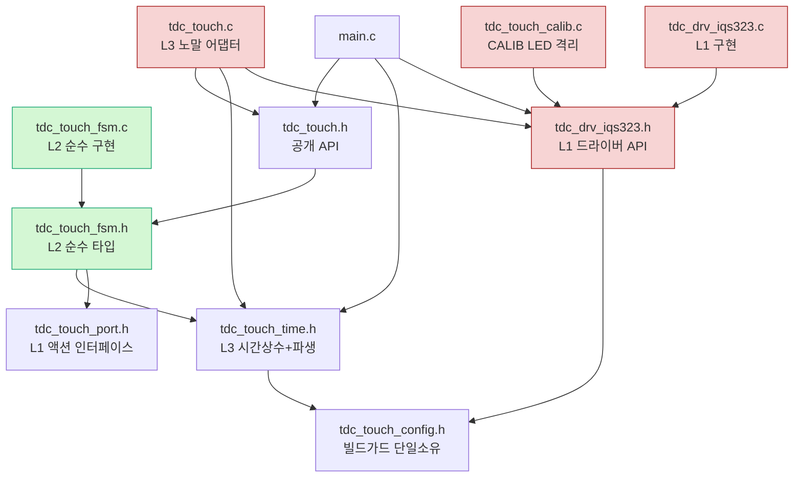

# 06 파일·모듈 구성

**TL;DR**: 현 `tdc_touch.c`(555줄)는 L2 순수 로직(롱터치·Re-ATI 게이트·stuck·상태판정)과 L3 어댑터(폴링 게이팅·tick 공급·read 캐시·부팅 무시·CALIB LED)가 한 파일에 혼재하고, 시간 상수는 `tdc_touch.h`·`tdc_touch_config.h`·`main.c` 3곳에 흩어져 있다. 이를 **신규 4파일** — `tdc_touch_time.h`(L3 시간 상수+올림 파생 매크로, 노말·절전 통합) / `tdc_touch_port.h`(L1 추상 인터페이스 시그니처) / `tdc_touch_fsm.c·.h`(L2 순수 FSM, HW 비의존 — 상태/시간/플래그 입력 → 다음상태/액션 출력) — 로 분리하고, 기존 `tdc_touch.c`는 **L3 노말 어댑터**(`tdc_touch_process`·`get_state`·부팅 init FSM·폴링 게이팅), `tdc_drv_iqs323.c`는 **L1 구현**으로 재배치한다. CALIB LED 블로킹은 `tdc_touch_calib.c`로 별도 격리. main.c 호출 시그니처는 **불변**(`tdc_touch_init_begin`·`tdc_touch_process`·`tdc_touch_get_state`·`tdc_touch_state_name`·`consume_sleep_request`)이라 호출처 회귀 0, 절전 ULP 루프만 `tdc_touch_time.h`의 `ULP_*` 매크로를 참조하도록 상수 이동. 빌드가드는 전부 `tdc_touch_config.h` 단일 소유 유지, FSM 순수성을 위해 가드 분기는 **호출 측(L3)**으로 끌어올린다(L2 본문은 무가드). 코드 근거 [파일:라인] 명시.

---

## 1. 현 파일 인벤토리와 책임 혼재 진단

### 1.1 현 파일 5개 [확정]

| 파일 | 라인 | 현 책임 | 3레이어 매핑 |
|---|---:|---|---|
| `tdc_touch.h` | 70 | 공개 API 선언 + 노말 시간 상수 3개 + 상태 enum | L2(enum)+L3(상수)+공개 API 혼재 |
| `tdc_touch.c` | 555 | init FSM·폴링 게이팅·롱터치·게이트·stuck·get_state·CALIB LED | **L2+L3 전면 혼재** |
| `tdc_drv_iqs323.h` | 547 | 드라이버 공개 API 선언 + config include | L1 인터페이스(현 일체형) |
| `tdc_drv_iqs323.c` | 1463 | I2C·레지스터·force window·ATI·reseed | **L1 구현(거의 순수 L1)** |
| `tdc_touch_config.h` | 213 | 빌드가드(보드·Full ATI·게이트·stuck 등) 전량 | 공통 설정(전 레이어 참조) |

### 1.2 `tdc_touch.c` 내부 책임 혼재 [파일:라인]

현 `tdc_touch.c` 한 파일에 3레이어가 섞여 있다:

| 코드 블록 | 라인 | 본질 레이어 | 순수성 |
|---|---|---|---|
| `tdc_touch_state_name()` | `:65` | L2 | 순수(switch만) |
| `proc_long_touch()` | `:85` | **L2** | 순수 가능(단 내부 `ci_timer_get_tick()` `:98·110` 직접 호출 — L3 tick 주입 필요) |
| CALIB LED `calib_*`·`calib_led_binary_once` | `:144~213` | **L3 별도**(블로킹 LED) | HW 의존(led_request·delay) — 분리 격리 |
| `proc_re_ati_gate()` | `:224` | **L2** | 순수 가능(단 `tdc_drv_iqs323_re_ati_trigger()` `:237` 직접 호출 — L1 액션 출력으로 치환) |
| `proc_stuck_timeout()` | `:252` | **L2** | 순수 가능(단 reseed/re_ati/`SYS_WATCHDOG_RESET` `:281·288·300` 직접 호출 + tick — L1 액션·L3 tick 치환) |
| `try_finish_init()` | `:315` | **L3**(부팅 어댑터) | HW 의존(is_auto_ati_done·apply_settings·t3_tick) |
| `tdc_touch_init_begin()` | `:388` | **L3** | HW 의존(mclr_reset·t3_tick) |
| `tdc_touch_process()` | `:400` | **L3**(노말 어댑터) | 폴링 게이팅·read 캐시·부팅 무시·L2 순차 호출 — HW 의존 |
| `tdc_touch_get_state()` | `:499` | **L1 호출 래퍼**(L3) | read_status_full·discharge·margin 호출 |

> [!IMPORTANT]
> 핵심 진단: **L2 순수 후보 4개**(`state_name`·`proc_long_touch`·`proc_re_ati_gate`·`proc_stuck_timeout`)가 모두 ① `ci_timer_get_tick()` 직접 호출, ② `tdc_drv_iqs323_*` 액션 직접 호출, ③ `s_last_ati_*` 전역 캐시 직접 참조 — 세 가지 HW/전역 결합 때문에 순수하지 않다. 06의 파일 분리는 이 결합을 **입력 인자(tick·플래그)와 출력(액션 enum)**으로 끊어 `tdc_touch_fsm.c`로 옮기는 것을 전제로 한다(시그니처는 02 노드 소관, 06은 파일 경계·include·빌드만 확정).

### 1.3 시간 상수 분산 현황 [확정]

| 상수 | 현 위치 | 값 | 파생값 |
|---|---|---:|---|
| `TDC_TOUCH_POLL_INTERVAL` | `tdc_touch.h:25` | 200 | 직접 비교(`tdc_touch.c:436`) |
| `TDC_TOUCH_LONG_TOUCH_MS` | `tdc_touch.h:26` | 2400 | 직접 비교(`tdc_touch.c:110`) |
| `TDC_TOUCH_INIT_TIMEOUT_MS` | `tdc_touch.h:27` | 2500 | 직접 비교(`tdc_touch.c:319`) |
| `TDC_TOUCH_RE_ATI_COOLDOWN_CNT` | `tdc_touch_config.h:183` | 10 | **카운트 직접 지정**(ms 미파생 — 약 2초 주석만) |
| `TDC_TOUCH_STUCK_TIMEOUT_MS` | `tdc_touch_config.h:196` | 30000 | 직접 비교(`tdc_touch.c:273`) |
| `TDC_TOUCH_READ_FAIL_HOLD_CNT` | `tdc_touch_config.h:210` | 10 | **카운트 직접 지정**(ms 미파생 — 약 2초 주석만) |
| `ULP_WAKE_INTERVAL_MS` | `main.c:808` | 200 | — |
| `ULP_LONG_TOUCH_MS` | `main.c:809` | 2200 | `ULP_LONG_TOUCH_COUNT` 올림 파생(`main.c:812`) |
| `ULP_TIMER_PRESCALE/TIMEOUT_VALUE` | `main.c:818·819` | 128/62 | 약 201.6ms 실측(`main.c:816` 주석) |

> [!CAUTION]
> 분산이 3파일(`tdc_touch.h`·`tdc_touch_config.h`·`main.c`)에 걸쳐 있고, `COOLDOWN_CNT`·`READ_FAIL_HOLD_CNT`는 ms→카운트 파생이 **주석으로만** 존재(약 2초). `ULP_LONG_TOUCH_COUNT`만 올림 나눗셈 매크로(`main.c:812`)로 이미 모범. 요구사항_1(상수만 바꾸면 파생 자동)을 위해 **시간 상수·파생 매크로를 단일 헤더로 집약**하는 것이 06의 핵심 파일 결정.

---

## 2. 신규 파일 레이아웃 (확정안)

### 2.1 파일 트리 (신규 4 + 기존 재배치 3 + 신규 격리 1)

```
src/2__cm3/Cortex-M3-src/systemControl/
├── tdc_touch_config.h      [기존 유지] 빌드가드 단일 소유(전 레이어 참조) — 무변경
├── tdc_touch_time.h        [신규 L3] 시간 상수(노말·절전 통합) + 올림 파생 매크로
├── tdc_touch_port.h        [신규 L1] L2→L1 추상 인터페이스 시그니처(액션 enum + 함수 선언)
├── tdc_touch_fsm.h         [신규 L2] 순수 FSM 공개 타입·시그니처(상태 enum·컨텍스트 구조체)
├── tdc_touch_fsm.c         [신규 L2] 순수 FSM 구현(HW 비의존 — tick·플래그 입력→액션 출력)
├── tdc_touch.h             [재배치] 공개 API만(init_begin·process·get_state·state_name·consume)
├── tdc_touch.c             [재배치 L3] 노말 어댑터(init FSM·폴링 게이팅·read 캐시·부팅 무시·L2 호출)
├── tdc_touch_calib.c       [신규 격리] CALIB LED 블로킹(현 tdc_touch.c:144~213 이동, ATI_CALIB_MODE 가드)
├── tdc_drv_iqs323.h        [재배치 L1] 드라이버 공개 API = port.h 구현 선언
└── tdc_drv_iqs323.c        [기존 L1] I2C·레지스터 구현(거의 무변경 — port 인터페이스 충족 확인만)
```

신규 파일은 모두 **작고 단일 책임**(요구사항_3): `tdc_touch_time.h`는 상수만, `tdc_touch_port.h`는 인터페이스만, `tdc_touch_fsm.c/.h`는 순수 로직만.

### 2.2 파일별 책임·내용 (06 확정 범위)

#### (A) `tdc_touch_time.h` — L3 시간 상수 + 파생 매크로 (신규)

요구사항_1의 핵심. 노말·절전 ms 상수를 **한 곳에 집약**하고 올림 나눗셈으로 카운트 자동 파생. `tdc_touch.h:25~27`(노말 3) + `tdc_touch_config.h:183·210`(카운트 2) + `main.c:808·809·812`(절전 3)를 흡수.

```c
#ifndef TDC_TOUCH_TIME_H_
#define TDC_TOUCH_TIME_H_

#include <tdc_touch_config.h>   /* STUCK_TIMEOUT_MS 등 가드값 참조 */

/* ── 올림 나눗셈 파생 매크로 (ms → 폴링 카운트) ── */
#define TDC_TOUCH_MS_TO_CNT(ms, period_ms)  (((ms) + (period_ms) - 1) / (period_ms))

/* ── 노말 모드 시간 상수 (현 tdc_touch.h:25~27 이동) ── */
#define TDC_TOUCH_POLL_INTERVAL_MS   200   /* 폴링 주기 */
#define TDC_TOUCH_LONG_TOUCH_MS      2400  /* 롱터치 판정 */
#define TDC_TOUCH_INIT_TIMEOUT_MS    2500  /* 부팅 auto-ATI 타임아웃 */

/* ── 노말 파생 카운트 (현 _CNT 직접지정을 ms 파생으로 격상) ── */
/* Re-ATI 쿨다운: 현 config:183 = 10(약 2초). ms 정의 후 올림 파생 */
#define TDC_TOUCH_RE_ATI_COOLDOWN_MS   2000
#define TDC_TOUCH_RE_ATI_COOLDOWN_CNT_DERIVED \
        TDC_TOUCH_MS_TO_CNT(TDC_TOUCH_RE_ATI_COOLDOWN_MS, TDC_TOUCH_POLL_INTERVAL_MS)
/* read 실패 hold: 현 config:210 = 10(약 2초) */
#define TDC_TOUCH_READ_FAIL_HOLD_MS    2000
#define TDC_TOUCH_READ_FAIL_HOLD_CNT_DERIVED \
        TDC_TOUCH_MS_TO_CNT(TDC_TOUCH_READ_FAIL_HOLD_MS, TDC_TOUCH_POLL_INTERVAL_MS)

/* ── 절전(ULP) 시간 상수 (현 main.c:808·809 이동) ── */
#define TDC_TOUCH_ULP_WAKE_MS          200
#define TDC_TOUCH_ULP_LONG_TOUCH_MS    2200
#define TDC_TOUCH_ULP_LONG_TOUCH_CNT \
        TDC_TOUCH_MS_TO_CNT(TDC_TOUCH_ULP_LONG_TOUCH_MS, TDC_TOUCH_ULP_WAKE_MS)

#endif /* TDC_TOUCH_TIME_H_ */
```

> [!NOTE]
> `STUCK_TIMEOUT_MS`(`config.h:196`)·`READ_FAIL_HOLD`·`COOLDOWN`의 빌드가드 의미(0=비활성)는 `config.h`에 남기고, 본 헤더는 **시간값·파생만** 둔다. `config.h:183·210`의 `_CNT` 매크로는 `_DERIVED`로 대체하되, [실측 게이트]로 N 조정 시 ms만 바꾸면 카운트 자동 갱신(요구사항_1 충족). 가드 0/비0 판정(`STUCK_TIMEOUT_MS > 0`)은 config 소유 유지. 절전 ULP 카운트 명칭은 `ULP_LONG_TOUCH_COUNT`(`main.c:812`)→`TDC_TOUCH_ULP_LONG_TOUCH_CNT`로 통일(중복 정의 제거).

#### (B) `tdc_touch_port.h` — L1 추상 인터페이스 (신규)

L2 FSM이 출력한 액션을 L3가 호출할 L1 동작의 추상. 은수님 확정 "함수 포인터 vtable 대신 **모듈 호출 격리**"라 함수 포인터 없이 **액션 enum + 직접 함수 선언**으로 둔다(시그니처 상세는 03 노드 소관, 06은 파일 위치·include만 확정).

```c
#ifndef TDC_TOUCH_PORT_H_
#define TDC_TOUCH_PORT_H_

#include <stdbool.h>

/* L2 FSM이 요청하는 HW 액션 (순수 로직은 enum만 반환, 실행은 L3가 L1으로) */
typedef enum
{
    TDC_TOUCH_ACT_NONE = 0,
    TDC_TOUCH_ACT_RE_ATI,        /* tdc_drv_iqs323_re_ati_trigger */
    TDC_TOUCH_ACT_RESEED,        /* tdc_drv_iqs323_reseed_only */
    TDC_TOUCH_ACT_MCLR_RESET     /* SYS_WATCHDOG_RESET (L3가 RTT 드레인 후 수행) */
} tdc_touch_action_t;

/* L3가 액션 enum을 L1 호출로 변환하는 단일 디스패치(테스트 시 mock 대체 지점) */
void tdc_touch_port_exec(tdc_touch_action_t act);

#endif /* TDC_TOUCH_PORT_H_ */
```

> [!NOTE]
> 03 노드가 `read_status`·`apply_settings` 등 read 경로까지 인터페이스화할지 결정한다. 06은 **port.h 파일이 L2와 L1 사이 단 하나의 경계 헤더**임을 확정하고, L2(`fsm.c`)는 `tdc_drv_iqs323.h`를 **절대 include 안 함**(순수성 게이트)을 빌드 규칙으로 못박는다.

#### (C) `tdc_touch_fsm.h` / `tdc_touch_fsm.c` — L2 순수 FSM (신규)

현 `tdc_touch.c`의 L2 후보 4개(`state_name`·`proc_long_touch`·`proc_re_ati_gate`·`proc_stuck_timeout`)를 HW 비의존 순수 함수로 이동. **include는 `<stdbool.h>`·`tdc_touch_time.h`·`tdc_touch_port.h`·`tdc_touch_fsm.h`만**(드라이버·hw·ci_timer·led 헤더 금지). tick·플래그는 인자로 주입, 액션은 enum 반환(02 노드가 시그니처 확정). 06 확정 사항:

- `state_name()` 이동(순수 switch, `tdc_touch.h`의 `tdc_touch_state_t` enum도 fsm.h로 이동 후 touch.h가 re-include).
- 게이트·stuck·롱터치의 함수 static 상태(`s_cooldown`·`s_stuck_tick0`·`s_stage`·`s_state_old` 등 `tdc_touch.c:226·254~256·87~89`)는 **순수 컨텍스트 구조체 멤버로 외부화**(테스트 시 주입·검사 — 02 소관). 06은 이들이 `fsm.c` static→구조체 멤버로 이주함을 파일 경계로 확정.
- `ci_timer_get_tick()` 호출(`:98·110·268·273·275·295`) 전부 제거 → `now_tick` 인자.
- `tdc_drv_iqs323_*`·`SYS_WATCHDOG_RESET` 호출(`:237·281·288·300`) 제거 → 액션 enum 반환.
- `s_last_ati_error/active` 캐시(`:45·46`) 참조 제거 → 입력 플래그 인자.

#### (D) `tdc_touch.c` — L3 노말 어댑터 (재배치)

기존 파일명 유지(호출처·빌드 등록 최소 변경). 잔존 책임:
- init FSM(`try_finish_init`·`tdc_touch_init_begin` `:315·388`) — 부팅 어댑터.
- `tdc_touch_process()`(`:400`) — 폴링 게이팅(`:436`)·read 캐시 갱신·부팅 무시(`:464~479`)·L2 순차 호출(게이트→stuck→롱터치)·L2 액션→`tdc_touch_port_exec` 변환.
- `tdc_touch_get_state()`(`:499`) — L1 read 래퍼(read_status_full·margin·discharge).
- include: `tdc_touch.h`·`tdc_touch_fsm.h`·`tdc_touch_time.h`·`tdc_touch_port.h`·`tdc_drv_iqs323.h`·`hw.h`·`ci_timer.h`·`ci_printf.h`·`LedOutput.h`(부팅 무시 LED).

#### (E) `tdc_touch_calib.c` — CALIB LED 격리 (신규)

현 `tdc_touch.c:144~213`(`calib_delay_ms`·`calib_led_off`·`calib_led_binary_once`)을 `#if TDC_TOUCH_ATI_CALIB_MODE` 가드째 이동. `try_finish_init`의 CALIB 호출부(`:334~359`)는 `tdc_touch.c`에 남되 `tdc_touch_calib.h`의 1개 진입함수(`tdc_touch_calib_run_loop()`)를 호출하도록 추출. 블로킹 무한 루프(`:339`)가 노말 어댑터를 오염시키지 않도록 격리(단일 책임).

#### (F) `tdc_drv_iqs323.c/.h` — L1 (거의 무변경)

B99 §1에서 드라이버는 이미 I2C·레지스터 전담(거의 순수 L1). 06 변경: `tdc_touch_port_exec`의 구현 본체를 어디 둘지만 결정 — **`tdc_touch.c`(L3) 안에 두는 것**을 권고(port→L1 매핑이 L3의 책임이고, 드라이버는 자기 인터페이스만 노출). 드라이버 헤더·소스는 시그니처 무변경.

---

## 3. main.c 호출처 영향 (회귀 0 게이트)

### 3.1 공개 API 시그니처 — 전부 불변 [확정]

main.c가 호출하는 5개 진입점은 **시그니처·의미 모두 불변** → 호출처 회귀 0:

| 호출처 | API | 현 라인 | 변경 |
|---|---|---|---|
| `func_normal` | `tdc_touch_process()` | `main.c:460·463` | 불변 |
| `Initialize`(추정) | `tdc_touch_init_begin()` | — | 불변 |
| ULP 루프 | `tdc_touch_get_state()` | `main.c:993` | 불변 |
| ULP·노말 로그 | `tdc_touch_state_name()` | `main.c:998·999`,`tdc_touch.c:460` | 불변(fsm.h로 선언 이동, touch.h가 re-export) |
| `func_normal` | `tdc_touch_consume_sleep_request()` | `main.c:791` | 불변(SLEEP_MEASURE 가드) |

### 3.2 절전 경로 — 상수 이동만 (시그니처 불변) [파일:라인]

| 항목 | 현 위치 | 변경 |
|---|---|---|
| `ULP_WAKE_INTERVAL_MS`·`ULP_LONG_TOUCH_MS` | `main.c:808·809` | → `tdc_touch_time.h`로 이동, main.c는 include만 |
| `ULP_LONG_TOUCH_COUNT` 파생 | `main.c:812` | → `TDC_TOUCH_ULP_LONG_TOUCH_CNT`(time.h)로 통일, `main.c:1011` 비교부 명칭만 교체 |
| `ULP_TIMER_PRESCALE/TIMEOUT_VALUE` | `main.c:818·819` | **main.c 잔류**(타이머 HW 레지스터 값 — IC/클럭 의존, L3 시간상수와 성격 다름). 단 `time.h`에 "약 201.6ms" 실측 주석 cross-ref |
| `func_sleep` read | `tdc_drv_iqs323_read_status()` 직접 호출 `main.c:891` | **불변**(절전 해제 대기는 L1 직접 호출 유지 — B99 §2.3 절전 미관여 원칙) |

> [!IMPORTANT]
> ULP 루프(`main.c:981~1037`)는 `tdc_touch_get_state()` + `ULP_LONG_TOUCH_COUNT` 비교 + `touch_cnt` 자체 누적으로 **L2 FSM을 안 거치는 독립 로직**(B99 §2.3 절전 미관여). 06은 이 절전 카운팅을 **L2로 끌어들이지 않고** 상수만 `time.h`로 모은다 — 절전 미변경 원칙(요구사항_4) 보존. 다만 향후 L2 재사용 여지를 위해 절전 카운팅도 `fsm.c`의 순수 카운터로 재사용 가능하게 시그니처를 열어둘지는 02 노드 결정([추정] 절전은 단순 N회 카운트라 L2 재사용 이득 적음 — 06은 상수 이동까지만 권고).

### 3.3 main.c 변경 최소화 결론

- **시그니처 변경 0건**(회귀 0 1차 게이트).
- main.c 실변경: ① `#include <tdc_touch_time.h>` 추가(또는 `tdc_touch.h` 경유 간접 include), ② `ULP_*` 매크로 정의 3줄 삭제(`:808·809·812`), ③ `ULP_LONG_TOUCH_COUNT`→`TDC_TOUCH_ULP_LONG_TOUCH_CNT` 1곳 비교(`:1011`) 명칭 교체. **총 약 5줄** 수정.

---

## 4. 빌드가드·매크로 마이그레이션

### 4.1 빌드가드 단일 소유 유지 [확정]

`tdc_touch_config.h`(213줄)가 **전 빌드가드 단일 소유** 유지(`FULL_ATI`·`RE_ATI_GATE`·`STUCK_TIMEOUT_MS`·`GATE`·`SLEEP_MEASURE`·`ATI_CALIB` 등). 신규 파일들은 모두 `config.h`를 (직접 또는 time.h 경유) include. B99 §1의 "가드 대칭·orphan 0"을 깨지 않기 위해:

| 가드 | 현 정의·호출 | 마이그레이션 후 정의 위치 | 호출 위치 |
|---|---|---|---|
| `FULL_ATI && RE_ATI_GATE` | `tdc_touch.c:223·481` | **L3(`tdc_touch.c`)에서 L2 호출 분기** | 게이트 호출(`:482`)을 L3가 가드. L2 `fsm.c` 본문은 **무가드**(순수) |
| `FULL_ATI && STUCK_MS>0` | `tdc_touch.c:251·485` | **L3에서 분기** | stuck 호출(`:486`) L3 가드. L2 무가드 |
| `ATI_CALIB_MODE` | `tdc_touch.c:144·213·334` | `tdc_touch_calib.c` 파일 전체 가드 + L3 호출부 가드 | `try_finish_init` 호출(`:334`) |
| `SLEEP_MEASURE_MODE` | `tdc_touch.c:57·64·348·376` | L3(`tdc_touch.c`) 잔류 | `main.c:791` |

> [!CAUTION]
> **순수성 vs 가드 대칭 트레이드오프**: 현재는 정의·호출이 같은 `#if`로 묶여 orphan 0(B99 §1). 06 권고안은 **가드를 L3 호출 측으로 끌어올리고 L2 함수는 무조건 컴파일**한다. 이러면 `RE_ATI_GATE=0`일 때 L2의 게이트 함수가 컴파일되나 호출 안 됨 → **dead code 경고 가능**([실측 게이트: -Werror·unused]). 대응: L2 게이트/stuck 함수에 무가드 + L3에서 `#if`로 호출만 제어. 미사용 경고가 문제면 L2 함수도 동일 가드로 묶되, **그 경우 순수 테스트는 가드 ON 빌드에서만 가능**. 06 권고: **순수성 우선(L2 무가드)**, 경고는 빌드 1회로 판명 후 결정. (B99 §1의 `s_last_ati_*` set-but-unused가 이미 동일 비기본 조합 경고 선례.)

### 4.2 상수 명칭 마이그레이션 매핑

| 현 명칭 | 현 위치 | 신 명칭 | 신 위치 |
|---|---|---|---|
| `TDC_TOUCH_POLL_INTERVAL` | `tdc_touch.h:25` | `TDC_TOUCH_POLL_INTERVAL_MS` | `tdc_touch_time.h` |
| `TDC_TOUCH_LONG_TOUCH_MS` | `tdc_touch.h:26` | 동일 | `tdc_touch_time.h` |
| `TDC_TOUCH_INIT_TIMEOUT_MS` | `tdc_touch.h:27` | 동일 | `tdc_touch_time.h` |
| `TDC_TOUCH_RE_ATI_COOLDOWN_CNT`(=10) | `config.h:183` | `..._COOLDOWN_MS`(2000) + `..._CNT_DERIVED` | `tdc_touch_time.h` |
| `TDC_TOUCH_READ_FAIL_HOLD_CNT`(=10) | `config.h:210` | `..._HOLD_MS`(2000) + `..._CNT_DERIVED` | `tdc_touch_time.h` |
| `TDC_TOUCH_STUCK_TIMEOUT_MS` | `config.h:196` | 동일(가드값) | `config.h` 잔류 |
| `ULP_WAKE_INTERVAL_MS` | `main.c:808` | `TDC_TOUCH_ULP_WAKE_MS` | `tdc_touch_time.h` |
| `ULP_LONG_TOUCH_MS` | `main.c:809` | `TDC_TOUCH_ULP_LONG_TOUCH_MS` | `tdc_touch_time.h` |
| `ULP_LONG_TOUCH_COUNT` | `main.c:812` | `TDC_TOUCH_ULP_LONG_TOUCH_CNT` | `tdc_touch_time.h` |

> [!NOTE]
> `POLL_INTERVAL`→`POLL_INTERVAL_MS` 개명은 `tdc_touch.c:436` 1곳 참조 → 동시 교체. 개명을 피하려면 기존 명칭 유지도 가능하나, ms 단위를 명시(`_MS`)하는 게 요구사항_1 가독성에 부합. `STUCK_TIMEOUT_MS`는 가드 판정(`> 0`)에 쓰여 config 잔류(시간값이자 on/off 가드 이중 역할).

### 4.3 Eclipse 빌드 등록 [실측 게이트]

신규 `.c` 2개(`tdc_touch_fsm.c`·`tdc_touch_calib.c`)는 Eclipse 프로젝트 소스에 추가 등록 필요(`.cproject`/소스 폴더 스캔). 헤더 4개(`time.h`·`port.h`·`fsm.h`)는 include path 기존 `systemControl/` 내라 자동 인식 [추정]. **빌드 검증은 다음주 은수님 Eclipse 환경**(요구사항 비범위 §4) → 06은 파일 배치·include 관계까지, 실제 `.cproject` 등록은 [실측 게이트].

---

## 5. include 의존 그래프 (순수성 게이트)



> [!IMPORTANT]
> **순수성 게이트(빌드 강제 규칙)**: `tdc_touch_fsm.c`/`.h`는 `tdc_drv_iqs323.h`·`hw.h`·`ci_timer.h`·`ci_printf.h`·`LedOutput.h`를 **절대 include 금지**. 그래프에서 초록(L2)→빨강(L1) 화살표가 없어야 한다(현재 없음). 이것이 L2 테스트 가능성(요구사항_3)의 구조적 보증. 위반 시 순수성 깨짐 → 07 검증 대상.

---

## 6. 마이그레이션 단계 (파일 관점)

| Phase | 작업 | 회귀 위험 |
|---|---|---|
| F1 | `tdc_touch_time.h` 신규 + 상수 이동(노말 3·카운트 2·절전 3) + main.c·touch.c·touch.h 참조 교체 | 낮음(값 동일, 명칭만) — 컴파일로 누락 검출 |
| F2 | `tdc_touch_calib.c` 분리(CALIB LED `:144~213` 이동 + 진입함수 추출) | 낮음(가드째 이동, ATI_CALIB_MODE=0 기본이라 운용 무영향) |
| F3 | `tdc_touch_port.h` 신규 + `tdc_touch_port_exec` 구현(touch.c 내) | 낮음(액션 디스패치 추가, 기존 직접 호출과 동치 검증) |
| F4 | `tdc_touch_fsm.c/.h` 신규 + L2 4함수 이동(tick·플래그 인자화·액션 반환·static→컨텍스트) | **중**(static 외부화·tick 주입에서 동작 동등성 핵심 — 07 검증) |
| F5 | `tdc_touch.c`를 L3 어댑터로 정리(L2 호출 + 액션 변환 + 가드 호출측 이동) | **중**(가드 대칭·호출 순서 게이트→stuck→롱터치 보존 — B99 콜스택 §2.2) |
| F6 | Eclipse 소스 등록 + 빌드 1회([실측 게이트]) | [실측 게이트] |

> [!NOTE]
> F4·F5가 회귀 핵심(순수화 과정의 누락·전역 race — 07 adversarial 대상). F1~F3은 기계적 이동이라 저위험. 절전(F1의 ULP 상수)은 값·로직 불변이라 안전.

---

## 7. 설계 함의·미해결

### 7.1 06 확정 사항

- 신규 4헤더/소스 + 격리 1소스, 기존 3파일 재배치. 모두 단일 책임·작은 파일.
- main.c 호출 시그니처 5개 전부 불변 → 호출처 회귀 0. 절전은 상수 이동 약 5줄만.
- 시간 상수 단일 헤더 집약(`time.h`) + 올림 파생 매크로 → 요구사항_1 충족.
- L2(`fsm.c`)의 드라이버/HW 헤더 include 금지 = 테스트 가능성 구조 보증(요구사항_3).
- 빌드가드는 `config.h` 단일 소유 유지, 순수성 위해 가드는 L3 호출측으로 격상.

### 7.2 미해결 (타 노드·결정 필요)

| 항목 | 소관 |
|---|---|
| L2 4함수 정확한 시그니처(인자·컨텍스트 구조체 멤버) | **02 노드** |
| `port.h`에 read 경로(read_status·apply_settings)까지 추상화할지 | **03 노드** |
| 절전 ULP 카운팅을 L2 순수 카운터로 재사용할지(현 권고: 상수만 이동) | 02 노드 [추정 재사용 이득 적음] |
| 가드 L3 격상 시 L2 dead-code 경고(-Werror) 발생 여부 | [실측 게이트: 빌드 1회] |
| `POLL_INTERVAL`→`_MS` 개명 채택 여부(요구사항 가독성 vs diff 최소) | 99 종합·은수님 |
| Eclipse `.cproject` 신규 .c 2개 등록 | [실측 게이트: 다음주 Eclipse] |

### 7.3 회귀 0 보존 체크리스트(파일 관점)

- [확정] 공개 API 시그니처 불변 → main.c 무변경.
- [확정] 시간 상수 값 동일(명칭만 변경, 컴파일러가 누락 검출).
- [확정] CALIB·SLEEP_MEASURE 가드 기본 0 → 운용 빌드 무영향.
- [실측 게이트] 가드 L3 격상 후 unused 경고, Eclipse 빌드, 호출 순서(게이트→stuck→롱터치) 동등성(07 검증).
