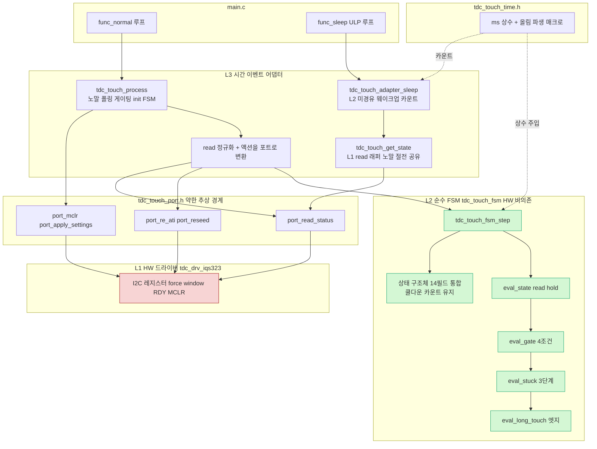

# 99 종합 — 터치 3레이어 단일 설계

**TL;DR**: 노드 01~06 설계를 07 검증(보존 4·위험 5·누락 2)으로 조율한 단일 3레이어 설계다. **L1**=`tdc_drv_iqs323`(시그니처 불변) + 얇은 포트 헤더 `tdc_touch_port.h`(약한 추상, 모듈 직접 호출 격리·mock 단일 지점). **L2**=신규 순수 FSM `tdc_touch_fsm.c/.h`(HW·timer·printf 헤더 0 include, 입력=`{tick_ms,read_ok,pressed,ati_error,ati_active}`·출력=`{action,long_touch_fired,로그 플래그}`, 함수내부 static 14개를 단일 `tdc_touch_fsm_state_t`로 통합). **L3**=`tdc_touch.c`(노말 어댑터, 폴링 게이팅·read 정규화·init FSM·액션→포트 변환) + `tdc_touch_adapter_sleep`(절전, **L2 미경유 카운트 유지**). 시간 상수는 신규 `tdc_touch_time.h` 단일 집약 + 올림 파생 매크로 `TDC_TOUCH_MS_TO_CNT(ms,period)`. **07 반영 보수적 확정 3건**: ① 게이트 쿨다운은 **카운트 필드 유지**(절대시각화 미세 비동등 회피·완전 동등), ② **절전 L2 미경유**(요구사항_4·B99 §2.3), ③ **init FSM은 L2 밖**(L3 어댑터+L1 포트). 회귀 0은 read 실패 E6/E7 두 갈래·stuck-게이트 순서·`fsm_init` RESET 초기값을 호스트 gcc 테스트(케이스 4종 추가: RF5b·ST4b·LT0·BT2 강화)로 정적 보증. 마이그레이션 6 Phase(F1 시간상수→F6 빌드 게이트), main.c 공개 API 5개 전부 불변(호출처 회귀 0). 빌드·Eclipse 등록은 [실측 게이트].

---

## 0. 종합 입력·조율 원칙

- 입력: 01(현코드 매핑)·02(L2 FSM)·03(L1 포트)·04(L3 어댑터·시간상수)·05(테스트)·06(파일구성) + 07(adversarial 검증).
- 충돌·미해결은 **07 검증의 보수적 권고를 우선** 채택 — 요구사항_4(회귀 0)가 "의미 명확성"·"코드 우아함"보다 상위.
- 라벨: [확정]=코드/노드 명시 · [추정]=정적 추론 · [실측 게이트]=빌드/실기 필요. 코드 근거 [파일:라인].
- 노드 간 모순 3건을 본 종합이 **단일 값으로 봉합**(아래 §0.1).

### 0.1 노드 간 충돌 봉합 결정표 (07 §9 게이트 반영)

| # | 충돌·미해결 | 노드 입장 | **종합 확정** | 근거 |
|---|---|---|---|---|
| 결정_1 | 게이트 쿨다운 표현 | 02: 절대시각화 권장 / 07: 카운트 유지 권고([위험_4]) | **카운트 필드 유지** (`re_ati_cooldown_cnt`) | read hold 중 절대시각 미세 비동등(07 §7.1), 05 G5~G7이 카운트 전제 [05:153], 완전 동등 우선 |
| 결정_2 | 절전 L2 재사용 | 02: 옵션(권장) / 04 코드: 카운트 유지 / 04 Mermaid: L2 경유(모순) / 06: 상수만 이동 / 07: 미경유([위험_3]) | **절전 L2 미경유 — 카운트 유지·상수만 `time.h` 이동** | 요구사항_4 절전 미변경, B99 §2.3 절전 proc 호출 0건 [확정], 절전 tick≠ms(201.6ms/tick) 시간축 혼동 위험 |
| 결정_3 | init FSM 경계 | 02: L2 밖 명시 / 06: L3 잔류 / 07: L3+L1 확정 권고 | **init FSM은 L2 밖 — L3 어댑터(`tdc_touch.c`) + L1 포트** | init은 mclr/apply_settings/is_ati_done HW 본질 [01:33], 순수화 이득 적고 회귀 위험만 큼 |
| 수정_1 | 04 §4.1 Mermaid(L2 경유)↔§4.3 코드(카운트) | — | **절전 어댑터는 L2 미경유 카운트로 통일** (본 종합 §1.4 Mermaid 정정) | 결정_2 종속 |
| 수정_2 | `fsm_init` 초기값 미명시 | 07 [누락_1·2] | **`lt_prev_state=RESET`·`stuck_prev_state=RESET`·`stuck_stage=0` 명시** (§2.4) | 부팅 직후 첫 TOUCH(RESET→TOUCH) first_touch·anchor 기록 보존 [tdc_touch.c:87·255] |
| 개명_1 | `POLL_INTERVAL`→`_MS` | 06: 가독성 vs diff | **`_MS` 접미사 채택** (ms 단위 명시·요구사항_1 가독성) | 참조 1곳(`tdc_touch.c:436`) 동시 교체 비용 낮음 |

---

## 1. 3레이어 단일 설계

### 1.1 레이어 책임 경계 (한 문장 정의)

| 레이어 | 정의 | 무엇을 하는가 | 무엇을 안 하는가 | 파일 |
|---|---|---|---|---|
| **L1 HW 드라이버** | IQS323 종속 I2C·레지스터·force window·RDY·MCLR | 센서 read/write, Re-ATI/RESEED/MCLR 실행, 설정 적용 | 상태 기억(무상태 위임), 판정 | `tdc_drv_iqs323.c/.h` + `tdc_touch_port.h` |
| **L2 순수 FSM** | HW 비의존 결정론 상태머신 | 롱터치·게이트 4조건·stuck 3단계·read hold·부팅무시 판정, 다음상태·액션 산출 | I2C·timer·printf·전역 (전부 인자/출력으로 격리) | `tdc_touch_fsm.c/.h` |
| **L3 시간·이벤트 어댑터** | L2↔L1 시간·이벤트 접착 | 폴링 게이팅, tick/read 정규화 주입, L2 액션→L1 포트 변환, init FSM, 로그 출력 | 터치 판정 로직(L2 위임) | `tdc_touch.c`(노말) + `tdc_touch_adapter_sleep.c/.h`(절전) |

> [!IMPORTANT]
> **순수성 게이트(빌드 강제 규칙, 06 §5)**: `tdc_touch_fsm.c/.h`는 `tdc_drv_iqs323.h`·`hw.h`·`ci_timer.h`·`ci_printf.h`·`LedOutput.h`·`tdc_touch_port.h`를 **절대 include 금지**. L2의 include는 `<stdbool.h>`·`<stdint.h>`·`tdc_touch_fsm.h`·`tdc_touch_time.h`(상수 주입 시)만. 이 화살표 부재가 호스트 gcc 테스트(요구사항_3)의 구조적 보증이며 07 검증 대상.

### 1.2 L1 인터페이스 시그니처 (포트 — 03 노드 확정 + read 포트 포함)

신규 `tdc_touch_port.h`. 은수님 확정 "모듈 직접 호출 격리" → 함수 포인터 vtable 대신 **포트 심볼 + 빌드 치환 mock**. L2가 호출하는 8 액션을 의미 단위로 명명, `tdc_drv_iqs323_*` 시그니처 그대로 보존(이름만 HW 중립화).

```c
/* tdc_touch_port.h — L2/L3가 호출하는 HW 액션 포트(약한 추상).
 * 운용(TDC_TOUCH_PORT_MOCK==0): tdc_touch_port.c 가 tdc_drv_iqs323_* 로 위임.
 * 테스트(==1): tdc_touch_port_mock.c 가 호출기록·반환주입 제공(드라이버 비링크).
 * §1.6 포트 계약(contract) semantics 위반은 회귀이므로 반드시 보존. */
#ifndef TDC_TOUCH_PORT_H_
#define TDC_TOUCH_PORT_H_

#include <stdbool.h>
#include <stdint.h>

/* --- 초기화 액션 (L3 init FSM 전용) --- */
void tdc_touch_port_mclr_reset(void);          /* → tdc_drv_iqs323_mclr_reset  (약 51ms 블로킹) */
bool tdc_touch_port_is_ati_done(void);         /* → tdc_drv_iqs323_is_auto_ati_done (논블로킹 1회) */
void tdc_touch_port_apply_settings(void);      /* → tdc_drv_iqs323_apply_settings (Beta/Power·부팅 Re-ATI 내포) */

/* --- 폴링 입력 (핵심 — L2 단일 입력 채널) --- */
/* System Status 1회 read. 반환 true=통신 정상. 0xEEEE 글리치→false. out 3개 NULL 허용. */
bool tdc_touch_port_read_status(bool *p_pressed, bool *p_ati_error, bool *p_ati_active);

/* --- 복구 액션 (L2 산출 액션을 L3가 변환 호출) --- */
bool tdc_touch_port_re_ati(void);              /* → tdc_drv_iqs323_re_ati_trigger (게이트는 L2 책임·포트는 무조건 발행) */
bool tdc_touch_port_reseed(void);              /* → tdc_drv_iqs323_reseed_only (bit3 only·절전감도 미동반) */

/* --- 보조 액션 (호출측 빌드가드) --- */
bool tdc_touch_port_discharge(void);           /* → tdc_drv_iqs323_discharge_crx0 (best-effort) */
bool tdc_touch_port_read_margin(uint8_t *p_th, uint16_t *p_cur); /* → read_touch_margin (MARGIN_LOG) */

#endif /* TDC_TOUCH_PORT_H_ */
```

> [!NOTE]
> **MCLR 액션 매핑 정정**: stuck stage2의 L2 액션 `TDC_TOUCH_ACTION_MCLR`은 칩 MCLR이 아니라 **CM3 재부팅**(`SYS_WATCHDOG_RESET`, 현 `tdc_touch.c:300`)이다. L3가 `MCLR` 수신 시 RTT 드레인 20ms 후 `SYS_WATCHDOG_RESET()` 호출(포트 비경유, L3 직접). 포트의 `mclr_reset`(IQS323 MCLR 핀)은 **init 전용**으로 별개. 두 "MCLR"을 혼동하지 않도록 액션 enum 주석에 "CM3 watchdog reset" 명기.

### 1.3 L2 인터페이스 시그니처 (순수 FSM — 02 노드 + 07 보정)

신규 `tdc_touch_fsm.h/.c`. step 단일 진입 + 보조 순수 함수 분해(테스트 입자 축소).

```c
/* tdc_touch_fsm.h — L2 순수 (HW·timer·printf·전역 0). */
#ifndef TDC_TOUCH_FSM_H_
#define TDC_TOUCH_FSM_H_
#include <stdbool.h>
#include <stdint.h>

/* 상태 enum — 현 tdc_touch.h 에서 이동(touch.h 가 re-include). */
typedef enum
{
    TDC_TOUCH_STATE_RESET = 0,
    TDC_TOUCH_STATE_TOUCH,
    TDC_TOUCH_STATE_NOT_TOUCH,
    TDC_TOUCH_STATE_CALIBRATION_ERROR
} tdc_touch_state_t;

/* 출력 액션 (L3 가 L1 포트 호출로 변환). */
typedef enum
{
    TDC_TOUCH_ACTION_NONE = 0,
    TDC_TOUCH_ACTION_HOLD,    /* read 실패 ≤hold: 평가 동결 (현 tdc_touch.c:449 return false) */
    TDC_TOUCH_ACTION_RE_ATI,  /* 게이트 드리프트 또는 stuck stage1 */
    TDC_TOUCH_ACTION_RESEED,  /* stuck stage0 */
    TDC_TOUCH_ACTION_MCLR     /* stuck stage2 → L3 가 SYS_WATCHDOG_RESET (CM3 재부팅) */
} tdc_touch_fsm_action_t;

/* 입력 (L3 가 read 결과를 정규화해 채움). */
typedef struct
{
    uint32_t tick_ms;     /* 현재 절대시각 ms (ci_timer_get_tick 주입) */
    bool     read_ok;     /* read_status 성공. false면 아래 3개 false 정규화 필수 */
    bool     pressed;     /* read_ok 시 유효 */
    bool     ati_error;   /* read_ok 시 유효 (드리프트 신호) */
    bool     ati_active;  /* read_ok 시 유효 (ATI burst 진행) */
} tdc_touch_fsm_in_t;

/* 출력. */
typedef struct
{
    tdc_touch_fsm_action_t action;
    bool              long_touch_fired;        /* 롱터치 발동 → 절전 트리거 (현 process return true) */
    bool              state_changed;           /* prev != curr (STATE 로그) */
    tdc_touch_state_t curr_state;
    tdc_touch_state_t prev_state;
    bool              boot_ignore_active;       /* 부팅 무시 중(상위 입력 무시 판단) */
    bool              boot_ignore_led_request;  /* 부팅 5초 보라 LED 1회 (현 :476) */
    bool              boot_released_log;         /* 부팅 무시 해제 로그 1회 (현 :470) */
} tdc_touch_fsm_out_t;

/* 상태 (함수내부 static 14개 통합 — 단일 소유, 테스트가 주입·검사). */
typedef struct
{
    /* process */
    tdc_touch_state_t prev_state;         /* 현 s_touch_state_old (tdc_touch.c:41) */
    int               read_fail_cnt;      /* 현 s_read_fail_cnt (:48) */
    /* 부팅 무시 */
    bool              boot_ignore;        /* 현 s_boot_touch_ignore (:53) */
    uint32_t          boot_ready_ms;      /* 현 s_boot_ready_tick (:54) */
    bool              boot_5s_warned;     /* 현 s_boot_5s_warned (:55) */
    /* 롱터치 */
    tdc_touch_state_t lt_prev_state;      /* 현 proc_long_touch::s_state_old (:87) */
    uint32_t          lt_first_touch_ms;  /* 현 s_tick_first_touch (:88) */
    bool              lt_latched;         /* 현 s_is_long_touch (:89) */
    /* Re-ATI 게이트 — 07 결정_1: 카운트 유지(절대시각화 안 함) */
    uint16_t          re_ati_cooldown_cnt;/* 현 proc_re_ati_gate::s_cooldown (:226), 폴링 카운트 */
    /* stuck */
    uint32_t          stuck_anchor_ms;    /* 현 proc_stuck_timeout::s_stuck_tick0 (:254) */
    tdc_touch_state_t stuck_prev_state;   /* 현 s_prev (:255) */
    uint8_t           stuck_stage;        /* 현 s_stage 0/1/2 (:256) */
} tdc_touch_fsm_state_t;

/* 설정 (시간 상수 주입 — L3 가 tdc_touch_time.h 매크로에서 채움). */
typedef struct
{
    uint32_t long_touch_ms;       /* TDC_TOUCH_LONG_TOUCH_MS */
    uint32_t stuck_timeout_ms;    /* TDC_TOUCH_STUCK_TIMEOUT_MS (0=stuck 비활성) */
    uint16_t re_ati_cooldown_cnt; /* TDC_TOUCH_RE_ATI_COOLDOWN_CNT (파생, 폴링 카운트) */
    int      read_fail_hold_cnt;  /* TDC_TOUCH_READ_FAIL_HOLD_CNT (파생) */
    uint32_t boot_warn_ms;        /* TDC_TOUCH_BOOT_WARN_MS (현 하드코딩 5000 승격) */
    bool     gate_enable;         /* FULL_ATI && RE_ATI_GATE */
} tdc_touch_fsm_cfg_t;

/* === 공개 함수 === */
/* 순수 step. L3 가 폴링 tick 1회당 1회 호출. 전역·HW·timer 0. */
void tdc_touch_fsm_step(tdc_touch_fsm_state_t     *state,
                        const tdc_touch_fsm_cfg_t *cfg,
                        const tdc_touch_fsm_in_t  *in,
                        tdc_touch_fsm_out_t       *out);

/* 상태 초기화 — 07 수정_2: RESET 초기값 명시(부팅 직후 첫 TOUCH 보존). */
void tdc_touch_fsm_init(tdc_touch_fsm_state_t *state, uint32_t now_ms);

/* 부팅 무시 진입 (READY 직후 터치 중일 때 L3 호출, 현 :420~424). */
void tdc_touch_fsm_set_boot_ignore(tdc_touch_fsm_state_t *state, uint32_t now_ms);

/* enum→문자열 (현 tdc_touch_state_name :65 이동, 순수). */
const char *tdc_touch_fsm_state_name(tdc_touch_state_t st);

/* === 보조 순수 함수 (테스트 입자 — step 이 순서대로 호출) === */
void tdc_touch_fsm_eval_state(tdc_touch_fsm_state_t *s, const tdc_touch_fsm_cfg_t *c,
                              const tdc_touch_fsm_in_t *in, tdc_touch_fsm_out_t *out);  /* read hold·pressed→state */
void tdc_touch_fsm_eval_gate(tdc_touch_fsm_state_t *s, const tdc_touch_fsm_cfg_t *c,
                             const tdc_touch_fsm_in_t *in, tdc_touch_fsm_out_t *out);   /* 게이트 4조건 */
void tdc_touch_fsm_eval_stuck(tdc_touch_fsm_state_t *s, const tdc_touch_fsm_cfg_t *c,
                              const tdc_touch_fsm_in_t *in, tdc_touch_fsm_out_t *out);  /* stuck 3단계 */
void tdc_touch_fsm_eval_long_touch(tdc_touch_fsm_state_t *s, const tdc_touch_fsm_cfg_t *c,
                                   const tdc_touch_fsm_in_t *in, tdc_touch_fsm_out_t *out); /* 롱터치 엣지 */

#endif /* TDC_TOUCH_FSM_H_ */
```

> [!IMPORTANT]
> **07 [위험_1] 반영 — read 실패 E6/E7 두 갈래 보존**: `tdc_touch_fsm_step`은 `read_ok=false` 시 단일 HOLD로 단순화하지 **않는다**.
> 1. `read_fail_cnt++`
> 2. `cnt <= cfg->read_fail_hold_cnt`: `out.action=HOLD`, 게이트/stuck/롱터치 평가 **스킵**(현 `:449` 동결).
> 3. `cnt > cfg->read_fail_hold_cnt`: `curr_state=NOT_TOUCH` **강제**(현 `:451`) 후 게이트/stuck/롱터치 **정상 평가**. 단 정규화로 `in.ati_error=false`라 게이트 미발행, stuck은 NOT_TOUCH라 리셋, 롱터치 NOT_TOUCH라 해제.
> 이 두 갈래를 합치면 E7의 NOT_TOUCH 강제 전이(stuck 리셋·롱터치 래치 해제)가 사라져 회귀.

### 1.4 L3 인터페이스 시그니처 (어댑터 — 04·06 노드 + 결정_2·3 반영)

```c
/* tdc_touch.h — 공개 API (시그니처 전부 불변, main.c 회귀 0). */
void        tdc_touch_init_begin(void);              /* init FSM 시작 (MCLR 트리거) */
bool        tdc_touch_process(void);                 /* 노말 폴링 1회. true=롱터치 발동 */
bool        tdc_touch_get_state(tdc_touch_state_t *st); /* L1 read 래퍼 (노말·절전 공유) */
const char *tdc_touch_state_name(tdc_touch_state_t st); /* re-export (fsm.h 위임) */
bool        tdc_touch_consume_sleep_request(void);   /* SLEEP_MEASURE 가드 */

/* tdc_touch_adapter_sleep.h — 절전 어댑터 (L2 미경유·카운트 유지, 결정_2). */
void tdc_touch_adapter_sleep_enter(void);  /* 절전 진입: apply_sleep·reseed·prescale·cnt=0 (현 main.c:958~972) */
bool tdc_touch_adapter_sleep_wake(void);   /* 웨이크업 1회. true=절전 롱터치 카운트 도달(상위가 reset 수행) */
```

**노말 어댑터(`tdc_touch.c`) 내부 흐름** — 현 `tdc_touch_process` READY 분기 [tdc_touch.c:428~496] 1:1 보존:

```c
bool tdc_touch_process(void)
{
    /* init FSM (NONE/MCLR_DONE/READY) — L3+L1, L2 밖 (결정_3) */
    if (s_init_state != READY) { try_finish_init(); return false; }

    int now = ci_timer_get_tick();                          /* L3: 시간 읽기 */
    if (TDC_TOUCH_POLL_INTERVAL_MS > (now - s_touch_tick_old)) { return false; } /* L3 게이팅 :436 */
    s_touch_tick_old = now;

    /* L1 read → L2 입력 정규화 (07 [위험_1] 핵심: 실패 시 전부 false) */
    tdc_touch_fsm_in_t in = { .tick_ms = (uint32_t)now };
    in.read_ok = tdc_touch_port_read_status(&in.pressed, &in.ati_error, &in.ati_active);
    if (!in.read_ok) { in.pressed = in.ati_error = in.ati_active = false; }

    tdc_touch_fsm_out_t out;
    tdc_touch_fsm_step(&s_fsm, &s_cfg, &in, &out);          /* L2 순수 호출 */

    if (out.state_changed)   { ci_printf("STATE %s\n", tdc_touch_fsm_state_name(out.curr_state)); }
    if (out.boot_released_log) { /* 부팅 무시 해제 로그 */ }
    if (out.boot_ignore_led_request) { led_request(LED_SRC_DBG, LED_ST_DBG_LONG_TOUCH_IGNORE); }

    switch (out.action) {                                   /* L3: 액션 → L1 포트 변환 */
        case TDC_TOUCH_ACTION_RE_ATI: (void)tdc_touch_port_re_ati(); break;  /* :237·288 */
        case TDC_TOUCH_ACTION_RESEED: (void)tdc_touch_port_reseed(); break;  /* :281 */
        case TDC_TOUCH_ACTION_MCLR:   drain_rtt_20ms(); SYS_WATCHDOG_RESET(); break; /* :295~300 */
        case TDC_TOUCH_ACTION_HOLD:   /* 동결 — 무동작 */                    break;
        case TDC_TOUCH_ACTION_NONE:   default:                               break;
    }
    return out.long_touch_fired;                            /* 절전 트리거 :489 */
}
```

**절전 어댑터(`tdc_touch_adapter_sleep.c`)** — 결정_2: L2 미경유, 현 카운트 로직 [main.c:981~1037] 등가:

```c
bool tdc_touch_adapter_sleep_wake(void)   /* L2 fsm_step 호출 0 — 절전 미변경 */
{
    tdc_touch_state_t st;
    if (!tdc_touch_get_state(&st)) { s_sleep_touch_cnt = 0; return false; } /* read 실패 :1035 */
    if (st == TDC_TOUCH_STATE_TOUCH) {
        if (++s_sleep_touch_cnt >= TDC_TOUCH_ULP_LONG_TOUCH_CNT) { return true; } /* :1011 */
    } else {
        s_sleep_touch_cnt = 0;            /* 손 뗌 :1026 */
    }
    return false;
}
```

> [!CAUTION]
> **07 [위험_3]·수정_1 반영**: 절전 어댑터는 `tdc_touch_fsm_step`을 **부르지 않는다**. 04 §4.1 Mermaid의 "L2 fsm_step_ulp 경유"는 폐기하고 04 §4.3 코드(카운트)로 통일. 절전 tick은 prescaled(약 201.6ms/tick, [main.c:816])라 ms 절대시각 신뢰 불가 — L2의 ms 시간축을 절전에 주입하면 시간축 혼동 회귀. 절전 롱터치는 웨이크업 카운트 `cnt >= TDC_TOUCH_ULP_LONG_TOUCH_CNT(11)`만 사용.

### 1.5 액션 디스패치 매핑 (L2 산출 → L3 변환 → L1 실행)

| L2 액션 | 발생 조건(L2 판정) | L3 변환 | L1 포트/호출 | 현 근거 |
|---|---|---|---|---|
| `NONE` | 평상 | 무동작 | — | — |
| `HOLD` | read 실패 ≤hold | 무동작(동결) | — | `:449` |
| `RE_ATI` | 게이트 4조건 충족 OR stuck stage1 | `port_re_ati()` | `re_ati_trigger` | `:237·288` |
| `RESEED` | stuck stage0 | `port_reseed()` | `reseed_only` | `:281` |
| `MCLR` | stuck stage2 | `drain_rtt()`+`SYS_WATCHDOG_RESET()` | (포트 비경유, L3 직접) | `:295~300` |
| `long_touch_fired=true` | 롱터치 도달 | `return true`(상위 절전 진입) | — | `:489` |

### 1.6 L1 포트 계약 (회귀 0 semantics — 03 §5)

mock·위임 어느 쪽이든 보존 필수. 깨지면 B99 급소 무력화.

| 포트 | 계약 | 근거 |
|---|---|---|
| `read_status` | 3-상태 동시 반환 · **0xEEEE→false** · out NULL 허용 | `.c:1322·1333` |
| `read_status` 실패 | 반환 false만. **캐시 무효화는 L3 입력 정규화 책임**(포트 무상태) | `tdc_touch.c:512` |
| `re_ati` | bit2 write 1회. **게이트는 L2 책임·포트는 무조건 발행** | `.c:985` |
| `reseed` | bit3 write **only** (절전감도·Prox 미동반) | `.c:970` |
| `apply_settings` | ACK→설정→Full ATI→Beta/Power→부팅 Re-ATI→RESEED→Power 순서·내용 무변경(1 tick) | `.c:1131` |
| `mclr_reset` | 약 51ms 블로킹, DIO16 OUTPUT→LOW→INPUT 복원 | `.c:288` |
| `is_ati_done` | 논블로킹 1회 read, 실패→false | `.c:312` |
| `discharge` | best-effort, verify 없음 | `.c:989` |

> [!IMPORTANT]
> **포트는 무상태(stateless) 위임만**. ATI 캐시·read 실패 카운터·쿨다운·stuck 타이머·롱터치 래치는 전부 **L2 FSM 상태**(`tdc_touch_fsm_state_t`). 포트가 떠안으면 "순수 로직 HW 비의존" 요구 붕괴. 부팅 Re-ATI·Beta/Power는 `apply_settings` 내부 캡슐화라 포트 통째 위임으로 동작 0 변경(07 급소 ④·⑥ [보존]).

---

## 2. 시간 상수 자동 파생 (요구사항_1 — 04·06 노드 + 개명_1)

### 2.1 신규 `tdc_touch_time.h` (노말·절전 두 시간축 단일 집약)

현 분산 3곳(`tdc_touch.h:25~27` 노말 / `config:183·196·210` 카운트·stuck / `main.c:808~819` 절전)을 한 파일로. 은수님이 여기 ms만 바꾸면 파생 카운트 자동 갱신.

```c
/* tdc_touch_time.h — 시간 상수 단일 집약. ms 수정 → 카운트 자동 파생. */
#ifndef TDC_TOUCH_TIME_H_
#define TDC_TOUCH_TIME_H_

/* ── 핵심 파생 매크로: ms를 주기로 나눠 올림(최소 1 보장) ── */
#define TDC_TOUCH_MS_TO_CNT(ms, period_ms)  (((ms) + (period_ms) - 1) / (period_ms))

/* ====================== (A) 노말 시간축 — ci_timer ms 차분 ====================== */
#define TDC_TOUCH_POLL_INTERVAL_MS   200    /* 폴링 주기 (현 tdc_touch.h:25, 개명 _MS) */
#define TDC_TOUCH_LONG_TOUCH_MS      2400   /* 롱터치 → 절전 (현 tdc_touch.h:26) */
#define TDC_TOUCH_INIT_TIMEOUT_MS    2500   /* 부팅 auto-ATI 타임아웃 (현 tdc_touch.h:27) */
#define TDC_TOUCH_BOOT_WARN_MS       5000   /* 부팅 5초 경고 (현 리터럴 :472 승격) */
#define TDC_TOUCH_STUCK_TIMEOUT_MS   30000  /* stuck 단계 간격 (현 config:196, 가드값 §2.3 주의) */

/* ms 기반 카운트형 상수 → ms 에서 자동 파생 (요구사항_1 핵심 결손 해소) */
#define TDC_TOUCH_RE_ATI_COOLDOWN_MS 2000   /* Re-ATI 재발행 금지 구간 */
#define TDC_TOUCH_READ_FAIL_HOLD_MS  2000   /* read 실패 롱터치 hold 구간 */
#define TDC_TOUCH_RE_ATI_COOLDOWN_CNT \
        TDC_TOUCH_MS_TO_CNT(TDC_TOUCH_RE_ATI_COOLDOWN_MS, TDC_TOUCH_POLL_INTERVAL_MS) /* @200=10 */
#define TDC_TOUCH_READ_FAIL_HOLD_CNT \
        TDC_TOUCH_MS_TO_CNT(TDC_TOUCH_READ_FAIL_HOLD_MS, TDC_TOUCH_POLL_INTERVAL_MS)  /* @200=10 */

/* ====================== (B) 절전 ULP 시간축 — 웨이크업 카운트 ====================== */
#define TDC_TOUCH_ULP_WAKE_MS        200    /* 웨이크업 주기 (현 main.c:808) */
#define TDC_TOUCH_ULP_LONG_TOUCH_MS  2200   /* 절전 롱터치 → 리셋 (현 main.c:809) */
#define TDC_TOUCH_ULP_LONG_TOUCH_CNT \
        TDC_TOUCH_MS_TO_CNT(TDC_TOUCH_ULP_LONG_TOUCH_MS, TDC_TOUCH_ULP_WAKE_MS)       /* @200=11 */

/* 절전 HW 타이머 — 자동 파생 불가(HW 공식 역산). ULP_WAKE_MS 변경 시 재계산 [실측 게이트].
 * 공식: T[ms]=2^PRESCALE×(TIMEOUT+1)/40 (SLOWCLK 40kHz). 2^7×63/40=201.6ms (현 main.c:816). */
#define TDC_TOUCH_ULP_TIMER_PRESCALE      TIMER_PRESCALE_128  /* 현 main.c:818 */
#define TDC_TOUCH_ULP_TIMER_TIMEOUT_VALUE 62                  /* 현 main.c:819 */

#if (TDC_TOUCH_POLL_INTERVAL_MS == 0) || (TDC_TOUCH_ULP_WAKE_MS == 0)
#error "TDC_TOUCH time period must be non-zero (division guard)"
#endif

#endif /* TDC_TOUCH_TIME_H_ */
```

### 2.2 파생 등가성 검증 (현 코드값 1:1)

| 호출 | 계산 | 결과 | 현 코드 값 | 등가 |
|---|---|---|---|---|
| `TDC_TOUCH_MS_TO_CNT(2200,200)` | (2200+199)/200 | 11 | `ULP_LONG_TOUCH_COUNT`=11 [main.c:812] | 일치 |
| `TDC_TOUCH_MS_TO_CNT(2000,200)` | (2000+199)/200 | 10 | `RE_ATI_COOLDOWN_CNT`=10 [config:183] | 일치 |
| `TDC_TOUCH_MS_TO_CNT(2000,200)` | 동일 | 10 | `READ_FAIL_HOLD_CNT`=10 [config:210] | 일치 |

### 2.3 ms 차분은 카운트로 바꾸지 않음 (07 동작 보존 급소)

> [!CAUTION]
> **롱터치·stuck·폴링 게이팅의 ms 차분 비교는 절대 카운트 비교로 바꾸지 않는다.** 현 `2400<=Δtick`(ms 직접)이라 폴링 지터 외 누적 오차 0인데 [B99:211], 카운트 비교로 바꾸면 지터 누적 회귀. 파생 카운트(`RE_ATI_COOLDOWN_CNT`·`READ_FAIL_HOLD_CNT`)는 원래 **카운터형**(매 폴링 1증감)이던 2종에만 적용. 롱터치/stuck은 ms 차분 그대로, 상수 출처만 `time.h`로 이동. `STUCK_TIMEOUT_MS`는 `#if (... && STUCK_TIMEOUT_MS > 0)` 가드 분기에 쓰여 0=비활성 의미 유지(가드는 `config.h` 소유, 시간값은 `time.h`).

이로써 요구사항_1을 **두 결로** 만족: ① ms 차분 판정(롱터치·stuck·폴링)은 ms 상수 자체가 비교값 → ms 변경=즉시 반영. ② 카운트 판정(쿨다운·hold·절전 롱터치)은 ms÷주기 올림 파생 → ms 변경 시 카운트 자동 재계산.

---

## 3. 테스트 경계·케이스 (05 노드 + 07 보강 4종)

### 3.1 3계층 테스트 경계

| 계층 | 대상 | 의존 | mock | 결정론 |
|---|---|---|---|---|
| **T1 유닛** | L2 FSM 순수 함수 (롱터치·게이트·stuck·read hold·부팅무시) | 없음 | 없음 | 완전(입력→출력) |
| **T2 모듈** | L2+L3 노말 어댑터 (폴링 게이팅·tick·액션 변환) | L1 포트 | `tdc_touch_port_mock.c` | tick·read 큐 주입 |
| **T3 파생** | 시간 상수 올림 매크로 | 없음 | 없음 | 컴파일 `_Static_assert` |

빌드: `tests/touch/Makefile` 호스트 `gcc -std=c11`, L2 순수 소스 + mock + 테스트 링크. **타깃 SDK(`hw.h`·`ci_timer.h`) 미참조**(L2 순수의 결실). `make && ./tdc_test` exit 0 = 회귀 0. mock 골격은 호출 기록 구조체 `g_tdc_touch_port_mock`(read 큐 + 액션 카운터 + order_log), 프레임워크 없이 `TDC_TEST_CHECK` 매크로 + 단일 runner.

### 3.2 회귀 0 케이스 매핑 (B99 천이 ↔ 테스트) + 07 추가 4종

| 영역 | 케이스 | 급소·근거 |
|---|---|---|
| 롱터치 | LT1~LT7 + **LT0(신규)** | LT0: RESET→TOUCH 첫 롱터치 first_touch 기록 (07 [누락_1]) |
| 게이트 4조건 | G1~G7 + **ST4b(신규)** | G2 터치중 보류=최우선 급소. ST4b: stuck stage2 Re-ATI 후 게이트 쿨다운 불변 (07 [위험_2]) |
| stuck 3단계 | ST1~ST8 | ST3 RESEED→ST4 RE_ATI→ST5 MCLR, ST6 해제 리셋 |
| read 실패 | RF1~RF6 + **RF5b(신규)** | RF5b: read 11회 실패 후 강제 NOT_TOUCH tick `cnt_re_ati==0` (07 [위험_1]) |
| 부팅 무시 | BT1·BT3 + **BT2 강화** | BT2: 해제 tick에 `cnt_re_ati==0 && stuck 미진행 && 롱터치 미평가` (07 [위험_5]) |
| 모듈(L2+L3) | MT1~MT7 | MT6 `order_log=="SRM"` stuck 순서 고정 |
| 절전(별도 경량) | SL1~SL3 | L2 미경유 카운트 (결정_2) |
| 파생 매크로 | T3 `_Static_assert` | `MS_TO_CNT(2200,200)==11` 등 (요구사항_1) |

> [!IMPORTANT]
> **07 핵심 급소 2 + 추가 케이스 4가 회귀 0 고정점**:
> - **G2**(터치중 게이트 보류) + **RF5b**(read 11회 초과 강제 NOT_TOUCH 미발행) = 손가락 닿은 채 Re-ATI→노터치 학습 회귀 차단.
> - **ST4b**(stuck stage2 Re-ATI가 게이트 쿨다운 미터치) = 현 `:288`이 `s_cooldown` 미터치 보존.
> - **LT0**(RESET→TOUCH 첫 롱터치) = `fsm_init` `lt_prev_state=RESET` 초기값 보존(07 수정_2).

### 3.3 tests/ 폴더 구성

```
tests/touch/
├── tdc_test.h              TDC_TEST_CHECK·TDC_TEST_EQ_INT·TDC_TEST_CASE
├── tdc_test_main.c         단일 runner (exit 0 = 회귀 0)
├── unit/                   test_long_touch / re_ati_gate / stuck / read_fail / boot_ignore / fsm_step
├── module/                 tdc_touch_port_mock.c + test_normal_loop / test_ulp_loop
├── compile/                test_time_macros.c (_Static_assert)
└── Makefile                호스트 gcc (타깃 SDK 불요)
```

---

## 4. 마이그레이션 Phase (현 코드 → 3레이어, 동작 보존)

| Phase | 작업 | 산출 파일 | 회귀 위험 | 검증 게이트 |
|---|---|---|---|---|
| **F1** 시간상수 | `tdc_touch_time.h` 신규 + 상수 이동(노말 3·카운트 2·절전 3) + `_MS` 개명 1곳(`:436`) + main.c·touch.h 참조 교체 | `tdc_touch_time.h` | 낮음(값 동일) | 컴파일 누락 검출 + T3 `_Static_assert` |
| **F2** CALIB 격리 | `tdc_touch_calib.c` 분리(현 `:144~213` 가드째 이동 + 진입함수 추출) | `tdc_touch_calib.c/.h` | 낮음(ATI_CALIB=0 기본) | 운용 빌드 무영향 |
| **F3** 포트 | `tdc_touch_port.h` + `tdc_touch_port.c`(위임) + `tdc_touch_port_mock.c`(테스트) | `tdc_touch_port.*` | 낮음(위임 동치) | §1.6 계약 8항 cross-check |
| **F4** L2 순수화 | `tdc_touch_fsm.c/.h` 신규. L2 4함수 이동(tick 인자화·static→구조체·액션 반환). **read E6/E7 두 갈래·쿨다운 카운트 유지·RESET 초기값** | `tdc_touch_fsm.c/.h` | **높음** | **T1 유닛 전체** + 07 급소(G2·RF5b·ST4b·LT0) |
| **F5** L3 정리 | `tdc_touch.c`를 노말 어댑터로(read 정규화·L2 호출·액션 변환·가드 호출측 격상) + `tdc_touch_adapter_sleep.c/.h`(L2 미경유) | `tdc_touch.c`·`adapter_sleep.*` | **높음** | **T2 모듈** + 순서(게이트→stuck→롱터치) + 절전 카운트 등가 |
| **F6** 빌드 | Eclipse 소스 등록(신규 .c) + 빌드 1회 | `.cproject` | [실측 게이트] | -Werror·unused·미정의 참조 + 실기 회귀 |

> [!NOTE]
> **F4·F5가 회귀 핫스폿**(07 [위험_1·2·3] 전부 여기 집중). F1~F3은 기계적 이동이라 저위험. F4 완료 즉시 T1 유닛으로 L2 순수 동작을 호스트에서 정적 검증 → F5 진입 전 회귀 0 1차 확보. F6 빌드·실기는 다음주 Eclipse(요구사항 비범위 §4) [실측 게이트]. 각 Phase는 독립 커밋 가능(atomic), F4→F5는 순서 의존.

### 4.1 main.c 호출처 영향 (회귀 0 1차 게이트)

| 위치 | 현 호출 | 신규 | 변경 |
|---|---|---|---|
| `func_normal` while | `tdc_touch_process()` | 동일 | 시그니처 불변 |
| `Initialize` | `tdc_touch_init_begin()` | 동일 | 불변 |
| ULP 루프 | 인라인 카운트 [main.c:981~1037] | `tdc_touch_adapter_sleep_wake()` | 로직 어댑터 흡수(카운트 등가) |
| ULP 진입 | `apply_sleep`+`reseed`+`prescale`+`cnt=0` [:958~972] | `tdc_touch_adapter_sleep_enter()` | 드라이버 호출 어댑터 내부로 |
| `ULP_*` 매크로 | main.c 로컬 [:808~819] | `tdc_touch_time.h` include | 상수 이동 약 5줄 |

공개 API 5개 시그니처 전부 불변 → 호출처 회귀 0. main.c 실변경: `#include <tdc_touch_time.h>` + `ULP_*` 정의 삭제 + ULP 루프를 어댑터 호출로 치환.

---

## 5. 레이어 구조 Mermaid



> [!NOTE]
> 초록(L2)에서 빨강(L1)으로 직접 화살표가 **없다**(전부 PORT·NORM 경유) — 순수성 게이트의 시각적 증명. 절전 SLEEP은 STEP(L2)을 거치지 않고 GS→PR(read)만 사용(결정_2). 라벨 특수문자(괄호·화살표·콜론) 제거 완료.

---

## 6. 계획.md 골격 (단계 ③ 산출 — 4단계 프로세스)

```markdown
---
name: 터치 3레이어 리팩토링 계획
purpose: 분석·설계(에이전트-로그 01~99) 결론을 구현 단계 작업·순서·검증 게이트로 구체화
type: tasks-계획
maturity: in-progress
tags: [touch, iqs323, refactor, 3-layer, plan, migration]
---

# 터치 코드 3레이어 리팩토링 — 계획

**TL;DR**: 99 종합 설계를 6 Phase(F1 시간상수→F6 빌드)로 구현. 각 Phase 독립 커밋,
F4(L2 순수화)·F5(L3 정리)가 회귀 핫스폿. 호스트 gcc 테스트(T1·T2·T3)로 회귀 0 정적 보증,
빌드·실기는 다음주 Eclipse [실측 게이트].

## 1. 설계 확정 사항 (99 종합)
- 3레이어: L1(tdc_drv_iqs323 + tdc_touch_port.h) / L2(tdc_touch_fsm) / L3(tdc_touch.c + adapter_sleep)
- 보수적 결정 3: 쿨다운 카운트 유지 · 절전 L2 미경유 · init FSM L2 밖
- 시간 상수: tdc_touch_time.h 단일 집약 + TDC_TOUCH_MS_TO_CNT 올림 파생

## 2. 신규/변경 파일
- 신규: tdc_touch_time.h · tdc_touch_port.h/.c/_mock.c · tdc_touch_fsm.h/.c ·
        tdc_touch_adapter_sleep.h/.c · tdc_touch_calib.c/.h · tests/touch/*
- 재배치: tdc_touch.c(L3 노말) · tdc_touch.h(공개 API) · tdc_drv_iqs323(L1 무변경)
- main.c: 약 5줄(include·ULP 상수 삭제·어댑터 호출)

## 3. 구현 순서 (Phase F1~F6) — 99 §4 표
[F1~F6 작업·산출·회귀 위험·검증 게이트]

## 4. 회귀 0 검증 (호스트 gcc)
- T1 유닛: LT0~LT7·G1~G7·ST1~ST8·RF1~RF6·RF5b·ST4b·BT1~BT3 (07 급소 4 포함)
- T2 모듈: MT1~MT7 (L1 mock) + SL1~SL3 (절전 카운트)
- T3 파생: _Static_assert (요구사항_1)
- 급소 고정점: G2·RF5b(터치중 미발행) · ST4b(쿨다운 미터치) · LT0(RESET 초기값)

## 5. [실측 게이트] (다음주 Eclipse)
- F6 빌드 1회: -Werror·unused(가드 L3 격상 dead-code)·미정의 참조
- 실기 회귀: 부팅·노말·절전·게이트·stuck·롱터치 동작 동등 (B99 기준)
- ULP_WAKE_MS↔HW 타이머 201.6ms 정합, t_ati 측정 후 쿨다운/hold ms 확정

## 6. 사용자 승인 게이트
- 본 계획 승인 후 F1 착수. F4·F5 완료 시 중간 보고(회귀 핫스폿).
```

---

## 7. 미해결·결정 필요·실측 게이트 (은수님 승인 게이트)

| # | 항목 | 분류 | 종합 권고 |
|---|---|---|---|
| 1 | 게이트 쿨다운: 카운트 vs 절대시각 | 결정(07 [위험_4]) | **카운트 유지**(완전 동등·05 정합) — 채택 |
| 2 | 절전 L2 재사용 vs 미경유 | 결정(07 [위험_3]) | **미경유**(요구사항_4·B99 §2.3) — 채택 |
| 3 | init FSM 경계 | 결정(07 결정_3) | **L2 밖**(L3+L1) — 채택 |
| 4 | `POLL_INTERVAL`→`_MS` 개명 | 결정(diff vs 가독성) | **개명**(요구사항_1 가독성, 참조 1곳) — 채택 |
| 5 | 가드 L3 격상 시 L2 dead-code(-Werror) | [실측 게이트] | F6 빌드 1회 판명. 경고 시 L2도 동일 가드(순수 테스트는 가드 ON 빌드) |
| 6 | `RE_ATI_COOLDOWN_MS`·`READ_FAIL_HOLD_MS`=2000 적정성 | [실측 게이트] | t_ati·burst 길이 2초 덮는지 (B99 게이트 3·4) |
| 7 | `ULP_WAKE_MS`(200)↔HW 타이머(201.6ms) 오차 | [실측 게이트] | 파생 카운트는 200 기준, 실제 11회=2217.6ms |
| 8 | Eclipse `.cproject` 신규 .c 등록 | [실측 게이트] | 다음주 Eclipse, 본 작업 비범위 §4 |

> [!IMPORTANT]
> **최종 결론**: 3레이어 설계는 Full ATI 동작을 **기능 동등 보존**한다(07: 구조적 회귀 결함 0). 07이 적출한 위험 5·누락 2는 전부 **보수적 결정(쿨다운 카운트·절전 미경유·init L2 밖) + 테스트 케이스 4종 추가(RF5b·ST4b·LT0·BT2 강화) + `fsm_init` RESET 초기값**으로 회귀 0 달성. F4·F5가 구현 핫스폿이며 호스트 gcc 테스트(T1·T2·T3)로 빌드·실기 없이 회귀 0을 정적 보증, 잔여는 F6 빌드·실기 [실측 게이트]. 다음 단계는 본 종합을 `분석.md`·`계획.md`에 반영하고 은수님 승인 후 F1 착수.
