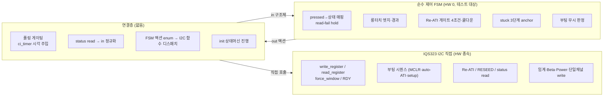
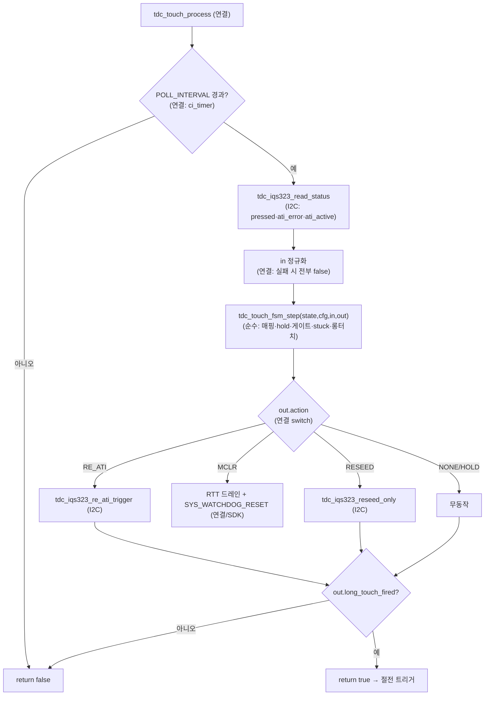

# 01 제어방법·경계 정리 (Rev.2 간결)

**TL;DR**: FullATI 단순안 8대 제어를 간결 구현 관점에서 정리한다. 핵심 경계는 **순수 제어 로직(HW 0, 입력→출력 결정론, 유닛테스트 대상)** 과 **IQS323 I2C 직접 접근(레지스터 read/write, RDY 윈도우, Sys_Delay·GPIO)** 둘뿐이며 그 사이에 vtable·port·mock·어댑터 추상은 **0**이다. 순수 로직에 들어가는 것: ① 노말 폴링 FSM(pressed→상태·롱터치 엣지·read-fail hold), ② Re-ATI 게이트 4조건(노터치 AND ATI Active==0 AND ATI Error AND 쿨다운경과), ③ stuck 3단계 에스컬레이션(30/60/90초 → RESEED/Re-ATI/MCLR), ④ 부팅 무시 판정. I2C 직접에 들어가는 것: 부팅 시퀀스(MCLR→auto-ATI 폴링→ACK→sensor_setup→Full ATI write→Re-ATI), 단일채널 폐기(CRX1 disable·CRX0 방전 폐기), 임계·Beta·Power write, status read(`(pressed, ati_error, ati_active)`). 파일 윤곽 3개: `tdc_touch_fsm.{c,h}`(순수, HW 헤더 include 금지) · `tdc_iqs323.{c,h}`(I2C 직접, 현 드라이버 흡수·평탄화) · `tdc_touch.{c,h}`(얇은 연결: 폴링 게이팅·ci_timer 시각 주입·FSM 액션→I2C 호출 디스패치·main 진입점). 시간상수는 `tdc_touch_time.h` 1개(ms 정의 + 올림 파생 매크로). **포트·mock·다중 추상 없이 FSM이 I2C를 직접 부르지 않고 연결층이 중계**하는 평평한 3파일.

---

## 0. 범례·기준

- 라벨: [확정]=코드 명시 · [추정]=정적 추론 · [실측 게이트]=빌드/실기 필요 · [결정]=은수님/종합 노드 확정 필요.
- 코드 근거 [파일:라인]. 약어: `T`=tdc_touch.c, `Th`=tdc_touch.h, `D`=tdc_drv_iqs323.c, `Dh`=tdc_drv_iqs323.h, `Cfg`=tdc_touch_config.h, `M`=main.c.
- **제어방법 정본**: 99 종합 §2(레지스터)·§3(시퀀스) [99_종합_설계수렴.md]. **목표 동작**: B99 [B99_동작분석종합.md].
- **현 원점 코드 주의**: 현 `tdc_touch.c`는 Full ATI **미적용 develop 베이스라인**이다 — 롱터치만 있고 Re-ATI 게이트·stuck·read-fail hold가 **없으며** `(void)ati_error` 무시[T:393], CRX1_DUMMY·CRX0_DISCHARGE 기본 ON[Cfg:98·114]. B99/01 매핑 노드가 인용한 라인(T:224 게이트·T:252 stuck 등)은 Full ATI **구현 후** 코드라 현 원점에 없다. 본 정리는 "현 원점 → FullATI 단순안 목표" 재구현 경계를 잡는다.

---

## 1. FullATI 단순안 — 8대 제어 (간결 구현 관점)

99 §1.1 4대 축 + §3 시퀀스 + B99 §6을 간결 구현 단위로 재분해한다. 각 제어를 "순수(HW 0) / I2C 직접 / 연결" 중 어디에 두는지 한 줄로 못박는다.

| # | 제어 | 핵심 동작 (정본 근거) | 1차 배치 |
|---|---|---|---|
| 1 | **부팅 시퀀스** | MCLR 무조건 → auto-ATI(Full POR) 완료 폴링(2500ms 타임아웃) → ACK/confirm → sensor_setup(단일채널) → 임계·Beta·Power·Full ATI write → 부팅 Re-ATI 1회 → READY → 부팅 터치 재확인 [99 §3.1, B99 §2.1] | **I2C 직접**(시퀀스) + 연결(상태머신 진행) |
| 2 | **노말 폴링** | 200ms 게이팅 → status read → pressed→TOUCH/NOT_TOUCH 매핑 → read 실패 N회 hold 후 NOT_TOUCH 강제 → 롱터치 2400ms 엣지 판정 → true 시 절전 트리거 [99 §3.2, B99 §2.2] | **순수 FSM**(매핑·hold·롱터치) + 연결(게이팅·read 주입) |
| 3 | **Re-ATI 게이트** (급소) | `노터치 AND ATI Active==0 AND ATI Error==1 AND 쿨다운 경과` tick에서만 Re-ATI 발행. 터치 중 보류(경로_2 차단). 발행 후 약 2초 쿨다운 [99 §3.2 CAUTION, B99 §5.3] | **순수 FSM**(4조건 판정·쿨다운) + 연결(Re-ATI write 호출) |
| 4 | **stuck 3단계** | 터치 지속 30초→RESEED(bit3), 60초→Re-ATI(bit2), 90초→MCLR. 각 단계 30초 재카운트. 노터치/해제 시 리셋 [99 §3.3, B99 §5.4] | **순수 FSM**(단계·anchor 판정) + 연결(RESEED/Re-ATI/MCLR 호출) |
| 5 | **SW 타임아웃** | stuck의 시간 기반 카운트(노말 tick ms 차분). IC Channel Timeout 미사용(disable 유지) [99 §2.3, B99 §4.2] | **순수 FSM**(시간 차분 판정) — #4와 동일 함수 |
| 6 | **Beta/Power write** | 부팅 시 0xB0/B1/B2/B4 Beta·0xC0/C2/C5 Power·0x31 conversion 방어 write [99 §2.2·2.3] | **I2C 직접**(apply_settings 내 1회 write) |
| 7 | **단일채널** | CRX0 단독. CRX1 더미(CalCap) 폐기·CRX0 주기 방전 폐기. 0x40/0x44/0x70 reset [99 §2.4, 검토_3] | **I2C 직접**(sensor_setup 단순화 + discharge 제거) |
| 8 | **절전** | func_sleep ULP 200ms 웨이크 롱터치 2.2초 카운트→리셋. 절전 게이트·stuck 미관여(ULP 2.2초 전담). 절전 감도 단일화 [99 §3.4, B99 §2.3] | **순수 FSM**(롱터치 재사용, 옵션) + I2C 직접(절전 감도 write) |

> [!IMPORTANT]
> **제어 1~5·8은 99 종합 §3·B99에서 동작이 [확정]·[실측 게이트]까지 수렴**되어 있다. 본 Rev.2는 **이 동작을 1:1 보존**하되(회귀 0, 요구사항_4) 구조만 간결화한다. 임계 계수(12~24)·Beta 레지스터 정수·전류 등 다수 정량은 [실측 게이트]로 남되 본 경계 정리의 대상이 아니다(구현 시 상수 1곳 주입).

---

## 2. 경계 — 순수 제어 로직(HW 0) vs IQS323 I2C 직접

### 2.1 경계 원칙 (Rev.2 핵심 — 추상 0)

> [!IMPORTANT]
> **추상 경계는 단 하나의 약속뿐**: 순수 FSM은 `in 구조체`(상태·시각·플래그)를 받아 `out 구조체`(액션 enum·플래그)를 돌려준다. 연결층이 그 사이에서 ① I2C read 결과를 `in`으로 채우고 ② `out.action`을 보고 I2C 함수를 직접 부른다. **vtable·함수 포인터·port 헤더·mock 분리 0** — 연결층의 `switch(action)` 한 덩어리가 "추상"의 전부다. 순수 FSM은 `tdc_iqs323.h`를 **include하지 않는다**(컴파일러가 순수성 강제).

### 2.2 순수 제어 로직에 들어가는 것 (HW 0, 테스트 대상)

전부 "입력 구조체 → 출력 구조체" 결정론. `ci_timer_get_tick()`·`tdc_drv_iqs323_*`·`ci_printf`·`SYS_WATCHDOG_*` 호출 **0건**. 현 원점에서 비순수하게 묶인 패턴(함수 내부 static·tick 직접·드라이버 직접)을 [01 §1.1, 02 §1] 분리한다.

| 순수 로직 | 입력 | 출력 | 현 원점 대응 | 목표(99·B99) |
|---|---|---|---|---|
| **상태 매핑 + read-fail hold** | `read_ok, pressed, fail_cnt, cfg.hold` | `curr_state(TOUCH/NOT_TOUCH), action=HOLD?` | `tdc_touch_get_state` pressed 이분 [T:395~402] (hold 없음) | read 실패 N회 hold 후 NOT_TOUCH 강제 [99 §5, B99 §3 E6·E7] |
| **롱터치 엣지·경과** | `curr_state, tick_ms, cfg.long_ms, prev/anchor/latch(state)` | `long_touch_fired` | `proc_long_touch` 내부 static 3개·tick 직접 [T:78~132] | 2400ms 도달 1회 래치 [B99 §3 E3·E8] |
| **Re-ATI 게이트 4조건·쿨다운** | `curr_state, ati_error, ati_active, tick_ms, cooldown(state)` | `action=RE_ATI?` | (현 원점 없음 — Full ATI 미적용, `(void)ati_error` [T:393]) | 노터치 AND active0 AND error AND 쿨다운 [99 §3.2 급소, B99 §5.3] |
| **stuck 3단계 anchor** | `curr_state, tick_ms, cfg.stuck_ms, stage/anchor(state)` | `action=RESEED/RE_ATI/MCLR?` | (현 원점 없음) | 30/60/90초 에스컬레이션 [99 §3.3, B99 §5.4] |
| **부팅 무시 판정** | `boot_ignore, curr_state, tick_ms, cfg.warn_ms, 5s_warned(state)` | `boot_ignore_active, led_request, released_log` | `s_boot_touch_ignore` 분기 [T:352~367] (tick·led 직접) | 동등 보존 [B99 §3 E9·E10] |

> [!NOTE]
> **read 실패 입력 정규화 규칙(급소, [02 §1.3])**: 연결층이 read 실패 시 `read_ok=false, pressed=false, ati_error=false, ati_active=false`로 `in`을 채운다. 이로써 현 원점의 ATI 캐시 무효화·stale 누출 차단[목표 B99 §6.3]이 전역 캐시 없이 입력 단계에서 보장된다. 순수 FSM은 stale 캐시를 가질 수 없다.

### 2.3 IQS323 I2C 직접 접근에 들어가는 것 (HW 종속)

전부 I2C·RDY 윈도우·GPIO·Sys_Delay 종속이라 HW 비의존 불가 [01 §2]. 현 드라이버 전 함수가 여기 해당하나, Rev.2는 **추상 wrapper를 걷어내고 평탄화**한다(현 `tdc_drv_iqs323_*` 공개 wrapper가 내부 static을 1:1 감싸는 구조[D:921~929 등]를 단일 함수로 합침).

| I2C 직접 함수 | 역할 | 현 원점 [파일:라인] | Rev.2 변경 |
|---|---|---|---|
| `i2c_write/read`·`force_window_open`·`wait_rdy_window_closed`·`write_register`·`read_register` | I2C·RDY 저수준 | D:39·76·143·120·178·227 | **그대로 유지**(평탄·간결·이미 직접) |
| `mclr_reset` | MCLR 51ms 블로킹 | D:288 (wrapper D:921) | wrapper 제거, 단일 공개 |
| `read_status` | status read → `(pressed, ati_error, ati_active)` | D:1166 (2-out, 현 원점은 ati_active 미반환) | **3-out 확장**(ati_active 추가, 0xEEEE 글리치 검출 포함) |
| `apply_settings` | 부팅 설정 일괄 + 부팅 Re-ATI | D:1036 | **Full ATI화**: FIXED MULT/COMP write 폐기·0x36 0x08→0x0C·임계 계수<32·Beta/Power write 추가·부팅 Re-ATI 1회 추가 [99 §2·§3.1] |
| `sensor_setup` | 채널 셋업 | D:440 | **단일채널화**: CRX1 더미 분기 제거(0x40/0x44/0x70 reset)·CRX0 방전 폐기 [99 §2.4] |
| `re_ati_trigger` | Re-ATI bit2 write | D:569 (static) | **공개화**(게이트·stuck이 호출) [99 §5] |
| `reseed_only` (신설) | 순수 RESEED bit3 write | (없음 — 현 reseed[D:931]는 절전 감도 동반) | **신설**(절전 감도 미동반, stuck stage0 전용) [99 §3.3, B99 §0] |
| `apply_sleep_settings`·`reseed`(절전) | 절전 설정·감도 | D:967·931 | 절전 감도 단일화 정리 [99 §3.4] |

> [!NOTE]
> **현 원점 vs 목표 간극**: 현 원점 `read_status`는 2-out(`pressed, ati_error`)이고 `read_status_full`(3-out)은 아직 없다[D:1166]. `re_ati_trigger`는 static[D:569], `reseed_only`도 없다. 이들은 99 종합 §5 "신규 API 2종"·B99 §0이 요구하는 것으로, Rev.2 구현 시 `tdc_iqs323.c`에 신설/확장한다. 라인은 목표 기준 [실측 게이트: 구현].

### 2.4 연결층에 남는 것 (얇음, HW·시간 접착)

순수도 I2C 직접도 아닌 접착만. ci_timer·SDK 호출은 **전부 여기 격리**(순수 FSM 0건).

| 연결 책임 | 내용 | 현 원점 [파일:라인] |
|---|---|---|
| 폴링 게이팅 | `POLL_INTERVAL <= curr_tick - last` 비교, ci_timer 시각 읽기 | T:335·337 |
| 시각 주입 | `ci_timer_get_tick()` → FSM `in.tick_ms` | (현재 FSM 내부 호출, 분리 대상) |
| read → in 정규화 | `read_status` 호출 → `in` 채움(실패 시 false 정규화) | T:341 |
| 액션 디스패치 | `out.action` switch → I2C 함수 직접 호출 + MCLR 시 RTT 드레인·`SYS_WATCHDOG_RESET()` | (목표 B99 §2.2) |
| init 상태머신 | NONE→MCLR_DONE→READY 진행(HW 본질, [02 §1.1 NOTE]로 L2 밖) | T:289~331 |
| 절전 ULP 루프 연결 | func_sleep 웨이크당 read→FSM(또는 단순 카운트) | M:981~ (현 main.c) |

> [!CAUTION]
> **init 상태머신은 순수 FSM 밖**([02 §5.1]). MCLR·auto-ATI·apply_settings가 HW 본질이라 순수화 이득이 적고 복잡도만 늘린다. 연결층에 둔다. 순수 FSM은 **READY 이후 운용 폴링**만 담당(롱터치·게이트·stuck·매핑·부팅무시). 부팅 무시 판정은 순수(시각 비교)이나 진입 설정(READY 직후 터치 재확인)은 연결층이 첫 read로 수행 후 FSM에 set.

---

## 3. 2~3파일 분할 1차 윤곽

### 3.1 파일 구성 (3 + 상수헤더 1)

| 파일 | 성격 | 내용 | include 규칙 |
|---|---|---|---|
| **`tdc_touch_fsm.c` / `.h`** | 순수 FSM (HW 0) | step 함수·init·set_boot_ignore + 입력/출력/상태/cfg 구조체·액션 enum. §2.2 5개 순수 로직 | `<stdbool.h>`·`<stdint.h>`·`tdc_touch.h`(상태 enum)만. **HW·timer·printf·iqs323 헤더 include 금지** |
| **`tdc_iqs323.c` / `.h`** | I2C 직접 (HW 종속) | §2.3 — I2C·RDY 저수준 + 부팅 시퀀스·apply_settings(Full ATI)·sensor_setup(단일채널)·read_status(3-out)·re_ati_trigger(공개)·reseed_only(신설)·절전 | `hw.h`·`driver_i2c.h`·`ci_timer.h`·`ci_printf.h`. 현 `tdc_drv_iqs323` 흡수·평탄화 |
| **`tdc_touch.c` / `.h`** | 얇은 연결 + 진입점 | §2.4 — 폴링 게이팅·시각 주입·read→in·액션 디스패치·init 상태머신·`tdc_touch_init_begin`·`tdc_touch_process`·`tdc_touch_get_state` 공개 API(main 호환) | `tdc_touch_fsm.h`·`tdc_iqs323.h`·`ci_timer.h`·`hw.h`·`ci_printf.h` |
| **`tdc_touch_time.h`** | 시간 상수 (무가드) | ms 정의(POLL·LONG·STUCK·COOLDOWN·HOLD·BOOT_WARN·ULP) + 올림 파생 매크로 `TDC_TIME_TO_CNT` [04 §3.1] | (헤더 전용) |
| **`tdc_touch_config.h`** | 빌드 ON/OFF | 보드 변종·기능 토글만(시간 수치는 time.h로 이관) [04 §6] | (유지·정리) |

> [!NOTE]
> **3파일이 적정선**: ① 순수 FSM(테스트), ② I2C 직접(HW), ③ 연결(접착) — 요구사항_2의 L2/L1/L3 역할을 **파일 추상이 아니라 파일 분리**로만 표현(포트 헤더·vtable 없음). 시간상수는 헤더 1개로 분리해 "은수님이 ms만 바꾸면 동작"(요구사항_1)을 만족. config는 빌드 토글 전용으로 역할 축소. **합본 옵션**: 연결층 `tdc_touch.c`가 얇으면 FSM과 합쳐 2파일도 가능하나, 순수성 컴파일 강제(include 격리)를 위해 **FSM은 반드시 별도 파일**이어야 한다 → 최소 2파일(fsm + iqs323+연결 합본), 권장 3파일.

### 3.2 main.c 호출처 (변경 최소)

현 `tdc_touch_process()`·`tdc_touch_init_begin()`·`tdc_touch_get_state()` 공개 시그니처를 **그대로 유지**해 main.c 변경을 최소화한다(요구사항_4 회귀 0). 내부만 FSM+I2C로 재배선.

| main.c 위치 | 현 호출 | Rev.2 |
|---|---|---|
| func_normal while [목표 M:463] | `tdc_touch_process()` | 동일(내부: 게이팅→read→fsm_step→디스패치) |
| Initialize() | `tdc_touch_init_begin()` | 동일(내부: MCLR + init 상태머신 시작) |
| func_sleep ULP [목표 M:981~] | 인라인 카운트(`touch_cnt`) | `tdc_touch_get_state()` 유지 + FSM 롱터치 재사용은 옵션 [02 §4.3, 04 §4.3] |

### 3.3 순수 FSM ↔ 연결 ↔ I2C 1 tick 흐름 (노말)

---

## 4. Rev.1 폐기 항목 vs Rev.2 채택 (명시)

| 항목 | Rev.1 (폐기) | Rev.2 (채택) |
|---|---|---|
| HW 경계 | `port_read_status`·`port_re_ati` 등 **포트 vtable/함수포인터** [01 §2 L2 인터페이스 후보] | 연결층 `switch(action)` **직접 호출**(추상 0) |
| 테스트 | mock 분리 파일 | 순수 FSM의 `in/out` 구조체만으로 테스트(mock 불필요, 입력 주입) |
| 어댑터 | `tdc_touch_adapter_normal`·`_sleep` **별도 파일 2개** [04 §4.2·4.3] | 연결 `tdc_touch.c` 1파일(노말)·절전은 main.c 잔류 또는 옵션 |
| 레이어 명명 | L1/L2/L3 추상 레이어 | 파일 3개(순수/I2C/연결), 레이어 추상 명명 폐기 |
| 시간상수 | `tdc_touch_time.h` + cfg 주입 구조체 | **유지**(요구사항_1 — Rev.2도 채택, 04 §3 재활용) |
| 순수 FSM 로직 | `tdc_touch_fsm_step` 시그니처·상태/입출력 구조체 [02 §2] | **재활용**(포트·cfg 추상만 제거, 로직·구조체는 유지) |

> [!IMPORTANT]
> **Rev.1에서 살리는 것**: 02 노드의 순수 FSM 로직(상태머신·전이·액션 enum·상태 구조체)과 04 노드의 시간상수 자동 파생(`TDC_TIME_TO_CNT`·ms 정의)은 **그대로 재활용**한다. **버리는 것**: 포트 vtable·mock 분리·어댑터 2파일·L1/L2/L3 추상 명명. 즉 "순수 FSM은 유지, 그 주변 추상 포장만 제거"가 Rev.2의 본질이다.

---

## 5. 미해결·결정 필요·실측 게이트

| # | 항목 | 분류 | 후속 노드 |
|---|---|---|---|
| 1 | 연결층 `tdc_touch.c`를 별도로 둘지 FSM/I2C 어느 쪽에 합칠지 (2파일 vs 3파일) | [결정] | 02·03·04 설계 후 99 종합 |
| 2 | 절전 ULP 롱터치를 순수 FSM 재사용 vs main.c 단순 카운트 유지 | [결정] (요구사항_4 회귀 위험) | 04 연결 노드 |
| 3 | init 상태머신을 연결층 함수로 둘지, 별도 작은 모듈로 둘지 | [결정] | 04 연결 노드 |
| 4 | read_status 3-out 확장·re_ati_trigger 공개화·reseed_only 신설의 정확한 시그니처 | [실측 게이트: 구현] | 03 I2C 직접 노드 |
| 5 | 쿨다운 절대시각화 vs 카운트 유지 (read-hold 시 미세차) | [실측 게이트: 시뮬] | 02 순수 FSM 노드 |
| 6 | 임계 계수(12~24)·Beta 레지스터 정수·t_ati 등 정량 | [실측 게이트] | 구현 시 상수 1곳 주입 (본 경계 무관) |

> [!NOTE]
> 본 01은 **무엇이 순수·무엇이 I2C 직접·무엇이 연결인지의 경계와 3파일 1차 윤곽**까지만 확정한다. 순수 FSM의 시그니처 상세는 02, I2C 직접 함수 시그니처는 03, 연결·시간상수·main은 04 노드 소관이다. Rev.1의 02(FSM)·04(시간상수) 로직은 재활용하되 포트·어댑터·mock 추상은 전부 제거한다.
