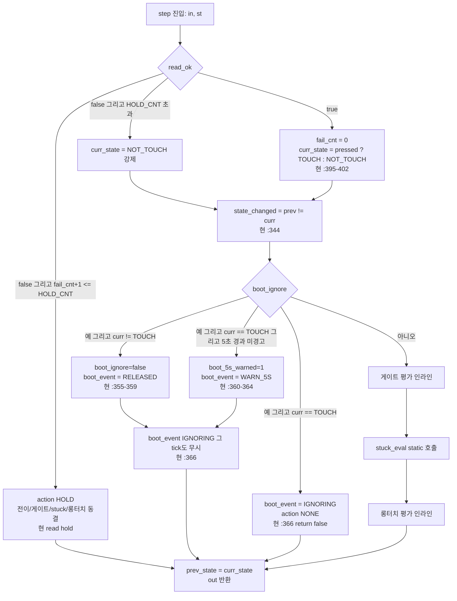

# 02 순수 제어 FSM 간결 설계 (Rev.2)

**TL;DR**: Rev.1 02 노드의 핵심 발상(단일 순수 함수 `step(state, in, out)` + 분산 static을 1구조체로 통합 + 쿨다운 절대시각화 + read 실패 입력 정규화로 stale 캐시 제거)은 **그대로 유지**하되, 간결화를 위해 ① `fsm_eval_*` 보조 함수 4분할을 **stuck만 1개 분리**(3단계 anchor 로직이 본문에 섞이면 가독성 손상)로 축소, ② cfg 7필드 구조체를 **컴파일 상수 직접 참조**(시간상수 헤더 `tdc_touch_logic.h`가 `tdc_touch_config.h` include)로 폐기, ③ out 8필드를 **5필드**(action·long_touch·curr_state·state_changed·boot_event)로 축소(로그 문자열은 호출측이 state 비교로 산출), ④ 파일명을 `tdc_touch_logic.c/.h`로 확정. HW·timer·printf #include 0건, 전역·static 0건(상태는 호출측 소유). 공개 함수 3개(`tdc_touch_logic_init`·`tdc_touch_logic_set_boot_ignore`·`tdc_touch_logic_step`) + 내부 static 1개(`stuck_eval`). 입력은 `{now_ms, read_ok, pressed, ati_error, ati_active}`, 출력은 액션 enum(NONE/HOLD/RE_ATI/RESEED/MCLR) + long_touch 불리언. 동작 동등 근거는 99 종합 §3 시퀀스·B99 §3 이벤트표 전수. 한자 0.

---

## 1. 설계 원칙 — Rev.1에서 무엇을 줄이는가

Rev.1 02 노드([02_L2순수FSM설계.md])는 테스트 입자를 최소화하려고 보조 함수 4개·cfg 7필드·out 8필드로 잘게 나눴다. Rev.2는 **밸리데이션 추적성 = "한눈에 읽히는 작은 함수"** 가 목표이므로, 과분할을 거두고 **명확성이 손상되는 지점만 분리**한다.

| 항목 | Rev.1 | Rev.2 (간결) | 근거 |
|---|---|---|---|
| 순수 보조 함수 | `fsm_eval_state`·`fsm_eval_re_ati_gate`·`fsm_eval_stuck`·`fsm_eval_long_touch` 4개 | **`stuck_eval` 1개만** static 분리. 나머지는 step 본문 인라인 | 게이트(4조건 1식)·롱터치(엣지 1식)는 본문 3~5줄이라 분리가 오히려 추적 분산. stuck은 3단계 anchor 갱신이라 분리 시 명확 |
| 시간상수 주입 | `cfg` 7필드 구조체 인자 | **폐기** — `tdc_touch_logic.h`가 `tdc_touch_config.h` include, 상수 직접 참조 | 노말 단일 시간축 우선(절전 L2 재사용은 03/04/99 옵션). cfg 구조체는 다중 인스턴스용인데 노말만이면 불필요 추상 |
| out 구조체 | 8필드(action·long_touch·state_changed·curr_state·prev_state·boot_ignore_active·boot_ignore_led_request·boot_released_log) | **5필드**(action·long_touch·curr_state·state_changed·boot_event) | 로그 3종(state_changed·boot_released·boot_5s)을 호출측이 `curr_state`/`boot_event` enum으로 산출 — printf는 호출측 책임이라 플래그 난립 불요 |
| 파일명 | `tdc_touch_fsm.c/.h` | **`tdc_touch_logic.c/.h`** | 오케 입력 권장명. "logic = 순수 제어"가 밸리데이션 팀에 직관 |
| 절전 모드 분기 | cfg `gate_enable`·`stuck_enable`로 양축 공유 | **1차 노말 전용**. 절전은 별도 단순 카운트(99 §3.4) | 절전 L2 재사용은 회귀 위험(요구사항_4 "절전 미변경"). 게이트/stuck 미적용 절전을 같은 step에 넣으면 분기 비용 > 재사용 이득 |

> [!IMPORTANT]
> **유지한 Rev.1 핵심 3가지(회귀 0의 급소)** — 간결화해도 이 3개는 절대 보존:
> 1. **read 실패 입력 정규화**: 호출측(연결층)이 read 실패 시 `read_ok=false, pressed=false, ati_error=false, ati_active=false`로 채워 넘긴다 → 순수 함수 안에 stale 캐시(`s_last_ati_error/active`) 0건 → "손가락 닿은 채 Re-ATI 누출" race 원천 차단(99 §1.2-나, B99 §6.2 "read 글리치 중 터치 유지"). 이게 **순수화의 가장 큰 실익**.
> 2. **쿨다운 절대시각화**: 카운트 감소(`s_cooldown--`)를 `re_ati_cooldown_until_ms` 절대시각 비교로. 폴링 등간격 전제 하 수학적 동등(B99 §4.3), 의미 결정론적.
> 3. **read hold "동결"의 의미**: read 실패 N회 이내면 상태머신 진입 자체를 스킵하고 `action=HOLD` 반환 — 게이트·stuck·롱터치 평가 0(B99 §3 E6 "상태 머신에 진입조차 안 함").

---

## 2. 파일·인터페이스 (시그니처 확정)

### 2.1 파일 구성

```
tdc_touch_logic.h   — 액션 enum · 입출력/상태 구조체 · 공개 함수 3개 선언 · 시간상수 재노출
tdc_touch_logic.c   — step 본문 + stuck_eval static 1개. HW·timer·printf #include 0.
```

`tdc_touch_logic.c`의 #include는 **`tdc_touch_logic.h`·`<stdbool.h>`·`<stdint.h>` 3개뿐**(순수성 컴파일 강제). `hw.h`·`ci_timer.h`·`ci_printf.h`·`tdc_drv_iqs323.h` 금지.

### 2.2 액션 enum (출력 — 연결층이 I2C 호출로 변환)

```c
/* tdc_touch_logic.h */
typedef enum
{
    TDC_TOUCH_ACT_NONE = 0,   /* 무동작 */
    TDC_TOUCH_ACT_HOLD,       /* read 실패 hold — 전이/게이트/stuck/롱터치 평가 동결 (현 :366 return false) */
    TDC_TOUCH_ACT_RE_ATI,     /* Re-ATI 발행 (게이트 드리프트 또는 stuck stage1) */
    TDC_TOUCH_ACT_RESEED,     /* RESEED 발행 (stuck stage0) */
    TDC_TOUCH_ACT_MCLR        /* MCLR 재부팅 (stuck stage2) */
} tdc_touch_act_t;
```

> [!NOTE]
> 99 종합 §3.2·§3.3, B99 §3 이벤트표(E5·S1·S2·S3)의 4종 HW 액션 + read hold 1종을 단일 enum으로. **롱터치는 액션이 아닌 불리언**(`out.long_touch`) — 현 코드에서 롱터치는 `process()`의 `return true`(절전 트리거)지 HW 액션이 아니다(현 `tdc_touch.c:372`). 게이트(NOT_TOUCH 전용)·stuck(TOUCH 전용)이 배타라 한 step에서 액션 충돌 0건(B99 §3 CAUTION) → 단일 필드 안전.

### 2.3 부팅 이벤트 enum (출력 — 로그 플래그 난립 대체)

```c
/* tdc_touch_logic.h — 호출측이 이 값으로 ci_printf 분기. out 불리언 3개를 1 enum으로 압축 */
typedef enum
{
    TDC_TOUCH_BOOT_NONE = 0,      /* 부팅 무시 구간 아님 (정상 폴링) */
    TDC_TOUCH_BOOT_IGNORING,      /* 부팅 터치 무시 중 — 상위가 입력 무시 (현 :366 return false) */
    TDC_TOUCH_BOOT_RELEASED,      /* 이번 step에 무시 해제 — 호출측 1회 로그 (현 :358) */
    TDC_TOUCH_BOOT_WARN_5S        /* 5초 경과 1회 — 호출측 1회 로그 + 보라 LED (현 :360~364) */
} tdc_touch_boot_event_t;
```

### 2.4 입력 구조체 (연결층이 채워 주입)

```c
typedef struct
{
    uint32_t now_ms;      /* 현재 절대시각 ms (ci_timer_get_tick() 주입). 모든 시간 판정의 단일 소스. */
    bool     read_ok;     /* read_status_full 성공 여부. false면 아래 3개 모두 false 정규화 (연결층 책임). */
    bool     pressed;     /* read_ok=true 시 유효: CH0 터치 눌림. */
    bool     ati_error;   /* read_ok=true 시 유효: ATI Error 보고(드리프트 신호, System Status bit6). */
    bool     ati_active;  /* read_ok=true 시 유효: ATI burst 진행 중(bit5). */
} tdc_touch_in_t;
```

> [!IMPORTANT]
> **연결층 책임(입력 정규화)**: read 실패 시 반드시 `read_ok=false, pressed=false, ati_error=false, ati_active=false`. 이로써 현 FullATI 코드의 캐시 무효화(B99 §2.2 "실패: 캐시 false 무효화")가 입력 단계에서 보장되고, 순수 함수는 stale을 가질 수 없다(전역 캐시 제거 = race 0).

### 2.5 출력 구조체 (연결층이 I2C 호출·로그로 변환)

```c
typedef struct
{
    tdc_touch_act_t        action;       /* 발행할 HW 액션 (연결층 → I2C) */
    bool                   long_touch;   /* 롱터치 발동 1회 (절전 트리거) — 현 process return true */
    tdc_touch_state_t      curr_state;   /* 이번 step 산출 상태 (호출측 로그·디버그) */
    bool                   state_changed;/* prev != curr (호출측 STATE 로그 트리거) — 현 :344 */
    tdc_touch_boot_event_t boot_event;   /* 부팅 무시 관련 이벤트 (호출측 로그/LED 분기) */
} tdc_touch_out_t;
```

### 2.6 상태 구조체 (현 분산 static 통합 — 단일 소유, 호출측이 보관)

```c
typedef struct
{
    /* --- 폴링 레벨 --- */
    tdc_touch_state_t prev_state;        /* 현 s_touch_state_old (:41) */
    int               read_fail_cnt;     /* read 연속 실패 횟수 (FullATI s_read_fail_cnt) */

    /* --- 부팅 무시 --- */
    bool              boot_ignore;       /* 현 s_boot_touch_ignore (:46) */
    uint32_t          boot_ready_ms;     /* 현 s_boot_ready_tick (:47) */
    bool              boot_5s_warned;    /* 현 s_boot_5s_warned (:48) */

    /* --- 롱터치 (현 proc_long_touch static 3종 :80~82) --- */
    uint32_t          first_touch_ms;    /* 터치 진입 시각 (현 s_tick_first_touch) */
    bool              long_latched;      /* 롱터치 발동 래치 (현 s_is_long_touch) */

    /* --- Re-ATI 게이트 (FullATI proc_re_ati_gate) --- */
    uint32_t          re_ati_cooldown_until_ms; /* 카운트(s_cooldown)→절대시각 만료 시점 */

    /* --- stuck 3단계 (FullATI proc_stuck_timeout) --- */
    uint32_t          stuck_anchor_ms;   /* stuck 단계 기준 시각 (현 s_stuck_tick0) */
    uint8_t           stuck_stage;       /* 0/1/2 (현 s_stage) */
} tdc_touch_logic_state_t;
```

> [!NOTE]
> Rev.1 대비 제거한 필드: `lt_prev_state`·`stuck_prev_state`는 **`prev_state` 1개로 통합** 가능 — 롱터치/stuck의 "TOUCH 진입 엣지" 판정은 `prev_state != TOUCH && curr_state == TOUCH`로 폴링 레벨 prev와 동일 의미(현 코드가 proc별 별도 static을 둔 건 함수 분리 부작용일 뿐, 폴링 1tick당 1회 순차 호출이라 값이 동일). `re_ati_cooldown_armed`(시각0 모호성)는 `until_ms` 초기값을 0으로 두고 `now_ms >= until_ms`면 항상 발행 가능으로 흡수(부팅 now_ms는 항상 >0이라 모호성 무해). **11필드 → 9필드**.

### 2.7 공개 함수 3개 (시그니처 확정)

```c
/* tdc_touch_logic.h */

/* 상태 초기화 (READY 전이 시 연결층 호출 — 현 try_finish_init :264~266 대응).
 * now_ms = READY 전이 시각 (boot_ready_ms 기준). */
void tdc_touch_logic_init(tdc_touch_logic_state_t *st, uint32_t now_ms);

/* 부팅 무시 진입 (READY 직후 터치 중이면 — 현 :321~324).
 * 연결층이 첫 read 결과로 부팅 터치 판정 후 호출. */
void tdc_touch_logic_set_boot_ignore(tdc_touch_logic_state_t *st, uint32_t now_ms);

/* 순수 step. 전역·HW·timer·printf 접근 0. 동일 입력 → 동일 출력 (st는 in-out).
 * 연결층이 폴링 tick 1회당 1회 호출. read 실패 시 in 정규화 전제. */
void tdc_touch_logic_step(tdc_touch_logic_state_t *st,
                          const tdc_touch_in_t    *in,
                          tdc_touch_out_t         *out);
```

> [!NOTE]
> Rev.1의 `cfg` 인자가 사라져 시그니처가 `(state, in, out)` 3인자로 더 평평하다. 시간상수는 `tdc_touch_logic.c`가 `tdc_touch_config.h`(또는 `tdc_touch.h`)의 매크로(`TDC_TOUCH_POLL_INTERVAL`·`LONG_TOUCH_MS`·`STUCK_TIMEOUT_MS`·`RE_ATI_COOLDOWN_MS`·`READ_FAIL_HOLD_CNT`·`BOOT_WARN_MS`)를 직접 참조. **상수만 바꾸면 동작 변경**(요구사항_1)은 컴파일 상수 참조로 만족.

---

## 3. step 본문 처리 순서 (현 동작 보존 — 회귀 0)

현 `tdc_touch_process()` READY 분기 + FullATI 추가 로직의 순서(get_state → read hold → state_changed → boot_ignore → 게이트 → stuck → 롱터치)를 그대로 평평하게 옮긴다.



### 3.1 게이트 평가 (본문 인라인 — 4조건 1식)

99 종합 §3.2 게이트 규칙: `노터치 AND ATI Active==0 AND ATI Error AND 쿨다운 경과`.

```c
/* step 본문 인라인 (별도 함수 불요 — 3줄) */
if (curr_state == TDC_TOUCH_STATE_NOT_TOUCH
    && !in->ati_active && in->ati_error
    && in->now_ms >= st->re_ati_cooldown_until_ms)
{
    out->action = TDC_TOUCH_ACT_RE_ATI;
    st->re_ati_cooldown_until_ms = in->now_ms + TDC_TOUCH_RE_ATI_COOLDOWN_MS;
}
```

> [!CAUTION]
> **터치 중 보류가 첫 조건**(`curr_state == NOT_TOUCH`)으로 흡수 — 경로_2(SW 강제 Re-ATI)가 터치를 노터치로 학습하는 급소(99 §3.2 CAUTION) 차단. 터치 중 ATI Error는 물리적 정상이라 무시. B99 §3 E5/E5'/E5''와 정합.

### 3.2 stuck 평가 (static `stuck_eval` 분리 — 3단계 anchor)

3단계 에스컬레이션(99 §3.3, B99 §4.2)은 anchor 갱신·stage 증가가 얽혀 본문에 두면 가독성 손상 → **유일하게 분리하는 보조 함수**.

```c
/* tdc_touch_logic.c — static. 순수(now_ms 인자). TOUCH 지속 STUCK_MS마다 단계 상승. */
static tdc_touch_act_t stuck_eval(tdc_touch_logic_state_t *st,
                                  tdc_touch_state_t curr_state, uint32_t now_ms)
{
#if (TDC_TOUCH_STUCK_TIMEOUT_MS > 0)
    if (curr_state != TDC_TOUCH_STATE_TOUCH)   /* 노터치/해제 → 리셋 (현 stuck early return) */
    {
        st->stuck_stage   = 0;
        st->stuck_anchor_ms = now_ms;
        return TDC_TOUCH_ACT_NONE;
    }
    if (st->prev_state != TDC_TOUCH_STATE_TOUCH)  /* TOUCH 진입 엣지 → anchor 기록 */
    {
        st->stuck_anchor_ms = now_ms;
        st->stuck_stage     = 0;
        return TDC_TOUCH_ACT_NONE;
    }
    if (TDC_TOUCH_STUCK_TIMEOUT_MS <= (now_ms - st->stuck_anchor_ms))
    {
        st->stuck_anchor_ms = now_ms;   /* 단계마다 30초 재카운트 */
        switch (st->stuck_stage)
        {
            case 0: st->stuck_stage = 1; return TDC_TOUCH_ACT_RESEED;  /* stage0→1 */
            case 1: st->stuck_stage = 2; return TDC_TOUCH_ACT_RE_ATI;  /* stage1→2 (게이트 우회) */
            default:                     return TDC_TOUCH_ACT_MCLR;     /* stage2→재부팅 */
        }
    }
#else
    (void) st; (void) curr_state; (void) now_ms;
#endif
    return TDC_TOUCH_ACT_NONE;
}
```

> [!NOTE]
> `STUCK_TIMEOUT_MS == 0`이면 stuck 비활성(현 FullATI 가드 `#if (... && STUCK_MS>0)` 보존, B99 §0). RTT 드레인 20ms busy(현 stuck stage2)는 **부수효과**라 순수에서 제외 → 연결층이 `action==MCLR` 수신 시 드레인 후 `SYS_WATCHDOG_RESET()`(B99 §3 S3 CAUTION).

### 3.3 롱터치 평가 (본문 인라인 — 엣지 + 경과 1식)

현 `proc_long_touch`(:78~132)를 `prev_state` 기반 엣지로 압축. B99 §3 E1~E3/E8.

```c
/* step 본문 인라인 */
if (curr_state == TDC_TOUCH_STATE_TOUCH)
{
    if (st->prev_state != TDC_TOUCH_STATE_TOUCH)   /* 진입 엣지 → 시각 기록·래치 해제 */
    {
        st->first_touch_ms = in->now_ms;
        st->long_latched   = false;
    }
    else if (!st->long_latched
             && TDC_TOUCH_LONG_TOUCH_MS <= (in->now_ms - st->first_touch_ms))
    {
        st->long_latched = true;
        out->long_touch  = true;   /* 1회 래치 — 절전 트리거 */
    }
}
else
{
    st->long_latched = false;   /* 해제 → 다음 진입 위해 래치 해제 (현 :112) */
}
```

> [!IMPORTANT]
> **ms 차분 비교 유지**(`LONG_TOUCH_MS <= now_ms - first_touch_ms`) — 카운트 비교로 바꾸지 않는다(폴링 지터 누적 회귀 차단, 04 §3.3 IMPORTANT, B99 §4.2 "ms 절대시간 차분이라 누적 오차 없음"). stuck 30초도 동일하게 ms 차분 유지.

---

## 4. 이벤트 → 전이·액션표 (B99 §3 전수 보존)

| # | 이벤트 | 입력(in) | curr_state | out.action / long_touch | 보존 근거 |
|---|---|---|---|---|---|
| E1 | 노터치→터치 | read_ok,pressed=1 | TOUCH | NONE / false (stuck anchor 기록·stage0, first_touch 기록) | B99 §3 E1 |
| E2 | 터치 유지(<LT) | read_ok,pressed=1 | TOUCH | NONE / false (stuck 누적, lt 미달) | B99 §3 E2 |
| E3 | 터치 유지(=LT 도달) | read_ok,pressed=1 | TOUCH | NONE / **true** (long_latched=1) | B99 §3 E3 |
| E4 | 터치 해제 | read_ok,pressed=0 | NOT_TOUCH | NONE / false (stuck 리셋, lt 래치 해제) | B99 §3 E4 |
| E5 | 드리프트 발행 | read_ok,pressed=0,error=1,active=0,쿨다운만료 | NOT_TOUCH | **RE_ATI** / false (until_ms=now+cooldown) | B99 §3 E5 |
| E5' | 쿨다운 중 | …,now < until_ms | NOT_TOUCH | NONE / false | B99 §3 E5' |
| E5'' | ATI 진행 중 | …,active=1 | NOT_TOUCH | NONE / false | B99 §3 E5'' |
| E6 | read 실패(≤N) | read_ok=0, fail+1≤N | (미설정) | **HOLD** / false (동결) | B99 §3 E6 |
| E7 | read 실패(>N) | read_ok=0, fail+1>N | NOT_TOUCH 강제 | NONE / false (게이트 error=0이라 미발행, stuck 리셋, lt 해제) | B99 §3 E7 |
| E9 | 부팅 무시(터치 지속) | boot_ignore=1,pressed=1 | TOUCH | NONE / false (boot_event=IGNORING, 게이트·stuck·lt 차단) | B99 §3 E9 |
| E10 | 부팅 무시 해제 | boot_ignore=1,curr!=TOUCH | NOT_TOUCH | NONE / false (boot_event=RELEASED, 그 tick도 무시) | B99 §3 E10 |
| S1 | stuck 30초(0→1) | TOUCH, anchor 경과≥STUCK_MS | TOUCH | **RESEED** / false (anchor 갱신, stage=1) | B99 §3 S1 |
| S2 | stuck 60초(1→2) | TOUCH 추가 STUCK_MS | TOUCH | **RE_ATI** / false (stage=2, 게이트 우회) | B99 §3 S2 |
| S3 | stuck 90초(2→MCLR) | TOUCH 추가 STUCK_MS | TOUCH | **MCLR** / false (드레인은 연결층) | B99 §3 S3 |

> [!NOTE]
> **부팅 무시 진입 차단 순서**: boot_ignore=1이면 게이트/stuck/롱터치 평가 전에 early 반환(현 `:366 return false`). 즉 E9/E10 시 step은 boot_event 설정 후 즉시 `out` 채우고 종료 — mermaid 3절 `J`/`K` 경로. 게이트·stuck·lt 미평가.

---

## 5. 유닛테스트 용이성 (밸리데이션 팀 작성 대상 — 구조만 제공)

순수 함수라 호스트(PC) 컴파일·실행 가능. mock·port 0건이므로 테스트는 **구조체 채우고 step 호출 후 out 검사**가 전부.

```c
/* 테스트 골격 예시 (밸리데이션 팀 작성) */
tdc_touch_logic_state_t st;
tdc_touch_logic_init(&st, 0);

tdc_touch_in_t  in  = { .now_ms = 200, .read_ok = true, .pressed = true };
tdc_touch_out_t out = { 0 };
tdc_touch_logic_step(&st, &in, &out);
assert(out.curr_state == TDC_TOUCH_STATE_TOUCH);
assert(out.long_touch == false);
```

대표 케이스(밸리데이션 팀 확장):

| 케이스 | 주입 | 기대 out |
|---|---|---|
| 게이트 발행 | NOT_TOUCH, error=1, active=0, 쿨다운 만료 | action=RE_ATI |
| 게이트 차단(터치 중) | pressed=1, error=1 | action=NONE (curr=TOUCH) |
| stuck 3단계 | TOUCH 지속, now_ms를 STUCK_MS·2×·3× 주입 | RESEED → RE_ATI → MCLR 순차 |
| read hold | read_ok=0 N회 → N+1회 | HOLD×N, 이후 curr=NOT_TOUCH·long_latched=0 |
| 쿨다운 | 발행 후 now_ms < / ≥ until_ms | 차단 / 재발행 |
| 롱터치 엣지 | NOT_TOUCH→TOUCH, LONG_TOUCH_MS 도달 | long_touch=true 1회만 |

> [!NOTE]
> `now_ms`를 인자로 직접 주입하므로 시간을 자유 조작(테스트 결정론). 전역·static 0이라 `st`만 매 테스트 새로 초기화하면 격리 완벽. 이게 Rev.2 간결 구조의 테스트 실익 — Rev.1 mock 추상 없이도 동일 테스트 가능.

---

## 6. 미해결·결정 필요·실측 게이트

1. **시간상수 위치**: `tdc_touch_config.h`(빌드가드)와 별도로 `RE_ATI_COOLDOWN_MS`·`BOOT_WARN_MS`를 어디 둘지 — Rev.2 간결 원칙상 `tdc_touch.h`에 인라인(헤더 1개)이 적합. 04 연결·시간상수 노드가 확정. [결정 필요 — 04 노드]
2. **쿨다운 절대시각 vs 카운트 동등성**: read hold 중 시각이 흐르는 미세 차이(Rev.1 02 §3.4) — 절대시각화 권장하나 read hold 시나리오 동등성은 05 검증·실기 확인. [실측 게이트: 시뮬 테스트]
3. **절전 L2 재사용 범위**: 1차 노말 전용(2.6 NOTE). 절전 롱터치(2.2초 카운트)를 같은 logic으로 흡수할지는 03/04/99 합의. 회귀 위험 고려 시 절전은 별도 단순 카운트 권장. [결정 필요 — 99 노드]
4. **`prev_state` 단일 통합 검증**: 롱터치/stuck의 엣지 판정을 폴링 레벨 `prev_state` 1개로 통합(2.6 NOTE). 현 코드가 proc별 별도 static을 둔 게 함수 분리 부작용일 뿐임을 05 검증에서 cross-check(폴링 1tick 1회 순차 호출 전제 확인). [검증 필요 — 05 노드]
5. **부팅 무시 진입 read 실패 상호작용**: E10 해제 판정은 `curr != TOUCH`인데 read 실패(E7 강제 NOT_TOUCH) 시 잘못 해제될 수 있음 — 현 코드(`:355` "read 실패 시 해제 판정 보류")와 동등하려면 boot_ignore 분기는 `read_ok && curr != TOUCH`여야. step 본문에서 보존 확인. [회귀 확인 — 05 노드]
